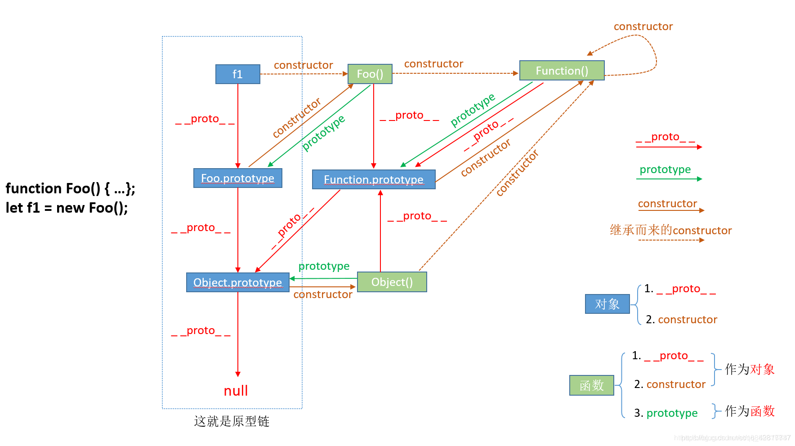
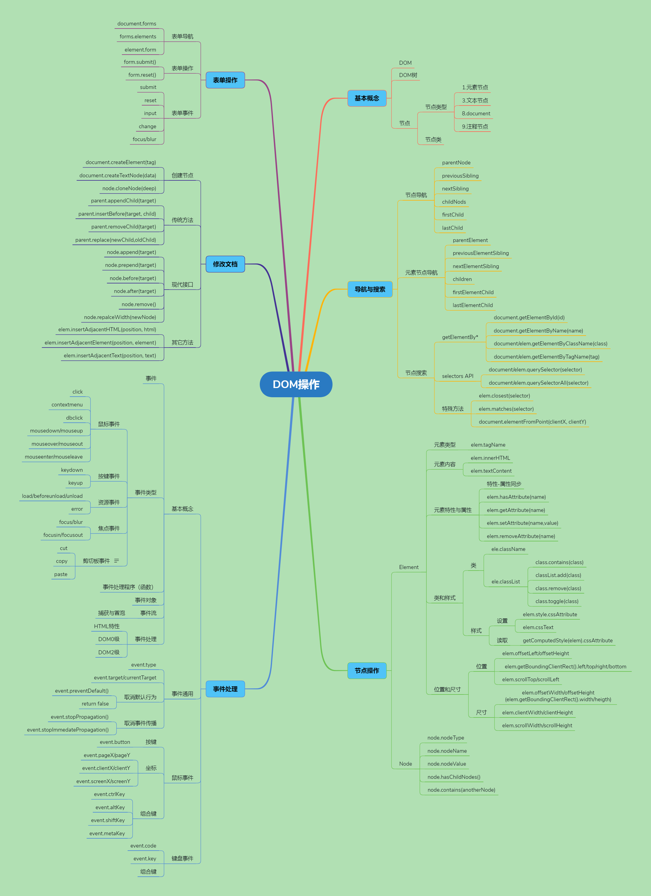

# js基础语法问题

- [持久化存储](#持久化存储)
- [for-in,for-of,foreach 区别](#for-in,for-of,foreach区别)
- [arguments,...values,callee,caller,this,call,apply,bind 用法](#arguments,...values,callee,caller,this,call,apply,bind用法)
- [height 和 top 与 y](#height和top与y)
- [delete 操作符](#delete操作符)
- [变量的解构赋值](#变量的解构赋值)
- [深入理解promise](#深入理解promise)
- [可迭代对象](#可迭代对象)
- [reflect](#reflect)
- [深冻结](#深冻结)
- [数组的理解](#数组的理解)
- [MutationObserver](#MutationObserver)
- [blob](#blob)
- [webApi](#webApi)
- [全部替代一个子串为另一个子串](#全部替代一个子串为另一个子串)
- [isNaN和Number.isNaN函数的区别](#isNaN和Number.isNaN函数的区别)
- [reduce用法](#reduce用法)
- [获取图片原始宽高](#获取图片原始宽高)
- [JSON](#JSON)
- [parseInt与Number](#parseInt与Number)
- [DOM操作大全](#DOM操作大全)
- [代码简洁化](#代码简洁化)
- [元素包含与点击元素外面](#元素包含与点击元素外面)
- [IntlAPI与ECMAScript攻略](#IntlAPI与ECMAScript攻略)
- [特殊事件与自定义事件](#特殊事件与自定义事件)
- [媒体查询匹配](#媒体查询匹配)
- [iframe](#iframe)
- [IntersectionObserver](#IntersectionObserver)
- [getComputedStyle](#getComputedStyle)

---

### 持久化存储

1. 参考链接：

  [持久化存储与 HTTP 缓存](https://www.jianshu.com/p/71163b408940)

  [理解 cookie、session、localStorage、sessionStorage 之不同](https://blog.csdn.net/qq_35585701/article/details/81393361)

  [浏览器数据库 IndexedDB 入门教程](http://www.ruanyifeng.com/blog/2018/07/indexeddb.html)

  [「2021」高频前端面试题汇总之浏览器原理篇](https://juejin.cn/post/6916157109906341902/)

2. 详解：

  - LocalStorage

    关闭浏览器后，数据不会丢失

    ```js
    //1. 添加键、值
    localStorage.setItem(key, value);
    //2. 获得键、值
    localStorage.getItem(key);
    //3.清空localStorage
    localStorage.clear();
    ```

    特点：

    - LocalStorage 跟 HTTP 无关，发送请求不会带上 LocalStorage 的值
    - 只有相同域名的页面才能互相读取 LocalStorage
    - 每个域名 localStorage 最大存储量为 5Mb 左右（每个浏览器不一样）
    - 常用场景：浏览器端储存数据（不能记录密码等敏感信息）
    - LocalStorage 永久有效，除非用户清理缓存

  - SessionStorage

    会话结束后，数据丢失

    ```js
    //1. 添加键、值
    sessionStorage.setItem(key, value);
    //2. 获得键、值
    sessionStorage.getItem(key);
    //3.清空sessionStorage
    sessionStorage.clear();
    ```

    特点同上

  - indexdb

    - 描述

      IndexedDB 就是浏览器提供的本地数据库，它可以被网页脚本创建和操作。IndexedDB 允许储存大量数据，提供查找接口，还能建立索引。这些都是 LocalStorage 所不具备的。就数据库类型而言，IndexedDB 不属于关系型数据库（不支持 SQL 查询语句），更接近 NoSQL 数据库。

    - 特点

      1. 键值对储存

        IndexedDB 内部采用对象仓库（object store）存放数据。所有类型的数据都可以直接存入，包括 JavaScript 对象。对象仓库中，数据以"键值对"的形式保存，每一个数据记录都有对应的主键，主键是独一无二的，不能有重复，否则会抛出一个错误。

      2. 异步

        IndexedDB 操作时不会锁死浏览器，用户依然可以进行其他操作，这与 LocalStorage 形成对比，后者的操作是同步的。异步设计是为了防止大量数据的读写，拖慢网页的表现。

      3. 支持事务（transaction）

        IndexedDB 支持事务（transaction），这意味着一系列操作步骤之中，只要有一步失败，整个事务就都取消，数据库回滚到事务发生之前的状态，不存在只改写一部分数据的情况。

      4. 同源限制

        IndexedDB 受到同源限制，每一个数据库对应创建它的域名。网页只能访问自身域名下的数据库，而不能访问跨域的数据库。

      5. 储存空间大

        IndexedDB 的储存空间比 LocalStorage 大得多，一般来说不少于 250MB，甚至没有上限。

      6. 支持二进制储存

        IndexedDB 不仅可以储存字符串，还可以储存二进制数据（ArrayBuffer 对象和 Blob 对象）。

    - 储存路径

      1. windows 版本

      C:\Users\用户\AppData\Local\Google\Chrome\User Data\Default\IndexedDB

      2. linux 版本

      /home/用户/.config/google-chrome/Default/IndexedDB/

    - 操作

      ```js
      //打开数据库
      var request = window.indexedDB.open(databaseName, version);
      request.onerror = function (event) {
        console.log("数据库打开报错");
      };
      var db;
      request.onsuccess = function (event) {
        db = request.result;
        console.log("数据库打开成功");
      };
      var db;
      //如果指定的版本号，大于数据库的实际版本号，就会发生数据库升级事件(数据库从无到有的新建过程也触发此事件)
      request.onupgradeneeded = function (event) {
        //新建数据库
        db = event.target.result;
        //新建表
        var objectStore;
        if (!db.objectStoreNames.contains("person")) {
          objectStore = db.createObjectStore(
            "person",
            { keyPath: "id" }, //主键是id
            { autoIncrement: true } //自增
          );
          //创建索引
          objectStore.createIndex("name", "name", { unique: false });
          objectStore.createIndex("email", "email", { unique: true });
        }
      };
      //通过事务添加数据
      function add() {
        var request = db
          .transaction(["person"], "readwrite")
          .objectStore("person")
          .add({
            id: 1,
            name: "张三",
            age: 24,
            email: "zhangsan@example.com",
          });

        request.onsuccess = function (event) {
          console.log("数据写入成功");
        };

        request.onerror = function (event) {
          console.log("数据写入失败");
        };
      }
      //读取数据
      function read() {
        var transaction = db.transaction(["person"]);
        var objectStore = transaction.objectStore("person");
        var request = objectStore.get(1);

        request.onerror = function (event) {
          console.log("事务失败");
        };

        request.onsuccess = function (event) {
          if (request.result) {
            console.log("Name: " + request.result.name);
            console.log("Age: " + request.result.age);
            console.log("Email: " + request.result.email);
          } else {
            console.log("未获得数据记录");
          }
        };
      }
      //遍历数据
      function readAll() {
        var objectStore = db.transaction("person").objectStore("person");

        objectStore.openCursor().onsuccess = function (event) {
          var cursor = event.target.result;

          if (cursor) {
            console.log("Id: " + cursor.key);
            console.log("Name: " + cursor.value.name);
            console.log("Age: " + cursor.value.age);
            console.log("Email: " + cursor.value.email);
            cursor.continue();
          } else {
            console.log("没有更多数据了！");
          }
        };
      }
      //更新数据
      function update() {
        var request = db
          .transaction(["person"], "readwrite")
          .objectStore("person")
          .put({ id: 1, name: "李四", age: 35, email: "lisi@example.com" });

        request.onsuccess = function (event) {
          console.log("数据更新成功");
        };

        request.onerror = function (event) {
          console.log("数据更新失败");
        };
      }
      //删除数据
      function remove() {
        var request = db
          .transaction(["person"], "readwrite")
          .objectStore("person")
          .delete(1);

        request.onsuccess = function (event) {
          console.log("数据删除成功");
        };
      }
      //使用索引
      var transaction = db.transaction(["person"], "readonly");
      var store = transaction.objectStore("person");
      var index = store.index("name");
      var request = index.get("李四");

      request.onsuccess = function (e) {
        var result = e.target.result;
        if (result) {
          // ...
        } else {
          // ...
        }
      };
      ```

  - Cookie

    Cookie 是存放在浏览器端的数据，每次都随请求发送给 Server。存储 cookie 是浏览器提供的功能。cookie 其实是存储在浏览器中的纯文本，浏览器的安装目录下会专门有一个 cookie 文件夹来存放各个域下设置的 cookie。

    * 特点：

    - 服务器通过 Set-Cookie 头给客户端一串字符串
    - 客户端每次访问相同域名的网页时，必须带上这段字符串
    - 客户端要在一段时间内保存这个 Cookie
    - Cookie 默认在用户关闭页面后就失效，代码可以任意设置 Cookie 的过期时间，max-age 和 Expires
    - 大小大概在 4kb 以内

    * Cookie字段组成：

      * Name：cookie的名称
      * Value：cookie的值，对于认证cookie，value值包括web服务器所提供的访问令牌；
      * Size： cookie的大小
      * Path：可以访问此cookie的页面路径。 比如domain是abc.com，path是/test，那么只有/test路径下的页面可以读取此cookie。
      * Secure： 指定是否使用HTTPS安全协议发送Cookie。使用HTTPS安全协议，可以保护Cookie在浏览器和Web服务器间的传输过程中不被窃取和篡改。该方法也可用于Web站点的身份鉴别，即在HTTPS的连接建立阶段，浏览器会检查Web网站的SSL证书的有效性。但是基于兼容性的原因（比如有些网站使用自签署的证书）在检测到SSL证书无效时，浏览器并不会立即终止用户的连接请求，而是显示安全风险信息，用户仍可以选择继续访问该站点。
      * Domain：可以访问该cookie的域名，Cookie 机制并未遵循严格的同源策略，允许一个子域可以设置或获取其父域的 Cookie。当需要实现单点登录方案时，Cookie 的上述特性非常有用，然而也增加了 Cookie受攻击的危险，比如攻击者可以借此发动会话定置攻击。因而，浏览器禁止在 Domain 属性中设置.org、.com 等通用顶级域名、以及在国家及地区顶级域下注册的二级域名，以减小攻击发生的范围。
      * HTTP： 该字段包含HTTPOnly 属性 ，该属性用来设置cookie能否通过脚本来访问，默认为空，即可以通过脚本访问。在客户端是不能通过js代码去设置一个httpOnly类型的cookie的，这种类型的cookie只能通过服务端来设置。该属性用于防止客户端脚本通过document.cookie属性访问Cookie，有助于保护Cookie不被跨站脚本攻击窃取或篡改。但是，HTTPOnly的应用仍存在局限性，一些浏览器可以阻止客户端脚本对Cookie的读操作，但允许写操作；此外大多数浏览器仍允许通过XMLHTTP对象读取HTTP响应中的Set-Cookie头。
      * Expires/Max-size ： 此cookie的超时时间。若设置其值为一个时间，那么当到达此时间后，此cookie失效。不设置的话默认值是Session，意思是cookie会和session一起失效。当浏览器关闭(不是浏览器标签页，而是整个浏览器) 后，此cookie失效。

    * 总结

      服务器端可以使用 Set-Cookie 的响应头部来配置 cookie 信息。一条cookie 包括了5个属性值 expires、domain、path、secure、HttpOnly。其中 expires 指定了 cookie 失效的时间，domain 是域名、path是路径，domain 和 path 一起限制了 cookie 能够被哪些 url 访问。secure 规定了 cookie 只能在确保安全的情况下传输，HttpOnly 规定了这个 cookie 只能被服务器访问，不能使用 js 脚本访问。

    ```js
    function setCookie(cname, cvalue, exdays) {
      var d = new Date();
      d.setTime(d.getTime() + exdays * 24 * 60 * 60 * 1000);
      var expires = "expires=" + d.toGMTString();
      document.cookie = cname + "=" + cvalue + "; " + expires;
    }

    function getCookie(cname) {
      var name = cname + "=";
      var ca = document.cookie.split(";");
      for (var i = 0; i < ca.length; i++) {
        var c = ca[i].trim();
        if (c.indexOf(name) == 0) return c.substring(name.length, c.length);
      }
      return "";
    }

    function delete(cname) {
      var date = new Date();
      date.setTime(date.getTime() - 10000);
      document.cookie = cname + "=; expires =" + date.toGMTString();
    }
    ```

  - Session

    Session 是基于 Cookie 实现的，它利用一个 sessionId 把用户的敏感数据隐藏起来，在 Set-Cookie 上，使用随机数来做 sessionId,最终只是把这串随机数暴露给外界，而真正的信息却保存在了服务器端的 sessions 对象里面。它就像一个密码簿一样，有效的信息与 sessionId 一一对应,当下次用户访问该网站的其他页面的时候，就会带着登录时服务器给的这个 sessionId。

    特点：

    - 将 SessionID（随机数）通过 Cookie 发给客户端
    - 客户端访问服务器时，服务器读取 SessionID
    - 服务器有一块内存（哈希表）保存了所有 session
    - 通过 SessionID 可以得到对应用户的隐私信息
    - 这块内存（哈希表）就是服务器上的所有 session

  - 注意

    cookie、localstorage、sessionstorage 不可跨域：在不同同源 url 下，获取到不同的数据，只有同源 url 才共享数据。

### for-in,for-of,foreach 区别

1. 参考链接：

   [for、for in 和 for of 和 forEach 的区别](http://blog.sina.com.cn/s/blog_c112a2980102xqg9.html)

2. 详解：

   - for 一般用于循环数组
   - for-in 可循环数组、对象，会循环出下标、键值，可通过 data[key]访问
   - for-of 在 Array、Object、Set、Map 中都可以使用，会循环出值，直接访问 value 即可
   - forEach 循环在 Array、Set、Map 中都可以使用，用法：\*\*.forEach(function(value,key){})

### arguments,...values,callee,caller,call,apply,bind 用法

1. 参考链接：

   [callee、caller、call、apply、bind 这些方法的含义和使用](https://blog.csdn.net/yc123h/article/details/52729484)

   [Javascript arguments 详解](https://www.cnblogs.com/caoyc/p/5735299.html)

   [JS 中 this 到底指向谁？](https://www.cnblogs.com/huangwentian/p/6854472.html)

   [彻底搞懂 JS 中 this 机制](https://blog.csdn.net/cjgeng88/article/details/79846670)

   [ECMAScript 6 入门](http://es6.ruanyifeng.com/#docs/function)

   [jQuery 源码中大量 push.call();splice.call();](https://www.jianshu.com/p/3d837e8d817d)

   [前端面试题——自己实现 call 和 apply](https://zhuanlan.zhihu.com/p/83523272)

   [JavaScript 直接调用函数与 call 调用的区别](https://blog.csdn.net/q5706503/article/details/82893277)

   [JS 中 new 运算符的实现原理](https://www.cnblogs.com/YiNongLee/p/9336609.html)

   [js 手动实现 new 方法](https://www.jianshu.com/p/9cee6a703e01)

   [前端面试大厂手写源码系列（上）](https://juejin.im/post/5e77888ff265da57187c7278#heading-8)

   [8 个原生 JS 知识点 | 面试高频](https://mp.weixin.qq.com/s/tIasEjYJRaVqFMN_aVtpiw)

   [一张图看懂Function和Object的关系及简述instanceof运算符](https://www.cnblogs.com/shuiyi/p/5343399.html)

   [面试造火箭，看下这些大厂原题](https://juejin.im/post/6859121743869509646)

   [详细讲解new一个对象的过程，含详细constructor, __proto__, prototype 关系图](https://blog.csdn.net/qq_42817747/article/details/100916833)

2. 详解：

   - arguments

   arguments 用在函数内部,arguments.length 表示传入参数的个数，arguments.callee.length 表示函数自身参数的个数，可用 for in 或 for of 或 for 0~length-1 遍历参数

   ```js
   function add(a, b) {
     console.log(arguments, arguments.length, arguments.callee.length);
   }
   //add(1,2,3)
   //Arguments(3) [1, 2, 3, callee: ƒ, Symbol(Symbol.iterator): ƒ]
   // 3
   // 2
   ```

   - ...values

   ...values 是 es6 语法，可替代 arguments，数组储存传入的参数,for of 遍历参数较为方便

   ```js
   function add(...values) {
     console.log(values);
   }
   add(1, "a", [0], { a: 1 }, function () {});
   //[1, "a", Array(1), {…}, ƒ]
   ```

   - callee

   callee 指向函数自身，用在函数内部，用于解耦或配合 arguments 使用

   ```js
   //正常递归
   function factorial(num) {
     if (num <= 1) {
       return 1;
     } else {
       return num * factorial(num - 1);
     }
   }
   //下面的不规范行为，导致函数指向错误
   var testFactorial = factorial;
   factorial = function () {
     return 0;
   };
   testFactorial(5); //0
   //修改方法
   function factorial(num) {
     if (num <= 1) {
       return 1;
     } else {
       return num * arguments.callee(num - 1);
     }
   }

   var testFactorial = factorial;
   factorial = function () {
     return 0;
   };
   console.log(testFactorial(5)); //120
   ```

   - caller

   caller 用法是：函数名.caller，如果函数是顶层函数（没有外层函数调用），则为 null，如果有外层函数，则指向外层函数。

   ```js
   function outer() {
     inner();
   }
   function inner() {
     console.log(inner.caller);
   }
   outer(); //显示outer的源代码
   ```

   - this

     this 指向的对象为函数的上下文 context，即函数的调用者。

     - 默认绑定：window 回调函数:函数名()调用或 window 函数回调（setTimeout、setInterval），this 指向 window
     - 隐式绑定：多层调用链:函数作为数组的一个元素，通过数组下标调用，this 指向这个数组，对象 1.对象 2.函数名()调用，this 指向对象 2
     - new 绑定：函数作为构造函数，用 new 关键字调用，this 指向新 new 出的对象
     - 显式绑定:call,apply 导致 this 指向第一个参数指定的地方，对于 null 和 undefined 的绑定将不会生效
     - 箭头函数只取决于外层（函数或全局）的作用域，对于前面的 4 种绑定规则是不会生效，因此需要外层 var that = this，供箭头函数内部使用

     注意：function 中嵌 function，this 全指向 window。使用 axios 和\$ajax 对象，需保存外部 this，避免指向对象本身。

   - call,apply

     call,apply 用于改变函数执行的作用域，即改变函数体内 this 的指向。区别在于：call 的第二个参数起要逐一列出，apply 第二个参数可以是 array 或 arguments

     ```js
     window.color = "red";
     var o = {
       color: "blue",
     };
     function sayColor(color) {
       console.log(this.color + " param:" + color);
     }
     sayColor("black"); //red param:black

     sayColor.call(window, "black"); //red param:black
     sayColor.apply(window, ["black"]); //red param:black

     sayColor.call(o, "black"); //blue param:black
     sayColor.apply(o, ["black"]); //blue param:black
     ```

     - 合并数组

       ```js
       var arr1 = [1, 2, 3];
       var arr2 = [4, 5, 6];
       var arr3 = Array.prototype.push.call(arr1, arr2);
       console.log(arr3);
       console.log(arr1);
       console.log(arr2);
       4(4)[(1, 2, 3, Array(3))](3)[(4, 5, 6)];

       var arr1 = [1, 2, 3];
       var arr2 = [4, 5, 6];
       var arr3 = Array.prototype.push.apply(arr1, arr2);
       console.log(arr3);
       console.log(arr1);
       console.log(arr2);
       6(6)[(1, 2, 3, 4, 5, 6)](3)[(4, 5, 6)];

       //造成输出的区别，是因为call的第二个参数起是枚举，apply的第二个参数是数组
       var arr1 = [1, 2, 3];
       var arr2 = [4, 5, 6];
       var arr3 = Array.prototype.push.call(arr1, ...arr2);
       console.log(arr3);
       console.log(arr1);
       console.log(arr2);
       4(6)[(1, 2, 3, 4, 5, 6)](3)[(4, 5, 6)];
       ```

     - 对象转数组

       ```js
       var obj = { 0: "hello", 1: "world", length: 2 };
       console.log(Array.prototype.slice.call(obj));
       (2)[("hello", "world")];

       var obj = { 0: "hello", 1: "world", length: 2 };
       console.log(Array.prototype.slice.apply(obj));
       (2)[("hello", "world")];
       ```

     - 获取索引

       ```js
       var arr = [1, 2, 3];
       console.log(Array.prototype.indexOf.call(arr, 2));
       1;

       var arr = [1, 2, 3];
       console.log(Array.prototype.indexOf.apply(arr, [2]));
       1;
       ```

     - 自己实现 call 和 apply

        ```js
        var person = {
          fullName: function (txt) {
            console.log(txt + this.firstName + " " + this.lastName);
          },
        };
        var person1 = {
          firstName: "John",
          lastName: "Doe",
        };
        person.fullName.call(person1, "Hello, ");
        person.fullName.apply(person1, ["Hello, "]);
        Function.prototype.myOwnCall = function (context) {
          context = context || window; //如果第一个参数传入的是null的情况下，this会指向window
          //防止与原对象方法重名
          var uniqueID = "00" + Math.random();
          while (context.hasOwnProperty(uniqueID)) {
            uniqueID = "00" + Math.random();
          }
          context[uniqueID] = this; //记录为调用的函数
          //Array.from(arguments).slice(1)
          var args = [];
          for (var i = 1; i < arguments.length; i++) {
            args.push("arguments[" + i + "]");
          }
          var result = eval("context[uniqueID](" + args + ")"); //传入参数，执行函数，处理函数返回值
          delete context[uniqueID]; //清除给原对象新增的方法
          return result;
        };
        Function.prototype.myOwnApply = function (context, arr) {
          context = context || window; //如果第一个参数传入的是null的情况下，this会指向window
          //防止与原对象方法重名
          var uniqueID = "00" + Math.random();
          while (context.hasOwnProperty(uniqueID)) {
            uniqueID = "00" + Math.random();
          }
          context[uniqueID] = this; //记录为调用的函数

          var args = [];
          var result = null;

          if (!arr) {
            result = context[uniqueID](); //没有第二个参数的情况
          } else {
            //有第二个参数的情况
            //Array.from(arguments).slice(1)
            for (var i = 0; i < arr.length; i++) {
              args.push("arr[" + i + "]");
            }
            result = eval("context[uniqueID](" + args + ")");
          }
          delete context[uniqueID]; //清除给原对象新增的方法
          return result;
        };
        person.fullName.myOwnCall(person1, "Hello, ");
        person.fullName.myOwnApply(person1, ["Hello, "]);
        Function.prototype._apply = function (targetObject, argsArray) {
            // 是否传入执行上下文，若没有指定，则指向 window
            targetObject = targetObject || window;
            // 若是没有传递，则置为空数组
            argsArray = argsArray || [];
            // 利用Symbol的特性，设置为key
            const targetFnKey = Symbol("key");
            // 将调用_apply的函数赋值
            targetObject[targetFnKey] = this;
            // 执行函数，并在删除之后返回
            const result = targetObject[targetFnKey](...argsArray);
            delete targetObject[targetFnKey];
            return result;
        };
        Function.prototype._call = function (targetObject, ...argsArray) {
            // 是否传入执行上下文，若没有指定，则指向 window
            targetObject = targetObject || window;
            // 利用Symbol的特性，设置为key
            const targetFnKey = Symbol("key");
            // 将调用_call的函数赋值
            targetObject[targetFnKey] = this;
            // 执行函数，并在删除之后返回
            const result = targetObject[targetFnKey](...argsArray);
            delete targetObject[targetFnKey];
            return result;
        };
        ```


    * 直接调用与call、apply区别
    
        1. 情景1：使用自身对象不存在的方法，无法直接调用，如arguments想使用Array.prototype.slice
    
        2. 情景2：改变this指向，产生于直接调用不同的结果
    
            ```js
            var x = "我是全局变量";
            function a(){
                this.x = "我是在函数类结构a中声明的哦";
            }
            function f(){
                alert (this.x);
            }
            f();//输出：“我是全局变量”
            f.call(new a());//输出：“我是在函数类结构a中声明的哦”
            ```
    
        3. 情景3：上面2种情况都不是，和直接调用没区别
    
    * bind
    
    bind方法会创建一个函数实例,this会被绑定到传给bind()函数的值
    
    f.bind(obj)，实际上可以理解为obj.f()
    
    从第二个参数起，会依次传递给原始函数
    
    ```js
    window.color = 'red'
    var o = {
        color:'blue'
    }
    function sayColor(color){
        console.log(this.color)
    }
    var objSayColor = sayColor.bind(o);
    objSayColor(); //blue
    ```
    
    ```js
    // 方法一，只可绑定，不可传参
    Function.prototype.my_bind = function(context){
        var self = this;
        return function(){
            self.apply(context,arguments);
        }
    }
    Function.prototype.my_bind = function() {
        // 保存原函数
        var self = this,
        // 保存需要绑定的this上下文(获取传入的第一个参数),等价于 context = [].shift.call(arguments);
        context = Array.prototype.shift.call(arguments),
        // 剩余的参数转为数组
        args = Array.prototype.slice.call(arguments);
        // 返回一个新函数
        return function() {
            //处理a.my_bind(b, 7, 8)(9)多次传参的情况;
            //此处的arguments与上方的arguments，不是同一个arguments
            self.apply(context, Array.prototype.concat.call(args, Array.prototype.slice.call(arguments)));
        }
    }
    Function.prototype.my_bind = function(context,...args) {
        var self = this;
        context = context || window;
        args = args || [];
        return function(...rest) {
            self.apply(context, args.concat(rest));
        }
    }
    ```
    
    * new
    
        constructor, __proto__, prototype 关系图:

        

        new运算符背后的步骤：
    
        * 创建一个空对象
        * 链接到原型
        * 绑定this值
        * 返回新对象
    
        ```js
        class a1{
          constructor(val){
            this.val = val
            this.a1 = function(){
              console.log(this.val)
            }
          }
          a2(){

          }
        }
        function a(val){
          this.val = val;
          this.a1 = function(){
            console.log(this.val)
          }
        }
        a.prototype.a2 = function(){}
        let b = new a1(1);
        let c = _new(a,1);//传a1会报错，es6的class必须new，否则apply报错:Uncaught TypeError: Class constructor a1 cannot be invoked without 'new'
        console.log(b,c)
        ```
        ```js
        function create(){
            //创建一个空对象
            let obj = new Object();
            //获取构造函数
            let fn = [].shift.call(arguments);
            //链接到原型
            obj.__proto__ = fn.prototype;
            //绑定this值
            let result = fn.apply(obj,arguments);//使用apply，将构造函数中的this指向新对象，这样新对象就可以访问构造函数中的属性和方法
            //返回新对象
            return typeof result === "object" ? result : obj;//如果返回值是一个对象就返回该对象，否则返回构造函数的一个实例对象
        }
        ```
        ```js
        function _new() {
            let target = {};
            let [constructor, ...args] = [...arguments];
            console.log(constructor,args)
            target.__proto__ = constructor.prototype;
            let result = constructor.apply(target,args);
            if(result && (typeof result == 'object' || typeof result == 'function')) return result;
            return target;
        }
        ```

    * typeof

    对于 typeof, 可以正确判断除了null之外的所有基本类型，而对于引用类型，除了函数外其他都会被判断为object。
    ```js
    // 输出 function
    console.log(typeof (() => {}))

    // 输出 object
    console.log(typeof ['前端有的玩','公众号'])

    // 输出 object
    console.log(typeof null)

    // 输出 undefined
    console.log(typeof undefined)

    // 输出 function 
    console.log(typeof Function.prototype)
    ```
    
    * instanceof
  
      简写:a instanceof b ,判断a是否b的实例，即a从b处new出来
      ```js
      a.__proto__ == b.prototype 或
      a.constructor == b
      ```
  
      详细:[]是Array实例，也是Object实例
      ```js
      function instanceOf(left,right) {
          let proto = left.__proto__;
          let prototype = right.prototype;
          while(true) {
              if(proto === null) return false
              if(proto === prototype) return true
              proto = proto.__proto__;
          }
      }
      ```

      对于instanceof,无法判断基本类型，但可以正确判断引用类型
      ```js
      Function instanceof Object;//true
      Object instanceof Function;//true
      
      //①构造器Function的构造器是它自身
      Function.constructor=== Function;//true

      //构造器Object的构造器是Function（由此可知所有构造器的constructor都指向Function）
      Object.constructor === Function;//true

      //③构造器Function的__proto__是一个特殊的匿名函数function() {}
      console.log(Function.__proto__);//function() {}

      //这个特殊的匿名函数的__proto__指向Object的prototype原型。
      Function.__proto__.__proto__ === Object.prototype//true

      //Object的__proto__指向Function的prototype，也就是上面③中所述的特殊匿名函数
      Object.__proto__ === Function.prototype;//true
      Function.prototype === Function.__proto__;//true

      Function.__proto__.__proto__ === Object.prototype;//true
      Object.__proto__ === Function.prototype;//true

      //1、所有的构造器的constructor都指向Function
      //2、Function的prototype指向一个特殊匿名函数，而这个特殊匿名函数的__proto__指向Object.prototype

      // 输出 false
      console.log('子君' instanceof String)

      // 输出 true
      console.log(new Date() instanceof Date)
      ```
    
    * object.create
    
      会将参数对象作为一个新创建的空对象的原型, 并返回这个空对象，且继承原对象
  
      使用方式
      ```js
      function Person(name, sex) {
        this.name = name;
        this.sex = sex;
      }
      Person.prototype.getInfo = function() {
        console.log('getInfo: [name:' + this.name + ', sex:' + this.sex + ']');
      }
      var a = new Person('jojo', 'femal');
      var b = Object.create(Person.prototype, {
        name: {
          value: 'coco',
          writable: true,
          configurable: true,
          enumerable: true,
        },
        sex: {
          enumerable: true,
          get: function(){ return 'hello sex'},
          set: function(val){console.log('set value:' + val)}
        }
      });
      console.log(a,b)
      ```
      手写
      ```js
      function _create(obj){
          function C(){}
          C.prototype = obj;
          return new C();
      }
  
      var obj1 = {name: "Lilei"};
      var lilei = _create(obj1);
      lilei; // {}
      lilei.name; // "Lilei"
      ```

### height 和 top 与 y

1. 参考链接：

   [Measuring Element Dimension and Location with CSSOM in Windows Internet Explorer 9](<https://docs.microsoft.com/en-us/previous-versions/hh781509(v=vs.85)>)

   [getBoundingClientRect 的用法](https://www.cnblogs.com/Songyc/p/4458570.html)

   [js 窗口尺寸获取常用属性](https://blog.csdn.net/csdnxcn/article/details/77886499)

   [mousedown和mousemove的时候，offsetX和offsetY坐标不准确](https://blog.csdn.net/qlingsu/article/details/109103944)

2. 详解：

   外层蓝色父元素与包裹内层红色子元素，虚线与实线间为 margin，深色区为 border-width，内虚线到深色区为 padding，内层灰色区为滚动区。

   
   
   

   - object.getBoundingClientRect()

     获取元素相对于视窗的位置集合，集合中有 top, right, bottom, left 等属性。

     

   - height 相关

     - box-sizing:border-box 怪异模式

       totalHeight=contentHeight(padding 向内收)+margin

     - box-sizing:content-box 标准模式

       totalHeight=contentHeight+padding(padding 向外张)+border+margin

   - scroll 相关

     - scrollTop:距离滚动区顶部距离
     - scrollHeight:滚动区高度

   - offset 相关

     - offsetTop:距离父元素顶部距离(不包含边线)
     - offsetHeight:距离父元素顶部距离(包含边线)
     - offsetY:指针距离元素顶部距离(不含 border，旋转不变)

        - mousedown和mousemove的时候，offsetX和offsetY坐标不准确问题

          ```js
          mousedownEvent(event){
            let rect = event.currentTarget.getBoundingClientRect();
            let offsetX = event.clientX - rect.left;
            let offsetY = event.clientY - rect.top;
          }
          mousemoveEvent(event) {
            let left = event.clientX - offsetX;
            let top = event.clientY - offsetY;
          }
          ```

        - touch不存在offsetX问题(无法直接获取触摸点在元素中哪个位置)

          ```js
          touchstartEvent(enent){
            //touches[0]表示触摸的第一只手指
            let offsetX = event.touches[0].clientX - event.currentTarget.getBoundingClientRect().x;
          }
          //touches: TouchList
          //0: Touch
          //clientX: 852
          //clientY: 702.6666870117188
          //force: 1
          //identifier: 0
          //pageX: 852
          //pageY: 702.6666870117188
          //radiusX: 15.333333015441895
          //radiusY: 15.333333015441895
          //rotationAngle: 0
          //screenX: 639
          //screenY: 697
          ```

   - layer 相关

     - layerY:指针距离元素顶部距离(含 border，旋转不变)

   - client 相关

     - clientTop:边框厚度，相当于 borderTopWidth
     - clientHeight:包含 padding 的内容高度，不包括滚动
     - clientY:指针距离可视区顶部距离

   - page 相关

     - pageY:指针距离文档顶部距离

   - screen 相关

     - screenY:指针距离屏幕顶部距离

   - y:指针相对于当前文档 y 坐标

   - 实践(视频进度条与音量条)

      ```html
      <template>
        <div class="my-video" ref="videoComponent">
          <video class="video-content" :src="src" ref="videoContent"></video>
          <p class="video-title">{{title}}</p>
          <div class="video-control">
              <div class="video-start" @click="play()" v-show="!playing">始</div>
              <div class="video-stop" @click="pause()" v-show="playing">停</div>
              <div class="video-next">下</div>
              <div class="video-now">{{now}}</div>
              <div class="video-progress" @mousedown.stop="mousedownProgress($event)" ref="progress">
                  <div class="progress-bar" :style="{width:progress +'%'}">
                      <div class="progress-button" @mousedown.stop="mousedownProgressButton($event)"></div>
                  </div>
              </div>
              <div class="video-total">{{total}}</div>
              <div class="video-voice" @click.stop="showVoice = !showVoice">
                  <div class="voice-box" @click.stop="" v-if="showVoice">
                      <p class="voice-number">{{voice}}</p>
                      <div class="voice-bg" @mousedown.stop="mousedownVoice($event)" ref="voice">
                          <div class="voice-bar" :style="{height:voice +'%'}">
                              <div class="voice-botton" @mousedown.stop="mousedownVoiceButton($event)"></div>
                          </div>
                      </div>
                  </div>
              </div>
              <div class="video-full" @click="full()" v-show="!fullscreen">全</div>
              <div class="video-exit" @click="exit()" v-show="fullscreen">退</div>
          </div>
        </div>
      </template>

      <script>
      export default {
        name: 'my-video',
        props: {
            title: [String],
            src: [String]
        },
        data() {
            return {
                playing: false,
                fullscreen: false,
                nowTimer: null,
                now: 0,
                progress: 0,
                total: 100,
                voice: 0,
                showVoice: false
            };
        },
        methods: {
            openFullscreen(element) {
                if (element.requestFullscreen) {
                    element.requestFullscreen();
                } else if (element.mozRequestFullScreen) {
                    element.mozRequestFullScreen();
                } else if (element.msRequestFullscreen) {
                    element.msRequestFullscreen();
                } else if (element.webkitRequestFullscreen) {
                    element.webkitRequestFullScreen();
                }
            },
            exitFullScreen() {
                if (document.exitFullscreen) {
                    document.exitFullscreen();
                } else if (document.mozCancelFullScreen) {
                    document.mozCancelFullScreen();
                } else if (document.msExitFullscreen) {
                    document.msExiFullscreen();
                } else if (document.webkitCancelFullScreen) {
                    document.webkitCancelFullScreen();

                } else if (document.webkitExitFullscreen) {
                    document.webkitExitFullscreen();
                }
            },
            play() {
                this.$refs.videoContent.play();
                this.playing = true;
                this.nowTimer = setInterval(() => {
                    this.getCurrentTime();
                    this.getProgress();
                },1000);
            },
            pause() {
                this.$refs.videoContent.pause();
                this.playing = false;
                clearInterval(this.nowTimer);
            },
            getDuration() {
                let video = this.$refs.videoContent;
                let getVideo = setInterval(()=>{
                    if (!isNaN(video.duration)) {
                        let total = parseInt(video.duration);
                        let integer = parseInt(total / 60);
                        let decimal = total - integer * 60;
                        this.total = (integer < 10 ? "0" + integer : integer) + ":" + (decimal < 10 ? "0" + decimal : decimal);
                        //console.log(video.duration);
                        clearInterval(getVideo);
                    } else {
                        this.total = '正在获取时长...';
                        console.log('正在获取时长...');
                    }
                }, 100);
            },
            getCurrentTime() {
                let now = parseInt(this.$refs.videoContent.currentTime);
                let integer = parseInt(now / 60);
                let decimal = now - integer * 60;
                this.now = (integer < 10 ? "0" + integer : integer) + ":" + (decimal < 10 ? "0" + decimal : decimal);
            },
            getProgress() {
                this.progress = (this.$refs.videoContent.currentTime * 100 / this.$refs.videoContent.duration).toFixed(2);
            },
            setProgress(percent) {
                this.progress = percent;
                if (this.progress > 100) {
                    this.progress = 100;
                }
                else if (this.progress < 0) {
                    this.progress = 0;
                }
                this.$refs.videoContent.currentTime = parseInt(this.$refs.videoContent.duration / 100 * this.progress);
                this.getCurrentTime();
            },
            mousedownProgress(event) {
                let progressPercent = (event.offsetX * 100 / this.$refs.progress.clientWidth).toFixed(2);
                this.setProgress(progressPercent);
                
                let oldX = event.screenX;
                let oldProgress = this.progress;
                let oldTime = new Date().getTime();
                
                document.onmousemove = (e) => {
                    let nowTime = new Date().getTime();
                    if (nowTime - oldTime > 100) {
                        oldTime = nowTime;

                        let newX = e.screenX;
                        let left = newX - oldX;
                        let progressMovePercent = parseFloat(oldProgress) + parseFloat((left * 100 / this.$refs.progress.clientWidth).toFixed(2));
                        this.setProgress(progressMovePercent);
                    }
                };
                document.onmouseup = (e) => {
                    document.onmousemove = null;
                    document.onmouseup = null;
                };
            },
            mousedownProgressButton(event) {
                let oldX = event.screenX;
                let oldProgress = this.progress;
                let oldTime = new Date().getTime();

                document.onmousemove = (e) => {
                    let nowTime = new Date().getTime();
                    if (nowTime - oldTime > 100) {
                        oldTime = nowTime;

                        let newX = e.screenX;
                        let left = newX - oldX;
                        let progressMovePercent = parseFloat(oldProgress) + parseFloat((left * 100 / this.$refs.progress.clientWidth).toFixed(2));
                        this.setProgress(progressMovePercent);
                    }
                };
                document.onmouseup = (e) => {
                    document.onmousemove = null;
                    document.onmouseup = null;
                };
            },
            getVolume() {
                this.voice = this.$refs.videoContent.volume * 100;
            },
            setVolume(volume) {
                this.voice = volume;
                if (this.voice > 100) {
                    this.voice = 100;
                }
                else if (this.voice < 0) {
                    this.voice = 0;
                }
                this.$refs.videoContent.volume = (this.voice / 100).toFixed(2);
            },
            mousedownVoice(event) {
                let rect = event.currentTarget.getBoundingClientRect();
                //let volume = parseInt((this.$refs.voice.clientHeight - event.offsetY) * 100 / this.$refs.voice.clientHeight);
                let volume = parseInt(this.$refs.voice.clientHeight - (event.clientY - rect.top));
                //console.log(event.offsetY, this.$refs.voice.clientHeight, volume, event.clientY - rect.top)
                this.setVolume(volume);

                let oldY = event.screenY;
                let oldVoice = this.voice;
                let oldTime = new Date().getTime();

                document.onmousemove = (e) => {
                    let nowTime = new Date().getTime();
                    if (nowTime - oldTime > 100) {
                        oldTime = nowTime;

                        let newY = e.screenY;
                        let top = oldY - newY;
                        let volumeMove = parseInt(oldVoice) + parseInt(top * 100 / this.$refs.voice.clientHeight);
                        this.setVolume(volumeMove);
                    }
                };
                document.onmouseup = (e) => {
                    document.onmousemove = null;
                    document.onmouseup = null;
                };
            },
            mousedownVoiceButton(event) {
                let oldY = event.screenY;
                let oldVoice = this.voice;
                let oldTime = new Date().getTime();

                document.onmousemove = (e) => {
                    let nowTime = new Date().getTime();
                    if (nowTime - oldTime > 100) {
                        oldTime = nowTime;

                        let newY = e.screenY;
                        let top = oldY - newY;
                        let volumeMove = parseInt(oldVoice) + parseInt(top * 100 / this.$refs.voice.clientHeight);
                        this.setVolume(volumeMove);
                    }
                };
                document.onmouseup = (e) => {
                    document.onmousemove = null;
                    document.onmouseup = null;
                };
            },
            full() {
                this.openFullscreen(this.$refs.videoComponent);
                this.fullscreen = true;
            },
            exit() {
                this.exitFullScreen(this.$refs.videoComponent);
                this.fullscreen = false;
            }
        },
        mounted() {
            this.getDuration();
            this.getCurrentTime();
            //console.log(this.$refs.videoContent.volume);
        },
        beforeDestory() {
            clearInterval(this.nowTimer);
        }
      }
      </script>

      <!-- Add "scoped" attribute to limit CSS to this component only -->
      <style scoped lang="scss">
      .my-video {
          width: 1200px;
          margin: 0 auto;
          position: relative;

          .video-content {
              display: block;
              width: 100%;
              height: 100%;
          }

          .video-title {
              position: absolute;
              z-index: 1;
              top: 0;
              left: 0;
          }

          .video-control {
              position: absolute;
              z-index: 1;
              bottom: 0;
              left: 0;
              display: flex;
              width: 100%;
              height: 32px;
              background: rgba(0,0,0,.5);
              cursor: pointer;

              .video-start {
                  width: 24px;
                  height: 24px;
                  background: #ff0000;
              }

              .video-stop {
                  width: 24px;
                  height: 24px;
                  background: #00ff21;
              }

              .video-next {
                  width: 24px;
                  height: 24px;
                  background: #ffffff;
              }

              .video-now {
                  font-size: 12px;
                  color: #FFFFFF;
                  font-weight: bold;
              }

              .video-progress {
                  width: 600px;
                  height: 6px;
                  background: rgba(255,255,255,0.4);
                  border-radius: 3px;

                  .progress-bar {
                      background: #00AAFF;
                      height: 6px;
                      width: 0%;
                      border-radius: 3px;
                      position: relative;

                      .progress-button {
                          width: 8px;
                          height: 16px;
                          background: #FFFFFF;
                          box-shadow: 0 0 8px 0 rgba(0,170,255,0.50);
                          border-radius: 2px;
                          position: absolute;
                          right: -8px;
                          top: -5px;
                          z-index: 3;
                      }
                  }
              }

              .video-total {
                  font-size: 12px;
                  color: #FFFFFF;
                  font-weight: bold;
              }

              .video-voice {
                  width: 24px;
                  height: 24px;
                  background: #00AAFF;
                  position: relative;

                  .voice-box {
                      position: absolute;
                      width: 24px;
                      height: 160px;
                      background: rgba(0,0,0,.6);
                      border-radius: 2px;
                      bottom: 39px;
                      left: 0;
                      padding: 2px 0;
                      display: flex;
                      flex-direction: column;
                      align-items: center;

                      .voice-number {
                          width: 24px;
                          height: 24px;
                          color: #fff;
                          line-height: 24px;
                          font-size: 12px;
                          text-align: center;
                          margin-bottom: 2px;
                      }

                      .voice-bg {
                          width: 8px;
                          height: 100px;
                          background-color: #fff;
                          display: flex;
                          flex-direction: column-reverse;

                          .voice-bar {
                              width: 8px;
                              background-color: #08f;
                              position: relative;

                              .voice-botton {
                                  width: 14px;
                                  height: 14px;
                                  position: absolute;
                                  border-radius: 14px;
                                  background-color: #fff;
                                  top: -7px;
                                  left: -3px;
                                  cursor: pointer;
                              }
                          }
                      }
                  }
              }

              .video-full {
                  width: 24px;
                  height: 24px;
                  background: #ff6a00;
              }

              .video-exit {
                  width: 24px;
                  height: 24px;
                  background: #ff6a00;
              }
          }
      }
      </style>
      ```


### delete 操作符

1. 参考链接：

   [delete 操作符](https://developer.mozilla.org/zh-CN/docs/Web/JavaScript/Reference/Operators/delete)

2. 详解：

   ```js
   //delete 操作符用于删除对象的某个属性；如果没有指向这个属性的引用，那它最终会被释放。
   //delete object.property
   //delete object['property']
   //对于所有情况都是true，除非属性是一个自己不可配置的属性，在这种情况下，非严格模式返回 false。
   //不可设置的(Non-configurable)属性不能被移除。Math, Array, Object内置对象的属性以及使用Object.defineProperty()方法设置为不可设置的属性不能被删除,返回false。
   //非对象类型，使用delete会返回false。
   const Employee = {
     firstname: "John",
     lastname: "Doe",
   };

   console.log(Employee.firstname);
   // expected output: "John"

   delete Employee.firstname;

   console.log(Employee.firstname);
   // expected output: undefined
   ```


### 变量的解构赋值

1. 参考链接：

   - [变量的解构赋值](http://es6.ruanyifeng.com/#docs/destructuring)

2. 详解

   ES6 允许等号双方按照相同格式，从数组和对象中提取值，对变量进行赋值，这被称为解构

   ```js
   //数组
   let [a, b, c] = [1, 2, 3];
   a;//1
   let [foo, [[bar], baz]] = [1, [[2], 3]];
   baz;//3
   let [ , , third] = ["foo", "bar", "baz"];
   third;//"baz"
   let [x, y, ...z] = ['a'];
   x;//"a"
   y;//undefined 解构不成功为undefined
   z;//[]
   let [foo] = 1;//报错
   let [x, y, z] = new Set(['a', 'b', 'c']);
   x;//"a"
   let [foo = true] = [];
   foo;//true 因为使用了默认值
   let [x = 1] = [undefined];
   x；//1
   let [x = 1] = [null];
   x；//null 对null不生效

   //对象
   let { foo, bar } = { foo: 'aaa', bar: 'bbb' };
   foo；//"aaa"
   let x;
   {x} = {x: 1};// SyntaxError: syntax error
   let x;
   ({x} = {x: 1});
   x;//1

   //字符串
   const [a, b, c, d, e] = 'hello';
   a；//"h"
   let {length : len} = 'hello';
   len；//5

   //数值和布尔值
   let {toString: s} = 123;
   s === Number.prototype.toString;//true
   let {toString: s} = true;
   s === Boolean.prototype.toString;//true
   let { prop: x } = undefined;//TypeError 右边无法转换为对象
   let { prop: y } = null;//TypeError 右边无法转换为对象

   //函数参数
   function add([x = 0, y = 1]){
       return x + y;
   }
   add([1, 2]);//3

   //圆括号报错
   let [(a)] = [1];//error
   let {x: (c)} = {};//error
   let ({x: c}) = {};//error
   let {(x: c)} = {};//error
   let {(x): c} = {};//error
   let { o: ({ p: p }) } = { o: { p: 2 } };//error
   function f([(z)]) { return z; }//error
   function f([z,(x)]) { return x; }//error
   ({ p: a }) = { p: 42 };//error
   ([a]) = [5];//error
   [({ p: a }), { x: c }] = [{}, {}];//error

   //圆括号正确
   [(b)] = [3];
   b;//3
   ({ p: (d) } = {});
   d;//undefined
   [(parseInt.prop)] = [3];
   parseInt.prop;//3

   //用途
   //（1）交换变量的值
   let x = 1;
   let y = 2;
   [x, y] = [y, x];
   //（2）从函数返回多个值
   function example() {
       return [1, 2, 3];
   }
   let [a, b, c] = example();
   //（3）函数参数的定义和默认值
   function f({x=0, y=0, z=0}) { ... }
   f({z: 3, y: 2, x: 1});//可无序
   //（4）提取 JSON 数据
   let jsonData = {
       id: 42,
       status: "OK",
       data: [867, 5309]
   };
   let { id, status, data: number } = jsonData;
   //（5）遍历 特殊 结构
   const map = new Map();
   map.set('first', 'hello');
   map.set('second', 'world');
   for (let [key, value] of map) {
       console.log(key + " is " + value);
   }
   //（6）输入模块的指定方法
   const { SourceMapConsumer, SourceNode } = require("source-map");
   ```

### 深入理解promise

1. 参考链接：

   - [20 行实现一个 Promise](https://mp.weixin.qq.com/s/oHBv7r6x7tVOwm-LsnIbgA)

   - [前端常见 20 道高频面试题深入解析](https://mp.weixin.qq.com/s/jx-4p32EA9cHkDzll3BoYQ)

   - [实现 Promise.all、Promise.race、Promise.finally](https://blog.csdn.net/zl13015214442/article/details/96744447)

   - [前端面试大厂手写源码系列（上）](https://juejin.im/post/5e77888ff265da57187c7278#heading-9)

   - [手写Promise核心原理，再也不怕面试官问我Promise原理](https://juejin.im/post/6856213486633304078#heading-0)

   - [Promise 中的三兄弟 .all(), .race(), .allSettled()](https://segmentfault.com/a/1190000020034361)

   - [15道ES6 Promise实战练习题，助你快速理解Promise](https://mp.weixin.qq.com/s/ON4m0uNF6u-FjLHYih8JIA)

   - [死磕 36 个 JS 手写题（搞懂后，提升真的大）](https://juejin.cn/post/6946022649768181774)

2. 详解

   - promise

     - 功能

       异步链式调用

     - 实现

       ```js
       function myPromise(excutor) {
         var self = this;
         self.onResolvedCallback = []; // Promise resolve时的回调函数集

         // 传递给Promise处理函数的resolve
         // 这里直接往实例上挂个data
         // 然后把onResolvedCallback数组里的函数依次执行一遍就可以
         function resolve(value) {
           // 注意promise的then函数需要异步执行
           setTimeout(() => {
             self.data = value;
             self.onResolvedCallback.forEach((callback) => callback(value));
           });
         }

         // 执行用户传入的函数
         // resolve => {
         //     ...
         //     resolve(1)
         // }
         excutor(resolve.bind(self));
       }
       // data => {
       //     ...
       // }
       myPromise.prototype.then = function (onResolved) {
         // 保存上下文，哪个promise调用的then，就指向哪个promise。
         var self = this;

         return new myPromise((resolve) => {
           self.onResolvedCallback.push(function () {
             // onResolved就对应then传入的函数,执行此函数，得到return的结果
             var result = onResolved(self.data);
             // 如果return的是promise，则继续then
             if (result instanceof Promise) {
               // 那么直接把promise2的resolve决定权交给了user promise
               result.then(resolve);
             }
             // 否则，异步(setTimeout)执行任务队列
             else {
               resolve(result);
             }
           });
         });
       };
       // 调用then的promise
       new myPromise((resolve) => {
         resolve(1);
       })
         // then2
         .then((data) => {
           // user promise
           console.log(data);
           return new Promise((resolve) => {
             resolve(2);
           });
         })
         // then3
         .then((data) => {
           console.log(data);
         });
       ```

     - Promise A+规范

        ```js
        class Promise {
          constructor(executor) {
            this.status = "pending"; // 初始化状态
            this.value = undefined; // 初始化成功返回的值
            this.reason = undefined; // 初始化失败返回的原因

            // 解决处理异步的resolve
            this.onResolvedCallbacks = []; // 存放所有成功的resolve
            this.onRejectedCallbacks = []; // 存放所有失败的reject

            /**
              * @param {*} value 成功返回值
              * 定义resolve方法
              * 注意：状态只能从pending->fulfilled和pending->rejected两个
              */
            const resolve = (value) => {
              if (this.status === "pending") {
                this.status = "fulfilled"; // 成功时将状态转换为成功态fulfilled
                this.value = value; // 将成功返回的值赋值给promise
                // 为了解决异步resolve以及返回多层promise
                this.onResolvedCallbacks.forEach((fn) => {
                  fn(); // 当状态变为成功态依次执行所有的resolve函数
                });
              }
            };
            const reject = (reason) => {
              if (this.status === "pending") {
                this.status = "rejected"; // 失败时将状态转换为成功态失败态rejected
                this.reason = reason; // 将失败返回的原因赋值给promise
                this.onRejectedCallbacks.forEach((fn) => {
                  fn(); // 当状态变为失败态依次执行所有的reject函数
                });
              }
            };
            executor(resolve, reject); // 执行promise传的回调函数
          }
          /**
            * 定义promise的then方法
            * @param {*} onFulfilled 成功的回调
            * @param {*} onRejected 失败的回调
            */
          then(onFulfilled, onRejected) {
            // 为了解决then方法返回Promise的情况
            const promise2 = new Promise((resolve, reject) => {
              if (this.status === "fulfilled") {
                // 如果状态为fulfilled时则将值传给这个成功的回调
                setTimeout(() => {
                  const x = onFulfilled(this.value); // x的值有可能为 promise || 123 || '123'...
                  // 注意：此时调用promise2时还没有返回值，要用setTimeout模拟进入第二次事件循环；先有鸡先有蛋
                  resolvePromise(promise2, x, resolve, reject);
                }, 0);
              }
              if (this.status === "rejected") {
                setTimeout(() => {
                  const x = onRejected(this.reason); // 如果状态为rejected时则将视频的原因传给失败的回调
                  resolvePromise(promise2, x, resolve, reject);
                }, 0);
              }
              if (this.status === "pending") {
                // 记录-》解决异步
                this.onResolvedCallbacks.push(() => {
                  setTimeout(() => {
                    const x = onFulfilled(this.value);
                    resolvePromise(promise2, x, resolve, reject);
                  }, 0);
                });
                this.onRejectedCallbacks.push(() => {
                  setTimeout(() => {
                    const x = onRejected(this.reason);
                    resolvePromise(promise2, x, resolve, reject);
                  }, 0);
                });
              }
            });
            return promise2; // 解决多次链式调用的问题
          }
        }

        const resolvePromise = (promise2, x, resolve, reject) => {
          // console.log(promise2, x, resolve, reject)
          if (promise2 === x) {
            // 如果返回的值与then方法返回的值相同时
            throw TypeError("循环引用");
          }
          // 判断x是不是promise;注意：null的typeof也是object要排除
          if (typeof x === "function" || (typeof x === "object" && x !== null)) {
            try {
              const then = x.then; // 获取返回值x上的then方法；注意方法会报错要捕获异常；原因111
              if (typeof then === "function") {
                // 就认为是promise
                then.call(
                  x,
                  (y) => {
                    // resolve(y)
                    // 递归解析 ; 有可能返回多个嵌套的promise
                    resolvePromise(promise2, y, resolve, reject);
                  },
                  (r) => {
                    reject(r);
                  }
                );
              }
            } catch (e) {
              reject(e);
            }
          } else {
            resolve(x);
          }
        };
        module.exports = Promise;
        ```

     - 手写过程

        1. 书写结构

          ```js
          (function (window) {
              /*
              Promise构造函数
              executor:执行器函数
              */
              function Promise(executor) {

              }

              /*
              Promise原型对象的then
              指定一个成功/失败的回调函数
              返回一个新的promise对象
              */
              Promise.prototype.then = function(onResolved,onRejected){

              }

              /*
              Promise原型对象的.catch
              指定一个失败的回调函数
              返回一个新的promise对象
              */
              Promise.prototype.catch = function(onRejected){

              }

              /*
              Promise函数对象的resovle方法
              返回一个指定结果的promise对象
              */
              Promise.resolve = function(value){

              }

              /*
              Promise函数对象的reject方法
              返回一个指定reason的失败状态的promise对象
              */
              Promise.reject = function(value){

              }

              /*
              Promise函数对象的all方法
              返回一个promise对象，只有当所有promise都成功时返回的promise状态才成功
              */
              Promise.all = function(value){

              }

              /*
              Promise函数对象的race方法
              返回一个promise对象，状态由第一个完成的promise决定
              */
              Promise.race = function(value){

              }

              // 向外暴露Promise
              window.Promise = Promise
          })()
          ```

        2. 实现构造函数

          1. 传入函数，执行resolve和reject，说明构造函数里有resolve和reject方法
          2. 每个promise都有一个状态可能为pending或resolved，rejected。初始状态都为pending。需要添加个status来表示当前promise的状态.。并且每个promise有自己的data。
          3. pending状态要把then里面的回调函数保存起来，需要callbacks数组，收集方法为push
          4. pending到resolved会有等待问题，需要使用定时器
          5. promise的状态只能改变一次，执行callbacks里的函数，并保存data，并将当前promise状态改为resolved
          6. reject同理，当在执行executor的时候，如果执行异常，这个promise的状态会直接执行reject方法,使用try catch

          ```js
          function Promise(executor) {

              var self = this

              self.status = 'pending' // 给promise对象指定status属性，初始值为pending
              self.data = undefined // 给promise对象指定一个存储结果的data
              新增代码
              self.callbacks = []  // 每个元素的结构：{onResolved(){}，onRejected(){}}


              function resolve(value) {
                  // 如果当前状态不是pending，则不执行
                  if(this.status !== 'pending'){
                      return 
                  }
                  // 将状态改为resolved
                  this.status = 'resolved'
                  // 保存value的值
                  this.data = value

                  // 如果有待执行的callback函数，立即异步执行回调函数onResolved
                  if (this.callbacks.length>0){
                      setTimeout(()=>{
                          this.callbacks.forEach(callbackObj=>{ A
                              callbackObj.onResolved(value)
                          })
                      })
                  }
              }
              function reject(value) {
                  // 如果当前状态不是pending，则不执行
                  if(self.status !== 'pending'){
                      return
                  }
                  // 将状态改为rejected
                  self.status = 'rejected'
                  // 保存value的值
                  self.data = value

                  // 如果有待执行的callback函数，立即异步执行回调函数onResolved
                  if (self.callbacks.length>0){
                    self.callbacks.forEach(callbackObj=>{
                        callbackObj.onRejected(value)
                    })
                  }
              }


              // 立即同步执行executor
              try{
                  // 立即同步执行executor
                  executor(resolve,reject)
              }catch (e) { // 如果执行器抛出异常，promise对象变为rejected状态
                  reject(e)
              }
          }
          ```

        3. 实现then

          1. pending时，要把then里的回调函数保存起来
          2. resolved和rejected时，异步执行onResolved和onRejected
          3. 如果回调函数返回的不是promise，return的promise的状态是resolved，value就是返回的值
          4. 如果回调函数返回的是promise，return的promise的结果就是这个promise的结果
          5. 如果这个promise执行了resolve，返回的新的promise的状态则是resolved。否则为rejected
          6. .then 或者 .catch 的参数期望是函数，传入非函数则会保存上一个的promise.data

          ```js
          Promise.prototype.then = function(onResolved,onRejected){
              onResolved = typeof onResolved === 'function'? onResolved: value => value
              onRejected = typeof onRejected === 'function'? onRejected: reason => {throw reason}
              var self = this

              return new Promise((resolve,reject)=>{

                  /*
                  调用指定回调函数的处理，根据执行结果。改变return的promise状态
                  */
                  function handle(callback) {
                      try{
                          const result = callback(self.data)
                          if (result instanceof Promise){
                              // 2. 如果回调函数返回的是promise，return的promise的结果就是这个promise的结果
                              result.then(
                                  value => {resolve(value)},
                                  reason => {reject(reason)}
                              )
                          } else {
                              // 1. 如果回调函数返回的不是promise，return的promise的状态是resolved，value就是返回的值。
                              resolve(result)
                          }
                      }catch (e) {
                          //  3.如果执行onResolved的时候抛出错误，则返回的promise的状态为rejected
                          reject(e)
                      }
                  }
                  if(self.status === 'pending'){
                      // promise当前状态还是pending状态，将回调函数保存起来
                      self.callbacks.push({
                          onResolved(){
                              handle(onResolved)
                          },
                          onRejected(){
                              handle(onRejected)
                          }
                      })
                  }else if(self.status === 'resolved'){
                      setTimeout(()=>{
                          handle(onResolved)
                      })
                  }else{ // 当status === 'rejected'
                      setTimeout(()=>{
                          handle(onRejected)
                      })
                  }
              })

          }
          ```

        4. 实现then

          与then实现相同，只是没有了onResolved函数

          ```js
          Promise.prototype.catch = function(onRejected){
              return this.then(undefined,onRejected)
          }
          ```

        5. 实现resolve

          3中传值：非promise，成功promise，失败promise

          ```js
          Promise.resolve = function(value){
            return new Promise((resolve,reject)=>{
                if (value instanceof Promise){
                    // 如果value 是promise
                    value.then(
                        value => {resolve(value)},
                        reason => {reject(reason)}
                    )
                } else{
                    // 如果value不是promise
                    resolve(value)
                }
            }
          }
          ```

        6. 实现reject

          返回一个状态为rejected的promise

          ```js
          /*
          Promise函数对象的reject方法
          返回一个指定reason的失败状态的promise对象
          */
          Promise.reject = function(reason){
              return new Promise((resolve,reject)=>{
                  reject(reason)
              })
          }
          ```

        7. 实现all、race、finally见下方

   - Promise.resolve

     - 可以将任何值转成值为 value 状态是 fulfilled 的 Promise，但如果传入的值本身是 Promise 则会原样返回它

     ```js
      Promise.resolve = function(value) {
          // 如果是 Promsie，则直接输出它
          if(value instanceof Promise){
              return value
          }
          return new Promise(resolve => resolve(value))
      }
     ```

   - Promise.reject

     - 会实例化一个 rejected 状态的 Promise,传递一个 Promise 对象，则这个对象会成为新 Promise 的值

      ```js
      Promise.reject = function(reason) {
          return new Promise((resolve, reject) => reject(reason))
      }
      ```

   - promise.all

     - 功能

       - Promise.all(iterable) 返回新 Promise
       - iterable 中存在参数不为 promise，视此参数 resolve
       - 所有 promise 都 resolve，返回 resolve
       - 存在 promise reject，返回第一个 reject

     - 特点

       - 如果传入的参数为空的可迭代对象， Promise.all 会 同步 返回一个已完成状态的 promise
       - 如果传入的参数中不包含任何 promise, Promise.all 会 异步 返回一个已完成状态的 promise
       - 其它情况下， Promise.all 返回一个 处理中（pending） 状态的 promise

     - 状态

       - 如果传入的参数中的 promise 都变成完成状态， Promise.all 返回的 promise 异步变为完成
       - 如果传入的参数中，有一个 promise 失败， Promise.all 异步地将失败的那个结果给失败状态的回调函数，而不管其它 promise 是否完成
       - 在任何情况下， Promise.all 返回的 promise 的完成状态的结果都是一个数组

     - 实现

       ```js
       Promise.all = function (promises) {
         //省略参数合法性检查
         return new Promise((resolve, reject) => {
           promises = Array.from(promises);
           if (promises.length === 0) {
             resolve([]);
           } else {
             let result = [];
             let index = 0;
             for (let i = 0; i < promises.length; i++) {
               Promise.resolve(promises[i]).then(
                 (data) => {
                   result[i] = data;
                   if (++index === promises.length) {
                     resolve(result);
                   }
                 },
                 (err) => {
                   reject(err);
                   return;
                 }
               );
             }
           }
         });
       };
       var p = Promise.all([1, 2, 3]);
       // Promise {<resolved>: Array(3)}
       // __proto__: Promise
       // [[PromiseStatus]]: "resolved"
       // [[PromiseValue]]: Array(3)
       // 0: 1
       // 1: 2
       // 2: 3
       // length: 3
       // __proto__: Array(0)
       var p2 = Promise.all([1, 2, 3, Promise.resolve(444)]);
       // Promise {<resolved>: Array(4)}
       // __proto__: Promise
       // [[PromiseStatus]]: "resolved"
       // [[PromiseValue]]: Array(4)
       var p3 = Promise.all([1, 2, 3, Promise.reject(555)]);
       // Promise {<rejected>: 555}
       // __proto__: Promise
       // [[PromiseStatus]]: "rejected"
       // [[PromiseValue]]: 555
       ```

   - promise.race

     - 功能

       Promise.race 返回的仍然是一个 Promise，它的状态与第一个完成的 Promise 的状态相同；如果传入的参数是不可迭代的，那么将会抛出错误。

     - 实现

     ```js
     Promise.ra_ce = function (promises) {
       promises = Array.from(promises);
       return new Promise((resolve, reject) => {
         if (promises.length === 0) {
           return;
         } else {
           for (let i = 0; i < promises.length; i++) {
             Promise.resolve(promises[i]).then(
               (data) => {
                 resolve(data);
                 return;
               },
               (err) => {
                 reject(err);
                 return;
               }
             );
           }
         }
       });
     };
     ```

     - 提示

       Promsie.all 和 Promise.race 都只接受可迭代的数据结构，否则会报错，所以在不确定传入的 promises 是否为可迭代数据结构的情况下可以通过以下加以判断：

       ```js
       if (typeof promises[Symbol.iterator] !== "function") {
         Promise.reject("args is not iteratable!");
       }
       ```

       一个数据结构只要具有 Symbol.iterator 属性(Symbol.iterator 方法对应的是遍历器生成函数，返回的是一个遍历器对象)，那么就可以其认为是可迭代的。

   - promise.finally

     - 功能

       不管成功还是失败，都会走到 finally 中,并且 finally 之后，还可以继续 then。并且会将值原封不动的传递给后面的 then。

     - 实现

       ```js
       Promise.prototype.finally = function (callback) {
         return this.then(
           (value) => {
             return Promise.resolve(callback()).then(() => {
               return value;
             });
           },
           (err) => {
             return Promise.resolve(callback()).then(() => {
               throw err;
             });
           }
         );
       };
       ```

   - promise.allSettled

      - 功能

      返回一个promise，该promise在所有给定的promise已被解析或被拒绝后解析，并且每个对象都描述每个promise的结果。

      - 实现

        ```js
        Promise.allSettled = function(promises) {
            let count = 0
            let result = []
            return new Promise((resolve, reject) => {
                promises.forEach((promise, index) => {
                    Promise.resolve(promise).then(res => {
                        result[index] = {
                            value: res,
                            reason: null,
                        }
                    }, err => {
                        result[index] = {
                            value: null,
                            reason: err,
                        }
                    }).finally(() => {
                        count++
                        if (count === promises.length) {
                            resolve(result)
                        }
                    })
                })
            })
        }
        ```

   - Promise.any

     - 功能

      - 空数组或者所有 Promise 都是 rejected，则返回状态是 rejected 的新 Promsie，且值为 AggregateError 的错误；
      - 只要有一个是 fulfilled 状态的，则返回第一个是 fulfilled 的新实例；
      - 其他情况都会返回一个 pending 的新实例；

      ```js
      Promise.any = function(promiseArr) {
          let index = 0
          return new Promise((resolve, reject) => {
              if (promiseArr.length === 0) return 
              promiseArr.forEach((p, i) => {
                  Promise.resolve(p).then(val => {
                      resolve(val)
                      
                  }, err => {
                      index++
                      if (index === promiseArr.length) {
                        reject(new AggregateError('All promises were rejected'))
                      }
                  })
              })
          })
      }
      ```

   - promise事件循环执行顺序

      Promise 构造函数是同步执行的，promise.then 中的函数是异步执行的。
      ```js
      const promise = new Promise((resolve, reject) => {
          console.log(1)
          resolve()
          console.log(2)
      })
      promise.then(() => {
          console.log(3)
      })
      console.log(4)
      
      // => 1
      // => 2
      // => 4
      // => 3
      ```

      同步->异步(微任务(nexttick->promise)->宏任务(setTimeout,setInterval,setImmediate))
      ```js
      const first = () => (new Promise((resolve, reject) => {
          console.log(3);
          let p = new Promise((resolve, reject) => {
              console.log(7);
              setTimeout(() => {
                  console.log(5);
                  resolve(6);
              }, 0)
              resolve(1);
          });
          resolve(2);
          p.then((arg) => {
              console.log(arg);
          });

      }));

      first().then((arg) => {
          console.log(arg);
      });
      console.log(4);
      
      // => 3
      // => 7
      // => 4
      // => 1
      // => 2
      // => 5
      ```
      ```js
      process.nextTick(() => {
        console.log('nextTick')
      })
      Promise.resolve()
        .then(() => {
          console.log('then')
        })
      setImmediate(() => {
        console.log('setImmediate')
      })
      console.log('end')

      //end
      //nextTick
      //then
      //setImmediate
      ```

   - promise的3种状态

      promise 有 3 种状态：pending、fulfilled 或 rejected。状态改变只能是 pending->fulfilled 或者 pending->rejected，状态一旦改变则不能再变，除非返回新promise
      ```js
      const promise1 = new Promise((resolve, reject) => {
        setTimeout(() => {
          resolve('success')
        }, 1000)
      })
      const promise2 = promise1.then(() => {
        throw new Error('error!!!')
      })

      console.log('promise1', promise1)
      console.log('promise2', promise2)

      setTimeout(() => {
        console.log('promise1', promise1)
        console.log('promise2', promise2)
      }, 2000)
      
      //promise1 Promise {<pending>}
      //promise2 Promise {<pending>}
      //Uncaught (in promise) Error: error!!!
      //    at <anonymous>
      //promise1 Promise {<resolved>: "success"}
      //promise2 Promise {<rejected>: Error: error!!!
      //    at <anonymous>}
      ```

      promise 内部状态一经改变，并且有了一个值，那么后续每次调用 .then 或者 .catch 都会直接拿到该值。
      ```js
      const promise = new Promise((resolve, reject) => {
        setTimeout(() => {
          console.log('once')
          resolve('success')
        }, 1000)
      })

      const start = Date.now()
      promise.then((res) => {
        console.log(res, Date.now() - start)
      })
      promise.then((res) => {
        console.log(res, Date.now() - start)
      })
      
      //once
      //success 1005
      //success 1007
      ```

   - resolve和reject的单次有效性

      构造函数中的 resolve 或 reject 只有第一次执行有效，多次调用没有任何作用
      ```js
      const promise = new Promise((resolve, reject) => {
        resolve('success1')
        reject('error')
        resolve('success2')
      })

      promise
        .then((res) => {
          console.log('then: ', res)
        })
        .catch((err) => {
          console.log('catch: ', err)
        })

      //then: success1
      ```

   - promise链式调用

      promise 每次调用 .then 或者 .catch 都会返回一个新的 promise，从而实现了链式调用。
      ```js
      Promise.resolve(1)
        .then((res) => {
          console.log(res)
          return 2
        })
        .catch((err) => {
          return 3
        })
        .then((res) => {
          console.log(res)
        })
       
      //1
      //2
      ```

   - promise抛出错误机制

      .then 或者 .catch 中 return 一个 error 对象并不会抛出错误，所以不会被后续的 .catch 捕获
      ```js
      Promise.resolve()
        .then(() => {
          return new Error('error!!!')
        })
        .then((res) => {
          console.log('then: ', res)
        })
        .catch((err) => {
          console.log('catch: ', err)
        })
        
      //then:  Error: error!!!
      //    at <anonymous>

      //需要改成其中一种，才能被后续的 .catch 捕获
      //return Promise.reject(new Error('error!!!'))
      //throw new Error('error!!!')
      ```

   - promise返回机制

      .then 或 .catch 返回的值不能是 promise 本身，否则会造成死循环
      ```js
      const promise = Promise.resolve()
        .then(() => {
          return promise
        })
      promise.catch(console.error)

      //TypeError: Chaining cycle detected for promise #<Promise>
      ```

      .then 或者 .catch 的参数期望是函数，传入非函数则会发生值穿透
      ```js
      Promise.resolve(1)
        .then(2)
        .then(Promise.resolve(3))
        .then(console.log)

      //1
      ```

      .then 可以接收两个参数，第一个是处理成功的函数，第二个是处理错误的函数。.then 的第二个处理错误的函数捕获不了第一个处理成功的函数抛出的错误，而后续的 .catch 可以捕获之前的错误。
      ```js
      Promise.resolve()
        .then(function success (res) {
          throw new Error('error')
        }, function fail1 (e) {
          console.error('fail1: ', e)
        })
        .catch(function fail2 (e) {
          console.error('fail2: ', e)
        })
        
      //fail2:  Error: error
      //    at success (<anonymous>)
      ```

   - promise综合使用注意

      1. then后的then如果想有值，就需要在第一个then返回Promise.resolve(value)

        ```js
        var promise = new Promise(function(resolve, reject) {
            console.log("promise")
            window.setTimeout(function(){
            if (1){
                resolve('success');
            } else {
                reject('error');
            }
            },1000)
        }).then(function(v){
            console.log(v);//success
            //return Promise.resolve(v) 后面的then需要值则添加这行
        }).then(function(v){
            console.log(v);//undefined
        });
        ```

      2. finally的回调函数不接受传参，因此只处理与状态无关的事情，后面的then不受影响

        ```js
        var promise = new Promise(function(resolve, reject) {
            console.log("promise")
            window.setTimeout(function(){
            if (1){
                resolve('success');
            } else {
                reject('error');
            }
            },1000)
        }).finally(function(v){
            console.log(v);//undefined
        }).then(function(v){
            console.log(v);//success
        }).catch(function(v){
            console.log(v,'catch');
        });
        ```

   - 题目

      红灯3秒亮一次，绿灯1秒亮一次，黄灯2秒亮一次；如何使用Promise让三个灯不断交替重复亮灯？
      ```js
      function red() {
        console.log('red');
      }
      function green() {
        console.log('green');
      }
      function yellow() {
        console.log('yellow');
      }
      let myLight = (timer, cb) => {
        return new Promise((resolve) => {
          setTimeout(() => {
            cb();
            resolve();
          }, timer);
        });
      };
      let myStep = () => {
        Promise.resolve().then(() => {
          return myLight(3000, red);
        }).then(() => {
          return myLight(2000, green);
        }).then(()=>{
          return myLight(1000, yellow);
        }).then(()=>{
          myStep();
        })
      };
      myStep();

      // output:
      // => red
      // => green
      // => yellow
      // => red
      // => green
      // => yellow
      // => red
      ```

      实现一个mergePromise函数，把传进去的数组按顺序先后执行，并且把返回的数据先后放到数组data中
      ```js
      const timeout = ms => new Promise((resolve, reject) => {
          setTimeout(() => {
              resolve();
          }, ms);
      });
      const ajax1 = () => timeout(2000).then(() => {
          console.log('1');
          return 1;
      });
      const ajax2 = () => timeout(1000).then(() => {
          console.log('2');
          return 2;
      });
      const ajax3 = () => timeout(2000).then(() => {
          console.log('3');
          return 3;
      });
      const mergePromise = ajaxArray => {
        // 在这里实现你的代码
        // 保存数组中的函数执行后的结果
        var data = [];
        // Promise.resolve方法调用时不带参数，直接返回一个resolved状态的 Promise 对象。
        var sequence = Promise.resolve();
        ajaxArray.forEach(item => {
          // 第一次的 then 方法用来执行数组中的每个函数，
          // 第二次的 then 方法接受数组中的函数执行后返回的结果，
          // 并把结果添加到 data 中，然后把 data 返回。
          sequence = sequence.then(item).then(res => {
            data.push(res);
            return data;
          });
        });
      // 遍历结束后，返回一个 Promise，也就是 sequence， 他的 [[PromiseValue]] 值就是 data，
      // 而 data（保存数组中的函数执行后的结果） 也会作为参数，传入下次调用的 then 方法中。
        return sequence;
      };
      mergePromise([ajax1, ajax2, ajax3]).then(data => {
          console.log('done');
          console.log(data); // data 为 [1, 2, 3]
      });
      // 要求分别输出
      // 1
      // 2
      // 3
      // done
      // [1, 2, 3]
      ```

      现有8个图片资源的url，已经存储在数组urls中，且已有一个函数function loading，输入一个url链接，返回一个Promise，该Promise在图片下载完成的时候resolve，下载失败则reject。要求：任何时刻同时下载的链接数量不可以超过3个。
      ```js
      var urls = ['https://www.kkkk1000.com/images/getImgData/getImgDatadata.jpg', 'https://www.kkkk1000.com/images/getImgData/gray.gif', 'https://www.kkkk1000.com/images/getImgData/Particle.gif', 'https://www.kkkk1000.com/images/getImgData/arithmetic.png', 'https://www.kkkk1000.com/images/getImgData/arithmetic2.gif', 'https://www.kkkk1000.com/images/getImgData/getImgDataError.jpg', 'https://www.kkkk1000.com/images/getImgData/arithmetic.gif', 'https://www.kkkk1000.com/images/wxQrCode2.png'];

      function loadImg(url) {
          return new Promise((resolve, reject) => {
              const img = new Image()
              img.onload = () => {
                  console.log('一张图片加载完成');
                  resolve();
              }
              img.onerror = reject;
              img.src = url;
          })
      };

      function limitLoad(urls, handler, limit) {
        // 对数组做一个拷贝
          const sequence = […urls];

        let promises = [];

        //并发请求到最大数
        promises = sequence.splice(0, limit).map((url, index) => {
          // 这里返回的 index 是任务在 promises 的脚标，用于在 Promise.race 之后找到完成的任务脚标
          return handler(url).then(() => {
            return index;
          });
        });

        // 利用数组的 reduce 方法来以队列的形式执行
        return sequence.reduce((last, url, currentIndex) => {
          return last.then(() => {
            // 返回最快改变状态的 Promise
            return Promise.race(promises)
          }).catch(err => {
            // 这里的 catch 不仅用来捕获前面 then 方法抛出的错误
            // 更重要的是防止中断整个链式调用
            console.error(err)
          }).then((res) => {
            // 用新的 Promise 替换掉最快改变状态的 Promise
            promises[res] = handler(sequence[currentIndex]).then(() => {
              return res
            });
          })
        }, Promise.resolve()).then(() => {
          return Promise.all(promises)
        })

      }

      limitLoad(urls, loadImg, 3);

      /*
      因为 limitLoad 函数也返回一个 Promise，所以当 所有图片加载完成后，可以继续链式调用

      limitLoad(urls, loadImg, 3).then(() => {
          console.log('所有图片加载完成');
      }).catch(err => {
          console.error(err);
      })
      */
      ```

      封装一个异步加载图片的方法
      ```js
      function loadImageAsync(url) {
          return new Promise(function(resolve,reject) {
              var image = new Image();
              image.onload = function() {
                  resolve(image) 
              };
              image.onerror = function() {
                  reject(new Error('Could not load image at' + url));
              };
              image.src = url;
          });
      }
      ```

### 可迭代对象

1. 参考链接：

   - [前端常见 20 道高频面试题深入解析](https://mp.weixin.qq.com/s/jx-4p32EA9cHkDzll3BoYQ)

2. 详解

   一个数据结构只要具有 Symbol.iterator 属性( Symbol.iterator 方法对应的是遍历器生成函数，返回的是一个遍历器对象)，那么就可以其认为是可迭代的。

   特点：

   - 具有 Symbol.iterator 属性， Symbol.iterator() 返回的是一个遍历器对象
   - 可以使用 for...of 进行循环
   - 通过被 Array.from 转换为数组

   数据结构：

   - Array
   - Map
   - Set
   - String
   - TypedArray
   - 函数的 arguments 对象
   - NodeList 对象


### reflect

1. 参考链接

   [ES6 之 Reflect](https://www.jianshu.com/p/4a5eca0536c3)

   [ECMAScript 6 入门](https://es6.ruanyifeng.com/#docs/reflect)

   [12 道腾讯前端面试真题及答案整理](https://mp.weixin.qq.com/s/mouL2lrCvttHpMwP4iesKw)

2. 详解

   - 描述

     Reflect 是内置对象，而不是普通的 function 对象，因此不能使用 new

   - 作用

     1. 同 proxy，为操作对象而提供的新 API，可以从 Reflect 对象上拿 Object 对象内部方法

     2. 老 Object 方法 报错的情况，改为返回 false

        ```js
        try {
          Object.defineProperty(target, property, attributes);
          // success
        } catch (e) {
          // failure
        }
        //改为
        if (Reflect.defineProperty(target, property, attributes)) {
          // success
        } else {
          // failure
        }
        ```

     3. 让 Object 操作变成函数行为

        ```js
        "name" in Object; //true
        delete obj.name;
        let person = new Person("chen");

        Reflect.has(Object, "name"); //true
        Reflect.deleteProperty(obj, "name");
        let person = Reflect.construct(Person, ["chen"]);
        ```

     4. Reflect 与 Proxy 是相辅相成的，在 Proxy 上有的方法，在 Reflect 就一定有，不管 Proxy 怎么修改默认行为，总可以在 Reflect 上获取 默认行为。

        ```js
        let target = {};
        let handler = {
          set(target, proName, proValue, receiver) {
            //确认对象的属性赋值成功
            let isSuccess = Reflect.set(target, proName, proValue, receiver);
            if (isSuccess) {
              console.log("成功");
            }
            return isSuccess;
          },
        };
        let proxy = new Proxy(target, handler);
        ```

   - 使用

     ```js
     Reflect.apply(target, thisArg, args);
     Reflect.construct(target, args);
     Reflect.get(target, name, receiver);
     Reflect.set(target, name, value, receiver);
     Reflect.defineProperty(target, name, desc);
     Reflect.deleteProperty(target, name);
     Reflect.has(target, name);
     Reflect.ownKeys(target);
     Reflect.isExtensible(target);
     Reflect.preventExtensions(target);
     Reflect.getOwnPropertyDescriptor(target, name);
     Reflect.getPrototypeOf(target);
     Reflect.setPrototypeOf(target, prototype);
     ```

### 深冻结

1. 参考链接

   [Object.freeze 的使用](https://blog.csdn.net/Merciwen/article/details/86544917)

2. 详解

   Object.freeze() 方法可以冻结一个对象最外层的自定义和自带的属性和值，不能修改或删除。该方法返回被冻结的对象。

   - 基本用法

     ```js
     var obj = {
       prop: function () {},
       foo: "bar",
     };
     var o = Object.freeze(obj);
     Object.isFrozen(obj); // === true
     //赋值、defineProperty、设置__proto__、数组push等均报错
     ```

   - 浅冻结(可以修改内层属性和值)

     ```js
     obj1 = {
       internal: {},
     };

     Object.freeze(obj1);
     obj1.internal.a = "aValue";

     obj1.internal.a; // 'aValue'
     ```

   - 深冻结

     ```js
     function deepFreeze(obj) {
       var propNames = Object.getOwnPropertyNames(obj);
       propNames.forEach(function (name) {
         var prop = obj[name];

         if (typeof prop == "object" && prop !== null) deepFreeze(prop);
       });
       return Object.freeze(obj);
     }
     ```

### 数组的理解

1. 参考链接：

   - [十道大厂面试题(含答案)总结](https://mp.weixin.qq.com/s/o553cr1FHLz40PpxbO8oOw)

2. 详解：

   ```js
   var obj = {
       '2':3,
       '3':4,
       'length':2,
       'splice':Array.prototype.splice,
       'push':Array.prototype.push
   }
   obj.push(1)
   obj.push(2)
   obj.push(3)
   console.log(obj)

   {
       '2':1
       '3':2,
       '4':3,
       'length':5,
       'splice':Array.prototype.splice,
       'push':Array.prototype.push
   }
   ```

   - obj 有长度，相当于类数组
   - 调用数组的 push，会在数组的最后加一项，每次长度加一
   - push(key)时，会隐式调用 toString 方法转为字符串
   - key 值相同被覆盖

### MutationObserver

1.  参考链接：

    [打开控制台也删不掉的元素，前端都吓尿了](https://juejin.im/post/5ecaa70451882542fc624245#heading-3)

    [MutationObserver](https://developer.mozilla.org/zh-CN/docs/Web/API/MutationObserver)

    [「万字总结」熬夜总结50个JS的高级知识点，全都会你就是神！！！](https://juejin.cn/post/7022795467821940773)

2.  详解

    * 定义

        MutationObserver: 提供了监视对DOM树所做更改的能力。它被设计为旧的Mutation Events功能的替代品，该功能是DOM3 Events规范的一部分。兼容至IE11。

    * 使用场景

        长列表优化、水印放删改

    * 兼容性

        IE11+

    * 语法

        ```js
        // 选择需要观察变动的节点
        const targetNode = document.getElementById('some-id');

        // 观察器的配置（需要观察什么变动）
        const config = { attributes: true, childList: true, subtree: true };
        // childList —— node 的直接子节点的更改，
        // subtree —— node 的所有后代的更改，
        // attributes —— node 的特性（attribute），
        // attributeFilter —— 特性名称数组，只观察选定的特性。
        // characterData —— 是否观察 node.data（文本内容）
        // attributeOldValue —— 如果为 true，则将特性的旧值和新值都传递给回调，否则只传新值（需要 attributes 选项），
        // characterDataOldValue —— 如果为 true，则将 node.data 的旧值和新值都传递给回调，否则只传新值（需要 characterData 选项）。

        // 当观察到变动时执行的回调函数
        const callback = function(mutationsList, observer) {
            // Use traditional 'for loops' for IE 11
            for(let mutation of mutationsList) {
                if (mutation.type === 'childList') {
                    console.log('A child node has been added or removed.');
                }
                else if (mutation.type === 'attributes') {
                    console.log('The ' + mutation.attributeName + ' attribute was modified.');
                }
            }
        };

        // 创建一个观察器实例并传入回调函数
        const observer = new MutationObserver(callback);

        // 以上述配置开始观察目标节点
        observer.observe(targetNode, config);

        // 之后，可停止观察
        observer.disconnect();
        ```

    * 实现指定节点防止删改

        ```js
        function observeSelector(element) {
          if (element) {
            const parentNode = element.parentNode || document.body;
            // 为什么这么做？因为这是最原始的节点了
            // 如果直接拿element去replace只能拿到具有最新属性的节点
            const newClonedNode = element.cloneNode(true);
            new MutationObserver(mutations => {
              mutations.forEach(mutationRecord => {
                const currentTarget = mutationRecord.target;
                const removedNode = mutationRecord.removedNodes[0];
                // 修改属性的时候，target就是当前元素
                if (currentTarget === element) {
                  //改一下就replace回去
                  const replaceNode = newClonedNode.cloneNode(true);
                  parentNode.replaceChild(replaceNode, element);
                  element = replaceNode;
                } else {
                  // 删除元素的时候，removedNodes是一个数组，只删它一个，那第一个就是当前元素
                  if (removedNode === element) {
                    //删一个就append回去
                    element = element.cloneNode(true);
                    parentNode.appendChild(element);
                  }
                }
              });
            }).observe(document.body, {
              attributes: true,
              childList: true,
              subtree: true, // 监听后代节点变化
            });
          }
        }
        ```

### blob

1.  参考链接：

  [Blob](https://developer.mozilla.org/zh-CN/docs/Web/API/Blob)

  [你不知道的 Blob](https://juejin.cn/post/6844904178725158926)

  [《你不知道的 Blob》番外篇](https://segmentfault.com/a/1190000022875544)

  [谁说前端不需要懂二进制](https://mp.weixin.qq.com/s/tFi74DRJRFQjWlCVcSzHmg)

  [文件下载，搞懂这9种场景就够了](https://juejin.cn/post/6989413354628448264)

2.  详解

  * 概念

    * Blob

      Blob 对象表示一个不可变、原始数据的类文件对象。File 接口基于Blob，继承了 blob 的功能并将其扩展使其支持用户系统上的文件。要获取用户文件系统上的文件对应的 Blob 对象，使用 File 。

      从其他非blob对象和数据构造一个 Blob，使用 Blob() 构造函数。创建一个 blob 数据的子集 blob，使用 slice() 方法。

      Blob 由一个可选字符串 type 和 blobParts 组成，type 通常为 MIME 类型。

      MIME（Multipurpose Internet Mail Extensions）多用途互联网邮件扩展类型，常见有：超文本标记语言文本 .html text/html 、PNG图像 .png image/png 、普通文本 .txt text/plain  等。

    * Blob URL

      Blob URL/Object URL 是一种伪协议，允许 Blob 和 File 对象用作图像、下载二进制数据链接等的 URL 源。

      浏览器内部为每个通过 URL.createObjectURL 生成的 URL 存储了一个 URL -> Blob 映射

      它允许引用 img、a 中的 Blob，但如果你访问的 Blob URL 不再存在，则会从浏览器中收到 404 错误。

      可以调用 URL.revokeObjectURL(url) 方法，从内部映射中删除引用，从而允许删除 Blob，并释放内存。

  * 构造函数

    const myBlob = new Blob(blobParts[, options])

    * blobParts：由 ArrayBuffer，ArrayBufferView，Blob，DOMString 等对象构成的数组。DOMStrings 会被编码为 UTF-8。

    * options ：一个可选的对象，包含以下两个属性：

      * type ：默认值为 "" ，表示将会被放入到 blob 中的数组内容的 MIME 类型。
      * endings ：默认值为 "transparent"，用于指定包含行结束符 \n 的字符串如何被写入。它是以下两个值中的一个："native"，代表行结束符会被更改为适合宿主操作系统文件系统的换行符，或者 "transparent"，代表会保持 blob 中保存的结束符不变。

  * 属性

    * size ：只读，表示 Blob 对象中所包含的数据大小（以字节为单位）；
    * type ：只读，值为字符串，表示该 Blob 对象所包含数据的 MIME 类型。若类型未知，则该属性值为空字符串。

  * 方法

    * slice([start[, end[, contentType]]]) ：返回一个新的 Blob 对象，包含了源 Blob 对象中指定范围内的数据。
    * stream()：返回一个能读取 Blob 内容的 ReadableStream 。
    * text()：返回一个 Promise 对象且包含 Blob 所有内容的 UTF-8 格式的 USVString 。
    * arrayBuffer()：返回一个 Promise 对象且包含 Blob 所有内容的二进制格式的 ArrayBuffer 。

    注意： Blob 对象是不可改变的，但是可以进行分割，并创建出新的 Blob 对象，将它们混合到一个新的 Blob  中。类似于 JavaScript 字符串：我们无法更改字符串中的字符，但可以创建新的更正后的字符串。

  * 使用

    1. 从字符串创建 Blob

      ```js
      let myBlobParts = ['<html><h2>Hello Leo</h2></html>']; // 一个包含DOMString的数组
      let myBlob = new Blob(myBlobParts, {type : 'text/html', endings: "transparent"}); // 得到 blob

      console.log(myBlob.size + " bytes size");
      // Output: 31 bytes size
      console.log(myBlob.type + " is the type");
      // Output: text/html is the type
      ```

    2. 从类型化数组和字符串创建 Blob

      JavaScript类型化数组是一种类似数组的对象，并提供了一种用于 访问原始二进制数据的机制 。并且在类型数组上调用 Array.isArray() 会返回 false 。
      ```js
      let hello = new Uint8Array([72, 101, 108, 108, 111]); // 二进制格式的 "hello"
      let blob = new Blob([hello, ' ', 'leo'], {type: 'text/plain'});
      // Output: "Hello leo"
      ```

    3. 组装新的 Blob

      ```js
      let blob1 = new Blob(['<html><h2>Hello Leo</h2></html>'], 
        {type : 'text/html', endings: "transparent"});
      let blob2 = new Blob(['<html><h2>Happy Boy!</h2></html>'], 
        {type : 'text/html', endings: "transparent"});
      let slice1 = blob1.slice(16);
      let slice2 = blob2.slice(0, 16);

      await slice1.text();
      // currtent slice1 value: "Leo</h2></html>"
      await slice2.text();
      // currtent slice2 value: "<html><h2>Happy "

      let newBlob = new Blob([slice2, slice1], 
        {type : 'text/html', endings: "transparent"});
      await newBlob.text();
      // currtent newBlob value: "<html><h2>Happy Leo</h2></html>"
      ```

  * 场景

    1. 图片本地预览 + 分片上传 + 暂停 + 续传

      ```html
      <body>
          <input type="file" accept="image/*" onchange="selectFile(event)">
          <button onclick="upload()">上传</button>
          <button onclick="pause()">暂停</button>
          <button onclick="continues()">继续</button>
          

          <script>
              const chunkSize = 30000;
              let start = 0, curFile, isPause = false;
              const url = "https://httpbin.org/post";
              async function selectFile(){
                  const reader = new FileReader();
                  reader.onload = function(){
                      const output = document.querySelector("#output")
                      output.src = reader.result;
                  }
                  reader.readAsDataURL(event.target.files[0]);
                  curFile = event.target.files[0];
              }
              async function upload(){
                  const file = curFile;
                  for(start; start < file.size; start += chunkSize){
                      if(isPause) return;
                      const chunk = file.slice(start, start + chunkSize + 1);
                      const fd = new FormData();
                      fd.append("data", chunk);
                      await fetch(url, { method: "post", body: fd }).then((res) =>{
                              res.text()
                          }
                      );
                      if(chunk.size < chunkSize){
                          uploadSuccess();
                          return;
                      }
                  }
              }
              function pause(){
                  isPause = true;
              }
              function continues(){
                  isPause = false;
                  upload();
              }
              function uploadSuccess(){
                  isPause = false;
                  start = 0;
              }
          </script>
      </body>
      ```

    2. 从互联网下载数据

      ```html
      <body>
          <button onclick="download1()">使用 XMLHttpRequest 下载</button>
          <button onclick="download2()">使用 fetch 下载</button>
          
          <script>
              const url = "http://images.pingan8787.com/TinyCompiler/111.png";
              const pingan = document.querySelector('#pingan');
              function download1 (){
                  const xhr = new XMLHttpRequest();
                  xhr.open('GET', url);
                  xhr.responseType = 'blob';
                  xhr.onload = () => {
                      renderImage(xhr.response);
                  }
                  xhr.send(null);
              }
              function download2 (){
                  fetch(url).then(res => {
                      return res.blob();
                  }).then(myBlob => {
                      renderImage(myBlob);
                  })
              }

              function renderImage (data){
                  let objectURL = URL.createObjectURL(data);
                  pingan.src = objectURL;
                  // 根据业务需要手动调用 URL.revokeObjectURL(imgUrl)释放对象
              }
          </script>
      </body>
      ```

    3. 下载文件

      ```html
      <body>
          <button onclick="download()">Blob 文件下载</button>

          <script>
              function download(){
                  const fileName= "Blob文件.txt";
                  const myBlob = new Blob(["一文彻底掌握 Blob Web API"], { type: "text/plain" });
                  downloadFun(fileName, myBlob);
              }
              function downloadFun(fileName, blob){
                  const link = document.createElement("a");
                  link.href = URL.createObjectURL(blob);
                  link.download = fileName;
                  link.click();
                  link.remove();
                  URL.revokeObjectURL(link.href);//释放对象
              }
          </script>
      </body>
      ```

    4. 图片压缩

      Canvas 的 toDataURL(type,encoderOptions) 实现

      type 表示图片格式，默认为 image/png

      encoderOptions 表示图片质量，在指定图片格式为 image/jpeg 或 image/webp 的情况下，可以从 0 到 1 区间内选择图片质量。如果超出取值范围，将会使用默认值 0.92，其他参数会被忽略。

      ```html
      <body>
          <input type="file" accept="image/*" onchange="loadFile(event)" />
          <script>
              // compress.js
              const MAX_WIDTH = 800; // 图片最大宽度
                // 图片压缩方法
              function compress(base64, quality, mimeType) {
                  let canvas = document.createElement("canvas");
                  let img = document.createElement("img");
                  img.crossOrigin = "anonymous";
                  return new Promise((resolve, reject) => {
                      img.src = base64;
                      img.onload = () => {
                          let targetWidth, targetHeight;
                          if (img.width > MAX_WIDTH) {
                              targetWidth = MAX_WIDTH;
                              targetHeight = (img.height * MAX_WIDTH) / img.width;
                          } else {
                              targetWidth = img.width;
                              targetHeight = img.height;
                          }
                          canvas.width = targetWidth;
                          canvas.height = targetHeight;
                          let ctx = canvas.getContext("2d");
                          ctx.clearRect(0, 0, targetWidth, targetHeight); // 清除画布
                          ctx.drawImage(img, 0, 0, canvas.width, canvas.height);
                          let imageData = canvas.toDataURL(mimeType, quality / 100); // 设置图片质量
                          resolve(imageData);
                      };
                  });
              }

              // 为了进一步减少传输的数据量，我们可以把它转换为 Blob 对象
              function dataUrlToBlob(base64, mimeType) {
                  let bytes = window.atob(base64.split(",")[1]);
                  let ab = new ArrayBuffer(bytes.length);
                  let ia = new Uint8Array(ab);
                  for (let i = 0; i < bytes.length; i++) {
                      ia[i] = bytes.charCodeAt(i);
                  }
                  return new Blob([ab], { type: mimeType });
              }

              // 通过 AJAX 提交到服务器
              function uploadFile(url, blob) {
                  let formData = new FormData();
                  let request = new XMLHttpRequest();
                  formData.append("image", blob);
                  request.open("POST", url, true);
                  request.send(formData);
              }

              function loadFile(event) {
                  const reader = new FileReader();
                  reader.onload = async function () {
                      let compressedDataURL = await compress(
                          reader.result,
                          90,
                          "image/jpeg"
                      );
                      let compressedImageBlob = dataUrlToBlob(compressedDataURL);
                      uploadFile("https://httpbin.org/post", compressedImageBlob);
                  };
                  reader.readAsDataURL(event.target.files[0]);
              };
          </script>
      </body>
      ```

      canvas.toBlob(callback, mimeType, qualityArgument)

      和 toDataURL() 方法相比，toBlob() 方法是异步的，因此多了个 callback 参数，这个 callback 回调方法默认的第一个参数就是转换好的 blob文件信息。

    5. 生成 PDF 文档

      ```html
      <body>
        <h3>客户端生成 PDF 示例</h3>
        <script src="https://unpkg.com/jspdf@latest/dist/jspdf.min.js"></script>
        <script>
          (function generatePdf() {
            const doc = new jsPDF();
            doc.text("Hello semlinker!", 66, 88);
            const blob = new Blob([doc.output()], { type: "application/pdf" });
            blob.text().then((blobAsText) => {
              console.log(blobAsText);
            });
          })();

          //带图片
          let imgData = 'data:image/jpeg;base64,/9j/4AAQSkZJRgABAQEASABIAAD/...'
          let doc = new jsPDF();

          doc.setFontSize(40);
          doc.text(35, 25, 'Paranyan loves jsPDF');
          doc.addImage(imgData, 'JPEG', 15, 40, 180, 160);
        </script>
      </body>
      ```

  * Blob 与 ArrayBuffer

    1. 区别

      ArrayBuffer 对象用于表示通用的，固定长度的原始二进制数据缓冲区。且不能直接操纵 ArrayBuffer 的内容，需要创建一个类型化数组对象或 DataView 对象，该对象以特定格式表示缓冲区，并使用该对象读取和写入缓冲区的内容。

      Blob 类型的对象表示不可变的类似文件对象的原始数据。

      Blob 类型只有 slice 方法，用于返回一个新的 Blob 对象，包含了源 Blob 对象中指定范围内的数据。

      ArrayBuffer 的数据，是可以按照字节去操作的，通过 TypedArrays 或 DataView 操作,而 Blob 只能作为一个完整对象去处理。

      Blob 可以位于磁盘、高速缓存内存和其他不同用位置，而 ArrayBuffer 存在内存中

      需要使用写入/编辑操作时使用 ArrayBuffer，否则使用 Blob 即可

    2. 转换

      ArrayBuffer 转 Blob

      ```js
      const buffer = new ArrayBuffer(16);
      const blob = new Blob([buffer]);
      ```

      Blob 转 ArrayBuffer

      ```js
      const blob = new Blob([1,2,3,4,5]);
      const reader = new FileReader();

      reader.onload = function() {
          console.log(this.result);
      }
      reader.readAsArrayBuffer(blob);
      ```

    3. ajax中的使用

      ```js
      function GET(url, callback) {
        let xhr = new XMLHttpRequest();
        xhr.open('GET', url, true);
        xhr.responseType = 'arraybuffer'; // or xhr.responseType = "blob";
        xhr.send();

        xhr.onload = function(e) {
          if (xhr.status != 200) {
            alert("Unexpected status code " + xhr.status + " for " + url);
            return false;
          }
          callback(new Uint8Array(xhr.response)); // or new Blob([xhr.response]);
        };
      }
      ```

  * Blob URL 和 Data URL

    * 区别

      1. 格式

        ```txt
        Blob URL 格式如 blob:域名/uuid ， Data URL 格式如： data:[<mediatype>][;base64],<data>
        mediatype 是个 MIME 类型的字符串，例如 "image/jpeg" 表示 JPEG 图像文件。如果被省略，则默认值为 text/plain;charset=US-ASCII。
        ```

      2. 长度

        Blob URL 一般长度较短，而 Data URL 因为直接存储图片 base64 编码后的数据，往往比较长。

      3. xhr

        Blob URL  可以很方便使用 XMLHttpRequest 获取源数据（ xhr.responseType = 'blob' ），而 Data URL 并不是所有浏览器都支持通过 XMLHttpRequest 获取源数据的。

      4. 使用场景

        Blob URL 只能在当前应用内使用，把 Blob URL 复制到浏览器地址栏是无法获取数据，而 Data URL 则可以在任意浏览器中使用。

  * 二进制相关数据类型

    ArrayBuffer，TypedArray，Blob，DataURL，ObjectURL，Text

    * TypedArray

      抽象类/接口，不可以被实例化，不可访问，有如下数据类型：Uint8Array/Int8Array/Uint16Array/Int16Array,uint表示无符号，数字表示长度

      实现类数组concat
      ```js
      function concatenate(constructor, ...arrays) {
          let length = 0;
          for (let arr of arrays) {
            length += arr.length;
          }
          let result = new constructor(length);
          let offset = 0;
          for (let arr of arrays) {
            result.set(arr, offset);
            offset += arr.length;
          }
          return result;
      }

      concatenate(Uint8Array, new Uint8Array([1, 2, 3]), new Uint8Array([4, 5, 6]))
      ```

    * ArrayBuffer

      二进制数据结构，只读，需要转化为 TypedArray 进行写操作，直接new TypedArray下的具体类型即可

    * FileReader

      可以把 Blob 转化为其它数据

      * FileReader.prototype.readAsArrayBuffer
      * FileReader.prototype.readAsText
      * FileReader.prototype.readAsDataURL
      * FileReader.prototype.readAsBinaryString

      ```js
      const blob = new Blob('hello'.split(''))

      // 表示文件的大小
      blob.size

      const array = new Uint8Array([128, 128, 128])
      const blob2 = new Blob([array])

      function readBlob (blob, type) {
        return new Promise(resolve => {
          const reader = new FileReader()
          reader.onload = function (e) {
            resolve(e.target.result)
          }
          reader.readAsArrayBuffer(blob)
        })
      }

      readBlob(blob, 'DataURL').then(url => console.log(url))
      ```

    * base64编解码

      使用 atob(编码) 和 btoa(解码) 编码解码数据，a表示ascii，b表示binary

    * 拼接两个音频文件

      fetch请求音频资源 -> ArrayBuffer -> TypedArray -> 拼接成一个 TypedArray -> ArrayBuffer -> Blob -> Object URL

    * 把 json 数据转化为 demo.json 并下载文件

      ```js
      const json = {
        a: 3,
        b: 4,
        c: 5
      }
      const str = JSON.stringify(json, null, 2)

      // 方案一：Text -> DataURL
      const dataUrl = `data:,${str}`
      download(dataUrl, 'demo.json')

      // 方案二：Text -> Blob -> ObjectURL
      const url = URL.createObjectURL(new Blob(str.split('')))
      download(url, 'demo1.json')
      ```

### webApi

1. 参考链接：

  [10个打开了我新世界大门的 WebAPI](https://juejin.im/post/5ee8c60ef265da76ed486e20#heading-10)

  [Web Audio API](https://developer.mozilla.org/zh-CN/docs/Web/API/Web_Audio_API)

  [Fullscreen_API](https://developer.mozilla.org/zh-CN/docs/Web/API/Fullscreen_API)

  [Web Speech API](https://developer.mozilla.org/zh-CN/docs/Web/API/Web_Speech_API/Using_the_Web_Speech_API)

  [Web Bluetooth API](https://developer.mozilla.org/zh-CN/docs/Web/API/Web_Bluetooth_API)

  [Channel Messaging API](https://developer.mozilla.org/zh-CN/docs/Web/API/Channel_Messaging_API)

  [Vibration API](https://developer.mozilla.org/zh-CN/docs/Web/API/Vibration_API)

  [Broadcast_Channel_API](https://developer.mozilla.org/zh-CN/docs/Web/API/Broadcast_Channel_API)

  [Payment_Request_API](https://developer.mozilla.org/zh-CN/docs/Web/API/Payment_Request_API)

  [Resize_Observer_API](https://developer.mozilla.org/zh-CN/docs/Web/API/Resize_Observer_API)

  [Pointer_Lock_API](https://developer.mozilla.org/zh-CN/docs/Web/API/Pointer_Lock_API)

  [全屏,HTML5全屏API,FullScreen功能方法](https://www.jq22.com/webqd2471)

2. 详解

    web api 对 IE 完全不兼容，其它浏览器页需要较新版本

    * Web Audio API

    audio 元素传递到 AudioContext,创建一个媒体源 createMediaElementSource(audio),createGain 创建音量节点 volNode,使用 StereoPannerNode 设置声像效果

    ```html
    <body>
        <header>
            <h2>Web APIs<h2>
        </header>
        <div class="web-api-cnt">
            <div class="web-api-card">
                <div class="web-api-card-head"> Demo - Audio </div>
                <div class="web-api-card-body">
                    <div id="error" class="close"></div>
                    <div>
                        <audio controls src="./lovely.mp4" id="audio"></audio>
                    </div>
                    <div>
                        <button onclick="audioFromAudioFile.init()">Init</button>
                        <button onclick="audioFromAudioFile.play()">Play</button>
                        <button onclick="audioFromAudioFile.pause()">Pause</button>
                        <button onclick="audioFromAudioFile.stop()">Stop</button>
                    </div>
                    <div>
                        <span>Vol: <input onchange="audioFromAudioFile.changeVolume()" type="range" id="vol" min="1" max="3"
                                step="0.01" value="1" /></span>
                        <span>Pan: <input onchange="audioFromAudioFile.changePan()" type="range" id="panner" min="-1"
                                max="1" step="0.01" value="0" /></span>
                    </div>
                </div>
            </div>
        </div>
    </body>
    <script>
        const l = console.log
        let audioFromAudioFile = (function () {
            var audioContext
            var volNode
            var pannerNode
            var mediaSource

            function init() {
                l("Init")
                try {
                    audioContext = new AudioContext()
                    mediaSource = audioContext.createMediaElementSource(audio)
                    volNode = audioContext.createGain()
                    volNode.gain.value = 1
                    pannerNode = new StereoPannerNode(audioContext, { pan: 0 })

                    mediaSource.connect(volNode).connect(pannerNode).connect(audioContext.destination)
                    console.log(volNode)
                }
                catch (e) {
                    error.innerHTML = "The Web Audio API is not supported in this device."
                    error.classList.remove("close")
                }
            }
            function play() {
                audio.play()
            }

            function pause() {
                audio.pause()
            }

            function stop() {
                audio.stop()
            }

            function changeVolume() {
                volNode.gain.value = document.getElementById('vol').value
            }

            function changePan() {
                pannerNode.gain.value = tdocument.getElementById('panner').value
            }

            return {
                init,
                play,
                pause,
                stop,
                changePan,
                changeVolume
            }
        })()
    </script>
    ```

    * HTML5 Fullscreen API

    全屏播放

    ```html
    <script>
        function toggle() {
            const videoStageEl = document.querySelector(".video-stage")
            console.log(videoStageEl.requestFullscreen)
            if (videoStageEl.requestFullscreen) {
                if (!document.fullscreenElement) {
                    videoStageEl.requestFullscreen()
                }
                else {
                    document.exitFullscreen()
                }
            } else {
                error.innerHTML = "Fullscreen API not supported in this device."
                error.classList.remove("close")
            }
        }
    </script>
    ```

    全屏视频覆盖控件(div/img/canvas/video/button均可全屏)

    ```html
    <!DOCTYPE html>
    <html>

    <head>
      <title>full screen example</title>
      <style>
        section {
          float: left;
          margin: 10px;
          width: 260px;
          height: 200px;
          font-size: 24px;
          text-align: center;
          line-height: 36px;
          border: 1px solid gray;
          overflow: hidden;
        }

        section div,
        img,
        canvas,
        video,
        button {
          display: block;
          margin: auto;
          width: 100%;
          cursor: pointer;
        }

        div {
          min-height: 156px;
          line-height: 156px;
          color: white;
          font-weight: bold;
          background-color: #FF00E3;
        }

        canvas {
          background-color: blue;
        }

        video {
          background-color: #666;
        }

        button {
          min-height: 156px;
          line-height: 156px;
          color: white;
          font-size: 24px;
          font-weight: bold;
          background-color: #0AAF00;
        }
      </style>
    </head>

    <body>
      <section>
        <div id="div">div 点我全屏给你看哦</div>DIV全屏
      </section>

      <section>
        图片全屏
      </section>

      <section>
        <canvas id="canvas"></canvas>canvas全屏
      </section>

      <section>
        <video id="video" src="http://jq22.qiniudn.com/jq22com.webm" controls=""></video>视频全屏
      </section>

      <section>
        <button id="button">button点我全屏</button>按扭全屏
      </section>

      <script>
        window.onload = function () {

          //打开全屏方法
          function openFullscreen(element) {
            if (element.requestFullscreen) {
              element.requestFullscreen();
            } else if (element.mozRequestFullScreen) {
              element.mozRequestFullScreen();
            } else if (element.msRequestFullscreen) {
              element.msRequestFullscreen();
            } else if (element.webkitRequestFullscreen) {
              element.webkitRequestFullScreen();
            }
          }

          //退出全屏方法
          function exitFullScreen() {
            if (document.exitFullscreen) {
              document.exitFullscreen();
            } else if (document.mozCancelFullScreen) {
              document.mozCancelFullScreen();
            } else if (document.msExitFullscreen) {
              document.msExiFullscreen();
            } else if (document.webkitCancelFullScreen) {
              document.webkitCancelFullScreen();
            } else if (document.webkitExitFullscreen) {
              document.webkitExitFullscreen();
            }
          }

          //div全屏(全屏方法1)
          document.getElementById("div").addEventListener('click', function () {
            openFullscreen(this); //调用上面全屏方法1
          }, false);

          //img全屏
          document.getElementById("img").addEventListener('click', function () {
            //全屏方法2
            var RFSN = document.documentElement.requestFullScreen || document.documentElement.webkitRequestFullScreen || document.documentElement.mozRequestFullScreen || document.documentElement.msRequestFullScreen;
            if (RFSN) {
              RFSN.call(this);
            } else if (typeof window.ActiveXObject != "undefined") {
              var wscript = new ActiveXObject("WScript.Shell");
              if (wscript != null) {
                wscript.SendKeys("{F11}");
              }
            }
          }, false);

          //canvas全屏
          document.getElementById("canvas").addEventListener('click', function () {
            openFullscreen(this);
          }, false);


          //视频全屏
          document.getElementById("video").addEventListener('click', function () {
            openFullscreen(this);
          }, false);

          //按扭全屏
          document.getElementById("button").addEventListener('click', function () {
            openFullscreen(this);
          }, false);

        }
      </script>
    </body>

    </html>
    ```

    * Web Speech API

    将语音合成和语音识别功能添加到Web应用中，能够向Web应用发出语音命令，实现文本到语音和语音到文本的转换。

    实例化 SpeechSynthesisUtterance() 对象，将输入框中输入的文本转换为语音，调用语音对象 SpeechSynthesis 的 speak 函数，使输入框中的文本在我们的扬声器中放出。

    实例化 SpeechRecognition，然后注册事件处理程序和回调。在语音识别开始时调用 onstart，在发生错误时调用 onerror 。每当语音识别捕获到一条线时，就会调用 onresult,提取文本并将其设置到文本区域。

    ```html
    <body>
        <header>
            <h2>Web APIs<h2>
        </header>
        <div class="web-api-cnt">
            <div id="error" class="close"></div>
            <div class="web-api-card">
                <div class="web-api-card-head"> Demo - Text to Speech </div>
                <div class="web-api-card-body">
                    <div>
                        <input placeholder="Enter text here" type="text" id="textToSpeech" />
                    </div>
                    <div>
                        <button onclick="speak()">Tap to Speak</button>
                    </div>
                </div>
            </div>
            <div class="web-api-card">
                <div class="web-api-card-head"> Demo - Speech to Text </div>
                <div class="web-api-card-body">
                    <div>
                        <textarea placeholder="Text will appear here when you start speeaking."
                            id="speechToText"></textarea>
                    </div>
                    <div>
                        <button onclick="tapToSpeak()">Tap and Speak into Mic</button>
                    </div>
                </div>
            </div>
        </div>
    </body>
    <script>

        try {
            var speech = new SpeechSynthesisUtterance()
            var recognition = new SpeechRecognition()
        } catch (e) {
            error.innerHTML = "Web Speech API not supported in this device."
            error.classList.remove("close")
        }

        function speak() {
            speech.text = textToSpeech.value
            speech.volume = 1
            speech.rate = 1
            speech.pitch = 1
            alert(window.speechSynthesis)
            window.speechSynthesis.speak(speech)
        }

        function tapToSpeak() {
            recognition.onstart = function () { }

            recognition.onresult = function (event) {
                const curr = event.resultIndex
                const transcript = event.results[curr][0].transcript
                speechToText.value = transcript
            }

            recognition.onerror = function (ev) {
                console.error(ev)
            }

            recognition.start()
        }

    </script>
    ```

    * Bluetooth API

    访问手机上的低功耗蓝牙设备，并使用它来将网页中的数据共享到另一台设备上。

    基础 API 是 navigator.bluetooth.requestDevice。调用它将使浏览器提示用户选择一个设备，使他们可以选择一个设备或取消请求。

    navigator.bluetooth.requestDevice 需要一个对象。该对象定义了用于返回与过滤器匹配的蓝牙设备的过滤器。

    ```html
    <body>
        <header>
            <h2>Web APIs<h2>
        </header>
        <div class="web-api-cnt">
            <div class="web-api-card">
                <div class="web-api-card-head"> Demo - Bluetooth </div>
                <div class="web-api-card-body">
                    <div id="error" class="close"></div>
                    <div>
                        <div>Device Name: <span id="dname"></span></div>
                        <div>Device ID: <span id="did"></span></div>
                        <div>Device Connected: <span id="dconnected"></span></div>
                    </div>
                    <div>
                        <button onclick="bluetoothAction()">Get BLE Device</button>
                    </div>
                </div>
            </div>
        </div>
    </body>
    <script>
        function bluetoothAction() {
            if (navigator.bluetooth) {
                navigator.bluetooth.requestDevice({
                    acceptAllDevices: true
                }).then(device => {
                    dname.innerHTML = device.name
                    did.innerHTML = device.id
                    dconnected.innerHTML = device.connected
                }).catch(err => {
                    error.innerHTML = "Oh my!! Something went wrong."
                    error.classList.remove("close")
                })
            } else {
                error.innerHTML = "Bluetooth is not supported."
                error.classList.remove("close")
            }
        }
    </script>
    ```

    * Channel Messaging API

    允许两个不同的脚本运行在同一个文档的不同浏览器上下文（比如两个 iframe，或者文档主体和一个 iframe，或者两个 worker）来直接通讯，在每端使用一个端口（port）通过双向频道（channel）向彼此传递消息。

    首先创建一个 MessageChannel 实例,返回一个 MessagePort 对象（通讯信道）,通过 MessagePort.port1 或 MessageChannel.port2 设置端口。

    每个浏览器上下文都使用 Message.onmessage 监听消息，并使用事件的 data 属性获取消息内容。

    ```html
    <body>
        <header>
            <h2>Web APIs<h2>
        </header>
        <div class="web-api-cnt">
            <div class="web-api-card">
                <div class="web-api-card-head"> Demo - MessageChannel </div>
                <div class="web-api-card-body">
                    <div id="error" class="close"></div>
                    <div id="displayMsg">
                    </div>
                    <div>
                        <input id="input" type="text" placeholder="Send message to iframe" />
                    </div>
                    <div>
                        <button onclick="sendMsg()">Send Msg</button>
                    </div>
                    <div>
                        <iframe id="iframe" src="./iframe.content.html"></iframe>
                    </div>
                </div>
            </div>
        </div>
    </body>
    <script>
        try {
            var channel = new MessageChannel()
            var port1 = channel.port1
        } catch (e) {
            error.innerHTML = "MessageChannel API not supported in this device."
            error.classList.remove("close")
        }

        iframe.addEventListener("load", onLoad)

        function onLoad() {
            port1.onmessage = onMessage
            iframe.contentWindow.postMessage("load", '*', [channel.port2])
        }

        function onMessage(e) {
            const newHTML = "<div>" + e.data + "</div>"
            displayMsg.innerHTML = displayMsg.innerHTML + newHTML
        }

        function sendMsg() {
            port1.postMessage(input.value)
        }
    </script>
    ```
    ```html
    <body>
        <div class="web-api-cnt">

            <div class="web-api-card">
                <div class="web-api-card-head">
                    Running inside an <i>iframe</i>
                </div>
                <div class="web-api-card-body">
                    <div id="iframeDisplayMsg">
                    </div>
                    <div>
                        <input placeholder="Type message.." id="iframeInput" />
                    </div>

                    <div>
                        <button onclick="sendMsgiframe()">Send Msg from <i>iframe</i></button>
                    </div>

                </div>
            </div>

        </div>
    </body>

    <script>
        var port2
        window.addEventListener("message", function(e) {
            port2 = e.ports[0]
            port2.onmessage = onMessage
        })

        function onMessage(e) {
            const newHTML = "<div>"+e.data+"</div>"
            iframeDisplayMsg.innerHTML = iframeDisplayMsg.innerHTML + newHTML
        }

        function sendMsgiframe(){
            port2.postMessage(iframeInput.value)
        }
    </script>
    ```

    * Vibration API

    为 Web 应用程序提供访问移动设备振动硬件

    navigator.vibrate(pattern) 控制振动，pattern 是描述振动模式的单个数字或数字数组。

    navigator.vibrate（[200，300，400]）使设备振动200毫秒，暂停300毫秒，振动400毫秒，然后停止。

    可以通过传递0，[]，[0,0,0]（全零数组）来停止振动。

    ```html
    <body>
        <header>
            <h2>Web APIs<h2>
        </header>
        <div class="web-api-cnt">

            <div class="web-api-card">
                <div class="web-api-card-head">
                    Demo - Vibration
                </div>
                <div class="web-api-card-body">
                    <div id="error" class="close"></div>
                    <div>
                        <input id="vibTime" type="number" placeholder="Vibration time" />
                    </div>

                    <div>
                        <button onclick="vibrate()">Vibrate</button>
                    </div>

                </div>
            </div>

        </div>
    </body>

    <script>
        if(navigator.vibrate) {
            function vibrate() {
                const time = vibTime.value
                if(time != "")
                    navigator.vibrate(time)
            }
        } else {
            error.innerHTML = "Vibrate API not supported in this device."
            error.classList.remove("close")
        }
    </script>
    ```

    * Broadcast Channel API

    Broadcast Channel API 允许相同源下的不同浏览上下文的消息或数据进行通信。浏览上下文可以是窗口、iframe 等

    BroadcastChannel 类用于创建或加入频道。const politicsChannel = new BroadcastChannel("politics")，politics 将是频道的名称。任何通过 politics 来初始化 BroadcastChannel 构造函数的上下文都将加入频道，它将接收在该频道上发送的任何消息，并且可以将消息发送到该频道。

    发布到频道，使用 BroadcastChannel.postMessageAPI

    订阅频道（收听消息），使用 BroadcastChannel.onmessage 事件。

    ```html
    <body>
        <header>
            <h2>Web APIs<h2>
        </header>
        <div class="web-api-cnt">
            <div class="web-api-card">
                <div class="web-api-card-head"> Demo - BroadcastChannel </div>
                <div class="web-api-card-body">
                    <div class="page-info">Open this page in another <i>tab</i>, <i>window</i> or <i>iframe</i> to chat with
                        them.</div>
                    <div id="error" class="close"></div>
                    <div id="displayMsg" style="font-size:19px;text-align:left;">
                    </div>
                    <div class="chatArea">
                        <input id="input" type="text" placeholder="Type your message" />
                        <button onclick="sendMsg()">Send Msg to Channel</button>
                    </div>
                </div>
            </div>
        </div>
    </body>
    <script>
        const l = console.log;
        try {
            var politicsChannel = new BroadcastChannel("politics")
            politicsChannel.onmessage = onMessage
            var userId = Date.now()
        } catch (e) {
            error.innerHTML = "BroadcastChannel API not supported in this device."
            error.classList.remove("close")
        }

        input.addEventListener("keydown", (e) => {
            if (e.keyCode === 13 && e.target.value.trim().length > 0) {
                sendMsg()
            }
        })

        function onMessage(e) {
            const { msg, id } = e.data
            const newHTML = "<div class='chat-msg'><span><i>" + id + "</i>: " + msg + "</span></div>"
            displayMsg.innerHTML = displayMsg.innerHTML + newHTML
            displayMsg.scrollTop = displayMsg.scrollHeight
        }

        function sendMsg() {
            politicsChannel.postMessage({ msg: input.value, id: userId })

            const newHTML = "<div class='chat-msg'><span><i>Me</i>: " + input.value + "</span></div>"
            displayMsg.innerHTML = displayMsg.innerHTML + newHTML

            input.value = ""

            displayMsg.scrollTop = displayMsg.scrollHeight
        }  
    </script>
    ```

    * Payment Request API

    提供了为商品和服务选择支付途径的方法。

    该 API 提供了一种一致的方式来向不同的商家提供付款细节，而无需用户再次输入细节。

    它向商家提供账单地址，收货地址，卡详细信息等信息。

    ```html
    <body>
        <header>
            <h2>Web APIs<h2>
        </header>
        <div class="web-api-cnt">
            <div class="web-api-card">
                <div class="web-api-card-head"> Demo - Credit Card Payment </div>
                <div class="web-api-card-body">
                    <div id="error" class="close"></div>
                    <div>
                        <button onclick="buy()">Buy</button>
                    </div>
                </div>
            </div>
        </div>
    </body>
    <script>
        const networks = ["visa", "amex"]
        const types = ["debit", "credit"]

        const supportedInstruments = [
            {
                supportedMethods: "basic-card",
                data: {
                    supportedNetworks: networks,
                    supportedTypes: types
                }
            }
        ]

        const details = {
            total: {
                label: "Total",
                amount: {
                    currency: "USD",
                    value: "100"
                }
            },
            displayItems: [
                {
                    label: "Item 1",
                    amount: {
                        currency: "USD",
                        value: "50"
                    }
                },
                {
                    label: "Item 2",
                    amount: {
                        currency: "USD",
                        value: "50"
                    }
                },
            ]
        }

        try {
            var paymentRequest = new PaymentRequest(supportedInstruments, details)
        } catch (e) {
            error.innerHTML = "PaymentRequest API not supported in this device."
            error.classList.remove("close")
        }

        function buy() {
            paymentRequest.show().then(response => {
                console.log(response)
            })
        }
    </script>
    ```

    * Resize Observer API

    以任何方式调整了注册观察者的元素的大小，都通知观察者。

    ```html
    <body>
        <header>
            <h2>Web APIs<h2>
        </header>
        <div class="web-api-cnt">

            <div class="web-api-card">
                <div class="web-api-card-head">
                    Demo - ResizeObserver
                </div>
                <div class="web-api-card-body">
                    <div id="error" class="close"></div>
                    <div id="stat"></div>

                    <div id="resizeBoxCnt">
                        <div id="resizeBox"></div>
                    </div>

                    <div>
                        <span>Resize Width:<input onchange="resizeWidth(this.value)" type="range" min="0" max="100" value="0" /></span>
                    </div>

                    <div>
                        <span>Resize Height:<input onchange="resizeHeight(this.value)" type="range" min="0" max="100" value="0" /></span>
                    </div>

                </div>
            </div>

        </div>
    </body>

    <script>
        try {
            var resizeObserver = new ResizeObserver(entries => {
                for(const entry of entries) {
                        stat.innerHTML = "Box re-sized. Height:" + entry.target.style.height + " - Width:" + entry.target.style.width
                }
            })
            resizeObserver.observe(resizeBox)
        } catch(e) {
            error.innerHTML = "ResizeObserver API not supported in this device."
            error.classList.remove("close")        
        }

        function resizeWidth(e) {
            resizeBox.style.width = `${e}px`
        }

        function resizeHeight(e) {
            resizeBox.style.height = `${e}px`
        }
    </script>
    ```

    * Pointer Lock API

    对于需要大量的鼠标输入来控制运动，旋转物体，以及更改项目的应用程序来说非常有用。对高度视觉化的应用程序尤其重要，例如那些使用第一人称视角的应用程序，以及 3D 视图和建模。

    requestPointerLock：此方法将从浏览器中删除鼠标并发送鼠标状态事件。这将持续到调用 document.exitPointerLock 为止。

    document.exitPointerLock：此 API 释放鼠标指针锁定并恢复鼠标光标。

    ```html
    <!DOCTYPE html>
    <html lang="en">

    <head>
        <meta charset="UTF-8">
        <meta name="viewport" content="width=device-width, initial-scale=1.0">
        <meta http-equiv="X-UA-Compatible" content="ie=edge">
        <title>Document</title>
        <style>
            #box {
                background-color: green;
                width: 100%;
                height: 400px;
                position: relative;
            }

            #ball {
                border-radius: 50%;
                background-color: red;
                width: 50px;
                height: 50px;
                position: absolute;
            }
        </style>
    </head>

    <body>
        <header>
            <h2>Web APIs<h2>
        </header>
        <div class="web-api-cnt">
            <div class="web-api-card">
                <div class="web-api-card-head"> Demo - PointerLock </div>
                <div class="web-api-card-body">
                    <div id="error" class="close"></div>
                    <div id="box">
                        <div id="ball"></div>
                    </div>
                </div>
            </div>
        </div>
    </body>
    <script>
        const l = console.log
        box.addEventListener("click", () => {
            if (box.requestPointerLock)
                box.requestPointerLock()
            else {
                error.innerHTML = "PointerLock API not supported in this device."
                error.classList.remove("close")
            }
        })

        document.addEventListener("pointerlockchange", (e) => {
            document.addEventListener("mousemove", (e) => {
                const { movementX, movementY } = e
                ball.style.top = movementX + "px"
                ball.style.left = movementY + "px"
            })
        })
    </script>

    </html>
    ```

### 全部替代一个子串为另一个子串

1.  参考链接：

  [几个常见面试题，工作中也经常用到](https://mp.weixin.qq.com/s/IvWGkm5pn3vjbLUB-SvXkQ)

2.  详解

  * replace+正则

    ```js
    const s = 'foo foo foo'
    s.replce(/foo/g, 'bar')
    ```

  * split+join

    ```js
    'hello. hello. hello. '.split('hello. ').join('A')
    ```

  * es2020 replaceAll

    ```js
    'aabbcc'.replaceAll('b', '.');
    ```

### isNaN和Number.isNaN函数的区别

1. 参考链接：

  [12 道腾讯前端面试真题及答案整理](https://mp.weixin.qq.com/s/mouL2lrCvttHpMwP4iesKw)

  [「2021」高频前端面试题汇总之JavaScript篇（上）](https://juejin.cn/post/6940945178899251230)

2. 详解

  NaN 指“不是一个数字”（not a number），NaN 是一个“警戒值”（sentinel value，有特殊用途的常规值），用于指出数字类型中的错误情况，即“执行数学运算没有成功，这是失败后返回的结果”。

  typeof NaN;是"number"

  NaN 是一个特殊值，它和自身不相等，是唯一一个非自反（自反，reflexive，即 x === x 不成立）的值。而 NaN !== NaN 为 true。

  * isNaN:传入任何非数字值均为NaN
  * Number.isNaN:先判断是否数字，再判断NaN

  ```js
  isNaN('a')//true
  Number.isNaN('a')//false
  ```

### reduce用法

1. 参考链接：

  [25个你不得不知道的数组reduce高级用法](https://juejin.cn/post/6844904063729926152)

  [Array.prototype.reduce()](https://developer.mozilla.org/zh-CN/docs/Web/JavaScript/Reference/Global_Objects/Array/reduce)

2. 详解

  reduce() 方法对数组中的每个元素执行一个由您提供的reducer函数(升序执行)，将其结果汇总为单个返回值。

  arr.reduce(callback(accumulator, currentValue[, index[, array]])[, initialValue])

  * Accumulator (acc) (累计器)
  * Current Value (cur) (当前值)
  * Current Index (idx) (当前索引)
  * Source Array (src) (源数组)
  * initialValue (初始数值)

  用法：

  * 累加累乘

    ```js
    function Accumulation(...vals) {
        return vals.reduce((t, v) => t + v, 0);
    }

    function Multiplication(...vals) {
        return vals.reduce((t, v) => t * v, 1);
    }

    Accumulation(1, 2, 3, 4, 5); // 15
    Multiplication(1, 2, 3, 4, 5); // 120
    ```

  * 权重求和

    ```js
    const scores = [
        { score: 90, subject: "chinese", weight: 0.5 },
        { score: 95, subject: "math", weight: 0.3 },
        { score: 85, subject: "english", weight: 0.2 }
    ];
    const result = scores.reduce((t, v) => t + v.score * v.weight, 0); // 90.5
    ```

  * 数组分割

    ```js
    function Chunk(arr = [], size = 1) {
        return arr.length ? arr.reduce((t, v) => (t[t.length - 1].length === size ? t.push([v]) : t[t.length - 1].push(v), t), [[]]) : [];
    }
    const arr = [1, 2, 3, 4, 5];
    Chunk(arr, 2); // [[1, 2], [3, 4], [5]]
    ```

  * 差集

    ```js
    function Difference(arr = [], oarr = []) {
        return arr.reduce((t, v) => (!oarr.includes(v) && t.push(v), t), []);
    }
    const arr1 = [1, 2, 3, 4, 5];
    const arr2 = [2, 3, 6]
    Difference(arr1, arr2); // [1, 4, 5]
    ```

  * 数组填充

    ```js
    function Fill(arr = [], val = "", start = 0, end = arr.length) {
        if (start < 0 || start >= end || end > arr.length) return arr;
        return [
            ...arr.slice(0, start),
            ...arr.slice(start, end).reduce((t, v) => (t.push(val || v), t), []),
            ...arr.slice(end, arr.length)
        ];
    }
    const arr = [0, 1, 2, 3, 4, 5, 6];
    Fill(arr, "aaa", 2, 5); // [0, 1, "aaa", "aaa", "aaa", 5, 6]
    ```

  * 数组扁平

    ```js
    function Flat(arr = []) {
        return arr.reduce((t, v) => t.concat(Array.isArray(v) ? Flat(v) : v), [])
    }
    const arr = [0, 1, [2, 3], [4, 5, [6, 7]], [8, [9, 10, [11, 12]]]];
    Flat(arr); // [0, 1, 2, 3, 4, 5, 6, 7, 8, 9, 10, 11, 12]
    ```

  * 数组去重

    ```js
    function Uniq(arr = []) {
        return arr.reduce((t, v) => t.includes(v) ? t : [...t, v], []);
    }
    const arr = [2, 1, 0, 3, 2, 1, 2];
    Uniq(arr); // [2, 1, 0, 3]
    ```

  * 数组最大最小值

    ```js
    function Max(arr = []) {
        return arr.reduce((t, v) => t > v ? t : v);
    }
    function Min(arr = []) {
        return arr.reduce((t, v) => t < v ? t : v);
    }
    const arr = [12, 45, 21, 65, 38, 76, 108, 43];
    Max(arr); // 108
    Min(arr); // 12
    ```

  * 数组成员个数统计(此方法是字符统计和单词统计的原理，入参时把字符串处理成数组即可)

    ```js
    function Count(arr = []) {
        return arr.reduce((t, v) => (t[v] = (t[v] || 0) + 1, t), {});
    }
    const arr = [0, 1, 1, 2, 2, 2];
    Count(arr); // { 0: 1, 1: 2, 2: 3 }
    ```

  * 数组成员位置记录

    ```js
    function Position(arr = [], val) {
        return arr.reduce((t, v, i) => (v === val && t.push(i), t), []);
    }
    const arr = [2, 1, 5, 4, 2, 1, 6, 6, 7];
    Position(arr, 2); // [0, 4]
    ```

  * 数组成员特性分组(group by 单条件)

    ```js
    function Group(arr = [], key) {
        return key ? arr.reduce((t, v) => (!t[v[key]] && (t[v[key]] = []), t[v[key]].push(v), t), {}) : {};
    }
    const arr = [
        { area: "GZ", name: "YZW", age: 27 },
        { area: "GZ", name: "TYJ", age: 25 },
        { area: "SZ", name: "AAA", age: 23 },
        { area: "FS", name: "BBB", age: 21 },
        { area: "SZ", name: "CCC", age: 19 }
    ]; // 以地区area作为分组依据
    Group(arr, "area"); // { GZ: Array(2), SZ: Array(2), FS: Array(1) }
    ```

  * 数组成员所含关键字统计

    ```js
    function Keyword(arr = [], keys = []) {
        return keys.reduce((t, v) => (arr.some(w => w.includes(v)) && t.push(v), t), []);
    }
    const text = [
        "今天天气真好，我想出去钓鱼",
        "我一边看电视，一边写作业",
        "小明喜欢同桌的小红，又喜欢后桌的小君，真TM花心",
        "最近上班喜欢摸鱼的人实在太多了，代码不好好写，在想入非非"
    ];
    const keyword = ["偷懒", "喜欢", "睡觉", "摸鱼", "真好", "一边", "明天"];
    Keyword(text, keyword); // ["喜欢", "摸鱼", "真好", "一边"]
    ```

  * 数字千分化

    ```js
    function ThousandNum(num = 0) {
        const str = (+num).toString().split(".");
        const int = nums => nums.split("").reverse().reduceRight((t, v, i) => t + (i % 3 ? v : `${v},`), "").replace(/^,|,$/g, "");
        const dec = nums => nums.split("").reduce((t, v, i) => t + ((i + 1) % 3 ? v : `${v},`), "").replace(/^,|,$/g, "");
        return str.length > 1 ? `${int(str[0])}.${dec(str[1])}` : int(str[0]);
    }
    ThousandNum(1234); // "1,234"
    ThousandNum(1234.00); // "1,234"
    ThousandNum(0.1234); // "0.123,4"
    ThousandNum(1234.5678); // "1,234.567,8"
    ```

  * 异步累计

    ```js
    async function AsyncTotal(arr = []) {
        return arr.reduce(async(t, v) => {
            const at = await t;
            const todo = await Todo(v);
            at[v] = todo;
            return at;
        }, Promise.resolve({}));
    }
    const result = await AsyncTotal(); // 需要在async包围下使用
    ```

  * URL参数反序列化

    ```js
    function ParseUrlSearch() {
        return location.search.replace(/(^\?)|(&$)/g, "").split("&").reduce((t, v) => {
            const [key, val] = v.split("=");
            t[key] = decodeURIComponent(val);
            return t;
        }, {});
    }
    // 假设URL为：https://www.baidu.com?age=25&name=TYJ
    ParseUrlSearch(); // { age: "25", name: "TYJ" }
    ```

  * URL参数序列化

    ```js
    function StringifyUrlSearch(search = {}) {
        return Object.entries(search).reduce(
            (t, v) => `${t}${v[0]}=${encodeURIComponent(v[1])}&`,
            Object.keys(search).length ? "?" : ""
        ).replace(/&$/, "");
    }
    StringifyUrlSearch({ age: 27, name: "YZW" }); // "?age=27&name=YZW"
    ```

  * 数组转对象

    ```js
    const people = [
        { area: "GZ", name: "YZW", age: 27 },
        { area: "SZ", name: "TYJ", age: 25 }
    ];
    const map = people.reduce((t, v) => {
        const { name, ...rest } = v;
        t[name] = rest;
        return t;
    }, {}); // { YZW: {…}, TYJ: {…} }
    ```

  * Redux Compose函数原理

    ```js
    function Compose(...funs) {
        if (funs.length === 0) {
            return arg => arg;
        }
        if (funs.length === 1) {
            return funs[0];
        }
        return funs.reduce((t, v) => (...arg) => t(v(...arg)));
    }
    ```

  执行时间:对for、forEach、map和reduce四个方法同时做1~100000的累加操作，看看四个方法各自的执行时间。

  ```js
  // 创建一个长度为100000的数组
  const list = [...new Array(100000).keys()];

  // for
  console.time("for");
  let result1 = 0;
  for (let i = 0; i < list.length; i++) {
      result1 += i + 1;
  }
  console.log(result1);
  console.timeEnd("for");//6.719970703125ms

  // forEach
  console.time("forEach");
  let result2 = 0;
  list.forEach(v => (result2 += v + 1));
  console.log(result2);
  console.timeEnd("forEach");//3.696044921875ms

  // map
  console.time("map");
  let result3 = 0;
  list.map(v => (result3 += v + 1, v));
  console.log(result3);
  console.timeEnd("map");//3.554931640625ms

  // reduce
  console.time("reduce");
  const result4 = list.reduce((t, v) => t + v + 1, 0);
  console.log(result4);
  console.timeEnd("reduce");//2.806884765625ms
  ```

### 获取图片原始宽高

1. 参考链接：

  [JavaScript获取图片的原始尺寸](https://www.cnblogs.com/snandy/p/3704218.html)

2. 详解

  HTML5提供了一个新属性naturalWidth/naturalHeight可以直接获取图片的原始宽高。这两个属性在Firefox/Chrome/Safari/Opera及IE9里已经实现。
  ```js
  function getImgNaturalDimensions(img, callback) {
      var nWidth, nHeight
      if (img.naturalWidth) { // 现代浏览器
          nWidth = img.naturalWidth
          nHeight = img.naturalHeight
      } else { // IE6/7/8
          var imgae = new Image()
          image.src = img.src
          image.onload = function() {
              callback(image.width, image.height)
          }
      }
      return [nWidth, nHeight]
  }
  ```
  注意IE6/7/8的处理，创建了一个新的img，仅设置其src，这时需要让图片完全载入后才可以获取其宽高。因此这里是异步的，可以传一个回调，回调里把原始的宽高作为参数传入。

### JSON

1. 参考链接：

  [死磕 36 个 JS 手写题（搞懂后，提升真的大）](https://juejin.cn/post/6946022649768181774)

2. 详解

  * JSON.stringify

    * 功能

      不考虑可选的第二个参数 replacer 和第三个参数 space

      * 基本数据类型：

        * undefined 转换之后仍是 undefined(类型也是 undefined)
        * boolean 值转换之后是字符串 "false"/"true"
        * number 类型(除了 NaN 和 Infinity)转换之后是字符串类型的数值
        * symbol 转换之后是 undefined
        * null 转换之后是字符串 "null"
        * string 转换之后仍是string
        * NaN 和 Infinity 转换之后是字符串 "null"
        * 函数类型：转换之后是 undefined
      
      * 如果是对象类型(非函数)

        * 如果是一个数组：如果属性值中出现了 undefined、任意的函数以及 symbol，转换成字符串 "null" ；
        * 如果是 RegExp 对象：返回 {} (类型是 string)；
        * 如果是 Date 对象，返回 Date 的 toJSON 字符串值；

      * 如果是普通对象；

        * 如果有 toJSON() 方法，那么序列化 toJSON() 的返回值。
        * 如果属性值中出现了 undefined、任意的函数以及 symbol 值，忽略。
        * 所有以 symbol 为属性键的属性都会被完全忽略掉。

      * 对包含循环引用的对象（对象之间相互引用，形成无限循环）执行此方法，会抛出错误。

    * 实现

      ```js
      function jsonStringify(data) {
          let dataType = typeof data;
          
          if (dataType !== 'object') {
              let result = data;
              //data 可能是 string/number/null/undefined/boolean
              if (Number.isNaN(data) || data === Infinity) {
                  //NaN 和 Infinity 序列化返回 "null"
                  result = "null";
              } else if (dataType === 'function' || dataType === 'undefined' || dataType === 'symbol') {
                  //function 、undefined 、symbol 序列化返回 undefined
                  return undefined;
              } else if (dataType === 'string') {
                  result = '"' + data + '"';
              }
              //boolean 返回 String()
              return String(result);
          } else if (dataType === 'object') {
              if (data === null) {
                  return "null"
              } else if (data.toJSON && typeof data.toJSON === 'function') {
                  return jsonStringify(data.toJSON());
              } else if (data instanceof Array) {
                  let result = [];
                  //如果是数组
                  //toJSON 方法可以存在于原型链中
                  data.forEach((item, index) => {
                      if (typeof item === 'undefined' || typeof item === 'function' || typeof item === 'symbol') {
                          result[index] = "null";
                      } else {
                          result[index] = jsonStringify(item);
                      }
                  });
                  result = "[" + result + "]";
                  return result.replace(/'/g, '"');
                  
              } else {
                  //普通对象
                  /**
                  * 循环引用抛错(暂未检测，循环引用时，堆栈溢出)
                  * symbol key 忽略
                  * undefined、函数、symbol 为属性值，被忽略
                  */
                  let result = [];
                  Object.keys(data).forEach((item, index) => {
                      if (typeof item !== 'symbol') {
                          //key 如果是symbol对象，忽略
                          if (data[item] !== undefined && typeof data[item] !== 'function'
                              && typeof data[item] !== 'symbol') {
                              //键值如果是 undefined、函数、symbol 为属性值，忽略
                              result.push('"' + item + '"' + ":" + jsonStringify(data[item]));
                          }
                      }
                  });
                  return ("{" + result + "}").replace(/'/g, '"');
              }
          }
      }
      ```

  * JSON.parse

    eval 实现
    ```js
    var rx_one = /^[\],:{}\s]*$/;
    var rx_two = /\\(?:["\\\/bfnrt]|u[0-9a-fA-F]{4})/g;
    var rx_three = /"[^"\\\n\r]*"|true|false|null|-?\d+(?:\.\d*)?(?:[eE][+\-]?\d+)?/g;
    var rx_four = /(?:^|:|,)(?:\s*\[)+/g;

    if (
        rx_one.test(
            json.replace(rx_two, "@")
                .replace(rx_three, "]")
                .replace(rx_four, "")
        )
    ) {
        var obj = eval("(" +json + ")");
    }
    ```

    new Function 实现
    ```js
    var json = '{"name":"小姐姐", "age":20}';
    var obj = (new Function('return ' + json))();
    ```

### parseInt与Number

1. 参考链接：

  [前端面试复盘专题（一）：复习大纲及蜕变计划](https://juejin.cn/post/6952491054100807694)

2. 详解

  * parseInt和Number都是两个用于将入参转为数字的方法。
  * parseInt是将入参转化为指定进制的整数，而Number是将传入的参数转换成数字类型的值，两者在允许接收的参数个数上不同，同时在转换结果上也可能不同
  * parseInt会尽可能的将传入的参数转为数字，直到遇到不能转换为数字的字符，而Number会在转换前对入参进行扫描，只要含有不能转换成数字的字符，全部返回NaN
  * parseInt对于null和undefined均会返回NaN, 而Number对于null返回0、对于undefined返回NaN

### DOM操作大全

1. 参考链接：

  [万字长文总结DOM操作](https://juejin.cn/post/6875674323042959368)

2. 详解

  

### 代码简洁化

1. 参考链接：

  [十个例子让你代码变的简洁起来](https://juejin.cn/post/6968287653770821663)

  [2021年不可错过的34种JS优化技巧](https://mp.weixin.qq.com/s/R3fPSDNTMBk_OwMgD8uyhQ)

2. 详解

  * 大量选择分支的时候，过多if，使用object[key]

    ```js
    function chooseFruit(type = 'apple'){
      if(type === 'apple'){
        return '苹果';
      }
      else if(type === 'pear'){
        return '雪梨';
      }
      else if(type === 'orange'){
        return '橙';
      }
    }
    ```
    ```js
    function optChooseFruit(type = 'apple'){
      let fruit = {
        apple: '苹果',
        pear: '雪梨',
        orange: '橙'
      }
      return fruit[type];
    }
    ```

  * 大量的条件满足情况，利用数组的includes方法进行优化

    ```js
    function likeFruit(fruit){
      if(fruit === 'apple' || fruit === 'pear' || fruit === 'orange'){
        return 'like';
      }
      else{
        return 'not like';
      }
    }
    ```
    ```js
    function optLikeFruit(fruit){
      if(['apple','pear','orange'].includes(fruit)){
        return 'like';
      }
      else{
        return 'not like';
      }
    }
    ```

  * 更快的让浮点数变成整数

    ```js
    const num = 1.111;
    console.log(num.toFixed(0))
    console.log(~~num)
    ```

  * null/undefined 检查和默认赋值

    ```js
    let test1 = null,//或undefined
        test2 = test1 || '';
    console.log("null check", test2); // output will be ""

    const test= null ?? 'default';
    console.log(test);
    // expected output: "default"
    const test1 = 0 ?? 2;
    console.log(test1);
    // expected output: 0
    ```

  * 给多个变量赋值

    ```js
    //Longhand 
    let test1, test2, test3;
    test1 = 1;
    test2 = 2;
    test3 = 3;
    //Shorthand 
    let [test1, test2, test3] = [1, 2, 3];
    ```

  * if 判断值是否存在

    ```js
    // Longhand
    if (test1 === true) or if (test1 !== "") or if (test1 !== null)
    // Shorthand //it will check empty string,null and undefined too
    if (test1)
    ```

  * 多个条件判断的 && 操作符

    ```js
    //Longhand 
    if (test1) {
    callMethod(); 
    } 
    //Shorthand 
    test1 && callMethod();
    ```

  * 循环简化

    ```js
    // Longhand
    for (var i = 0; i < testData.length; i++)
    // Shorthand
    for (let i in testData) or  for (let i of testData)

    function testData(element, index, array) {
      console.log('test[' + index + '] = ' + element);
    }
    [11, 24, 32].forEach(testData);
    // logs: test[0] = 11, test[1] = 24, test[2] = 32
    ```

  * 比较后返回

    ```js
    // Longhand
    let test;
    function checkReturn() {
        if (!(test === undefined)) {
            return test;
        } else {
            return callMe('test');
        }
    }
    var data = checkReturn();
    console.log(data); //output test
    function callMe(val) {
        console.log(val);
    }
    // Shorthand
    function checkReturn() {
        return test || callMe('test');
    }
    ```

  * 简短的函数调用

    ```js
    // Longhand
    function test1() {
      console.log('test1');
    };
    function test2() {
      console.log('test2');
    };
    var test3 = 1;
    if (test3 == 1) {
      test1();
    } else {
      test2();
    }
    // Shorthand
    (test3 === 1? test1:test2)();
    ```

  * 模板字面量与跨行字符串

    ```js
    //longhand
    const welcome = 'Hi ' + test1 + ' ' + test2 + '.'
    //shorthand
    const welcome = `Hi ${test1} ${test2}`;

    //longhand
    const data = 'abc abc abc abc abc abc\n\t'
        + 'test test,test test test test\n\t'
    //shorthand
    const data = `abc abc abc abc abc abc
            test test,test test test test`
    ```

  * 将字符串转成数字

    ```js
    //Longhand 
    let test1 = parseInt('123'); 
    let test2 = parseFloat('12.3'); 
    //Shorthand 
    let test1 = +'123'; 
    let test2 = +'12.3';
    ```

  * indexOf 的按位操作简化

    ```js
    //longhand
    if(arr.indexOf(item) > -1) { // item found 
    }
    if(arr.indexOf(item) === -1) { // item not found
    }
    //shorthand
    if(~arr.indexOf(item)) { // item found
    }
    if(!~arr.indexOf(item)) { // item not found
    }
    ```

  * 双重按位操作

    ```js
    // Longhand
    Math.floor(1.9) === 1 // true
    // Shorthand
    ~~1.9 === 1 // true
    ```

  * 查找数组的最大值和最小值

    ```js
    const arr = [1, 2, 3]; 
    Math.max(...arr); // 3
    Math.min(...arr); // 1
    ```

  * 对象动态属性

    ```js
    if (type === 'boy') {
      this.setData({
        boyName: name
      })
    } else if (type === 'girl') {
      this.setData({
        girlName: name
      })
    }
    ```

    ```js
    this.setData({
      [`${type}Name`]: name
    })
    ```

### 元素包含与点击元素外面

1. 参考链接：

  * [.contains() 判断一个元素内是否包含另一个元素](https://blog.csdn.net/qq_25695065/article/details/79812121)
  * [JavaScript Element contains() 方法](https://www.jc2182.com/javascript/javascript-element-contains-method.html)
  * [contains 和 ele.compareDocumentPosition确定html节点间的关系](https://www.cnblogs.com/stephenykk/p/3880657.html)
  * [cHTML DOM compareDocumentPosition() 方法](https://www.w3school.com.cn/jsref/met_node_comparedocumentposition.asp)

2. 详解

  Element.contains()方法返回一个布尔值，指示节点是否是指定节点的后代。

  找出span元素是否是div元素的后代
  ```js
  var span = document.getElementById("mySPAN");
  var div = document.getElementById("myDIV").contains(span);
  ```

  是否点击元素外面
  ```js
  document.addEventListener('click', function (e) {
      if (!document.getElementById("myDIV").contains(e.target)) {
          console.log('outside')
      }
  });
  ```

  NodeA.compareDocumentPosition(NodeB)方法比较两个节点，并返回描述它们在文档中位置的整数。
  
  返回值可能是：

  1：没有关系，两个节点不属于同一个文档。

  2：第一节点（P1）位于第二个节点后（P2）。

  4：第一节点（P1）定位在第二节点（P2）前。

  8：第一节点（P1）位于第二节点内（P2）。

  16：第二节点（P2）位于第一节点内（P1）。

  32：没有关系，或是两个节点是同一元素的两个属性。

  返回值可以是值的组合。例如，返回 20 意味着在 p2 在 p1 内部（16），并且 p1 在 p2 之前（4）。

### IntlAPI与ECMAScript攻略

1. 参考链接：

  [最全 ECMAScript 攻略](https://juejin.cn/post/6968269593206849572)

  [Intl](https://developer.mozilla.org/zh-CN/docs/Web/JavaScript/Reference/Global_Objects/Intl)

2. 详解

  IntlAPI：IE11部分兼容

  * 日期格式化

    ```js
    // 例如我们希望出现的日期信息格式是：“xxxx年xx月xx日 xx:xx:xx”。
    const res = new Intl.DateTimeFormat("zh", {
      year: "numeric",
      /* 
            '2-digit'表示一定使用2位数字表示，
            因此，如果数值不超过10，会自动在前面加0
      */
      month: "2-digit",
      day: "2-digit",
      hour: "2-digit",
      minute: "2-digit",
      second: "2-digit",
      // 设置为false表示我们采用24小时制
      hour12: false,
    }).format(new Date());

    // IE11浏览器下的效果 完全符合我们的预期， - 2021年05月29日 10:15:27
    // 但是在Chrome浏览器和Firefox浏览器下，却不是中文的年月日而是斜杠-2021/05/29 10:15:27， 还需要进一步字符处理下
    console.log(res);
    ```

  * 连续数字千位分隔符分隔

    ```js
    new Intl.NumberFormat().format(12345.6789);
    // 结果是："12,345.679"
    ```

  * 数字不足位数补 0

    字符串补全 ES6 有现成的 API，padStart()和 padEnd()，不过 IE 不支持。
    ```js
    new Intl.NumberFormat(undefined, {
      minimumIntegerDigits: 2,
    }).format(8);
    // 结果是："08"
    ```

  * 金额中文自带

    ```js
    new Intl.NumberFormat("zh-Hans", {
      style: "currency",
      currency: "CNY",
      currencyDisplay: "name",
    }).format(12345.6789);
    // 结果是："12,345.68 人民币"
    ```

  * 数字变成中文数字显示

    ```js
    const res = `星期${new Intl.NumberFormat("zh-Hans-CN-u-nu-hanidec").format(
      new Date().getDay(),
    )}`;
    // 结果是："星期五"
    ```

  * 中文排序

    ```js
    var arrUsername = [
      "陈坤",
      "邓超",
      "杜淳",
      "冯绍峰",
      "韩庚",
      "胡歌",
      "黄晓明",
      "贾乃亮",
      "李晨",
      "李易峰",
      "鹿晗",
      "井柏然",
      "刘烨",
      "陆毅",
      "孙红雷",
    ];

    arrUsername.sort(new Intl.Collator("zh").compare);
    // 结果是：["陈坤", "邓超", "杜淳", "冯绍峰", "韩庚", "胡歌", "黄晓明", "贾乃亮", "井柏然", "李晨", "李易峰", "刘烨", "陆毅", "鹿晗", "孙红雷"]
    ```

### 特殊事件与自定义事件

1. 参考链接：

   [Window](https://developer.mozilla.org/zh-CN/docs/Web/API/Window)

2. 详解：

   - 浏览器失去/正常网络连接,navigator.onLine 为 false/true 时，触发事件 offline/online
   - 设备的纵横方向改变事件:orientationchange
   - 存储区域（localStorage 或 sessionStorage）被修改,触发 storage 事件
   - Promise 被 reject 且没有 reject 处理,触发 unhandledrejection,值兼容 chrome，edge，firefox
   - 自定义事件 CustomEvent

   ```js
   obj.addEventListener("cat", function (e) {
     process(e.detail);
   });

   //事件名称：cat，配置项：bubbles默认false不冒泡，cancelable默认false事件不可取消，detail事件初始化时传递的数据.
   var event = new CustomEvent("cat", {
     detail: {
       hazcheeseburger: true,
     },
   });
   //继承event所有属性和方法
   //bubbles: false
   //cancelBubble: false
   //cancelable: false
   //composed: false
   //currentTarget: null
   //defaultPrevented: false
   //detail: {hazcheeseburger: true}
   //eventPhase: 0
   //isTrusted: false
   //path: []
   //returnValue: true
   //srcElement: null
   //target: null
   //timeStamp: 480928.11999982223
   //type: "cat"
   //Event.composedPath()
   //Event.preventDefault()
   //Event.stopImmediatePropagation()
   //Event.stopPropagation()
   obj.dispatchEvent(event);
   ```

### 媒体查询匹配

1. 参考链接：

   [Window](https://developer.mozilla.org/zh-CN/docs/Web/API/Window)

2. 详解：

   ```js
   window.matchMedia("(min-width: 400px)");
   //matches: true
   //media: "(min-width: 400px)"
   //onchange: null
   //__proto__: MediaQueryList
   ```

### iframe

1. 参考链接：

  [Detect DOMContentLoaded in iframe](https://stackoverflow.com/questions/16960829/detect-domcontentloaded-in-iframe)

  [使用 iframe + postMessage 实现跨域通信](https://blog.csdn.net/tang_yi_/article/details/79401280)

2. 详解：

  * 父向子发送消息

    父
    ```js
    window.onload = function(){
        document.getElementById('child').contentWindow.postMessage("主页面消息", "http://b.com/iframepage.html")
    }
    ```

    子
    ```js
    window.addEventListener('message',function(event){
        console.log(event);
        document.getElementById('message').innerHTML = "收到" + event.origin + "消息：" + event.data;
    }, false);
    ```

    一般需要结合setInterval和count进行重试和终止
    ```html
    <div id="app" v-cloak>
        <input id="input" v-model="link" type="text" />
        <iframe id="frame" name="myFrame" :src="link"></iframe>
    </div>
    <style>
        #input{
            display: block;
            width:600px;
            height:20px;
        }
        #button {
            display: block;
        }
        #frame {
            border: none;
            padding: 0;
            margin: 0;
            position: relative;
            top: 0;
            left: 0;
            width: 100vw;
            height: calc(100vh - 20px);
        }
    </style>
    <script>
        var vm = new Vue({
            el: '#app',
            data() {
                return {
                    link: '',
                    count: 20
                }
            },
            methods: {
                postMessage: function () {
                    let that = this;
                    that.timer = setInterval(() => {
                        if (that.count > 0) {
                            document.getElementById('frame').contentWindow.postMessage("post", that.link);
                            that.count--;
                        }
                        else {
                            that.reset();
                        }
                    }, 1000);
                    window.addEventListener('message', function (event) {
                        if (event.data === 'receive') {
                            console.log('clear')
                            that.reset();
                        }
                    }, false);
                },
                reset: function () {
                    clearInterval(this.timer);
                    this.count = 20;
                    window.removeEventListener('message', function () { });
                }
            },
            mounted() {
                let that = this;
                document.addEventListener('DOMContentLoaded', function () {
                    that.postMessage();
                });
            },
            watch: {
                link(oldVal, newVal) {
                    console.log(oldVal, newVal);
                    this.reset();
                    this.postMessage();
                }
            }
        });
    </script>
    ```

  * 子向父发送消息

    子
    ```js
    window.addEventListener('message',function(event){
        console.log(event);
        document.getElementById('message').innerHTML = "收到" + event.origin + "消息：" + event.data;
        top.postMessage("子页面消息收到", 'http://a.com/main.html')
    }, false);
    ```

    父
    ```js
    window.addEventListener('message', function(event){
        document.getElementById('message').innerHTML = "收到" + event.origin + "消息：" + event.data;
    }, false);
    ```

  * iframe完全加载

    ```js
    document.getElementById('iframeId').onload=function(){}
    ```

  * iframe DOM加载完成，资源尚未加载完成

    ```js
    document.addEventListener('DOMContentLoaded', function () {
        //必须通过frames获取，getElementById无法触发DOMContentLoaded
        var iframeWindow = frames['iframe-name'];
        //仅限与iframe同域，因为跨域无法拿到iframe document，自然无法监听事件
        iframeWindow.addEventListener('DOMContentLoaded', function () {
            console.log('iframe DOM is loaded!');
        });
    });
    ```

### IntersectionObserver

1. 参考链接：

  [「万字总结」熬夜总结50个JS的高级知识点，全都会你就是神！！！](https://juejin.cn/post/7022795467821940773)

  [Intersection Observer](https://developer.mozilla.org/zh-CN/docs/Web/API/IntersectionObserver)

2. 详解：

  * 概念

    IntersectionObserver是用来监听某个元素与视口的交叉状态

    整个元素都在视口内，交叉状态是100%，元素只有一半显示在视口里，交叉状态为50%

  * 兼容性

    Edge15+

  * 使用场景

    懒加载、无限滚动

  * 属性

    ```js
    {
      time: 3893.92,//可见性发生变化的时间，单位为毫秒
      rootBounds: ClientRect {//根元素的矩形区域的信息，getBoundingClientRect()方法的返回值，如果没有根元素（即直接相对于视口滚动），则返回null
        bottom: 920,
        height: 1024,
        left: 0,
        right: 1024,
        top: 0,
        width: 920
      },
      boundingClientRect: ClientRect {//目标元素的矩形区域的信息
        // ...
      },
      intersectionRect: ClientRect {//目标元素与视口（或根元素）的交叉区域的信息
        // ...
      },
      intersectionRatio: 0.54,//目标元素的可见比例，即intersectionRect占boundingClientRect的比例，完全可见时为1，完全不可见时小于等于0
      target: element//被观察的目标元素，是一个 DOM 节点对象
    }
    ```

  * 参数与方法

    ```js
    const io = new IntersectionObserver(entries => {//回调函数
        console.log(entries)
        // do something
    }, {
        threshold: [0, 0.25, 0.5, 0.75, 1]//当目标元素 0%、25%、50%、75%、100% 可见时，会触发回调函数
        // root: xxxxxxxxx//指定目标元素所在的容器根元素(必须是目标元素的祖先节点)
    })
    io.observe(document.getElementById('box1'))//开始监听一个目标元素
    io.takeRecords();//返回所有观察目标的IntersectionObserverEntry对象数组
    io.unobserve(document.getElementById('box1'))//停止监听特定目标元素
    io.disconnect()//使IntersectionObserver对象停止监听工作
    ```

  * 使用注意

    1. new IntersectionObserver后默认触发一次回调函数，可加入可视率进行判断entries[0].intersectionRatio
    2. 没有设置threshold，则仅在可视和不可视切换时触发回调
    3. 一旦IntersectionObserver被创建，则无法更改其配置
    4. 可以在同一个观察者对象中配置监听多个目标元素

  * 样例

    视频完全进入视窗后播放
    ```html
    <body>
        <style>
            .box {
                width: 100%;
                height: 700px;
                background-color: rgb(187, 146, 86);
            }
            #video{
                display: block;
                width: 100%;
            }
        </style>

        <div class="box"></div>
        <div class="box"></div>
        <div class="box"></div>
        <div class="box"></div>
        <div class="box"></div>
        <div class="box"><video id="video" controls muted src="https://www.w3school.com.cn/i/movie.ogg"></video></div>
        <div class="box"></div>
        <div class="box"></div>
        <div class="box"></div>
        <div class="box"></div>
        <div class="box"></div>

        
        <script>
            let video = document.getElementById('video');
            const io = new IntersectionObserver(entries => {
                console.log(entries,entries[0].intersectionRatio)
                if(entries[0].intersectionRatio == 1){
                    video.play();
                }
            }, {
                threshold: [0, 0.25, 0.5, 0.75, 1],
                //root: document.getElementsByTagName('body')[0]
            })
            io.observe(video)
        </script>
    </body>
    ```

### getComputedStyle

1. 参考链接：

  [「万字总结」熬夜总结50个JS的高级知识点，全都会你就是神！！！](https://juejin.cn/post/7022795467821940773)

  [getComputedStyle()](https://www.jianshu.com/p/37ecf104195a)

2. 详解：

  * 概念

    可以获取当前元素所有最终使用的CSS属性值

  * 语法

    ```js
    var style = window.getComputedStyle("元素", "伪类，不需要则不填");
    //用法：
    var dom = document.getElementById("test"),
        style = window.getComputedStyle(dom , ":after");
    ```

  * 注意

    * getComputedStyle只读不可写，style可读可写
    * 对于一个光秃秃的元素p，getComputedStyle方法返回对象中length属性值就是190+，而element.style就是0