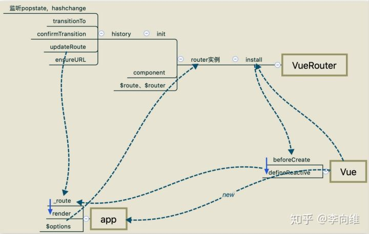
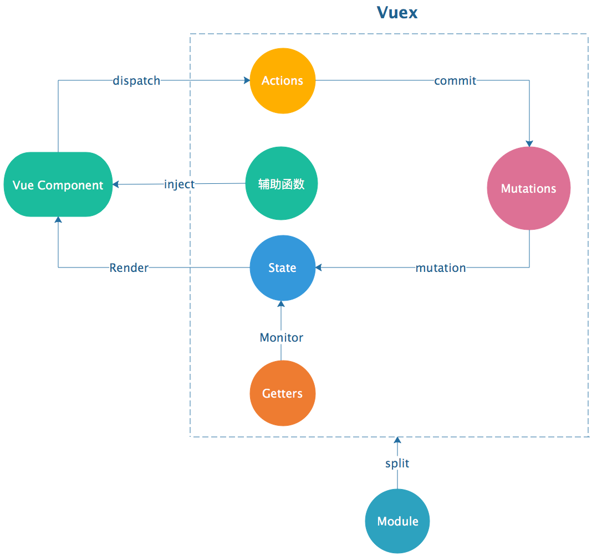

# vue源码解读

于2020-02-21从https://github.com/vuejs/vue处clone的版本

* [vue目录结构](#vue目录结构)
* [初始化过程](#初始化过程)
* vue实例
    * [initMixin](#initMixin)
        * 合并option,统一数据格式
        * 初始化生命周期
        * 初始化事件
        * 初始化render(vdom相关)
        * 生命周期函数钩子callHook
        * 初始化依赖注入数据
            * defineReactive值变为响应式
                * dep依赖收集器
                * defineProperty/proxy劫持getter和setter
                * dep.subs 添加订阅者
                * dep.notify() 派发更新
        * 初始化state
            * 初始化props
            * 初始化methods
            * 初始化data
                * Observer给对象添加getter和setter
            * 初始化computed
                * dirty 
                * 延时watcher
            * 初始化watch
        * 初始化provide
        * $mount渲染函数
            * 正则标签识别
            * ast生成
* [数据绑定](#数据绑定)
    * [stateMixin](#stateMixin)
* [事件绑定](#事件绑定)
    * [eventsMixin](#eventsMixin)
        * $on
        * $once
        * $off
        * $emit
* [生命周期](#生命周期)
    * [lifecycleMixin](#lifecycleMixin)
        * _update()
        * patch
        * diff
        * $forceUpdate
        * $destroy
* [渲染方法](#渲染方法)
    * [renderMixin](#renderMixin)
        * $nextTick
        * _render
* [额外补充](#额外补充)
    * [keep-alive](#keep-alive)
* [vue-router](#vue-router)
    * [vue-router目录结构](#vue-router目录结构)
    * [插件使用和实现](#插件使用和实现)
        * install.js
            * mixin
                * beforeCreate
                * destroy
            * RouterView
            * RouterLink
                * url路由对象route
    * [主文件与初始化](#主文件与初始化)
        * Histroy基类
        * HTML5History
            * 监听popState
        * HashHistory
            * 监听hashchange
            * setupScroll回调：解决bug
        * AbstractHistory
* [vuex](#vuex)
    * [vuex目录结构](#vuex目录结构)
    * [vuex混入](#vuex混入)
        * 公用store
    * [store初始化](#store初始化)
        * 初始化方法installModule
            * makeLocalContext上下文
            * registerMutation注册mutation
                * commit
            * registerAction注册action
            * registerGetter注册getter
            * installModule注册子module
        * resetStoreVM注册state以及computed
        * 注册插件
            * 时空穿梭state
    * [其它api](#其它api)

## vue目录结构

1. 参考链接

    [人人都能懂的Vue源码系列(一)—Vue源码目录结构](http://www.imooc.com/article/29087)

2. 详解

    

## 初始化过程

1. 参考链接

    [vue源码分析系列一：new Vue的初始化过程](https://blog.csdn.net/a419419/article/details/90764860)

    [vue组件初始化过程](https://www.cnblogs.com/gerry2019/p/12051148.html)

    [vue简介和初始化过程](https://www.jianshu.com/p/523b4c12eafb)

    [入口开始，解读Vue源码（一）—— 造物创世](https://blog.csdn.net/JohnnieZhu/article/details/87341753)

2. 详解

    vue源码使用了flow语法，类似typescript，可以类型检测。

    * 原始类型包括：Boolean、Null(void)、Undefined、Number、String、Symbol、Object

    * 特殊类型包括：?(可选类型)、mixed(混合类型，使用前需要typeof判断类型才能使用)、any(任意类型)、interface(接口类型)、Array\<Type>(数组类型)

    一切从core下的index.js说起。

    * 概况

        * 引入了vue实例，实例位于/core/instance下，入口文件为index.js，其包括initMixin、stateMixin、eventsMixin、lifecycleMixin、renderMixin即从初始化到渲染完成的流程

        * initGlobalAPI定义全局函数，包括Vue.extend、Vue.nextTick、Vue.use、Vue.mixin等，更多查看[官方文档](https://cn.vuejs.org/v2/api/#%E5%85%A8%E5%B1%80-API)

        * 定义服务器端渲染配置：$isServer、$ssrContext，暴露接口FunctionalRenderContext，更多查看[官方文档](https://ssr.vuejs.org/zh/guide/head.html)

## vue实例

### initMixin

1. 参考链接

    [浅析Vue源码（二）—— initMixin(上)](https://blog.csdn.net/Wangxinlei_King/article/details/101222605)

    [浅析Vue源码（三）—— initMixin(下)](https://blog.csdn.net/Wangxinlei_King/article/details/101222605)

    [深入理解Vue源码系列-2.initMixin干了什么(上)](https://blog.csdn.net/weixin_33908217/article/details/91440310)

    [深入理解Vue源码系列-3.initMixin干了什么(中)](https://blog.csdn.net/weixin_33766168/article/details/91427721)

    [深入理解Vue源码系列-4.initMixin干了什么(下)](https://blog.csdn.net/weixin_34284188/article/details/91454374)

    [Vue源码学习系列03——Vue构造函数解析(一): 选项规范化(normalize)](https://blog.csdn.net/qq_25324335/article/details/88312316)

    [Vue源码学习系列04——Vue构造函数解析(二): 选项合并策略(optionMergeStrategies)](https://blog.csdn.net/qq_25324335/article/details/88312449)

    [Vue之event(事件)](https://www.jianshu.com/p/efc97de3989a)

    [Vue源码探究-虚拟DOM的渲染](https://segmentfault.com/a/1190000017231906)

    [Vue源码系列9------创建 VNode-----createElement](https://blog.csdn.net/refreeom/article/details/90236763)

    [Vue源码学习之initInjections和initProvide](https://blog.csdn.net/qq_34179086/article/details/88081602)

    [解读 Vue 之 Reactive](https://blog.csdn.net/qq3401247010/article/details/77131998)

    [Vue源码解读（十三）---派发更新](https://blog.csdn.net/guxin_duyin/article/details/102308813)

    [深入理解响应式原理（一）](https://blog.csdn.net/messizhao/article/details/103529315)

    [【vue】源码解析（2）vue中的监听器watcher用法](https://www.jianshu.com/p/7cd99f07fccf)

    [Vue $mount （解析 $mount 源码）](https://www.jianshu.com/p/402e712ab90f)

    [Vue编译器源码分析(三) -compileToFunctions的作用](https://zhuanlan.zhihu.com/p/87596719)

    [Vue编译器源码分析(四) - compile 解析](https://zhuanlan.zhihu.com/p/88105240)

    [Vue编译器源码分析(五) - AST 抽象语法树](https://zhuanlan.zhihu.com/p/88363312)

2. 详解

    * 原型挂载_init，传入的options是通过new Vue()传进来，值形如{render: h => h(App),}
    
    * _init绑定vue实例vm，定义_uid不断自增，标记_isVue避免被observer标记

    * 绑定$options，使用mergeOptions函数合并option(包含extend、mixins)，合并之后，可以获取$options.data访问Vue实例化传入的data

        1. mergeOptions(parent,children,vm)

            非生产环境下会遍历检查options.components合规的组件名：字母开头，不是内置标签和保留字

        2. props处理成相同的格式normalizeProps(child, vm)

            * props正确的配置如下
                ```vue
                props: ['name']
                props: {
                    name: String
                }
                props: {
                    name: {
                        type: String,
                        required: true
                    }
                }
                ```

            * 最终解析如下
                ```vue
                props: { name: { type: null }}
                props: { name: { type: String }}
                props: { name: { type: String, required: true }}
                ```

        3. inject处理成相同的格式normalizeInject(child, vm)

            * inject正确的配置如下
                ```vue
                inject: ['foo', 'bar']
                inject: {
                    foo: { default: 'hello' }
                }
                ```

            * 最终解析如下
                ```vue
                inject: { 'foo': {from: 'foo'}, 'bar': {from: 'bar'} }
                inject: { foo: {from: 'foo', default: 'hello'}}
                ```

        4. directives处理成相同的格式normalizeDirectives(child)

            * directives正确的配置如下
                ```vue
                directives: {
                    focus: {
                        inserted(){...},
                        update(){....}
                    },
                    remove(){....}
                }
                ```

            * 最终解析如下
                ```vue
                directives: {
                    focus: {
                        inserted(){...},
                        update(){....}
                    },
                    remove:{
                        bind(){...}
                        update(){...}
                    }
                }
                ```

        5. 对于extend和mixins，递归调用mergeOptions

        6. mergeField

            可以重写默认合并策略

    * 执行代理的过程initProxy(vm)，见/core/instance/proxy.js

        代理set、has、get检查代理对象名称是否合规（非保留字段）

    * 挂载vm._self = vm
        1. 初始化生命周期initLifecycle(vm)

            初始化一些属性，如$refs，_isMounte等

        2. 初始化事件initEvents(vm)

            创建_events空对象，如果存在监听器，就更新组件的监听器。(目前不存在监听器)
            
            更新具体为遍历on对象，拿到当前事件值cur和旧事件值old，对事件名执行normalizeEvent方法。
            
            如果old未定义，cur=on[name]=createFnInvoker(cur),即把on[name]指向createFnInvoker返回的值。接下来执行add(event.name,cur,event.once,event.capture,event.passive,event.params)方法。它就是通过addEventListener在真实dom上绑定事件了。

            createFnInvoker，最终会返回一个invoker函数。

            invoker函数，先拿到传进来的on[name]赋值给fns。如果它是一个数组，遍历它依次去执行其内定义的函数，否则直接执行fns，通过它创建了一个回调函数。

            如果old定义了且old和cur不相同，直接把old.fns指向cur，同时把on[name]指向old，我们只要把invoker.fns改变即可,不需要重新创建事件。

        3. 初始化组件render相关属性方法($createElement,$attrs,$listeners)initRender(vm)

            初始化虚拟DOM的渲染：

            * 初始化根虚拟节点、静态树节点、获取配置对象、设置父占位符节点、存储父节点上下文、将子虚拟节点转换成格式化的对象结构存储在实例的$slots属性、初始化$scopedSlots属性为空对象。

            * 为实例绑定渲染虚拟节点函数_c和$createElement，内部实际调用模板编译的渲染函数createElement，并获得恰当的渲染上下文，参数按顺序分别是：标签、数据、子节点、标准化类型、是否标准化标识

            * 对节点的属性和事件监听器进行状态观察

            关于创建虚拟节点函数_createElement(context, tag, data, children, normalizationType)

            * 参数解析：_createElement 方法有 5 个参数，context 表示 VNode 的上下文环境，它是 Component 类型；tag 表示标签，它可以是一个字符串，也可以是一个 Component；data 表示 VNode 的数据，它是一个 VNodeData 类型，可以在 flow/vnode.js 中找到它的定义；children 表示当前 VNode 的子节点，它是任意类型的，它接下来需要被规范为标准的 VNode 数组；normalizationType 表示子节点规范的类型，类型不同规范的方法也就不一样，它主要是参考 render 函数是编译生成的还是用户手写的。

            * vnode节点定义，参考/core/vdom/vnode.js,定义tag、data、children、text等属性

            * Virtual DOM 实际上是一个树状结构，每一个 VNode 可能会有若干个子节点，这些子节点应该也是 VNode 的类型，因此需要规范化children

                * normalizeChildren 方法的调用场景有 2 种，一个场景是 render 函数是用户手写的，当 children 只有一个节点的时候，Vue 允许用户把 children 写成基础类型用来创建单个简单的文本节点，这种情况会调用 createTextVNode 创建一个文本节点的 VNode；另一个场景是当编译 slot、v-for 的时候会产生嵌套数组的情况，会调用 normalizeArrayChildren 方法

                    * normalizeArrayChildren 递归遍历，解除嵌套，变成基础类型，通过 createTextVNode 方法转换成 VNode 类型，如果 children 是一个列表并且列表还存在嵌套的情况，则根据 nestedIndex 去更新它的 key，如果存在两个连续的 text节点，会把它们合并成一个 text 节点。经过对 children 的规范化，children 变成了一个类型为 VNode 的 Array。

                * simpleNormalizeChildren 方法调用场景是 render 函数是编译生成的。编译生成的 children 都已经是 VNode 类型的，但有一个例外，functional component 函数式组件返回的是一个数组而不是一个根节点，所以会通过 Array.prototype.concat 方法把整个 children 数组打平，让它的深度只有一层。

            * 规范化children后，对 tag 做判断，如果是 string 类型，创建一个普通 VNode，如果是为已注册的组件名，通过 createComponent 创建一个组件类型的 VNode，否则创建一个未知的标签的 VNode，最后返回一个vnode

        4. 调用beforeCreate生命周期callHook(vm, 'beforeCreate')

            执行callHook函数的时候，检查vm.$options[hook]是否存在，如hook为beforeCreate，如果存在就apply或call手写的函数逻辑

        5. 初始化依赖注入数据initInjections(vm)

            在初始化data/props之前被调用，主要作用是初始化vue实例的inject，处理的方法是resolveInejct。

            先建立一个存放结果的空对象，由于provide支持Symbols作为key，所以要对symbol和普通的对象进行不同的处理。

            通过vm的$parent循环向上查找provide中和inject对应的属性，直到查找到根组件或者找到为止，然后返回结果。

            结果传递给defineReactive处理。

            defineReactive 中的 Dep 是一个处理依赖关系的对象(依赖收集器)，具体实现在 core/observer/dep.js，Dep 主要起到连接 reactive data 与 watcher的作用，每一个 reactive data 的创建，都会随着创建一个 dep 实例。

            创建完 dep 实例后，通过 Observer 遍历data对象对每一个键值调用defineReactive 方法，再通过defineProperty劫持data的getter和setter。
            
            当 watcher 执行 getter 的时候，watcher 会被塞入 Dep.target，用来存放监听器里面的update()，然后通过调用 dep.depend() 方法，这个数据的 dep 就和 watcher 创建了连接，即把this存入subs数组中。

            创建连接之后，当 data 被更改，触发了 setter 就可以通过 dep.notify() 通知到所有与 data的dep 创建了关联的 watcher。从而让各个 watcher 做出响应。

            具体的update方法在src/core/observer/watcher.js，其派发更新的逻辑在 src/core/observer/scheduler.js 的queueWatcher(this)，其实现逻辑为：watcher 先添加到⼀个队列⾥，⽤ has 对象保证同⼀个 Watcher 只添加⼀次，通过 wating 保证对 nextTick(flushSchedulerQueue) 的调⽤逻辑只有⼀次，这样不会每次数据改变都触发 watcher 的回调。

            flushSchedulerQueue在对 queue 排序后，遍历拿到对应的 watcher ，执⾏ watcher.run()

            run 函数执⾏ this.get()获取当前的值，对于渲染 watcher ⽽⾔，它在执⾏ this.get() ⽅法求值的时候，会执⾏ getter ⽅法，把watcher移入渲染队列targetStack，排队更新视图，最后逐一清除队列元素，移除所有 subs 中的 watcer 的订阅,重新赋值。

            更新视图后，如果已经mounted，又没destroy，触发updated生命周期

            如果组件为keep-alive，触发activated生命周期


        6. 初始化state(data,props,methods,watch,computed)

            判断vm.$options类型，对props，methods，data，computed，watch进行初始化。

            * props

                遍历定义的 props 配置,调用 defineReactive 方法把每个 prop 对应的值变成响应式，可以通过 vm._props.xxx 访问到定义 props 中对应的属性，响应式原理和过程见上方。

                通过 proxy 把 vm._props.xxx 的访问代理到 vm.xxx 上，此处与data同理，代码中，只需要访问this.xxx，而不需要访问vm._data.xxxx，具体实现为劫持get和set，把vm._props[sourceKey][key]变为vm[sourceKey][key]

            * methods

                遍历methods，检查函数名是否合规，合规的执行bind()函数

            * data

                遍历 data 函数返回对象，通过 proxy 把每一个值 vm._data.xxx 都代理到 vm.xxx 上，过程类似props。

                调用 observe 方法观测整个 data 的变化，位于src/core/observer/index.js，observe 方法的作用就是给非 VNode 的对象类型数据添加一个 Observer，如果已经添加过则直接返回，否则在满足一定条件下去实例化一个 Observer 对象实例。

                Observer 是一个类，它的作用是给对象的属性添加 getter 和 setter，用于依赖收集和派发更新。其构造函数实例化 Dep 对象，执行 def 函数把自身实例添加到数据对象 value 的 \_\_ob\_\_ 属性上,如果value为数组，会调用 observeArray 方法，再次执行 observe，如果value是对象，调用 walk 方法遍历对象的 key 调用 defineReactive 方法

                注意：vue2的object.defineProperty是无法劫持数组的，因此通过另外一种方法实现：修改数组原型为arrayMethod，它继承了Array，然后重写了能改变数组的方法（push/pop/shift/unshift/splice/sort/reverse），手动notify更新。

            * computed

                从vm.$options获取到computed的key和value，在非ssr模式下，watchers[key]创建watcher实例，以便依赖收集。

                创建完 watcher，就通过 Object.defineProperty 把 computed 的 key 挂载到 vm 上。

                在get中，调用 createComputed 方法，Gettercomputed data 的 watcher 是 lazy 的，当 computed data 中引用的 data 发生改变后，是不会立马重新计算值的，而只是标记一下 dirty 为 true，然后当这个 computed data 被引用的时候，上面的 getter 逻辑就会判断 watcher 是否为 dirty，如果是，就重新计算值。

                watcher.depend 收集 computed data 中用到的 data 的依赖，从而能够实现当 computed data 中引用的 data 发生更改时，也能触发到 render。

            * watch

                从vm.$options获取到watch的key和value，如果用户在option有设置watch则执行此方法，如果在methods有定义则执行此方法，否则则执行手写的watch方法$watch

                $watch位于/src/core/observer/watcher.js，第一个参数expOrFn是要监听的属性或方法，数据变化后后触发watcher的run()更新视图，原理在initInjections提及

        7. initProvide(vm)

            $options里的provide赋值到当前实例上。

        8. 调用created生命周期callHook(vm, 'created')

    * $mount渲染函数

        现分析位于dist/vue.js，还有其它版本dist/vue.esm.js,dist/vue.common.dev.js

        限制el不能挂载到 body、HTML 的跟节点上

        如果没有定义 render 方法，则会把 el 或者 options.template 字符串转成 render 方法，过程调用compileToFunctions

            * 函数参数

                参数1：模板字符串template

                参数2：选项对象

                    1/2 换行符或制表符做兼容处理
                    3/4 编译{{}}完整可用和是否保留html注释

            * 函数执行

                获取key，缓存字符串模板的编译结果，防止重复编译

                compile函数对模板进行编译，返回结果对象compiled

                    compile 的源码也位于vue.js中，方法createCompilerCreator

                    挂载配置选项到finalOptions，添加warn方法，收集错误信息到errors数组，收集提示信息到tips数组

                    baseCompile函数传入字符串模板(template)和最终的编译器选项(finalOptions)，通过抽象语法树来检查模板中是否存在错误表达式的，通过 detectErrors 函数实现，将compiled.ast 作为参数传递给 detectErrors 函数，该函数最终返回一个数组，该数组中包含了所有错误的收集

                    baseCompile 函数是在 createCompilerCreator 函数调用时传递的实参。
                    
                    里面 parse 方法会用正则等方式解析 template 模板中的指令、class、style等数据，形成AST

                        * 正则匹配关系：

                        1. ([^\s"'<>\/=]+) 匹配 [^xyz] 反向字符集

                        2. (?:"([^"]*)"+ 匹配 id="app"

                        3. '([^']*)'+ 匹配 id='app'

                        4. ([^\s"'=<>`]+ 匹配 name=name

                        5. var ncname = '[a-zA-Z_][\\w\\-\\.]*'; 匹配 合法xml

                        6. var qnameCapture = "((?:" + ncname + "\\:)?" + ncname + ")"; 匹配 <src

                        7. var startTagOpen = new RegExp(("^<" + qnameCapture)); 匹配开始标签 <div></div>的话会匹配到 <div

                        8. var startTagClose = /^\s*(\/?)>/; 检测标签是否为单标签 。 例如：

                        9 .var doctype = /^<!DOCTYPE [^>]+>/i; 匹配<!DOCTYPE> 

                        10 .var comment =/^<!\--/; 匹配注释

                        * parseHTML 函数进行词法分析

                        1. 变量声明

                            (1) stack = []

                                html：<div><p><span></p></div>

                                stack执行：push(div),push(p),push(span),语法错误(提示，如果有</span>，则pop(span)),pop(p),pop(div)

                            (2) expectHTML 编译器选项

                            (3) isUnaryTag 检测一个标签是否是一元标签

                            (4) canBeLeftOpenTag 检测一个标签是否是可以省略闭合标签的非一元标签

                            (5) index 字符流的读入位置

                            (6) last 存储剩余还未编译的 html 字符串

                            (7) lastTag 始终存储着位于 stack 栈顶的元素

                        2. while(html)循环

                            (1) parse 的内容不是在纯文本标签里

                            (2) parse 的内容是在纯文本标签里 (script,style,textarea)

                        3. 初步产出

                            ```html
                            <div id="app">
                                <p>{{ message }}</p>
                            </div>
                            ```
                            ```js
                            {
                                attrs: [" id="app"", "id", "=", "app", undefined, undefined]
                                end: 14
                                start: 0
                                tagName: "div"
                                unarySlash: ""
                            }

                            {
                                attrs: []
                                end: 21
                                start: 18
                                tagName: "p"
                                unarySlash: ""
                            }
                            ```

                        4. 最终产出ast

                            ```js
                            {
                                type: 1,
                                tag: "div",
                                parent: null,
                                attrsList: [],
                                children: [{
                                    type: 1,
                                    tag: "p",
                                    parent: div,
                                    attrsList: [],
                                    children:[
                                        {
                                        type: 3,
                                        tag:"",
                                        parent: p,
                                        attrsList: [],
                                        text:"{{ message }}"
                                        }
                                    ]
                                }],
                            }
                            ```

                    optimize 的主要作用是标记 static 静态节点，这是 Vue 在编译过程中的一处优化，后面当 update 更新界面时，会有一个 patch 的过程， diff 算法会直接跳过静态节点，从而减少了比较的过程，优化了 patch 的性能。

                    generate 方法生成目标平台所需的代码，将 AST 转化成 render function 字符串的过程，得到结果是 render 的字符串以及 staticRenderFns 字符串。

                    baseCompile最终返回了抽象语法树( ast )，渲染函数( render )，静态渲染函数( staticRenderFns )组成的对象

                在 res 对象上添加一个 render 属性，这个 render 属性，就是最终生成的渲染函数，它的值是通过 createFunction 创建出来的。

                    * 第一个参数 code 为函数体字符串，该字符串将通过new Function(code) 的方式创建为函数

                    * 第二个参数 errors 是一个数组，创建函数发生错误时用来收集错误

                res.staticRenderFns 是一个函数数组，是通过对compiled.staticRenderFns遍历生成的，说明：compiled 除了包含 render 字符串外，还包含一个字符串数组staticRenderFns ，且这个字符串数组最终也通过 createFunction 转为函数。staticRenderFns 的主要作用是渲染优化。

        最后调用原型上的 $mount 方法挂载

## 数据绑定

### stateMixin

1. 参考链接

    [每天读一点源码---vue的初始化](https://segmentfault.com/a/1190000010603894?utm_source=tag-newest)

2. 详解

    将data,props,$set,$delete,watch绑定在vue.prototype上

    ```js
    //定义$data,$props的get和set，只读返回_data和_props
    Object.defineProperty(Vue.prototype, '$data', dataDef)
    Object.defineProperty(Vue.prototype, '$props', propsDef)
    //设置响应式对象属性和通知变化的函数
    Vue.prototype.$set = set
    //删除属性和通知变化的函数
    Vue.prototype.$delete = del
    //watcher作用查看“初始化state中的watch”
    Vue.prototype.$watch = function(...)
    ```

## 绑定事件

### 

1. 参考链接

    [Vue.js源码学习三 —— 事件 Event 学习](https://www.jianshu.com/p/cafce3ea6bb9)

2. 详解

    上接initMixin中的初始化事件

    * 定义Vue.prototype.$on方法

        如果 event 是数组则遍历递归执行 $on 方法，否则 向 vm._events[event] 中push回调函数 fn

    * 定义Vue.prototype.$once方法

        定义一个 $on 事件监听，回调函数中使用 $off 方法取消事件监听，并执行回调函数

    * 定义Vue.prototype.$off方法

        用于移除自定义事件监听器，
        
        如果 event 是数组则遍历递归执行 $off 方法，
        
        如果没有具体的监听事件，直接返回vm，
        
        如果没有回调函数 fn，将事件监听器变为null，返回vm，
        
        如果有回调函数，从后往前逐一移除事件监听

    * 定义Vue.prototype.$emit方法

        触发当前实例上的事件

## 生命周期

### lifecycleMixin

1. 参考链接

    [【Vue】Vue源码第三步——初始化（lifecycleMixin、stateMixin）](https://blog.csdn.net/qq_24884131/article/details/103591405)

    [Vue源码笔记本（一）](https://zhuanlan.zhihu.com/p/25994997)

    [Vue 实例挂载方法($mount)的实现](https://blog.csdn.net/zjq_1314520/article/details/88912218)

    [Vue patch](https://www.jianshu.com/p/9130c32755f0)

    [Vue 视图更新patch过程源码解析](https://segmentfault.com/a/1190000021057420)

2. 详解

    * $mount

        上接initMixin中的$mount，生成ast树和render函数，来到/src/core/instance/lifecycle.js中的mountComponent

        初步检查vm.$options.render函数后，执行用户写的beforeMount函数

        调用vm._update(vm._render(), hydrating)，传入render函数，该方法将 vnode 渲染为真实的DOM

        new 一个 Watcher ，并在 Watcher 调用updateComponent方法，如果调用方法时已经mounted，但又没destroy，执行beforeUpdate

        执行用户写的mounted函数

    * lifecycleMixin

        定义Vue.prototype._update函数

        调用vm.\_\_patch\_\_()做diff，方法位于src/core/vdom/patch.js,在createPatchFunction函数中返回patch()函数，是用于比较新老节点的封装函数

            * 如果是首次patch，就创建一个新的节点

            * 老节点存在

                * 老节点不是真实DOM并且和新节点相似

                    调用patchVnode修改现有节点

                * 新老节点不相同

                    * 如果老节点是真实DOM，创建对应的vnode节点

                    * 为新的Vnode创建元素/组件实例，若parentElm存在，则插入到父元素上

                    * 如果组件根节点被替换，遍历更新父节点element。然后移除老节点

                * 调用insert钩子

                    * 是首次patch并且vnode.parent存在，设置vnode.parent.data.pendingInsert = queue

                    * 如果不满足上面条件则对每个vnode调用insert钩子

                * 返回vnode.elm真实DOM内容

        patch相关：

            DOM的操作对象nodeOps

                nodeOps上封装了针对各种平台对于DOM的操作，modules表示各种模块，这些模块都提供了create和update钩子，用于创建完成和更新完成后处理对应的模块;有些模块还提供了activate、remove、destory等钩子。

            创建节点函数createElm(vnode, insertedVnodeQueue, parentElm, refElm)

                * 创建标签，调用nodeOps.createElementNS(vnode.ns, tag)或nodeOps.createElement(tag, vnode)

                * 数据钩子，invokeCreateHooks(vnode, insertedVnodeQueue)，详细看[参考文档5](https://segmentfault.com/a/1190000021057420)

                * 遍历子节点创建DOM，createChildren(vnode, children, insertedVnodeQueue) 

                * 创建注释，nodeOps.createComment(vnode.text);

                * 创建文本，nodeOps.createTextNode(vnode.te)

                * 元素插入真实DOM，insert(parentElm, vnode.elm, refElm)

            修改节点函数patchVnode(oldVnode, vnode, insertedVnodeQueue, removeOnly)

            省略解析若干函数，详细看[参考文档5](https://segmentfault.com/a/1190000021057420)

            diff算法位于updateChildren()函数，通过diff算法尽可能的复用先前的DOM节点。

                图解见另一篇md，"网站开发常见问题"之"virtualDOM_Diff"

        定义Vue.prototype.$forceUpdate函数

            调用watcher.update()强制更新视图

        定义Vue.prototype.$destroy 函数

            触发生命周期beforeDestroy

            移除vm.$parent，vm._watcher，vm._data.__ob__，移除vnode：vm.__patch__(vm._vnode, null)

            触发生命周期destroyed

            vm.$off()移除事件

        生命周期deactivated与destroy位于同一级，判断到组件为keep-alive执行

## 渲染方法

### renderMixin

1. 参考链接

    [Vue源码笔记本（一）](https://zhuanlan.zhihu.com/p/25994997)

    [Vue.nextTick 的原理和用途](https://segmentfault.com/a/1190000012861862)

2. 详解

    定义Vue.prototype.$nextTick函数，函数主体位于/src/core/util/next-tick.js

        作用：在下次 DOM 更新循环结束之后执行延迟回调。在修改数据之后立即使用这个方法，获取更新后的 DOM。

        问题:Vue 在修改数据后，视图不会立刻更新，而是等同一事件循环中的所有数据变化完成之后，再统一进行视图更新

        原理:Vue内部有一个列表(flushCallbacks)来存储nextTick参数中提供的回调(callbacks)，microTimerFunc添加任务时pending为true，当任务触发时，以此执行列表里的所有回调并清空列表

        事件循环：同步代码执行 -> 查找异步队列，推入执行栈，执行Vue.nextTick[事件循环1] ->查找异步队列，推入执行栈，执行Vue.nextTick[事件循环2]

        应用场景：在同一方法里，修改了数据后，想立即操作DOM元素(如获取refs，document.getElementById)，会不生效，需要用this.$nextTick(function () {...})包住才生效

        例子：

        ```js
        showsou(){
            this.showit = true //修改 v-show
            document.getElementById("keywords").focus()  //在第一个 tick 里，获取不到输入框，自然也获取不到焦点
            //改变数据
            vm.message = 'changed'
            //想要立即使用更新后的DOM。这样不行，因为设置message后DOM还没有更新
            console.log(vm.$el.textContent)
        }
        //改为：
        showsou(){
            this.showit = true
            this.$nextTick(function () {
                // DOM 更新了
                document.getElementById("keywords").focus()
            })
            //这样可以，nextTick里面的代码会在DOM更新后执行
            Vue.nextTick(function(){
                console.log(vm.$el.textContent) //可以得到'changed'
            })
        }
        ```

        实现原理:

            * callbacks：存放异步执行的回调函数
            * timerFunc：根据兼容性执行nextTickHandler
                * 能够使用Promise，则Promise.resolve().then(nextTickHandler)
                * 能够使用MutationObserver：新建一个textNode的DOM对象，用MutationObserver绑定该DOM并指定回调函数，在DOM变化的时候则会触发回调,该回调会进入主线程（比任务队列优先执行），即textNode.data = String(counter)时便会加入该回调
                ```js
                var counter = 1
                var observer = new MutationObserver(nextTickHandler)
                var textNode = document.createTextNode(String(counter))
                observer.observe(textNode, {
                    characterData: true
                })
                timerFunc = () => {
                    counter = (counter + 1) % 2
                    textNode.data = String(counter)
                }
                ```
                * 以上都不行：setTimeout(nextTickHandler, 0)
            * nextTickHandler：下一个任务队列函数
                * pending：标记等待状态，避免timerFunc多次推入任务队列或者主线程
                * copies：用于执行所有callback
            * queueNextTick：推送指定函数到下一个任务队列中执行，callbacks.push(cb.call(ctx))，非pending状态下执行timerFunc()
            

    定义Vue.prototype._render函数

        规范化插槽slot

        调用render函数，函数具体执行见"生命周期"

## 额外补充

### keep-alive

1. 参考链接

    [vue keep-alive的实现原理和缓存策略](https://www.cnblogs.com/everlose/p/12541934.html)

    [keep-alive实现原理](https://www.jianshu.com/p/9523bb439950)

    [浅析Vue中keep-alive实现原理以及LRU缓存算法](https://segmentfault.com/a/1190000020515898)

    * [十道大厂面试题(含答案)总结](https://mp.weixin.qq.com/s/o553cr1FHLz40PpxbO8oOw)

2. 详解

    * 位置

        src/core/components/keep-alive.js

    * 作用

        keep-alive是一个抽象组件：它自身不会渲染一个DOM元素，也不会出现在父组件链中；使用keep-alive包裹动态组件时，会缓存不活动的组件实例

    * 场景

        用户在某个列表页面选择筛选条件过滤出一份数据列表，由列表页面进入数据详情页面，再返回该列表页面，我们希望：列表页面可以保留用户的筛选（或选中）状态。

    * 用法

        include定义缓存白名单，keep-alive会缓存命中的组件；exclude定义缓存黑名单，被命中的组件将不会被缓存；max定义缓存组件上限，超出上限使用LRU的策略置换缓存数据。

        ```html
        <keep-alive :include="whiteList" :exclude="blackList" :max="amount">
            <router-view></router-view>
        </keep-alive>
        ```

        * LRU策略(最少最近使用)

            * 新数据插入到链表头部；
            * 每当缓存命中（即缓存数据被访问），则将数据移到链表头部；
            * 当链表满的时候，将链表尾部的数据丢弃。

            模拟实现
            ```js
            class LRUCache {
                constructor(capacity,intervalTime){
                    this.cache = new Map();
                    this.capacity = capacity;
                    this.intervalTime = intervalTime;
                }
                get(key){
                    if(!this.cache.has(key)){
                        return null
                    }
                    const tempValue = this.cache.get(key)
                    this.cache.delete(key);
                    if(Date.now() - tempValue.time > this.intervalTime){
                        return null
                    }
                    this.cache.set(key, {value: tempValue.value, time: Date.now()})
                    return tempValue.value
                }
                put(key, value){
                    if(this.cache.has(key)){
                        this.cache.delete(key)
                    }
                    if(this.cache.size >= capacity){ //满了
                        const keys = this.cache.keys()
                        this.cache.delete(keys.next().value)
                    }
                    this.cache.set(key, {value,time:Date.now()})
                }
            }
            ```
    
    * 实现

        * created

            创建cache对象，定义缓存数组(用于LRU)

        * mounted

            * $watch分别对include和exclude监听

                * pruneCacheEntry更新（删除）this.cache对象数据

        * destroyed

            遍历删除所有的缓存

            * cached.componentInstance.$destroyed() 执行组件的destroy钩子函数

            * cache[key] = null

            * 移除缓存数组键remove(keys, key)

        * render函数(函数式组件常用函数)

            * 得到slot插槽中的第一个组件

                * 获取组件名称，优先获取组件的name字段，否则是组件的tag

                * name不在inlcude中或者在exlude中则直接返回vnode（没有取缓存）

                * 定义组件的缓存key

                * 如果已经做过缓存了则直接从缓存中获取组件实例给vnode，还未缓存过则进行缓存

                ```js
                if (this.cache[key]) {
                    vnode.componentInstance = this.cache[key].componentInstance
                } else {
                    this.cache[key] = vnode
                }
                ```

                * keepAlive标记位

## vue-router

### vue-router目录结构

1. 参考链接

    [vue-router源码解析（一）](https://segmentfault.com/a/1190000017968083)

2. 详解

    ```txt
    ├── components  // 组件
    │   ├── link.js   // route-link的实现
    │   └── view.js   // route-view的实现
    ├── create-matcher.js  // 创建匹配
    ├── create-route-map.js  // 创建路由的映射
    ├── history  // 操作浏览器记录的一系列内容
    │   ├── abstract.js  // 非浏览器的history
    │   ├── base.js    // 基本的history
    │   ├── hash.js    // hash模式的history
    │   └── html5.js   // html5模式的history
    ├── index.js   // 入口文件
    ├── install.js  // 插件安装的方法
    └── util   // 工具类库
    ├── async.js    // 异步操作的工具库
    ├── dom.js    // dom相关的函数
    ├── location.js     // 对location的处理
    ├── misc.js     // 一个工具方法
    ├── params.js   // 处理参数
    ├── path.js     // 处理路径
    ├── push-state.js  // 处理html模式的 pushState
    ├── query.js  //对query的处理
    ├── resolve-components.js  //异步加载组件
    ├── route.js  // 路由
    ├── scroll.js  //处理滚动
    └── warn.js  // 打印一些警告
    ```

### 插件使用和实现

1. 参考链接

    [vue-router源码解析（一）](https://segmentfault.com/a/1190000017968083)

    [vue-router源码解析（二）插件实现](https://segmentfault.com/a/1190000017968216)

2. 详解

    

    * 使用

        1. 安装插件：Vue.use(VueRouter);
        2. 创建对象：const router = new VueRouter({...});
        3. 挂载：const app = new Vue({router}).$mount('#app');
        4. 使用：\<div id="app">\<router-view>\</router-view>\</div>

    * 实现

        1. 样例

            ```js
            //Vue.js 要求插件应该有一个公开方法 install
            MyPlugin.install = function (Vue, options) {
                // 1. 添加全局方法或属性
                Vue.myGlobalMethod = function () {
                    
                }

                // 2. 添加全局资源
                Vue.directive('my-directive', {
                    bind (el, binding, vnode, oldVnode) {
                    
                    }
                    ...
                })

                // 3. 注入组件
                Vue.mixin({
                    created: function () {
                    
                    }
                    ...
                })

                // 4. 添加实例方法
                Vue.prototype.$myMethod = function (methodOptions) {
                    
                }
            }
            ```

        2. vue-router的install.js

            * 全局变量install.installed来确保只安装一次

            * 全局 mixin 注入一些生命周期的处理

                * beforeCreate

                    1. 保存vm和router
                    2. 执行初始化函数init()
                    3. 通过defineReactive使_route变为响应式
                    4. 注册实例registerInstance()

                * destroyed

                    清除实例

            * 挂载变量到原型上

                defineProperty,把$router、$route挂载到vue.prototype上，通过get实现，使其只读

            * 注册touter-view以及router-link组件

                位于/components下

                1. Vue.component('RouterView', View);

                    * RouterView是一个函数式组件，无data和this，用一个简单的 render 函数返回虚拟节点使他们更容易渲染。

                    * render函数

                        * 定义常量和变量

                            父组件的createElement函数为h()，props的name表示路由名，option中的VueRouter是用户写的路由，parent上缓存对象cache用于keep-alive

                            定义组件深度，alive状态

                            如果在keep-alive组件中，直接从缓存中取虚拟节点return h(cache[name], data, children)

                            如果没有匹配到的路由!route.matched[depth]，则渲染一个空节点return h()

                            匹配成功，取出组件matched.components[name]

                            定义注册实例的registration钩子，在beforeCreate与destroyed调用，获取组件实例并赋值matched.instances[name] = val，val为null表示注销

                            匹配成功，渲染节点

                2. Vue.component('RouterLink', Link);

                    props中定义标签为a，事件为click，当用户触发后，会调用 router 的 push 或 replace 方法来更新路由

                    通过createRoute()方法生成路径

                        生成路由对象,位于/util/route.js

                        ```js
                        const route: Route = {
                            name: location.name || (record &&record.name),
                            meta: (record && record.meta) || {},
                            path: location.path || '/',
                            hash: location.hash || '',
                            query,
                            params: location.params || {},
                            fullPath: getFullPath(location, stringifyQuery),
                            matched: record ? formatMatch(record) : []
                        }
                        ```

                    事件守卫，禁止键盘事件alt等

                    生成a标签，设置属性href，绑定onclick事件，h(this.tag, data, this.$slots.default)生成节点

### 主文件与初始化

1. 参考链接

    [Vue-Router源码学习之index.js(vue-router类)](https://baijiahao.baidu.com/s?id=1611182012934115489&wfr=spider&for=pc)

    [Vue-Router源码分析之index.js](https://blog.csdn.net/weixin_34122810/article/details/88014790)

    [VueRouter源码分析(2)--实例分析matcher和history](https://www.jianshu.com/p/8822ef1b1341)

    [vue-router 结合源码分析原理](https://www.cnblogs.com/evaling/p/10304466.html)

    [前端路由实现原理（history）](https://blog.csdn.net/weixin_34377919/article/details/88069239)

    [vue-router 源码分析-history](https://zhuanlan.zhihu.com/p/24574970?refer=ddfe-weekly)

    [前端路由原理学习记录之二](https://zhuanlan.zhihu.com/p/61091042?from_voters_page=true)

2. 详解

    * constructor

        1. 引入路由匹配函数createMatcher，位于/create-matcher.js

            createRouteMap函数将routes转化成对象，循环调用addRouteRecord函数完善pathList, pathMap, nameMap

                ```js
                ref:{
                    nameMap:Object      //name路由
                    pathList:Array(3)
                    pathMap:Object      //path路由
                    __proto__:Object
                }
                //本实例中是path路由，生成的pathMap如下：
                pathMap:{
                    "":Object
                    /bar:Object
                    /foo:Object
                }
                //其中第一个Object如下，该对象即是路由记录record：
                {
                    beforeEnter:undefined
                    components:Object
                    instances:Object
                    matchAs:undefined
                    meta:Object
                    name:undefined
                    parent:undefined
                    path:""
                    props:Object
                    redirect:undefined
                    regex:/^(?:\/(?=$))?$/i
                    __proto__:Object
                }
                ```

            addRouteRecord函数中，主要根据传入的route构造路由记录record对象，遇到嵌套和别名，会进行递归处理，最后填充pathList,pathMap,nameMap

                ```js
                const record: RouteRecord = {
                    path: normalizedPath,
                    regex: compileRouteRegex(normalizedPath, pathToRegexpOptions),
                    components: route.components || { default: route.component },
                    instances: {},
                    name,
                    parent,
                    matchAs,
                    redirect: route.redirect,
                    beforeEnter: route.beforeEnter,
                    meta: route.meta || {},
                    props: route.props == null
                    ? {}
                    : route.components
                        ? route.props
                        : { default: route.props }
                }
                ```

        2. 定义模式mode

            history相关位于/history下，History为基类，子类：HTML5History、HashHistory、AbstractHistory

            * base.js 定义Histroy基类

                ```js
                class History {
                    router: Router;
                    base: string;//基路径
                    current: Route;
                    pending: ?Route;//描述阻塞状态
                    cb: (r: Route) => void;//监听时的回调函数
                    ready: boolean;//描述就绪状态
                    readyCbs: Array<Function>;//就绪状态的回调数组
                    readyErrorCbs: Array<Function>;//就绪时产生错误的回调数组
                    errorCbs: Array<Function>;//错误的回调数组

                    // 子类实现用户用的方法
                    +go: (n: number) => void;
                    +push: (loc: RawLocation) => void;
                    +replace: (loc: RawLocation) => void;
                    +ensureURL: (push?: boolean) => void;
                    +getCurrentLocation: () => string;

                    listen:function(){...},
                    onReady:function(){...},
                    onError:function(){...},
                    transitionTo:function(){...},//路由跳转的封装
                    confirmTransition:function(){...},//确认跳转
                    updateRoute:function(){...}  
                }
                ```

            * transitionTo

                调用 match 得到匹配的 route 对象

                确认过渡函数confirmTransition 

                    如果是相同路由，直接返回

                    定义整个切换周期的队列，包括leave 的钩子，全局 router before hooks，将要更新的路由的 beforeEnter 钩子，异步组件

                        路由对象的 matched 实例，是匹配到的路由记录的合集

                        resolveQueue 就是交叉比对当前路由的路由记录和现在的这个路由的路由记录来决定调用哪些路由记录的钩子函数(取得最大深度,从根开始对比 一旦不一样的话 就可以停止了,舍掉相同的部分 只保留不同的)

                更新当前 route 对象

                子类实现的更新url地址

                对于 hash 模式的话 就是更新 hash 的值

                对于 history 模式的话 就是利用 pushstate / replacestate 来更新

            * cb

                用于更新vue实例（组件）中的_route响应式属性，从而重新渲染页面

            * runQueue

                如果当前的 index 值和整个队列的长度值齐平了(index >= queue.length) ，说明队列已经执行完成，执行队列执行完成的回调函数cb

                如果queue[index]存在的话 调用传入的迭代函数fn执行step(index + 1)

            * iterator

                调用钩子，
                
                如果钩子函数在调用第三个参数时传入了 false，则意味着要终止本次的路由切换

                如果传入的是字符串 或者对象的话 认为是一个重定向操作，直接调用 push

                其他情况 意味着此次路由切换没有问题 继续队列下一个

            * extractEnterGuards

                调用 flatMapComponents推平数组，调用 extractGuard 得到组件上的 beforeRouteEnter 钩子

            * extractLeaveGuards

                打平组件的flatMapComponents 钩子函数们，按照顺序得到 然后再 reverse,因为 leave 的过程是从内层组件到外层组件的过程，取得 leave 的由深到浅的顺序组合组件的 beforeRouteLeave 钩子函数们

            * hash.js 定义HashHistory

                * 原理

                监听hashchange，获取路径并更新视图

                #后内容改变会再history产生一条记录，不会刷新页面

                * 具体

                constructor针对于不支持 history api 的降级处理，以及保证默认进入的时候对应的 hash 值是以 / 开头的，如果不是则替换。

                setupScroll处理了滚动行为，并且添加事件监听，在transitionTo方法结束完之后执行

                值得注意的是这里并没有监听 hashchange 事件来响应对应的逻辑，而是写在setupScroll这个回调函数中，为了解决 异步调用根路径beforeEnter注册2次 的问题

                具体bug：this is delayed until the app mounts to avoid the hashchange listener being fired too early

            * html.js 定义HTML5History

                * 原理

                back,forward,go三个方法，对应浏览器的前进，后退，跳转操作

                pushState向history中push一条记录

                replaceState：向history中替换一条记录

                监听popState，监听地址栏变化并更新视图

                * 具体

                处理滚动行为，然后添加监听事件。不同于hashHistory，它是在创建的时候就添加事件监听popstate。

            * abstract.js 定义AbstractHistory

                abstract 模式是用于原生开发,不能使用window对象,用数组模拟路由储存

## vuex

### vuex目录结构

1. 参考链接

    [Vuex源码阅读分析](https://segmentfault.com/a/1190000014363436?utm_source=index-hottest)

2. 详解

    

    

    ```txt
    ├── module  // state处理，构建module tree
    │   ├── module-collection.js
    │   └── module.js
    ├── plugins  // 提供调试功能
    │   ├── devtools.js
    │   └── logger.js
    ├── helper.js  // 提供如mapActions、mapMutations的api
    ├── index.esm.js  // 源码的主入口，用于es module的打包
    ├── index.js  // 源码的主入口,用于commonjs的打包
    ├── mixin.js  // 提供install方法，用于注入$store
    ├── store.js  // vuex的核心代码
    └── util.js  // 工具函数，如deepClone、isPromise、assert
    ```

### vuex混入

1. 参考链接

    [Vuex源码阅读分析](https://segmentfault.com/a/1190000014363436?utm_source=index-hottest)

2. 详解

    插件的使用见vue-router之[插件使用和实现](#插件使用和实现)

    从index.js开始，引入了store和helper

    store中调用install(window.Vue)，即applyMixin(Vue)，进入mixin进行混入

    如果vue版本大于等于2，将vuexInit混入到Vue实例的beforeCreate钩子中

    如果vue版本为1.x，将vuexInit放入_init中调用

    vuexInit中，如果store是function，则执行，若不是，则使用，同时保证子组件从父组件获取store，则全局公用一份store

### store初始化

1. 参考链接

    [Vuex源码阅读分析](https://segmentfault.com/a/1190000014363436?utm_source=index-hottest)

    [2019-04-16 面试题：VUE](https://www.jianshu.com/p/41a0285d63f0)

2. 详解

    * 内部变量

        1. options

            plugins

            一个数组，包含应用在 store 上的插件方法。这些插件直接接收 store 作为唯一参数，可以监听 mutation（用于外部地数据持久化、记录或调试）或者提交 mutation （用于内部数据，例如 websocket 或 某些观察者）

            strict

            Vuex store 是否进入严格模式。在严格模式下，任何 mutation 处理函数以外修改 Vuex state 都会抛出错误

            state

            如果state是function则执行，最终得到一个对象

        2. _committing

            用来判断严格模式下是否是用mutation修改state

        3. _actions

            存放action

        4. _mutations

            存放mutation

        5. _wrappedGetters

            存放getter

        6. _modules

            module收集器

        7. _modulesNamespaceMap

            根据namespace存放module

        8. _subscribers

            存放订阅者

        9. _watcherVM

            实现Watch的Vue实例

        10. 绑定store为this自身，dispatch和commit方法使用store对象本身方法

    * 初始化方法

        1. installModule

            * 概述

                初始化根module，这也同时递归注册了所有子modle，收集所有module的getter到_wrappedGetters中去，this._modules.root代表根module才独有保存的Module对象

            * 具体

                获取module的namespace，如果有namespace则在_modulesNamespaceMap中注册，即把module放进_modulesNamespaceMap数组

                如果不是根节点，则获取父级的state，通过vue.set将子module设置称响应式的

                makeLocalContext设置module的上下文，绑定对应的dispatch、commit、getters、state

                    1. local对象：

                        dispatch：

                        统一参数风格为{ type, payload, options }

                        如果不是根节点，则需要加上命名空间后，通过store.dispatch提交根的action

                        commit：

                        与dispatch同理，store.commit提交根的mutation

                    2. 劫持local对象getters和state属性

                        这里的getters和state需要延迟处理，需要等数据更新后才进行计算，所以使用getter函数，当访问的时候再进行一次计算

                        makeLocalGetters 函数中，如果getter不在该命名空间下 直接return，给getters加一层代理，这样在module中获取到的getters不会带命名空间，实际返回的是store.getters[type] type是有命名空间的


                registerMutation逐一注册mutation

                    首先判断store._mutations是否存在，否则为空数组

                    将mutation包一层函数，push到数组中

                    包一层，commit执行时只需要传入payload

                    执行时让this指向store，参数为当前module上下文的state和用户额外添加的payload

                    当用户调用this.$store.commit(mutations方法名, payload)时会触发

                        commit方法：

                        统一格式，因为支持对象风格和payload风格

                        获取当前type对应保存下来的mutations数组

                        包裹在_withCommit中执行mutation，mutation是修改state的唯一方法

                        执行mutation，只需要传入payload，在mutation的包裹函数中已经处理了其他参数

                        执行mutation的订阅者

                        执行this.$store.commit的时候会调用对应的mutation，而且第一个参数是state，然后再执行mutation的订阅函数

                registerAction逐一注册action

                    获取_actions数组，不存在即赋值为空数组

                    将actions包一层函数，push到数组中

                    包一层，执行时需要传入payload和cb

                    执行action，如果action的执行结果不是promise，将他包裹为promise，支持链式调用

                    使用devtool处理一次error

                    当用户调用this.$store.dispatch(action方法名, payload)时会触发

                        dispatch方法：

                        获取actions数组

                        不存在action，则提示

                        执行action的订阅者

                        如果action大于1，需要用Promise.all包裹


                registerGetter逐一注册getter

                    重复定义getters，则提示

                    包一层，保存到_wrappedGetters中，执行时传入store，执行对应的getter函数

                installModule逐一注册子module

                    递归回初始方法installModule

        2. resetStoreVM

            * 概述

                通过vm重设store，新建Vue对象使用Vue内部的响应式实现注册state以及computed

            * 具体

                循环所有getters，通过Object.defineProperty方法为getters对象建立属性，这样就可以通过this.$store.getters.xxx访问

                getter保存在computed中，执行时只需要给上store参数，这个在registerGetter时已经做处理

                new了一个Vue对象，运用Vue内部的响应式实现注册state以及computed(getter)

                若存在oldVm，解除对state的引用，等dom更新后把旧的vue实例销毁

                严格模式使用$watch来观察state的变化，如果此时的store._committing不会true，便是在mutation之外修改state，报错

        3. 注册插件devtoolPlugin(this)

            dev 模式下所有的 state change 都会被记录下来，'时空穿梭' 功能其实就是将当前的 state 替换为记录中某个时刻的 state 状态，利用 store.replaceState(targetState) 方法将执行 this._vm.state = state 实现。

### 其它api

1. 参考链接

    [Vuex源码阅读分析](https://segmentfault.com/a/1190000014363436?utm_source=index-hottest)

2. 详解

    * watch (getter, cb, options)

        判断getter必须是函数类型，使用$watch方法来监控getter的变化，传入state和getters作为参数，当值变化时会执行cb回调。调用此方法返回的函数可停止侦听。

    * replaceState(state)

        用于修改state，主要用于devtool插件的时空穿梭功能，直接修改_vm.$$state

    * registerModule (path, rawModule, options = {})

        用于动态注册module

        统一path的格式为Array，调用store._modules.register方法收集module，调用installModule进行模块的安装，最后调用resetStoreVM更新_vm

    * unregisterModule (path)

        根据path注销module

        统一path的格式为Array，调用store._modules.unregister方法注销module，在store._withCommit中将该module的state通过Vue.delete移除，最后调用resetStore方法，将_actions _mutations _wrappedGetters _modulesNamespaceMap都清空，然后调用installModule和resetStoreVM重新进行全部模块安装和_vm的设置

    * _withCommit (fn)

        在执行mutation的时候，会将_committing设置为true，执行完毕后重置，在开启strict模式时，会监听state的变化，当变化时_committing不为true时会给出警告

    * Vuex中内置了devtool和logger