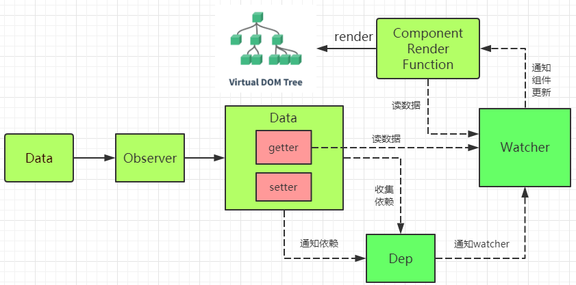

# vue 简结

* [vue 自带指令](#vue自带指令)
* [vue 自定义指令](#vue自定义指令)
* [vue 生命周期](#vue生命周期)
* [自定义指令生命周期](#自定义指令生命周期)
* [vue 双向数据绑定原理](#vue双向数据绑定原理)
* [请求后台资源](#请求后台资源)
* [路由 vue-router](#路由vue-router)
* [自定义组件(创建组件步骤)](<#自定义组件(创建组件步骤)>)
* [父子组件通信](#父子组件通信)
* [兄弟组件通信](#兄弟组件通信)
* [vuex 状态管理(组件间通信)](<#vuex状态管理(组件间通信)>)
* [vue 与 jquery 的区别](#vue与jquery的区别)
* [vuejs 与 angularjs 以及 react 的区别](#vuejs与angularjs以及react的区别)
* [vue 源码结构](#vue源码结构)
* [vue2.0 和 3.0 的区别](#vue2.0和3.0的区别)
* [style 中 scoped 的作用](#style中scoped的作用)
* [子组件监听父组件数值变化](#子组件监听父组件数值变化)
* [页面传参与获取](#页面传参与获取)
* [不同 url 复用页面，且只刷新部分组件](#不同url复用页面，且只刷新部分组件)
* [method 与 computed 区别](#method与computed区别)
* [使用 cookie](#使用cookie)
* [使用插槽](#使用插槽)
* [axios 请求响应拦截](#axios请求响应拦截)
* [keep-alive](#keep-alive)
* [url 与 pushState](#url与pushState)
* [引入外部 js](#引入外部js)
* [从 defineProperty 到 proxy](#从defineProperty到proxy)
* [动态组件与异步组件](#动态组件与异步组件)
* [开启 gzip 模式](#开启gzip模式)
* [注意或优化的地方](#注意或优化的地方)
* [vue3.0 新特性](#vue3.0新特性)
* [vue-loader 原理](#vue-loader原理)
* [新增属性不能响应的问题](#新增属性不能响应的问题)
* [v-show与v-if](#v-show与v-if)
* [data为什么是一个函数](#data为什么是一个函数)
* [子组件为什么不可以修改父组件传递的Prop](#子组件为什么不可以修改父组件传递的Prop)
* [v-model是如何实现双向绑定](#v-model是如何实现双向绑定)
* [虚拟Dom以及key属性的作用](#虚拟Dom以及key属性的作用)
* [mixin](#mixin)
* [Vue模版编译原理](#Vue模版编译原理)
* [SSR](#SSR)
* [SPA单页面的理解](#SPA单页面的理解)

## vue 自带指令

1. v-if 控制 dom 结构的显示隐藏，dom 结构消失
2. v-show 控制 dom 结构的显示隐藏，dom 结构不消失
3. v-for 循环显示数据
4. v-on 简写 @，@事件名
5. v-bind 简写 :，:属性，常用于样式，组件传值，如:style   :xxx
6. v-model 常用于 input 输入框中。修饰符 .trim 首尾空格过滤，.number 转数字 .lazy 与 change 事件同步，类似 onbulr 事件
7. v-once 只渲染元素或组件一次。dom 再次更新时会被当成静态内容跳过。
8. v-html 代码按 html 格式显示

## vue 自定义指令

* 全局定义指令：在 vue 对象的 directive 方法里面有两个参数，一个是指令名称，另外一个是函数。组件内定义指令：directives
* 钩子函数：bind（绑定事件触发）、inserted(节点插入的时候触发)、update（组件内相关更新）
* 钩子函数参数：el、binding

例子：

```js
Vue.directive("img", {
  inserted: function (el, binding) {
    let color = Math.floor(Math.random() * 1000000);
    el.style.backgroundColor = "#" + color; // 设置随机的背景色

    let img = new Image();
    img.src = binding.value; // 获得传给指令的值
    img.onload = function () {
      el.style.backgroundImage = "url(" + binding.value + ")";
    };
  },
});
```

## vue 生命周期

* 创建前/后：

  * beforeCreate：vue 实例的挂载元素\$el 和数据对象 data 都为 undefined，还未初始化，无法获取 data，props 数据。
  * created：vue 实例的数据对象 data 有了，\$el 还没有，可以获取 data，props 值，可以进行 ajax 请求，但请求信息过多，会长时间白屏。

* 载入前/后：

  * beforeMount：vue 实例的\$el 和 data 都初始化了，但还是挂载之前为虚拟的 dom 节点，data.message 还未替换。
  * mounted：vue 实例挂载完成，data.message 成功渲染，可以获取 dom 结构，可以进行 ajax 请求，也一般在此时请求。

* 更新前/后：

  * 当 data 变化时，会触发 beforeUpdate 和 updated 方法。

* keep-alive 组件激活/停用时调用(在服务器端渲染期间不被调用)

  * activated
  * deactivated

* 销毁前/后：
  * 在执行 destroy 方法后，对 data 的改变不会再触发周期函数，说明此时 vue 实例已经解除了事件监听以及和 dom 的绑定，但是 dom 结构依然存在

## 自定义指令生命周期

* bind:指令第一次绑定到元素时调用，定义绑定时执行一次的初始化动作。

* inserted:被绑定元素插入父节点时调用

* update:被绑定于元素所在的模板更新时调用，而无论绑定值是否变化。通过比较更新前后的绑定值，可以忽略不必要的模板更新。

* componentUpdated:被绑定元素所在模板完成一次更新周期时调用。

* unbind:只调用一次，指令与元素解绑时调用。

## vue 双向数据绑定原理

* [探讨 vue 的双向绑定原理及实现](https://www.cnblogs.com/zhouyideboke/p/9626804.html)

vue 采用数据劫持结合发布者-订阅者模式的方式实现双向数据绑定。通过 Object.defineProperty()来劫持各个属性的 setter，getter，在数据变动时发布消息给订阅者，触发相应的监听回调。

* Object.defineProperty()

  Object.defineProperty(对象, 属性名, 属性描述符对象)

  属性描述符：

  * configurable：描述符是否能被改变
  * enumerable：描述符是否能枚举
  * value：属性值
  * writable：value 能否被赋值
  * get：获取 value 执行的函数
  * set：设置 value 执行的函数

* 消息队列

  用于应对修改大量数据导致变慢的情况，使用订阅者和发布者模式，发布者在数据改变时，消息传递给订阅者，依次作出相应变化，消息订阅器采用队列的方式添加订阅者。

* DocumentFragments

  DocumentFragments 是 DOM 节点。它们不是主 DOM 树的一部分。通常的用例是创建文档片段，将元素附加到文档片段，然后将文档片段附加到 DOM 树。在 DOM 树中，文档片段被其所有的子元素所代替。

  因为文档片段存在于内存中，并不在 DOM 树中，所以将子元素插入到文档片段时不会引起页面对元素位置和几何上的计算。因此，使用文档片段通常会带来更好的性能。

* 具体步骤：

1. observe 数据对象(即 data)进行递归遍历，包括子属性对象的属性，都加上 setter 和 getter。给这个对象的某个值赋值，就会触发 setter，那么就能监听到了数据变化,在 set 函数中通知订阅者 watcher。

2. compile 解析模板指令，将模板中的变量替换成数据，然后初始化渲染页面视图，并将每个指令对应的节点绑定更新函数，添加监听数据的订阅者，一旦数据有变动，收到通知，更新视图。

* document.createDocumentFragment(); 创建文档片段(虚拟 DOM)，以便操作完成后，挂载到真实 DOM(就像创建一堆 li，再挂载到实际存在的 ul 中)
* 解析元素节点指令
* /\{\{(.\*)\}\}/，正则筛选模板语法，把表达式数据处理到虚拟 DOM

3. Watcher 订阅者是 Observer 和 Compile 之间通信的桥梁，主要做的事情是:

   * 在自身实例化时往属性订阅器(dep)里面添加自己
   * 自身必须有一个 update()方法
   * 待属性变动 dep.notice()通知时，能调用自身的 update()方法，并触发 Compile 中绑定的回调，则功成身退。

   dep 下使用 subs[]消息队列,保存 watcher，dep 定义通知更新的方法

4. MVVM 作为数据绑定的入口，整合 Observer、Compile 和 Watcher 三者，通过 Observer 来监听自己的 model 数据变化，通过 Compile 来解析编译模板指令，最终利用 Watcher 搭起 Observer 和 Compile 之间的通信桥梁，达到数据变化 -> 视图更新；视图交互变化(input) -> 数据 model 变更的双向绑定效果。

## 请求后台资源

* 使用 axios：

1. npm install axios
2. import axios from 'axios'
3. get 请求

```js
// Make a request for a user with a given ID
axios
  .get("/user?ID=12345")
  .then(function (response) {
    console.log(response);
  })
  .catch(function (error) {
    console.log(error);
  });

// Optionally the request above could also be done as
axios
  .get("/user", {
    params: {
      ID: 12345,
    },
  })
  .then(function (response) {
    console.log(response);
  })
  .catch(function (error) {
    console.log(error);
  });
```

4. post 请求

```js
axios
  .post("/user", {
    firstName: "Fred",
    lastName: "Flintstone",
  })
  .then(function (response) {
    console.log(response);
  })
  .catch(function (error) {
    console.log(error);
  });
```

5. 同时发起多个请求

```js
function getUserAccount() {
  return axios.get("/user/12345");
}

function getUserPermissions() {
  return axios.get("/user/12345/permissions");
}

axios.all([getUserAccount(), getUserPermissions()]).then(
  axios.spread(function (acct, perms) {
    // Both requests are now complete
  })
);
```

6. axios api

```js
// 发起一个POST请求
axios({
  method: "post",
  url: "/user/12345",
  data: {
    firstName: "Fred",
    lastName: "Flintstone",
  },
});
// 获取远程图片
axios({
  method: "get",
  url: "http://bit.ly/2mTM3nY",
  responseType: "stream",
}).then(function (response) {
  response.data.pipe(fs.createWriteStream("ada_lovelace.jpg"));
});
```

7. 跨域配置/config/index.js

```js
proxyTable: {
      '/api': {
        target: 'http://121.41.130.58:9090',//设置你调用的接口域名和端口号 别忘了加http
        changeOrigin: true,
        pathRewrite: {
          '^/api': ''//这里理解成用‘/api’代替target里面的地址，后面组件中我们掉接口时直接用api代替 比如我要调用'http://40.00.100.100:3002/user/add'，直接写‘/api/user/add’即可
        }
      }
    }
```

* 使用 resource

1. npm install vue-resource
2. 引入

```js
import Vue from "vue";
import VueResource from "vue-resource";
Vue.use(VueResource);
```

3. get 请求

```js
// 传统写法
this.$http.get("/someUrl", [options]).then(
  function (response) {
    // 响应成功回调
  },
  function (response) {
    // 响应错误回调
  }
);

// Lambda写法
this.$http.get("/someUrl", [options]).then(
  (response) => {
    // 响应成功回调
  },
  (response) => {
    // 响应错误回调
  }
);
```

4. restful API

```js
get(url, [options]);
head(url, [options]);
delete (url, [options]);
jsonp(url, [options]);
post(url, [body], [options]);
put(url, [body], [options]);
patch(url, [body], [options]);
```

* options 包含：
  * url
  * method(get/post 等)
  * body
  * params 参数
  * headers
  * timeout
  * before(类似 jquery 的 beforeSend 函数)
  * progress(ProgressEvent 回调处理函数)
  * credientials(bool,跨域请求是否需要凭证)
  * emulateHTTP(bool,发送 put,patch,delete 请求时以 post 发送，请求头：X-HTTP-Method-Override)
  * emulateJSON(bool,body 以 application/x-www-form-urlencoded content type 发送)

## 路由 vue-router

* 链接跳转

```html
<router-link to="/">hello world</router-link>
```

* history 模式

用于消除 url 中的"#"，它利用了 history.pushState API 来完成 URL 的跳转而不需要重新加载页面。

这种模式充分

```js
export default new Router({
  mode: 'history',
  routes: [...]
})
```

* 动态路由、子路由

在 router 目录下的 index.js 文件中，对 path 属性加上/:id。

```js
const router = new VueRouter({
  routes: [
    {
      path: "/user/:id",
      component: User,
      children: [
        {
          // 当 /user/:id/profile 匹配成功，
          // UserProfile 会被渲染在 User 的 <router-view> 中
          path: "profile",
          component: UserProfile,
        },
        {
          // 当 /user/:id/posts 匹配成功
          // UserPosts 会被渲染在 User 的 <router-view> 中
          path: "posts",
          component: UserPosts,
        },
      ],
    },
  ],
});
```

* vue-router 导航钩子

1. 全局导航钩子 router.beforeEach/afterEach(to,from,next)，用来跳转前/后进行权限判断。

```js
const router = new VueRouter({ ... });
router.beforeEach((to, from, next) => {
    let token = router.app.$storage.fetch("token");
    let needAuth = to.matched.some(item => item.meta.login);
    if(!token && needAuth) return next({path: "/login"});
    next();
});
```

这三个参数 to 、from 、next 分别的作用：

1. to: Route，代表要进入的目标，它是一个路由对象
2. from: Route，代表当前正要离开的路由，同样也是一个路由对象
3. next: Function，这是一个必须需要调用的方法，而具体的执行效果则依赖 next 方法调用的参数

* next()：进入管道中的下一个钩子，如果全部的钩子执行完了，则导航的状态就是 confirmed（确认的）
* next(false)：这代表中断掉当前的导航，即 to 代表的路由对象不会进入，被中断，此时该表 URL 地址会被重置到 from 路由对应的地址
* next(‘/’) 和 next({path: ‘/’})：在中断掉当前导航的同时，跳转到一个不同的地址
* next(error)：如果传入参数是一个 Error 实例，那么导航被终止的同时会将错误传递给 router.onError() 注册过的回调

2. 组件内的钩子

```js
export default {
  data() {
    return {};
  },
  methods: {
    go() {
      this.$router.push({ name: "HelloWorld" });
    },
  },
  beforeRouteEnter(to, from, next) {
    console.log(this, "beforeRouteEnter"); // undefined
    console.log(to, "组件独享守卫beforeRouteEnter第一个参数");
    console.log(from, "组件独享守卫beforeRouteEnter第二个参数");
    console.log(next, "组件独享守卫beforeRouteEnter第三个参数");
    next((vm) => {
      //因为当钩子执行前，组件实例还没被创建
      // vm 就是当前组件的实例相当于上面的 this，所以在 next 方法里你就可以把 vm 当 this 来用了。
      console.log(vm); //当前组件的实例
    });
  },
  beforeRouteUpdate(to, from, next) {
    //在当前路由改变，但是该组件被复用时调用
    //对于一个带有动态参数的路径 /good/:id，在 /good/1 和 /good/2 之间跳转的时候，
    // 由于会渲染同样的good组件，因此组件实例会被复用。而这个钩子就会在这个情况下被调用。
    // 可以访问组件实例 `this`
    console.log(this, "beforeRouteUpdate"); //当前组件实例
    console.log(to, "组件独享守卫beforeRouteUpdate第一个参数");
    console.log(from, "组件独享守beforeRouteUpdate卫第二个参数");
    console.log(next, "组件独享守beforeRouteUpdate卫第三个参数");
    next();
  },
  beforeRouteLeave(to, from, next) {
    // 导航离开该组件的对应路由时调用
    // 可以访问组件实例 `this`
    console.log(this, "beforeRouteLeave"); //当前组件实例
    console.log(to, "组件独享守卫beforeRouteLeave第一个参数");
    console.log(from, "组件独享守卫beforeRouteLeave第二个参数");
    console.log(next, "组件独享守卫beforeRouteLeave第三个参数");
    next();
  },
};
```

3. 单独路由独享组件

```js
const router = new VueRouter({
  routes: [
    {
      path: "/login",
      component: Login,
      beforeEnter: (to, from, next) => {
        // ...
      },
      beforeLeave: (to, from, next) => {
        // ...
      },
    },
  ],
});
```

## 自定义组件(创建组件步骤)

1. 在 components 目录新建组件文件（smithButton.vue），export default {...}
2. 在需要用组件的页面中导入：import smithButton from ‘../components/smithButton.vue’
3. 注入到 vue 的子组件的 components 属性上面,components:{smithButton}
4. 在 template 视图 view 中使用，<smith-button>

## 父子组件通信

1. 父传子

```html
<子组件名 传给子组件定值名="789" :传给子组件变量名="message" @子组件事件1="message += 2" @子组件事件2="message += $event（子组件传来的数值）" @子组件事件3="onEnlargeText（父组件的函数）"></子组件名>
<syntaxchild message="789" :data="message2" @aaa="message2 += 2" @bbb="message2 += $event" @ccc="onEnlargeText"></syntaxchild>
```

2. 子传父

```html
<button @click="$emit('事件名',数值)">{{count}}</button>
<button @click="$emit('ccc',4)">{{count}}</button>
```

```js
props: [
    'message',
    'data'
],
```

3. 父传孙(继承关系跨任意级传值)

* 父

```js
export default {
  name: "el-select",
  provide() {
    return {
      select: this,
    };
  },
};
```

* 孙

```js
export default {
  name: "el-option",
  inject: ["select"],
  created() {
    if (this.select.value === this.value) {
      this.select.label = this.label;
    }
  },
};
```

## 兄弟组件通信

1. 父元素中介

父元素与子元素 A/B 通过 props 和 emit 通信,A 的 emit 通过父元素改变 B 的 props 传值，B 同理

缺点：大型项目父元素变得混乱

2. eventbus

通过创建新的 vue 实例，在兄弟组件之间引入，即可使用 vue 的$on和$emit

```js
// main.js
import Vue from "vue";
import App from "./App";

export const eventBus = new Vue();

new Vue({
  el: "#app",
  render: (h) => h(App),
});
```

```vue
<!-* SisterCard.vue -->
<template>
  <div class="message">
    <div class="message-header">
      <h5 v-text="theCardTitle"></h5>
    </div>
    <div class="message-body">
      <p class="message-text">我是Sister组件</p>
      <button @click="messageBrother" class="btn">给哥哥发消息</button>

      <div v-if="fromBrother" class="alert" v-html="fromBrother"></div>
    </div>
  </div>
</template>

<script>
import { eventBus } from "../main";

export default {
  name: "SisterCard",
  data: () => ({
    theCardTitle: "Sister Card",
    fromBrother: "",
  }),
  methods: {
    messageBrother() {
      eventBus.$emit("sisterSaid", "妈妈说，该做作业了！(^_^)!!!");
    },
  },
  created() {
    eventBus.$on("brotherSaid", (message) => {
      this.fromBrother = message;
    });
  },
};
</script>
```

```vue
<!-* BrotherCard.vue -->
<template>
  <div class="message">
    <div class="message-header">
      <h5 v-text="theCardTitle"></h5>
    </div>
    <div class="message-body">
      <p class="message-text">我是Brother组件</p>
      <button @click="messageSister" class="btn">给妹妹发消息</button>

      <div v-if="fromSister" class="alert" v-html="fromSister"></div>
    </div>
  </div>
</template>

<script>
import { eventBus } from "../main.js";

export default {
  name: "BrotherCard",
  data: () => ({
    theCardTitle: "Brother Card",
    fromSister: "",
  }),
  methods: {
    messageSister() {
      eventBus.$emit("brotherSaid", "妈妈说，该做作业了！(^_^)!!!");
    },
  },
  created() {
    eventBus.$on("sisterSaid", (message) => {
      this.fromSister = message;
    });
  },
};
</script>
```

## vuex 状态管理(组件间通信)

Store 是 Vuex 的一个仓库。组件一般在计算属性（computed）获取 state 的数据（return this.\$store.state.name）,当组件从 store 中读取状态（state），若状态发生更新时，它会及时的响应给其他的组件（类似双向数据绑定），而且不能直接改变 store 的状态，改变状态的唯一方法就是提交更改（mutations）

* state：用来存放组件之间共享的数据。他跟组件的 data 选项类似，只不过 data 选项是用来存放组件的私有数据。
* getters：state 的数据的筛选和过滤，可以把 getters 看成是 store 的计算属性。getters 下的函数接收接收 state 作为第一个参数。过滤的数据会存放到\$store.getters 对象中。
* mutations：实际改变状态(state) 的唯一方式是通过提交(commit) 一个 mutation。mutations 下的函数接收 state 作为参数，接收 payload（载荷）作为第二个参数，用来记录开发者使用该函数的一些信息，如提交了什么，提交的东西用来干什么，包含多个字段，所以载荷一般是对象，mutations 方法必须是同步方法。
* actions：mutations 只能处理同步函数，actions 处理异步函数。actions 提交的是 mutations，而不是直接变更状态。actions 可以包含任意异步操作：ajax、setTimeout、setInterval。actions 通过 store.dispatch(方法名) 触发

问题：vuex 为什么用 action 进行异步操作，而不在 mutation 一起处理？

1. vuex 文档说法

   一条重要的原则就是要记住 mutation 必须是同步函数。

   ```js
     mutations: {
       someMutation (state) {
         api.callAsyncMethod(() => {
           state.count++
         })
       }
     }
   ```

   现在想象，我们正在 debug 一个 app 并且观察 devtool 中的 mutation 日志。每一条 mutation 被记录，devtools 都需要捕捉到前一状态和后一状态的快照。然而，在上面的例子中 mutation 中的异步函数中的回调让这不可能完成：因为当 mutation 触发的时候，回调函数还没有被调用，devtools 不知道什么时候回调函数实际上被调用——实质上任何在回调函数中进行的状态的改变都是不可追踪的。

   在 mutation 中混合异步调用会导致你的程序很难调试。例如，当你调用了两个包含异步回调的 mutation 来改变状态，你怎么知道什么时候回调和哪个先回调呢？这就是为什么我们要区分这两个概念。在 Vuex 中，mutation 都是同步事务。

2. 尤雨溪(vue 作者)说法

   中文翻译可能有些偏差（不是我翻的）。区分 actions 和 mutations 并不是为了解决竞态问题，而是为了能用 devtools 追踪状态变化。

   事实上在 vuex 里面 actions 只是一个架构性的概念，并不是必须的，说到底只是一个函数，你在里面想干嘛都可以，只要最后触发 mutation 就行。异步竞态怎么处理那是用户自己的事情。vuex 真正限制你的只有 mutation 必须是同步的这一点（在 redux 里面就好像 reducer 必须同步返回下一个状态一样）。

   同步的意义在于这样每一个 mutation 执行完成后都可以对应到一个新的状态（和 reducer 一样），这样 devtools 就可以打个 snapshot 存下来，然后就可以随便 time-travel 了。

   如果你开着 devtool 调用一个异步的 action，你可以清楚地看到它所调用的 mutation 是何时被记录下来的，并且可以立刻查看它们对应的状态。其实我有个点子一直没时间做，那就是把记录下来的 mutations 做成类似 rx-marble 那样的时间线图，对于理解应用的异步状态变化很有帮助。

问题2：Vuex和单纯的全局对象有什么区别

1. Vuex 的状态存储是响应式的。当 Vue 组件从 store 中读取状态的时候，若 store 中的状态发生变化，那么相应的组件也会相应地得到高效更新。

2. 不能直接改变 store 中的状态。改变 store 中的状态的唯一途径就是显式地提交 (commit) mutation。这样使得我们可以方便地跟踪每一个状态的变化，从而让我们能够实现一些工具帮助我们更好地了解我们的应用。

```js
import Vue from "vue";
import Vuex from "vuex";

Vue.use(Vuex);

const state = {
  count: 1,
};

const getters = {
  count: (state) => state.count,
};

const actions = {
  count(context) {
    context.commit("count");
  },
};

const mutations = {
  add(state, n) {
    state.count += n;
  },
  reduce(state) {
    state.count -= 1;
  },
};

export default new Vuex.Store({
  state,
  getters,
  actions,
  mutations,
});
```

由于使用单一状态树，应用的所有状态会集中到一个比较大的对象。当应用变得非常复杂时，store 对象就有可能变得相当臃肿。

为了解决以上问题，Vuex 允许我们将 store 分割成模块（module）。每个模块拥有自己的 state、mutation、action、getter、甚至是嵌套子模块——从上至下进行同样方式的分割

```js
const moduleA = {
  state: { ... },
  mutations: { ... },
  actions: { ... },
  getters: { ... }
}

const moduleB = {
  state: { ... },
  mutations: { ... },
  actions: { ... }
}

const store = new Vuex.Store({
  modules: {
    a: moduleA,
    b: moduleB
  }
})

store.state.a // -> moduleA 的状态
store.state.b // -> moduleB 的状态
```

命名空间

```js
const store = new Vuex.Store({
  modules: {
    account: {
      namespaced: true,

      // 模块内容（module assets）
      state: { ... }, // 模块内的状态已经是嵌套的了，使用 `namespaced` 属性不会对其产生影响
      getters: {
        isAdmin () { ... } // -> getters['account/isAdmin']
      },
      actions: {
        login () { ... } // -> dispatch('account/login')
      },
      mutations: {
        login () { ... } // -> commit('account/login')
      },

      // 嵌套模块
      modules: {
        // 继承父模块的命名空间
        myPage: {
          state: { ... },
          getters: {
            profile () { ... } // -> getters['account/profile']
          }
        },

        // 进一步嵌套命名空间
        posts: {
          namespaced: true,

          state: { ... },
          getters: {
            popular () { ... } // -> getters['account/posts/popular']
          }
        }
      }
    }
  }
})
```

动态注册

```js
// 注册模块 `myModule`
store.registerModule("myModule", {
  // ...
});
// 注册嵌套模块 `nested/myModule`
store.registerModule(["nested", "myModule"], {
  // ...
});
```

## vue 与 jquery 的区别

vue 是一个 mvvm（model+view+viewModel）框架，数据驱动，通过数据来显示视图层，而不是 jquery 的事件驱动进行节点操作。vue 适用于数据操作比较多的场景。

## vuejs 与 angularjs 以及 react 的区别

* 学习难度：vue < angular < react
* 社区成熟度：vue < angular、react
* vue 轻量级框架。使用 jsx。
* angular 较完善框架，由 google 开发，包含服务，模板，数据双向绑定（脏检查），模块化，路由，过滤器，依赖注入等所有功能。使用 typescript。
* react 由 facebook 开发，通过对 DOM 的模拟（虚拟 dom），最大限度地减少与 DOM 的交互。使用 jsx。

## vue 源码结构

vue2 结构

```txt
|-* build                            // 项目构建(webpack)相关代码
|   |-* build.js                     // 生产环境构建代码
|   |-* check-version.js             // 检查node、npm等版本
|   |-* utils.js                     // 构建工具相关
|   |-* vue-loader.conf.js           // webpack loader配置
|   |-* webpack.base.conf.js         // webpack基础配置
|   |-* webpack.dev.conf.js          // webpack开发环境配置,构建开发本地服务器
|   |-* webpack.prod.conf.js         // webpack生产环境配置
|-* config                           // 项目开发环境配置
|   |-* dev.env.js                   // 开发环境变量
|   |-* index.js                     // 项目一些配置变量
|   |-* prod.env.js                  // 生产环境变量
|-* src                              // 源码目录
|   |-* assets                       // 资源文件(字体、图片)
|   |-* components                   // vue公共组件
|   |-* pages                        // vue页面
|   |-* router                       // vue的路由管理
|   |-* scss                         // 样式文件
|   |-* store                        // vuex状态管理
|   |-* App.vue                      // 页面入口文件
|   |-* main.js                      // 程序入口文件，加载各种公共组件
|-* static                           // 静态文件，比如一些图片，json数据等
|-* .babelrc                         // ES6语法编译配置
|-* .editorconfig                    // 定义代码格式
|-* .gitignore                       // git上传需要忽略的文件格式
|-* .postcsssrc                      // postcss配置文件
|-* README.md                        // 项目说明
|-* index.html                       // 入口页面
|-* package.json                     // 项目基本信息,包依赖信息等
```

## vue2.0 和 3.0 的区别

* 安装命令调整

原来：

```txt
npm install -g vue-cli
vue init <template-name> <project-name>
```

现在：

```txt
npm install -g @vue/cli
# or
yarn global add @vue/cli

vue create my-project
```

* 项目结构变化

```txt
│  package-lock.json
│  package.json
│  vue.config.js
├─public
│      favicon.ico
│      index.html
└─src
    │  App.vue
    │  main.js
    │  router.js
    │  store.js
    ├─assets
    │      logo.png
    └─components
            HelloWorld.vue
```

vue-cli3.0 默认项目目录与 2.0 的相比，更精简:

1. 移除的配置文件根目录下的，build 和 config 等目录
2. 移除了 static 文件夹，新增了 public 文件夹，并且 index.html 移动到 public 中
3. 在 src 文件夹中新增了 views 文件夹，用于分类 视图组件 和 公共组件
4. 大部分配置 都集成到 vue.config.js 这里,在项目根目录下

* 运行命令改变

原来：

```txt
npm run dev/npm run build
```

现在：

```txt
npm run serve/npm run build
```

## style 中 scoped 的作用

* 添加 scoped 来使得当前样式只作用于当前组件的节点，其它组件不能设置此组件样式,因此 App.vue 引用公共组件不使用 scoped。

* 在背后做的工作是将当前组件的节点添加一个像 data-v-1233
  这样唯一属性的标识，当然也会给当前 style 的所有样式添加[data-v-1233]

## 子组件监听父组件数值变化

这就是观察订阅者模式，vue 的实现采用了 watch 方法。

* 父组件

```html
<template>
  <load-list :param="param" cate="hide"></load-list>
</template>
```

param 是 data 函数里面的一个对象,子组件需要使用监听对象的 watch 写法

* 子组件

1. 普通类型的数据

```js
data() {  
    return {  
        param: 0      
    }  
},  
watch: {  
    param(newValue, oldValue) {  
        console.log(newValue)  
    }  
}
```

2. 数组

```js
data() {  
    return {  
        param: new Array(11).fill(0)      
    }  
},  
watch: {  
   param(newValue, oldValue) {  
       handler(newValue, oldValue) {  
　　　　　　for (let i = 0; i < newValue.length; i++) {  
　　　　　　　　if (oldValue[i] != newValue[i]) {  
　　　　　　　　　　console.log(newValue)  
　　　　　　　　}
          }
　　　　}  
　　},  
　　deep: true
}
```

3. 对象

```js
data() {  
    return {  
        param: {
　　　　　　pokerState: 53,
　　　　　　pokerHistory: 'local'
　　　　}
    }  
},  
watch: {  
   param(newValue, oldValue) {  
        console.log(newValue)  
　　},  
　　deep: true
}
```

4. 对象具体属性

```js
data() {  
    return {  
        param: {
　　　　　　pokerState: 53,
　　　　　　pokerHistory: 'local'
　　　　}
    }  
},
computed: {
　　pokerHistory() {
　　　　return this.param.pokerHistory
　　}
},
watch: {  
　　pokerHistory(newValue, oldValue) {  
        console.log(newValue)  
　　}
}
```

## 页面传参与获取

1. 传参

* 方法 1

```js
this.$router.push({
  path: "/world",
  name: "world",
  params: {
    id: id,
  },
});
```

* 方法 2

```html
<router-link :to="{path:'/home',query:{id:'aaa'}}">跳转</router-link>
```

2. 获取

```js
export default {
  name: "",
  data() {
    return {
      id: "",
    };
  },
  created() {
    this.getParams();
  },
  methods: {
    getParams() {
      // 取到路由带过来的参数
      var routerParams = this.$route.params.id;
      // 将数据放在当前组件的数据内
      this.id = routerParams;
    },
  },
  watch: {
    // 监测路由变化,只要变化了就调用获取路由参数方法将数据存储本组件即可
    $route: "getParams",
  },
};
```

## 不同 url 复用页面，且只刷新部分组件

场景：登录页面中，有忘记密码功能，所填的信息仅有部分不同，但为了区分功能，url 需要改变。
方法：watch+\$route(to,from)

* router

```js
{
  path: '/login',
  name: 'login',
  component: Login
},
{
  path: '/forgetAccount',
  name: 'forgetAccount',
  component: Login
},
{
  path: '/forgetPassword',
  name: 'forgetPassword',
  component: Login
}
```

```html
<div class="login" v-else-if="page == 'login'">
  <div class="login2">
    <router-link to="/login">跳转</router-link>
    <router-link to="/forgetAccount">跳转1</router-link>
    <router-link to="/forgetPassword">跳转2</router-link>
  </div>
</div>
<div class="forgetAccount" v-else-if="page == 'forgetAccount'">
  <div class="forget">
    <router-link to="/login">跳转</router-link>
    <router-link to="/forgetAccount">跳转a</router-link>
    <router-link to="/forgetPassword">跳转b</router-link>
  </div>
</div>
<div class="forgetPassword" v-else-if="page == 'forgetPassword'">
  <div class="forget">
    <router-link to="/login">跳转</router-link>
    <router-link to="/forgetAccount">跳转A</router-link>
    <router-link to="/forgetPassword">跳转B</router-link>
  </div>
</div>
```

```js
data () {
    return {
      page: 'login'
    }
  },
  watch: {
    '$route' (to, from) {
      this.page = to.name;
    }
  }
```

## method 与 computed 区别

1. computed 是属性调用，而 methods 是函数调用，computed 要有返回值

```html
<p class="test2-3">{{methodTest()}}</p>
<p class="test3-1">{{computedTest}}</p>
```

2. computed 带有缓存功能，而 methods 不是

computed 依赖于 data 中的数据，只有在它的相关依赖数据发生改变时才会重新求值，官方文档反复强调：对于任何复杂逻辑，都应当使用计算属性。

简单来说：data 中依赖的值不变，刷新视图，method 会重新计算，computed 不会（节省内存）。

## 使用 cookie

1. npm install vue-cookies
2. main.js 文件

```js
const $cookies = require("vue-cookies");
Vue.use($cookies);
```

3. 子组件引用

```js
this.$cookies.set(name, value, time);
this.$cookies.get(name);
```

## 使用插槽

* slot 插槽

子组件

```html
<template>
  <div class="child">
    <slot name="slot1"></slot
    ><!-* 具名插槽 -->
    <slot></slot
    ><!-* 匿名插槽 -->
    <slot name="slot2"></slot>
  </div>
</template>
```

父组件

```html
<template>
  <div class="father">
    <child>
      <div class="tmpl" slot="slot1">
        <span>菜单1</span>
      </div>
      <div class="tmpl">
        <span>菜单2</span>
      </div>
      <div class="tmpl" slot="slot2">
        <span>菜单3</span>
      </div>
    </child>
  </div>
</template>
```

* slot-scope 带数据插槽

子组件

```html
<template>
  <div class="child">
    <slot :data="data"></slot>
  </div>
</template>

export default { data: function(){ return { data:
['zhangsan','lisi','wanwu','zhaoliu','tianqi','xiaoba'] } } }
```

父组件

```html
<template>
  <div class="father">
    <child>
      <template slot-scope="user">
        <ul>
          <li v-for="item in user.data">{{item}}</li>
        </ul>
      </template>
    </child>
    <child>
      模板
    </child>
  </div>
</template>
```

## axios 请求响应拦截

config.js

```js
import axios from "axios"; //引入axios依赖
import { Message } from "element-ui";
import Cookies from "js-cookie"; //引入cookie操作依赖
import router from "@/router/index"; //引入路由对象
axios.defaults.timeout = 5000;
axios.defaults.baseURL = "";

//http request 封装请求头拦截器
axios.interceptors.request.use(
  (config) => {
    var token = "";
    if (typeof Cookies.get("user") === "undefined") {
      //此时为空
    } else {
      token = JSON.parse(Cookies.get("user")).token;
    } //注意使用的时候需要引入cookie方法，推荐js-cookie
    config.data = JSON.stringify(config.data);
    config.headers = {
      "Content-Type": "application/json",
    };
    if (token != "") {
      config.headers.token = token;
    }
    return config;
  },
  (error) => {
    return Promise.reject(err);
  }
);

//http response 封装后台返回拦截器
axios.interceptors.response.use(
  (response) => {
    //当返回信息为未登录或者登录失效的时候重定向为登录页面
    if (
      response.data.code == "W_100004" ||
      response.data.message == "用户未登录或登录超时，请登录！"
    ) {
      router.push({
        path: "/",
        query: { redirect: router.currentRoute.fullPath }, //从哪个页面跳转
      });
    }
    return response;
  },
  (error) => {
    return Promise.reject(error);
  }
);

// 移除拦截器
// var myInterceptor = axios.interceptors.request.use(function () {/*...*/});
// axios.interceptors.request.eject(myInterceptor);

/**
 * 封装get方法
 * @param url
 * @param data
 * @returns {Promise}
 */
export function fetch(url, params = {}) {
  return new Promise((resolve, reject) => {
    axios
      .get(url, {
        params: params,
      })
      .then((response) => {
        resolve(response.data);
      })
      .catch((err) => {
        reject(err);
      });
  });
}
/**
 * 封装post请求
 * @param url
 * @param data
 * @returns {Promise}
 */
export function post(url, data = {}) {
  return new Promise((resolve, reject) => {
    axios.post(url, data).then(
      (response) => {
        resolve(response.data);
      },
      (err) => {
        reject(err);
      }
    );
  });
}
/**
 * 封装导出Excal文件请求
 * @param url
 * @param data
 * @returns {Promise}
 */
export function exportExcel(url, data = {}) {
  return new Promise((resolve, reject) => {
    axios({
      method: "post",
      url: url, // 请求地址
      data: data, // 参数
      responseType: "blob", // 表明返回服务器返回的数据类型
    }).then(
      (response) => {
        resolve(response.data);
        let blob = new Blob([response.data], {
          type: "application/vnd.ms-excel",
        });
        let fileName = "订单列表_" + Date.parse(new Date()) + ".xls";
        if (window.navigator.msSaveOrOpenBlob) {
          navigator.msSaveBlob(blob, fileName);
        } else {
          var link = document.createElement("a");
          link.href = window.URL.createObjectURL(blob);
          link.download = fileName;
          link.click();
          window.URL.revokeObjectURL(link.href);
        }
      },
      (err) => {
        reject(err);
      }
    );
  });
}
/**
 * 封装patch请求
 * @param url
 * @param data
 * @returns {Promise}
 */
export function patch(url, data = {}) {
  return new Promise((resolve, reject) => {
    axios.patch(url, data).then(
      (response) => {
        resolve(response.data);
      },
      (err) => {
        reject(err);
      }
    );
  });
}
/**
 * 封装put请求
 * @param url
 * @param data
 * @returns {Promise}
 */
export function put(url, data = {}) {
  return new Promise((resolve, reject) => {
    axios.put(url, data).then(
      (response) => {
        resolve(response.data);
      },
      (err) => {
        reject(err);
      }
    );
  });
}
```

在 main.js 中进行引用，并配置一个别名（\$ajax）来进行调用:

```js
import axios from "axios";
import "../config/axios";

Vue.prototype.$ajax = axios;
```

调用

```js
this.$ajax({
  method: "post",
  url: "/login",
  data: {
    userName: "xxx",
    password: "xxx",
  },
}).then((res) => {
  console.log(res);
});
```

## keep-alive

keep-alive 是 vue 内置组件，把你想要缓存的东西缓存到内存，避免重新渲染 Dom，vue 本身是单页面，而 keep-alive 对单页面以及 mode:history 模式下有效。
版本 2.1.0 后提供了 include/exclude 两个属性 可以针对性缓存相应的组件，2.2 后加入了 beforeRouteUpdate 钩子函数。

* 原理

1. 通过 slot 获取 keep-alive 包裹着的第一个子组件对象及其组件名
2. 根据设定的黑白名单（如果有）进行条件匹配，决定是否缓存。不匹配，直接返回组件实例（VNode）
3. 根据组件 ID 和 tag 生成缓存 Key，并在缓存对象中查找是否已缓存过该组件实例。如果存在，直接取出缓存值并更新该 key 在 this.keys 中的位置（更新 key 的位置是实现 LRU 置换策略的关键）
4. 在 this.cache 对象中存储该组件实例并保存 key 值，之后检查缓存的实例数量是否超过 max 设置值，超过则根据 LRU 置换策略删除最近最久未使用的实例（即是下标为 0 的那个 key）
5. 将该组件实例的 keepAlive 属性值设置为 true

* 属性介绍

1. include 定义了需要缓存的组件名，参数可以使用字符串或者正则字符串，例如“a,b” 或者/a|b/
2. exclude 定义了不需要缓存的组件名, 用法同上
3. max 定义最大缓存数量，超过 max，会默认把最久没有被使用过的从缓存里剔除（见源码注释）

* 钩子函数

1. 当组件第一次渲染的时候会先跟传统组件一样触发到 mounted 钩子，然后触发 activated 钩子。之后就只会触发下面两个钩子。
2. activated 当前组件处于激活状态，当组件显示的时候触发该钩子
3. deactivated 当前组件处于非激活状态，当组件隐藏的时候触发该钩子

* 常见用法

```html
<keep-alive include="test-keep-alive">
  <!-* 将缓存name为test-keep-alive的组件 -->
  <component></component>
</keep-alive>

<keep-alive include="a,b">
  <!-* 将缓存name为a或者b的组件，结合动态组件使用 -->
  <component :is="view"></component>
</keep-alive>

<!-* 使用正则表达式，需使用v-bind -->
<keep-alive :include="/a|b/">
  <component :is="view"></component>
</keep-alive>

<!-* 动态判断 -->
<keep-alive :include="includedComponents">
  <router-view></router-view>
</keep-alive>

<keep-alive exclude="test-keep-alive">
  <!-* 将不缓存name为test-keep-alive的组件 -->
  <component></component>
</keep-alive>
```

```js
export default {
  name: 'test-keep-alive',
  data () {
    return {
        includedComponents: "test-keep-alive"
    }
  },
  deactivated: function () {
      this.productclass.name=""//查询条件
      this.loaddata(1) //查询结果的方法
  }
  activated: function () {
      this.productclass.name=""//查询条件
      this.loaddata(1) //查询结果的方法
  }
}
```

* 结合 router，缓存部分页面

1. 配置路由 router 文件

```html
<keep-alive>
  <router-view v-if="$route.meta.keepAlive">
    <!-* 这里是会被缓存的视图组件，比如 page1-->
  </router-view>
</keep-alive>

<router-view v-if="!$route.meta.keepAlive">
  <!-* 这里是不被缓存的视图组件，比如,page2 , page3 -->
</router-view>
```

```js
export default new Router({
  routes: [
    {
      path: "/",
      name: "Hello",
      component: Hello,
      meta: {
        keepAlive: false, // 不需要缓存
      },
    },
    {
      path: "/page1",
      name: "Page1",
      component: Page1,
      meta: {
        keepAlive: true, // 需要被缓存
      },
    },
  ],
});
```

2. 配置 app.vue

```html
<keep-alive>
  <router-view v-if="$route.meta.keepAlive"></router-view>
</keep-alive>
<router-view v-if="!$route.meta.keepAlive"></router-view>
```

3. 可设置路由守卫（可选）

```js
beforeRouteEnter(to,from,next){
  if(to.name == 'test'){
    from.meta.keepAlive = true;
  }
  else{
    from.meta.keepAlive = false;
  }
  next();
}
```

* 注意事项

1. 不要在 keep-alive 同时渲染多个组件，会被忽略.
2. keep-alive 里包裹组件的子组件们都会触发 activated 和 deactivate 钩子（2.2.0+）版本后
3. keep-alive 是虚拟组件，不会生成任何 dom

## url 与 pushState

* history.pushState(state, title, url) 与 history.replaceState(state, title, url)

  * state 是一个对象，具体内容除了最大 640KB 之外没有别的限制，设置后用于 popState 事件中，能够获取 state 对象
  * title 是预留参数，没作用
  * url 会修改当前 url 最后/\*\*\*的内容

  pushState 方法就是向 history 中 push 一条记录，更改页面 url，但是不刷新页面

* popstate 事件

  popstate 与 pushState 相对应，主要在页面 url 变更的时候触发，一般绑定在 window 对象下

  ```js
  window.addEventListener("popstate", (e) => {
    console.log(e);
  });
  // bubbles: false
  // cancelBubble: false
  // cancelable: false
  // composed: false
  // currentTarget: Window {postMessage: ƒ, blur: ƒ, focus: ƒ, close: ƒ, parent: Window, …}
  // defaultPrevented: false
  // eventPhase: 0
  // isTrusted: true
  // path: [Window]
  // returnValue: true
  // srcElement: Window {postMessage: ƒ, blur: ƒ, focus: ƒ, close: ƒ, parent: Window, …}
  state: {
    a: 1;
  }
  // target: Window {postMessage: ƒ, blur: ƒ, focus: ƒ, close: ƒ, parent: Window, …}
  // timeStamp: 807874.8699999414
  // type: "popstate"
  // __proto__: PopStateEvent
  ```

* vue-router 页面跳转但不刷新

  vue 实现的单页应用中一般不会刷新页面，因为刷新之后页面中的 vuex 数据就不见了。

  一般情况下，url 变更的时候，如 location.href、history.push、replace 等，页面就会刷新。

  ue-router 利用 pushState，在页面前进的时候动态改变 history 的内容，添加一条记录，接着 location 跟着改变。同时根据 router 前往的路由获取对应的 js 资源文件并挂载到目标 dom 上实现页面内容的更新，但是页面本身并没有刷新。

## 引入外部 js

1. 方法 1

   改造外部 js

   ```js
   var MD5 = function (string) {};
   export { MD5 };
   ```

   页面局部引用 import \* as md5 from '路径'

2. 方法 2

   * main.js

     import XX from “路径”

     Vue.prototype.aa=XX

   * 引入的 js

     ```js
     export { 用到的函数名 };
     ```

   * 调用

     this.aa.函数()

## 从 defineProperty 到 proxy

* vue 的初始化

  vue2 中，new Vue 的时候，调用 Observer，通过 Object.defineProperty 监听 data、computed、props 属性变化，在调用 Compiler 解析模板指令，解析到属性时再通过 Watcher 绑定更新函数，使属性值变化时，Observer 的 setter 通知对应 watcher，再更新 dom，在 render 的时候，需要读取对象值，触发 getter 进行依赖收集，把 watcher 存到订阅者数组中。

  Object.defineProperty无法监听数组变化，当利用索引直接设置一个数组项时，vm.items[indexOfItem] = newValue，解决方法如下：
  ```js
  Vue.set:Vue.set(vm.items, indexOfItem, newValue)
  vm.$set:Vue.set的一个别名vm.$set(vm.items, indexOfItem, newValue)
  Array.prototype.splice:vm.items.splice(indexOfItem, 1, newValue)
  ```
  当修改数组的长度时，vm.items.length = newLength，解决方法如下：
  ```js
  vm.items.splice(newLength)
  ```

  

  当 Object.defineProperty 遍历属性时，数据规模大，则占用内存多，而且无法监听 es6 的 Set、WeakSet、Map、WeakMap、Class、属性的新加或者删除、数组元素的增加和删除，因此使用 proxy 代替，但因 proxy 不兼容 IE，因此 IE 中会依然使用 defineProperty。

  Proxy只会代理对象的第一层，判断当前Reflect.get的返回值是否为Object，如果是则再通过reactive方法做代理，这样就实现了深度观测。监测数组的时候可能触发多次get/set，可以判断key是否为当前被代理对象target自身属性，也可以判断旧值与新值是否相等，只有满足以上两个条件之一时，才有可能执行trigger

  ```js
  const observable = (obj) => {
    return new Proxy(obj, {
      get(target, property, receiver) {
        return Reflect.get(target, property, receiver);
      },
      set(target, property, value, receiver) {
        return Reflect.set(target, property, value, receiver);
      },
    });
  };
  ```

## 动态组件与异步组件

* 为什么要按需加载

  打包大型应用，js 大，影响加载，所以需要把不同路由对应的组件分割成不同的代码块，加载才高效。

* 原理

  懒加载也可理解为按需加载，即路由去到未访问过的页面才通过 jsonp 异步加载相应 js，通常首页无需配置懒加载，因为一进来就需要加载。

  懒加载原理是把配置中，不同 chunkname 的模块分开打包为各个 js，没配置 chunkname 的会以数字命名。

  router 中，普通 import 组件，相当于编译执行加载组件，而通过匿名函数 import 的方式是进入相应路由后才编译执行加载组件。相当于 promise 在何处写 then 的问题。

  import 和 require 的区别：

  * require 是 AMD 规范引入方式，require 是运行时调用，所以 require 理论上可以运用在代码的任何地方
  * import 是 es6 的一个语法标准，如果要兼容浏览器的话必须转化成 es5 的语法，import 是编译时调用，所以必须放在文件开头

* 方法

  1. es 提案的 import() (推荐)

  * Webpack 自动代码分割的异步组件 (需要 webpack>2)

    ```js
    const router = new VueRouter({
      routes: [
        {
          path: "/",
          name: "home",
          component: () => import("./Home.vue"),
        },
      ],
    });
    ```

  * 把组件按组分块

    把某个路由下的所有组件都打包在同个异步块 (chunk) 中,用注释语法来提供 chunk name(Webpack > 2.4)

    ```js
    const router = new VueRouter({
      routes: [
        {
          path: "/",
          name: "home",
          component: () =>
            import(/* webpackChunkName: "login" */ "./forgetAccount.vue"),
        },
        {
          path: "/",
          name: "home",
          component: () =>
            import(/* webpackChunkName: "login" */ "./forgetPassword.vue"),
        },
        {
          path: "/",
          name: "home",
          component: () =>
            import(/* webpackChunkName: "login" */ "./resetPassword.vue"),
        },
      ],
    });
    ```

  2. webpack 提供的 require.ensure()

  ```js
  const router = new VueRouter({
    routes: [
      {
        path: "/",
        name: "home",
        component: (resolve) =>
          require.ensure(
            [],
            () => resolve(require("../components/Home")),
            "demo"
          ),
      },
    ],
  });
  ```

  3. 异步组件

  ```js
  const router = new VueRouter({
    routes: [
      {
        path: "/",
        name: "home",
        component: (resolve) => require(["../components/Home"], resolve),
      },
    ],
  });
  ```

* 动态组件

  * 使用场景

    点击标签动态切换组件

  * 使用

    每次切换都会动态创建新组件

    ```html
    <component v-bind:is="currentTabComponent"></component>
    ```

  * 缓存

    如果希望组件第一次被创建的时候缓存下来，可以在外面包一层 keep-alive

## 开启 gzip 模式

vue.config.js 配置，与 outputDir 同级

```js
configeWebpack: (config) => {
  if (process.env.NODE_ENV === "production") {
    return {
      plugins: [
        new CompressionPligin({
          test: /\.js$|\.html$|\.css/,
          threshold: 10240, //超过10k压缩
          deleteOriginalAssets: false, //是否删除原文件
        }),
      ],
    };
  }
};
```

生成.js.gz 文件，一般浏览器会支持，根据 Request Headers 的 Accept-Encoding 标签进行鉴别

## 注意或优化的地方

* 注意

  * v-if 适用于数据不大可能变化的场景，因为有装载和卸载过程，更消耗性能，v-show 只是 css 切换
  * style 写上 scope，避免不同组件命名冲突

* 优化

  * 使用 v-for 时，加唯一标识符:key，加快 diff 速度
  * 列表绑定多个事件，改为事件代理
  * 开启 gzip 压缩响应信息
  * 路由懒加载(异步组件)
  * 页面图片多时，使用 v-lazy(src 替换为 v-lazy)或 v-lazy-container
  * 长期不变的列表页使用 keep-alive
  * 对于不需要改变的数据，使用 Object.freeze，这样对象就不会被劫持
  * 可视区域动态加载 https://tangbc.github.io/vue-virtual-scroll-list
  * 按需加载 bable-plugin-component

* 体验

  * app-skeleton 骨架屏
  * app-shell
  * pwa serviceworker

* SEO

  * 预渲染插件 prerender-spa-plugin
  * ssr 服务端渲染

* webpack(vue.config.js)

  * 常规配置
  ```js
  //npm install compression-webpack-plugin --save-dev
  const CompressionWebpackPlugin = require("compression-webpack-plugin");
  //定义gzip压缩插件
  const compress = new CompressionWebpackPlugin({
    filename: (info) => {
      return `${info.path}.gz${info.query}`;
    },
    algorithm: "gzip",
    threshold: 10240,
    test: new RegExp("\\.(" + ["js"].join("|") + ")$"),
    minRatio: 0.8,
    deleteOriginalAssets: false,
  });

  module.exports = {
    //如果有报错，可查看是否需要在main.js中import
    publicPath: process.env.NODE_ENV === "production" ? "/" : "/",
    //放置生成的静态资源 (js、css、img、fonts) 的目录
    assetsDir: "static",
    //关闭生产环境的 source map 以加速生产环境构建
    productionSourceMap: false,
    // 默认在生成的静态资源文件名中包含hash以控制缓存
    filenameHashing: true,
    // 是否为 Babel 或 TypeScript 使用 thread-loader。该选项在系统的 CPU 有多于一个内核时自动启用，仅作用于生产构建。
    parallel: require("os").cpus().length > 1,
    // PWA 插件相关配置 see https://github.com/vuejs/vue-cli/tree/dev/packages/%40vue/cli-plugin-pwa
    pwa: {},
    // 是否启用dll
    // See https://github.com/vuejs/vue-cli/blob/dev/docs/cli-service.md#dll-mode
    //dll: false,
    chainWebpack: (config) => {
      //生产环境中删除console.log
      //if (process.env.NODE_ENV === 'production') {
      //  config.optimization.minimizer[0].options.terserOptions.compress.warnings = false
      //  config.optimization.minimizer[0].options.terserOptions.compress.drop_console = true
      //  config.optimization.minimizer[0].options.terserOptions.compress.drop_debugger = true
      //  config.optimization.minimizer[0].options.terserOptions.compress.pure_funcs = ['console.log']
      //}
      //最小化代码
      config.optimization.minimize(true);
      //分割代码
      config.optimization.splitChunks({
        chunks: "all",
      });
      //压缩图片,npm install image-webpack-loader --save
      config.module
        .rule("images")
        .use("image-webpack-loader")
        .loader("image-webpack-loader")
        .options({
          bypassOnDebug: true,
        })
        .end();
    },
    configureWebpack: {
      plugins: [compress],
    },
    devServer: {
      //在本地服务器开启gzip，线上服务器都支持gzip不需要设置
      before(app) {
        app.get(/.*.(js)$/, (req, res, next) => {
          req.url = req.url + ".gz";
          res.set("Content-Encoding", "gzip");
          next();
        });
      },
    },
  };
  ```

  * dllPlugin(提前打包库文件)

  webpack.dll.config.js
  ```js
  const path = require('path')
  const webpack = require('webpack')
  const {CleanWebpackPlugin} = require('clean-webpack-plugin')

  // dll文件存放的目录
  const dllPath = 'public/vendor'

  module.exports = {
    entry: {
      // 需要提取的库文件
      vendor: ['vue', 'vue-router', 'vuex', 'axios']
    },
    output: {
      path: path.join(__dirname, dllPath),
      filename: '[name].dll.js',
      // vendor.dll.js中暴露出的全局变量名
      // 保持与 webpack.DllPlugin 中名称一致
      library: '[name]_[hash]'
    },
    plugins: [
      // 清除之前的dll文件
      new CleanWebpackPlugin({
        root: path.join(__dirname, dllPath)
      }),
      // 设置环境变量
      //new webpack.DefinePlugin({
      //  'process.env': {
      //    NODE_ENV: 'production'
      //  }
      //}),
      // manifest.json 描述动态链接库包含了哪些内容
      new webpack.DllPlugin({
        path: path.join(__dirname, dllPath, '[name]-manifest.json'),
        // 保持与 output.library 中名称一致
        name: '[name]_[hash]',
        context: process.cwd()
      })
    ]
  }
  ```

  package.json
  ```js
  //script中添加后运行npm run dll,在public中生成上面的manifest文件
  "dll": "webpack --config webpack.dll.config.js"//webpack可能会提示添加参数mode,加上--mode production或--mode development即可
  ```

  vue.config.js
  ```js
  const path = require('path')
  const webpack = require('webpack')
  const AddAssetHtmlPlugin = require('add-asset-html-webpack-plugin')

  module.exports = {
      ...
      configureWebpack: {
          plugins: [
            new webpack.DllReferencePlugin({
              context: process.cwd(),
              manifest: require('./public/vendor/vendor-manifest.json')
            }),
            // 将 dll 注入到 生成的 html 模板中
            new AddAssetHtmlPlugin({
              // dll文件位置
              filepath: path.resolve(__dirname, './public/vendor/*.js'),
              // dll 引用路径
              publicPath: './vendor',
              // dll最终输出的目录
              outputPath: './vendor'
            })
          ]
      }
  }
  ```

  * postcss(新版本集成到 package.json)

    ```js
    module.exports = () => ({
      plugins: [
        require("autoprefixer")({
          browsers: ["last 100 versions"], //必须设置支持的浏览器才会自动添加添加浏览器兼容
        }),
        require("postcss-pxtorem")({
          rootValue: 37.5,
          propList: ["*"],
        }),
      ],
    });
    ```

  * babel

    ```js
    module.exports = {
      presets: [
        //'@vue/app',
        [
          "@vue/app",
          {
            polyfills: [
              //npm install后，main中需import '@babel/polyfill'
              "es6.promise",
              "es6.symbol",
            ],
          },
        ],
      ],
      //针对element-ui
      plugins: [
        [
          "component",
          {
            libraryName: "element-ui",
            styleLibraryName: "theme-chalk",
          },
        ],
      ],
    };

    //babel-plugin-component按需引入element组件
    //main.js=
    import { Button, Select } from "element-ui";
    Vue.use(Button);
    Vue.use(Select);
    ```

  * typescript

    * 参考

      https://segmentfault.com/a/1190000011744210?utm_source=tuicool&utm_medium=referral

    * vue-cli 选择 typescript 后可配置 tsconfig.json

      ```json
      {
        // 编译选项
        "compilerOptions": {
          // 输出目录
          "outDir": "./output",
          // 是否包含可以用于 debug 的 sourceMap
          "sourceMap": true,
          // 以严格模式解析
          "strict": true,
          // 采用的模块系统
          "module": "esnext",
          // 如何处理模块
          "moduleResolution": "node",
          // 编译输出目标 ES 版本
          "target": "es5",
          // 允许从没有设置默认导出的模块中默认导入
          "allowSyntheticDefaultImports": true,
          // 将每个文件作为单独的模块
          "isolatedModules": false,
          // 启用装饰器
          "experimentalDecorators": true,
          // 启用设计类型元数据（用于反射）
          "emitDecoratorMetadata": true,
          // 在表达式和声明上有隐含的any类型时报错
          "noImplicitAny": false,
          // 不是函数的所有返回路径都有返回值时报错。
          "noImplicitReturns": true,
          // 从 tslib 导入外部帮助库: 比如__extends，__rest等
          "importHelpers": true,
          // 编译过程中打印文件名
          "listFiles": true,
          // 移除注释
          "removeComments": true,
          "suppressImplicitAnyIndexErrors": true,
          // 允许编译javascript文件
          "allowJs": true,
          // 解析非相对模块名的基准目录
          "baseUrl": "./",
          // 指定特殊模块的路径
          "paths": {
            "jquery": ["node_modules/jquery/dist/jquery"]
          },
          // 编译过程中需要引入的库文件的列表
          "lib": ["dom", "es2015", "es2015.promise"]
        }
      }
      ```

    * 引入 ts 规范，tslint.json 文件

      ```json
      {
        "extends": "tslint-config-standard",
        "globals": {
          "require": true
        }
      }
      ```

    * 引入 typescript 前后对比

      前

      ```js
      export default {
        data() {
          return {
            msg: 123,
          };
        },

        // 声明周期钩子
        mounted() {
          this.greet();
        },

        // 计算属性
        computed: {
          computedMsg() {
            return "computed " + this.msg;
          },
        },

        // 方法
        methods: {
          greet() {
            alert("greeting: " + this.msg);
          },
        },

        props: {
          checked: Boolean,
          propA: Number,
          propB: {
            type: String,
            default: "default value",
          },
          propC: [String, Boolean],
          propD: { type: null },
        },

        watch: {
          child: {
            handler: "onChildChanged",
            immediate: false,
            deep: false,
          },
        },
      };
      ```

      后

      ```html
      <template>
        <div>
          <input v-model="msg" />
          <p>msg: {{ msg }}</p>
          <p>computed msg: {{ computedMsg }}</p>
          <button @click="greet">Greet</button>
        </div>
      </template>

      <script lang="ts">
        import Vue from "vue";
        import Component from "vue-class-component";

        @Component
        export default class App extends Vue {
          // 初始化数据
          msg = 123;

          // 声明周期钩子
          mounted() {
            this.greet();
          }

          // 计算属性
          get computedMsg() {
            return "computed " + this.msg;
          }

          // 方法
          greet() {
            alert("greeting: " + this.msg);
          }

          @Prop()
          propA: number = 1;

          @Prop({ default: "default value" })
          propB: string;

          @Prop([String, Boolean])
          propC: string | boolean;

          @Prop({ type: null })
          propD: any;

          @Watch("child")
          onChildChanged(val: string, oldVal: string) {}
        }
      </script>
      ```

      app.vue

      ```html
      <template>
        <div id="app">
          
          <router-view />
        </div>
      </template>

      <script lang="ts">
        import Vue from "vue";
        import Component from "vue-class-component";

        @Component({})
        export default class App extends Vue {}
      </script>

      <style>
        #app {
          font-family: "Avenir", Helvetica, Arial, sans-serif;
          -webkit-font-smoothing: antialiased;
          -moz-osx-font-smoothing: grayscale;
          text-align: center;
          color: #2c3e50;
          margin-top: 60px;
        }
      </style>
      ```

  * 优秀实例参考

    https://blog.csdn.net/tzllxya/article/details/93507394

    https://www.cnblogs.com/lifefriend/p/10479341.html

## vue3.0 新特性

1. Object.defineProperty 改为 Proxy


    proxy代理对象而非对象属性，颗粒度大，开销小

2. vdom 优化


    性能由与模版整体大小相关提升为与动态内容的数量相关(动态节点更新)

3. 支持 typescript

4. composition API

    * mixin

      mixin可提取公共属性，并混入到组件。
      ```js
      // MyMixin.js
      export default {
        data: () => ({
          mySharedDataProperty: null
        }),
        methods: {
          mySharedMethod () { ... }
        }
      }
      // ConsumingComponent.js
      import MyMixin from "./MyMixin.js";

      export default {
        mixins: [MyMixin],
        data: () => ({
          myLocalDataProperty: null
        }),
        methods: {
          myLocalMethod () { ... }
        }
      }
      ```
      这样可能会遇到同名属性冲突和mixin重构报错问题

    * composition API

      定义全新的 setup 函数返回的JavaScript变量，而不是将组件的功能（例如state、method、computed等）定义为对象属性。
      ```js
      //Counter.vue旧写法
      export default {
        data: () => ({
          count: 0
        }),
        methods: {
          increment() {
            this.count++;
          }
        },
        computed: {
          double () {
            return this.count * 2;
          }
        }
      }
      // Counter.vue新写法
      import { ref, computed } from "vue";

      export default {
        setup() {
          const count = ref(0);//定义一个响应式变量，其作用与 data 变量几乎相同。计算属性的情况与此相同
          const double = computed(() => count * 2)
          function increment() {
            count.value++;//更改子属性 count 的 value 才能更改响应式变量。这是因为使用 ref 创建的响应式变量必须是对象，以便在传递时保持其响应式
          }
          return {
            count,
            double,
            increment
          }
        }
      }
      ```
      解决mixin的问题
      ```js
      import useCounter from "./useCounter.js";
      export default {
        setup () {
          //要在组件中使用该函数，只需将模块导入组件文件并调用函数。这返回定义的变量，变量可从 setup 函数中返回。
          const { someVar1, someMethod1 } = useCompFunction1();
          //代码重用,参数显式传递解决命名冲突和隐式依赖
          const { someVar2, someMethod2 } = useCompFunction2();
          return {
            someVar1,
            someMethod1,
            someVar2,
            someMethod2
          }
        }
      }
      ```
      代码完整对比
      ```html
      //vue2
      <template>
        <div class='form-element'>
          <h2> {{ title }} </h2>
          <input type='text' v-model='username' placeholder='Username' />
          
          <input type='password' v-model='password' placeholder='Password' />

          <button @click='login'>
            Submit
          </button>
          <p> 
            Values: {{ username + ' ' + password }}
          </p>
        </div>
      </template>
      <script>
      export default {
        props: {
          title: String
        },
        data () {
          return {
            username: '',
            password: ''
          }
        },
        mounted () {
          console.log('title: ' + this.title)
        },
        computed: {
          lowerCaseUsername () {
            return this.username.toLowerCase()
          }
        },
        methods: {
          login () {
            this.$emit('login', {
              username: this.username,
              password: this.password
            })
          }
        }
      }
      </script>
      ```
      ```html
      //vue3
      <template>
        <div class='form-element'>
          <h2> {{ state.title }} </h2>
          <input type='text' v-model='state.username' placeholder='Username' />
          
          <input type='password' v-model='state.password' placeholder='Password' />

          <button @click='login'>
            Submit
          </button>
          <p> 
            Values: {{ state.username + ' ' + state.password }}
          </p>
        </div>
      </template>
      <script>
      import { reactive, onMounted, computed } from 'vue'

      export default {
        props: {
          title: String
        },
        setup (props, { emit }) {
          const state = reactive({
            username: '',
            password: '',
            lowerCaseUsername: computed(() => state.username.toLowerCase())
          })

          onMounted(() => {
            console.log('title: ' + props.title)
          })

          const login = () => {
            emit('login', {
              username: state.username,
              password: state.password
            })
          }

          return {
            login,
            state
          }
        }
      }
      </script>
      ```

## vue-loader 原理

* 概念

  基于 webpack 的 loader，解析和转换.vue 文件，提取 template,script,style，核心是提取

* 作用

  1. 允许组件各部分使用其它 loader，如 sass-loader
  2. 允许.vue 自定义块和 loader 链
  3. 把 template 和 style 作为模块依赖
  4. 为每个组件模拟 scope css
  5. 开发环境热加载

* 实现

  1. selector 拆解 template,script,style
  2. template-compiler 解析 template
  3. style-compiler 解析 style
  4. babel-loader 解析 script

## 新增属性不能响应的问题

用 vm.$set() 解决对象新增属性不能响应

实现原理:

1. 数组

直接使用数组的 splice 方法触发相应式

2. 对象

先判读属性是否存在、对象是否是响应式，最终如果要对属性进行响应式处理，则是通过调用 defineReactive 方法进行响应式处理

## v-show与v-if

1. 区别

* 当条件不成立时，v-if不会渲染DOM元素，v-show操作的是样式(display)，切换当前DOM的显示和隐藏。
* v-if 适用于在运行时很少改变条件，不需要频繁切换条件的场景；
* v-show 则适用于需要非常频繁切换条件的场景。

2. 为什么 v-for 和 v-if 不建议用在一起

当 v-for 和 v-if 处于同一个节点时，v-for 的优先级比 v-if 更高，这意味着 v-if 将分别重复运行于每个 v-for 循环中。如果要遍历的数组很大，而真正要展示的数据很少时，这将造成很大的性能浪费。

这种场景建议使用 computed，先对数据进行过滤。

## data为什么是一个函数

一个组件被复用多次的话，也就会创建多个实例。本质上，这些实例用的都是同一个构造函数。

如果data是对象的话，对象属于引用类型，会影响到所有的实例。所以为了保证组件不同的实例之间data不冲突，data必须是一个函数。

## 子组件为什么不可以修改父组件传递的Prop

* Vue提倡单向数据流,即父级props的更新会流向子组件,但是反过来则不行。
* 这是为了防止意外的改变父组件状态，使得应用的数据流变得难以理解。
* 如果破坏了单向数据流，当应用复杂时，debug 的成本会非常高。

## v-model是如何实现双向绑定

v-model是用来在表单控件或者组件上创建双向绑定的,本质是v-bind和v-on的语法糖,在一个组件上使用v-model，默认会为组件绑定名为value的prop和名为input的事件

## 虚拟Dom以及key属性的作用

* 由于在浏览器中操作DOM是很昂贵的。频繁的操作DOM，会产生一定的性能问题。这就是虚拟Dom的产生原因。
* Virtual DOM本质就是用一个原生的JS对象去描述一个DOM节点。
* 虚拟 DOM 的实现原理:
  * 用 JavaScript 对象模拟真实 DOM 树，对真实 DOM 进行抽象
  * diff 算法 — 比较两棵虚拟 DOM 树的差异
  * patch 算法 — 将两个虚拟 DOM 对象的差异应用到真正的 DOM 树
* key 是为 Vue 中 vnode 的唯一标记，通过这个 key，我们的 diff 操作可以更准确(唯一key避免复用)、更快速(利用key生成map对象获取对应节点，比遍历快)

## mixin

* Mixin 使我们能够为 Vue 组件编写可插拔和可重用的功能。
* 多个组件之间重用一组组件选项，例如生命周期 hook、 方法等，则可以将其编写为 mixin，并在组件中引用。
* 如果你在 mixin 中定义生命周期 hook，执行时将优先于组件自已的 hook。

## Vue模版编译原理

Vue的编译过程就是将template转化为render函数的过程

1. 解析模版，生成AST语法树

使用大量的正则表达式对模板进行解析，遇到标签、文本的时候都会执行对应的钩子进行相关处理

2. 优化静态节点

有一些数据首次渲染后就不会再变化，对应的DOM也不会变化。那么优化过程就是深度遍历AST树，按照相关条件对树节点进行标记。这些被标记的节点(静态节点)我们就可以跳过对它们的比对，对运行时的模板起到很大的优化作用。

3. 编译

将优化后的AST树转换为可执行的代码

## SSR

* 服务端渲染，将Vue在客户端把标签渲染成HTML的工作放在服务端完成，然后再把html直接返回给客户端。
* SSR有着更好的SEO、并且首屏加载速度更快等优点。
* 开发条件会受到限制，服务器端渲染只支持beforeCreate和created两个钩子，应用程序需要处于Node.js的运行环境。
* 服务器会有更大的负载需求。

## SPA单页面的理解

SPA(single-page application)仅在 Web 页面初始化时加载资源。一旦页面加载完成，SPA 不会因为用户的操作而进行页面的重新加载或跳转；取而代之的是利用路由机制实现 HTML 内容的变换，UI 与用户的交互，避免页面的重新加载。

* 优点

用户体验好、快，内容的改变不需要重新加载整个页面，避免了不必要的跳转和重复渲染，对服务器压力小，前后端职责分离，架构清晰，前端进行交互逻辑，后端负责数据处理

* 缺点

初次加载耗时多，前进后退路由管理，SEO 难度较大