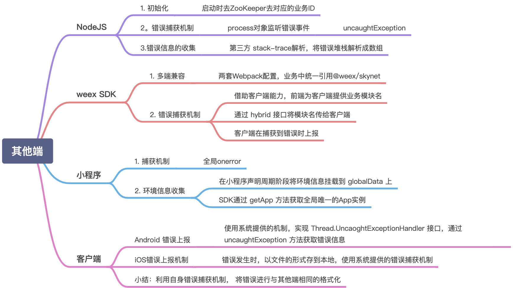

# 前端基建问题

- [前端代码规范](#前端代码规范)
- [前端提交规范](#前端提交规范)
- [自动化测试](#自动化测试)
- [jenkins自动部署](#jenkins自动部署)
- [GitHubActions自动部署](#GitHubActions自动部署)
- [脚手架搭建](#脚手架搭建)
- [数据埋点与错误监控](#数据埋点与错误监控)
- [浏览器识别](浏览器识别)
- [npm版本号的区别](npm版本号的区别)
- [package.json](#package.json)
- [代码混淆加密](#代码混淆加密)
- [nodejs版本管理](#nodejs版本管理)
- [npm镜像源管理](#npm镜像源管理)

---

### 前端代码规范

1. 参考链接：

  - [从 0 开始手把手带你搭建一套规范的 Vue3.x 项目工程环境](https://juejin.cn/post/6951649464637636622)
  - [EditorConfig](https://editorconfig.org/)
  - [.prettierrc文件常见配置](https://blog.csdn.net/onlyliii/article/details/89312857)
  - [prettier自定义配置](https://www.yuque.com/sida/file/bitad9)
  - [Eslint 配置项说明](https://blog.csdn.net/To_North/article/details/113789590)

2. 详解

  1. EditorConfig

    为不同 IDE 编辑器上处理同一项目的多个开发人员维护一致的编码风格

    项目根目录下增加 .editorconfig 文件：
    ```conf
    # Editor configuration, see http://editorconfig.org

    # 表示是最顶层的 EditorConfig 配置文件
    root = true

    [*] # 表示所有文件适用
    charset = utf-8 # 设置文件字符集为 utf-8
    indent_style = space # 缩进风格（tab | space）
    indent_size = 2 # 缩进大小
    end_of_line = lf # 控制换行类型(lf | cr | crlf)
    trim_trailing_whitespace = true # 去除行首的任意空白字符
    insert_final_newline = true # 始终在文件末尾插入一个新行

    [*.md] # 表示仅 md 文件适用以下规则
    max_line_length = off
    trim_trailing_whitespace = false
    ```

    VSCode 使用 EditorConfig 需要去插件市场下载插件 EditorConfig for VS Code 。

    JetBrains 系列（WebStorm、IntelliJ IDEA 等）则不用额外安装插件，可直接使用 EditorConfig 配置。

    更多配置
    ```conf
    # EditorConfig is awesome: https://EditorConfig.org

    # top-most EditorConfig file
    root = true

    # Unix-style newlines with a newline ending every file
    [*]
    end_of_line = lf
    insert_final_newline = true

    # Matches multiple files with brace expansion notation
    # Set default charset
    [*.{js,py}]
    charset = utf-8

    # 4 space indentation
    [*.py]
    indent_style = space
    indent_size = 4

    # Tab indentation (no size specified)
    [Makefile]
    indent_style = tab

    # Indentation override for all JS under lib directory
    [lib/**.js]
    indent_style = space
    indent_size = 2

    # Matches the exact files either package.json or .travis.yml
    [{package.json,.travis.yml}]
    indent_style = space
    indent_size = 2
    ```

  2. Prettier

    Prettier 是一款强大的代码格式化工具，支持 JavaScript、TypeScript、CSS、SCSS、Less、JSX、Angular、Vue、GraphQL、JSON、Markdown 等语言，基本上前端能用到的文件格式它都可以搞定，是当下最流行的代码格式化工具。

    * 安装：npm i prettier -D
    * 项目根目录下创建 .prettierrc 文件

      ```json
      {
        "useTabs": false,
        "tabWidth": 2,
        "printWidth": 100,
        "singleQuote": true,
        "trailingComma": "none",
        "bracketSpacing": true,
        "semi": false
      }
      ```

      常见配置
      ```json
      {
          // tab缩进大小,默认为2
          "tabWidth": 4,
          // 使用tab缩进，默认false
          "useTabs": false,
          // 使用分号, 默认true
          "semi": false,
          // 使用单引号, 默认false(在jsx中配置无效, 默认都是双引号)
          "singleQuote": false,
          // 行尾逗号,默认none,可选 none|es5|all
          // es5 包括es5中的数组、对象
          // all 包括函数对象等所有可选
          "TrailingCooma": "all",
          // 对象中的空格 默认true
          // true: { foo: bar }
          // false: {foo: bar}
          "bracketSpacing": true,
          // JSX标签闭合位置 默认false
          // false: <div
          //          className=""
          //          style={{}}
          //       >
          // true: <div
          //          className=""
          //          style={{}} >
          "jsxBracketSameLine": false,
          // 箭头函数参数括号 默认avoid 可选 avoid| always
          // avoid 能省略括号的时候就省略 例如x => x
          // always 总是有括号
          "arrowParens": "avoid"
      }
      {
          // 一行最多 100 字符
          printWidth: 100,
          // 使用 2 个空格缩进
          tabWidth: 2,
          // 不使用缩进符，而使用空格
          useTabs: false,
          // 行尾需要有分号
          semi: true,
          // 使用单引号
          singleQuote: true,
          // 对象的 key 仅在必要时用引号
          quoteProps: 'as-needed',
          // jsx 不使用单引号，而使用双引号
          jsxSingleQuote: false,
          // 末尾不需要逗号
          trailingComma: 'none',
          // 大括号内的首尾需要空格
          bracketSpacing: true,
          // jsx 标签的反尖括号需要换行
          jsxBracketSameLine: false,
          // 箭头函数，只有一个参数的时候，也需要括号
          arrowParens: 'always',
          // 每个文件格式化的范围是文件的全部内容
          rangeStart: 0,
          rangeEnd: Infinity,
          // 不需要写文件开头的 @prettier
          requirePragma: false,
          // 不需要自动在文件开头插入 @prettier
          insertPragma: false,
          // 使用默认的折行标准
          proseWrap: 'preserve',
          // 根据显示样式决定 html 要不要折行
          htmlWhitespaceSensitivity: 'css',
          // 换行符使用 lf
          endOfLine: 'lf'
      }
      ```

    * 使用命令来格式化代码
    
      ```conf
      # 格式化所有文件（. 表示所有文件）
      npx prettier --write .
      ```

    VSCode 编辑器使用 Prettier 配置需要下载插件 Prettier - Code formatter

    JetBrains 系列编辑器（WebStorm、IntelliJ IDEA 等）则不用额外安装插件，可直接使用 Prettier 配置。

  3. ESLint

    ESLint 是一款用于查找并报告代码中问题的工具，并且支持部分问题自动修复。其核心是通过对代码解析得到的 AST（Abstract Syntax Tree 抽象语法树）进行模式匹配，来分析代码达到检查代码质量和风格问题的能力。

    * 安装:npm i eslint -D
    * 终端操作提示完成一系列设置:npx eslint --init

      1. How would you like to use ESLint? （你想如何使用 ESLint?） 
      
        To check syntax, find problems, and enforce code style（检查语法、发现问题并强制执行代码风格）

      2. What type of modules does your project use?（你的项目使用哪种类型的模块?）

        JavaScript modules (import/export)

      3. Which framework does your project use? （你的项目使用哪种框架?）

        Vue.js

      4. Does your project use TypeScript?（你的项目是否使用 TypeScript？）

        Yes

      5. Where does your code run?（你的代码在哪里运行?）

        Browser 和 Node（按空格键进行选择，选完按回车键确定）

      6. How would you like to define a style for your project?（你想怎样为你的项目定义风格？）

        Use a popular style guide（使用一种流行的风格指南）

      7. Which style guide do you want to follow?（你想遵循哪一种风格指南?）

        Airbnb: github.com/airbnb/javascript

      8. What format do you want your config file to be in?（你希望你的配置文件是什么格式?）

        JavaScript

      9. Would you like to install them now with npm?（你想现在就用 NPM 安装它们吗?）

        Yes

        如果自动安装依赖失败，那么需要手动安装:
        
        npm i @typescript-eslint/eslint-plugin @typescript-eslint/parser eslint-config-airbnb-base eslint-plugin-import eslint-plugin-vue -D
        
      10. 项目根目录下自动生成 .eslintrc.js 配置文件

        ```conf
        module.exports = {
          env: {
            browser: true,
            es2021: true,
            node: true
          },
          extends: ['plugin:vue/essential', 'airbnb-base'],
          parserOptions: {
            ecmaVersion: 12,
            parser: '@typescript-eslint/parser',
            sourceType: 'module'
          },
          plugins: ['vue', '@typescript-eslint'],
          rules: {}
        }
        ```

    VSCode 使用 ESLint 配置文件需要去插件市场下载插件 ESLint 。

    编辑器保存文件时自动执行 eslint --fix 命令进行代码风格修复，VSCode 在 settings.json 设置文件中，增加以下代码：

    ```json
    "editor.codeActionsOnSave": {
        "source.fixAll.eslint": true
    }
    ```

    jetBrains 系列（WebStorm、IntelliJ IDEA 等）则不用额外安装插件。

    rules配置项
    ```json
    "no-alert": 0,//禁止使用alert confirm prompt
    "no-array-constructor": 2,//禁止使用数组构造器
    "no-bitwise": 0,//禁止使用按位运算符
    "no-caller": 1,//禁止使用arguments.caller或arguments.callee
    "no-catch-shadow": 2,//禁止catch子句参数与外部作用域变量同名
    "no-class-assign": 2,//禁止给类赋值
    "no-cond-assign": 2,//禁止在条件表达式中使用赋值语句
    "no-console": 2,//禁止使用console
    "no-const-assign": 2,//禁止修改const声明的变量
    "no-constant-condition": 2,//禁止在条件中使用常量表达式 if(true) if(1)
    "no-continue": 0,//禁止使用continue
    "no-control-regex": 2,//禁止在正则表达式中使用控制字符
    "no-debugger": 2,//禁止使用debugger
    "no-delete-var": 2,//不能对var声明的变量使用delete操作符
    "no-div-regex": 1,//不能使用看起来像除法的正则表达式/=foo/
    "no-dupe-keys": 2,//在创建对象字面量时不允许键重复 {a:1,a:1}
    "no-dupe-args": 2,//函数参数不能重复
    "no-duplicate-case": 2,//switch中的case标签不能重复
    "no-else-return": 2,//如果if语句里面有return,后面不能跟else语句
    "no-empty": 2,//块语句中的内容不能为空
    "no-empty-character-class": 2,//正则表达式中的[]内容不能为空
    "no-empty-label": 2,//禁止使用空label
    "no-eq-null": 2,//禁止对null使用==或!=运算符
    "no-eval": 1,//禁止使用eval
    "no-ex-assign": 2,//禁止给catch语句中的异常参数赋值
    "no-extend-native": 2,//禁止扩展native对象
    "no-extra-bind": 2,//禁止不必要的函数绑定
    "no-extra-boolean-cast": 2,//禁止不必要的bool转换
    "no-extra-parens": 2,//禁止非必要的括号
    "no-extra-semi": 2,//禁止多余的冒号
    "no-fallthrough": 1,//禁止switch穿透
    "no-floating-decimal": 2,//禁止省略浮点数中的0 .5 3.
    "no-func-assign": 2,//禁止重复的函数声明
    "no-implicit-coercion": 1,//禁止隐式转换
    "no-implied-eval": 2,//禁止使用隐式eval
    "no-inline-comments": 0,//禁止行内备注
    "no-inner-declarations": [2, "functions"],//禁止在块语句中使用声明（变量或函数）
    "no-invalid-regexp": 2,//禁止无效的正则表达式
    "no-invalid-this": 2,//禁止无效的this，只能用在构造器，类，对象字面量
    "no-irregular-whitespace": 2,//不能有不规则的空格
    "no-iterator": 2,//禁止使用__iterator__ 属性
    "no-label-var": 2,//label名不能与var声明的变量名相同
    "no-labels": 2,//禁止标签声明
    "no-lone-blocks": 2,//禁止不必要的嵌套块
    "no-lonely-if": 2,//禁止else语句内只有if语句
    "no-loop-func": 1,//禁止在循环中使用函数（如果没有引用外部变量不形成闭包就可以）
    "no-mixed-requires": [0, false],//声明时不能混用声明类型
    "no-mixed-spaces-and-tabs": [2, false],//禁止混用tab和空格
    "linebreak-style": [0, "windows"],//换行风格
    "no-multi-spaces": 1,//不能用多余的空格
    "no-multi-str": 2,//字符串不能用\换行
    "no-multiple-empty-lines": [1, {"max": 2}],//空行最多不能超过2行
    "no-native-reassign": 2,//不能重写native对象
    "no-negated-in-lhs": 2,//in 操作符的左边不能有!
    "no-nested-ternary": 0,//禁止使用嵌套的三目运算
    "no-new": 1,//禁止在使用new构造一个实例后不赋值
    "no-new-func": 1,//禁止使用new Function
    "no-new-object": 2,//禁止使用new Object()
    "no-new-require": 2,//禁止使用new require
    "no-new-wrappers": 2,//禁止使用new创建包装实例，new String new Boolean new Number
    "no-obj-calls": 2,//不能调用内置的全局对象，比如Math() JSON()
    "no-octal": 2,//禁止使用八进制数字
    "no-octal-escape": 2,//禁止使用八进制转义序列
    "no-param-reassign": 2,//禁止给参数重新赋值
    "no-path-concat": 0,//node中不能使用__dirname或__filename做路径拼接
    "no-plusplus": 0,//禁止使用++，--
    "no-process-env": 0,//禁止使用process.env
    "no-process-exit": 0,//禁止使用process.exit()
    "no-proto": 2,//禁止使用__proto__属性
    "no-redeclare": 2,//禁止重复声明变量
    "no-regex-spaces": 2,//禁止在正则表达式字面量中使用多个空格 /foo bar/
    "no-restricted-modules": 0,//如果禁用了指定模块，使用就会报错
    "no-return-assign": 1,//return 语句中不能有赋值表达式
    "no-script-url": 0,//禁止使用javascript:void(0)
    "no-self-compare": 2,//不能比较自身
    "no-sequences": 0,//禁止使用逗号运算符
    "no-shadow": 2,//外部作用域中的变量不能与它所包含的作用域中的变量或参数同名
    "no-shadow-restricted-names": 2,//严格模式中规定的限制标识符不能作为声明时的变量名使用
    "no-spaced-func": 2,//函数调用时 函数名与()之间不能有空格
    "no-sparse-arrays": 2,//禁止稀疏数组， [1,,2]
    "no-sync": 0,//nodejs 禁止同步方法
    "no-ternary": 0,//禁止使用三目运算符
    "no-trailing-spaces": 1,//一行结束后面不要有空格
    "no-this-before-super": 0,//在调用super()之前不能使用this或super
    "no-throw-literal": 2,//禁止抛出字面量错误 throw "error";
    "no-undef": 1,//不能有未定义的变量
    "no-undef-init": 2,//变量初始化时不能直接给它赋值为undefined
    "no-undefined": 2,//不能使用undefined
    "no-unexpected-multiline": 2,//避免多行表达式
    "no-underscore-dangle": 1,//标识符不能以_开头或结尾
    "no-unneeded-ternary": 2,//禁止不必要的嵌套 var isYes = answer === 1 ? true : false;
    "no-unreachable": 2,//不能有无法执行的代码
    "no-unused-expressions": 2,//禁止无用的表达式
    "no-unused-vars": [2, {"vars": "all", "args": "after-used"}],//不能有声明后未被使用的变量或参数
    "no-use-before-define": 2,//未定义前不能使用
    "no-useless-call": 2,//禁止不必要的call和apply
    "no-void": 2,//禁用void操作符
    "no-var": 0,//禁用var，用let和const代替
    "no-warning-comments": [1, { "terms": ["todo", "fixme", "xxx"], "location": "start" }],//不能有警告备注
    "no-with": 2,//禁用with
    "array-bracket-spacing": [2, "never"],//是否允许非空数组里面有多余的空格
    "arrow-parens": 0,//箭头函数用小括号括起来
    "arrow-spacing": 0,//=>的前/后括号
    "accessor-pairs": 0,//在对象中使用getter/setter
    "block-scoped-var": 0,//块语句中使用var
    "brace-style": [1, "1tbs"],//大括号风格
    "callback-return": 1,//避免多次调用回调什么的
    "camelcase": 2,//强制驼峰法命名
    "comma-dangle": [2, "never"],//对象字面量项尾不能有逗号
    "comma-spacing": 0,//逗号前后的空格
    "comma-style": [2, "last"],//逗号风格，换行时在行首还是行尾
    "complexity": [0, 11],//循环复杂度
    "computed-property-spacing": [0, "never"],//是否允许计算后的键名什么的
    "consistent-return": 0,//return 后面是否允许省略
    "consistent-this": [2, "that"],//this别名
    "constructor-super": 0,//非派生类不能调用super，派生类必须调用super
    "curly": [2, "all"],//必须使用 if(){} 中的{}
    "default-case": 2,//switch语句最后必须有default
    "dot-location": 0,//对象访问符的位置，换行的时候在行首还是行尾
    "dot-notation": [0, { "allowKeywords": true }],//避免不必要的方括号
    "eol-last": 0,//文件以单一的换行符结束
    "eqeqeq": 2,//必须使用全等
    "func-names": 0,//函数表达式必须有名字
    "func-style": [0, "declaration"],//函数风格，规定只能使用函数声明/函数表达式
    "generator-star-spacing": 0,//生成器函数*的前后空格
    "guard-for-in": 0,//for in循环要用if语句过滤
    "handle-callback-err": 0,//nodejs 处理错误
    "id-length": 0,//变量名长度
    "indent": [2, 4],//缩进风格
    "init-declarations": 0,//声明时必须赋初值
    "key-spacing": [0, { "beforeColon": false, "afterColon": true }],//对象字面量中冒号的前后空格
    "lines-around-comment": 0,//行前/行后备注
    "max-depth": [0, 4],//嵌套块深度
    "max-len": [0, 80, 4],//字符串最大长度
    "max-nested-callbacks": [0, 2],//回调嵌套深度
    "max-params": [0, 3],//函数最多只能有3个参数
    "max-statements": [0, 10],//函数内最多有几个声明
    "new-cap": 2,//函数名首行大写必须使用new方式调用，首行小写必须用不带new方式调用
    "new-parens": 2,//new时必须加小括号
    "newline-after-var": 2,//变量声明后是否需要空一行
    "object-curly-spacing": [0, "never"],//大括号内是否允许不必要的空格
    "object-shorthand": 0,//强制对象字面量缩写语法
    "one-var": 1,//连续声明
    "operator-assignment": [0, "always"],//赋值运算符 += -=什么的
    "operator-linebreak": [2, "after"],//换行时运算符在行尾还是行首
    "padded-blocks": 0,//块语句内行首行尾是否要空行
    "prefer-const": 0,//首选const
    "prefer-spread": 0,//首选展开运算
    "prefer-reflect": 0,//首选Reflect的方法
    "quotes": [1, "single"],//引号类型 `` "" ''
    "quote-props":[2, "always"],//对象字面量中的属性名是否强制双引号
    "radix": 2,//parseInt必须指定第二个参数
    "id-match": 0,//命名检测
    "require-yield": 0,//生成器函数必须有yield
    "semi": [2, "always"],//语句强制分号结尾
    "semi-spacing": [0, {"before": false, "after": true}],//分号前后空格
    "sort-vars": 0,//变量声明时排序
    "space-after-keywords": [0, "always"],//关键字后面是否要空一格
    "space-before-blocks": [0, "always"],//不以新行开始的块{前面要不要有空格
    "space-before-function-paren": [0, "always"],//函数定义时括号前面要不要有空格
    "space-in-parens": [0, "never"],//小括号里面要不要有空格
    "space-infix-ops": 0,//中缀操作符周围要不要有空格
    "space-return-throw-case": 2,//return throw case后面要不要加空格
    "space-unary-ops": [0, { "words": true, "nonwords": false }],//一元运算符的前/后要不要加空格
    "spaced-comment": 0,//注释风格要不要有空格什么的
    "strict": 2,//使用严格模式
    "use-isnan": 2,//禁止比较时使用NaN，只能用isNaN()
    "valid-jsdoc": 0,//jsdoc规则
    "valid-typeof": 2,//必须使用合法的typeof的值
    "vars-on-top": 2,//var必须放在作用域顶部
    "wrap-iife": [2, "inside"],//立即执行函数表达式的小括号风格
    "wrap-regex": 0,//正则表达式字面量用小括号包起来
    "yoda": [2, "never"]//禁止表达条件
    ```

  4. 解决 Prettier 和 ESLint 的冲突

    在项目中根据实际情况添加一些额外的 ESLint 和 Prettier 配置规则，难免会存在规则冲突情况。例如：

      ESLint 配置中使用了 Airbnb JavaScript 风格指南校验，其规则之一是代码结束后面要加分号

      Prettier 配置文件中加了代码结束后面不加分号的配置项

    需要用到 eslint-plugin-prettier 和 eslint-config-prettier。

      eslint-plugin-prettier 将 Prettier 的规则设置到 ESLint 的规则中。

      eslint-config-prettier 关闭 ESLint 中与 Prettier 中会发生冲突的规则。

    最后形成优先级：Prettier 配置规则 > ESLint 配置规则。

    * 安装：npm i eslint-plugin-prettier eslint-config-prettier -D
    * 在 .eslintrc.js 添加 prettier 插件

      ```json
      module.exports = {
        ...
        extends: [
          'plugin:vue/essential',
          'airbnb-base',
          'plugin:prettier/recommended' // 添加 prettier 插件
        ],
        ...
      }
      ```

  5. husky 和 lint-staged

    让没通过 ESLint 检测和修复的代码禁止提交，从而保证仓库代码都是符合规范的。

    需要用到 Git Hook，在本地执行 git commit 的时候，就对所提交的代码进行 ESLint 检测和修复（即执行 eslint --fix），如果这些代码没通过 ESLint 规则校验，则禁止提交。

    * 配置：npx husky-init
    * 安装：npm install
    * 修改 .husky/pre-commit hook 文件的触发命令：eslint --fix ./src --ext .vue,.js,.ts

      当我们执行 git commit -m "xxx" 时，会先对 src 目录下所有的 .vue、.js、.ts 文件执行 eslint --fix 命令，如果 ESLint 通过，成功 commit，否则终止 commit。

    在提交代码时，也会对其他未修改的“历史”文件都进行检查，可能会造成大量文件出现 ESLint 错误，显然不是我们想要的结果。

    lint-staged 这个工具一般结合 husky 来使用，它可以让 husky 的 hook 触发的命令只作用于 git add那些文件（即 git 暂存区的文件），而不会影响到其他文件。

    * 安装：npm i lint-staged -D
    * package.json里增加 lint-staged 配置项

      这行命令表示：只对 git 暂存区的 .vue、.js、.ts 文件执行 eslint --fix。
      ```json
      "lint-staged": {
        "*.{vue,js,ts}": "eslint --fix"
      },
      ```

    * 修改 .husky/pre-commit hook 的触发命令为：npx lint-staged

### 前端提交规范

1. 参考链接：

  - [从 0 开始手把手带你搭建一套规范的 Vue3.x 项目工程环境](https://juejin.cn/post/6951649464637636622)

2. 详解

  * angular提交规范

    使用社区最流行、最知名、最受认可的 Angular 团队提交规范

    * 格式规范

      * header

        * type(scope): subject

          1. type（必需）

            type 用于说明 commit 的提交类型

            * feat新增一个功能
            * fix修复一个 Bug
            * docs文档变更
            * style代码格式（不影响功能，例如空格、分号等格式修正）
            * refactor代码重构
            * perf改善性能
            * test测试
            * build变更项目构建或外部依赖（例如 scopes: webpack、gulp、npm 等）
            * ci更改持续集成软件的配置文件和 package 中的 scripts 命令，例如 scopes: Travis, Circle 等
            * chore变更构建流程或辅助工具
            * revert代码回退
        
          2. scope（可选）

            指定本次 commit 影响的范围。
            
            例如在业务项目中可以依据菜单或者功能模块划分，如果是组件库开发，则可以依据组件划分。

          3. subject（必需）

            本次 commit 的简洁描述，长度约定在 50 个字符以内

            * 用动词开头，第一人称现在时表述，例如：change 代替 changed 或 changes
            * 第一个字母小写
            * 结尾不加句号（.）

      * body

        对本次 commit 的详细描述，可以分成多行。（body 可省略）

        跟 subject 类似，用动词开头，body 应该说明修改的原因和更改前后的行为对比。

      * footer

        如果本次提交的代码是突破性的变更或关闭缺陷，则 Footer 必需，否则可以省略。

        * 突破性的变更

          当前代码与上一个版本有突破性改变，则 Footer 以 BREAKING CHANGE 开头，后面是对变动的描述、以及变动的理由。

        * 关闭缺陷

          如果当前提交是针对特定的 issue，那么可以在 Footer 部分填写需要关闭的单个 issue 或一系列 issues。

    * 例子

      * feat

        ```txt
        feat(browser): onUrlChange event (popstate/hashchange/polling)

        Added new event to browser:
        - forward popstate event if available
        - forward hashchange event if popstate not available
        - do polling when neither popstate nor hashchange available

        Breaks $browser.onHashChange, which was removed (use onUrlChange instead)
        ```

      * fix

        ```txt
        fix(compile): couple of unit tests for IE9

        Older IEs serialize html uppercased, but IE9 does not...
        Would be better to expect case insensitive, unfortunately jasmine does
        not allow to user regexps for throw expectations.

        Closes #392
        Breaks foo.bar api, foo.baz should be used instead
        ```

      * style

        ```txt
        style(location): add couple of missing semi colons
        ```

      * chore

        ```txt
        chore(release): v3.4.2
        ```

    * 规范 commit message 的好处

      * 首行就是简洁实用的关键信息，方便在 git history 中快速浏览。
      * 具有更加详细的 body 和 footer，可以清晰的看出某次提交的目的和影响。
      * 可以通过 type 过滤出想要查找的信息，也可以通过关键字快速查找相关提交。
      * 可以直接从 commit 生成 change log。

  * Commitizen

    Commitizen 是一个帮助撰写规范 commit message 的工具。它有一个命令行工具 cz-cli。

    * 安装:npm install commitizen -D
    * 初始化项目:npx commitizen init cz-conventional-changelog --save-dev --save-exact
    * 使用 Commitizen

      以前提交代码都是 git commit -m "xxx"，现在改为 git cz，然后按照终端操作提示，逐步填入信息，就能自动生成规范的 commit message。

    * 自定义配置提交说明(如使用中文)

      * cz-customizable 初始化项目(之前已经初始化过一次，这次再初始化，需要加 --force 覆盖。):npx commitizen init cz-customizable --save-dev --save-exact --force
      * 项目根目录下创建 .cz-config.js 文件

        ```js
        module.exports = {
          // type 类型（定义之后，可通过上下键选择）
          types: [
            { value: 'feat', name: 'feat:     新增功能' },
            { value: 'fix', name: 'fix:      修复 bug' },
            { value: 'docs', name: 'docs:     文档变更' },
            { value: 'style', name: 'style:    代码格式（不影响功能，例如空格、分号等格式修正）' },
            { value: 'refactor', name: 'refactor: 代码重构（不包括 bug 修复、功能新增）' },
            { value: 'perf', name: 'perf:     性能优化' },
            { value: 'test', name: 'test:     添加、修改测试用例' },
            { value: 'build', name: 'build:    构建流程、外部依赖变更（如升级 npm 包、修改 webpack 配置等）' },
            { value: 'ci', name: 'ci:       修改 CI 配置、脚本' },
            { value: 'chore', name: 'chore:    对构建过程或辅助工具和库的更改（不影响源文件、测试用例）' },
            { value: 'revert', name: 'revert:   回滚 commit' }
          ],

          // scope 类型（定义之后，可通过上下键选择）
          scopes: [
            ['components', '组件相关'],
            ['hooks', 'hook 相关'],
            ['utils', 'utils 相关'],
            ['element-ui', '对 element-ui 的调整'],
            ['styles', '样式相关'],
            ['deps', '项目依赖'],
            ['auth', '对 auth 修改'],
            ['other', '其他修改'],
            // 如果选择 custom，后面会让你再输入一个自定义的 scope。也可以不设置此项，把后面的 allowCustomScopes 设置为 true
            ['custom', '以上都不是？我要自定义']
          ].map(([value, description]) => {
            return {
              value,
              name: `${value.padEnd(30)} (${description})`
            }
          }),

          // 是否允许自定义填写 scope，在 scope 选择的时候，会有 empty 和 custom 可以选择。
          // allowCustomScopes: true,
          // allowTicketNumber: false,
          // isTicketNumberRequired: false,
          // ticketNumberPrefix: 'TICKET-',
          // ticketNumberRegExp: '\\d{1,5}',
          // 针对每一个 type 去定义对应的 scopes，例如 fix
          /*
          scopeOverrides: {
            fix: [
              { name: 'merge' },
              { name: 'style' },
              { name: 'e2eTest' },
              { name: 'unitTest' }
            ]
          },
          */

          // 交互提示信息
          messages: {
            type: '确保本次提交遵循 Angular 规范！\n选择你要提交的类型：',
            scope: '\n选择一个 scope（可选）：',
            // 选择 scope: custom 时会出下面的提示
            customScope: '请输入自定义的 scope：',
            subject: '填写简短精炼的变更描述：\n',
            body:
              '填写更加详细的变更描述（可选）。使用 "|" 换行：\n',
            breaking: '列举非兼容性重大的变更（可选）：\n',
            footer: '列举出所有变更的 ISSUES CLOSED（可选）。 例如: #31, #34：\n',
            confirmCommit: '确认提交？'
          },

          // 设置只有 type 选择了 feat 或 fix，才询问 breaking message
          allowBreakingChanges: ['feat', 'fix'],

          // 跳过要询问的步骤
          // skipQuestions: ['body', 'footer'],

          // subject 限制长度
          subjectLimit: 100
          breaklineChar: '|', // 支持 body 和 footer
          // footerPrefix : 'ISSUES CLOSED:'
          // askForBreakingChangeFirst : true,
        }
        ```

      * 很多时候我们不需要写长描述，公司内部的代码仓库也不需要管理 issue，那么可以把询问 body 和 footer 的步骤跳过（在 .cz-config.js 中修改成 skipQuestions: ['body', 'footer']）。

  * commitlint

    提交代码这个环节，我们也增加一个限制：只让符合 Angular 规范的 commit message 通过，我们借助 @commitlint/config-conventional 和 @commitlint/cli 来实现

    * 安装:npm i @commitlint/config-conventional @commitlint/cli -D
    * 项目根目录下创建 commitlint.config.js 文件

      ```js
      module.exports = { extends: ['@commitlint/config-conventional'] }
      ```

    * 使用 husky 的 commit-msg hook 触发验证提交信息的命令:npx husky add .husky/commit-msg "npx --no-install commitlint --edit $1"

### 自动化测试

1. 参考链接：

  - [不想痛失薪资普调和年终奖？试试自动化测试！（基础篇）](https://juejin.im/post/5eeae4f7e51d4574195ed982)

  - [Jest](https://www.jianshu.com/p/c2fef6b2820f)

  - [Jest Docs](https://jestjs.io/docs/en/getting-started)

  - [从 0 开始手把手带你搭建一套规范的 Vue3.x 项目工程环境](https://juejin.cn/post/6951649464637636622)

2. 详解

  - 测试类型

    - 单元测试（Unit Test）

      通常情况下，在公共函数/组件中一定要有单元测试来保证代码能够正常工作。单元测试也应该是项目中数量最多、覆盖率最高的。

    - 集成测试（Integration Test）

      集成测试通常被应用在：耦合度较高的函数/组件、经过二次封装的函数/组件、多个函数/组件组合而成的函数/组件等。

      集成测试的目的在于，测试经过单元测试后的各个模块组合在一起是否能正常工作。会对组合之后的代码整体暴露在外接口进行测试，查看组合后的代码工作是否符合预期。

    - UI 测试（UI Test）

      UI 测试（UI Test）只是对于前端的测试，是脱离真实后端环境的，仅仅只是将前端放在真实环境中运行，而后端和数据都应该使用 Mock 的。

      端到端测试（E2E Test）则是将整个应用放到真实的环境中运行，包括数据在内也是需要使用真实的。

  - 适合引入自动化测试的场景

    - 公共库类的开发维护
    - 中长期项目的迭代/重构
    - 引用了不可控的第三方依赖

  - 测试工具

    - 单元测试

      Mocha, Ava, Karma, Jest, Jasmine

    - 集成测试和 UI 测试

      ReactTestUtils, Test Render, Enzyme, React-Testing-Library, Vue-Test-Utils

  - 测试思想

    - TDD：Test-Driven Development（测试驱动开发）

      在编写某个功能的代码之前先编写测试代码，然后只编写使测试通过的功能代码，通过测试来推动整个开发的进行

    - BDD：Behavior-Driven Development（行为驱动开发）

      使用自然语言来描述系统功能和业务逻辑，从而根据这些描述步骤进行系统自动化的测试

  - Jest使用

    ```js
    // sum.ts
    const sum = (a: number, b: number): number => { 
      return a + b;
    };
    // sum.test.ts
    describe('Should sum function run correctly', () => { 
      test('input: 1, 2 expect: 3', () => {
      // toBe:判断是否严格相等（使用Object .is) 
      expect(sum(1, 2)).toBe(3); // toXXX:匹配器 
      // toEqual:判断值是否相等 
      expect(sum(1, 2)).toEqual(3);
      // toBeDefined:判断是否被定义 
      expect(sum(1, 2)).toBeDefined();
      // toBeUndefined:判断是否未被定义
      expect(sum(1, 2)).not.toBeUndefined(); // not.toXXX:取反
      // toBeTruthy:判断是否为真值（true、非零数字、非空字符串、对象/数组等) 
      expect(sum(1, 2)).toBeTruthy();
      // toBeFalsy:判断是否为假值（false、0、空字符串、undefined/null 等) 
      expect(sum(1, 2)).not.toBeFalsy();
      // toBeG reate「Than:判断数值是否大于期望值 
      expect(sum(1, 2)).toBeGreaterThan(2);
      // toBeLessThan:判断数值是否小于期望值 
      expect(sum(1, 2)).toBeLessThan(4);
      // toBeGreaterThanO「Equal:判断数值是否大于等于期望值 
      expect(sum(1, 2)).toBeGreaterThan0rEqual(3);
      // toBeLessThanOrEqual:判断数值是否小于等于期望值 
      expect(sum(1, 2)).toBeLessThan0rEqual(3);
      expect(n).toBeNull(); //判断是否为null
      expect(value).toBeCloseTo(0.3); // 浮点数判断相等
      expect('Christoph').toMatch(/stop/); //正则表达式判断
      expect(['one','two']).toContain('one'); //包含判断ss
      });
    });
    ```

    ```js
    // showHello.ts
    const showHello: string = 'Hello,aaa';
    // showHello.test.ts
    describe('Should showHello defined correctly', () => { 
      it('expect to match "Hello"', () => { 
        expect(showHello).toMatch(/hello/i);
      });
      it('expect to match "aaa"', () => { 
        expect(showHello).toMatch('aaa');
      });
    });
    ```

    ```js
    // array.ts
    const array: [number] = [1, 2, 3, 4];
    // array.test.ts
    describe('Should array defined correctly',  () => {
      it('expect to contain 1', () => { 
        expect(array).toContain(l);
      });
      it('expect to contain 1', () => { 
        expect(new Set(array)).toContain(l); 
      });
    });
    ```

    ```js
    // compileAndroidCode.ts 
    const compileAndroidCode = Error => { 
      throw new Error('you are using the wrong JDK');
    };
    // compileAndroidCode.test.ts
    test('compiling android goes as expected', () => { 
      expect(compileAndroidCode).toThrow(); 
      expect(compileAndroidCode).toThrow(Error);
      expect(compileAndroidCode).toThrow('you are using the wrong JDK'); 
      expect(compileAndroidCode).toThrow(/JDK/);
    });
    ```

    ```js
    // 回调
    it('done', (done) => { 
      fetch('/example')
      .then((res) => {
        expect(res).toEqual({ code: '200', data: {}, msg: 'success' }); 
        done();
      })
      .catch((err) => { 
        done(err);
      });
    });
    ```

    ```js
    function sayHello(name) { 
      return `Hello ${name}`;
    }
    function say(callback) { 
      callback('aaa');
    }
    it('Test sayHello function run correctly', () => { 
      const mockFunc = jest.fn(sayHello);
      say(mockFunc);
      // toHaveBeenCalled:判断Mock函数是否被调用 
      expect(mockFunc).toHaveBeenCalled();
      // toHaveBeenCalledWith:判断Mock函数被调用时的参数 
      expect (mockFunc) .toHaveBeenCalledWith('aaa');
      say(mockFunc);
      // toHaveBeenCalledTimes:判断Mock函数被调用的次数 
      expect(mockFunc).toHaveBeenCalledTimes(2);
      // toHaveReturned:判断Mock函数是否有返回值 
      expect(mockFunc).toHaveReturned();
      // toHaveReturnedWith:判断Mock函数被调用时的返回值 
      expect (mockFunc) .toHaveReturnedWith('Hello'); 
    });
    ```

    ```js
    it('promise resolve' , () => {
      return fetch('/example').then((res) => { 
        expect(res).toEqual({ code: '200', data: {}, msg: 'success' });
      });
    });
    it('promise reject', () => { 
      expect.assertions(1);//保证1条断言被调用 
      return fetch('/example').catch((error) => { 
        expect(error).toMatch('error');
      });
    });
    it('async/await resolve', async () => { 
      const res = await fetch('/example'); 
      expect(res).toEqual({ code: '200', data: {}, msg: 'success' });
    });
    it('async/await reject', async () => { 
      expect.assertions(1);//保证1条断言被调用 
      try {
        await fetch('/example');
      } catch (err) { 
        expect(err).toMatch('error');
      }
    });
    ```

    ```js
    describe('outer', () => {
      console.log('describe outer-a');
      describe('describe inner 1', () => { 
        console.log('describe inner 1'); 
        test('test'  , () => {
          console.log('test for describe inner 1'); 
          expect(true).toEqual(true);
        });
      });
      console.log('describe outer-b');
      test('test 1', () => {
        console.log('test for describe outer'); 
        expect(true).toEqual(true);
      });
      describe('describe inner 2', () => { 
        console.log('describe inner 2'); 
        test('test for describe inner 2', () => { 
          console.log('test for describe inner 2'); 
          expect(false).toEqual(false);
        });
      });
      console.log('describe outer-c');
    });
    // describe outer-a 
    // describe inner 1 
    // describe outer-b 
    // describe inner 2 
    // describe outer-c 
    // test for describe inner 1 
    // test for describe outer 
    // test for describe inner 2
    ```

    ```js
    //推荐
    it('best method', () => {
      return expect(fetch('./example')).resolves.toEqual({ 
        code: '200', 
        data: {}, 
        msg: 'success'
      });
    });
    it('best method', () => {
      return expect(fetch('./example')).rejects.toMatch('error');
    });
    it('best method', async () => { 
      await expect(fetch('./example')).resolves.toEqual({ 
        code: '200', 
        data: {}, 
        msg: 'success' 
      });
    });
    it('best method', async () => { 
      await expect(fetch('./example')).rejects.toMatch('error');
    });
    ```

    ```js
    // 生 命 周 期 钩 子
    beforeAll(() => console.log('1 - beforeAll')); 
    afterAll(() => console.log('1 - afterAll')); 
    beforeEach(() => console.log('1 - beforeEach')); 
    afterEach(() => console.log('1 - afterEach')); 
    test('', () => console.log('1 - test')); 
    describe('Scoped / Nested block', () =>  {
      beforeAll(() => console.log('2 - beforeAll')); 
      afterEach(() => console.log('2 - afterAll')); 
      beforeEach(() => console.log('2 - beforeEach')); 
      afterEach(() => console.log('2 - afterEach')); 
      test('', () => console.log('2 - test'));
    });
    // 1 - beforeAll 
    // 1 - beforeEach 
    // 1 - test 
    // 1 - afterEach 
    // 2 - beforeAll 
    // 1 - beforeEach 
    // 2 - beforeEach 
    // 2 - test 
    // 2 - afterEach 
    // 1 - afterEach 
    // 2 - afterAll 
    // 1 - afterAll
    ```

  - vue3-jest-typescript

    * 安装:npm i @vue/test-utils@next jest vue-jest@next ts-jest -D
    * 项目根目录下新建 jest.config.js 文件

      ```js
      module.exports = {
        moduleFileExtensions: ['vue', 'js', 'ts'],
        preset: 'ts-jest',
        testEnvironment: 'jsdom',
        transform: {
          '^.+\\.vue$': 'vue-jest', // vue 文件用 vue-jest 转换
          '^.+\\.ts$': 'ts-jest' // ts 文件用 ts-jest 转换
        },
        // 匹配 __tests__ 目录下的 .js/.ts 文件 或其他目录下的 xx.test.js/ts xx.spec.js/ts
        testRegex: '(/__tests__/.*|(\\.|/)(test|spec))\\.(ts)$'
      }
      ```

    * 创建单元测试文件

      ```txt
      ├── src/
      └── tests/                           // 单元测试目录
          ├── Test.spec.ts                 // Test 组件测试
      ```

    * Test.vue

      ```html
      <template>
        <div class="test-container page-container">
          <div class="page-title">Unit Test Page</div>
          <p>count is: {{ count }}</p>
          <button @click="increment">increment</button>
        </div>
      </template>

      <script lang="ts">
        import { defineComponent, ref } from 'vue'

        export default defineComponent({
          name: 'Vuex',
          setup() {
            const count = ref<number>(0)
            const increment = () => {
              count.value += 1
            }
            return { count, increment }
          }
        })
      </script>
      ```

    * Test.spec.ts

      ```ts
      import { mount } from '@vue/test-utils'
      import Test from '../src/views/Test.vue'

      test('Test.vue', async () => {
        const wrapper = mount(Test)
        expect(wrapper.html()).toContain('Unit Test Page')
        expect(wrapper.html()).toContain('count is: 0')
        await wrapper.find('button').trigger('click')
        expect(wrapper.html()).toContain('count is: 1')
      })
      ```

    * 安装 @types/jest(解决IDE提示某些方法不存在（如 test、describe、it、expect等）):npm i @types/jest -D
    * 把 @types/jest 添加根目录下的 ts.config.json

      ```json
      {
        "compilerOptions": {
          ...
          "types": ["vite/client", "jest"]
        },
      }
      ```

    * 安装 eslint-plugin-jest(解除对jest的校验):npm i eslint-plugin-jest -D
    * 添加 eslint-plugin-jest 到 ESLint 配置文件 .eslintrc.js 中

      ```json
      module.exports = {
        ...
        extends: [
          ...
          'plugin:jest/recommended'
        ],
        ...
      }
      ```
    * 执行单元测试

      在根目录下 package.json 文件的 scripts 中，添加一条单元测试命令： "test": "jest"

      执行命令 npm run test 即可进行单元测试，jest 会根据 jest.config.js 配置文件去查找 \__tests__ 目录下的 .ts 文件或其他任意目录下的 .spec.ts 和 .test.ts 文件，然后执行单元测试方法。

    * 单元测试约束

      使用 husky 命令在 .husky 目录下自动创建 pre-push hook 文件，并在此执行单元测试命令 npm run test。

      npx husky add .husky/pre-push "npm run test $1"

      在 git push 时就能先进行单元测试了，只有单元测试全部通过，才能成功 push。

### jenkins自动部署

1. 参考链接：

  - [让Jenkins自动布署你的Vue项目](https://mp.weixin.qq.com/s/oiznlZ_4L_0Am2SNOonLDw)
  - [windows上Jenkins安装及其配置](https://www.cnblogs.com/fuxuepan/articles/9525623.html)
  - [jenkins_windows(七)：SVN自动触发项目构建的配置](https://blog.csdn.net/kongsuhongbaby/article/details/100170537)
  - [jenkins自动化部署安装部署（Windows-SVN版）](https://blog.csdn.net/dwn1209/article/details/73189080)
  - [Jenkins](https://www.jenkins.io/)

2. 详解

  1. 安装

    通过msi/exe/yum安装java/git/nginx/jenkins

  2. 配置jenkins

    安装后，默认localhost:8080打开登录页，根据提示找到并输入密码

    安装推荐插件，设置用户名、密码等

    安装插件：Rebuilder、SafeRestart、nodeJs，在“系统管理”-“全局配置”-“NodeJs别名”指定版本

  3. github配置

    jenkins创建一个新任务，关联 GitHub项目地址，选择构建环境并编写shell 命令(参考文章1)

    构建完成后，在“工作空间”多出打包后的dist目录

    到这里已经实现了本地代码提交到github，然后在jenkins上点击构建，可以拉取代码并且打包，下一步实现打包后的dist目录放到目标服务器上。

    系统管理-> 系统设置->Publish over SSH里设置服务器信息，填写完后点击test，出现Success说明配置成功

    在刚才的testJenkins工程中配置构建后操作，选择send build artificial over SSH，在构建中添加压缩dist目录命令

    填完后执行构建。成功后登录我们目标服务器发现test目录下有了要运行的文件，访问域名发现项目可以访问

    接下来实现开发本地push代码到github上后，触发Webhook，jenkins自动执行构建。jenkins安装Generic Webhook Trigger 插件，github添加触发器

    在刚才的testJenkins工程中点击构建触发器中选择Generic Webhook Trigger，填写token

    选择github项目中的Settings->Webhooks>add webhook，配置方式按(参考文章1)，选择在push代码时触发webhook，成功后会在下方出现一个绿色的小勾勾

  4. svn配置

    jenkins中生成用户授权的Token：“系统管理”-“管理用户”-“设置按钮”-“添加新token”-“生成”-保存token
    
    在jenkins项目配置中生成项目授权Token，勾选远程触发，勾选：轮询SCM，日程表为空，表示被post-commit钩子触发执行

    SVN服务端配置webhook：新建触发脚本vbs(参考文章3),svn管理器-选择要触发的仓库-右键Properties-“Hooks”-“Post-commit hook”-输入脚本(参考文章3)-“确定”

### GitHubActions自动部署

1. 参考链接：

  - [从 0 开始手把手带你搭建一套规范的 Vue3.x 项目工程环境](https://juejin.cn/post/6951649464637636622)

2. 详解

  * GitHub Actions

    GitHub Actions 是 GitHub 的持续集成服务，持续集成由很多操作组成，比如抓取代码、运行测试、登录远程服务器、发布到第三方服务等等，GitHub 把这些操作称为 actions。

  * 步骤

    1. 创建 GitHub 仓库

      * master 分支存储项目源代码
      * gh-pages 分支存储打包后的静态文件

        gh-pages 分支，是 GitHub Pages 服务的固定分支，可以通过 HTTP 的方式访问到这个分支的静态文件资源。

    2. 创建 GitHub Token

      创建一个有 repo 和 workflow 权限的 GitHub Token

      新生成的 Token 只会显示一次，保存起来，后面要用到。如有遗失，重新生成即可。

    3. 在仓库中添加 secret

      将上面新创建的 Token 添加到 GitHub 仓库的 Secrets 里，并将这个新增的 secret 命名为 VUE3_DEPLOY （名字无所谓，看你喜欢）。

      步骤：仓库 -> settings -> Secrets -> New repository secret。

      新创建的 secret VUE3_DEPLOY 在 Actions 配置文件中要用到，两个地方需保持一致！

    4. 项目根目录下创建 .github 目录

      ```txt
      ├── .github/
      └────── workflows/
                ├── deploy.yml
      ```

      deploy.yml
      ```yml
      name: deploy

      on:
        push:
          branches: [master] # master 分支有 push 时触发

      jobs:
        deploy:
          runs-on: ubuntu-latest
          steps:
            - uses: actions/checkout@v2

            - name: Setup Node.js v14.x
              uses: actions/setup-node@v1
              with:
                node-version: '14.x'

            - name: Install
              run: npm install # 安装依赖

            - name: Build
              run: npm run build # 打包

            - name: Deploy
              uses: peaceiris/actions-gh-pages@v3 # 使用部署到 GitHub pages 的 action
              with:
                publish_dir: ./dist # 部署打包后的 dist 目录
                github_token: ${{ secrets.VUE3_DEPLOY }} # secret 名
                user_name: ${{ secrets.MY_USER_NAME }}
                user_email: ${{ secrets.MY_USER_EMAIL }}
                commit_message: Update Vite2.x + Vue3.x + TypeScript Starter # 部署时的 git 提交信息，自由填写
      ```

  * 原理

    当有新提交的代码 push 到 GitHub 仓库时，就会触发 GitHub Actions，在 GitHub 服务器上执行 Action 配置文件里面的命令，例如：安装依赖、项目打包等，然后将打包好的静态文件部署到 GitHub Pages 上，最后，我们就能通过域名访问了。

### 脚手架搭建

1. 参考链接：

  - [从 0 构建自己的脚手架知识体系（万字）](https://juejin.cn/post/6966119324478079007)
  - [GENERATORS](https://yeoman.io/generators/)

2. 详解

  * 创建流程

    1. 建立package.json

      npm init

      ```json
      {
          "name": "cliExample",
          "version": "1.0.0",
          "description": "",
          "main": "cli.js",
          "bin": "cli.js",
          "scripts": {
              "test": "echo \"Error: no test specified\" && exit 1"
          },
          "author": "",
          "license": "ISC",
          "dependencies": {
              "ejs": "^3.1.6",
              "inquirer": "^8.1.0"
          }
      }
      ```

    2. 建立执行文件

      对应上方cli.js

      可建立模板文件，对文件进行读写等操作

    3. 链接到全局

      npm link

      可在全局执行命令，对应上方cliExample

    4. 执行命令即可搭建自定义脚手架

  * 工具库

    1. 命令行交互工具:询问用户信息

      npm install inquirer --dev
      ```js
      const inquirer = require('inquirer')

      inquirer.prompt([
        {
          type: 'input', //type： input, number, confirm, list, checkbox ... 
          name: 'name', // key 名
          message: 'Your name', // 提示信息
          default: 'my-node-cli' // 默认值
        }
      ]).then(answers => {
        // 打印互用输入结果
        console.log(answers)
      })
      ```

    2. 自定义命令行指令

      npm install commander
      ```js
      const program = require('commander')

      program
      .version('0.1.0')
      .command('create <name>')
      .description('create a new project')
      .action(name => { 
          // 打印命令行输入的值
          console.log("project name is " + name)
      })

      program.parse()
      ```

      npm link后，即可使用命令：[包名] create [项目名]

      如：vue create myProject

    3. 命令行美化工具

      npm install chalk
      ```js
      const program = require('commander')
      const chalk = require('chalk')

      program
      .version('0.1.0')
      .command('create <name>')
      .description('create a new project')
      .action(name => { 
          // 打印命令行输入的值

          // 文本样式
          console.log("project name is " + chalk.bold(name))

          // 颜色
          console.log("project name is " + chalk.cyan(name))
          console.log("project name is " + chalk.green(name))

          // 背景色
          console.log("project name is " + chalk.bgRed(name))

          // 使用RGB颜色输出
          console.log("project name is " + chalk.rgb(4, 156, 219).underline(name));
          console.log("project name is " + chalk.hex('#049CDB').bold(name));
          console.log("project name is " + chalk.bgHex('#049CDB').bold(name))
      })

      program.parse()
      ```

    4. ora 命令行 loading 动效

      ```js
      // 自定义文本信息
      const message = 'Loading unicorns'
      // 初始化
      const spinner = ora(message);
      // 开始加载动画
      spinner.start();

      setTimeout(() => {
          // 修改动画样式

          // Type: string
          // Default: 'cyan'
          // Values: 'black' | 'red' | 'green' | 'yellow' | 'blue' | 'magenta' | 'cyan' | 'white' | 'gray'
          spinner.color = 'red';    
          spinner.text = 'Loading rainbows';

          setTimeout(() => {
              // 加载状态修改
              spinner.stop() // 停止
              spinner.succeed('Loading succeed'); // 成功 ✔
              // spinner.fail(text?);  失败 ✖
              // spinner.warn(text?);  提示 ⚠
              // spinner.info(text?);  信息 ℹ
          }, 2000);
      }, 2000);
      ```

    5. cross-spawn 跨平台 shell 工具

      在脚手架里面，可以用来自动执行 shell 命令
      ```js
      const spawn = require('cross-spawn');
      const chalk = require('chalk')

      // 定义需要按照的依赖
      const dependencies = ['vue', 'vuex', 'vue-router'];

      // 执行安装
      const child = spawn('npm', ['install', '-D'].concat(dependencies), { 
          stdio: 'inherit' 
      });

      // 监听执行结果
      child.on('close', function(code) {
          // 执行失败
          if(code !== 0) {
              console.log(chalk.red('Error occurred while installing dependencies!'));
              process.exit(1);
          }
          // 执行成功
          else {
              console.log(chalk.cyan('Install finished'))   
          }
      })
      ```

  * 脚手架

    1. Yeoman：一个通用的脚手架系统

      Yeoman 实际上是三个工具的总和：

        * yo --- 脚手架，自动生成工具
        * grunt、gulp --- 构建工具
        * bower、npm --- 包管理工具

      Yeoman 提供了 yeoman-generator 让我们快速生成一个脚手架模板，我们可以通过各类 Generator 实现任何类型的项目搭建

      * 全局范围安装 yo
      
        npm install yo --global

      * 安装对应的 generator

        yo 搭配不同 generator-xxx 可以创建对应的项目，例如 generator-webapp、generator-node、generator-vue

        例如：npm install generator-node --global

        yo node 快捷搭建一个 node 项目
        ```txt
        yo-project
        ├─ .editorconfig
        ├─ .eslintignore
        ├─ .travis.yml
        ├─ .yo-rc.json
        ├─ LICENSE
        ├─ README.md
        ├─ lib
        │  ├─ __tests__
        │  │  └─ testCli.test.js
        │  └─ index.js
        ├─ package-lock.json
        └─ package.json
        ```

        也可去官网下载[GENERATORS](https://yeoman.io/generators/)

      * 自定义 Generator

        自定义 Generator 实际上就是创建一个特定结构的 npm 包

        结构1
        ```txt
        generator-xxx ............ 自定义项目目录  
        ├─ generators ............ 生成器目录   
        │  └─ app ................ 默认生成器目录      
        │     └─ index.js ........ 默认生成器实现
        └─ package.json .......... 模块包配置文件
        ```

        结构2
        ```txt
        generator-xxx   
        ├─ app           
        │  └─ index.js     
        ├─ router        
        │  └─ index.js   
        └─ package.json
        ```

        npm init 创建package.json
        ```json
        {
          "name": "generator-simple",//name 属性值须是 "generator-<name>"
          "version": "1.0.0",
          "description": "",
          "main": "index.js",
          "scripts": {
            "test": "echo \"Error: no test specified\" && exit 1"
          },
          "keywords": [ 
            "yeoman-generator" //keyword 中必须包含 yeoman-generator
          ],
          //结构1
          "files": [
            "generators"//files 属性要指向项目的模板目录。
          ],
          //结构2
          //{
          //  "files": [
          //    "app",
          //    "router"
          //  ]
          //},
          "author": "ITEM",
          "license": "MIT"
        }
        ```

        npm install yeoman-generator --save

        实现入口文件index.js
        ```js
        // ～/generators/app/index.js

        // 此文件作为 Generator 的核心入口
        // 需要导出一个继承自 Yeoman Generator 的类型
        // Yeoman Generator 在工作时会自动调用我们在此类型中定义的一些生命周期方法
        // 我们在这些方法中可以通过调用父类提供的一些工具方法实现一些功能，例如文件写入

        const Generator = require('yeoman-generator');

        module.exports = class extends Generator {
          // add your own methods
          method1() {
            console.log('I am a custom method');
          }
          method2() {
            console.log('I am a custom method2');
          }
        };
        ```

        npm link 把项目链接到全局

        yo simple 在全局去访问到 generator-simple 项目

        控制台的输出
        ```txt
        I am a custom method1
        I am a custom method2
        ```

        如果运行yo simple 出现下面的错误
        ```txt
        This generator (simple:app) 
        requires yeoman-environment at least 3.0.0, current version is 2.10.3,
        try reinstalling latest version of 'yo' or use '--ignore-version-check' option
        ```

        可以这样处理：

        方案一
        ```md
        # 卸载当前版本
        npm uninstall yeoman-generator

        # 安装低版本的包
        npm i yeoman-generator@4.13.0

        # 执行
        yo simple
        ```

        方案二
        ```md
        # 全局安装模块
        npm i -g yeoman-environment

        # 新的执行方式(yoe没有打错)
        yoe run simple
        ```

        Generator 基类生命周期

          * initializing -- 初始化方法（检查状态、获取配置等）
          * prompting -- 获取用户交互数据（this.prompt()）
          * configuring -- 编辑和配置项目的配置文件
          * default -- 如果 Generator 内部还有不符合任意一个任务队列任务名的方法，将会被放在 default 这个任务下进行运行
          * writing -- 填充预置模板
          * conflicts -- 处理冲突（仅限内部使用）
          * install -- 进行依赖的安装（eg：npm，bower）
          * end -- 最后调用，做一些 clean 工作

        index.js样例
        ```js
        // ～/generators/app/index.js

        const Generator = require('yeoman-generator');

        module.exports = class extends Generator {
          // yo 会自动调用该方法
          writing () {
            // 我们使用 Generator 提供的 fs 模块尝试往目录中写入文件
            this.fs.write(
              // destinationPath() 基于项目地址
              this.destinationPath('temp.txt'), // 写入地址
              Math.random().toString() // 写入内容
            )
          }
        };
        ```

    2. plop：一款小而美的脚手架工具

      npm install plop --save-dev

      项目目录下面创建 plop 的配置文件 plopfile.js

      ```js
      // ./plopfile.js

      module.exports = plop => {
        plop.setGenerator('component', {
          // 描述
          description: 'create a component',
          // 询问组件的名称
          prompts: [
            {
              type: 'input',
              name: 'name',
              message: 'Your component name',
              default: 'MyComponent'
            }
          ],
          // 获取到回答内容后续的动作
          actions: [
            //每一个对象都是一个动作
            {
              type: 'add', // 代表添加文件
              // 被创建文件的路径及名称
              // name 为用户输入的结果，使用 {{}} 使用变量
              // properCase: plop 自带方法，将 name 转换为大驼峰
              path: 'src/components/{{ properCase name }}/index.vue',
              // 模板文件地址
              templateFile: 'plop-templates/component.vue.hbs'
            },
            {
              type: 'add',
              path: 'src/components/{{ properCase name }}/index.scss',
              templateFile: 'plop-templates/component.scss.hbs'
            },
            {
              type: 'add',
              path: 'src/components/{{ properCase name }}/README.md',
              templateFile: 'plop-templates/README.md.hbs'
            }
          ]
        })
      }
      ```

      properCase 方法将 name 转化为大驼峰，其他格式还包括

        * camelCase: changeFormatToThis
        * snakeCase: change_format_to_this
        * dashCase/kebabCase: change-format-to-this
        * dotCase: change.format.to.this
        * pathCase: change/format/to/this
        * properCase/pascalCase: ChangeFormatToThis
        * lowerCase: change format to this
        * sentenceCase: Change format to this,
        * constantCase: CHANGE_FORMAT_TO_THIS
        * titleCase: Change Format To This

      项目文件夹下面创建 plop-templates 文件夹，里面创建对应的模板文件，模板引擎我们用到是 Handlebars
      ```txt
      plop-templates         
      ├─ README.md.hbs ............... 说明文档模板     
      ├─ component.scss.hbs .......... 组件样式模板
      └─ component.vue.hbs ........... 组件模板
      ```

      component.scss.hbs
      ```hbs
      {{!-- ./plop-templates/component.scss.hbs --}}
      {{!-- dashCase/kebabCase: change-format-to-this --}}
      {{!-- name: 输入模板名称 --}}

      .{{ dashCase name }} {

      }
      ```

      component.vue.hbs
      ```hbs
      {{!-- ./plop-templates/component.vue.hbs --}}

      <template>
        <div class="{{ dashCase name }}">{{ name }}</div>
      </template>

      <script>
        export default {
          name: '{{ properCase name }}',
        }
      </script>

      <style lang="scss">
      @import "./index.scss";

      </style>
      ```

      component.scss.hbs
      ```hbs
      {{!-- ./plop-templates/README.md.hbs --}}

      这里是组件 {{ name }} 的使用说明
      ```

      package.json新增命令
      ```js
      // scripts 中 增加一条命令
      ...
      "scripts": {
          ...
          "plop": "plop"
        },
      ...  
      ``` 

      npm run plop

### 数据埋点与错误监控

1. 参考链接：

   [关于数据埋点](https://www.jianshu.com/p/9303296f59e5)

   [第五期 | 前端监控怎么玩？](https://juejin.im/post/5ea3eb326fb9a03c485791f9)

   [如何清楚易懂的解释“UV 和 PV＂的定义？](https://www.zhihu.com/question/20448467)

   [有关 cookie 实现统计 pv,uv 的一些用法](https://blog.csdn.net/lfcss/article/details/45247577)

   [原生 js 操作 cookie](https://www.cnblogs.com/tutuj/p/10991283.html)

   [js 记录用户在网站的浏览记录和停留时间](https://blog.csdn.net/canglingyue/article/details/52409265)

   [前端性能优化指南 6--Web 性能标准](https://juejin.im/post/5eb745b35188256d7a3cae01#heading-1)

   [搭建前端监控系统（二）JS 错误监控篇](https://www.cnblogs.com/warm-stranger/p/9417084.html)

   [window onerror 各浏览器下表现总结](https://segmentfault.com/a/1190000011041164)

   [JS 错误监控总结](https://segmentfault.com/a/1190000014672384)

   [Sentry 的使用](https://www.jianshu.com/p/280ed215c0d2)

   [一文读懂产品曝光埋点](http://www.woshipm.com/pd/3226195.html)

   [埋点与动态创建、<script>](https://segmentfault.com/a/1190000020002603?utm_source=tag-newest)

   [前端监控平台系列：JS SDK（已开源）](https://juejin.im/post/6862559324632252430#heading-26)

   [webfunny_monitor](https://github.com/a597873885/webfunny_monitor)

   [前端监控方案](https://github.com/xpsilvester/Notes/blob/master/Project/%E5%89%8D%E7%AB%AF%E7%9B%91%E6%8E%A7%E6%96%B9%E6%A1%88.md)

   [手把手带你入门前端工程化——超详细教程](https://juejin.im/post/6892003555818143752#heading-57)

   [vue声明式埋点实践](https://blog.csdn.net/weixin_34283445/article/details/91428551)

   [如何从零打造 web 性能监控系统？](https://mp.weixin.qq.com/s/YFoI1w1bS1lguv04hamumw)

   [基于typescript开发前端错误及性能监控SDK](https://juejin.cn/post/6958690901380038687)

2. 详解

   

   

   [前端监控方案](https://github.com/xpsilvester/Notes/blob/master/Project/%E5%89%8D%E7%AB%AF%E7%9B%91%E6%8E%A7%E6%96%B9%E6%A1%88.md)

   - 国内常用的监控平台

      - sentry ：从监控错误、错误统计图表、多重标签过滤和标签统计到触发告警，这一整套都很完善，团队项目需要充钱，而且数据量越大钱越贵
      - fundebug：除了监控错误，还可以录屏，也就是记录错误发生的前几秒用户的所有操作，压缩后的体积只有几十 KB，但操作略微繁琐
      - webfunny：也是含有监控错误的功能，可以支持千万级别日PV量，额外的亮点是可以远程调试、性能分析，也可以docker私有化部署（免费），业务代码加密过，[webfunny_monitor](https://github.com/a597873885/webfunny_monitor)

   - 合成监控工具

      * 优缺点

        * 无侵入性。
        * 简单快捷。缺点：
        * 不是真实的用户访问情况，只是模拟的。
        * 没法考虑到登录的情况，对于需要登录的页面就无法监控到。

      * chrome插件

        lighthouse

      * node

        * lighthouse
        
          npm install -g lighthouse

          lighthouse https://www.cnblogs.com/

      * 站点

        webpagetest：https://www.webpagetest.org/

        Pingdom：https://tools.pingdom.com/

     - 真实用户监控平台

        * 优缺点

          * 是真实用户访问情况。
          * 可以观察历史性能趋势。
          * 有一些额外的功能：报表推送、监控告警等等。缺点：
          * 有侵入性，会一定程度上响应 web 性能。

        * oneapm：https://www.oneapm.com/bi/feature.html
        * Datadog：https://www.datadoghq.com/rum/
        * FrontJs：https://www.frontjs.com/

   - 自研监控平台需要做三个部分：

      - APP监控SDK：收集错误信息并上报
      - server端：接收错误信息，处理数据并做持久化，而后根据告警规则通知对应的开发人员
      - 可视化平台：从数据存储引擎拿出相关错误信息进行渲染，用于快速定位问题

   - 单页面埋点方案

      - 命令式埋点：在用户产生行为的地方使用js方法进行数据上报，优点是埋点方式比较简单，缺点是与业务耦合度较高
      - 声明式埋点：在具体DOM元素上进行数据绑定，只需组件开发人员在sdk上制定埋点方案，业务开发人员设置数据即可，优点是埋点代码与具体的交互和业务逻辑解耦
      - 可视化埋点：通过可视化工具配置埋点，需要另外配套一个平台控制埋点的埋入，优点是自动生成埋点代码嵌入到页面中，减轻业务开发人员的埋点负担，目前做得好得例如Mixpanel
      - 无埋点：前端自动采集全部事件，上报埋点数据，由后端来过滤和计算出有用的数据，优点是完全无需业务参与，完全与业务解耦，目前比较流行的例如GrowingIO

   - 数据埋点

     - 数据埋点的方式

       1. 注入自己研发的代码和搭建后台统计
       2. 第三方统计工具，如百度统计、友盟、神策、数极客、Talkingdata、GrowingIO、Fundebug、FrontJS、Sentry 等

     - 关键指标

       1. 访问次数（Visits）与访问人数（Vistors）
       2. 停留时长

          - 采集数据：最小时长，最大时长，平均时长，中位数
          - 采集事件：鼠标、滚动、键盘、自定义事件

       3. 跳出率(用户只访问了一个页面所占的会话比例,分为应用的跳出率、着陆页的跳出率)
       4. 退出率(某个页面有多少用户离开了应用,退出率高不一定是坏事,流程的最终节点的退出率就应该是高的)
       5. 转化率(某种产出,如订单,除以独立访客或是访问量,或某条路径的转化率)
       6. 参与度(访问深度，访问频次，播放次数等)
       7. 用户地域分布(ip)
       8. 页面来源分布：内链、外链、搜索引擎(referer)
       9. 广告位点击率：点击次数/曝光次数

     - 注意

       埋点贵精不贵多

     - 曝光埋点

       点击率的计算：CTR=点击数/曝光数

       场景：活动入口有一张 banner，要统计用户是否有看此 banner，即曝光数

       条件：用户需要滑动到推荐区域，至少露出一个卡片的高度，至少需要在推荐区域停留时长不少于 15s，一定时间内重复滑动不重复上报

   - 组件监控

     - 关键指标

       1. 引用量，引用次数高对此组件的优先级也高
       2. 曝光点击率： 引导转化率 = 引导成交量/点击量/曝光量
       3. 数据接口： 加载时间、组件异常、白屏率
       4. 配置复杂度：比如输入转选择类型，预设默认值，减少用户配置时间
       5. 代码质量：编译过程中，ESlint 上报不合规

     - 监控场景

       1. 用户监控： 埋点-> 采集 -> 计算 -> 分析
       2. 错误监控：错误收集-> 错误上报 -> 数据清洗 -> 数据持久化 -> 平台可视化、监控

   - 埋点样例

     1. UV（Unique visitor）

        - 定义

          访问您网站的一台电脑客户端为一个访客。00:00-24:00 内相同的客户端只被计算一次。

        - 统计方法

          1. 计入页面查找 cookie 预设字段是否存在
          2. 不存在则设置 cookie 预设字段，设置此信息 expire 为 24 小时，带 jwt 发送请求，包含用户 id、当天首次进入时间等信息

     2. PV（Page View）

        - 定义

          页面浏览量，或点击量;用户每 1 次对网站中的每个网页访问均被记录 1 次。用户对同一页面的多次访问，访问量累计。

        - 统计方法

          进入页面即发请求，可包含进入时间、用户 id 等信息

     3. IP（Internet Protocol）

        - 定义

          1 天内独立 IP 访问数至多计算 1 次

        - 统计方法

          同 UV

     4. VV（Visit View）

        - 定义

          统一访客访问网站的次数，从打开网站，到点击各标签，到完全关闭，计数加一

        - 统计方法

          总体上类似 UV，使用 cookie 统计，不同之处是打开页面 onload 时 cookie 信息中的页面数+1，关闭页面 beforeunload，cookie 信息中的页面数-1，页面数为 0 时发送请求，清除这段 cookie

     5. 用户停留时间

        - 统计方法

          1. window 的 focus 和 blur 能找出用户是否在浏览当前页面
          2. setInterval 统计时间，window 的 blur 可停止计时，window 的 focus 可读取信息，合并并继续计时
          3. localstorage 因存储量比 cookie 大，可用来记录信息，信息为 json，通过 stringify 和 parse 保存和提取，信息包括当前 url(location.href)、停留时间、来源 url(document.referer)、进入时间、离开时间等
          4. onload(包括刷新)可记录进入时间，读取上次保存的信息(如有)，可继续计时等操作
          5. beforeunload 可记录离开时间，发送请求，清除信息

     6. 动态创建 img 或 script

        - 使用原因

          - 埋点一般不用关心请求的结果
          - 可以实现跨域请求
          - 无需使用 ajax 就能达到发请求的目的
          - 都是原生实现，兼容性好

        - 动态创建 img

          ```js
          function sendByImg(src) {
            var img = document.createElement("img");
            img.src = src;
          }
          ```

          ```js
          function sendByImage(src) {
            var img = new Image();
            img.src = src;
          }
          ```

        - 动态创建 script

          ```js
          function sendByScript(src) {
            var script = document.createElement("script");
            script.src = src;
            (
              document.getElementsByTagName("head")[0] ||
              document.getElementsByTagName("body")[0]
            ).appendChild(script);
          }
          ```

        - 区别

          1. 触发请求，script 必须插入到 DOM，而 img 均不需要
          2. script 可以借助类似 jsonp 实现原理处理请求结果，img 不能

        - 推荐使用

          首选 script 方式：拓展性和兼容性好，能处理回调，不怕禁用图片模式

     7. ajax拦截

        ```ts
        XMLHttpRequest.prototype.open = function (method: string, url: string) {
          const reqStartRes: IAjaxReqStartRes = {
          };

          myEmitter.customEmit(TrackerEvents.reqStart, reqStartRes);
          return open.call(this, method, url, true);
        };

        XMLHttpRequest.prototype.send = function (...rest: any[]) {
          const body = rest[0];
          const requestData: string = body;
          const startTime = Date.now();

          this.addEventListener("readystatechange", function () {
            if (this.readyState === 4) {
              if (this.status >= 200 && this.status < 300) {
                const reqEndRes: IReqEndRes = {};

                myEmitter.customEmit(TrackerEvents.reqEnd, reqEndRes);
              } else {
                const reqErrorObj: IHttpReqErrorRes = {};
                
                myEmitter.customEmit(TrackerEvents.reqError, reqErrorObj);
              }
            }
          });
          return send.call(this, body);
        };
        ```

     8. fetch拦截

        ```ts
        Object.defineProperty(window, "fetch", {
          configurable: true,
          enumerable: true,
          get() {
            return (url: string, options: any = {}) => {
              const reqStartRes: IFetchReqStartRes = {};
              myEmitter.customEmit(TrackerEvents.reqStart, reqStartRes);

              return originFetch(url, options)
                .then((res) => {
                  const status = res.status;
                  const reqEndRes: IReqEndRes = {};

                  const reqErrorRes: IHttpReqErrorRes = {};

                  if (status >= 200 && status < 300) {
                    myEmitter.customEmit(TrackerEvents.reqEnd, reqEndRes);
                  } else {
                    if (this._url !== self._options.reportUrl) {
                      myEmitter.customEmit(TrackerEvents.reqError, reqErrorRes);
                    }
                  }

                  return Promise.resolve(res);
                })
                .catch((e: Error) => {
                  const reqErrorRes: IHttpReqErrorRes = {};
                  myEmitter.customEmit(TrackerEvents.reqError, reqErrorRes);
                });
            };
          }
        });
        ```

   - 错误监控

    - 情况

      1. js 编译时异常（开发阶段就能排）
      2. js 运行时异常
      3. 加载静态资源异常（路径写错、资源服务器异常、CDN 异常、跨域）
      4. 接口请求异常

    - 流程

      监控错误 -> 搜集错误 -> 存储错误 -> 分析错误 -> 错误报警-> 定位错误 -> 解决错误

    - 必要的数据

      应用 JS 报错的走势(chart 图表)、JS 错误发生率、JS 错误在 PC 端发生的概率、JS 错误在 IOS 端发生的概率、JS 错误在 Android 端发生的概率，以及 JS 错误的归类

    - 辅助信息

      JS 错误类型、 JS 错误信息、JS 错误堆栈、JS 错误发生的位置以及相关位置的代码;JS 错误发生的几率、浏览器的类型，版本号，设备机型等等辅助信息

    - 数据代码封装

      ```js
      // 设置日志对象类的通用属性
      function setCommonProperty() {
        this.happenTime = new Date().getTime(); // 日志发生时间
        this.webMonitorId = WEB_MONITOR_ID; // 用于区分应用的唯一标识（一个项目对应一个）
        this.simpleUrl = window.location.href.split("?")[0].replace("#", ""); // 页面的url
        this.customerKey = utils.getCustomerKey(); // 用于区分用户，所对应唯一的标识，清理本地数据后失效
        this.pageKey = utils.getPageKey(); // 用于区分页面，所对应唯一的标识，每个新页面对应一个值
        this.deviceName = DEVICE_INFO.deviceName;
        this.os =
          DEVICE_INFO.os +
          (DEVICE_INFO.osVersion ? " " + DEVICE_INFO.osVersion : "");
        this.browserName = DEVICE_INFO.browserName;
        this.browserVersion = DEVICE_INFO.browserVersion;
        // TODO 位置信息, 待处理
        this.monitorIp = ""; // 用户的IP地址
        this.country = "china"; // 用户所在国家
        this.province = ""; // 用户所在省份
        this.city = ""; // 用户所在城市
        // 用户自定义信息， 由开发者主动传入， 便于对线上进行准确定位
        this.userId = USER_INFO.userId;
        this.firstUserParam = USER_INFO.firstUserParam;
        this.secondUserParam = USER_INFO.secondUserParam;
      }

      // JS错误日志，继承于日志基类MonitorBaseInfo
      function JavaScriptErrorInfo(uploadType, errorMsg, errorStack) {
        setCommonProperty.apply(this);
        this.uploadType = uploadType;
        this.errorMessage = encodeURIComponent(errorMsg);
        this.errorStack = errorStack;
        this.browserInfo = BROWSER_INFO;
      }
      JavaScriptErrorInfo.prototype = new MonitorBaseInfo();
      ```

    - 错误监控代码

      1. 重写 window.onerror，判断e.target.localName是否有值，有的话就是资源错误，没就是代码错误，通过event.target拿到

      2. 重写 console.error，如果 App 首次向浏览器注入的 Js 代码报错了，window.onerror 是无法监控到的，所以只能重写 console.error 的方式来进行捕获,待 window.onerror 成功后，此方法便不再需要用了

      3. 重写 window.onunhandledrejection 方法。 当用到 Promise 又忘记写 reject 的捕获方法的时候，系统会抛出一个 Unhandled Promise rejection. 没有堆栈，没有其他信息，特别是在写 fetch 请求的时候很容易发生。

      ```js
      //页面JS错误监控
      function recordJavaScriptError() {
        // 重写console.error, 可以捕获更全面的报错信息
        var oldError = console.error;
        console.error = function () {
          // arguments的长度为2时，才是error上报的时机
          // if (arguments.length < 2) return;
          var errorMsg = arguments[0] && arguments[0].message;
          var url = WEB_LOCATION;
          var lineNumber = 0;
          var columnNumber = 0;
          var errorObj = arguments[0] && arguments[0].stack;
          if (!errorObj) errorObj = arguments[0];
          // 如果onerror重写成功，就无需在这里进行上报了
          !jsMonitorStarted &&
            siftAndMakeUpMessage(
              errorMsg,
              url,
              lineNumber,
              columnNumber,
              errorObj
            );
          return oldError.apply(console, arguments);
        };
        // 重写 onerror 进行jsError的监听
        window.onerror = function (
          errorMsg,
          url,
          lineNumber,
          columnNumber,
          errorObj
        ) {
          jsMonitorStarted = true;
          var errorStack = errorObj ? errorObj.stack : null;
          siftAndMakeUpMessage(
            errorMsg,
            url,
            lineNumber,
            columnNumber,
            errorStack
          );
        };

        function siftAndMakeUpMessage(
          origin_errorMsg,
          origin_url,
          origin_lineNumber,
          origin_columnNumber,
          origin_errorObj
        ) {
          var errorMsg = origin_errorMsg ? origin_errorMsg : "";
          var errorObj = origin_errorObj ? origin_errorObj : "";
          var errorType = "";
          if (errorMsg) {
            var errorStackStr = JSON.stringify(errorObj);
            errorType = errorStackStr.split(": ")[0].replace('"', "");
          }
          var javaScriptErrorInfo = new JavaScriptErrorInfo(
            JS_ERROR,
            errorType + ": " + errorMsg,
            errorObj
          );
          javaScriptErrorInfo.handleLogInfo(JS_ERROR, javaScriptErrorInfo);
        }
      }
      ```

      4. JS 错误发生率 = JS 错误个数(一次访问页面中，所有的 js 错误都算一次)/PV (PC，IOS，Android 平台同理)

      ```js
      /**
      * 添加一个定时器，进行数据的上传
      * 2秒钟进行一次URL是否变化的检测
      * 10秒钟进行一次数据的检查并上传
      */
      var timeCount = 0;
      setInterval(function () {
        checkUrlChange();
        // 循环5后次进行一次上传
        if (timeCount >= 25) {
          // 如果是本地的localhost, 就忽略，不进行上传

          var logInfo =
            (localStorage[ELE_BEHAVIOR] || "") +
            (localStorage[JS_ERROR] || "") +
            (localStorage[HTTP_LOG] || "") +
            (localStorage[SCREEN_SHOT] || "") +
            (localStorage[CUSTOMER_PV] || "") +
            (localStorage[LOAD_PAGE] || "") +
            (localStorage[RESOURCE_LOAD] || "");

          if (logInfo) {
            localStorage[ELE_BEHAVIOR] = "";
            localStorage[JS_ERROR] = "";
            localStorage[HTTP_LOG] = "";
            localStorage[SCREEN_SHOT] = "";
            localStorage[CUSTOMER_PV] = "";
            localStorage[LOAD_PAGE] = "";
            localStorage[RESOURCE_LOAD] = "";
            utils.ajax(
              "POST",
              HTTP_UPLOAD_LOG_INFO,
              { logInfo: logInfo },
              function (res) {},
              function () {}
            );
          }
          timeCount = 0;
        }
        timeCount++;
      }, 200);
      ```

      5. 监控ajax和fetch的error回调

      6. vue报错函数回调：Vue.config.errorHandler和Vue.config.warnHandler，react有componentDidCatch钩子函数来回调错误信息

      7. Navigator.sendBeacon异步传输传输数据，在 unload 或者 beforeunload 事件处理器中发起一个同步 XMLHttpRequest 来发送数据，迫使用户代理延迟卸载文档，并使得下一个导航出现的更晚

    - 定位与分析

      1. 某种错误发生的次数——发生次数跟影响用户是成正比的，如果发生次数跟影响用户数量都很高，那么这是一个比较严重的 bug, 需要立即解决。反之，如果次数很多，影响用户数量很少。说明这种错误只发生在少量设备中，优先级相对较低，可以择时对该类机型设备进行兼容处理。当然，ip 地址访问次数也能说明这个问题。

      2. 页面发生了哪些错误——这个有利于我们缩小问题的范围，方便我们排查

      3. 错误堆栈——是定位错误最重要的因素。正常情况下，代码都是被压缩的，利用 jsMap 反向找到代码的具体位置

      4. 设备信息——当错误发生是，分析出用户当时使用设备的浏览器信息，系统版本，设备机型等等，能够帮我们快速的定位到需要兼容的设备

      5. 用户足迹——代价太高，因为需要记录下用户在页面上的所有行为，需要上传非常多的数据

      6. 实时监控与报警

### 浏览器识别

1. 参考链接：

  - [js获取谷歌浏览器版本](https://www.cnblogs.com/bldf/p/7054295.html)
  - [区别原生chrome 和以chrome为内核的360浏览器](https://www.cnblogs.com/yiliweichinasoft/p/3794681.html)
  - [五大主流浏览器及四大内核](https://www.jianshu.com/p/f4bf35898719)
  - [如何快速判断IE浏览器的版本？](https://www.jianshu.com/p/64a72962ae75)
  - [浏览器份额及其历史以及内核变迁总结](https://blog.csdn.net/lengye7/article/details/106181547)
  - [总结各大主流浏览器内核](https://blog.csdn.net/shijichang151/article/details/81197174)
  - [Can I use](https://caniuse.com/usage-table)
  - [JS判断IE浏览器版本](https://www.cnblogs.com/huzhuhua/p/10941779.html)
  - [【总结】浏览器 User-Agent 大全](https://blog.csdn.net/u012195214/article/details/78889602)
  - [userAgent大全](https://github.com/fynas/ua)
  - [JS获取常见手机品牌](https://www.jianshu.com/p/fcf9119045c1)
  - [js-获取用户移动端网络类型](https://www.cnblogs.com/liuqingxia/p/10319862.html)
  - [JS使用userAgent判断操作系统和浏览器类型](https://blog.csdn.net/ssrrxx111/article/details/47609471?utm_source=blogxgwz7)
  - [jquery.browser.js](https://cdn.bootcdn.net/ajax/libs/jquery-browser/0.1.0/jquery.browser.js)
  - [Android各版本 发布时间 及对应API（2020.9.9截至Android最新版本 11）](https://blog.csdn.net/weixin_41101173/article/details/79620490)
  - [windows操作系统各版本及对应年份](https://www.doc88.com/p-147637134657.html)
  - [Windows操作系统](https://baike.baidu.com/item/WINDOWS%E6%93%8D%E4%BD%9C%E7%B3%BB%E7%BB%9F/852149)
  - [Mac](https://baike.baidu.com/item/Mac/173)
  - [iPhone全系列型号+系统版本对应表](https://wenku.baidu.com/view/a590d00277a20029bd64783e0912a21614797fb3.html)
  - [iOS](https://baike.baidu.com/item/ios/45705)
  - [chromedriver与chrome最新版本对应表](https://www.jianshu.com/p/21123424c227)
  - [Firefox版本历史](https://zh.wikipedia.org/wiki/Firefox%E7%89%88%E6%9C%AC%E5%8E%86%E5%8F%B2)
  - [Internet Explorer](https://baike.baidu.com/item/Internet%20Explorer)
  - [Microsoft Edge](https://baike.baidu.com/item/Microsoft%20Edge/17511966)
  - [jQuery 历史发布版本时间表](https://blog.csdn.net/yetugeng/article/details/104960860)

2. 详解

  * 写在前面：样例见根目录/userAgent大全

  * userAgent包含的信息

    * 浏览器标识
    * 操作系统标识:Windows/Mac/Linux/SunOS/FreeBSD
    * 加密等级标识
      * N: 表示无安全加密
      * I: 表示弱安全加密
      * U: 表示强安全加密
    * 浏览器语言
    * 渲染引擎:Gecko、WebKit、KHTML、Presto、Trident、Tasman
    * 版本信息
    * 可能有手机品牌
    * 可能有网络状态
    * 可能有语言环境

  * 浏览器userAgent

    更多见根目录/userAgent大全/userAgentData.js
    ```txt
    Chrome：Mozilla/5.0 (Windows NT 10.0; Win64; x64) AppleWebKit/537.36 (KHTML, like Gecko) Chrome/76.0.3809.132 Safari/537.36

    包含chrome字样，以及有自身浏览器标识，版本号为Chrome/**
    Opera：Mozilla/5.0 (Windows NT 10.0; Win64; x64) AppleWebKit/537.36 (KHTML, like Gecko) Chrome/77.0.3865.90 Safari/537.36 OPR/64.0.3417.54
    Edge：Mozilla/5.0 (Windows NT 10.0; Win64; x64) AppleWebKit/537.36 (KHTML, like Gecko) Chrome/51.0.2704.79 Safari/537.36 Edge/14.14393
    QQ浏览器："Mozilla/5.0 (Windows NT 10.0; WOW64) AppleWebKit/537.36 (KHTML, like Gecko) Chrome/70.0.3538.25 Safari/537.36 Core/1.70.3741.400 QQBrowser/10.5.3869.400"
    猎豹："Mozilla/5.0 (Windows NT 10.0; WOW64) AppleWebKit/537.36 (KHTML, like Gecko) Chrome/57.0.2987.98 Safari/537.36 LBBROWSER"
    搜狗："Mozilla/5.0 (Windows NT 10.0; WOW64) AppleWebKit/537.36 (KHTML, like Gecko) Chrome/58.0.3029.110 Safari/537.36 SE 2.X MetaSr 1.0"
    2345："Mozilla/5.0 (Windows NT 10.0; WOW64) AppleWebKit/537.36 (KHTML, like Gecko) Chrome/69.0.3947.100 Safari/537.36 2345Explorer/10.9.0.20506"
    世界之窗：Mozilla/5.0 (Windows NT 10.0; WOW64) AppleWebKit/537.36 (KHTML, like Gecko) Chrome/48.0.2564.116 Safari/537.36 TheWorld 7
    遨游："Mozilla/5.0 (Windows NT 10.0; WOW64) AppleWebKit/537.36 (KHTML, like Gecko) Chrome/69.0.3497.81 Safari/537.36 Maxthon/5.3.8.2000"
    百度："Mozilla/5.0 (Windows NT 10.0; WOW64) AppleWebKit/537.36 (KHTML, like Gecko) Chrome/47.0.2526.106 BIDUBrowser/8.7 Safari/537.36"
    UC："Mozilla/5.0 (Windows NT 10.0; WOW64) AppleWebKit/537.36 (KHTML, like Gecko) Chrome/55.0.2883.87 UBrowser/6.2.4098.3 Safari/537.36"

    包含chrome字样，没有自身浏览器标识，版本号为Chrome/**
    360："Mozilla/5.0 (Windows NT 10.0; WOW64) AppleWebKit/537.36 (KHTML, like Gecko) Chrome/63.0.3239.132 Safari/537.36"

    有Safari，没Chrome，版本号为Version/*
    Safari："Mozilla/5.0 (Windows NT 6.2; WOW64) AppleWebKit/534.57.2 (KHTML, like Gecko) Version/5.1.7 Safari/534.57.2"

    特征为Trident，版本号为MSIE *
    IE："Mozilla/5.0 (compatible; MSIE 10.0; Windows NT 6.2; Trident/6.0)"

    特征为Gecko和Firefox，版本号为rv:*
    火狐："Mozilla/5.0 (Windows NT 10.0; Win64; x64; rv:72.0) Gecko/20100101 Firefox/72.0"
    ```

    ```js
    let browser_match = /(edge)[\/]([\w.]+)/.exec(ua) ||
        /(opr)[\/]([\w.]+)/.exec(ua) ||
        /(qqbrowser)[\/]([\w.]+)/.exec(ua) ||
        /(lbbrowser)[\/]([\w.]+)/.exec(ua) ||
        /(metasr)[ ]([\w.]+)/.exec(ua) ||
        /(2345explorer)[\/]([\w.]+)/.exec(ua) ||
        /(theworld)[ ]([\w.]+)/.exec(ua) ||
        /(maxthon)[\/]([\w.]+)/.exec(ua) ||
        /(bidubrowser)[\/]([\w.]+)/.exec(ua) ||
        /(ubrowser)[\/]([\w.]+)/.exec(ua) ||
        /(ucbrowser)[\/]([\w.]+)/.exec(ua) ||
        /(micromessenger)[\/]([\w.]+)/.exec(ua) ||
        /(firefox)[\/]([\w.]+)/.exec(ua) ||
        /(chrome)[ \/]([\w.]+)/.exec(ua) ||
        /(iemobile)[\/]([\w.]+)/.exec(ua) ||
        /(version)(applewebkit)[ \/]([\w.]+).*(safari)[ \/]([\w.]+)/.exec(ua) ||
        /(webkit)[ \/]([\w.]+).*(version)[ \/]([\w.]+).*(safari)[ \/]([\w.]+)/.exec(ua) ||
        /(webkit)[ \/]([\w.]+)/.exec(ua) ||
        /(opera)(?:.*version|)[ \/]([\w.]+)/.exec(ua) ||
        /(msie) ([\w.]+)/.exec(ua) ||
        ua.indexOf("trident") >= 0 && /(rv)(?::| )([\w.]+)/.exec(ua) ||
        ua.indexOf("compatible") < 0 && /(mozilla)(?:.*? rv:([\w.]+)|)/.exec(ua) ||
        [];

    //browser: browser_match[5] || browser_match[3] || browser_match[1] || "unknown"
    ```

    判断移动端
    ```js
    function isMobileDevice(userAgent){
      return userAgent.includes('iphone') || userAgent.includes('android') || userAgent.includes('ipad') || userAgent.includes('ucweb') || userAgent.includes('blackberry') || userAgent.includes('symbianos') || userAgent.includes('windows phone') || userAgent.includes('opera mini') || userAgent.includes('micromessenger');
    }
    ```

  * 浏览器内核

    ```txt
    IE：Trident内核，又称IE内核
    Edge：IE内核---->Edge内核----->Blink内核
    Firefox：Gecko内核
    Safari：webkit内核
    Opera：Presto内核---->Webkit内核----->Blink内核
    Chrome：Webkit内核---->Blink内核
    Sansung Internet：Webkit内核---->Blink内核 （完全紧跟Chromium）
    UC浏览器：U3内核（实际基于Webkit）
    360浏览器、猎豹浏览器内核：IE+Chrome双内核
    搜狗、遨游、QQ浏览器内核：Trident（兼容模式）+Webkit（高速模式）
    百度浏览器、世界之窗内核：IE+Chrome（极速模式）
    2345浏览器内核：以前是IE内核，现在也是IE+Chrome双内核
    ```

  * 判断360浏览器

    ```js
    function isChrome360() {
        if( navigator.userAgent.toLowerCase().indexOf('chrome') > -1 ) {
            var desc = navigator.mimeTypes['application/x-shockwave-flash'].description.toLowerCase();
            if( desc.indexOf('adobe') > -1 ) {
                return true;
            }
        }
        return false;
    }
    ```

  * 获取浏览器版本

    谷歌浏览器版本
    ```js
    function getChromeVersion() {
        var arr = navigator.userAgent.split(' ');
        var chromeVersion = '';
        for(var i=0;i < arr.length;i++){
            if(/chrome/i.test(arr[i]))
            chromeVersion = arr[i]
        }
        if(chromeVersion){
            return Number(chromeVersion.split('/')[1].split('.')[0]);
        } else {
            return false;
        }
    }
    ```

    ```js
    let browser_match = /(edge)[\/]([\w.]+)/.exec(ua) ||
        /(opr)[\/]([\w.]+)/.exec(ua) ||
        /(qqbrowser)[\/]([\w.]+)/.exec(ua) ||
        /(lbbrowser)[\/]([\w.]+)/.exec(ua) ||
        /(metasr)[ ]([\w.]+)/.exec(ua) ||
        /(2345explorer)[\/]([\w.]+)/.exec(ua) ||
        /(theworld)[ ]([\w.]+)/.exec(ua) ||
        /(maxthon)[\/]([\w.]+)/.exec(ua) ||
        /(bidubrowser)[\/]([\w.]+)/.exec(ua) ||
        /(ubrowser)[\/]([\w.]+)/.exec(ua) ||
        /(ucbrowser)[\/]([\w.]+)/.exec(ua) ||
        /(micromessenger)[\/]([\w.]+)/.exec(ua) ||
        /(firefox)[\/]([\w.]+)/.exec(ua) ||
        /(chrome)[ \/]([\w.]+)/.exec(ua) ||
        /(iemobile)[\/]([\w.]+)/.exec(ua) ||
        /(version)(applewebkit)[ \/]([\w.]+).*(safari)[ \/]([\w.]+)/.exec(ua) ||
        /(webkit)[ \/]([\w.]+).*(version)[ \/]([\w.]+).*(safari)[ \/]([\w.]+)/.exec(ua) ||
        /(webkit)[ \/]([\w.]+)/.exec(ua) ||
        /(opera)(?:.*version|)[ \/]([\w.]+)/.exec(ua) ||
        /(msie) ([\w.]+)/.exec(ua) ||
        ua.indexOf("trident") >= 0 && /(rv)(?::| )([\w.]+)/.exec(ua) ||
        ua.indexOf("compatible") < 0 && /(mozilla)(?:.*? rv:([\w.]+)|)/.exec(ua) ||
        [];

    //browser_match[4] || browser_match[2] || "0"
    ```

  * 各IE版本支持情况

    ```js
    var ie = (function () {
        if (document.all && !window.XMLHttpRequest) return 6;
        if (document.all && !document.querySelector) return 7;
        if (document.all && !document.addEventListener) return 8;
        if (document.all && !window.atob) return 9;
        if (document.all && document.addEventListener && window.atob) return 10;
        return 11;
    })();
    alert(ie)
    ```

  * 获取操作系统

    ```js
    let os_match = /(windows nt)[ ]([\w.]+)/.exec(ua) ||
        /(windows me)/.exec(ua) ||
        /(windows 98)/.exec(ua) ||
        /(android )([\w.]+)/.exec(ua) ||
        /(linux ppc64)/.exec(ua) ||
        /(linux ppc)/.exec(ua) ||
        /(linux i686)/.exec(ua) ||
        /(linux x86_64)/.exec(ua) ||
        /(ipad).*os ([\w.]+ )/.exec(ua) ||
        /(ipod).*os ([\w.]+ )/.exec(ua) ||
        /(iphone).*os ([\w.]+ )/.exec(ua) ||
        /(ppc mac os x )([\w.]+)/.exec(ua) ||
        /(intel mac os x )([\w.]+)/.exec(ua) ||
        /(freebsd)/.exec(ua) ||
        /(sunos i86pc)/.exec(ua) ||
        /(sunos sun4u)/.exec(ua) ||
        /(windows phone)(\sos)?([\s\w.]+)/.exec(ua) ||
        /(kindle)/.exec(ua) ||
        /(silk)/.exec(ua) ||
        /(cros)/.exec(ua) ||
        /(playbook)/.exec(ua) ||
        /(bb)/.exec(ua) ||
        /(blackberry)/.exec(ua) ||
        [];
    ```

  * 获取网络状态

    ```js
    let net_match = /(nettype)[\/]([\w.]+)/.exec(ua) || [];
    ```

  * 获取语言环境

    ```js
    let language_match = /(language)[\/]([\w.]+)/.exec(ua) ||
        /(zh-cn)/.exec(ua) ||
        /(zh-tw)/.exec(ua) ||
        /(zh-hk)/.exec(ua) ||
        /(en-us)/.exec(ua) ||
        /(\w\w-\w\w)/.exec(ua) ||
        [];
    ```

  * 获取手机型号

    ```js
    let model_match = /(build)[\/]([\w.]+)/.exec(ua) ||
        /(ipad)/.exec(ua) ||
        /(ipod)/.exec(ua) ||
        /(iphone)/.exec(ua) ||
        /(huawei)/.exec(ua) ||
        /(vivo)/.exec(ua) ||
        /(oppo)/.exec(ua) ||
        /(samsung)/.exec(ua) ||
        /(sony)/.exec(ua) ||
        /(nokia)/.exec(ua) ||
        /(htc)/.exec(ua) ||
        /(zte)/.exec(ua) ||
        /(lenovo)/.exec(ua) ||
        [];
    //model: model_match[2] || model_match[0] || "unknown"
    ``` 

  * 操作系统年份参考

    * android

      ```txt
      1	2008年9月23日
      1.1	2009年2月2日
      1.5	2009年4月17日
      1.6	2009年9月15日
      2.0.1	2009年12月3日
      2.1	2010年1月12日
      2.2.x	2010年1月12日
      2.3–2.3.2	2011年1月1日
      2.3.3–2.3.7	2011年9月2日
      3	2011年2月24日
      3.1	2011年5月10日
      3.2.x	2011年7月15日
      4.0.1–4.0.2	2011年10月19日
      4.0.3–4.0.4	2012年2月6日
      4.1	2012年6月28日
      4.1.1	2012年6月28日
      4.2-4.2.2	2012年11月
      4.3	2013年7月
      4.4	2013年7月24日
      4.4W	2014年6月
      5.0/5.1	2014年6月25日
      6	2015年5月28日
      7	2016年5月18日
      7.1	2016年12月
      8	2017年8月22日
      8.1	2017年12月5日
      9	2018年8月7日
      10	2019年9月3日
      10	2019年9月3日
      11	2020年9月9日
      ```

    * windows

      ```txt
      Windows1.0	1985-11-20
      Windows2.0	1987-11-1
      Windows3.0	1990-5-22
      Windows3.1	1992-3-18
      Windows3.2	1994-4-14
      WindowsNT3.1	1993-7-27
      WindowsNT3.5	1995-11-20
      Windows95	1995-8-28
      WindowsNT4.0	1996-7-29
      Windows98	1998-6-25
      Windows98SE	1999-6-10
      Windows2000	2000-2-17
      WindowsME	2000-9-14
      WindowsXP	2001-10-25
      WindowsServer2003	2003-4-24
      WindowsVista	2007-1-30
      WindowsServer2008	2008-2-27
      Windows7	2009-10-22
      WindowsServer2008R2	2009-10-22
      WindowsServer2012	2012-9-4
      Windows8	2012-10-26
      Windows8.1	2013-10-17
      Windows10	2015-7-29
      WindowsServer2016	2016-9-4
      WindowsServer2019	2018-10-25
      ```

    * mac

      ```txt
      OS X 10.0	2001年3月24日
      OS X 10.1	2001年9月25日
      OS X 10.2	2002年8月24日
      OS X 10.3	2003年10月24日
      OS X 10.4	2005年4月29日
      OS X 10.5	2007年10月26日
      OS X 10.6	2008年6月9日
      OS X 10.7	2011年6月7日
      OS X 10.8	2012年2月16日
      OS X 10.9	2013年6月10日
      OS X 10.10	2014年6月3日
      macOS Sierra	2016年6月14日
      macOS 10.13	2017年6月6日
      macOS 10.14	2018年6月5日
      macOS 10.15	2019年6月4日
      macOS 11.0	2020年06月23日
      ```

    * iphone

      ```txt
      iPhone2G	2007年1月9日
      iPhone3G	2008年06月10日
      iPhone3GS	2009年6月9日
      iPhone4	2010年6月8日
      iPhone4s	2011年10月04日
      iPhone5	2012年9月13日
      iPhone 5S及iPhone 5C	2013年9月10日
      第八代iPhone 6及iPhone 6 Plus	2014年9月10日
      第九代iPhone 6s及iPhone 6s Plus	2015年9月10日
      iPhone 7及iPhone 7 Plus	2016年9月8日
      iPhone 8，iPhone 8 Plus，iPhone X	2017年9月13日
      iPhone XR，iPhone XS，iPhone XS Max	2018年9月13日
      iPhone 11， iPhone 11 Pro，iPhone 11 Pro Max	2019年9月11日
      iPhone SE 2	2020年4月15日
      iPhone 12 mini，iPhone 12，iPhone 12 Pro， iPhone 12 Pro Max	2020年10月13日
      ```

    * IOS

      ```txt
      iPhone runs OS X	2007年10月17日
      iPhone OS	2008年3月6日
      iOS	2010年6月
      iOS 6	2012年6月
      iOS 7	2013年6月10日
      iOS 8	2014年6月3日
      iOS 9	2015年9月17日
      iOS 10	2016年9月14日
      iOS 11	2017年9月20日
      iOS 12	2018年9月18日
      iOS 13	2019年9月11日
      iOS 14	2020年9月17日
      ```

  * 浏览器年份参考

    * chrome

      ```txt
      Chrome v43-46	2015-08-19
      Chrome v46-50	2016-01-28
      Chrome v51-53	2016-08-04
      Chrome v56-58	2017-04-04
      Chrome v63-65	2018-03-02
      Chrome v71-73	2019-02-01
      ```

    * firefox

      ```txt
      Firefox 40.0	2015年8月11日
      Firefox 49.0	2016年9月20日
      Firefox 56.0	2017年9月28日
      Firefox 60.0	2018年5月9日
      Firefox 70.0	2019年10月22日
      Firefox 80.0	2020年8月25日
      Firefox 90.0	2021年6月15日
      ```

    * IE+Edge

      ```txt
      IE9	2011年3月14日	Windows Vista SP2和Windows 7/SP1
      IE10	2011年4月11日	Windows 7和Windows 8
      IE11	2013年6月26日	Windows 8.1
      Microsoft Edge20	2015-07-15	pdf
      Microsoft Edge38	2016-08-02	rtc,es2016
      Microsoft Edge40	2017-04-11	WebAssembly
      Microsoft Edge44	2018-2020	overflow-wrap和overscroll-behavior,Promise.prototype.finally
      Microsoft Edge83	2020-07-04	
      ```

  * 库年份参考

    * jquery

      ```txt
      1.7.2 (2012年3月21日)	新的事件API：.on()和.off()，而旧的API仍然支持。			
      1.8.3 (2012年11月13日)	重写Sizzle选择器引擎，改善动画和$(html, props)的灵活性。			
      1.9.1 (2013年2月4日)	移除弃用接口，清理代码			
      1.10.2 (2013年7月3日)	修复了1.9和2.0 beta版本周期的bug和差异			
      1.11.3 (2015年4月28日)	 			
      1.12.4 (2016年5月20日)	 			
      2.0.3 (2013年7月3日)	除去对IE 6-8的支持以提高性能，并降低文件大小			
      2.1.4 (2015年4月28日)	 			
      2.2.4 (2016年5月20日)	 			
      3.0.0 (2016年6月9日)	Deferred、$.ajax、$.when支持Promises/A+，令.data()兼容HTML5			
      3.1.1 (2016年9月23日)	加入jQuery.readyException，ready handler错误现在不会不显示了			
      3.2.1 (2017年3月20日)	增加了对检索<template>元素内容的支持，弃用了多种旧方法。			
      3.3.1 (2018年1月20日)	弃用旧函数，函数现在可以接受类，并支持其写成数组格式。			
      ```

### npm版本号的区别

1.  参考链接：

    [npm 依赖包版本号~和^的区别](https://www.jianshu.com/p/4544a1e63a5c)

    [npm查看包版本信息及安装指定版本依赖包](https://www.cnblogs.com/xym4869/p/15173693.html)

    [版本发布术语Alpha,Beta,RC,GA,Release](https://blog.csdn.net/mediatec/article/details/91893667)

2.  详解

    * ~会匹配最近的小版本依赖包，比如~1.2.3 会匹配所有 1.2.x 版本，但是不包括 1.3.0

    * ^会匹配最新的大版本依赖包，比如^1.2.3 会匹配所有 1.x.x 的包，包括 1.3.0，但是不包括 2.0.0

    * 查看包版本信息
      * 查看最新版本:npm view jquery version
      * 查看所有版本:npm view jquery versions
    * 安装指定版本
      * 在package.json里修改好指定版本号，然后输入:npm update jquery
      * 更新至指定版本，但是不会写到package.json文件里:npm update jquery@3.3.1
      * 更新至指定版本，并写到package.json文件里:npm update jquery@3.3.1 --save或npm update jquery@3.3.1 -S
      * 记得之后更新package-lock.json:npm install jquery@3.3.1

    * 版本发布术语Alpha,Beta,RC,GA,Release
      * Alpha是内部测试版
      * Beta相对于Alpha版已有了很大的改进，消除了严重的错误，但还是存在着一缺陷
      * RC(Release Candidate)候选版本
      * GA(general availability)稳定的版本
      * Release最终版本

### package.json

1. 参考链接：

  * [你真的了解package.json吗？来看看吧，这可能是最全的package解析](https://juejin.cn/post/6987179395714646024)
  * [七种开源许可证](https://blog.csdn.net/countofdane/article/details/82380892)
  * [项目协议大全](https://spdx.org/licenses/)

2. 详解

  ```js
  {
    //name必须小于等于214个字符，不能以.或_开头，不能有大写字母，因为名称最终成为URL的一部分因此不能包含任何非URL安全字符。 
    //不要使用与核心节点模块相同的名称。不要在名称中加js或node。
    //该名称会作为参数传递给require，因此它应该是简短的，但也需要具有合理的描述性。
    "name": "yindong",
    //名称和版本一起构成一个标识符，该标识符被认为是完全唯一的。
    //每次发布时version不能与已存在的一致。
    "version":"0.0.1",
    //编写描述信息。有助于人们在npm库中搜索的时候发现你的模块。
    "description": "antd-theme",
    //有助于人们在npm库中搜索的时候发现你的模块。
    "keywords":["node.js","antd", "theme"],
    //项目的主页地址
    "homepage": "https://zhiqianduan.com",
    //用于项目问题的反馈issue地址或者一个邮箱
    "bugs":{"url":"http://path/to/bug","email":"yindong@xxxx.com"},
    //当前项目的协议，让用户知道他们有何权限来使用你的模块，以及使用该模块有哪些限制。
    //Apache License:被授权者保留版权和放弃权利
    //MIT:源自麻省理工学院（Massachusetts Institute of Technology, MIT）作者只保留版权,而无任何其他了限制
    //ISC:（Internet Systems Consortium）开放源代码许可证
    //BSD:（original BSD license、FreeBSD license、Original BSD license）允许使用者修改和重新发布代码，也允许使用或在BSD代码上开发商业软件发布和销售
    //GPL: General Public License通用公共授权
    //MPL:The Mozilla Public License平衡开发者对 源代码的需求和他们利用源代码获得的利益
    //LGPL:Lesser General Public License更宽松的GPL
    "license": "ISC",
    //作者，一个人
    "author": "yindong",
    //贡献者，一群人
    "contributors":[{"name":"yindong","email":"yindong@xxxx.com"}],
    //模块下文件名或者文件夹名，如果是文件夹名，则文件夹下所有的文件也会被包含进来（除非文件被另一些配置排除了）
    //可以在模块根目录下创建一个.npmignore文件，写在这个文件里边的文件即便被写在files属性里边也会被排除在外
    "files": "",
    //加载的入口文件，require导入的时候就会加载这个文件,，默认值是模块根目录下面的index.js
    "main": "./dist/default.js",
    //指定每个内部命令对应的可执行文件的位置，编写一个cli工具的时候，需要指定工具的运行命令
    //在模块以依赖的方式被安装，如果存在bin选项，在node_modules/.bin/生成对应的文件，npm会寻找这个文件，在node_modules/.bin/目录下建立符号链接。
    //由于node_modules/.bin/目录会在运行时加入系统的PATH变量，因此在运行npm时，就可以不带路径，直接通过命令来调用这些脚本。
    //所有node_modules/.bin/目录下的命令，都可以用npm run [命令]的格式运行。在命令行下，键入npm run，然后按tab键，就会显示所有可以使用的命令。
    "bin": {
      "webpack": "bin/index.js",
    },
    //指定当前模块的man文档的位置
    "man" :[ "./doc/calc.1" ],
    //制定一些方法来描述模块的结构, 用于告诉用户每个目录在什么位置
    "directories": "",
    //指定一个代码存放地址
    "repository": {
      "type": "git",
      "url": "https://path/to/url"
    },
    //运行脚本命令的npm命令行缩写
    "scripts": {
      "start": "webpack serve --config webpack.config.dev.js --progress"
    },
    //添加命令行的环境变量
    //在server.js脚本就可以引用config字段的值，process.env.npm_package_config_port
    {
      "name" : "yindong",
      "config" : { "port" : "8080" },
      "scripts" : { "start" : "node server.js" }
    },
    //项目运行所依赖的模块
    //--save参数表示将该模块写入dependencies属性
    "dependencies": {},
    //项目开发所需要的模块
    //--save-dev表示将该模块写入devDependencies属性
    "devDependencies": {
        "@babel/core": "^7.14.3",
        "@babel/preset-env": "^7.14.4",
        "@babel/preset-react": "^7.13.13",
        "babel-loader": "^8.2.2",
        "babel-plugin-import": "^1.13.3",
        "glob": "^7.1.7",
        "less": "^3.9.0",
        "less-loader": "^9.0.0",
        "style-loader": "^2.0.0",
        "webpack": "^5.38.1",
        "webpack-cli": "^4.7.0",
        "webpack-dev-server": "^3.11.2"
    },
    //供插件指定其所需要的主工具的版本
    //用户安装的B模块是1.0版本，但是A插件只能和2.0版本的B模块一起使用。用户要是将1.0版本的B的实例传给A，就会出现问题。因此，需要一种机制，在模板安装的时候提醒用户，如果A和B一起安装，那么B必须是2.0模块。
    "peerDependencies": {
        "tea": "2.x"
    },
    //指定发布的时候会被一起打包的模块
    "bundledDependencies": [
        "renderized", "super-streams"
    ],
    //在该模块找不到或无法获取时npm继续运行，这里边写的模块安装失败不会导致npm install失败
    "optionalDependencies": {},
    //指定该模块运行的平台，比如Node或者npm的某个版本或者浏览器
    "engines" : { "node" : ">=0.10.3 <0.12", "npm" : "~1.0.20" },
    //指定你的模块只能在哪个操作系统上运行
	  "os" : [ "win32", "darwin", "linux" ],
    //限制模块只能在某种架构的cpu下运行
    "cpu" : [ "x64", "ia32" ],
    //如果这个属性被设置为true，npm将拒绝发布它
    "private": true,
    //这个配置是会在模块发布时生效，用于设置发布用到的一些值的集合。
    //如果你不想模块被默认标记为最新的，或者默认发布到公共仓库，可以在这里配置tag或仓库地址。
    //通常publishConfig会配合private来使用，如果你只想让模块被发布到一个特定的npm仓库，如一个内部的仓库。
    "publishConfig": {
      "tag": "1.0.0",
      "registry": "https://registry.npmjs.org/",
      "access": "public"
    },
    //表示当用户不将该模块安装为全局模块时（即不用–global参数），要不要显示警告，表示该模块的本意就是安装为全局模块。
    "preferGlobal": false,
    //指定该模板供浏览器使用的版本。Browserify这样的浏览器打包工具，通过它就知道该打包那个文件。
    "browser": {
      "tipso": "./node_modules/tipso/src/tipso.js"
    }
  }
  ```

### 代码混淆加密

1. 参考链接：

  * [JavaScript obfuscator](https://github.com/javascript-obfuscator/javascript-obfuscator)
  * [js混淆](https://www.jianshu.com/p/f83c80f54de3)
  * [UglifyJS](https://github.com/mishoo/UglifyJS2)
  * [jshaman](http://jshaman.com/)
  * [terser](https://github.com/terser/terser)
  * [jsfuck](https://github.com/aemkei/jsfuck)
  * [AAEncode](https://github.com/bprayudha/jquery.aaencode)
  * [JJEncode](https://github.com/ay86/jEncrypt)
  * [JS混淆简单参考：几个实用的JS混淆工具。](https://zhuanlan.zhihu.com/p/88300966)

2. 详解

* 基本原理

  * 正则替换(如十六进制替换)
  * 语法树替换
  * eval执行函数
  * 无用代码注入
  * 代码压缩

* 常用混淆工具

  * Uglifyjs（开源）:通过ast树压缩代码，达到较弱的混淆效果
  * jshaman:商业级工具
  * terser:uglify-es的拓展
  * jsfuck:特定的字符串加上下标定位字符替换源代码
  * AAEncode:需js嵌入语法
  * javascript-obfuscator

* javascript-obfuscator

  混淆后文件变大，执行速度变慢，不建议用在polyfill

  * 安装

    * npm：npm install --save-dev javascript-obfuscator
    * 用在html

      ```html
      <script src="https://cdn.jsdelivr.net/npm/javascript-obfuscator/dist/index.browser.js"></script>
      ```
      或
      ```html
      <script src="./node_modules/javascript-obfuscator/dist/index.browser.js"></script>
      ```

    * 调用

      ```js
      var JavaScriptObfuscator = require('javascript-obfuscator');

      var obfuscationResult = JavaScriptObfuscator.obfuscate(
          `
              (function(){
                  var variable1 = '5' - 3;
                  var variable2 = '5' + 3;
                  var variable3 = '5' + - '2';
                  var variable4 = ['10','10','10','10','10'].map(parseInt);
                  var variable5 = 'foo ' + 1 + 1;
                  console.log(variable1);
                  console.log(variable2);
                  console.log(variable3);
                  console.log(variable4);
                  console.log(variable5);
              })();
          `,
          {
              compact: false,
              controlFlowFlattening: true,
              controlFlowFlatteningThreshold: 1,
              numbersToExpressions: true,
              simplify: true,
              shuffleStringArray: true,
              splitStrings: true,
              stringArrayThreshold: 1
          }
      );

      console.log(obfuscationResult.getObfuscatedCode());
      /*
      var _0x9947 = [
          'map',
          'log',
          'foo\x20',
          'bvmqO',
          '133039ViRMWR',
          'xPfLC',
          'ytpdx',
          '1243717qSZCyh',
          '2|7|4|6|9|',
          '1ErtbCr',
          '1608314VKvthn',
          '1ZRaFKN',
          'XBoAA',
          '423266kQOYHV',
          '3|0|5|8|1',
          '235064xPNdKe',
          '13RUDZfG',
          '157gNPQGm',
          '1639212MvnHZL',
          'rDjOa',
          'iBHph',
          '9926iRHoRl',
          'split'
      ];
      function _0x33e4(_0x1809b5, _0x37ef6e) {
          return _0x33e4 = function (_0x338a69, _0x39ad79) {
              _0x338a69 = _0x338a69 - (0x1939 + -0xf * 0x1f3 + 0x1 * 0x469);
              var _0x2b223a = _0x9947[_0x338a69];
              return _0x2b223a;
          }, _0x33e4(_0x1809b5, _0x37ef6e);
      }
      (function (_0x431d87, _0x156c7f) {
          var _0x10cf6e = _0x33e4;
          while (!![]) {
              try {
                  var _0x330ad1 = -parseInt(_0x10cf6e(0x6c)) * -parseInt(_0x10cf6e(0x6d)) + -parseInt(_0x10cf6e(0x74)) * -parseInt(_0x10cf6e(0x78)) + parseInt(_0x10cf6e(0x6a)) + -parseInt(_0x10cf6e(0x70)) + parseInt(_0x10cf6e(0x6e)) * -parseInt(_0x10cf6e(0x75)) + parseInt(_0x10cf6e(0x72)) + -parseInt(_0x10cf6e(0x67)) * parseInt(_0x10cf6e(0x73));
                  if (_0x330ad1 === _0x156c7f)
                      break;
                  else
                      _0x431d87['push'](_0x431d87['shift']());
              } catch (_0x9f878) {
                  _0x431d87['push'](_0x431d87['shift']());
              }
          }
      }(_0x9947, -0xb6270 + 0x4dfd2 * 0x2 + 0x75460 * 0x2), function () {
          var _0x1f346d = _0x33e4, _0x860db8 = {
                  'ytpdx': _0x1f346d(0x6b) + _0x1f346d(0x71),
                  'bvmqO': function (_0x560787, _0x519b9e) {
                      return _0x560787 - _0x519b9e;
                  },
                  'rDjOa': function (_0x4501fe, _0x2b07a3) {
                      return _0x4501fe + _0x2b07a3;
                  },
                  'xPfLC': function (_0x5f3c9b, _0x434936) {
                      return _0x5f3c9b + _0x434936;
                  },
                  'XBoAA': function (_0x535b8a, _0x42eef4) {
                      return _0x535b8a + _0x42eef4;
                  },
                  'iBHph': _0x1f346d(0x65)
              }, _0x346c55 = _0x860db8[_0x1f346d(0x69)][_0x1f346d(0x79)]('|'), _0x3bf817 = 0x4bb * 0x1 + 0x801 + -0xcbc;
          while (!![]) {
              switch (_0x346c55[_0x3bf817++]) {
              case '0':
                  console[_0x1f346d(0x7b)](_0x4c96d8);
                  continue;
              case '1':
                  console[_0x1f346d(0x7b)](_0x101028);
                  continue;
              case '2':
                  var _0x65977d = _0x860db8[_0x1f346d(0x66)]('5', -0x586 + -0x2195 + -0x6 * -0x685);
                  continue;
              case '3':
                  console[_0x1f346d(0x7b)](_0x65977d);
                  continue;
              case '4':
                  var _0x56d39b = _0x860db8[_0x1f346d(0x76)]('5', -'2');
                  continue;
              case '5':
                  console[_0x1f346d(0x7b)](_0x56d39b);
                  continue;
              case '6':
                  var _0x544285 = [
                      '10',
                      '10',
                      '10',
                      '10',
                      '10'
                  ][_0x1f346d(0x7a)](parseInt);
                  continue;
              case '7':
                  var _0x4c96d8 = _0x860db8[_0x1f346d(0x68)]('5', 0x622 * -0x6 + 0x4a * 0x3 + 0x1 * 0x23f1);
                  continue;
              case '8':
                  console[_0x1f346d(0x7b)](_0x544285);
                  continue;
              case '9':
                  var _0x101028 = _0x860db8[_0x1f346d(0x6f)](_0x860db8[_0x1f346d(0x6f)](_0x860db8[_0x1f346d(0x77)], 0x6fb * 0x5 + 0x1ebf * 0x1 + -0x41a5), 0x209 * 0xa + 0x1314 + -0x276d);
                  continue;
              }
              break;
          }
      }());
      */
      ```

    * CLI使用

      ```shell
      javascript-obfuscator input_file_name.js [options]
      javascript-obfuscator input_file_name.js --output output_file_name.js [options]
      javascript-obfuscator input_file_name.js --output output_folder_name [options]
      javascript-obfuscator input_folder_name --output output_folder_name [options]
      ```


### nodejs版本管理

1. 参考链接：

  - [安装nvm之后node不可用，“node”不是内部或外部命令，也不是可运行的程序或批处理文件（ng）](https://www.cnblogs.com/cencenyue/p/10430618.html)
  - [windows npm -g 全局安装的命令找不到](https://blog.csdn.net/jizhuanfan0742/article/details/80910187)
  - [解决nvm 切换node版本切换不成功的问题](https://www.cnblogs.com/imMeya/p/14649938.html)

2. 详解

  nvm能够随意切换nodejs版本

  * 下载安装nvm(nvm-setup.zip)：https://github.com/coreybutler/nvm-windows/releases
  * 设置好环境变量，如：D:\nvm,D:\nvm\nodejs，如已安装过nodejs，会提示涵盖此版本
  * nvm v 查看到nvm版本号表示安装成功
  * nvm on 开启nvm
  * nvm use [version] 出现* [version] 表示目前使用版本
  * node -v 查看到node版本号表示成功

  * 命令大全

    * nvm arch [32|64]： 显示node是运行在32位还是64位模式。指定32或64来覆盖默认体系结构。
    * nvm install [version] [arch]：该可以是node.js版本或最新稳定版本latest。（可选[arch]）指定安装32位或64位版本（默认为系统arch）。设置[arch]为all以安装32和64位版本。在命令后面添加–insecure，可以绕过远端下载服务器的SSL验证。
    * nvm list [available]：列出已经安装的node.js版本。可选的available，显示可下载版本的部分列表。这个命令可以简写为nvm ls [available]。
    * nvm on： 启用node.js版本管理。
    * nvm off： 禁用node.js版本管理(不卸载任何东西)
    * nvm proxy [url]： 设置用于下载的代理。留[url]空白，以查看当前的代理。设置[url]为none删除代理。
    * nvm node_mirror [url]：设置node镜像，默认为https://nodejs.org/dist/.。可以设置为淘宝的镜像https://npm.taobao.org/mirrors/node/
    * nvm npm_mirror [url]：设置npm镜像，默认为https://github.com/npm/npm/archive/。可以设置为淘宝的镜像https://npm.taobao.org/mirrors/npm/
    * nvm uninstall version： 卸载指定版本的nodejs。
    * nvm use [version] [arch]： 切换到使用指定的nodejs版本。可以指定32/64位[arch]。
    * nvm use <arch>：将继续使用所选版本，但根据提供的值切换到32/64位模式
    * nvm root [path]： 设置 nvm 存储node.js不同版本的目录 ,如果未设置，将使用当前目录。
    * nvm version： 显示当前运行的nvm版本，可以简写为nvm v 

  注意：如果原本已经安装过nodejs，此时nodejs文件夹会移入nvm中，导致全局安装依赖后，无法找到命令，并且安装路径为原nodejs路径，因此需要设置npm安装全局依赖路径，并把环境变量设为此路径，才能使命令生效。见参考链接2。

  如果切换版本不成功，先尝试升级npm，在nvm的setting.txt加上以下内容：
  ```txt
  node_mirror: https://npm.taobao.org/mirrors/node/
  npm_mirror: https://npm.taobao.org/mirrors/npm/
  ```
  重新卸载安装指定版本nodejs，最后可考虑使用管理员命令行进行切换

### npm镜像源管理

1. 参考链接：

  - [nrm安装与配置](https://www.jianshu.com/p/94d084ce6834)

2. 详解

* 安装nrm

  npm install -g nrm

* 查看可选的源

  ```txt
  nrm ls

  *npm ---- https://registry.npmjs.org/

  cnpm --- http://r.cnpmjs.org/

  taobao - http://registry.npm.taobao.org/

  eu ----- http://registry.npmjs.eu/

  au ----- http://registry.npmjs.org.au/

  sl ----- http://npm.strongloop.com/

  nj ----- https://registry.nodejitsu.com/
  ```

* 切换

  nrm use {name}

  如nrm use taobao

* 增加

  nrm add {name} {url}

  如nrm add registry http://registry.npm.frp.trmap.cn/

* 删除

  nrm del {name}

  如nrm del registry

* 测试速度

  nrm test {name}

  如nrm test registry

* 报错

  nrm ls 报错internal/validators.js:124 throw new ERR_INVALID_ARG_TYPE(name, ‘string‘, value)

  先node -v和npm -v检查node和npm安装情况

  打开报错中/nrm/cli.js:17:20行处，修改代码

  ```js
  //const NRMRC = path.join(process.env.HOME, '.nrmrc');(注掉)

  const NRMRC = path.join(process.env[(process.platform == 'win32') ? 'USERPROFILE' : 'HOME'], '.nrmrc');
  ```

  管理员模式运行cmd，输入nrm ls

  