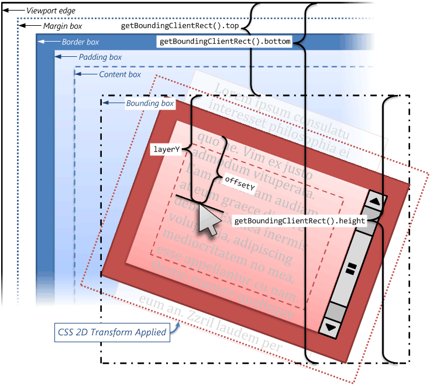
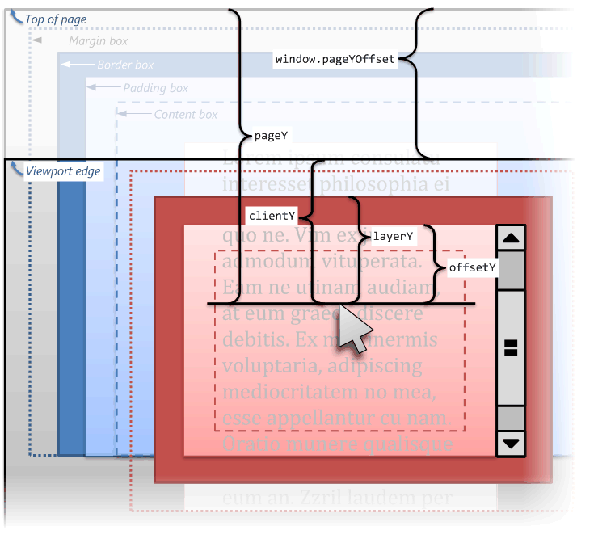
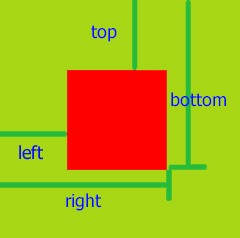

# 前端开发常见问题

- [unicode 和 utf 编解码的原理和不同](#unicode和utf编解码的原理和不同)
- [base64 和二进制的不同](#base64和二进制的不同)
- [绑定事件的不同种方式，执行顺序，事件委托](#绑定事件的不同种方式，执行顺序，事件委托)
- [css 旋转、拖拽、手势移动](#css旋转、拖拽、手势移动)
- [http 状态码和使用场景](#http状态码和使用场景)
- [前端截图上传服务器实现](#前端截图上传服务器实现)
- [获取图片上传进度](#获取图片上传进度)
- [无限滚动](#无限滚动)
- [持久化存储](#持久化存储)
- [js 数据类型与隐式转换](#js数据类型与隐式转换)
- [js 事件循环机制](#js事件循环机制)
- [闭包数据缓存](#闭包数据缓存)
- [页面加载生成过程](#页面加载生成过程)
- [http 请求方式](#http请求方式)
- [网络协议与 7 层结构](#网络协议与7层结构)
- [前端模块化](#前端模块化)
- [for-in,for-of,foreach 区别](#for-in,for-of,foreach区别)
- [arguments,...values,callee,caller,this,call,apply,bind 用法](#arguments,...values,callee,caller,this,call,apply,bind用法)
- [日历的实现](#日历的实现)
- [深复制的实现](#深复制的实现)
- [overflow:hidden 清除浮动的原理](#overflow:hidden清除浮动的原理)
- [前端路由原理](#前端路由原理)
- [强制缓存和协商缓存](#强制缓存和协商缓存)
- [节流和防抖](#节流和防抖)
- [xss 和 csrf](#xss和csrf)
- [js 函数柯里化](#js函数柯里化)
- [js 依赖注入与控制反转](js依赖注入与控制反转)
- [gulp 和 webpack](#gulp和webpack)
- [用户查找、光标、右键功能行为](#用户查找、光标、右键功能行为)
- [表单输入重置与 hover 提示文字](#表单输入重置与hover提示文字)
- [特殊事件与自定义事件](#特殊事件与自定义事件)
- [DOM 树解析和更改与遍历](#DOM树解析和更改与遍历)
- [js 获取视频第一帧](#js获取视频第一帧)
- [浏览器性能数据](#浏览器性能数据)
- [媒体查询匹配](#媒体查询匹配)
- [浏览器对话与打印](#浏览器对话与打印)
- [人工标注文档 Range](#人工标注文档Range)
- [height 和 top 与 y](#height和top与y)
- [页面复制文字时自动加版权](#页面复制文字时自动加版权)
- [delete 操作符](#delete操作符)
- [数组模拟 dictionary 与二重排序](#数组模拟dictionary与二重排序)
- [已知或者未知宽度的垂直水平居中](#已知或者未知宽度的垂直水平居中)
- [简单实现双向数据绑定 mvvm](#简单实现双向数据绑定mvvm)
- [三角形](#三角形)
- [webWorker 与 serviceWorker](#webWorker与serviceWorker)
- [js 设计模式](#js设计模式)
- [运算符优先级](#运算符优先级)
- [作用域与变量等题目](#作用域与变量等题目)
- [virtualDOM_Diff](#virtualDOM_Diff)
- [实现 instanceof](#实现instanceof)
- [抽象语法树 AST 与 babel](#抽象语法树AST与babel)
- [前端 SEO 与踩过的坑](#前端SEO与踩过的坑)
- [websocket](#websocket)
- [变量的解构赋值](#变量的解构赋值)
- [文件内容读取](#文件内容读取)
- [js 异步加载](js异步加载)
- [promise.all 实现](#promise.all实现)
- [便捷的函数与方法](#便捷的函数与方法)
- [可迭代对象](#可迭代对象)
- [url 的含义](#url的含义)
- [reflect](#reflect)
- [图片懒加载](#图片懒加载)
- [jsonp](#jsonp)
- [ajax](#ajax)
- [浏览器进程与线程](#浏览器进程与线程)
- [flexible 与高清屏](#flexible与高清屏)
- [深冻结](#深冻结)
- [发布订阅和观察者](#发布订阅和观察者)
- [实现链式调用](#实现链式调用)
- [正则获取 URL 参数](#正则获取URL参数)
- [文件切片上传](#文件切片上传)
- [数组的理解](#数组的理解)
- [正则获取 cookie 参数](#正则获取cookie参数)
- [css 并列自适应布局](#css并列自适应布局)
- [async 和 await 的继发和并发问题](#async和await的继发和并发问题)
- [css 伪类和伪元素](#css伪类和伪元素)
- [严格模式](#严格模式)
- [代码分割提高代码使用率](#代码分割提高代码使用率)
- [css 幽灵空白节点](css幽灵空白节点)
- [typescript](#typescript)
- [数据埋点与错误监控](#数据埋点与错误监控)
- [长列表优化](#长列表优化)
- [活动倒计时](#活动倒计时)

---

### unicode 和 utf 编解码的原理和不同

1. 参考链接：

   [Unicode 和 UTF-8 字符串编码解码原理](https://blog.csdn.net/Enl0ve/article/details/82844484)

   [Unicode 和 UTF-8、UTF-16 之间的区别](https://blog.csdn.net/zengchen__acmer/article/details/75332190)

   [【编码】ASCII、Unicode、GBK 和 UTF-8 字符编码的区别联系](https://blog.csdn.net/u010262331/article/details/46013905)

   [各种常见编码的转换算法](https://blog.csdn.net/xiaolongwang2010/article/details/10311397)

2. 详解：

   Unicode 是字符集，而 UTF-8 是编码规则

   字符集为每一个字符分配一个唯一的 ID(学名为码位/码点/Code Point)，而「编码规则」则是将「码位」转换为字节序列的规则。

   起初 Unicode 规定每个字符都是用 2 个字节来表示，但是由于英文字符等只需要一个字节就可以表，那就造成了在保存英文文本时，就会浪费一倍的空间。

   UTF-8 是一种变长的编码方式。它可以使用 1~4 个字节表示一个符号，根据不同的符号而变化字节长度，当字符在 ASCII 码的范围时，就用一个字节表示，保留了 ASCII 字符一个字节的编码做为它的一部分，注意的是 unicode 一个中文字符占 2 个字节，而 UTF-8 一个中文字符占 3 个字节。从 unicode 到 uft-8 并不是直接的对应，而是要过一些算法和规则来转换。

   ```txt
   例如「田」的码位是30000，记作U+7530(30000的16进制为0x7530)。
   U+ 0000 ~ U+ 007F: 0XXXXXXX
   U+ 0080 ~ U+ 07FF: 110XXXXX 10XXXXXX
   U+ 0800 ~ U+ FFFF: 1110XXXX 10XXXXXX 10XXXXXX
   U+10000 ~ U+1FFFF: 11110XXX 10XXXXXX 10XXXXXX 10XXXXXX

   根据上表中的编码规则，之前的「田」字的码位 U+7530 属于第三行的范围：

       7    5    3    0
       0111 0101 0011 0000    二进制的 7530
   --------------------------
       0111   011111   100101 二进制的 77E5
   1110XXXX 10XXXXXX 10XXXXXX 模版（上表第三行）
   11100111 10010100 10110000 代入模版
   E   7    9   4    B   0

   这就是将 U+7530 按照 UTF-8 编码为字节序列 E794B0 的过程。反之亦然。
   ```

   UTF-8 就是每次 8 个位传输数据，而 UTF-16 就是每次 16 个位。

### base64 和二进制的不同

1. 参考链接：

   [让你完全理解 base64 是怎么回事](https://www.cnblogs.com/sweeeper/p/8462077.html)

   [一篇文章彻底弄懂 Base64 编码原理](https://blog.csdn.net/wo541075754/article/details/81734770)

   [JavaScript 用 btoa 和 atob 来编码解码 Base64](https://my.oschina.net/itblog/blog/1613977)

   [原生 JS 实现 base64 解码与编码](https://imweb.io/topic/5b8ea5327cd95ea86319358a)

2. 详解：

   Base64 编码可以将任意一组字节转换为较长的常见文本字符序列,将用户输入或二进制数据，打包成一种安全格式发送出去，无须担心其中包含冒号、换行符或二进制值等特殊字符。

   ```txt
   例子：输入Ow!

   (1) 字符串"Ow!"被拆分成3个8位的字节(0x4F、0x77、0x21)

   (2) 这3个字节构成了一个24为的二进制01001111 01110111 00100001

   (3) 这些为被划分为一些6位的序列010011、110111、011100、100001,(若不能正好平均分成每段6位，则按6和8的最小公倍数在末尾补0，位数为6和8的最小公倍数，000000用填充码=表示)

   (4) 每个6位值都表示了从0～63之间的数字，对应base64字母表中的64个字符之一。得到的base64编码字符串是4个字符的字符串“T3ch”。然后就可以通过线路将这个字符串作为“安全的”8位字符传送出去，因为只用了一些移植性最好的字符(字母、数字等)。

   a:a -- 011000 010011 101001 100001 -- YTph

   a:aa -- 011000 010011 101001 100001 011000 01xxxx xxxxxx xxxxxx -- YTphYQ==

   a:aaa -- 011000 010011 101001 100001 011000 010110 0001xx xxxxxx -- YTphYWE=

   a:aaaa -- 011000 010011 101001 100001 011000 010110 000101 100001 -- YTphYWFh
   ```

   ```txt
   编码表：

   0　A　　17　R　　　34　i　　　51　z

   1　B　　18　S　　　35　j　　　52　0

   2　C　　19　T　　　36　k　　　53　1

   3　D　　20　U　　　37　l　　　54　2

   4　E　　21　V　　　38　m　　　55　3

   5　F　　22　W　　　39　n　　　56　4

   6　G　　23　X　　　40　o　　　57　5

   7　H　　24　Y　　　41　p　　　58　6

   8　I　　25　Z　　　42　q　　　59　7

   9　J　　26　a　　　43　r　　　60　8

   10　K　　27　b　　　44　s　　　61　9

   11　L　　28　c　　　45　t　　　62　+

   12　M　　29　d　　　46　u　　　63　/

   13　N　　30　e　　　47　v

   14　O　　31　f　　　48　w　　　

   15　P　　32　g　　　49　x

   16　Q　　33　h　　　50　y
   ```

   btoa 和 atob 是 window 对象的两个函数，其中 btoa 是 binary to ascii，用于将 binary 的数据用 ascii 码表示，即 Base64 的编码过程，而 atob 则是 ascii to binary，用于将 ascii 码解析成 binary 数据

   ```js
   //方法实现
   var a = "Hello World!";
   var encodedString = btoa(string);
   console.log(encodedString); // Outputs: "SGVsbG8gV29ybGQh"
   var decodedString = atob(encodedString);
   console.log(decodedString); // Outputs: "Hello World!"
   //涉及中文时，需要encodeURIComponent
   var b = "Hello, 中国！";
   //"SGVsbG8lMkMlMjAlRTQlQjglQUQlRTUlOUIlQkQlRUYlQkMlODE="
   var encodedString2 = btoa(encodeURIComponent(b));
   var decodedString2 = decodeURIComponent(atob(encodedString2));
   console.log(decodedString2); //"Hello, 中国！"
   ```

### 绑定事件的不同种方式，执行顺序，事件委托

1. 参考链接：

   [看懂此文，不再困惑于 javascript 中的事件绑定、事件冒泡、事件捕获和事件执行顺序](https://blog.csdn.net/aitangyong/article/details/43231111)

   [js 中的事件委托或是事件代理详解](https://www.cnblogs.com/liugang-vip/p/5616484.html)

2. 详解：

   - 3 种方式：

   ```html
   <p id="btn" onclick="hello()"></p>
   <script>
     document.getElementById("btn").onclick = function () {};
     document.getElementById("btn").addEventListener("click", function () {});
   </script>
   ```

   其中 addEventListener 可重复绑定同一元素，先绑定先执行。

   对于层叠元素，则需要区分事件冒泡和事件捕获，冒泡：从底向面，捕获：从面向底。addEventListener((type, listener, useCapture)

   阻止冒泡：只执行当前元素事件，不执行层叠元素事件。event.stopPropagation()

   事件委托：利用事件冒泡，只指定一个事件处理程序，就可以管理某一类型的所有事件。例如 ul 下有很多 li，逐一绑定事件很影响性能，且新 li 加入也要重新绑定事件，会十分麻烦，所以 li 事件需要委托其上一级 ul 代为执行事件。

   ```js
   window.onload = function () {
     var oUl = document.getElementById("ul1");
     oUl.onclick = function (ev) {
       var ev = ev || window.event;
       var target = ev.target || ev.srcElement;
       if (target.nodeName.toLowerCase() == "li") {
         alert(123);
         alert(target.innerHTML);
       }
     };
   };
   ```

   - 关于 onclick,addEventListener('click'),\$('...').on('click')

     1. 实际上，3 种写法都可以转化为 addEventListener('click',function,options)的形式

     2. 在没有设置 options 的情况下，click 后会先事件捕获，然后事件冒泡，options 中默认捕获为 false，所以 function 是在冒泡阶段执行，由内层冒泡至外层

     3. options 中设置为 true，则 function 在捕获阶段执行

     4. options 还有其它 2 个参数，可与 capture 一起以对象的形式传入

        ```js
        document
          .getElementsByClassName("middle")[0]
          .addEventListener("click", handler, {
            capture: true,
            once: true, //只执行一次
            passive: true, //永不调用 preventDefault(),如果调用，控制台会出现警告
          });
        ```

     5. click 的元素指向内层的元素，外层捕获进来后到达最内层，最内层按先后顺序执行完 function，再冒泡向上

     6. event.stopPropagation()表示停止传播，在哪一层的事件中设置了，就不会传播到下一层，例如在 middle 层设置 capture 为 true，则不会再向下捕获再冒泡

     7. 点击哪一层元素，则以哪一层元素为捕获和冒泡的底部

     8. 例子

        ```html
        <div class="out" onclick="console.log('out')">
          <div class="middle" onclick="console.log('middle')">
            <div class="inner" onclick="console.log('inner')"></div>
          </div>
        </div>
        <style>
          .out {
            width: 100px;
            height: 100px;
            border: 1px solid red;
          }
          .middle {
            width: 80px;
            height: 80px;
            border: 1px solid blue;
          }
          .inner {
            width: 40px;
            height: 40px;
            border: 1px solid green;
          }
        </style>
        <script>
          $(() => {
            $(".out").on("click", function () {
              console.log("out1");
            });
            $(".middle").on("click", function () {
              console.log("middle1");
            });
            $(".inner").on("click", function () {
              console.log("inner1");
            });
            document
              .getElementsByClassName("out")[0]
              .addEventListener("click", function () {
                console.log("out2");
              });
            document
              .getElementsByClassName("middle")[0]
              .addEventListener("click", function () {
                console.log("middle2");
              });
            document
              .getElementsByClassName("inner")[0]
              .addEventListener("click", function () {
                console.log("inner2");
              });
            document.getElementsByClassName("out")[0].addEventListener(
              "click",
              function () {
                console.log("out3");
              },
              true
            );
            document.getElementsByClassName("middle")[0].addEventListener(
              "click",
              function () {
                console.log("middle3");
              },
              true
            );
            document.getElementsByClassName("inner")[0].addEventListener(
              "click",
              function () {
                console.log("inner3");
              },
              true
            );
          });
        </script>
        <!--点击inner的输出：
            out3 middle3 inner inner1 inner2 inner3 middle middle1 middle2 out out1 out2
            点击middle的输出：
            out3 middle middle1 middle2 middle3 out out1 out2
        -->
        ```

### css 旋转、拖拽、手势移动

1. 参考链接：

   [CSS3 动画（360 度旋转、旋转放大、放大、移动）](https://www.cnblogs.com/guozhe/p/5912664.html)

   [HTML5 CSS3 专题 : 拖放 （Drag and Drop）](https://www.cnblogs.com/wzjhoutai/p/6858022.html)

2. 详解：

   关键词：transform,translate,scale,rotate,transition,animation,@keyframes,drag 系列事件,cursor

   transition 和 animation 的区别：

   1. transition 是 css 过渡效果，需要和 hover 等事件配合，由事件触发。动画过程中所有样式属性都要一起变化
   2. animation 基于帧动画，配合 keyframes 使用，可以设定每一帧的单一样式变化和时间以及循环次数。

### http 状态码和使用场景

1. 参考链接：

   [HTTP 状态码（HTTP Status Code）及常用场景](https://www.cnblogs.com/QQParadise/p/5019860.html)

   [HTTP 状态码](https://www.runoob.com/http/http-status-codes.html)

2. 详解：

```txt
常见状态码：
---------------信息，服务器收到请求，需要请求者继续执行操作------------------------
100	Continue	继续。客户端应继续其请求
101	Switching Protocols	切换协议。服务器根据客户端的请求切换协议。只能切换到更高级的协议，例如，切换到HTTP的新版本协议
---------------成功，操作被成功接收并处理------------------------
200	OK	请求成功。一般用于GET与POST请求
201	Created	已创建。成功请求并创建了新的资源
202	Accepted	已接受。已经接受请求，但未处理完成
203	Non-Authoritative Information	非授权信息。请求成功。但返回的meta信息不在原始的服务器，而是一个副本
204	No Content	无内容。服务器成功处理，但未返回内容。在未更新网页的情况下，可确保浏览器继续显示当前文档
205	Reset Content	重置内容。服务器处理成功，用户终端（例如：浏览器）应重置文档视图。可通过此返回码清除浏览器的表单域
206	Partial Content	部分内容。服务器成功处理了部分GET请求
---------------重定向，需要进一步的操作以完成请求------------------------
300	Multiple Choices	多种选择。请求的资源可包括多个位置，相应可返回一个资源特征与地址的列表用于用户终端（例如：浏览器）选择
301	Moved Permanently	永久移动。请求的资源已被永久的移动到新URI，返回信息会包括新的URI，浏览器会自动定向到新URI。今后任何新的请求都应使用新的URI代替
302	Found	临时移动。与301类似。但资源只是临时被移动。客户端应继续使用原有URI
303	See Other	查看其它地址。与301类似。使用GET和POST请求查看
304	Not Modified	未修改。所请求的资源未修改，服务器返回此状态码时，不会返回任何资源。客户端通常会缓存访问过的资源，通过提供一个头信息指出客户端希望只返回在指定日期之后修改的资源
305	Use Proxy	使用代理。所请求的资源必须通过代理访问
306	Unused	已经被废弃的HTTP状态码
307	Temporary Redirect	临时重定向。与302类似。使用GET请求重定向
---------------客户端错误，请求包含语法错误或无法完成请求------------------------
400	Bad Request	客户端请求的语法错误，服务器无法理解
401	Unauthorized	请求要求用户的身份认证
402	Payment Required	保留，将来使用
403	Forbidden	服务器理解请求客户端的请求，但是拒绝执行此请求
404	Not Found	服务器无法根据客户端的请求找到资源（网页）。通过此代码，网站设计人员可设置"您所请求的资源无法找到"的个性页面
405	Method Not Allowed	客户端请求中的方法被禁止
406	Not Acceptable	服务器无法根据客户端请求的内容特性完成请求
407	Proxy Authentication Required	请求要求代理的身份认证，与401类似，但请求者应当使用代理进行授权
408	Request Time-out	服务器等待客户端发送的请求时间过长，超时
409	Conflict	服务器完成客户端的 PUT 请求时可能返回此代码，服务器处理请求时发生了冲突
410	Gone	客户端请求的资源已经不存在。410不同于404，如果资源以前有现在被永久删除了可使用410代码，网站设计人员可通过301代码指定资源的新位置
411	Length Required	服务器无法处理客户端发送的不带Content-Length的请求信息
412	Precondition Failed	客户端请求信息的先决条件错误
413	Request Entity Too Large	由于请求的实体过大，服务器无法处理，因此拒绝请求。为防止客户端的连续请求，服务器可能会关闭连接。如果只是服务器暂时无法处理，则会包含一个Retry-After的响应信息
414	Request-URI Too Large	请求的URI过长（URI通常为网址），服务器无法处理
415	Unsupported Media Type	服务器无法处理请求附带的媒体格式
416	Requested range not satisfiable	客户端请求的范围无效
417	Expectation Failed	服务器无法满足Expect的请求头信息
---------------服务器错误，服务器在处理请求的过程中发生了错误------------------------
500	Internal Server Error	服务器内部错误，无法完成请求
501	Not Implemented	服务器不支持请求的功能，无法完成请求
502	Bad Gateway	作为网关或者代理工作的服务器尝试执行请求时，从远程服务器接收到了一个无效的响应
503	Service Unavailable	由于超载或系统维护，服务器暂时的无法处理客户端的请求。延时的长度可包含在服务器的Retry-After头信息中
504	Gateway Time-out	充当网关或代理的服务器，未及时从远端服务器获取请求
505	HTTP Version not supported	服务器不支持请求的HTTP协议的版本，无法完成处理
```

### 前端截图上传服务器实现

1. 参考链接：

   [浅析 js 实现网页截图的两种方式](https://juejin.im/entry/58b91491570c35006c4f7fdf)

2. 详解：

   - canvas 思路:(html2canvas)

   ```txt
   将dom转换成canvas图片。

   递归取出目标模版的所有DOM节点，填充到一个rederList，并附加是否为顶层元素/包含内容的容器 等信息

   通过z-index postion float等css属性和元素的层级信息将rederList排序，计算出一个canvas的renderQueue

   遍历renderQueue，将css样式转为setFillStyle可识别的参数，依据nodeType调用相对应canvas方法，如文本则调用fillText，图片drawImage，设置背景色的div调用fillRect等

   将画好的canvas填充进页面
   ```

   优缺点:复杂度高，稳定性强。

   - svg 思路:(rasterizeHTML.js)

   ```txt
   svg的标签里有个foreignObject标签，可以加载其它命名空间的xml(xhtml)文档,只需要将要渲染的DOM扔进<foreignObject></foreignObject>，利用Blob构建svg图像。
   通过一系列的hack技巧替我们绕过了许多限制:
   1.将的url 转为 dataURI
   2.将background-color从style中取出，修改url后重新插入样式表
   3.将link的的样式通过ajax down下来然后注入<style></sytle>
   ```

   优缺点:简单，只能对已经存在的静态资源进行处理，而对 js 动态生成并不能实时处理。

   - 上传

   ```js
   var fd = new FormData();
   fd.append("img", imgBlob);
   $.ajax({
     type: "POST",
     url: "http://tmpfile.coding.io/img",
     dataType: "json",
     data: fd,
     crossDomain: true,
     processData: false,
     contentType: false,
     success: function (data) {
       if (data && data.path) {
         console.log("http://tmpfile.coding.io/tmp" + data.path);
       }
     },
   });
   ```

### 获取图片上传进度

1. 参考链接：

   [XHR 简介](https://www.cnblogs.com/syfwhu/p/6116323.html)

   [深入理解 ajax 系列第一篇——XHR 对象](https://www.cnblogs.com/yibutian/p/9456248.html)

   [XMLHttpRequest](https://developer.mozilla.org/zh-CN/docs/Web/API/XMLHttpRequest)

   [使用原生 JS 或 jquery ajax 获取上传图片实时进度](https://segmentfault.com/a/1190000012871456)

   [JS、JQ 实现图片上传，文件上传、带进度条上传的几种方法](https://blog.csdn.net/qq_38740171/article/details/82999793)

   [前端面试手写题有备无患](https://juejin.im/post/5e9d0913f265da47f85df937#heading-13)

2. 详解：

   - 常用只读属性：

     (1) XMLHttpRequest.readyState 返回 unsigned short，状态码:

     - 0 UNSENT 代理被创建，但尚未调用 open() 方法。
     - 1 OPENED open() 方法已经被调用。
     - 2 HEADERS_RECEIVED send() 方法已经被调用，并且头部和状态已经可获得。
     - 3 LOADING 下载中,responseText 属性已经包含部分数据。
     - 4 DONE 下载操作已完成。

     (2) XMLHttpRequest.response 返回 ArrayBuffer、Blob、Document、DOMString，具体是哪种类型取决于 XMLHttpRequest.responseType 的值。其中包含响应体 body。

     (3)XMLHttpRequest.responseText 返回 string 或 null

     (4)XMLHttpRequest.responseURL 返回响应的序列化 URL

     (5)XMLHttpRequest.responseXML 返回一个 Document，其中包含该请求的响应

     - 如果响应的内容类型是'text/xml'或'application/xml'，这个属性中将保存着响应数据的 XML DOM 文档(document 形式)

     (6)XMLHttpRequest.status 返回 unsigned short，请求响应状态

     - UNSENT（未发送） 0
     - OPENED（已打开） 0
     - LOADING（载入中） 200
     - DONE（完成） 200

     (7)XMLHttpRequest.statusText 返回 string，响应状态文本

     - UNSET
     - OPENED
     - LOADING
     - DONE
     - OK
     - Not Found

   - 常用属性：

     (1) XMLHttpRequest.responseType 响应数据的类型：text、arraybuffer、blob、document、json

   - 常用方法：

     (1)XMLHttpRequest.abort() 中止请求

     (2)XMLHttpRequest.getAllResponseHeaders() 返回所有用 CRLF 分隔的响应头,string 或 null

     ```js
     var request = new XMLHttpRequest();
     request.open("GET", "foo.txt", true);
     request.send();

     request.onreadystatechange = function() {
     if(this.readyState == this.HEADERS_RECEIVED) {

         // Get the raw header string
         var headers = request.getAllResponseHeaders();

         // Convert the header string into an array
         // of individual headers
         var arr = headers.trim().split(/[\r\n]+/);

         // Create a map of header names to values
         var headerMap = {};
         arr.forEach(function (line) {
             var parts = line.split(': ');
             var header = parts.shift();
             var value = parts.join(': ');
             headerMap[header] = value;
         });

         var contentType = headerMap["content-type"];//text/html; charset=utf-8
     }

     /*
     date: Fri, 08 Dec 2017 21:04:30 GMT\r\n
     content-encoding: gzip\r\n
     x-content-type-options: nosniff\r\n
     server: meinheld/0.6.1\r\n
     x-frame-options: DENY\r\n
     content-type: text/html; charset=utf-8\r\n
     connection: keep-alive\r\n
     strict-transport-security: max-age=63072000\r\n
     vary: Cookie, Accept-Encoding\r\n
     content-length: 6502\r\n
     x-xss-protection: 1; mode=block\r\n
     */
     ```

     (3)XMLHttpRequest.getResponseHeader(name) 返回包含指定响应头的字符串,string 或 null，name 如"Content-Type"

     (4)XMLHttpRequest.open(method, url, async, user, password) 初始化一个请求

     - method:get,post,put,delete
     - async:是否异步
     - user 和 password 用于认证

     (5)XMLHttpRequest.overrideMimeType() 重写由服务器返回的 MIME type,默认"text/xml"

     (6)XMLHttpRequest.send() 发送请求

     (7)XMLHttpRequest.setRequestHeader(header, value) 设置 HTTP 请求头的值

   - 事件：

     (1)onloadstart 开始

     (2)onprogress 数据传输进行中

     (3)onabort 终止

     (4)onerror 失败

     (5)onload 成功

     (6)ontimeout 超时

     (7)onloadend 完成（不论成功与否）

     (8)onreadystatechange readyState 属性发生变化

   - 获取上传图片实时进度

   ```js
   $.ajax({
     url: "URL",
     type: "POST",
     data: data,
     processData: false, //用来回避jquery对formdata的默认序列化，XMLHttpRequest会对其进行正确处理
     contentType: false, //设为false才会获得正确的conten-Type
     xhr: function () {
       //用以显示上传进度
       var xhr = $.ajaxSettings.xhr();
       if (xhr.upload) {
         xhr.upload.addEventListener(
           "progress",
           function (event) {
             var percent = Math.floor((event.loaded / event.total) * 100);
             $("#progress .progress-item").css("width", percent + "%");
           },
           false
         );
       }
     },
     success: function (data) {},
   });

   var xhr = new XMLHttpRequest();
   xhr.open("POST", "url");
   // 上传完成后的回调函数
   xhr.onreadystatechange = function () {
     if (xhr.status === 200) {
       console.log(xhr.responseText);
     } else {
       console.log("上传出错");
     }
   };
   // 获取上传进度
   xhr.upload.onprogress = function (event) {
     console.log(event.loaded);
     console.log(event.total);
     if (event.lengthComputable) {
       var percent = Math.floor((event.loaded / event.total) * 100);
       document.querySelector("#progress .progress-item").style.width =
         percent + "%";
       // 设置进度显示
       console.log(percent);
     }
   };
   xhr.send(data);
   ```

   - 实现 ajax

   ```js
   function ajax({ url, methods, body, headers }) {
     return new Promise((resolve, reject) => {
       let request = new XMLHttpRequest();
       request.open(url, methods);
       for (let key in headers) {
         let value = headers[key];
         request.setRequestHeader(key, value);
       }
       request.onreadystatechange = () => {
         if (request.readyState === 4) {
           if (request.status >= "200" && request.status < 300) {
             resolve(request.responeText);
           } else {
             reject(request);
           }
         }
       };
       request.send(body);
     });
   }
   ```

### 无限滚动

1. 参考链接：

   [原生 js 之列表优化-无限滚动实例](https://www.jianshu.com/p/f57272d4276d)

2. 详解：

   关键词：onscroll,scrollTop

   onscroll 与 onwheel: onwheel 是鼠标滚轮旋转, 而 onscroll 处理的是对象内部内容区的滚动事件

### 持久化存储

1. 参考链接：

   [持久化存储与 HTTP 缓存](https://www.jianshu.com/p/71163b408940)

   [理解 cookie、session、localStorage、sessionStorage 之不同](https://blog.csdn.net/qq_35585701/article/details/81393361)

   [浏览器数据库 IndexedDB 入门教程](http://www.ruanyifeng.com/blog/2018/07/indexeddb.html)

2. 详解：

   - LocalStorage

     关闭浏览器后，数据不会丢失

     ```js
     //1. 添加键、值
     localStorage.setItem(key, value);
     //2. 获得键、值
     localStorage.getItem(key);
     //3.清空localStorage
     localStorage.clear();
     ```

     特点：

     - LocalStorage 跟 HTTP 无关，发送请求不会带上 LocalStorage 的值
     - 只有相同域名的页面才能互相读取 LocalStorage
     - 每个域名 localStorage 最大存储量为 5Mb 左右（每个浏览器不一样）
     - 常用场景：浏览器端储存数据（不能记录密码等敏感信息）
     - LocalStorage 永久有效，除非用户清理缓存

   - SessionStorage

     会话结束后，数据丢失

     ```js
     //1. 添加键、值
     sessionStorage.setItem(key, value);
     //2. 获得键、值
     sessionStorage.getItem(key);
     //3.清空sessionStorage
     sessionStorage.clear();
     ```

     特点同上

   - indexdb

     - 描述

       IndexedDB 就是浏览器提供的本地数据库，它可以被网页脚本创建和操作。IndexedDB 允许储存大量数据，提供查找接口，还能建立索引。这些都是 LocalStorage 所不具备的。就数据库类型而言，IndexedDB 不属于关系型数据库（不支持 SQL 查询语句），更接近 NoSQL 数据库。

     - 特点

       1. 键值对储存
       2. 异步
       3. 支持事务（transaction）
       4. 同源限制
       5. 储存空间大
       6. 支持二进制储存

     - 储存路径

       1. windows 版本

       C:\Users\用户\AppData\Local\Google\Chrome\User Data\Default\IndexedDB

       2. linux 版本

       /home/用户/.config/google-chrome/Default/IndexedDB/

     - 操作

       ```js
       //打开数据库
       var request = window.indexedDB.open(databaseName, version);
       request.onerror = function (event) {
         console.log("数据库打开报错");
       };
       var db;
       request.onsuccess = function (event) {
         db = request.result;
         console.log("数据库打开成功");
       };
       var db;
       //如果指定的版本号，大于数据库的实际版本号，就会发生数据库升级事件(数据库从无到有的新建过程也触发此事件)
       request.onupgradeneeded = function (event) {
         //新建数据库
         db = event.target.result;
         //新建表
         var objectStore;
         if (!db.objectStoreNames.contains("person")) {
           objectStore = db.createObjectStore(
             "person",
             { keyPath: "id" }, //主键是id
             { autoIncrement: true } //自增
           );
           //创建索引
           objectStore.createIndex("name", "name", { unique: false });
           objectStore.createIndex("email", "email", { unique: true });
         }
       };
       //通过事务添加数据
       function add() {
         var request = db
           .transaction(["person"], "readwrite")
           .objectStore("person")
           .add({
             id: 1,
             name: "张三",
             age: 24,
             email: "zhangsan@example.com",
           });

         request.onsuccess = function (event) {
           console.log("数据写入成功");
         };

         request.onerror = function (event) {
           console.log("数据写入失败");
         };
       }
       //读取数据
       function read() {
         var transaction = db.transaction(["person"]);
         var objectStore = transaction.objectStore("person");
         var request = objectStore.get(1);

         request.onerror = function (event) {
           console.log("事务失败");
         };

         request.onsuccess = function (event) {
           if (request.result) {
             console.log("Name: " + request.result.name);
             console.log("Age: " + request.result.age);
             console.log("Email: " + request.result.email);
           } else {
             console.log("未获得数据记录");
           }
         };
       }
       //遍历数据
       function readAll() {
         var objectStore = db.transaction("person").objectStore("person");

         objectStore.openCursor().onsuccess = function (event) {
           var cursor = event.target.result;

           if (cursor) {
             console.log("Id: " + cursor.key);
             console.log("Name: " + cursor.value.name);
             console.log("Age: " + cursor.value.age);
             console.log("Email: " + cursor.value.email);
             cursor.continue();
           } else {
             console.log("没有更多数据了！");
           }
         };
       }
       //更新数据
       function update() {
         var request = db
           .transaction(["person"], "readwrite")
           .objectStore("person")
           .put({ id: 1, name: "李四", age: 35, email: "lisi@example.com" });

         request.onsuccess = function (event) {
           console.log("数据更新成功");
         };

         request.onerror = function (event) {
           console.log("数据更新失败");
         };
       }
       //删除数据
       function remove() {
         var request = db
           .transaction(["person"], "readwrite")
           .objectStore("person")
           .delete(1);

         request.onsuccess = function (event) {
           console.log("数据删除成功");
         };
       }
       //使用索引
       var transaction = db.transaction(["person"], "readonly");
       var store = transaction.objectStore("person");
       var index = store.index("name");
       var request = index.get("李四");

       request.onsuccess = function (e) {
         var result = e.target.result;
         if (result) {
           // ...
         } else {
           // ...
         }
       };
       ```

   - Cookie

     Cookie 是存放在浏览器端的数据，每次都随请求发送给 Server。存储 cookie 是浏览器提供的功能。cookie 其实是存储在浏览器中的纯文本，浏览器的安装目录下会专门有一个 cookie 文件夹来存放各个域下设置的 cookie。

     特点：

     - 服务器通过 Set-Cookie 头给客户端一串字符串
     - 客户端每次访问相同域名的网页时，必须带上这段字符串
     - 客户端要在一段时间内保存这个 Cookie
     - Cookie 默认在用户关闭页面后就失效，代码可以任意设置 Cookie 的过期时间，max-age 和 Expires
     - 大小大概在 4kb 以内

     ```js
     function setCookie(cname, cvalue, exdays) {
       var d = new Date();
       d.setTime(d.getTime() + exdays * 24 * 60 * 60 * 1000);
       var expires = "expires=" + d.toGMTString();
       document.cookie = cname + "=" + cvalue + "; " + expires;
     }

     function getCookie(cname) {
       var name = cname + "=";
       var ca = document.cookie.split(";");
       for (var i = 0; i < ca.length; i++) {
         var c = ca[i].trim();
         if (c.indexOf(name) == 0) return c.substring(name.length, c.length);
       }
       return "";
     }

     function delete(cname) {
       var date = new Date();
       date.setTime(date.getTime() - 10000);
       document.cookie = cname + "=; expires =" + date.toGMTString();
     }
     ```

   - Session

     Session 是基于 Cookie 实现的，它利用一个 sessionId 把用户的敏感数据隐藏起来，在 Set-Cookie 上，使用随机数来做 sessionId,最终只是把这串随机数暴露给外界，而真正的信息却保存在了服务器端的 sessions 对象里面。它就像一个密码簿一样，有效的信息与 sessionId 一一对应,当下次用户访问该网站的其他页面的时候，就会带着登录时服务器给的这个 sessionId。

     特点：

     - 将 SessionID（随机数）通过 Cookie 发给客户端
     - 客户端访问服务器时，服务器读取 SessionID
     - 服务器有一块内存（哈希表）保存了所有 session
     - 通过 SessionID 可以得到对应用户的隐私信息
     - 这块内存（哈希表）就是服务器上的所有 session

   - 注意

     cookie、localstorage、sessionstorage 不可跨域：在不同同源 url 下，获取到不同的数据，只有同源 url 才共享数据。

### js 数据类型与隐式转换

1. 参考链接：

   [JS 的隐式转换 从 [] ==false 说起](https://www.cnblogs.com/nanchen/p/7905528.html)

   [JS 中 [] == ![]结果为 true，而 {} == !{}却为 false， 追根刨底](https://blog.csdn.net/magic_xiang/article/details/83686224)

   [JavaScript 中 valueOf、toString 的隐式调用](https://www.cnblogs.com/barrior/p/4598354.html)

   [JavaScript 中的变量在内存中的具体存储形式](https://www.jianshu.com/p/80bb5a01857a)

   [JavaScript 的数据类型](https://www.cnblogs.com/cider/p/11875832.html)

   [null 与 undefined 的区别？](https://www.cnblogs.com/shengmo/p/8671803.html)

2. 详解：

   - js 数据类型

     原始值（primitives）：undefined， null， booleans， numbers，strings， symbol（es6）

     对象值（objects）：Object

   - 变量储存形式

     1. 普通变量存在栈，对象(如 object，array)存在堆。
     2. let b = { x: 10 };b 存在栈，值为对象访问地址，指向{ x: 10 }的堆空间。
     3. 基本类型复制会在栈中分配新空间，引用类型复制(浅复制)栈中的新空间的值会指向旧堆的地址。

     - 栈

       储存基本数据类型，按值访问，储存的值大小固定，系统分配内存空间，空间小，运行效率高，先进后出。

     - 堆

       储存引用类型，按引用访问，储存的值大小不固定，可动态调整，代码进行指定分配，空间大，运行效率低，无序储存。

   - 有了基本类型为什么还要包装类型？

     3 个特殊的引用类型：Boolean、Number 和 String，每当读取一个基本类型值的时候，会创建一个对应的基本包装类型的对象，从而能够调用一些方法来操作这些基本类型(substring 等)。每个包装类型都映射到同名的基本类型。

   - 装箱和拆箱

     1. 装箱就是把基本类型转换为对应的内置对象，这里可分为隐式和显式装箱。

        - 隐式装箱

          ```txt
          var s1 = "stringtext";
          var s2 = s1.substring(2); 基本类型本来是没方法的，装箱后就有了
          （1）创建String类型的一个实例 var s1 = new String("stringtext");
          （2）在实例上调用指定的方法 var s2 = s1.substring(2);
          （3）摧毁这个实例 s1 = null;
          ```

        - 显式装箱

          ```js
          var obj = new Object("stringtext");
          console.log(obj instanceof String);
          //true
          ```

     2. 拆箱就是与装箱相反，把对象转变为基本类型的值。

        调用了 JavaScript 引擎内部的抽象操作，ToPrimitive(转换为原始值)，对原始值(null,undefined,number,string,boolen,symbol)不发生转换处理，只针对引用类型(object)

   - 数学运算

     a+b=a 的原数据类型+b 的原数据类型

     有 string 为 string，没 string 为 number，[].toString()->""，{}.toString()->"[object Object]"

     - [] + [] = "" + "" = ""
     - [] + {} = "" + "[object Object]" = "[object Object]"

   - 比较运算

     - x===y,只有类型和值相等为 true,否则为 false
     - x == y
       - xy 都为 Null 或 undefined 为 true, null == undefined->true, null === undefined->false
       - x 或 y 为 NaN 为 false, NaN == NaN->false
       - 如果 x 和 y 为 String，Number，Boolean 并且类型不一致，都转为 Number 再进行比较
       - 如果存在 Object，转换为原始值，比较
       - !可将变量转换成 boolean 类型，null、undefined、NaN 以及空字符串('')取反都为 true，其余都为 false

     | value      | toNumber | toString          | toBoolean |
     | ---------- | -------- | ----------------- | --------- |
     | NaN        | NaN      | "NaN"             | false     |
     | Infinity   | Infinity | "Infinity"        | true      |
     | []         | 0        | ""                | true      |
     | [1]        | 1        | "1"               | true      |
     | null       | 0        | "null"            | false     |
     | undefined  | NaN      | "undefined"       | false     |
     | {}         | NaN      | "[object Object]" | true      |
     | function() | NaN      | "function"        | true      |

     ```txt
     []==false,[]==![],[]==0,''==0,""=="" true
     {}==false,{}==!{},{}==0,NaN==0 false
     ```

   - 隐式调用：对象生成时会自动调用(不同对象会有不同的隐式调用)

     - function:toString/valueOf
     - 事件:handleEvent
     - JSON 对象:toJSON
     - promise:then
     - object:get/set
     - 遍历器接口:Symbol.iterator

   - 每个对象的 toString 和 valueOf 方法都可以被改写，每个对象执行完毕，如果被用以操作 JavaScript 解析器就会自动调用对象的 toString 或者 valueOf 方法

### js 事件循环机制

1. 参考链接：

   [详解 JavaScript 中的 Event Loop（事件循环）机制](https://www.cnblogs.com/cangqinglang/p/8967268.html)

   [谈谈 Event Loop（事件循环）机制](https://www.jianshu.com/p/6e9f4eb7fdbb)

   [Javascript 异步编程之 setTimeout 与 setInterval 详解分析](https://www.cnblogs.com/tugenhua0707/p/4083475.html)

   [理解 JavaScript 执行机制及异步回调（setTimeout/setInterval/Promise）](https://blog.csdn.net/zuggs_/article/details/82381558)

   [js 异步执行顺序](https://www.jianshu.com/p/ca480f9e7dea)

   [为什么要用 setTimeout 模拟 setInterval?](https://blog.csdn.net/b954960630/article/details/82286486)

   [详解 setTimeout、setImmediate、process.nextTick 的区别](https://www.cnblogs.com/onepixel/articles/7605465.html)

   [setTimeout/setImmediate/process.nextTick 的区别](https://www.jianshu.com/p/77f03673aa06)

   [简单理解 Vue 中的 nextTick](https://www.jianshu.com/p/a7550c0e164f)

   [浅谈 async/await](https://www.jianshu.com/p/1e75bd387aa0)

   [async 函数的含义和用法](http://www.ruanyifeng.com/blog/2015/05/async.html)

   [面试向：Async/Await 代替 Promise.all()](https://juejin.im/post/5d56f89b518825415d0608be)

   [ECMAScript 6 入门](https://es6.ruanyifeng.com/#docs/async)

   [Async/Await 替代 Promise 的 6 个理由](https://www.cnblogs.com/fundebug/p/6667725.html)

   [js 基础之 setTimeout 与 setInterval 原理分析](https://blog.csdn.net/qq_41694291/article/details/93974595)

   [关于 setTimeout 和 setInterval 的实现原理](https://blog.csdn.net/sinat_30443713/article/details/78128088)

   [什么是事件循环？](https://cloud.tencent.com/developer/news/566935)

2. 详解：

   - js 是单线程的非阻塞语言：因为如果是多线程，一边绑定事件，一边移除元素，会引起冲突。另外，如果引入锁，则大大增加复杂度，所以采取单线程。

   - 执行栈：方法排队执行的地方，每个单元对应一个 context，包含作用域中的 this。

   - 事件(消息)队列：异步事件返回结果后，js 会将这个事件加入与当前执行栈不同的另一个队列，被放入事件队列不会立刻执行其回调，而是等待当前执行栈中的所有任务都执行完毕，主线程处于闲置状态时，再把事件放回执行栈。

   - 事件循环：主线程不断的从消息队列中取消息，执行消息，这个过程称为事件循环，这种机制叫事件循环机制，取一次消息并执行的过程叫一次循环。

   - 事件循环机制：由执行栈和事件队列构成的无限循环

   - 事件循环描述：所有同步任务都在主线程上执行，形成一个执行栈，主线程之外，还存在一个”任务队列”，只要异步任务有了运行结果，就在”任务队列”之中放置一个事件。一旦”执行栈”中的所有同步任务执行完毕，系统就会读取”任务队列”，于是异步任务结束等待状态，进入执行栈，开始执行。主线程从”任务队列”中读取事件，这个过程是循环不断的，所以整个的这种运行机制又称为 Event Loop（事件循环）。

   - 宏任务：setInterval()，setTimeout()

     - setTimeout：在指定的毫秒数后，将定时任务处理的函数添加到事件队列的队尾。
     - setInterval：按照指定的周期(以毫秒数计时)，将定时任务处理函数添加到事件队列的队尾。
       - 因为 js 是单线程的，如果处于堵塞状态计不了时，它必须依赖外部计时并触发定时，所以队列中的定时事件也是异步事件。
       - 每个 setTimeout 产生的任务会直接 push 到任务队列中；而 setInterval 在每次把任务 push 到任务队列前，都要进行一下判断(看上次的任务是否仍在队列中)。
       - setInterval 有两个缺点：
         - 某些间隔会被跳过；
         - 可能多个定时器会连续执行；
       - setTimeout 模拟 setInterval,解决 setInterval 缺点
       ```js
       //每次执行的时候都会创建一个新的定时器
       var a = setTimeout(function () {
         // 任务
         setTimeout(a, interval); //获取当前函数的引用，并且为其设置另一个定时器
       }, interval);
       //在前一个定时器执行完前，不会向队列插入新的定时器
       //保证定时器间隔
       ```

   - 微任务 1：new Promise()

     - Promise 是异步的，是指他的 then()和 catch()方法，Promise 本身还是同步的
     - 有 resolve()后，才能执行 then(),有 reject()，不执行 then()

   - 微任务 2：async await

     - async function(){} 表示函数内存在异步操作
     - await 强制下面代码等待，直到这行代码得出结果(await setTimeout 无效，适用于 ajax)

   - 事件优先级：同步任务>异步任务(微任务>宏任务(取决于延时时间))

   - Node.js 是一个基于 Chrome V8 引擎的 JavaScript 运行环境，比 js 少了 DOM/BOM,多了 http/file system,事件执行顺序与 js 不同

     - 浏览器是先把一个栈以及栈中的微任务走完，才会走下一个栈。node 环境里面是把所以栈走完，才走微任务
     - setTimeout setImmediate 都是宏任务
     - nextTick 和 then 都属于微任务
     - i/o 文件操作为宏任务

   - nextTick、setTimeout、setImmediate 的区别

     nodejs 中，setTimeout、setImmediate 是宏任务，process.nextTick()是微任务，因此 setTimeout、setImmediate 回调函数插入到任务队列的尾部，nextTick 回调函数加入到当前执行栈的尾部，所以 nextTick 会先执行。

     setTimeout、setImmediate 相差不大，但延时设为 0 时，setImmediate 会更快加入任务队列。

     vue 中，created()钩子函数进行的 DOM 操作一定要放在 Vue.nextTick()的回调函数中，因为此时 DOM 没渲染，需要等到 mounted()后执行。另外，数据变化导致 DOM 变化，也应用 Vue.nextTick()

   - setInterval，setTimeout 注意的地方

     1. function 中代码执行时间超过指定等待时间，settimeout 会在执行完后立即输出，setinterval 不会再这段时间向任务队列添加回调函数(因为已经存在上一个回调函数没执行完)，但不会影响后续计时。

     ```js
     var start = new Date();
     setTimeout(function () {
       var end = new Date();
       console.log("Time elapsed: ", end - start, "ms");
     }, 500);

     while (new Date() - start <= 1000) {}
     //Time elapsed:  1018 ms
     ```

     2. 如果 setinterval 执行时间略小于等待时间，则可能会出现连续执行的情况，所以需要用 settimeout 模拟 setinterval

     ```js
     function func(args){
         //函数本身的逻辑
         ...
     }
     var timer = setInterval(func, 100, args);

     var timer;
     function func(args){
         //函数本身的逻辑
         ...
         //函数执行完后，重置定时器
         timer = setTimeout(func, 100, args);
     }
     timer = setTimeout(func, 100, args);
     ```

     3. 延时设为 0，也不会马上执行，因为浏览器有各自最低等待时间

     ```js
     function a() {
       setTimeout(function () {
         console.log(1);
       }, 0);
       console.log(2);
     }
     a();
     // 2 1
     ```

   - 例题：

   ```js
   //浏览器
   (function () {
     setTimeout(() => {
       console.log(0);
     });

     new Promise((resolve) => {
       console.log(1);

       setTimeout(() => {
         resolve();
         Promise.resolve().then(() => {
           console.log(2);
           setTimeout(() => console.log(3));
           Promise.resolve().then(() => console.log(4));
         });
       });

       Promise.resolve().then(() => console.log(5));
     }).then(() => {
       console.log(6);
       Promise.resolve().then(() => console.log(7));
       setTimeout(() => console.log(8));
     });

     console.log(9);
   })();
   //1、9、5、0、6、2、7、4、8、3
   //node.js
   console.log("1");
   setTimeout(function () {
     console.log("2");
     process.nextTick(function () {
       console.log("3");
     });
     new Promise(function (resolve) {
       console.log("4");
       resolve();
     }).then(function () {
       console.log("5");
     });
   });
   process.nextTick(function () {
     console.log("6");
   });
   new Promise(function (resolve) {
     console.log("7");
     resolve();
   }).then(function () {
     console.log("8");
   });
   setTimeout(function () {
     console.log("9");
     process.nextTick(function () {
       console.log("10");
     });
     new Promise(function (resolve) {
       console.log("11");
       resolve();
     }).then(function () {
       console.log("12");
     });
   });
   //1，7，6，8，2，4，3，5，9，11，10，12
   let test = async function () {
     await new Promise((resolve, reject) => {
       console.log(1);
       setTimeout(() => {
         resolve();
       }, 3000);
     }).then(() => {
       console.log(2);
     });
     console.log(3);
     await new Promise((resolve, reject) => {
       console.log(4);
       setTimeout(() => {
         resolve();
       }, 1000);
     }).then(() => {
       console.log(5);
     });
     console.log(6);
   };
   test();
   //1

   //2
   //3
   //4

   //5
   //6
   ```

### 闭包数据缓存

1. 参考链接：

   [JS 闭包异步获取数据并缓存](https://blog.csdn.net/weixin_43820866/article/details/87107035)

   [js async await 终极异步解决方案](https://www.cnblogs.com/CandyManPing/p/9384104.html)

   [闭包+内存泄露+垃圾回收](https://blog.csdn.net/yushuangyushuang/article/details/79301694)

2. 详解：

   - 闭包的形成原理

     活动对象被引用着无法被销毁而导致的

   - 闭包 2 个作用

     1. 内层函数可通过作用域链访问外层函数变量
     2. 缓存机制(垃圾回收机制)：函数执行完会释放内存，但如果内层函数被引用，则不会释放内存，所以可能会造成内存泄露

        - 注意：闭包指向同一处内存才能共享数据

        ```js
        function F() {
          let i = 0;
          return function () {
            console.log(i++);
          };
        }

        let f1 = new F();
        let f2 = new F();
        f1(); //0
        f1(); //1
        f2(); //0
        ```

   - 优点

     1. 避免全局变量被污染
     2. 方便调用上下文的局部变量
     3. 加强封装性

   - 缺点

     1. 闭包常驻内存，内存消耗很大
     2. 可能导致内存泄露

        例子

        ```js
        window.onload = function () {
          var el = document.getElementById("id");
          el.onclick = function () {
            alert(el.id);
          };
        };
        ```

        解决方法

        ```js
        window.onload = function () {
          var el = document.getElementById("id");
          var id = el.id; //解除循环引用
          el.onclick = function () {
            alert(id);
          };
          el = null; // 将闭包引用的外部函数中活动对象清除
        };
        ```

   - 例子

   向接口请求数据时，数据多次使用，但不想保存在全局变量中，就需要将数据存储在缓存中。查找数据时，如果缓存找不到，则调用 API，然后设置缓存，如果找到，直接返回查找到的值即可。闭包正好可以做到这一点，且不会释放外部的引用，从而函数内部的值可以得以保留。

   ```js
   const getList = (function() {
       // 闭包存储data
       let data = {};
       const getData = () => {
           return new Promise((resolve, reject) => {
               $.ajax({
                   url: '/your/api',
                   data: {
                       normal: 1
                   },
                   success: function (result) {
                       data = result.data;
                       resolve();
                   }
               });
           })
       }
       // 异步函数，当调用一个 async 函数时，会返回一个 Promise 对象。
       const result = async function (type) {
           if (JONS.stringify(data) === '{}') {
               //await 只能出现在 async 函数中。
               await getData();//等待异步操作执行完成，再执行后面的操作，相当于把后面的代码写在success里，但用await会比较简洁
               //如果 async 函数没有返回值，它会返回 Promise.resolve(undefined)。如果有返回值data，就会resolve(data),把data传入then
               //当 async 函数抛出异常时，Promise 的 reject 方法也会传递这个异常值。
               return data;
           } else {
               return data;
           }
       }

       return result;
   })();

   // 第一次调用通过api请求数据
   getList().then(res => {
       console.log(res);

       // 第二次调用则直接拿取缓存数据
       getList().then(res => {
           console.log(res);
       }
   });
   ```

### 页面加载生成过程

1. 参考链接：

   [网页生成过程及重排和重绘](https://blog.csdn.net/qq_41635167/article/details/83932920)

   [web 页面加载、解析、渲染过程](https://www.cnblogs.com/CandyManPing/p/6635008.html)

   [从输入 URL 到页面加载的全过程](https://www.cnblogs.com/xiaohuochai/p/9193083.html)

   [详解 DNS 域名解析全过程](https://blog.csdn.net/m0_37812513/article/details/78775629)

   [一次完整的 HTTP 请求所经历的 7 个步骤](https://www.cnblogs.com/jiu0821/p/5641600.html)

   [HTTPS 的建立过程（SSL 建立安全会话的过程）](https://blog.csdn.net/u011779724/article/details/80776776)

   [你连 HTTPS 原理都不懂，还讲“中间人攻击”？](https://mp.weixin.qq.com/s/sHtZhRTNOihmxap5sDD6xQ)

2. 详解：

   浏览器：

   - 输入网址并确认
   - 检查浏览器缓存,见[强制缓存与协商缓存](#强制缓存与协商缓存)
     - 存在缓存，检查是否过期(expires(具体时间)和 cache-control(max-age 秒))
       - 未过期，直接返回页面
       - 过期，向服务器发起请求(请求过程见下方)验证资源是否未修改(附带 ETag 和 if-last-modify)
         - 未修改，返回 304
         - 修改，最新资源和返回 200
     - 不存在缓存，向服务器发起请求(请求过程见下方)
   - 域名解析(通过 DNS 找 IP)

     - 检查浏览器 DNS 缓存(TTL)，存在则返回上一次解析的 IP
     - 不存在则检查操作系统缓存(本地 hosts 文件)是否有相应域名配置
     - 没对应再向 LDNS(本地域名服务器)(城市中距离较近的域名服务器)发起查询
     - 不存在则向根域名.查询，根域名服务器返回 LDNS 一个所查询域的主域名服务器（gTLD Server，国际顶尖域名服务器，如.com .cn .org 等）地址
     - LDNS 再发送请求给上一步返回的 gTLD
     - 接受请求的 gTLD 查找并返回这个域名对应的 Name Server 的地址，这个 Name Server 就是网站注册的域名服务器
     - Name Server 根据映射关系表找到目标 ip，返回给 LDNS
     - LDNS 缓存这个域名和对应的 ip
     - LDNS 把解析的结果返回给用户，用户根据 TTL 值缓存到本地系统缓存中，域名解析过程至此结束

   - 建立 TCP 连接(三次握手)

     ```txt
     1.SYN包，SYN=1,Seq=X,进入 SYN_SENT 状态
     client>>>>>>>>>>>>>>>>>>>>>>>>>>>>>>>server
     2.SYN-ACK包,SYN=1,ACK=X+1,Seq=Y,进入 SYN_RECV 状态
     client<<<<<<<<<<<<<<<<<<<<<<<<<<<<<<<server
     3.SYN包，SYN=2,ACK=Y+1
     client>>>>>>>>>>>>>>>>>>>>>>>>>>>>>>>server
     双方进入 ESTABLISHED 状态
     ```

   - http 请求

     ```txt
     请求报文(查看request headers)
     POST /search HTTP/1.1
     Accept: image/gif, image/x-xbitmap, image/jpeg, image/pjpeg, application/vnd.ms-excel, application/vnd.ms-powerpoint,
     application/msword, application/x-silverlight, application/x-shockwave-flash, */*
     Referer: <a href="http://www.google.cn/">http://www.google.cn/</a>
     Accept-Language: zh-cn
     Accept-Encoding: gzip, deflate
     User-Agent: Mozilla/4.0 (compatible; MSIE 6.0; Windows NT 5.1; SV1; .NET CLR 2.0.50727; TheWorld)
     Host: <a href="http://www.google.cn">www.google.cn</a>
     Connection: Keep-Alive
     Cookie: PREF=ID=80a06da87be9ae3c:U=f7167333e2c3b714:NW=1:TM=1261551909:LM=1261551917:S=ybYcq2wpfefs4V9g;
     NID=31=ojj8d-IygaEtSxLgaJmqSjVhCspkviJrB6omjamNrSm8lZhKy_yMfO2M4QMRKcH1g0iQv9u-2hfBW7bUFwVh7pGaRUb0RnHcJU37y-
     FxlRugatx63JLv7CWMD6UB_O_r

     hl=zh-CN&source=hp&q=domety
     ```

   - https 请求过程(TLS):

     - 客户端将它所支持的算法列表和一个用作产生密钥的随机数发送给服务器
     - 服务器从算法列表中选择一种加密算法，并将它和一份包含服务器公钥的证书发送给客户端；该证书包含了数字签名和一个用作产生密钥的随机数
     - 客户端验证证书(用根证书的 C.pub 鉴定证书合法性)后(验证不通过，浏览器会警告)，抽取服务器公钥，再产生一个的随机密码串 pre_master_secret，并使用服务器公钥加密（RSA 非对称加解密），发送给服务器
     - 客户端与服务器端根据随机密码串 pre_master_secret 以及客户端与服务器的随机数值独立计算出 MAC 密钥(Diffie-Hellman 密钥交换算法)
     - 客户端将 MAC 值发送给服务器
     - 服务器将 MAC 值发送给客户端

     ```txt
     1.算法列表+随机数
     client>>>>>>>>>>>>>>>>>>>>>>>>>>>>>>>server
     2.加密算法(证书+公钥+随机数+数字签名(私钥加密))
     client<<<<<<<<<<<<<<<<<<<<<<<<<<<<<<<server
     3.验证，公钥加密(随机密码串)
     client>>>>>>>>>>>>>>>>>>>>>>>>>>>>>>>server
     4.Diffie-Hellman密钥交换算法
     有两个全局公开的参数，一个素数q和一个整数a,a是q的一个原根(g^i mod p ≠ g^j mod p).
     用户A选择一个作为私有密钥的随机数XA(XA<q)，并计算公开密钥YA=a^XA mod q
     用户B选择一个私有的随机数XB<q，并计算公开密钥YB=a^XB mod q
     用户A产生共享秘密密钥的计算方式是K = (YB)^XA mod q
     用户B产生共享秘密密钥的计算是K = (YA)^XB mod q
     5.秘钥交换后得出对称秘钥，对内容加密后传输
     ```

     - 为什么数据传输是用对称加密？

       - 非对称加密的加解密效率是非常低，大量的交互无法接受低效率

       - 服务端保存了私钥，公钥公知，所以一对公私钥只能实现单向的加解密

     - 为什么需要 CA 认证机构颁发证书？

       - HTTP 协议被认为不安全是因为传输过程容易被监听者勾线监听、伪造服务器，而 HTTPS 协议主要解决的便是网络传输的安全性问题。

       - 假设不存在认证机构，任何人都可以制作证书，这带来的安全风险便是经典的“中间人攻击”问题。

       - 中间人攻击：中间人分别和客户、正规网站通过 https 连接，因取得对称秘钥，可轻易窃取信息

       1. 本地请求被劫持（如 DNS 劫持等），所有请求均发送到中间人的服务器

       2. 中间人服务器返回中间人自己的证书

       3. 客户端创建随机数，通过中间人证书的公钥对随机数加密后传送给中间人，然后凭随机数构造对称加密对传输内容进行加密传输

       4. 中间人因为拥有客户端的随机数，可以通过对称加密算法进行内容解密

       5. 中间人以客户端的请求内容再向正规网站发起请求

       6. 因为中间人与服务器的通信过程是合法的，正规网站通过建立的安全通道返回加密后的数据

       7. 中间人凭借与正规网站建立的对称加密算法对内容进行解密

       8. 中间人通过与客户端建立的对称加密算法对正规内容返回的数据进行加密传输

       9. 客户端通过与中间人建立的对称加密算法对返回结果数据进行解密

     - 浏览器是如何确保 CA 证书的合法性？

       1. 证书包含信息

          - 颁发机构信息
          - 公钥
          - 公司信息
          - 域名
          - 有效期
          - 指纹

       2. 证书的合法性依据

          权威机构需要对其颁发的证书进行信用背书，不同等级的权威机构对审核的要求也不一样，于是证书也分为免费的、便宜的和贵的。

       3. 浏览器验证证书的合法性

          1. 验证域名、有效期等信息是否正确

          2. 判断证书来源是否合法。每份签发证书都可以根据验证链查找到对应的根证书，操作系统、浏览器会在本地存储权威机构的根证书，利用本地根证书可以对对应机构签发证书完成来源验证

          3. 判断证书是否被篡改。需要与 CA 服务器进行校验

          4. 判断证书是否已吊销，通过 CRL（Certificate Revocation List 证书注销列表）和 OCSP（Online Certificate Status Protocol 在线证书状态协议）实现，其中 OCSP 可用于第 3 步中以减少与 CA 服务器的交互，提高验证效率

          5. 既然证书是公开的如何避免这种证书冒用的情况？

             非加密对称中，中间人可以得到证书，但私钥是无法获取，一份公钥是不可能推算出其对应的私钥，中间人即使拿到证书也无法伪装成合法服务端，因为无法对客户端传入的加密数据进行解密。

       4. 只有认证机构可以生成证书吗？

          如果需要浏览器不提示安全风险，那只能使用认证机构签发的证书。但浏览器通常只是提示安全风险，并不限制网站不能访问，所以从技术上谁都可以生成证书，只要有证书就可以完成网站的 HTTPS 传输。

       5. 本地随机数被窃取怎么办？

          证书验证是采用非对称加密实现，但是传输过程是采用对称加密，而其中对称加密算法中重要的随机数是由本地生成并且存储于本地的，HTTPS 如何保证随机数不会被窃取？

          其实 HTTPS 并不包含对随机数的安全保证，HTTPS 保证的只是传输过程安全，而随机数存储于本地，本地的安全属于另一安全范畴，应对的措施有安装杀毒软件、反木马、浏览器升级修复漏洞等。

       6. 用了 HTTPS 会被抓包吗？

          抓包后只能看到加密后数据，但用户与非机构证书网站连接，且主动授权连接，会有中间人攻击的可能

   - websocket

     websocket 是全双工通信,信息能够同时双向传送。通信方式还有单工(单向),半双工(双向不同时)

     ```txt
     1.发送连接请求
     client>>>>>>>>>>>>>>>>>>>>>>>>>>>>>>>server
     2.返回连接应答
     client<<<<<<<<<<<<<<<<<<<<<<<<<<<<<<<server
     3.连接就绪
     client>>>>>>>>>>>>>>>>>>>>>>>>>>>>>>>server
     ```

   - 服务器处理请求，响应 HTML

     ```txt
     响应报文
     HTTP/1.1 200 OK
     Date: Sat, 31 Dec 2005 23:59:59 GMT
     Content-Type: text/html;charset=ISO-8859-1
     Content-Length: 122

     ＜html＞
     ＜head＞
     ＜title＞Wrox Homepage＜/title＞
     ＜/head＞
     ＜body＞
     ＜!-- body goes here --＞
     ＜/body＞
     ＜/html＞
     ```

   - 浏览器解析 HTML 页面

     - 解析 html：HTML 代码转化成 DOM
     - 页面加载时遇到 CSS/JS/图片等资源会发送请求获取
     - 解析 css/js：CSS 代码转化成 CSSOM（CSS Object Model）、js 处理后产生一棵节点带 CSS Style、会响应自定义事件的 Styled DOM 树
     - 构建 render 树：结合 DOM 和 CSSOM，生成一棵渲染树（包含每个节点的视觉信息）
     - 渲染排列：生成布局（layout），即将所有渲染树的所有节点进行平面合成，主要影响性能的地方
     - 渲染绘制：将布局绘制（paint）在屏幕上，主要影响性能的地方

     重排：DOM 结构发生变化（js 操作：事件、增减移动元素）

     重绘：DOM、CSS 发生变化（js 操作：事件、增减移动元素、元素样式变化）

   - 关闭 TCP 连接(四次挥手)
     ```txt
     1.FIN包,FIN=1,ACK=Z,Seq=X,进入 FIN_WAIT_1 状态
     client>>>>>>>>>>>>>>>>>>>>>>>>>>>>>>>server
     2.ACK包,ACK=X+1,Seq=Y,服务器进入 CLOSE_WAIT 状态，浏览器端进入 FIN_WAIT_2 状态
     client<<<<<<<<<<<<<<<<<<<<<<<<<<<<<<<server
     3.FIN包,FIN=1,ACK=X+1,Seq=Y,浏览器段进入 LAST_ACK 状态
     client<<<<<<<<<<<<<<<<<<<<<<<<<<<<<<<server
     4.ACK包,ACK=Y+1,Seq=X+1,浏览器状态变成 TIME_WAIT
     client>>>>>>>>>>>>>>>>>>>>>>>>>>>>>>>server
     服务器、浏览器关闭TCP连接
     ```

### http 请求方式

1. 参考链接：

   [HTTP 请求方法详解](https://www.cnblogs.com/foodoir/p/5911099.html)

   [HTTP 协议以及 HTTP 请求中 8 种请求方法](https://blog.csdn.net/qq_38191191/article/details/78671063)

   [RESTful 介绍和使用教程](https://blog.csdn.net/x541211190/article/details/81141459)

2. 详解：

   - 8 种请求方法

     - get

     获取资源:URL 提交数据，但是不同的浏览器对于 URL 是有限制的,IE 传输的数据量一般限制在 2KB

     - post

     传输实体文本:提交的数据放置在 HTTP 报文实体的主体里,安全性比 GET 方法要高,POST 数据大小无限制

     - head

     获得报文首部:用于确认 URI 的有效性及资源更新的日期时间

     - put

     传输文件:用来传输文件,保存在请求 URI 指定的位置,HTTP/1.1 的 PUT 方法自身不带验证机制,存在安全问题

     - delete

     删除文件:按 URI 删除指定资源

     - options

     询问支持的方法:查询针对请求 URI 指定资源支持的方法（客户端询问服务器可以提交哪些请求方法）

     - trace

     追踪路径:对请求消息的传输路径进行追踪，TRACE 方法是让 Web 服务器端将之前的请求通信还给客户端的方法

     - connect

     用隧道协议连接代理:主要使用 SSL（安全套接层）和 TLS（传输层安全）协议把通信内容加密后经网络隧道传输

   - restful

     基于 HTTP、URI、XML、JSON 等标准和协议，支持轻量级、跨平台、跨语言的架构设计。是 Web 服务的一种新的架构风格。

     - 对网络上所有的资源都有一个 Url（通用资源标志符）

     - 对资源的操作不会改变 Url

     - 同一资源有多种表现形式

       xml、json

     - 所有操作都是无状态的

       基于接口：客户端和服务器端不必保存对方的详细信息，服务器只需要处理当前的请求，不需了解请求的历史。可以更容易的释放资源，让服务器利用 Pool（连接池）技术来提高稳定性和性能。

     - 资源操作
       - get->select
       - post->insert
       - put->update
       - delete->delete

### 网络协议与 7 层结构

1.  参考链接：

    [网络七层协议](https://baike.baidu.com/item/%E7%BD%91%E7%BB%9C%E4%B8%83%E5%B1%82%E5%8D%8F%E8%AE%AE/6056879?fr=aladdin)

    [TCP （传输控制协议）](https://baike.baidu.com/item/TCP/33012)

    [浅谈 ftp 和 sftp 的区别](https://blog.csdn.net/zdb292034/article/details/84531859)

    [Telnet](https://baike.baidu.com/item/TELNET/810597)

    [网络文件系统](https://baike.baidu.com/item/%E7%BD%91%E7%BB%9C%E6%96%87%E4%BB%B6%E7%B3%BB%E7%BB%9F/9719420?fromtitle=NFS&fromid=812203)

    [SMTP](https://baike.baidu.com/item/SMTP/175887)

    [http](https://baike.baidu.com/item/http/243074?fr=aladdin)

    [HTTP1.0，HTTP1.1 和 HTTP2.0 的区别](https://www.jianshu.com/p/7bfec28236c3)

    [HTTP3.0(QUIC 的实现机制)](https://www.cnblogs.com/chenjinxinlove/p/10104854.html)

2.  详解：

    - 网络七层协议

      1. 物理层

         物理电流电路相关的传输介质

      2. 数据链路层

         定义了在单个链路上如何传输数据

      3. 网络层

         定义了能够标识所有结点的逻辑地址，IP 协议

      4. 传输层

         数据流输入、复用与重排序，TCP、UDP 协议

      5. 会话层

         会话开始、控制、结束，如使用 SQL

      6. 表示层

         定义数据格式及加密，如使用 ASCII 字符集

      7. 应用层

         与其它计算机进行通讯的一个应用，对应应用程序，如使用 TELNET，HTTP，FTP，NFS，SMTP

    - 协议

      - tcp

        1. 可靠连接，有状态连接，每个包会有序号，接收成功会返回 ack，三次握手和四次挥手具体见[页面加载生成过程](#页面加载生成过程)

        2. TCP 拥塞控制(AIMD)算法：

           - 慢启动

             每当建立一个 TCP 连接时或一个 TCP 连接发生超时重传后，该连接便进入慢启动阶段。

             拥塞窗口：避免拥塞的窗口。

             一开始拥塞窗口指数级增加，如果超过阈值，进入拥塞避免阶段，如果报文段丢失重传，重新慢启动

           - 拥塞避免

             每一次报文被完全接收后，拥塞窗口才加 1，拥塞窗口线性增加

           - 快速重传

             对超时重传的改进，当源端收到对同一个报文的三个重复确认时，就确定一个报文段已经丢失，因此立刻重传丢失的报文段，减少不必要的等待时间。

           - 快速恢复

             对丢失恢复机制的改进，快速重传之后，不经过慢启动过程而直接进入拥塞避免阶段

      - udp

        不可靠连接，无状态连接，常用于多媒体数据流，强调传输性而不是完整性，包错漏不重传

      - ftp 与 sftp

        - ftp 文件传输协议，方便数据共享。FTP 客户端通过 FTP 协议在服务器上下载资源
        - sftp 是在 ftp 之上进行加密

      - Telnet

        - 是 Internet 远程登录服务的标准协议和主要方式

        - 过程

          1. 通过 ip 与远程建立连接(建立一个 TCP 连接)
          2. 输入用户名和密码，以 VNT 格式发送数据(从本地主机向远程主机发送一个 IP 数据包)
          3. 远程主机返回结果
          4. 撤销 TCP 连接

      - NFS

        基于 UDP/IP 协议,允许远程客户端以与本地文件系统类似的方式，来通过网络进行访问

      - SMTP

        电子邮件传输的协议,建立在 FTP 文件传输服务上的一种邮件服务

      - http/https

        - http 请求-响应协议,基于 tcp 协议

          版本：

                * 0.9:交换信息的无序协议，仅仅限于文字
                * 1.0:对每一次请求/响应建立并拆除一次连接,双方规定了连接方式和连接类型
                * 1.1:长连接;引入Entity tag，If-Unmodified-Since, If-Match, If-None-Match等新的请求头来控制缓存;请求头引入了range头域，支持断点续传功能;支持Host头域
                * 2.0:使用了多路复用的技术,做到同一个连接并发处理多个请求;允许服务端推送资源给浏览器;采用二进制格式传输数据,比文本传输更快;header压缩
                * 3.0:QUIC协议:自定义连接机制,自定义重传机制,无阻塞的多路复用,自定义流量控制(在UDP的基础上实现多路复用、0-RTT、TLS加密、流量控制、丢包重传等功能)

          


            * https在http之上进行加密

                连接过程见[页面加载生成过程](#页面加载生成过程)

### 前端模块化

1. 参考链接：

   [前端模块化（CommonJS,AMD 和 CMD）](https://www.jianshu.com/p/735781477d28)

   [前端模块化，AMD 与 CMD 的区别](https://www.cnblogs.com/futai/p/5258349.html)

   [前端模块化之 AMD 与 CMD 原理](https://blog.csdn.net/weixin_33947521/article/details/88001955)

   [requireJS 原理解析](https://blog.csdn.net/cde7070/article/details/65935888)

   [CommonJs、AMD、CMD、Webpack](https://blog.csdn.net/weixin_41143293/article/details/79662362)

2. 详解：

   - 模块化为了解决 js 相互引用产生的问题，如：

     - 顺序引入：先引入 jquery，才能引入其它 js
     - 同步加载：1.js 加载并执行完，才加载 2.js
     - window 全局变量污染

   - 模块：

     - 普通函数
     - 对象
     - 立即执行函数

   - 在 webpack 出现前的 2 种前端模块化工具（代码模块化，执行上没有区别）

     - AMD：异步模块定义，使用 require.js，依赖前置

       采用异步方式加载模块，模块的加载不影响它后面语句的运行，所有依赖这个模块的语句，都定义在一个回调函数中，等到加载完成之后，这个回调函数才会运行，避免顺序引入和同步加载的问题。

       - 用法：

       ```js
       // 1.js 中（入口用require，其他用define）
       require(['2.js'], function(A) {
           // A得到的就是2.js模块的返回值
           // 主要的执行代码
           // 2.js 3.js都加载完，才执行1.js的这回调函数
       })

       // 2.js 中
       define(['3.js', 'xxxx.js'], functionA(B, C) {
           // B得到的就是3.js模块的返回值，C是xxxx.js的
           return aaaaa;    // 2.js 模块的返回值
       })

       // 3.js 中
       define([], functionA() {

           retrun {}   // 3.js 模块的返回值
       })
       ```

       - 原理：

         - 块依赖加载之后，如何调用回调函数

           使用 requireJs 时，都是在页面上只引入一个 require.js，把 data-main 指向我们的 main.js

           运行 main.js 时，执行里面的 require 和 define 方法，requireJs 会把这些依赖和回调方法都用一个数据结构存起来

           然后使用 script 来加载这些模块依赖，并且监听 load 函数，且每个 script 元素都会有一个自定义的属性，用来指明模块名

           当模块加载成功之后，可以通过元素属性来获取模块名，接着通过模块名来获取模块的定义，接着对模块进行初始化，再对子模块重复操作

           当子模块没有其他要加载的依赖的时候这个时候表明子模块已经加载完毕，调用回调函数

         - 加载依赖之后，如何将接口暴露给回调函数

           当执行回调函数的时候，会使用 apply 将模块定义中的接口，传递给回调函数

         - 如何解决循环依赖的问题

           将已定义的模块保存在一个对象中，当加载模块依赖的时候，如果在这个对象中存在的话，则直接返回这个模块。否则的话，则再走一遍加载的模块的流程。

       - 代码：

       ```js
       var modules = {},	// 存放所有文件模块的信息，每个js文件模块的信息
       loadings = [];	//	存放所有已经加载了的文件模块的id，一旦该id的所有依赖都加载完后，该id将会在数组中移除

       // 上面说了，每个文件模块都要有个id，这个函数是返回当前运行的js文件的文件名，拿文件名作为文件对象的id
       // 比如，当前加载 3.js 后运行 3.js ，那么该函数返回的就是 '3.js'
       function getCurrentJs() {
           return document.currentScript.src
       }
       // 创建节点
       function createNode() {
           var node = document.createElement('script')
           node.type = 'text/javascript'
           node.async = true;
           return node
       }
       // 开始运行
       function init() {
           // 加载 1.js
           loadJs('1.js')
       }
       // 加载文件(插入dom中)，如果传了回调函数，则在onload后执行回调函数
       function loadJs(url, callback) {
           var node = createNode()
           node.src = url;
           node.setAttribute('data-id', url)
           node.addEventListener('load', function(evt) {
               var e = evt.target
               setTimeout(() => {  // 这里延迟一秒，只是让在浏览器上直观的看到每1秒加载出一个文件
                   callback && callback(e)
               }, 1000)
           }, false)

           document.body.appendChild(node)
       }

       // 此时，loadJs(1.js)后，并没有传回调函数，所以1.js加载成功后只是自动运行1.js代码
       // 而1.js代码中，是require( ['2.js', 'xxx.js'], functionA（B, C）{} )，则执行的是require函数, 在下面是require的定义

       window.require = function(deps, callback) {
           // deps 就是对应的 ['2.js', 'xxx.js']
           // callback 就是对应的 functionA
           // 在这里，是不会运行callback的(即模块的运行！)，得等到所有依赖都加载完的啊
           // 所以得有个地方，把一个文件的所有信息都先存起来啊，尤其是deps和callback
           var id = getCurrentJs();// 当前运行的是1.js，所以id就是'1.js'
           if(!modules.id) {
               modules[id] = { // 该模块对象信息
                   id: id,
                   deps: deps,
                   callback: callback,
                   exports: null,  // 该模块的返回值return ，
                   就是functionA(B, C)运行后的返回值，仔细想想？在后面的getExports中详细讲

                   status: 1,

               }
               loadings.unshift(id); // 加入这个id，之后会循环loadings数组，递归判断id所有依赖
           }

           loadDepsJs(id); // 加载这个文件的所有依赖,即去加载[2.js]
       }

       function loadDepsJs(id) {
           var module = modules[id]; // 获取到这个文件模块对象
           // deps是['2.js']
           module.deps.map(item => {   // item 其实是依赖的Id，即 '2.js'
               if(!modules[i]) {   // 如果这个文件没被加载过（注：加载过的肯定在modules中有）
               （1）    loadJs(item, function() {   // 加载 2.js，并且传了个回调，准备要递归了
                           // 2.js加载完后，执行了这个回调函数
                           loadings.unshift(item); // 此时里面有两个了, 1.js 和 2.js
                           // 递归。。。要去搞3.js了
                           loadDepsJs(item)// item传的2.js，递归再进来时，就去modules中取2.js的deps了
                           // 每次检查一下，是否都加载完了
                           checkDeps(); // 循环loadings，配合递归嵌套和modules信息，判断是否都加载完了
                       })
               }
           })
       }

       // 上面（1）那里，加载了2.js后马上会运行2.js的，而2.js里面是
       define(['js'], fn)
       // 所以相当于执行了 define函数

       window.define = function(deps,callback) {
           var id = getCurrentJs()
           if(!modules.id) {
               modules[id] = {
                   id: id,
                   deps: getDepsIds(deps),
                   callback: callback,
                   exports: null,
                   status: 1,

               }
           }
       }

       // 注意，define运行的结果，只是在modules中添加了该模块的信息
       // 因为其实在上面的loadDepsJs中已经事先做了loadings和递归deps的操作，而且是一直不断的循环往复的进行探查，所以define里面就不需要再像require中写一次loadDeps了

       // 循环loadings，查看loadings里面的id，其所依赖的所有层层嵌套的依赖模块是否都加载完了

       function checkDeps() {
           for(var i = 0, id; i < loadings.length ; i++) {
           id = loadings[i]
           if(!modules[id]) continue

           var obj = modules[id],
           deps = obj.deps

           // 下面那行为什么要执行checkCycle函数呢，checkDeps是循环loadings数组的模块id，而checkCycle是去判断该id模块所依赖的**层级**的模块是否加载完
           // 即checkDeps是**广度**的循环已经加载（但依赖没完全加载完的）的id
           // checkCycle是**深度**的探查所关联的依赖
           // 还是举例吧。。。假如除了1.js, 2.js, 3.js, 还有个4.js，依赖5.js，那么
           // loadings 可能 是 ['1.js', '4.js']
           // 所以checkDeps --> 1.js，  4.js
           // checkCycle深入内部 1.js --> 2.js --> 3.js ;;; 4.js --> 5.js
           // 一旦比如说1.js的所有依赖2.js、3.js都加载完了，那么1.js 就会在loadings中移出

           var flag = checkCycle(deps)

           if(flag) {
                   console.log(i, loadings[i] ,'全部依赖已经loaded');

                   loadings.splice(i,1);
                   // ！！！运行模块，然后同时得到该模块的返回值！！！
                   getExport(obj.id)
                   // 不断的循环探查啊~~~~
                   checkDeps()
           }

           }
       }
       // 深层次的递归的去判断，层级依赖是否都加在完了
       // 进入1.js的依赖2.js，再进入2.js的依赖3.js ......
       function checkCycle(deps) {
           var flag = true

           function cycle(deps) {
               deps.forEach(item => {
                   if(!modules[item] || modules[item].status == 1) {
                       flag = false
                   } else if(modules[item].deps.length) {
       //                         console.log('inner deps', modules[item].deps);

                       cycle(modules[item].deps)
                   }

               })
           }

           cycle(deps)

           return flag
       }

       /*
           运行该id的模块，同时得到模块返回值，modules[id].export
       */
       function getExport(id) {
           /*
               先想一下，例如模块2.js, 这时 id == 2.js
               define(['3.js', 'xxxx.js'], functionA(B, C) {
                   // B得到的就是3.js模块的返回值，C是xxxx.js的
                   return aaaaa    // 2.js 模块的返回值
               })
               所以：
               1. 运行模块，就是运行 functionA （模块的callback）
               2. 得到模块的返回值，就是functionA运行后的返回值 aaaaa
               问题：
               1. 运行functionA(B, C)   B, C是什么？怎么来的？
               2. 有B, C 了，怎么运行functionA ？

           */
           // 解决问题1
           // B, C 就是该模块依赖 deps [3.js, xxxx.js]对应的返回值
           // 那么循环deps 得到 依赖模块Id, 取模块的export
           var params = [];
           var deps = modules[id].deps

           for(var i = 0; i < deps.length; i++) {
               // 取依赖模块的exports即模块返回值，注意不要害怕取不到，因为你这个模块都进来打算运行了，那么你的所有依赖的模块早都进来过运行完了（还记得模块运行顺序不？）
               let depId = deps[i]
               params.push( modules[ depId ].exports )
           }

           // 到这里,params就是依赖模块的返回值的数组，也就是B，C对应的实参
           // 也就是 params == [3.js的返回值，xxxx.js的返回值]

           if(!modules[id].exports) {
               // 解决问题2： callback(functionA)的执行，用.apply，这也是为什么params是个数组了
               // 这一行代码，既运行了该模块，同时也得到了该模块的返回值export
               modules[id].exports = modules[id].callback.apply(global, params)
           }
       }
       ```

       - 模块运行顺序：

         3.js，2.js，1.js，如果模块以及该模块的依赖都加载完，就执行。 如 3.js 加载完后，没有依赖，直接执行 3.js 的回调了，2.js 加载完后探查到依赖的 3.js 也加载完，2.js 执行自己的回调了,主模块一定在最后执行


        * CMD：通用模块定义，使用sea.js，依赖就近

            * 用法：
            ```js
            // 只有define，没有require
            // 和AMD那个例子一样，还是1依赖2, 2依赖3
            //1.js中
            define(function() {

                var a = require('2.js')
                console.log(33333)
                var b = require('4.js')
            })

            //2.js 中
            define(function() {
                var b = require('3.js')
            })
            //3.js 中
            define(function() {
                // xxx
            })
            ```

            * 原理同AMD

            * 模块运行顺序：

                1.js，2.js，3.js，即先执行主模块1.js，碰到require('2.js')就执行2.js，2.js中碰到require('3.js')就执行3.js

        * es6模块化与commonjs区别

            es6模块化：import-export，编译时加载
            commonjs：require，module.exports=对象/函数，运行时加载

    * 服务器端模块化工具

        * webpack基于CommonJs

            同步加载

            一个单独的文件就是一个模块，每一个模块都是一个单独的作用域，在该模块内部定义的变量，无法被其他模块读取，除非定义为global对象的属性。

            加载模块使用require方法，该方法读取一个文件并执行，返回文件内部的module.exports对象，用来输出模块。

### for-in,for-of,foreach 区别

1. 参考链接：

   [for、for in 和 for of 和 forEach 的区别](http://blog.sina.com.cn/s/blog_c112a2980102xqg9.html)

2. 详解：

   - for 一般用于循环数组
   - for-in 可循环数组、对象，会循环出下标、键值，可通过 data[key]访问
   - for-of 在 Array、Object、Set、Map 中都可以使用，会循环出值，直接访问 value 即可
   - forEach 循环在 Array、Set、Map 中都可以使用，用法：\*\*.forEach(function(value,key){})

### arguments,...values,callee,caller,call,apply,bind 用法

1. 参考链接：

   [callee、caller、call、apply、bind 这些方法的含义和使用](https://blog.csdn.net/yc123h/article/details/52729484)

   [Javascript arguments 详解](https://www.cnblogs.com/caoyc/p/5735299.html)

   [JS 中 this 到底指向谁？](https://www.cnblogs.com/huangwentian/p/6854472.html)

   [彻底搞懂 JS 中 this 机制](https://blog.csdn.net/cjgeng88/article/details/79846670)

   [ECMAScript 6 入门](http://es6.ruanyifeng.com/#docs/function)

   [jQuery 源码中大量 push.call();splice.call();](https://www.jianshu.com/p/3d837e8d817d)

   [前端面试题——自己实现 call 和 apply](https://zhuanlan.zhihu.com/p/83523272)

   [JavaScript 直接调用函数与 call 调用的区别](https://blog.csdn.net/q5706503/article/details/82893277)

   [JS 中 new 运算符的实现原理](https://www.cnblogs.com/YiNongLee/p/9336609.html)

   [js 手动实现 new 方法](https://www.jianshu.com/p/9cee6a703e01)

   [前端面试大厂手写源码系列（上）](https://juejin.im/post/5e77888ff265da57187c7278#heading-8)

   [8 个原生 JS 知识点 | 面试高频](https://mp.weixin.qq.com/s/tIasEjYJRaVqFMN_aVtpiw)

2. 详解：

   - arguments

   arguments 用在函数内部,arguments.length 表示传入参数的个数，arguments.callee.length 表示函数自身参数的个数，可用 for in 或 for of 或 for 0~length-1 遍历参数

   ```js
   function add(a, b) {
     console.log(arguments, arguments.length, arguments.callee.length);
   }
   //add(1,2,3)
   //Arguments(3) [1, 2, 3, callee: ƒ, Symbol(Symbol.iterator): ƒ]
   // 3
   // 2
   ```

   - ...values

   ...values 是 es6 语法，可替代 arguments，数组储存传入的参数,for of 遍历参数较为方便

   ```js
   function add(...values) {
     console.log(values);
   }
   add(1, "a", [0], { a: 1 }, function () {});
   //[1, "a", Array(1), {…}, ƒ]
   ```

   - callee

   callee 指向函数自身，用在函数内部，用于解耦或配合 arguments 使用

   ```js
   //正常递归
   function factorial(num) {
     if (num <= 1) {
       return 1;
     } else {
       return num * factorial(num - 1);
     }
   }
   //下面的不规范行为，导致函数指向错误
   var testFactorial = factorial;
   factorial = function () {
     return 0;
   };
   testFactorial(5); //0
   //修改方法
   function factorial(num) {
     if (num <= 1) {
       return 1;
     } else {
       return num * arguments.callee(num - 1);
     }
   }

   var testFactorial = factorial;
   factorial = function () {
     return 0;
   };
   console.log(testFactorial(5)); //120
   ```

   - caller

   caller 用法是：函数名.caller，如果函数是顶层函数（没有外层函数调用），则为 null，如果有外层函数，则指向外层函数。

   ```js
   function outer() {
     inner();
   }
   function inner() {
     console.log(inner.caller);
   }
   outer(); //显示outer的源代码
   ```

   - this

     this 指向的对象为函数的上下文 context，即函数的调用者。

     - 默认绑定：window 回调函数:函数名()调用或 window 函数回调（setTimeout、setInterval），this 指向 window
     - 隐式绑定：多层调用链:函数作为数组的一个元素，通过数组下标调用，this 指向这个数组，对象 1.对象 2.函数名()调用，this 指向对象 2
     - new 绑定：函数作为构造函数，用 new 关键字调用，this 指向新 new 出的对象
     - 显式绑定:call,apply 导致 this 指向第一个参数指定的地方，对于 null 和 undefined 的绑定将不会生效
     - 箭头函数只取决于外层（函数或全局）的作用域，对于前面的 4 种绑定规则是不会生效，因此需要外层 var that = this，供箭头函数内部使用

     注意：function 中嵌 function，this 全指向 window。使用 axios 和\$ajax 对象，需保存外部 this，避免指向对象本身。

   - call,apply

     call,apply 用于改变函数执行的作用域，即改变函数体内 this 的指向。区别在于：call 的第二个参数起要逐一列出，apply 第二个参数可以是 array 或 arguments

     ```js
     window.color = "red";
     var o = {
       color: "blue",
     };
     function sayColor(color) {
       console.log(this.color + " param:" + color);
     }
     sayColor("black"); //red param:black

     sayColor.call(window, "black"); //red param:black
     sayColor.apply(window, ["black"]); //red param:black

     sayColor.call(o, "black"); //blue param:black
     sayColor.apply(o, ["black"]); //blue param:black
     ```

     - 合并数组

       ```js
       var arr1 = [1, 2, 3];
       var arr2 = [4, 5, 6];
       var arr3 = Array.prototype.push.call(arr1, arr2);
       console.log(arr3);
       console.log(arr1);
       console.log(arr2);
       4(4)[(1, 2, 3, Array(3))](3)[(4, 5, 6)];

       var arr1 = [1, 2, 3];
       var arr2 = [4, 5, 6];
       var arr3 = Array.prototype.push.apply(arr1, arr2);
       console.log(arr3);
       console.log(arr1);
       console.log(arr2);
       6(6)[(1, 2, 3, 4, 5, 6)](3)[(4, 5, 6)];

       //造成输出的区别，是因为call的第二个参数起是枚举，apply的第二个参数是数组
       var arr1 = [1, 2, 3];
       var arr2 = [4, 5, 6];
       var arr3 = Array.prototype.push.call(arr1, ...arr2);
       console.log(arr3);
       console.log(arr1);
       console.log(arr2);
       4(6)[(1, 2, 3, 4, 5, 6)](3)[(4, 5, 6)];
       ```

     - 对象转数组

       ```js
       var obj = { 0: "hello", 1: "world", length: 2 };
       console.log(Array.prototype.slice.call(obj));
       (2)[("hello", "world")];

       var obj = { 0: "hello", 1: "world", length: 2 };
       console.log(Array.prototype.slice.apply(obj));
       (2)[("hello", "world")];
       ```

     - 获取索引

       ```js
       var arr = [1, 2, 3];
       console.log(Array.prototype.indexOf.call(arr, 2));
       1;

       var arr = [1, 2, 3];
       console.log(Array.prototype.indexOf.apply(arr, [2]));
       1;
       ```

     - 自己实现 call 和 apply

       ```js
       var person = {
         fullName: function (txt) {
           console.log(txt + this.firstName + " " + this.lastName);
         },
       };
       var person1 = {
         firstName: "John",
         lastName: "Doe",
       };
       person.fullName.call(person1, "Hello, ");
       person.fullName.apply(person1, ["Hello, "]);
       Function.prototype.myOwnCall = function (context) {
         context = context || window; //如果第一个参数传入的是null的情况下，this会指向window
         //防止与原对象方法重名
         var uniqueID = "00" + Math.random();
         while (context.hasOwnProperty(uniqueID)) {
           uniqueID = "00" + Math.random();
         }
         context[uniqueID] = this; //记录为调用的函数
         //Array.from(arguments).slice(1)
         var args = [];
         for (var i = 1; i < arguments.length; i++) {
           args.push("arguments[" + i + "]");
         }
         var result = eval("context[uniqueID](" + args + ")"); //传入参数，执行函数，处理函数返回值
         delete context[uniqueID]; //清除给原对象新增的方法
         return result;
       };
       Function.prototype.myOwnApply = function (context, arr) {
         context = context || window; //如果第一个参数传入的是null的情况下，this会指向window
         //防止与原对象方法重名
         var uniqueID = "00" + Math.random();
         while (context.hasOwnProperty(uniqueID)) {
           uniqueID = "00" + Math.random();
         }
         context[uniqueID] = this; //记录为调用的函数

         var args = [];
         var result = null;

         if (!arr) {
           result = context[uniqueID](); //没有第二个参数的情况
         } else {
           //有第二个参数的情况
           //Array.from(arguments).slice(1)
           for (var i = 0; i < arr.length; i++) {
             args.push("arr[" + i + "]");
           }
           result = eval("context[uniqueID](" + args + ")");
         }
         delete context[uniqueID]; //清除给原对象新增的方法
         return result;
       };
       person.fullName.myOwnCall(person1, "Hello, ");
       person.fullName.myOwnApply(person1, ["Hello, "]);
       Function.prototype._apply = function (targetObject, argsArray) {
         // 若是没有传递，则置为空数组
         if (typeof argsArray === "undefined" || argsArray === null) {
           argsArray = [];
         }

         // 是否传入执行上下文，若没有指定，则指向 window
         if (typeof targetObject === "undefined" || targetObject === null) {
           targetObject = window;
         }

         // 利用Symbol的特性，设置为key
         const targetFnKey = Symbol("key");
         // 将调用_apply的函数赋值
         targetObject[targetFnKey] = this;
         // 执行函数，并在删除之后返回
         const result = targetObject[targetFnKey](...argsArray);
         delete targetObject[targetFnKey];
         return result;
       };
       ```


    * 直接调用与call、apply区别

        1. 情景1：使用自身对象不存在的方法，无法直接调用，如arguments想使用Array.prototype.slice

        2. 情景2：改变this指向，产生于直接调用不同的结果

            ```js
            var x = "我是全局变量";
            function a(){
                this.x = "我是在函数类结构a中声明的哦";
            }
            function f(){
                alert (this.x);
            }
            f();//输出：“我是全局变量”
            f.call(new a());//输出：“我是在函数类结构a中声明的哦”
            ```

        3. 情景3：上面2种情况都不是，和直接调用没区别

    * bind

    bind方法会创建一个函数实例,this会被绑定到传给bind()函数的值

    f.bind(obj)，实际上可以理解为obj.f()

    从第二个参数起，会依次传递给原始函数

    ```js
    window.color = 'red'
    var o = {
        color:'blue'
    }
    function sayColor(color){
        console.log(this.color)
    }
    var objSayColor = sayColor.bind(o);
    objSayColor(); //blue
    ```

    ```js
    // 方法一，只可绑定，不可传参
    Function.prototype.my_bind = function(context){
        var self = this;
        return function(){
            self.apply(context,arguments);
        }
    }
    Function.prototype.my_bind = function() {
        // 保存原函数
        var self = this,
        // 保存需要绑定的this上下文(获取传入的第一个参数),等价于 context = [].shift.call(arguments);
        context = Array.prototype.shift.call(arguments),
        // 剩余的参数转为数组
        args = Array.prototype.slice.call(arguments);
        // 返回一个新函数
        return function() {
            //处理a.my_bind(b, 7, 8)(9)多次传参的情况;
            //此处的arguments与上方的arguments，不是同一个arguments
            self.apply(context, Array.prototype.concat.call(args, Array.prototype.slice.call(arguments)));
        }
    }
    ```

    * new

        new运算符背后的步骤：

        * 创建一个空对象
        * 链接到原型
        * 绑定this值
        * 返回新对象

        ```js
        function create(){
            //创建一个空对象
            let obj = new Object();
            //获取构造函数
            let fn = [].shift.call(arguments);
            //链接到原型
            obj.__proto__ = fn.prototype;
            //绑定this值
            let result = fn.apply(obj,arguments);//使用apply，将构造函数中的this指向新对象，这样新对象就可以访问构造函数中的属性和方法
            //返回新对象
            return typeof result === "object" ? result : obj;//如果返回值是一个对象就返回该对象，否则返回构造函数的一个实例对象
        }
        ```
        ```js
        function _new() {
            let target = {};
            let [constructor, ...args] = [...arguments];
            console.log(constructor,args)
            target.__proto__ = constructor.prototype;
            let result = constructor.apply(target,args);
            if(result && (typeof result == 'object' || typeof result == 'function')) return result;
            return target;
        }
        ```

    * instanceof

        简写:a instanceof b ,判断a是否b的实例，即a从b处new出来
        ```js
        a.__proto__ == b.prototype 或
        a.constructor == b
        ```

        详细:[]是Array实例，也是Object实例
        ```js
        function instanceOf(left,right) {
            let proto = left.__proto__;
            let prototype = right.prototype;
            while(true) {
                if(proto === null) return false
                if(proto === prototype) return true
                proto = proto.__proto__;
            }
        }
        ```

    * object.create

        会将参数对象作为一个新创建的空对象的原型, 并返回这个空对象，且继承原对象

        使用方式
        ```js
        function Person(name, sex) {
    		this.name = name;
    		this.sex = sex;
    	}
    	Person.prototype.getInfo = function() {
    		console.log('getInfo: [name:' + this.name + ', sex:' + this.sex + ']');
    	}
    	var a = new Person('jojo', 'femal');
    	var b = Object.create(Person.prototype, {
    		name: {
    			value: 'coco',
    			writable: true,
    			configurable: true,
    			enumerable: true,
    		},
    		sex: {
    			enumerable: true,
    			get: function(){ return 'hello sex'},
    			set: function(val){console.log('set value:' + val)}
    		}
    	});
    	console.log(a,b)
        ```
        手写
        ```js
        function _create(obj){
            function C(){}
            C.prototype = obj;
            return new C();
        }

        var obj1 = {name: "Lilei"};
        var lilei = _create(obj1);
        lilei; // {}
        lilei.name; // "Lilei"
        ```

### 日历的实现

1. 参考链接：

   [Date](https://developer.mozilla.org/zh-CN/docs/Web/JavaScript/Reference/Global_Objects/Date)

2. 详解：

   - new Date()

     用法：

     - new Date();
     - new Date(value);
     - new Date(dateString);
     - new Date(year, monthIndex [, day [, hours [, minutes [, seconds [, milliseconds]]]]]);

     new Date(this.selectedYear,this.selectedMonth,0)会获得当月最后一天的日期

   - set 方法

   凡是 set 方法，传入数超出合理范围，会自动转为毫秒处理，再使用 get 获取信息，因此日月的加减不需要处理进位和退位问题。

   - 6\*7 的日历显示

     - 新开长度为 42 的数组

     - 因为第一行一定会出现本月的数字，于是 getDay 计算本月 1 号时星期几，确定 1 号位于数组的位置

     - 从 1 号开始填充本月进数组

     - 通过日期加减，把数组剩余位置填满

     - 设置 ul 宽度，使 li 每 7 格换一次行

   ```js
   // 根据给定日期算出星期
   getDay(date){
       return new Date(date).getDay();
   }

   // 获取某月的天数
   getMonthNumber(){
       let d = new Date(this.selectedYear,this.selectedMonth,0);
       let num = d.getDate();
       return num;
   }

   // 获取某一天的昨天和明天
   // date 代表指定的日期，格式：2018-09-27
   // day 传-1表始前一天，传1表始后一天
   getNextDate(date,day) {
       var dd = new Date(date);
       dd.setDate(dd.getDate() + day);
       var y = dd.getFullYear();
       var m = dd.getMonth() + 1 < 10 ? "0" + (dd.getMonth() + 1) : dd.getMonth() + 1;
       var d = dd.getDate() < 10 ? "0" + dd.getDate() : dd.getDate();
       return y + "-" + m + "-" + d;
   }

   // 获取日历中某一天的昨天和明天的数字
   getNextDayNumber(date,day){
       var dd = new Date(date);
       dd.setDate(dd.getDate() + day);
       var d = dd.getDate();
       return d;
   }
   ```

### 深复制的实现

1. 参考链接：

   [深入 js 深拷贝对象](https://www.jianshu.com/p/b08bc61714c7)

   [JS 如何进行对象的深克隆（深拷贝）？](https://www.cnblogs.com/tangjiao/p/9313829.html)

2. 详解：

   - 递归法(简单常用，可复制原型链属性**proto**，无法处理对象成环、特殊类型 symbol、不可枚举属性 get/set)

   ```js
   function deepClone(obj) {
     if (typeof obj !== "object") {
       throw new Error("obj 不是一个对象！");
     }

     let isArray = Array.isArray(obj);
     let cloneObj = isArray ? [] : {};
     for (let key in obj) {
       cloneObj[key] = isObject(obj[key]) ? deepClone(obj[key]) : obj[key];
     }

     return cloneObj;
   }
   ```

   - 代理法(可 symbol，无法处理对象成环、不可复制原型链属性**proto**、不可枚举属性 get/set)

   ```js
   function deepClone(obj) {
     if (typeof obj !== "object") {
       throw new Error("obj 不是一个对象！");
     }

     let isArray = Array.isArray(obj);
     let cloneObj = isArray ? [...obj] : { ...obj };
     Reflect.ownKeys(cloneObj).forEach((key) => {
       cloneObj[key] = isObject(obj[key]) ? deepClone(obj[key]) : obj[key];
     });

     return cloneObj;
   }
   ```

   ```js
   function deepClone(obj) {
     if (obj == null) {
       return null;
     }
     var result = Array.isArray(obj) ? [] : {};
     for (let key in obj) {
       if (obj.hasOwnProperty(key)) {
         if (typeof obj[key] === "object") {
           result[key] = deepClone(obj[key]); // 如果是对象，再次调用该方法自身
         } else {
           result[key] = obj[key];
         }
       }
     }
     return result;
   }
   ```

   - 序列化法(只能处理数组和对象，且对象不能成环)

   ```js
   function deepClone(obj) {
     return JSON.parse(JSON.stringify(obj));
   }
   ```

   提示:JSON.stringify 有 3 个参数，第一个是常用的，需要序列化的对象，第二个是存在时，根据输入返回对象属性的值，第三个参数控制序列化后每个级别缩进指定数量空格

   - lodash 法(较完善)

   ```js
   let result = _.cloneDeep(test);
   ```

   - 组合法(无法处理日期和正则，Object.getOwnPropertyDescriptor 的 value 是浅拷贝)

   ```js
   function cloneDeep(obj) {
     let family = {};
     let parent = Object.getPrototypeOf(obj);

     while (parent != null) {
       family = completeAssign(deepClone(family), parent);
       parent = Object.getPrototypeOf(parent);
     }

     function completeAssign(target, ...sources) {
       sources.forEach((source) => {
         let descriptors = Object.keys(source).reduce((descriptors, key) => {
           descriptors[key] = Object.getOwnPropertyDescriptor(source, key);
           return descriptors;
         }, {});

         // Object.assign 默认也会拷贝可枚举的Symbols
         Object.getOwnPropertySymbols(source).forEach((sym) => {
           let descriptor = Object.getOwnPropertyDescriptor(source, sym);
           if (descriptor.enumerable) {
             descriptors[sym] = descriptor;
           }
         });
         Object.defineProperties(target, descriptors);
       });
       return target;
     }

     return completeAssign(deepClone(obj), family);
   }
   ```

   专门针对特殊类型

   ```js
   var clone = function (obj) {
     if (obj === null) return null;
     if (obj.constructor !== "object") return obj;
     if (obj.constructor === Date) return new Date(obj);
     if (obj.constructor === RegExp) return new RegExp(obj);
     var newObj = new obj.constructor(); //保持继承的原型
     for (var key in obj) {
       if (obj.hasOwnProperty(key)) {
         var val = obj[key];
         newObj[key] = typeof val === "object" ? arguments.callee(val) : val;
       }
     }
     return newObj;
   };
   ```

   特殊类型+成环

   ```js
   function deepClone(obj, hash = new WeakMap()) {
     if (obj instanceof RegExp) return new RegExp(obj);
     if (obj instanceof Date) return new Date(obj);
     if (obj === null || typeof obj !== "object") return obj;
     if (hash.has(obj)) {
       return hash.get(obj);
     }
     //obj为Array，相当于new Array()
     //obj为Object，相当于new Object()
     let constr = new obj.constructor();
     hash.set(obj, constr);
     for (let key in obj) {
       if (obj.hasOwnProperty(key)) {
         constr[key] = deepClone(obj[key], hash);
       }
     }
     return constr;
   }
   var o1 = new Object();
   var o2 = new Object();
   o1.next = o2;
   o2.next = o1;
   var target = [
     0,
     null,
     undefined,
     NaN,
     [1, 2],
     { name: "a", obj: { a: 1 } },
     function a() {
       return 1;
     },
     new Date("2020-01-01"),
     new RegExp(/aaa/),
     o1,
   ];
   ```

### overflow:hidden 清除浮动的原理

1. 参考链接：

   [为什么"overflow:hidden"能清除浮动的影响](https://www.jianshu.com/p/7e04ed3f4bea)

2. 详解：

   - BFC

     BFC（Block Formatting Context），块级格式化上下文(块级元素)，它规定了内部的块级元素(父子关系)的布局方式，空网页下只有 body 一个块级上下文。

     - BFC 布局规则

       - 内部块级元素从上到下排布
       - 同一 BFC 的兄弟块级元素会 margin 合并，否则不会
       - margin 与 border 相接触
       - 块级元素不会与 float 元素重叠
       - 计算块级元素高度时，里面的浮动元素也参与计算

     - 创建 BFC

       - float 的值不为 none
       - overflow 的值不为 visible
       - position 的值为 fixed / absolute
       - display 的值为 table-cell / table-caption / inline-block / flex / inline-flex

   ```html
   <body>
     <div class="parent">
       <div class="child1"></div>
       <div class="child2"></div>
     </div>
   </body>
   ```

   ```css
   .parent {
     width: 300px;
     background: #ddd;
     border: 1px solid;
     overflow: hidden;
   }
   .child1 {
     width: 100px;
     height: 100px;
     background: pink;
     float: left;
   }
   .child2 {
     width: 200px;
     height: 50px;
     background: red;
   }
   ```

   在 parent 加入 overflow: hidden 前，parent 高度为 50px，加入后高度为 100px，所以父元素 overflow: hidden，可以清除包含块内子元素的浮动。

### 前端路由原理

1. 参考链接：

   [前端路由的前生今世及实现原理](https://segmentfault.com/a/1190000011967786)

2. 详解：

   - 后端渲染路由

     1.浏览器发出请求

     2.服务器监听到 80/443 端口的请求，并解析 url 路径

     3.根据服务器的路由配置，返回相应信息（html、json、image）

     4.浏览器根据数据包的 Content-Type 来决定如何解析数据

   - 前端路由

     检测 url 的变化，截获 url 地址，然后解析来匹配路由规则。

     https://...#value 井号后面的 value 为 hash，hash 变化不会请求后端，只会触发 hashchange 事件，然后 js 解析新的页面内容。回退使用 history.go(-1)，前进使用 hashchange 事件，刷新使用 load 事件。

     pushState 和 replaceState 方法，以及 onpopstate 事件，能够使 url 不出现井号跳转，原理和 hash 相同，如 vue 的 history 模式，但是刷新页面依然会发请求导致 404，因此需要服务器转发请求，重定向到根页面，如使用 nginx。回退使用 popstate 事件，前进使用 pushState，刷新使用服务器重定向，再 load。

     ```txt
     server {
         listen       8083;
         server_name  localhost;

         location / {
             root   D:\wwwroot;
             try_files $uri $uri/ /index.html;
             index  index.html index.htm;
         }

         location /api {
             add_header 'Access-Control-Allow-Origin' '*';
             proxy_pass http://localhost:7675/api;
         }

         error_page   500 502 503 504  /50x.html;
         location = /50x.html {
             root   html;
         }
     }
     ```

   - pushState 和 replaceState

     history.pushState(状态对象, 标题 , URL);创建新的历史记录条目

     history.replaceState(状态对象, 标题 , URL);修改历史记录条目

     状态对象是能被序列化的对象(小于 640k)，用户导航到新的状态，popstate 事件就会被触发，且该事件的 state 属性包含该历史记录条目状态对象的副本。

     获取当前状态：let currentState = history.state;

### 强制缓存和协商缓存

1. 参考链接：

   [强制缓存（200）和协商缓存（304）整理](https://blog.csdn.net/zl399615007/article/details/84534884)

   [强制缓存和协商缓存有什么区别](https://www.jianshu.com/p/1a1536ab01f1)

   [彻底弄懂强缓存与协商缓存](https://www.jianshu.com/p/9c95db596df5)

2. 详解：

   - 强制缓存

     浏览器在请求某一资源时，会先获取该资源缓存的 header 信息，判断是否命中强缓存（cache-control 和 expires 信息），若命中，从缓存中获取资源信息，包括缓存 header 信息，本次请求不会与服务器通信。状态码：200（from cache）

     - 相关 header

       - expires:强制缓存过期时间
       - cache-control:更细致的 expires,优先级高于 expires，其值包含：
         - public(可被任何缓存区缓存),private(单个用户的响应消息，不共享缓存)
         - no-cache(请求或响应消息不能缓存),no-store(请求和响应消息都不使用缓存)
         - max-age(过期时间,用于普通缓存)
         - s-maxage(代理缓存,优先级高于 max-age/Expires,如 CDN 缓存)
         - min-fresh(可以接收响应时间小于当前时间加上指定时间的响应),max-stale(可以接收超时的响应)

   - 协商缓存

     如果没有命中强制缓存，浏览器会发送请求到服务器，请求会携带第一次返回的有关缓存的 header 字段信息（Last-Modifued/If-Modified-Since 和 Etag/If-None-Match），由服务器根据 header 信息来比对结果是否协商缓存命中。若命中，则服务器返回新的响应 header 信息更新缓存中的对应 header 信息，但是不返回资源内容，它会告知浏览器可以直接从缓存获取；否则返回最新的资源内容。状态码：304（not modified）

     - 相关 header

       - Last-Modified(响应资源的最后修改时间)
       - If-Modified-Since(资源过期时，如有 Last-Modified，请求服务器会带上此请求时间，如 Last-Modified 时间大于 if-modified-since，则返回最新资源，HTTP 200，否则响应 HTTP 304)
       - Etag(服务器响应时，告诉浏览器当前资源在服务器的唯一标识（生成规则由服务器决定）。Apache 中，ETag 的值，默认是对文件的索引节（INode），大小（Size）和最后修改时间（MTime）进行 Hash 后得到的。)
       - If-None-Match(资源过期时，如有 Etag，请求服务器会带上 if-none-match(值是 Etag 的值)，由服务器决定返回 200 或 304)
       - 优先级：ETag>Last-Modified

     - 为什么既有 Last-Modified 还有 Etag?Last-Modified 比较难解决的问题:

       - 文件周期性变化，文件仅仅改变的修改时间，而不改变内容，导致重新 get
       - 文件变化特别快，需要用到 If-Modified-Since，能检查到的粒度是秒级
       - 某些服务器不能精确的得到文件的最后修改时间

     - 用户的行为对缓存的影响

       - 对 Expires/Cache-Control 有效：地址栏回车/页面链接跳转/新开窗口/前进后退
       - 对 Expires/Cache-Control 有效：F5 刷新/Ctrl+F5 强制刷新
       - 对 Last-Modified/Etag 有效：地址栏回车/页面链接跳转/新开窗口/前进后退/F5 刷新
       - 对 Last-Modified/Etag 有效：Ctrl+F5 强制刷新

### 节流和防抖

1. 参考链接：

   [函数防抖和节流](https://www.jianshu.com/p/c8b86b09daf0)

   [js 防抖和节流](https://www.cnblogs.com/momo798/p/9177767.html)

2. 详解：

   - 防抖（debounce）

     触发事件后在 n 秒内函数只能执行一次，如果在 n 秒内又触发了事件，则会重新计算函数执行时间。

     ```js
     function debounce(fn, args, wait, immediate) {
       let timer = null;
       let one = immediate;
       return function () {
         if (one) {
           one = false;
           fn(args);
         } else {
           if (timer !== null) {
             clearTimeout(timer);
           }
           timer = setTimeout(() => {
             fn(args);
           }, wait);
         }
       };
     }

     function handle(a) {
       console.log(a, Math.random());
     }

     window.addEventListener("click", debounce(handle, 123, 1000, true));
     ```

   - 节流（throttle）

     连续触发事件但是在 n 秒中只执行一次函数。节流会稀释函数的执行频率。

     ```js
     function throttle(fn, args, wait, isDate) {
       let previous = 0;
       let timer = null;

       return function () {
         if (isDate) {
           let now = new Date().getTime();
           if (now - previous > wait) {
             previous = now;
             fn(args);
           }
         } else {
           if (timer === null) {
             timer = setTimeout(() => {
               timer = null;
               fn(args);
             }, wait);
           }
         }
       };
     }

     function handle(a) {
       console.log(a, Math.random());
     }

     window.addEventListener("click", throttle(handle, 123, 1000, true));
     ```

### xss 和 csrf

1. 参考链接：

   [XSS 和 CSRF 简述及预防措施](https://www.cnblogs.com/yangsg/p/10621496.html)

   [xss 注入方法及验证方法](https://blog.51cto.com/zhouanya/1909746)

   [XSS 及 CSRF 攻击防御](https://blog.csdn.net/zl834205311/article/details/81773511)

2. 详解：

   - xss(跨站脚本攻击)

     在网站写入恶意代码，当别人浏览网页时，导致恶意脚本被执行，获取用户隐私数据。

     - 反射型：发送带恶意脚本的 get、post 请求(如 websocket 对话)，后端没做过滤，就直接向其它用户展示
     - 持久型：提交恶意 input，后端没做过滤，保存到数据库，再向其它用户展示
     - DOM 型：将攻击脚本写在 URL 中，诱导用户点击该 URL，如果 URL 被解析，那么攻击脚本就会被运行。document.write(url 上的参数)

     预防方法：对输入进行检查、过滤和转义。

   - csrf(跨站请求伪造)

     用户带着 A 网站的 cookie，访问 B 网站时，被 B 网站窃取后，B 网站向 A 网站发送伪造请求，使 B 网站获得用户在 A 网站的权限。

     预防方法：

     - 验证码:图像识别，提高攻击难度
     - referer:header 的 referer 记录了来源地址，检测到 referer 不是本网站的请求，则拒绝
     - 令牌:请求头带 token，验证身份，如 jwt

   - 其它

     打开网页，自动生成危险文件下载到本地

     ```js
     var file = new File(["hack"], "hack.txt", { type: "text/plain" });
     var objectURL = URL.createObjectURL(file);
     var a = document.createElement("a");
     a.href = objectURL;
     a.download = "hack.txt";
     document.body.appendChild(a);
     a.click();
     ```

### js 函数柯里化

1. 参考链接：

   [详解 JS 函数柯里化](https://www.jianshu.com/p/2975c25e4d71)

   [前端柯里化的三种作用](https://blog.csdn.net/qq_39674542/article/details/82657109)

2. 详解：

   Currying 是把接受多个参数的函数变换成接受一个单一参数的函数，并且返回接受余下的参数而且返回结果的新函数的技术。

   - 柯里化:高阶函数

     ```js
     function add(x, y) {
       return x + y;
     }
     function curryingAdd(x) {
       return function (y) {
         return x + y;
       };
     }
     add(1, 2); // 3
     curryingAdd(1)(2); // 3
     ```

   - 好处：

     - 参数复用

       ```js
       function check(reg, txt) {
         return reg.test(txt);
       }

       check(/\d+/g, "test"); //false
       check(/[a-z]+/g, "test"); //true

       function curryingCheck(reg) {
         return function (txt) {
           return reg.test(txt);
         };
       }
       var hasNumber = curryingCheck(/\d+/g);
       var hasLetter = curryingCheck(/[a-z]+/g);

       hasNumber("test1"); // true
       hasNumber("testtest"); // false
       hasLetter("21212"); // false
       ```

     - 延迟执行：累积传入的参数，最后执行
     - 固定易变因素：传参固定下来，生成一个更明确的应用函数。如 bind 函数用以固定 this 这个易变对象。

   - 封装

   ```js
   // 支持多参数传递
   const curry = (fn, ...args) =>
     args.length < fn.length
       ? (...arguments) => curry(fn, ...args, ...arguments)
       : fn(...args);

   function sumFn(a, b, c) {
     return a + b + c;
   }
   var sum = curry(sumFn);
   sum(1, 2, 3);
   sum(1)(2, 3);
   sum(1)(2)(3);
   ```

   - 反柯里化：把原来已经固定的参数或者 this 上下文等当作参数延迟到未来传递

   - 题目

   ```js
   function add() {
     // 第一次执行时，定义一个数组专门用来存储所有的参数
     var _args = Array.prototype.slice.call(arguments);
     console.log(1, arguments, _args);
     // 在内部声明一个函数，利用闭包的特性保存_args并收集所有的参数值
     var _adder = function () {
       _args.push(...arguments);
       console.log(2, arguments, _args);
       return _adder;
     };

     // 利用toString隐式转换的特性，当最后执行时隐式转换，并计算最终的值返回
     _adder.toString = function () {
       console.log(3, _args);
       return _args.reduce(function (a, b) {
         console.log(4, _args, a, b);
         return a + b;
       });
     };
     console.log(5, _args);
     return _adder;
   }

   add(1)(2)(3) = 6;
   add(1, 2, 3)(4) = 10;
   add(1)(2)(3)(4)(5) = 15;
   add(1, 2, 3)(4, 5)(6) = 21;
   /*
   1 Arguments(3) [1, 2, 3, callee: ƒ, Symbol(Symbol.iterator): ƒ] (3) [1, 2, 3]
   5 (3) [1, 2, 3]
   2 Arguments(2) [4, 5, callee: ƒ, Symbol(Symbol.iterator): ƒ] (5) [1, 2, 3, 4, 5]
   2 Arguments [6, callee: ƒ, Symbol(Symbol.iterator): ƒ] (6) [1, 2, 3, 4, 5, 6]
   3 (6) [1, 2, 3, 4, 5, 6]
   4 (6) [1, 2, 3, 4, 5, 6] 1 2
   4 (6) [1, 2, 3, 4, 5, 6] 3 3
   4 (6) [1, 2, 3, 4, 5, 6] 6 4
   4 (6) [1, 2, 3, 4, 5, 6] 10 5
   4 (6) [1, 2, 3, 4, 5, 6] 15 6
   ƒ 21
   */
   ```

### js 依赖注入与控制反转

1. 参考链接：

   [细数 Javascript 技术栈中的四种依赖注入](https://www.cnblogs.com/front-end-ralph/p/5208045.html)

2. 详解：

   - 场景

     A 想调用 B 的某些方法，于是 A 里面就要 new 一个 B，后来 A 不用 B 了，想用 C，于是就需要改 A 的代码，new B 变为 new C，代码耦合性高。

     因此，如果有一个容器能给到 A，A 就能用到 B、C、D...的方法，而且没经调用的方法，不实例化对象，同样 B 也能通过容器用到其它方法，于是就用到依赖注入与控制反转。

   - 依赖注入与控制反转

     依赖注入与控制反转描述的是同一件事情，A 靠注入的容器获取外部资源，容器反过来控制了 A 想获得的资源。

   - 实现


        ```js
        //es5
        function injector(){
            this.hadinstance = true;
            console.log('实例化injector,只有hadinstance:',this.hadinstance);
        }
        injector.prototype.A = function(){
            console.log('实例化A');
            return new A();
        };
        injector.prototype.B = function(){
            console.log('实例化B');
            return new B();
        };
        function myClass1(injector){
            this.myInjector = injector;
        }
        function A(){
            this.a = 'a';
            this.say=function(){
                alert('A');
            }
        }
        function B(){
            this.b = 'b';
            this.say=function(){
                alert('B');
            }
        }

        let test = new myClass1(new injector());//实例化injector,只有hadinstance: true
        Object.getOwnPropertyNames(test);//["myContainer"]
        Object.getOwnPropertyNames(injector.prototype);//(3) ["constructor", "A", "B"]
        Object.getOwnPropertyNames(new injector());//["hadinstance"]
        Object.getOwnPropertyNames(new A());//(2) ["a", "say"]
        test.myInjector.A().say();//实例化A
        test.myInjector.B().b;//实例化B

        //es6
        class injector{
            constructor(){
                this.hadinstance = true;
                console.log('实例化injector,只有hadinstance:',this.hadinstance);
            }
            A(){
                console.log('实例化A');
                return new A();
            }
            B(){
                console.log('实例化B');
                return new B();
            }
        }
        class myClass1{
            constructor(injector){
                this.myInjector = injector;
            }
        }
        class A{
            constructor(){
                this.a = 'a';
                this.say=function(){
                    alert('A');
                }
            }
        }
        class B{
            constructor(){
                this.b = 'b';
                this.say=function(){
                    alert('B');
                }
            }
        }
        let test = new myClass1(new injector());//实例化injector,只有hadinstance: true
        Object.getOwnPropertyNames(test);//["myContainer"]
        Object.getOwnPropertyNames(injector.prototype);//(3) ["constructor", "A", "B"]
        Object.getOwnPropertyNames(new injector());//["hadinstance"]
        Object.getOwnPropertyNames(new A());//(2) ["a", "say"]
        test.myInjector.A().say();//实例化A
        test.myInjector.B().b;//实例化B
        ```

### gulp 和 webpack

1.  参考链接：

    [gulp 官方文档](https://www.gulpjs.com.cn/docs/getting-started/quick-start/)

    [webpack4.x 配置详解，多页面，拆分代码，多入口，多出口，新特性新坑](https://www.cnblogs.com/pomelott/p/8977092.html)

    [webpack 官网](https://www.webpackjs.com/concepts/)

    [Webpack 之 treeShaking](https://blog.csdn.net/VhWfR2u02Q/article/details/81916786)

    [webpack-js tree shaking](https://segmentfault.com/a/1190000020789501)

    [webpack 如何优雅的使用 tree-shaking](https://blog.csdn.net/Mo_Luffy/article/details/99552314)

    [webpack 的 loader 和 plugin 的区别](https://blog.csdn.net/qq_42375089/article/details/88072681)

    [超详细的 webpack 原理解读](https://segmentfault.com/a/1190000017890529?utm_source=tag-newest)

    [vue 项目中使用 webpack 优化之 HappyPack 实战](https://blog.csdn.net/csl125/article/details/85780354)

    [4-3 使用 HappyPack](http://www.xbhub.com/wiki/webpack/4%E4%BC%98%E5%8C%96/4-3%E4%BD%BF%E7%94%A8HappyPack.html)

    [使用 vue-cli 构建项目中的 Webpack 优化](https://www.jianshu.com/p/299c61f621b3)

    [webpack 中如何编写一个 plugin](https://www.cnblogs.com/wzndkj/p/10921340.html)

    [Webpack 热更新实现原理分析](https://zhuanlan.zhihu.com/p/30623057)

    [彻底搞懂并实现 webpack 热更新原理](https://segmentfault.com/a/1190000020310371?utm_source=tag-newest)

    [Webpack 热更新机制](https://www.jianshu.com/p/2806aa5c0dea)

    [手把手教你撸一个 Webpack Loader](https://www.jianshu.com/p/7fa359ffcf8d)

    [关于 webpack 的面试题](https://www.cnblogs.com/gaoht/p/11310365.html)

2.  详解：

    - webpack 与 grunt、gulp 的不同

      grunt 和 gulp 是基于任务和流（Task、Stream），整条链式操作构成了一个任务，多个任务形成构建过程

      webpack 是基于入口的。webpack 会自动地递归解析入口所需要加载的所有资源文件，然后用不同的 Loader 来处理不同的文件，用 Plugin 来扩展 webpack 功能

    - 与 webpack 类似的工具还有哪些

      - webpack 适用于大型复杂的前端站点构建
      - rollup 适用于基础库的打包，如 vue、react
      - parcel 适用于简单的实验性项目，他可以满足低门槛的快速看到效果
      - 由于 parcel 在打包过程中给出的调试信息十分有限，所以一旦打包出错难以调试，所以不建议复杂的项目使用 parcel

    - 有哪些常见的 Loader

      - file-loader：把文件输出到一个文件夹中，在代码中通过相对 URL 去引用输出的文件
      - url-loader：和 file-loader 类似，但是能在文件很小的情况下以 base64 的方式把文件内容注入到代码中去
      - source-map-loader：加载额外的 Source Map 文件，以方便断点调试
      - image-loader：加载并且压缩图片文件
      - babel-loader：把 ES6 转换成 ES5
      - css-loader：加载 CSS，支持模块化、压缩、文件导入等特性
      - style-loader：把 CSS 代码注入到 JavaScript 中，通过 DOM 操作去加载 CSS。
      - eslint-loader：通过 ESLint 检查 JavaScript 代码
      - sass-loader：把 sass 转换为 css

    - 有哪些常见的 Plugin

      - define-plugin：定义环境变量
      - commons-chunk-plugin：提取公共代码
      - uglifyjs-webpack-plugin：通过 UglifyES 压缩 ES6 代码
      - HotModuleReplacementPlugin：热更新
      - purifyCssWebpack：消除冗余的 css 代码

    - Loader 和 Plugin 的不同

      - Loader 直译为"加载器"。Webpack 将一切文件视为模块，但是 webpack 原生是只能解析 js 文件，如果想将其他文件也打包的话，就会用到 loader。 所以 Loader 的作用是让 webpack 拥有了加载和解析非 JavaScript 文件的能力。

      - Plugin 直译为"插件"。Plugin 可以扩展 webpack 的功能，让 webpack 具有更多的灵活性。 在 Webpack 运行的生命周期中会广播出许多事件，Plugin 可以监听这些事件，在合适的时机通过 Webpack 提供的 API 改变输出结果。

      - 不同的用法

        - Loader 在 module.rules 中配置，作为模块的解析规则而存在。类型为数组，每一项都是一个 Object，里面描述了对于什么类型的文件（test），使用什么加载(loader)和使用的参数（options）

        - Plugin 在 plugins 中单独配置。类型为数组，每一项是一个 plugin 的实例，参数都通过构造函数传入。

    - webpack 的构建流程是什么?从读取配置到输出文件这个过程尽量说全

      运行前，需要先使用命令 npm init 构建 package.json 配置文件，npm install 相关的 module，scripts 中编写运行命令，最后 npm run \*\*\*运行

      ```json
      {
        "name": "react-family",
        "version": "1.0.0",
        "description": "learn react-family",
        "main": "src/index.js",
        "scripts": {
          "test": "echo \"Error: no test specified\" && exit 1",
          "build": "webpack --config webpack.dev.config.js"
        },
        "author": "...",
        "license": "ISC",
        "devDependencies": {
          "babel-cli": "^6.26.0",
          "babel-core": "^6.26.0",
          "babel-loader": "^7.1.2",
          "babel-preset-env": "^1.6.1",
          "babel-preset-es2015": "^6.24.1",
          "babel-preset-react": "^6.24.1",
          "babel-preset-stage-0": "^6.24.1",
          "webpack": "^3.10.0"
        },
        "dependencies": {}
      }
      ```

      Webpack 的运行流程是一个串行的过程，从启动到结束会依次执行以下流程：

      1. 初始化参数：从配置文件和 Shell 语句中读取与合并参数，得出最终的参数；
      2. 开始编译：用上一步得到的参数初始化 Compiler 对象，加载所有配置的插件，执行对象的 run 方法开始执行编译；
      3. 确定入口：根据配置中的 entry 找出所有的入口文件；
      4. 编译模块：从入口文件出发，调用所有配置的 Loader 对模块进行翻译，再找出该模块依赖的模块，再递归本步骤直到所有入口依赖的文件都经过了本步骤的处理；
      5. 完成模块编译：Loader 翻译完所有模块后，得到了每个模块的最终内容以及它们之间的依赖关系；
      6. 输出资源：根据入口和模块之间的依赖关系，组装成一个个包含多个模块的 Chunk，再把每个 Chunk 转换成一个单独的文件加入到输出列表，这步是可以修改输出内容的最后机会；
      7. 输出完成：在确定好输出内容后，根据配置确定输出的路径和文件名，把文件内容写入到文件系统。

      在以上过程中，Webpack 会在特定的时间点广播出特定的事件(详见下方“插件样例”)，插件在监听到定义的事件后会执行特定的逻辑，并且插件可以调用 Webpack 提供的 API 改变 Webpack 的运行结果。

    - 描述一下编写 loader 或 plugin 的思路

      Loader 像一个"翻译官"把读到的源文件内容转义成新的文件内容，并且每个 Loader 通过链式操作，将源文件一步步翻译成想要的样子。

      编写 Loader 时要遵循单一原则，每个 Loader 只做一种"转义"工作。 每个 Loader 拿到的是源文件内容（source），可以通过返回值的方式将处理后的内容输出，也可以调用 this.callback()方法，将内容返回给 webpack。 还可以通过 this.async()生成一个 callback 函数，再用这个 callback 将处理后的内容输出出去。 此外 webpack 还为开发者准备了开发 loader 的工具函数集——loader-utils。

      相对于 Loader 而言，Plugin 的编写就灵活了许多。 webpack 在运行的生命周期中会广播出许多事件，Plugin 可以监听这些事件，在合适的时机通过 Webpack 提供的 API 改变输出结果。

    - 如何利用 webpack 来优化前端性能

      - 压缩代码。删除多余的代码、注释、简化代码的写法等等方式。可以利用 webpack 的 UglifyJsPlugin 和 ParallelUglifyPlugin 来压缩 JS 文件， 利用 cssnano（css-loader?minimize）来压缩 css

      - 利用 CDN 加速。在构建过程中，将引用的静态资源路径修改为 CDN 上对应的路径。可以利用 webpack 对于 output 参数和各 loader 的 publicPath 参数来修改资源路径

      - 删除死代码（Tree Shaking）。将代码中永远不会走到的片段删除掉。可以通过在启动 webpack 时追加参数--optimize-minimize 来实现

      - 提取公共代码。

    - 如何提高 webpack 的构建速度

      - 多入口情况下，使用 CommonsChunkPlugin 来提取公共代码
      - 通过 externals 配置来提取常用库
      - 利用 DllPlugin 和 DllReferencePlugin 预编译资源模块，通过 DllPlugin 来对那些我们引用但是绝对不会修改的 npm 包来进行预编译，再通过 DllReferencePlugin 将预编译的模块加载进来。
      - 使用 Happypack 实现多线程加速编译(webpack4 弃用见下方)
      - 使用 webpack-uglify-parallel 来提升 uglifyPlugin 的压缩速度。 原理上 webpack-uglify-parallel 采用了多核并行压缩来提升压缩速度
      - 使用 Tree-shaking 和 Scope Hoisting 来剔除多余代码

    - 怎么配置单页应用？怎么配置多页应用？

      单页应用可以理解为 webpack 的标准模式，直接在 entry 中指定单页应用的入口即可

      多页应用可以使用 webpack 的 AutoWebPlugin 来完成简单自动化的构建，但是前提是项目的目录结构必须遵守他预设的规范。 多页应用中要注意的是：

            每个页面都有公共的代码，可以将这些代码抽离出来，避免重复的加载。比如，每个页面都引用了同一套css样式表

            随着业务的不断扩展，页面可能会不断的追加，所以一定要让入口的配置足够灵活，避免每次添加新页面还需要修改构建配置

    - npm 打包时需要注意哪些？如何利用 webpack 来更好的构建

      npm 是目前最大的 JavaScript 模块仓库，里面有来自全世界开发者上传的可复用模块。你可能只是 JS 模块的使用者，但是有些情况你也会去选择上传自己开发的模块。 关于 NPM 模块上传的方法可以去官网上进行学习，这里只讲解如何利用 webpack 来构建。

      - NPM 模块需要注意以下问题：

      1. 要支持 CommonJS 模块化规范，所以要求打包后的最后结果也遵守该规则。
      2. Npm 模块使用者的环境是不确定的，很有可能并不支持 ES6，所以打包的最后结果应该是采用 ES5 编写的。并且如果 ES5 是经过转换的，请最好连同 SourceMap 一同上传。
      3. Npm 包大小应该是尽量小（有些仓库会限制包大小）
      4. 发布的模块不能将依赖的模块也一同打包，应该让用户选择性的去自行安装。这样可以避免模块应用者再次打包时出现底层模块被重复打包的情况。
      5. UI 组件类的模块应该将依赖的其它资源文件，例如.css 文件也需要包含在发布的模块里。

      - 基于以上需要注意的问题，我们可以对于 webpack 配置做以下扩展和优化：

      1. CommonJS 模块化规范的解决方案： 设置 output.libraryTarget='commonjs2'使输出的代码符合 CommonJS2 模块化规范，以供给其它模块导入使用
      2. 输出 ES5 代码的解决方案：使用 babel-loader 把 ES6 代码转换成 ES5 的代码。再通过开启 devtool: 'source-map'输出 SourceMap 以发布调试。
      3. npm 包大小尽量小的解决方案：Babel 在把 ES6 代码转换成 ES5 代码时会注入一些辅助函数，最终导致每个输出的文件中都包含这段辅助函数的代码，造成了代码的冗余。解决方法是修改.babelrc 文件，为其加入 transform-runtime 插件
      4. 不能将依赖模块打包到 NPM 模块中的解决方案：使用 externals 配置项来告诉 webpack 哪些模块不需要打包。
      5. 对于依赖的资源文件打包的解决方案：通过 css-loader 和 extract-text-webpack-plugin 来实现，配置如下：

      ```js
      const ExtractTextPlugin = require ('extract-text-webpack-plugin');
      module.exports = {
          module: {
              rules:[
                  {
                      //增加对CSS文件的支持
                      test:/\.css/,
                      // 提取出Chunk中的CSS代码到单独的文件中
                      use: ExtractTextPlugin.extract({
                          use: ['css-loader']
                      }),
                  },
              ]
          },
          plugins:[
              new ExtractTextPlugin({
                  // 输出的CSS文件名称
                  filenames 'index.css'
              })
          ]
      }
      ```

    - 如何在 vue 项目中实现按需加载

      Vue UI 组件库的按需加载为了快速开发前端项目，经常会引入现成的 UI 组件库如 ElementUI、iView 等，但是他们的体积和他们所提供的功能一样，是很庞大的。 而通常情况下，我们仅仅需要少量的几个组件就足够了，但是我们却将庞大的组件库打包到我们的源码中，造成了不必要的开销。

      不过很多组件库已经提供了现成的解决方案，如 Element 出品的 babel-plugin-component 和 AntDesign 出品的 babel-plugin-import 安装以上插件后，在.babelrc 配置中或 babel-loader 的参数中进行设置，即可实现组件按需加载了。

      单页应用的按需加载 现在很多前端项目都是通过单页应用的方式开发的，但是随着业务的不断扩展，会面临一个严峻的问题——首次加载的代码量会越来越多，影响用户的体验。

      详见“vue 简结”-“注意或优化的地方”-“babel”

      通过 import(_)语句来控制加载时机，webpack 内置了对于 import(_)的解析，会将 import(_)中引入的模块作为一个新的入口在生成一个 chunk。 当代码执行到 import(_)语句时，会去加载 Chunk 对应生成的文件。import()会返回一个 Promise 对象，所以为了让浏览器支持，需要事先注入 Promise polyfill

      详见“vue 简结”-“动态组件与异步组件”

    - gulp 配置

    ```txt
    //.babelrc
    {
        "presets": [
            "es2015"
        ]
    }
    ```

    ```js
    //3.9.0
    var gulp = require("gulp"),
      sass = require("gulp-sass"),
      autoprefixer = require("gulp-autoprefixer"),
      minifycss = require("gulp-minify-css"),
      imagemin = require("gulp-imagemin"),
      babel = require("gulp-babel"),
      jshint = require("gulp-jshint"),
      concat = require("gulp-concat"),
      uglify = require("gulp-uglify"),
      livereload = require("gulp-livereload"),
      notify = require("gulp-notify"),
      cache = require("gulp-cache"),
      rename = require("gulp-rename"),
      del = require("del");
    ```


    gulp.task('scripts', function() {
        gulp.src('src/js/Home/*.js')
            .pipe(babel())//转译es5，需配置.babelrc
            .pipe(uglify())//压缩
            .pipe(rename({ suffix: '.min' }))//重命名为*.min.js
            .pipe(gulp.dest('Content/themes/base/minjs/Home'))//输出文件到指定位置
            .pipe(notify({
                message: 'Home js task complete'//控制台输出任务完成
            }));
        gulp.src('src/js/Shared/*.js')
            .pipe(babel())
            .pipe(uglify())
            .pipe(rename({ suffix: '.min' }))
            .pipe(gulp.dest('Content/themes/base/minjs/Shared'))
            .pipe(notify({
                message: 'Shared js task complete'
            }));
    });

    gulp.task('styles', function() {
        gulp.src('src/scss/Home/*.scss')
            .pipe(sass())//编译sass
            .pipe(autoprefixer('last 2 version', 'safari 8', 'ie 8', 'ie 9', 'opera 12.1', 'ios 6', 'android 4'))//自动添加prefix适配
            .pipe(minifycss())//压缩
            .pipe(rename({ suffix: '.min' }))//重命名为*.min.css
            .pipe(gulp.dest('Content/themes/base/css/Home'))//输出文件到指定位置
            .pipe(notify({
                message: 'Home css task complete'//控制台输出任务完成
            }));
        gulp.src('src/scss/Shared/*.scss')
            .pipe(sass())
            .pipe(autoprefixer('last 2 version', 'safari 5', 'ie 8', 'ie 9', 'opera 12.1', 'ios 6', 'android 4'))
            .pipe(minifycss())
            .pipe(rename({ suffix: '.min' }))
            .pipe(gulp.dest('Content/themes/base/css/Shared'))
            .pipe(notify({
                message: 'Shared css task complete'
            }));
    });

    gulp.task('auto', function() {
        gulp.watch(['src/js/*/*.js'], ['scripts']);//监听文件变化
        gulp.watch(['src/scss/*/*.scss'], ['styles']);
    });

    gulp.task('default', ['styles', 'scripts', 'auto']);
    ```

    * webpack配置
    ```js
    const webpack = require("webpack");
    const path = require('path');
    //返回匹配指定模式的文件名或目录
    const glob = require("glob");
    //消除冗余的css
    const purifyCssWebpack = require("purifycss-webpack");
    // html模板
    const htmlWebpackPlugin = require("html-webpack-plugin");
    // 清除目录等
    const cleanWebpackPlugin = require("clean-webpack-plugin");
    //4.x之前用以压缩
    const uglifyjsWebpackPlugin = require("uglifyjs-webpack-plugin");
    //ES压缩
    const UglifyESPlugin = require('uglify-webpack-plugin');
    // 分离css
    const extractTextPlugin = require("extract-text-webpack-plugin");
    //静态资源输出
    const copyWebpackPlugin = require("copy-webpack-plugin");

    module.exports = {
        entry: {
            // 多入口文件
            a: './src/js/index.js',
            b: './src/js/index2.js',
            jquery: 'jquery'
        },
        output: {
            path:path.resolve(__dirname, 'dist'),
            // 打包多出口文件
            // 生成 a.bundle.js  b.bundle.js  jquery.bundle.js
            filename: './js/[name].bundle.js'
        },
        // devtool: "source-map",  // 开启调试模式
        module:{
            rules: [
                {
                    test: /\.css$/,
                    // 不分离的写法
                    // use: ["style-loader", "css-loader"]
                    // 使用postcss不分离的写法
                    // use: ["style-loader", "css-loader", "postcss-loader"]
                    // 此处为分离css的写法
                    /*use: extractTextPlugin.extract({
                        fallback: "style-loader",
                        use: "css-loader",
                        // css中的基础路径
                        publicPath: "../"

                    })*/
                    // 此处为使用postcss分离css的写法
                    // use: extractTextPlugin.extract({
                    //     fallback: "style-loader",
                    //     use: ["css-loader", "postcss-loader"],
                    //     // css中的基础路径
                    //     publicPath: "../"
                    // })
                    //此处可配置压缩css
                    use: [
                        {
                            loader: 'style-loader'
                        },
                        {
                            loader: 'css-loader',
                            options: {
                                root: '/', //修改css中url指向的根目录, 默认值为/, 对于绝对路径, css-loader默认是不会对它进行处理的
                                modules: false, //开启css-modules模式, 默认值为flase
                                localIdentName: '[name]-[local]-[hash:base64:5]', //设置css-modules模式下local类名的命名
                                minimize: false, //压缩css代码, 默认false
                                camelCase: false, //导出以驼峰化命名的类名, 默认false
                                import: true, //禁止或启用@import, 默认true
                                url: true, //禁止或启用url, 默认true
                                sourceMap: false, //禁止或启用sourceMap, 默认false
                                importLoaders: 0, //在css-loader前应用的loader的数目, 默认为0
                                alias: {} //起别名, 默认{}
                            }
                        }
                    ]
                },
                {
                    test: /\.js$/,
                    use: ["babel-loader"],
                    // 不检查node_modules下的js文件
                    exclude: "/node_modules/"
                },
                {
                    test: /\.(png|jpg|gif)$/,
                    use: [{
                            // 需要下载file-loader和url-loader
                            loader: "url-loader",
                            options: {
                                limit: 50,
                                // 图片文件输出的文件夹
                                outputPath: "images"
                            }
                        }
                    ]
                },
                {
                    test: /\.(png|jpg|gif|svg)$/,
                    use: [
                    'file-loader',
                    {
                        loader: 'image-webpack-loader',
                        options: {
                            bypassOnDebug: true,
                            mozjpeg: {
                                progressive: true,
                                quality: 65
                            },
                            optipng: {
                                enabled: false,
                            },
                            pngquant: {
                                quality: '65-90',
                                speed: 4
                            },
                            gifsicle: {
                                interlaced: false,
                            },
                            // the webp option will enable WEBP
                            webp: {
                                enabled: false,
                            },
                            limit: 1,
                            name: '[name].[ext]?[hash]'
                        }
                    }]
                },
                {
                    test: /\.html$/,
                    // html中的img标签
                    use: ["html-withimg-loader"]
                },
                {
                    test: /\.less$/,
                    // 三个loader的顺序不能变
                    // 不分离的写法
                    // use: ["style-loader", "css-loader", "less-loader"]
                    // 分离的写法
                    use: extractTextPlugin.extract({
                        fallback:"style-loader",
                        use: ["css-loader", "less-loader"]
                    })
                },
                {
                    test: /\.(scss|sass)$/,
                    // sass不分离的写法，顺序不能变
                    // use: ["style-loader", "css-loader", "sass-loader"]
                    // 分离的写法
                    use: extractTextPlugin.extract({
                        fallback:"style-loader",
                        use: ["css-loader", "sass-loader"]
                    })
                }
            ]
        },
        plugins: [
            new webpack.HotModuleReplacementPlugin(),
            // 调用之前先清除
            new cleanWebpackPlugin(["dist"]),
            // 4.x之前可用uglifyjs-webpack-plugin用以压缩文件，4.x可用--mode更改模式为production来压缩文件
            new UglifyJSPlugin({
                compress: {
                    warnings: false,  //删除无用代码时不输出警告
                    drop_console: true,  //删除所有console语句，可以兼容IE
                    collapse_vars: true,  //内嵌已定义但只使用一次的变量
                    reduce_vars: true,  //提取使用多次但没定义的静态值到变量
                },
                output: {
                    beautify: false, //最紧凑的输出，不保留空格和制表符
                    comments: false, //删除所有注释
                }
            }),
            //ES压缩插件
            new UglifyESPlugin({
                uglifyOptions: {  //比UglifyJS多嵌套一层
                    compress: {
                        warnings: false,
                        drop_console: true,
                        collapse_vars: true,
                        reduce_vars: true
                    },
                    output: {
                        beautify: false,
                        comments: false
                    }
                }
            }),
            new copyWebpackPlugin([{
                from: path.resolve(__dirname,"src/assets"),
                to: './public'
            }]),
            // 分离css插件参数为提取出去的路径
            new extractTextPlugin("css/index.css"),
            // 消除冗余的css代码
            new purifyCssWebpack({
                // glob为扫描模块，使用其同步方法
                paths: glob.sync(path.join(__dirname, "src/*.html"))
            }),
            // 全局暴露统一入口
            new webpack.ProvidePlugin({
                $: "jquery"
            }),
            // 自动生成html模板
            new htmlWebpackPlugin({
                minify:{
                    removeAttributeQuotes:true//去掉双引号
                },
                hash:true,//加入哈希来禁止缓存
                filename: "index.html",// 编译后的文件及路径
                title: "xxxx",
                chunks: ['a',"jquery"],  // 按需引入对应名字的js文件
                template: "./src/index.html"//  源模板
            }),
            new htmlWebpackPlugin({
                chunks: ['b'],
                filename: "index2.html",
                title: "page2",
                template: "./src/index2.html"
            })
        ],
        devServer: {
            contentBase: path.resolve(__dirname, "dist"),
            host: "localhost",
            port: "8090",
            open: true, // 开启浏览器
            hot: true   // 开启热更新
        },
        // 提取js，lib1名字可改
        optimization: {
            splitChunks: {
                cacheGroups: {
                    lib1: {
                        chunks: "initial",
                        name: "jquery",
                        enforce: true
                    }
                }
            }
        }

    }
    ```

    * treeShaking

        * 描述

            解析js代码得出语法树，在保持代码运行结果不变的前提下，去除无用的代码(没有执行的代码，如不可能进入的if分支，return后的代码，声明后没用的变量)，使用的是编译原理中提到的DCE(dead code eliminnation)

            Tree-shaking是依赖ES6模块静态分析的，因为ES6 module只能作为模块顶层的语句出现，import 的模块名只能是字符串常量，import 绑定是不可改变的，依赖关系确定，与运行时无关

        * 使用

            使用插件压缩代码即可new webpack.optimize.UglifyJsPlugin()

    * HappyPack(webpack4后不再维护，使用thread-loader替代，见“vue简结”-“注意或优化的地方”-“webpack(vue.config.js)”-“parallel”)

        由于运行在 Node.js 之上的 Webpack 是单线程模型的，所以Webpack 需要处理的事情需要一件一件的做，不能多件事一起做。我们需要Webpack 能同一时间处理多个任务，发挥多核 CPU 电脑的威力，HappyPack 就能让 Webpack 做到这点，它把任务分解给多个子进程去并发的执行，子进程处理完后再把结果发送给主进程，从而减少了总的构建时间。

        * 样例

        ```js
        const path = require('path');
        const ExtractTextPlugin = require('extract-text-webpack-plugin');
        const HappyPack = require('happypack');

        module.exports = {
            module: {
                rules: [
                    {
                        test: /\.js$/,
                        // 把对 .js 文件的处理转交给 id 为 babel 的 HappyPack 实例
                        use: ['happypack/loader?id=babel'],
                        // 排除 node_modules 目录下的文件，node_modules 目录下的文件都是采用的 ES5 语法，没必要再通过 Babel 去转换
                        exclude: path.resolve(__dirname, 'node_modules'),
                    },
                    {
                        // 把对 .css 文件的处理转交给 id 为 css 的 HappyPack 实例
                        test: /\.css$/,
                        use: ExtractTextPlugin.extract({
                            use: ['happypack/loader?id=css'],
                        }),
                    }
                ]
            },
            plugins: [
                new HappyPack({
                    // 用唯一的标识符 id 来代表当前的 HappyPack 是用来处理一类特定的文件
                    id: 'babel',
                    // 如何处理 .js 文件，用法和 Loader 配置中一样
                    loaders: ['babel-loader?cacheDirectory'],
                    // ... 其它配置项
                }),
                new HappyPack({
                    id: 'css',
                    // 如何处理 .css 文件，用法和 Loader 配置中一样
                    loaders: ['css-loader'],
                }),
                new ExtractTextPlugin({
                    filename: `[name].css`,
                }),
            ],
        };
        ```

        * 注意

            * 在 Loader 配置中，所有文件的处理都交给了 happypack/loader 去处理，使用紧跟其后的 querystring ?id=babel 去告诉 happypack/loader 去选择哪个 HappyPack 实例去处理文件。

            * 在 Plugin 配置中，新增了两个 HappyPack 实例分别用于告诉 happypack/loader 去如何处理 .js 和 .css 文件。选项中的 id 属性的值和上面 querystring 中的 ?id=babel 相对应，选项中的 loaders 属性和 Loader 配置中一样。

        * 参数

            * id: String 用唯一的标识符 id 来代表当前的 HappyPack 是用来处理一类特定的文件
            * loaders: Array 用法和 webpack Loader 配置中一样
            * threads: Number 代表开启几个子进程去处理这一类型的文件，默认是3个，类型必须是整数
            * verbose: Boolean 是否允许 HappyPack 输出日志，默认是 true
            * threadPool: HappyThreadPool 代表共享进程池，即多个 HappyPack 实例都使用同一个共享进程池中的子进程去处理任务，以防止资源占用过多
            * verboseWhenProfiling: Boolean 开启webpack --profile ,仍然希望HappyPack产生输出
            * debug: Boolean 启用debug 用于故障排查。默认 false

    * DllPlugin和DllReferencePlugin

        每当修改了业务代码之后，一些第三方的，体积比较大的模块（比如 vue、echarts、axios等）也会被重新打包，极大的浪费了时间。这时我们就可以使用 DLL 预先把一些第三方模块提前打包，以后修改业务代码再构建时就不会构建这些模块了。

    * splitChunks

        有些库包会比较大，如果一起打包的话会导致文件过大，所以应该利用浏览器的并发数，把大文件拆开来，webpack4主要使用的是splitChunks配置,用来抽取公共代码

        vue配置见“vue简结”-“注意或优化的地方”-“webpack(vue.config.js)”-“splitChunks”

        默认配置
        ```js
        {
            "chunks": "all",//all, async(相当于import异步拆分打包的内容), initial(entry的配置) 三选一, 插件作用的chunks范围
            "minSize": 0,//最小尺寸
            "misChunks": 1,//最小chunks
            "maxAsyncRequests": 1,//最大异步请求chunks
            "maxInitialRequests": 1,//最大初始化chunks
            "name": undefined,//split 的 chunks name
            "automaticNameDelimiter": "~",//如果不指定name，自动生成name的分隔符（‘runtime~[name]’）
            "filename": undefined,
            "cacheGroups": {}//缓存组
        }
        ```


    * webpack热更新原理

        

        * 概念

            webpack的热更新又称热替换（Hot Module Replacement），缩写为HMR。 这个机制可以做到不用刷新浏览器而将新变更的模块替换掉旧的模块。

        * 流程

            1. webpack监听文件变化，重新打包

                在 webpack 的 watch 模式下，文件系统中某一个文件发生修改，webpack 监听到文件变化，根据配置文件对模块重新编译打包，并将打包后的代码通过简单的 JavaScript 对象保存在内存中。

            2. webpack-dev-server中间件调用webpack的api将代码打包到内存

                webpack-dev-server 和 webpack 之间的接口交互，而在这一步，主要是 dev-server 的中间件 webpack-dev-middleware 和 webpack 之间的交互，webpack-dev-middleware 调用 webpack 暴露的 API对代码变化进行监控，并且告诉 webpack，将代码打包到内存中。

            3. webpack-dev-server监听配置文件夹中静态文件的变化，通知浏览器刷新

                webpack-dev-server 对文件变化的一个监控，这一步不是监控代码变化重新打包。当在配置文件中配置了devServer.watchContentBase 为 true 的时候，Server 会监听这些配置文件夹中静态文件的变化，变化后会通知浏览器端对应用进行 live reload。注意，这儿是浏览器刷新，和 HMR 是两个概念。

            4. webpack-dev-server建立浏览器端和服务端的websocket，浏览器根据传来的webpack打包信息、文件变化信息、新模块hash值，进行后续操作

                也是 webpack-dev-server 代码的工作，该步骤主要是通过 sockjs（webpack-dev-server 的依赖）在浏览器端和服务端之间建立一个 websocket 长连接，将 webpack 编译打包的各个阶段的状态信息告知浏览器端，同时也包括第三步中 Server 监听静态文件变化的信息。浏览器端根据这些 socket 消息进行不同的操作。当然服务端传递的最主要信息还是新模块的 hash 值，后面的步骤根据这一 hash 值来进行模块热替换。

            5. webpack根据传来的信息进行模块热更新

                webpack-dev-server/client 端并不能够请求更新的代码，也不会执行热更模块操作，而把这些工作又交回给了 webpack，webpack/hot/dev-server 的工作就是根据 webpack-dev-server/client 传给它的信息以及 dev-server 的配置决定是刷新浏览器呢还是进行模块热更新。当然如果仅仅是刷新浏览器，也就没有后面那些步骤了。

            6. HMR接收到之前的hash值，通过ajax拿到所有要更新模块的hash值列表，再通过jsonp获取最新代码

                HotModuleReplacement.runtime 是客户端 HMR 的中枢，它接收到上一步传递给他的新模块的 hash 值，它通过 JsonpMainTemplate.runtime 向 server 端发送 Ajax 请求，服务端返回一个 json，该 json 包含了所有要更新的模块的 hash 值，获取到更新列表后，该模块再次通过 jsonp 请求，获取到最新的模块代码。这就是上图中 7、8、9 步骤。

            7. Plugin进行模块新旧对比，包括更新模块的依赖项，决定更新的模块

                决定 HMR 成功与否的关键步骤，在该步骤中，HotModulePlugin 将会对新旧模块进行对比，决定是否更新模块，在决定更新模块后，检查模块之间的依赖关系，更新模块的同时更新模块间的依赖引用。

            8. HMR 失败，刷新浏览器

                当 HMR 失败后，回退到 live reload 操作，也就是进行浏览器刷新来获取最新打包代码。

    * webpack文件的构建

        * entry: 入口文件
        * resolve: 文件路径指向(可加快打包过程)
        * output: 输出文件
        * module: 在webpack中一个模块对应一个文件。webpack会从entry开始，递归找出所有依赖的模块
            * rules
                * test: 匹配的文件名正则
                * use
                    * loader: 模块转换器，用于将模块的原内容按照需求转换成新内容
                    * option: 选项
        * plugins: 拓展插件解决loader无法完成的事，如压缩

    * webpack执行

        1. 初始化参数

            1. 从配置文件(默认webpack.config.js)和shell语句中读取与合并参数，得出最终的参数
            2. 实例化Compiler
            3. 依次调用插件的apply方法，让插件可以监听后续的所有事件节点。同时向插件中传入compiler实例的引用，以方便插件通过compiler调用webpack的api
            4. 应用文件系统到compiler对象
            5. 读取配置的Entrys,为每个Entry实例化一个对应的EntryPlugin
            6. 调用完所有内置的和配置的插件的apply方法
            7. 根据配置初始化resolver,resolver负责在文件系统中寻找指定路径的文件

        2. 开始编译

            用上一步得到的参数初始化Comiler对象，加载所有配置的插件，通过执行对象的run方法开始执行编译

        3. 确定入口

            根据配置中的entry找出所有的入口文件

        4. 编译模块

            1. 启动一次编译
            2. 在监听模式下启动编译，文件发生变化会重新编译
            3. 告诉插件一次新的编译将要启动，同时会给插件带上compiler对象
            4. 检测到文件变化，便有一次新的compilation被创建，对象包含了当前的模块资源、编译生成资源、变化的文件等，提供事件回调给插件进行拓展
            5. 新的compilation对象创建完毕后，从entry开始读取文件,根据文件类型和编译的loader对文件进行编译,编译完后再找出该文件依赖的文件,递归地编译和解析
                1. 使用相应的Loader去转换一个模块
                2. 使用acorn解析转换后的内容，输出对应的抽象语法树
                3. 分析其AST,当遇到require等导入其他模块的语句时，便将其加入依赖的模块列表中，同时对于新找出来的模块递归分析，最终弄清楚所有模块的依赖关系
                4. 	所有模块及依赖的模块都通过Loader转换完成，根据依赖关系生成Chunk
            6. 一次compilation执行完成
            7. 当遇到错误会触发改事件,该事件不会导致webpack退出

        5. 完成编译模块

            经过第四步之后，得到了每个模块被翻译之后的最终内容以及他们之间的依赖关系

        6. 输出资源

            1. 所有需要输出的文件已经生成,询问插件有哪些文件需要输出,有哪些不需要输出
            2. 确定好要输出哪些文件后,执行文件输出
            3. 文件输出完毕
            4. 成功完成一次完整的编译和输出流程
            5. 如果在编译和输出中出现错误,导致webpack退出,就会直接跳转到本步骤,插件可以在本事件中获取具体的错误原因

        7. 输出完成

            在确定好输出内容后，根据配置(webpack.config.js && shell)确定输出的路径和文件名，将文件的内容写入文件系统中(fs)

        webpack会在特定的时间点广播特定的事件，插件监听事件并执行相应的逻辑，并且插件可以调用webpack提供的api改变webpack的运行结果

    * webpack编写plugins

        * 新建项目

            1. npm init -y
            2. npm install webpack webpack-cli --save-dev
            3. 新建文件夹src，index.js
            4. index.js
            ```js
            console.log('hello world');
            webpack.config.js
            ```
            5. webpack.config.js
            ```js
            const path = require('path');

            module.exports = {
            　　mode: 'development',
            　　entry: {
            　　　　main: './src/index.js'
            　　},
            　　output: {
            　　　　path: path.resolve(__dirname, 'dist'),
            　　　　filename: '[name].js'
            　　}
            }
            ```
            6. package.json
            ```json
            "scripts": {
               "debug": "node --inspect --inspect-brk node_modules/webpack/bin/webpack.js",
            　　"build": "webpack"
            }
            ```

        * 插件样例(dist下生成版权信息的js)

            1. 根目录下新建文件夹plugins
            2. 新建js叫copyright-webpack-plugin.js
                ```js
                //loader是一个函数，插件是一个类
                class CopyrightWebpackPlugin {
                　　constructor(){
                　　　　console.log('插件被使用了')
                　　}
                    //compiler是webpack的一个实例，这个实例存储了webpack各种信息，所有打包信息
                    //https://webpack.js.org/api/compiler-hooks
                    //hooks是钩子，里面定义了时刻值
                　　apply(compiler) {
                    　　//用到了hooks，emit这个时刻，在输出资源之前，是一个异步函数
                    　　//compilation是这一次的打包信息，所以跟compiler是不一样的
                    　　//tapAsync接受两个参数，第一个是名字，
                    　　compiler.hooks.emit.tapAsync('CopyrightWebpackPlugin',(compilation, cb)=>{
                    　　　　debugger;
                    　　　　compilation.assets['copyright.txt'] = {
                    　　　　　　source: function(){
                    　　　　　　　　return 'copyright by q'
                    　　　　　　},
                    　　　　　　size: function() {
                    　　　　　　　　return 15
                    　　　　　　}
                    　　　　};
                    　　　　// 最后一定要调用cb
                    　　　　cb();
                    　　})
                    　　//同步的时刻，后面只要一个参数就可以了
                    　　compiler.hooks.compile.tap('CopyrightWebpackPlugin',(compilation) => {
                    　　　　console.log('compiler');
                    　　})
                　　}
                }
                module.exports = CopyrightWebpackPlugin;
                ```
            3. 在webpack.config.js使用
                ```js
                const CopyRightWebpackPlugin = require('./plugins/copyright-webpack-plugin');
                module.exports = {
                　　plugins: [
                　　　　//插件要new的原因
                　　　　new CopyRightWebpackPlugin()
                　　],
                }
                ```

    * webpack编写loader

        * 开发前注意

            1. 单一职责

                一个 loader 只做一件事

            2. 链式组合

                一次干5件事的loader ，不如5个只能干一件事的loader

            3. 模块化

                module.export=...

            4. 无状态

                loader间保持独立

            5. 使用 Loader 实用工具

                loader-utils、schema-utils

            6. loader 的依赖

                外部资源必须声明，并引入依赖
                ```js
                import path from 'path';

                export default function(source) {
                    var callback = this.async();
                    var headerPath = path.resolve('header.js');

                    this.addDependency(headerPath);

                    fs.readFile(headerPath, 'utf-8', function(err, header) {
                        if(err) return callback(err);
                        //这里的 callback 相当于异步版的 return
                        callback(null, header + "\n" + source);
                    });
                };
                ```

            7. 代码公用

                共用代码提取到一个运行时文件里，然后通过 require 把它引进每个 loader

            8. 绝对路径

                不要在 loader 模块里写绝对路径，当项目根路径变了，会干扰 webpack 计算 hash。loader-utils 里有一个 stringifyRequest 方法，它可以把绝对路径转化为相对路径。

            9. 同伴依赖

                开发的 loader 只是简单包装另外一个包，应该在 package.json 中将这个包设为同伴依赖peerDependency。这可以让应用开发者知道该指定哪个具体的版本。
                ```json
                "peerDependencies": {
                    "node-sass": "^4.0.0"
                }
                ```

        * 实践(html-minify-loader)

            1. 创建 loader 的 文件

                src/loaders/html-minify-loader.js

            2. 配置 webpack.config.js

                ```js
                module: {
                    rules: [{
                        test: /\.html$/,
                        use: ['html-loader', 'html-minify-loader'] // 处理顺序 html-minify-loader => html-loader => webpack
                    }]
                },
                resolveLoader: {
                    // 因为 html-loader 是开源 npm 包，所以这里要添加 'node_modules' 目录
                    modules: [path.join(__dirname, './src/loaders'), 'node_modules']
                }
                ```

            3. 示例 html 和 js 来测试

                src/example.html
                ```html
                <!DOCTYPE html>
                <html lang="en">
                <head>
                    <meta charset="UTF-8">
                    <meta name="viewport" content="width=device-width, initial-scale=1.0">
                    <meta http-equiv="X-UA-Compatible" content="ie=edge">
                    <title>Document</title>
                </head>
                <body>

                </body>
                </html>
                ```
                src/app.js
                ```js
                var html = require('./expamle.html');
                console.log(html);
                ```

            4. 处理 src/loaders/html-minify-loader.js

                loader 是一个 node 模块，它导出一个函数，该函数的参数是 require 的源模块，处理 source 后把返回值交给下一个 loader
                ```js
                module.exports = function (source) {
                    // 处理 source ...
                    return handledSource;
                }
                ```
                或
                ```js
                module.exports = function (source) {
                    // 处理 source ...
                    this.callback(null, handledSource)
                    return handledSource;
                }
                ```
                如果是处理顺序排在最后一个的 loader，那么它的返回值将最终交给 webpack 的 require，它一定是一个 node 模块的可执行的 JS 脚本。
                ```js
                // 处理顺序排在最后的 loader
                module.exports = function (source) {
                    // 这个 loader 的功能是把源模块转化为字符串交给 require 的调用方
                    return 'module.exports = ' + JSON.stringify(source);
                }
                ```
                使用 minimize 这个库来完成核心的压缩功能,loader-utils配置获取参数
                ```js
                var Minimize = require('minimize');
                var loaderUtils = require('loader-utils');

                module.exports = function(source) {
                    var callback = this.async();//loader 写成异步的方式，这样不会阻塞其他编译进度
                    if (this.cacheable) {
                        this.cacheable();
                    }
                    var opts = loaderUtils.getOptions(this) || {};//这里拿到 webpack.config.js 的 loader 配置
                    var minimize = new Minimize(opts);
                    minimize.parse(source, callback);
                };
                ```
                webpack.config.js 中设置传入参数
                ```js
                module: {
                    rules: [{
                        test: /\.html$/,
                        use: ['html-loader', {
                            loader: 'html-minify-loader',
                            options: {
                                comments: false
                            }
                        }]
                    }]
                },
                resolveLoader: {
                    modules: [path.join(__dirname, './src/loaders'), 'node_modules']
                }
                ```

### 用户查找、光标、右键功能行为

1. 参考链接：

   [Window](https://developer.mozilla.org/zh-CN/docs/Web/API/Window)

2. 详解：

   - 浏览器搜索功能(ctrl F 或 js window.find),无需遍历 json 或后台处理

   ```js
   //有bug，未来可能废弃
   window.find(
     要搜索的字符串,
     true区分大小写,
     true向上搜索,
     true循环搜索,
     true全字匹配搜索(该参数无效),
     true会搜索框架内的文本,
     true弹出一个搜索对话框
   );
   ```

   - 用户选择的文本范围或光标的当前位置(window.getSelection 或 Document.getSelection())

   ```js
   const selection = window.getSelection();
   const selection2 = document.getSelection();
   //属性
   //Selection {anchorNode: text, anchorOffset: 37, focusNode: text, focusOffset: 41, isCollapsed: false, …}
   //>anchorNode: text 选区开始位置所属的节点
   //>anchorOffset: 37 选区开始位置
   //>baseNode: text
   //>baseOffset: 37
   //>extentNode: text
   //>extentOffset: 41
   //>focusNode: text 选区结束位置所属的节点
   //>focusOffset: 41 选区结束位置
   //>isCollapsed: false 选区的起始点和终止点是否位于一个位置
   //>rangeCount: 1 选区中range对象数量(跨越多少个标签)
   //>type: "Range" 选区类型
   //方法
   //containsNode()判断指定的节点是否包含在Selection中
   //更多方法查看mdn
   ```

   - 禁用右键功能

   ```js
   window.oncontextmenu = function () {
     return false;
   };
   ```

   - 禁止选中文本

   ```js
   window.onselectstart = function () {
     return false;
   };
   ```

   - 禁止复制

   ```js
   document.oncopy = function () {
     return false;
   };
   ```

### 表单输入重置与 hover 提示文字

1. 参考链接：

   [Window](https://developer.mozilla.org/zh-CN/docs/Web/API/Window)

2. 详解：

   - 表单重置

     Form.reset()或点击 input type=reset

   - 提交按钮使用图片

     input type=image src

   - hover 显示提示文字

     title 属性

### 特殊事件与自定义事件

1. 参考链接：

   [Window](https://developer.mozilla.org/zh-CN/docs/Web/API/Window)

2. 详解：

   - 浏览器失去/正常网络连接,navigator.onLine 为 false/true 时，触发事件 offline/online
   - 设备的纵横方向改变事件:orientationchange
   - 存储区域（localStorage 或 sessionStorage）被修改,触发 storage 事件
   - Promise 被 reject 且没有 reject 处理,触发 unhandledrejection,值兼容 chrome，edge，firefox
   - 自定义事件 CustomEvent

   ```js
   obj.addEventListener("cat", function (e) {
     process(e.detail);
   });

   //事件名称：cat，配置项：bubbles默认false不冒泡，cancelable默认false事件不可取消，detail事件初始化时传递的数据.
   var event = new CustomEvent("cat", {
     detail: {
       hazcheeseburger: true,
     },
   });
   //继承event所有属性和方法
   //bubbles: false
   //cancelBubble: false
   //cancelable: false
   //composed: false
   //currentTarget: null
   //defaultPrevented: false
   //detail: {hazcheeseburger: true}
   //eventPhase: 0
   //isTrusted: false
   //path: []
   //returnValue: true
   //srcElement: null
   //target: null
   //timeStamp: 480928.11999982223
   //type: "cat"
   //Event.composedPath()
   //Event.preventDefault()
   //Event.stopImmediatePropagation()
   //Event.stopPropagation()
   obj.dispatchEvent(event);
   ```

### DOM 树解析和更改与遍历

1. 参考链接：

   [Window](https://developer.mozilla.org/zh-CN/docs/Web/API/Window)

2. 详解：

   - XML/HTML 源代码解析为 DOM Document：DOMParser.parseFromString，相反操作：XMLSerializer.serializeToString

   ```js
   let parser = new DOMParser(),
     doc = parser.parseFromString(
       XML / HTML源代码(可url),
       指定类型字符串(
         "application/xml",
         "image/svg+xml",
         "text/html",
         "application/xml"
       )
     );

   var s = new XMLSerializer();
   var d = document;
   var str = s.serializeToString(d);
   ```

   - 监视对 DOM 树所做更改

   ```js
   let targetNode = document.querySelector(`#id`);

   // 配置
   let config = {
     attributeFilter: [特定属性名称], //要监视的特定属性名称的数组
     attributeOldValue: true, //记录任何有改动的属性的上一个值,无默认值
     attributes: true, //监视元素属性值变更,默认false
     characterData: true, //监视目标节点子树节点所包含的字符数据的变化,无默认值
     characterDataOldValue: true, //记录节点文本的先前值.无默认值
     childList: true, //监视目标节点添加或删除新的子节点,默认false
     subtree: true, //监视目标节点子树添加或删除新的子节点,默认false
   };

   // 更改被监测到时执行
   const mutationCallback = (mutationsList) => {
     for (let mutation of mutationsList) {
       let type = mutation.type;
       switch (type) {
         case "childList":
           console.log("A child node has been added or removed.");
           break;
         case "attributes":
           console.log(`The ${mutation.attributeName} attribute was modified.`);
           break;
         case "subtree":
           console.log(`The subtree was modified.`);
           break;
         default:
           break;
       }
     }
   };

   let observer = new MutationObserver(mutationCallback);

   //开始监测
   observer.observe(targetNode, config);

   //停止监测
   observer.disconnect();
   ```

   - 遍历文档的子树中的所有节点及其位置 document.createTreeWalker()

   ```js
   treeWalker = document.createTreeWalker(根节点, 过滤某些内容节点[option], NodeFilter 对象, 标识符(已废弃));
   ```

   ```js
   var treeWalker = document.createTreeWalker(
     document.body,
     NodeFilter.SHOW_ELEMENT,
     {
       acceptNode: function (node) {
         return NodeFilter.FILTER_ACCEPT;
       },
     },
     false
   );

   var nodeList = [];

   while (treeWalker.nextNode()) nodeList.push(treeWalker.currentNode);
   ```

   1. option
      - NodeFilter.SHOW_ALL -1 显示所有节点
      - NodeFilter.SHOW_ATTRIBUTE 2 显示特性 Attr 节点 废弃
      - NodeFilter.SHOW_CDATA_SECTION 8 显示 CDTA CDATASection 节点 废弃
      - NodeFilter.SHOW_COMMENT 128 显示注释 Comment 节点
      - NodeFilter.SHOW_DOCUMENT 256 显示文档 Document 节点
      - NodeFilter.SHOW_DOCUMENT_FRAGMENT 1024 显示文档片段 DocumentFragment 节点
      - NodeFilter.SHOW_DOCUMENT_TYPE 512 显示文档类型 DocumentType 节点
      - NodeFilter.SHOW_ELEMENT 1 显示元素 Element 节点
      - NodeFilter.SHOW_ENTITY 32 显示实体 Entity 节点 废弃
      - NodeFilter.SHOW_ENTITY_REFERENCE 16 显示实体引用 废弃
      - NodeFilter.SHOW_NOTATION 2048 显示符号 Notation 节点 废弃
      - NodeFilter.SHOW_PROCESSING_INSTRUCTION 64 显示处理指令 ProcessingInstruction 节点
      - NodeFilter.SHOW_TEXT 4 显示文字 Text nodes 节点
   2. NodeFilter

   ```js
   var nodeIterator = document.createNodeIterator(
     document.getElementById("someId"),

     NodeFilter.SHOW_TEXT,

     {
       acceptNode: function (node) {
         if (!/^\s*$/.test(node.data)) {
           return NodeFilter.FILTER_ACCEPT;
           //return NodeFilter.FILTER_REJECT;
           //return NodeFilter.FILTER_SKIP;
         }
       },
     },
     false
   );

   var node;

   while ((node = nodeIterator.nextNode())) {
     alert(node.data);
   }
   ```

### js 获取视频第一帧

1. 参考链接：

   [Window](https://developer.mozilla.org/zh-CN/docs/Web/API/Window)

   [JS 获取 HTML video 标签视频第一帧](https://blog.csdn.net/weixin_33915554/article/details/92002316)

   [Dynamically using the first frame as poster in HTML5 video?](https://stackoverflow.com/questions/7323053/dynamically-using-the-first-frame-as-poster-in-html5-video)

2. 详解：

   - loadeddata 事件:媒体资源的第一帧加载完成时被触发

   ```js
   //部分浏览器生效
   <video id="video" src="/1.MP4" controls></video>//资源不跨域
   <div id="output"></div>
   $(()=>{
       var output = document.getElementById("output");
       var video = document.getElementById("video");
       video.addEventListener('loadeddata', function () {
           var canvas = document.createElement("canvas");
           canvas.width = video.videoWidth;
           canvas.height = video.videoHeight;
           canvas.getContext('2d').drawImage(video, 0, 0, canvas.width, canvas.height);

           var img = document.createElement("img");
           img.src = canvas.toDataURL("image/png");
           output.appendChild(img);
       });
   })
   ```

   - [Popcorn.js](https://github.com/mozilla/popcorn-js/)

   ```js
   var video = Popcorn("#video-id");

   video.listen("canplayall", function () {
     this.currentTime(10).capture();
   });
   ```

### 浏览器性能数据

1. 参考链接：

   [Window](https://developer.mozilla.org/zh-CN/docs/Web/API/Window)

   [如何计算白屏与首屏时间？](如何计算白屏与首屏时间？)

   [前端性能优化之谈谈常见的性能指标及上报策略](https://mp.weixin.qq.com/s/wDKKj5R8SYm-_75Zn1y30A)

   [前端监控 - 首屏统计的前世今生](https://zhuanlan.zhihu.com/p/44933789)

   [requestIdleCallback](https://developer.mozilla.org/zh-CN/docs/Web/API/Window/requestIdleCallback)

   [【前端性能】Web 动画帧率（FPS）计算](https://www.cnblogs.com/coco1s/p/8029582.html)

2. 详解：

   - Window.performance

   ```js
   memory: MemoryInfo;
   jsHeapSizeLimit: 2197815296;
   totalJSHeapSize: 15563541;
   usedJSHeapSize: 12592021;
   __proto__: MemoryInfo;
   navigation: PerformanceNavigation; //网页导航的类型
   redirectCount: 0;
   type: 1;
   __proto__: PerformanceNavigation;
   onresourcetimingbufferfull: null;
   timeOrigin: 1571303991051.22;
   timing: PerformanceTiming; //包含延迟相关的性能信息
   connectEnd: 1571303991051;
   connectStart: 1571303991051;
   domComplete: 1571303992579;
   domContentLoadedEventEnd: 1571303992574;
   domContentLoadedEventStart: 1571303992569;
   domInteractive: 1571303992569;
   domLoading: 1571303992522;
   domainLookupEnd: 1571303991051;
   domainLookupStart: 1571303991051;
   fetchStart: 1571303991051;
   loadEventEnd: 1571303992582;
   loadEventStart: 1571303992579;
   navigationStart: 1571303991049;
   redirectEnd: 0;
   redirectStart: 0;
   requestStart: 1571303991068;
   responseEnd: 1571303992519;
   responseStart: 1571303992515;
   secureConnectionStart: 0;
   unloadEventEnd: 1571303992518;
   unloadEventStart: 1571303992518;
   __proto__: PerformanceTiming;
   __proto__: Performance;
   //方法
   performance.mark(time); //某一时刻，单位：ms，最高精确到5us
   performance.now(); //从某一时刻到调用该方法时刻的毫秒数
   //页面加载时间
   var perfData = window.performance.timing;
   var pageLoadTime = perfData.loadEventEnd - perfData.navigationStart;
   //请求响应时间
   var connectTime = perfData.responseEnd - perfData.requestStart;
   //页面渲染时间
   var renderTime = perfData.domComplete - perfData.domLoading;
   ```

   - 指标

     1. FP(First Paint)首次绘制

        是时间线上的第一个时间点，它代表网页的第一个像素渲染到屏幕上所用时间，也就是页面在屏幕上首次发生视觉变化的时间。

        ```js
        //performance.getEntriesByType('paint’)，取第一个时间
        function getFPTime() {
          const timings = performance.getEntriesByType("paint")[0];
          return timings ? Math.round(timings.startTime) : null;
        }
        ```

     2. FCP(First Contentful Paint)首次内容绘制

        只有首次绘制文本、图片（包含背景图）、非白色的 canvas 或 SVG 时才被算作 FCP

        ```js
        //2种方法
        const domEntries = []
        //1. 通过Mutation Observer观察到首次节点变动的时间
        const observer = new MutationObserver((mutationsList)=>{
            for(var mutation of mutationsList) {
                if (mutation.type == 'childList') {
                    console.log('A child node has been added or removed.');
                }
                if (mutation.type == 'addedNodes') {
                    //TODO新增了节点，做处理，计算此时的可见性/位置/出现时间等信息，然后 push 进数组
                    ...
                    domEntries.push(mutation)
                }
            }
        });
        //2. 通过performance.getEntriesByType('paint’)，取第二个时间
        function getFPTime(){
            const timings = performance.getEntriesByType('paint');
            if(timings.length > 1)return timings[1]
            return timings ? Math.round(timings.startTime) : null
            //伪代码,算 DOM 变化时的最小那个时间，即节点首次变动的时间
            return Math.round(domEntries.length ? Math.min(...domEntries.map(entry => entry.time)) : 0);
        }
        ```

        注意：

        - FP 是当浏览器开始绘制内容到屏幕上
        - FCP 是浏览器首次绘制来自 DOM 的内容
        - FP 和 FCP 可能是相同的时间，也可能是先 FP 后 FCP。

     3. FMP(First Meaningful Paint)首次有意义的绘制

        页面主要内容出现在屏幕上的时间, 这是用户感知加载体验的主要指标。

        - 白屏时间

          白屏时间 = 地址栏输入网址后回车 - 浏览器出现第一个元素

          通常认为浏览器开始渲染\<body>或者解析完\<head>的时间是白屏结束的时间点

          从 head 的 title 后打印开始时间，从 head 末尾打印结束时间

        - 首屏时间

          首屏时间 = 地址栏输入网址后回车 - 浏览器第一屏渲染完成

          从 head 的 title 后打印开始时间，从 body 末尾打印结束时间

          w3c 标准(SPA 兴起后失效(peformance 与截屏计时工具不一致)，现坐等 w3c 标准化)

          ```js
          var perfData = window.performance.timing;
          var renderTime = perfData.domComplete - perfData.domLoading;
          ```

          参考：[前端监控 - 首屏统计的前世今生](https://zhuanlan.zhihu.com/p/44933789)

        - 找出加载最慢的图片

          从 head 的 title 后打印开始时间，每个 img 的 onload 方法打印时间

     4. FID(irst Input Delay)首次输入延迟

        测量用户首次与您的站点交互时的时间（即当他们单击链接/点击按钮/使用自定义的 JavaScript 驱动控件时）到浏览器实际能够回应这种互动的时间

        ```js
        // 方式一
        function getFIDTime() {
          const timings = performance.getEntriesByType("first-input")[0];
          return timings ? timings : null;
        }
        // 方式二，以下代码仅代表思路
        ["click", "touch", "keydown"].forEach((eventType) => {
          window.addEventListener(eventType, eventHandle);
        });

        function eventHandle(e) {
          const eventTime = e.timeStamp;
          //window.requestIdleCallback()方法将在浏览器的空闲时段内调用的函数排队。这使开发者能够在主事件循环上执行后台和低优先级工作，而不会影响延迟关键事件，如动画和输入响应。函数一般会按先进先调用的顺序执行，然而，如果回调函数指定了执行超时时间timeout，则有可能为了在超时前执行函数而打乱执行顺序。
          window.requestIdleCallback(onIdleCallback.bind(this, eventTime, e));
        }

        function onIdleCallback(eventTime, e) {
          const now = window.performance.now();
          const duration = now - eventTime;

          return {
            duration: Math.round(duration),
            timestamp: Math.round(eventTime),
          }[("click", "touch", "keydown")].forEach((eventType) => {
            window.removeEventListener(eventType, eventHandle);
          });
        }
        ```

     5. TTI(Time To Interactive)可交互时间

        应用在视觉上都已渲染出了，完全可以响应用户的输入了。是衡量应用加载所需时间并能够快速响应用户交互的指标

        ```js
        //统计方式一：谷歌实验室写的npm包，tti-polyfill
        import ttiPolyfill from "tti-polyfill";
        ttiPolyfill.getFirstConsistentlyInteractive().then((tti) => {
          ga("send", "event", {
            eventCategory: "Performance Metrics",
            eventAction: "TTI",
            eventValue: tti,
            nonInteraction: true,
          });
        });
        //统计方式二：在页面加载的一定时间内(如前50s内)，以(domContentLoadedEventStart-navigationStart)+5为起始点，循环寻找，找到一个5s的窗口，其中网络请求不超过2个且没有长任务（>50ms），再找到该5秒窗口之前的最后一个长任务，该长任务结束的时间点就是可稳定交互时间。其中长任务可自定义时间或通过performance.getEntriesByType('long-task')获取
        // 以下代码仅代表思路
        const basicTime = 5000;

        function getTTITime(
          startTime,
          longTaskEntries,
          resourceEntries,
          domContentLoadedTime
        ) {
          let busyNetworkInWindow = [];
          let tti = startTime;

          while (startTime + basicTime <= 50000) {
            //从前50s 中去找
            tti = startTime;
            longTasksInWindow = longTaskEntries.filter((task) => {
              return (
                task.startTime < startTime + basicTime &&
                task.startTime + task.duration > startTime
              );
            });
            if (longTasksInWindow.length) {
              const lastLongTask =
                longTasksInWindow[longTasksInWindow.length - 1];
              startTime = lastLongTask.startTime + lastLongTask.duration;
              continue;
            }
            busyNetworkInWindow = resourceEntries.filter((request) => {
              return !(
                request.startTime >= startTime + basicTime ||
                request.startTime + request.duration <= startTime
              );
            });
            if (busyNetworkInWindow.length > 2) {
              const firstRequest = busyNetworkInWindow[0];
              startTime = firstRequest.startTime + firstRequest.duration;
              continue;
            }
            return Math.max(tti, domContentLoadedTime);
          }
          return Math.max(tti, domContentLoadedTime);
        }
        ```

     6. FCI(First CPU Idle)首次 CPU 空闲时间

        一个网页已经满足了最小程度的与用户发生交互行为的时刻。当我们打开一个网页，我们并不需要等到一个网页完全加载好了，每一个元素都已经完成了渲染，然后再去与网页进行交互行为。网页满足了我们基本的交互的时间点是衡量网页性能的一个重要指标。

        FCI 为在 FMP 之后，首次在一定窗口时间内没有长任务发生的那一时刻，并且如果这个时间点早于 DOMContentLoaded 时间，那么 FCI 的时间为 DOMContentLoaded 时间，窗口时间的计算函数可以根据 Lighthouse 提供的计算公式 N = f(t) = 4 _ e^(-0.045 _ t) + 1 进行自定义设计

     7. FPS(Frames Per Second)每秒帧率

        每秒钟画面更新次数，当今大多数设备的屏幕刷新率都是 60 次/秒

        - 参考标准：

          - 帧率能够达到 50 ～ 60 FPS 的动画将会相当流畅，让人倍感舒适；
          - 帧率在 30 ～ 50 FPS 之间的动画，因各人敏感程度不同，舒适度因人而异；
          - 帧率在 30 FPS 以下的动画，让人感觉到明显的卡顿和不适感；
          - 帧率波动很大的动画，亦会使人感觉到卡顿

        - 统计逻辑

          利用 requestAnimationFrame,循环调用，当 now 大于 lastTime+1S 时，计算 FPS。若小于某个阀值则可以认为当前帧率较差，若连续小于多个阀值，则停止统计，当前页面处于卡顿状态，进入卡顿处理逻辑

          参考[【前端性能】Web 动画帧率（FPS）计算](https://www.cnblogs.com/coco1s/p/8029582.html)

     8. 设备信息

        - 用户设备:window.navigator.userAgent
        - 设备网络:window.navigator.connection
        - 设备像素比:window.devicePixelRatio

     9. 上报策略

        - pv/uv:监听各种页面切换的情况；SPA 页面，可以监听 hashChange
        - 性能数据/设备信息/网络状况
          - 在页面离开前上报，beforeUnload/visibilitychange/pagehide…+sendBeancon/Ajax
          - img 标签+切片+压缩

### 媒体查询匹配

1. 参考链接：

   [Window](https://developer.mozilla.org/zh-CN/docs/Web/API/Window)

2. 详解：

   ```js
   window.matchMedia("(min-width: 400px)");
   //matches: true
   //media: "(min-width: 400px)"
   //onchange: null
   //__proto__: MediaQueryList
   ```

### 浏览器对话与打印

1. 参考链接：

   [Window](https://developer.mozilla.org/zh-CN/docs/Web/API/Window)

2. 详解：

   - window.prompt 对话框

   ```js
   用户输入文字 = window.prompt(提示用户输入文字, 文本输入框默认值);
   ```

   - console.assert()断言

   ```js
   const errorMsg = "the # is not even";
   for (let number = 2; number <= 5; number += 1) {
     console.log("the # is " + number);
     console.assert(number % 2 === 0, { number: number, errorMsg: errorMsg });
     // 或者使用 ES2015 对象简写:
     // console.assert(number % 2 === 0, {number, errorMsg});
   }
   // 输出:
   // the # is 2
   // the # is 3
   // Assertion failed: {number: 3, errorMsg: "the # is not even"}
   // the # is 4
   // the # is 5
   // Assertion failed: {number: 5, errorMsg: "the # is not even"}
   ```

   - Console.count() Console.countReset() 输出计数

   ```js
   var user = "";

   function greet() {
     console.count();
     return "hi " + user;
   }

   user = "bob";
   greet();
   user = "alice";
   greet();
   greet();
   console.count();
   console.countReset();
   // 输出:
   // "default: 1"
   // "default: 2"
   // "default: 3"
   // "default: 1"
   // "default: 0"
   var user = "";

   function greet() {
     console.count(user);
     return "hi " + user;
   }

   user = "bob";
   greet();
   user = "alice";
   greet();
   greet();
   console.countReset("bob");
   console.count("alice");
   // 输出:
   // "bob: 1"
   // "alice: 1"
   // "alice: 2"
   // "bob: 0"
   // "alice: 3"
   ```

   - console.dir 打印对象树

   ```js
   console.dir(object);
   ```

   - Console.dirxml()显示 xml/html 交互树(可折叠拉伸的标签)

   ```js
   console.dir(object);
   ```

   - console.log console.info console.warn console.error console.debug 输出不同级别信息

   ```js
   console.log(obj1,obj2...)
   console.info(obj1,obj2...)
   console.warn(obj1,obj2...)
   console.error(obj1,obj2...)
   console.debug(obj1,obj2...)
   console.log('String: %s, Int: %d,Float: %f, Object: %o, Style: %c', "字符串", "整数", "浮点数", "对象", "样式")
   console.log('the word is %s try number %d', 'foo', 123)
   console.log(`temp的值为: ${temp}`)
   console.log("%c3D Text"," text-shadow: 0 1px 0 #ccc,0 2px 0 #c9c9c9,0 3px 0 #bbb,0 4px 0 #b9b9b9,0 5px 0 #aaa,0 6px 1px rgba(0,0,0,.1),0 0 5px rgba(0,0,0,.1),0 1px 3px rgba(0,0,0,.3),0 3px 5px rgba(0,0,0,.2),0 5px 10px rgba(0,0,0,.25),0 10px 10px rgba(0,0,0,.2),0 20px 20px rgba(0,0,0,.15);font-size:5em")
   ```

   - console.group console.groupCollapsed console.groupEnd()输出分组

     - console.group 创建新的分组.内容输出当前分组,直到调用 console.groupEnd()之后,结束分组
     - console.groupCollapsed 与 group 的区别是输出内容不折叠
     - console.groupEnd 结束分组

   - Console.table 打印表格

   ```js
   //可点击列名排序
   console.table([
     ["John", "Smith"],
     ["Jane", "Doe"],
     ["Emily", "Jones"],
   ]);
   //可隐藏指定列
   console.table(
     [
       ["John", "Smith"],
       ["Jane", "Doe"],
       ["Emily", "Jones"],
     ],
     ["1"]
   );
   ```

   - console.time console.timeEnd console.timeLog 打印占用时长

     - console.time(timerName)计时开始
     - console.timeEnd(timerName)计时结束，打印经过的时间
     - console.timeLog(timerName)计时结束，打印经过的时间,并带上 timer 名

   - console.trace()输出堆栈跟踪

### 人工标注文档 Range

1. 参考链接：

   [Window](https://developer.mozilla.org/zh-CN/docs/Web/API/Window)

   [JS Range 对象的使用](https://blog.csdn.net/m0_37885651/article/details/88353305)

   [JavaScript 之 Range--或许会有点用](https://segmentfault.com/a/1190000015142374)

2. 详解：

   - 应用场景：文档标注

   - range 储存网页选中文字位置

     - window.getSelection().getRangeAt(0) Selection 转 Range

     ```js
     collapsed: false//是否起始点和结束点是同一个位置
     commonAncestorContainer: text//返回目标节点的共有祖先节点
     endContainer: text//返回结束的Node
     endOffset: 96//返回结束位置在目标节点起始的偏移值
     startContainer: text//返回开始的Node
     startOffset: 19//返回开始位置在目标节点起始的偏移值
     __proto__: Range
     //方法
     Range.cloneContents()//返回DocumentFragment，可用于插入节点
     Range.cloneRange()//返回被克隆range
     Range.selectNode()//设置range包含整个节点
     Range.selectNodeContents()//设置Range包含节点的内容
     Range.collapse(bool)//设置起始点和结束点是否折叠
     Range.compareBoundaryPoints(how, sourceRange)//返回边界节点与指定范围对比
     //how:
     //Range.END_TO_END尾与尾对比
     //Range.END_TO_START尾与始对比
     //Range.START_TO_END始与尾对比
     //Range.START_TO_START始与始对比
     //返回值：-1,0,1表示前于，相同，后于
     Range.comparePoint(新节点，偏移量)//节点与新节点的偏移量比较，返回值：-1,0,1表示前于，相同，后于
     Range.createContextualFragment(string)//字符串转DocumentFragment
     Range.deleteContents()//移除内容
     Range.detach()//使range锁定或解锁
     documentFragment = range.extractContents()//range转documentFragment
     boundingRect = range.getBoundingClientRect()//返回矩形
     rectList = range.getClientRects()//返回矩形列表
     Range.insertNode(新节点)//在Range的起始位置插入节点
     bool = range.intersectsNode(节点)//判断节点与范围是否相交
     bool = range.isPointInRange(新节点，偏移量)//判断节点的偏移量与范围是否相交
     Range.setEnd(新节点，偏移量)//设置Range结束位置
     Range.setEndAfter(节点)//设置Range结束位置在指定节点之后
     Range.setEndBefore(节点)//设置Range结束位置在指定节点之前
     Range.setStart(新节点，偏移量)//设置Range起始位置
     Range.setStartAfter(节点)//设置Range起始位置在指定节点之后
     Range.setStartBefore(节点)//设置Range起始位置在指定节点之前
     Range.surroundContents(新节点)//将Range内容移动到新节点
     text = range.toString()//Range序列化字符串
     ```

     - 手动创建 Range

     ```js
     var range = document.createRange();
     range.setStart(startContainer, startOffset);
     range.setEnd(endContainer, endOffset);
     ```

     - xpath(xml 路径语言)和 range 互转

     ```js
     function getElementXPath(element) {
       if (!element) return null;

       if (element.id) {
         return `//*[@id=${element.id}]`;
       } else if (element.tagName === "BODY") {
         return "/html/body";
       } else {
         const sameTagSiblings = Array.from(
           element.parentNode.childNodes
         ).filter((e) => e.nodeName === element.nodeName);
         const idx = sameTagSiblings.indexOf(element);

         return (
           getElementXPath(element.parentNode) +
           "/" +
           element.tagName.toLowerCase() +
           (sameTagSiblings.length > 1 ? `[${idx + 1}]` : "")
         );
       }
     }
     function createRangeFromXPathRange(xpathRange) {
       var startContainer,
         endContainer,
         endOffset,
         evaluator = new XPathEvaluator();

       // must have legal start and end container nodes
       startContainer = evaluator.evaluate(
         xpathRange.startContainerPath,
         document.documentElement,
         null,
         XPathResult.FIRST_ORDERED_NODE_TYPE,
         null
       );
       if (!startContainer.singleNodeValue) {
         return null;
       }

       if (xpathRange.collapsed || !xpathRange.endContainerPath) {
         endContainer = startContainer;
         endOffset = xpathRange.startOffset;
       } else {
         endContainer = evaluator.evaluate(
           xpathRange.endContainerPath,
           document.documentElement,
           null,
           XPathResult.FIRST_ORDERED_NODE_TYPE,
           null
         );
         if (!endContainer.singleNodeValue) {
           return null;
         }

         endOffset = xpathRange.endOffset;
       }

       // map to range object
       var range = document.createRange();
       range.setStart(startContainer.singleNodeValue, xpathRange.startOffset);
       range.setEnd(endContainer.singleNodeValue, endOffset);
       return range;
     }
     ```

### height 和 top 与 y

1. 参考链接：

   [Measuring Element Dimension and Location with CSSOM in Windows Internet Explorer 9](<https://docs.microsoft.com/en-us/previous-versions/hh781509(v=vs.85)>)

   [getBoundingClientRect 的用法](https://www.cnblogs.com/Songyc/p/4458570.html)

   [js 窗口尺寸获取常用属性](https://blog.csdn.net/csdnxcn/article/details/77886499)

2. 详解：

   外层蓝色父元素与包裹内层红色子元素，虚线与实线间为 margin，深色区为 border-width，内虚线到深色区为 padding，内层灰色区为滚动区。

   
   
   

   - object.getBoundingClientRect()

     获取元素相对于视窗的位置集合，集合中有 top, right, bottom, left 等属性。

     

   - height 相关

     - box-sizing:border-box 怪异模式

       totalHeight=contentHeight(padding 向内收)+margin

     - box-sizing:content-box 标准模式

       totalHeight=contentHeight+padding(padding 向外张)+border+margin

   - scroll 相关

     - scrollTop:距离滚动区顶部距离
     - scrollHeight:滚动区高度

   - offset 相关

     - offsetTop:距离父元素顶部距离(不包含边线)
     - offsetHeight:距离父元素顶部距离(包含边线)
     - offsetY:指针距离元素顶部距离(不含 border，旋转不变)

   - layer 相关

     - layerY:指针距离元素顶部距离(含 border，旋转不变)

   - client 相关

     - clientTop:边框厚度，相当于 borderTopWidth
     - clientHeight:包含 padding 的内容高度，不包括滚动
     - clientY:指针距离可视区顶部距离

   - page 相关

     - pageY:指针距离文档顶部距离

   - screen 相关

     - screenY:指针距离屏幕顶部距离

   - y:指针相对于当前文档 y 坐标

### 页面复制文字时自动加版权

1.  参考链接：

    [JS 实现页面复制文字时自动加版权](https://blog.csdn.net/lzuacm/article/details/88197591)

2.  详解：

    利用 chrome 查看网站触发某事件(如 copy)时的代码:

        F12-source-Event Listener Breakpoints-选择事件打勾-触发事件

        可以看到csdn使用copyright.js，百度即可，或搜索“js加版权”

    ```js
    $(document).on("copy", function (e) {
      var selected = window.getSelection();
      var selectedText = selected.toString().replace(/\n/g, "<br>");
      var copyFooter =
        "<br>---------------------<br>著作权归作者所有。<br>" +
        "商业转载请联系作者获得授权，非商业转载请注明出处。<br>" +
        "作者：Bravo Yeung<br> 源地址：" +
        document.location.href +
        "<br>来源：博客园cnblogs<br>© 版权声明：本文为博主原创文章，转载请附上博文链接！";
      var copyHolder = $("<div>", {
        id: "temp",
        html: selectedText + copyFooter,
        style: { position: "absolute", left: "-99999px" },
      });
      //创建div，内容为选中的文字+附加的内容，位置设为不可见
      $("body").append(copyHolder);
      selected.selectAllChildren(copyHolder[0]); //把指定元素的所有子元素设为选中区域，并取消之前的选中区域
      window.setTimeout(function () {
        copyHolder.remove();
      }, 0);
    });
    ```

    ```js
    var ua = navigator.userAgent.toLowerCase();
    if (window.ActiveXObject) {
      /* 兼容IE */
      document.body.oncopy = function () {
        event.returnValue = false;
        var selectedText = document.selection.createRange().text;
        var pageInfo =
          "<br>---------------------<br>著作权归作者所有。<br>" +
          "商业转载请联系作者获得授权，非商业转载请注明出处。<br>" +
          "作者：Bravo Yeung<br> 源地址：" +
          document.location.href +
          "<br>来源：博客园cnblogs<br>© 版权声明：本文为博主原创文章，转载请附上博文链接！";
        clipboardData.setData(
          "Text",
          selectedText.replace(/\n/g, "<br>") + pageInfo
        );
      };
    } else {
      function addCopyRight() {
        var body_element = document.getElementsByTagName("body")[0];
        var selection = window.getSelection();
        var pageInfo =
          "<br>---------------------<br>著作权归作者所有。<br>" +
          "商业转载请联系作者获得授权，非商业转载请注明出处。<br>" +
          "作者：Bravo Yeung<br> 源地址：" +
          document.location.href +
          "<br>来源：博客园cnblogs<br>© 版权声明：本文为博主原创文章，转载请附上博文链接！";
        var copyText = selection.toString().replace(/\n/g, "<br>") + pageInfo;
        var newDiv = document.createElement("div");
        newDiv.style.position = "absolute";
        newDiv.style.left = "-99999px";
        body_element.appendChild(newDiv);
        newDiv.innerHTML = copyText;
        selection.selectAllChildren(newDiv);
        window.setTimeout(function () {
          body_element.removeChild(newDiv);
        }, 0);
      }
      document.oncopy = addCopyRight;
    }
    ```

### delete 操作符

1. 参考链接：

   [delete 操作符](https://developer.mozilla.org/zh-CN/docs/Web/JavaScript/Reference/Operators/delete)

2. 详解：

   ```js
   //delete 操作符用于删除对象的某个属性；如果没有指向这个属性的引用，那它最终会被释放。
   //delete object.property
   //delete object['property']
   //对于所有情况都是true，除非属性是一个自己不可配置的属性，在这种情况下，非严格模式返回 false。
   //不可设置的(Non-configurable)属性不能被移除。Math, Array, Object内置对象的属性以及使用Object.defineProperty()方法设置为不可设置的属性不能被删除,返回false。
   //非对象类型，使用delete会返回false。
   const Employee = {
     firstname: "John",
     lastname: "Doe",
   };

   console.log(Employee.firstname);
   // expected output: "John"

   delete Employee.firstname;

   console.log(Employee.firstname);
   // expected output: undefined
   ```

### 数组模拟 dictionary 与二重排序

1. 参考链接：

   [js 字典排序](https://blog.csdn.net/juyuyh/article/details/89948380)
   [JS sort()排序及 JS sort()双重排序](https://blog.csdn.net/qq416761940/article/details/79632018)
   [前 K 个高频单词](https://leetcode-cn.com/problems/top-k-frequent-words/submissions/)

2. 详解：

   - 关于 sort

     - sort([function(a,b){return ±num}])

     - 不传 function 则按照字典序升序排序，传 function 则按数字大小排序，负数为升序排序，正数为降序排序

       - 注意：上面的字典序指按 unicode 编码序，若要按拼音序，需要 str.sort (function(a,b){return a.localeCompare(b)})

     - sort 按照字典序降序排序方法，通过比较 if(a>b)，返回正数还是负数，控制排序顺序

     - 多重排序也可通过 if 判断，返回正负数控制排序顺序，其中 if 里面的参数可以与原数组 array1 无关，如 array2[a]>array2[b]

   - 样例

     统计词频，按照词频降序排序，词频相同按照字典序升序排序

     ```js
     let words = [
       "plpaboutit",
       "jnoqzdute",
       "sfvkdqf",
       "mjc",
       "nkpllqzjzp",
       "foqqenbey",
       "ssnanizsav",
       "nkpllqzjzp",
       "sfvkdqf",
       "isnjmy",
       "pnqsz",
       "hhqpvvt",
       "fvvdtpnzx",
       "jkqonvenhx",
       "cyxwlef",
       "hhqpvvt",
       "fvvdtpnzx",
       "plpaboutit",
       "sfvkdqf",
       "mjc",
       "fvvdtpnzx",
       "bwumsj",
       "foqqenbey",
       "isnjmy",
       "nkpllqzjzp",
       "hhqpvvt",
       "foqqenbey",
       "fvvdtpnzx",
       "bwumsj",
       "hhqpvvt",
       "fvvdtpnzx",
       "jkqonvenhx",
       "jnoqzdute",
       "foqqenbey",
       "jnoqzdute",
       "foqqenbey",
       "hhqpvvt",
       "ssnanizsav",
       "mjc",
       "foqqenbey",
       "bwumsj",
       "ssnanizsav",
       "fvvdtpnzx",
       "nkpllqzjzp",
       "jkqonvenhx",
       "hhqpvvt",
       "mjc",
       "isnjmy",
       "bwumsj",
       "pnqsz",
       "hhqpvvt",
       "nkpllqzjzp",
       "jnoqzdute",
       "pnqsz",
       "nkpllqzjzp",
       "jnoqzdute",
       "foqqenbey",
       "nkpllqzjzp",
       "hhqpvvt",
       "fvvdtpnzx",
       "plpaboutit",
       "jnoqzdute",
       "sfvkdqf",
       "fvvdtpnzx",
       "jkqonvenhx",
       "jnoqzdute",
       "nkpllqzjzp",
       "jnoqzdute",
       "fvvdtpnzx",
       "jkqonvenhx",
       "hhqpvvt",
       "isnjmy",
       "jkqonvenhx",
       "ssnanizsav",
       "jnoqzdute",
       "jkqonvenhx",
       "fvvdtpnzx",
       "hhqpvvt",
       "bwumsj",
       "nkpllqzjzp",
       "bwumsj",
       "jkqonvenhx",
       "jnoqzdute",
       "pnqsz",
       "foqqenbey",
       "sfvkdqf",
       "sfvkdqf",
     ];
     let dictionary = new Array();
     for (let i = 0; i < words.length; i++) {
       if (!dictionary[words[i]]) {
         dictionary[words[i]] = 1;
       } else {
         dictionary[words[i]]++;
       }
     }
     let result = Object.keys(dictionary).sort((a, b) => {
       if (dictionary[a] == dictionary[b]) {
         if (a > b) {
           return 1;
         } else {
           return -1;
         }
       }
       return dictionary[b] - dictionary[a];
     });
     for (let value of result) {
       console.log(value, dictionary[value]);
     }
     ```

### 已知或者未知宽度的垂直水平居中

1. 参考链接：

   [一年半经验，百度，有赞，阿里前端面试总结](https://zhuanlan.zhihu.com/p/83803079)

2. 详解：

   ```scss
   // 1
   .wrapper {
     position: relative;
     .box {
       position: absolute;
       top: 50%;
       left: 50%;
       width: 100px;
       height: 100px;
       margin: -50px 0 0 -50px;
     }
   }

   // 2
   .wrapper {
     position: relative;
     .box {
       position: absolute;
       top: 50%;
       left: 50%;
       transform: translate(-50%, -50%);
     }
   }
   // 3
   .wrapper {
     .box {
       display: flex;
       justify-content: center;
       align-items: center;
       height: 100px;
     }
   }

   // 4
   .wrapper {
     display: table;
     .box {
       display: table-cell;
       vertical-align: middle;
     }
   }
   ```

### 简单实现双向数据绑定 mvvm

1. 参考链接：

   [一年半经验，百度，有赞，阿里前端面试总结](https://zhuanlan.zhihu.com/p/83803079)

2. 详解：

   ```js
   <input id="input" />;
   const data = {};
   const input = document.getElementById("input");
   Object.defineProperty(data, "text", {
     set(value) {
       input.value = value;
       this.value = value;
     },
   });
   input.onchange = function (e) {
     data.text = e.target.value;
   };
   ```

### 三角形

1.  参考链接：

    - [CSS 绘制三角形和箭头](http://www.divcss5.com/rumen/r50847.shtml)
    - [CSS 实现带阴影效果的三角形](https://blog.csdn.net/foreversober/article/details/74361402)
    - [十道大厂面试题(含答案)总结](https://mp.weixin.qq.com/s/o553cr1FHLz40PpxbO8oOw)

2.  详解：

    - 三角形原理

      ```css
      /*<div class="box"></div>*/
      .box {
        width: 0;
        height: 0;
        border-width: 100px;
        border-style: solid;
        border-color: red green blue yellow;
      }
      ```

      1. 可以看到 div 呈现的正方形由 4 个三角形组成，上右下左分别为红绿蓝黄。
      2. border-color 控制上右下左 4 个三角形颜色。
      3. 调节 border-width 可控制三角形斜边长度。
      4. 调节 width 和 height 可使 4 个三角形变为梯形，中间多出宽为 width，高为 height 的正方形。

    - 普通三角形

      border-color 三个方向设置为透明，即可得到一个方向的三角形。

      ```css
      /*<div class="box"></div>*/
      .box {
        width: 0;
        height: 0;
        border-width: 100px;
        border-style: solid;
        border-color: red transparent transparent transparent;
      }
      ```

    - 不同角度的三角形

      ```css
      /*<div class="box"></div>*/
      .box {
        width: 0;
        height: 0;
        border-width: 100px;
        border-style: solid;
        border-color: red transparent transparent transparent;
        transform: rotate(45deg); /*顺时针旋转45°*/
      }
      ```

    - 箭头

      ```css
      /*<div class="left"></div>*/
      .left {
        position: relative;
      }
      .left:before,
      .left:after {
        position: absolute;
        content: "";
        border-width: 10px;
        border-color: transparent #fff transparent transparent;
        border-style: solid;
      }
      .left:before {
        border-right-color: #0099cc;
      }
      .left:after {
        left: 1px; /*覆盖并错开1px*/
        border-right-color: #fff; /*当前body背景色*/
      }
      ```

      1. 通过 before 和 after 制造 2 个三角形
      2. 伪元素通过设置 content 占有空间
      3. 通过 after 借助背景色和位置偏移，部分覆盖 before，产生箭头

    - 带阴影三角形的对话框

      ```css
      /*<div class="box"></div>*/
      .box {
        position: relative;
        width: 600px;
        height: 400px;
        background: #fff;
        border: 1px solid #ccc;
        box-shadow: 2px 2px 2px #ccc;
      }
      .box:after {
        position: absolute;
        top: 380px;
        left: 300px;
        content: "";
        border-style: solid;
        border-width: 20px;
        border-color: #fff #fff transparent transparent;
        transform: rotate(135deg);
        box-shadow: 2px -2px 2px #ccc;
      }
      ```

      1. 先建造带阴影的矩形对话框
      2. 设置 border-color 建造半个正方形大小的三角形，使三角形能覆盖住对话框的阴影
      3. 定位、旋转、设置三角形阴影

      box-shadow 相关：

            box-shadow: 水平阴影的位置(必需,允许负值) 垂直阴影的位置(必需,允许负值) [模糊距离] [阴影尺寸] [阴影颜色] [阴影向内(设置inset，外部为outset)];

      - 扇形

        ```css
        .sector {
          width: 0;
          height: 0;
          border: solid 100px red;
          border-color: red transparent transparent transparent;
          border-radius: 100px;
        }
        ```

        先画一个三角形，再设置 border-radius 使边变圆

### webWorker 与 serviceWorker

1. 参考链接：

   - [Web Worker 使用教程](http://www.ruanyifeng.com/blog/2018/07/web-worker.html)
   - [Worker](https://developer.mozilla.org/zh-CN/docs/Web/API/Worker)
   - [serviceWorker 入门](https://www.jianshu.com/p/4f9e3b66bb69)
   - [Service Worker ——这应该是一个挺全面的整理](https://blog.csdn.net/huangpb123/article/details/89498418)

   - [十道大厂面试题(含答案)总结](https://mp.weixin.qq.com/s/o553cr1FHLz40PpxbO8oOw)

2. 详解：

   - web worker

     - js 单线程使多核 CPU 产生性能浪费，主线程(UI)可以创建 Worker 线程，复杂高延时的计算任务让 Worker 在后台负责，互不影响并返回结果。
     - Worker 创建成功后会始终运行，为免耗费资源，应在使用完后关闭。

     - 注意：

       1. Worker 的 js 需与主线程 js 同源
       2. 不能使用 DOM(document,window)，可以使用(navigator,location)
       3. Worker 与主线程需借助“消息”通信
       4. 不能使用 alert 和 console，能使用 xhr
       5. 不能读取 file://开头的本地文件，但能读取网络文件

     - 基本用法：

       index.html

       ```html
       <!DOCTYPE html>
       <html>
         <head>
           <title>Web Workers basic example</title>
         </head>

         <body>
           <h1>Web Workers basic example</h1>

           <div class="controls" tabindex="0">
             <form>
               <div>
                 <label for="number1">Multiply number 1: </label>
                 <input type="text" id="number1" value="0" />
               </div>
               <div>
                 <label for="number2">Multiply number 2: </label>
                 <input type="text" id="number2" value="0" />
               </div>
             </form>

             <p class="result">Result: 0</p>
           </div>
           <script src="main.js"></script>
         </body>
       </html>
       ```

       main.js

       ```js
       const first = document.querySelector("#number1");
       const second = document.querySelector("#number2");

       const result = document.querySelector(".result");

       if (window.Worker) {
         //调用Worker()构造函数，新建一个 Worker 线程,worker.js需位于网络位置，如localhost
         const myWorker = new Worker("worker.js");

         first.onchange = function () {
           //主线程调用worker.postMessage()方法，向 Worker 发消息
           myWorker.postMessage([first.value, second.value]);
           console.log("Message posted to worker");
         };

         second.onchange = function () {
           myWorker.postMessage([first.value, second.value]);
           console.log("Message posted to worker");
         };

         myWorker.onmessage = function (e) {
           //主线程通过worker.onmessage指定监听函数，接收子线程发回来的消息
           result.textContent = e.data;
           console.log("Message received from worker");
         };
         //Worker 完成任务以后，主线程就可以把它关掉。
         //worker.terminate();//由于这里onchange调用，需要一直运行worker
         //监听 Worker 是否发生错误
         worker.onerror(function (event) {
           console.log(
             [
               "ERROR: Line ",
               e.lineno,
               " in ",
               e.filename,
               ": ",
               e.message,
             ].join("")
           );
         });

         // 或者
         worker.addEventListener("error", function (event) {
           // ...
         });
       } else {
         console.log("Your browser doesn't support web workers.");
       }
       ```

       worker.js

       ```js
       //Worker 线程内部需要有一个监听函数，监听message事件。
       //4种等价写法：
       //1. this.addEventListener('message', function (e)...
       //2. self.addEventListener('message', function (e)...
       //3. addEventListener('message', function (e)...
       //4. onmessage = function(e)...
       onmessage = function (e) {
         console.log("Worker: Message received from main script");
         let result = e.data[0] * e.data[1];
         if (isNaN(result)) {
           postMessage("Please write two numbers");
         } else {
           let workerResult = "Result: " + result;
           console.log("Worker: Posting message back to main script");
           postMessage(workerResult);
         }
       };
       //加载其它worker脚本
       //importScripts('script1.js', 'script2.js');
       //关闭 Worker
       //self.close();
       ```

   - service worker

     - Service Worker 可理解为一个介于客户端和服务器之间的一个代理服务器，可以拦截客户端的请求、向客户端发送消息、向服务器发起请求等等，其中最重要的作用之一就是离线资源缓存。
     - 兼容性：chrome，firefox，edge17+，safari11.1+
     - 不能访问 DOM
     - postMessage 传递数据
     - 不阻塞主线程
     - Service Worker 是一个浏览器中的进程而不是浏览器内核下的线程，注册后可在多个页面使用

     - 生命周期
       

       - register:client 端发起 register，注册 serviceWorker。
       - install:注册成功后立即触发 install 事件。
       - activate:安装后要等待激活 activated 事件，install 后不会立即触发 activated 事件。
       - idle:activate 后对 client 的请求进行拦截处理，使用 fetch api。
         - 默认不会带上 cookie，若想带上，需设置{ credential: 'include' }
         - 跨域资源需设置 { mode: 'cors' }
       - terminate:长时间闲置，浏览器会暂停。
       - caches:只能缓存 GET & HEAD 的请求,POST 等类型请求，返回数据可以保存在 indexDB 中

     - 基本用法：
       index.js

       ```js
       if ("serviceWorker" in window.navigator) {
         //register(文件路径(相对于Origin,非当前js文件的目录),scope属性(控制内容子目录))
         navigator.serviceWorker
           .register("/sw1/serviceWorker1.js", { scope: "./sw1" })
           .then(function (reg) {
             console.log("success", reg);
             //发送信息
             navigator.serviceWorker.controller.postMessage(
               "this message is from page"
             ); //如果使用的 scope 不是 Origin,会为null，此时可使用下面的方法
             reg.active.postMessage("this message is from page, to sw"); //reg.active 就是被注册后激活 Serivce Worker 实例,由于 Service Worker 的激活是异步的，因此第一次注册 Service Worker 的时候，Service Worker 不会被立刻激活，reg.active 为 null，需要用到Promise，参考下方sw2

             //MessageChannel指定端口，双向通信
             const messageChannel = new MessageChannel();
             messageChannel.port1.onmessage = (e) => {
               console.log(e.data);
             };
             reg.active.postMessage("this message is from page, to sw", [
               messageChannel.por2,
             ]);
           })
           .catch(function (err) {
             console.log("fail", err);
           });
         //可注册多个serviceWorker，只需scope不同
         navigator.serviceWorker
           .register("/sw2/serviceWorker2.js", { scope: "./sw2" })
           .then(function (reg) {
             //reg.active 为 null的Promise参考此处
             return new Promise((resolve, reject) => {
               const interval = setInterval(function () {
                 if (reg.active) {
                   clearInterval(interval);
                   resolve(reg.active);
                 }
               }, 100);
             });
           })
           .then((sw) => {
             sw.postMessage("this message is from page, to sw2");
           })
           .catch(function (err) {
             console.log("fail", err);
           });

         //接收信息
         navigator.serviceWorker.addEventListener("message", function (e) {
           console.log(e.data);
         });
       }
       ```

       serviceWorker.js(可在 chrome-调试-application 中调试)

       ```js
       //接收信息
       this.addEventListener('message', function (event) {
           console.log(event.data);
           //向消息的来源页面发送信息
           event.source.postMessage('this message is from sw.js, to page');
           //MessageChannel指定端口，双向通信
           event.ports[0].onmessage = e => {
               console.log('sw:', e.data); // sw: this message is from sw2.js
           }
           event.ports[0].postMessage('this message is from sw.js');
       });
       //获取其他的页面，并发送消息
       this.clients.matchAll().then(client => {
           client[0].postMessage('this message is from sw.js, to page');
       })

       //缓存指定静态资源
       this.addEventListener('install', function (event) {
           console.log('Service Worker install');
           //缓存是异步行为event.waitUntil保证资源被缓存完成前 Service Worker 不会被安装完成，避免发生错误
           event.waitUntil(
               //CacheStroage 在浏览器中的接口名是 caches
               //caches.open 方法新建或打开一个已存在的缓存
               caches.open('sw_demo').then(function (cache) {
                   //cache.addAll请求指定链接的资源并把它们存储到之前打开的缓存中
                   return cache.addAll([
                       '/style.css',
                       '/panda.jpg',
                       './main.js'
                   ])
               }
           ));
       });

       //动态缓存静态资源
       //监听 fetch 事件，每当用户向服务器发起请求的时候这个事件就会被触发
       //页面的路径不能大于 Service Worker 的 scope，不然 fetch 事件是无法被触发的
       this.addEventListener('fetch', function (event) {
           console.log(event.request.url);
           //respondWith可以劫持用户发出的 http 请求，并把一个 Promise 作为响应结果返回给用户
           event.respondWith(
               //使用用户的请求对 Cache Stroage 进行匹配
               caches.match(event.request).then(res => {
               return res ||//匹配失败，则向服务器请求资源res返回给用户
                   fetch(event.request)
                   .then(responese => {
                       //匹配成功，则返回存储在缓存中的资源
                       const responeseClone = responese.clone();
                       caches.open('sw_demo').then(cache => {
                           //cache.put 把新的资源存储在缓存中
                           cache.put(event.request, responeseClone);
                       })
                       return responese;
                   })
                   .catch(err => {
                       console.log(err);
                   });
               })
           )
           //注意：
           //1. 第一次访问页面，资源的请求早于 Service Worker 的安装，所以静态资源是无法缓存的；只有当 Service Worker 安装完毕，第二次访问页面的时候，这些资源才会被缓存起来
           //2. Cache Stroage 只能缓存静态资源，所以它只能缓存用户的 GET 请求
           //3. Cache Stroage 中的缓存不会过期，但是浏览器对它的大小是有限制的，所以需要定期进行清理

           //POST请求也可以在拦截后，通过判断请求中携带的 body 的内容来进行有选择的返回
           if(event.request.method === 'POST') {
               event.respondWith(
                   new Promise(resolve => {
                       event.request.json().then(body => {
                           console.log(body); // 用户请求携带的内容
                       })
                       resolve(new Response({ a: 2 })); // 返回的响应
                   })
               )}
           }
           //对于静态资源的缓存，Cache Stroage 是个不错的选择；而对于数据，我们可以使用 IndexedDB 来存储，同样是拦截用户请求后，使用缓存在 IndexDB 中的数据作为响应返回
       });

       //更新 Cache Stroage
       //当有新的 service worker 文件存在的时候，他会被注册和安装，等待使用旧版本的页面全部被关闭后，才会被激活。这时候，我们就需要清理下我们的 Cache Stroage 了，删除旧版本的 Cache Stroage 。
       this.addEventListener('install', function (event) {
           console.log('install');
           event.waitUntil(
               caches.open('sw_demo_v2').then(function (cache) { // 更换 Cache Stroage
                   return cache.addAll([
                       '/style.css',
                       '/panda.jpg',
                       './main.js'
                   ])
               }
           ))
       });
       const cacheNames = ['sw_demo_v2']; // Cahce Stroage 白名单
       this.addEventListener('activate', function (event) {
           event.waitUntil(
               caches.keys().then(keys => {
                   return Promise.all[keys.map(key => {
                       if (!cacheNames.includes(key)) {
                           console.log(key);
                           return caches.delete(key); // 删除不在白名单中的 Cache Stroage
                       }
                   })]
               })
           )
       });
       //首先在安装 Service Worker 的时候，要换一个 Cache Stroage 来存储，然后设置一个白名单，当 Service Worker 被激活的时候，将不在白名单中的 Cache Stroage 删除，释放存储空间。同样使用 event.waitUntil ，在 Service Worker 被激活前执行完删除操作。
       ```

     - 应用场景

       - 可行性

         1. Service Worker 有自己独立的工作线程，与网页区分开，网页崩溃了，Service Worker 一般情况下不会崩溃；
         2. Service Worker 生命周期一般要比网页还要长，可以用来监控网页的状态；
         3. 网页可以通过 navigator.serviceWorker.controller.postMessage API 向掌管自己的 SW 发送消息。

       - 实现

         1. 网页加载后，通过 postMessageAPI 每 5s 给 sw 发送一个心跳，表示自己的在线，sw 将在线的网页登记下来，更新登记时间；
         2. 网页在 beforeunload 时，通过 postMessageAPI 告知自己已经正常关闭，sw 将登记的网页清除；
         3. 如果网页在运行的过程中 crash 了，sw 中的 running 状态将不会被清除，更新时间停留在奔溃前的最后一次心跳；
         4. Service Worker 每 10s 查看一遍登记中的网页，发现登记时间已经超出了一定时间（比如 15s）即可判定该网页 crash 了。

### js 设计模式

1. 参考链接：

   - [Java 设计模式：23 种设计模式全面解析（超级详细）](http://c.biancheng.net/design_pattern/)
   - [JS 设计模式](https://www.cnblogs.com/panrui1994/p/9402831.html)
   - [23 种 JavaScript 设计模式](https://www.cnblogs.com/qiu-freedom/p/9135129.html)
   - [js 继承的 6 种方式](https://www.cnblogs.com/ranyonsue/p/11201730.html)
   - [JS 继承的几种方式](https://zhuanlan.zhihu.com/p/62278342)
   - [ECMAScript 6 入门](https://es6.ruanyifeng.com/?search=class&x=0&y=0#docs/class)
   - [理解 es6 中 class 构造以及继承的底层实现原理](https://www.cnblogs.com/memphis-f/p/12029574.html)
   - [前端渣渣唠嗑一下前端中的设计模式（真实场景例子）](https://juejin.im/post/5e0eaff4e51d45413b7b77f3)
   - [8 个原生 JS 知识点 | 面试高频](https://mp.weixin.qq.com/s/tIasEjYJRaVqFMN_aVtpiw)

2. 详解：

   - 继承的实现

     父类

     ```js
     function Father(name) {
       // 属性
       (this.name = name || "father"),
         // 实例方法
         (this.sleep = function () {
           console.log(this.name + "正在睡觉");
         });
     }
     // 原型方法
     Father.prototype.look = function (book) {
       console.log(this.name + "正在看:" + book);
     };
     ```

     1. 原型链

        原型对象上有一个 constructor 属性指向构造函数；实例对象上有一*proto* 属性指向原型对象，通过*proto*可以一直往上寻找原型对象，直到为 null，由*proto*串起来的路径就是原型链。

        对象分 2 种：函数对象和普通对象，只有函数对象拥有原型对象（prototype），prototype 的本质是普通对象，new 操作得到的对象是普通对象。


            ```js
            function Son(){

            }
            Son.prototype = new Father();  // 相当于重写了Son的原型
            Son.prototype.constructor = Son; //  一定要把Son原型上的contructor重新指向Son

            var son = new Son();
            console.log(son.sleep()); // father正在睡觉
            console.log(son.look('TV')); // father正在看TV
            ```

            缺点：无法向父构造函数传参，共享父类属性

        2. 借用构造函数

            ```js
            function Son(name){
                Father.call(this);
                this.name = name;
            }
            var son = new Son('son')
            console.log(son.sleep()) //son正在睡觉
            console.log(son.look('TV')) // son正在看TV
            ```
            缺点：只继承构造函数属性，没继承构造父类原型属性，没法复用，新实例都调用父构造函数。

        3. 冒充对象继承

            ```js
            function Son(){
                var temp = new Father()
                for(var k in temp){
                    this[k] = temp[k]
                }
                temp = null
            }

            var son = new Son()
            console.log(son.sleep()) // father正在睡觉
            console.log(son.look('TV')) // father正在看TV
            ```
            缺点：遍历繁琐，没解决向父构造函数传参问题

        4. 组合继承(原型链+call)

            ```js
            function Son(){
                Father.call(this)
            }
            Son.prototype = new Father();
            Son.prototype.constructor = Son;

            var son = new Son()
            console.log(son.sleep()) // father正在睡觉
            console.log(son.look('TV')) // father正在看TV
            ```
            缺点：调用了两次父类构造函数（耗内存），子类的构造函数会代替原型上的那个父类构造函数。

        5. 原型式继承

            ```js
            function createObject(o){
                function fn(){}
                fn.prototype = o;
                return new fn();
            }
            var father = new Father();
            var son = createObject(father);
            console.log(son.sleep()) // father正在睡觉
            console.log(son.look('TV')) // father正在看TV
            ```
            缺点：所有实例都会继承原型上的属性。无法实现复用。（新实例属性都是后面添加的）

        6. 寄生式继承

            ```js
            function createObject(o){
                function fn(){}
                fn.prototype = o;
                return new fn();
            }
            var father = new Father();
            function Son(o){
                var son = createObject(o);
                son.name = 'son';
                return son;
            }
            var son = Son(father);
            console.log(son.sleep()) // son正在睡觉
            console.log(son.look('TV')) // son正在看TV
            ```
            缺点：没用到原型，无法复用。

        7. 最佳：寄生组合继承

            ```js
            function createObject(o){
                function fn(){}
                fn.prototype = o;
                return new fn();
            }
            function Son(){
                Father.call(this)
            }
            Son.prototype = createObject(Father.prototype)
            Son.prototype.constructor = Son;
            var son = new Son('son');
            console.log(son.sleep()) // son正在睡觉
            console.log(son.look('TV')) // son正在看TV
            ```

        8. es6class继承

            ```js
            let Point = class Point {
                constructor(x, y) {
                    this.x = x;
                    this.y = y;
                }

                toString() {
                    return '(' + this.x + ', ' + this.y + ')';
                }

                //属性名
                [methodName]() {

                }

                //不可继承的静态方法
                static classMethod() {
                    return 'hello';
                }

                get prop() {
                    return 'getter';
                }
                set prop(value) {
                    console.log('setter: '+value);
                }
            }

            let ColorPoint = class ColorPoint extends Point {
                constructor(x, y, color) {
                    super(x, y); // 调用父类的constructor(x, y),super后才能使用this
                    this.color = color;
                }

                toString() {
                    return this.color + ' ' + super.toString(); // 调用父类的toString()
                }
            }

            let colorPoint = new ColorPoint(1,2,'red');
            console.log(colorPoint.toString());
            ```

            * class原理(使用babel理解)：组合寄生继承

            super() 等同于Parent.prototype.construtor()

            ```js
            class Parent {
                constructor(a){
                    this.filed1 = a;
                }
                filed2 = 2;
                func1 = function(){}
            }
            class Child extends Parent {
                constructor(a,b) {
                    super(a);
                    this.filed3 = b;
                }
                filed4 = 1;
                func2 = function(){}
            }

            function _classCallCheck(instance, Constructor) {
                // instanceof 检测构造函数的 prototype 属性是否出现在某个实例对象的原型链上。
                if (!(instance instanceof Constructor)) {
                    throw new TypeError("Cannot call a class as a function");
                }
            }
            var Parent = function Parent(a) {
                _classCallCheck(this, Parent);

                this.filed2 = 2;

                this.func1 = function () { };

                this.filed1 = a;
            };
            var Child = function (_Parent) {
                _inherits(Child, _Parent);

                function Child(a, b) {
                    _classCallCheck(this, Child);

                    var _this = _possibleConstructorReturn(this, (Child.__proto__ || Object.getPrototypeOf(Child)).call(this, a));

                    _this.filed4 = 1;

                    _this.func2 = function () {};

                    _this.filed3 = b;
                    return _this;
                }

                return Child;
            }(Parent);
            function _inherits(subClass, superClass) {
                if (typeof superClass !== "function" && superClass !== null) {
                    throw new TypeError("Super expression must either be null or a function, not " + typeof superClass);
                }
                subClass.prototype = Object.create(superClass && superClass.prototype, {
                    constructor: { value: subClass, enumerable: false, writable: true, configurable: true }
                });
                if (superClass)
                    Object.setPrototypeOf ? Object.setPrototypeOf(subClass, superClass) : subClass.__proto__ = superClass;
                }
            }
            ```

    * 设计模式总览
        1. 创建型模式
            * 抽象工厂模式
            * 生成器模式
            * 工厂方法模式
            * 单例模式
            * 原型模式
        2. 结构型模式
            * 适配器模式
            * 桥接模式
            * 组合模式
            * 装饰者模式
            * 外观模式
            * 享元模式
            * 代理模式
        3. 行为型模式
            * 责任链模式
            * 命令模式
            * 解释器模式
            * 迭代器模式
            * 中介者模式
            * 备忘录模式
            * 观察者模式
            * 状态模式
            * 策略模式
            * 模板方法模式
            * 访问者模式
            * 发布订阅模式

    * 抽象工厂模式(接口)

        不需要建具体类，就可以对一堆类建模
        ```js
        class IHeroFactory {
            createAbilities() {}
            createEquipment() {}
            createSkills() {}
        }

        class SwordsmanFactory extends IHeroFactory {
            createAbilities() {
                return new SwordsmanAbility();
            }
            createEquipment() {
                return new SwordsmanEquipment();
            }
            createSkills() {
                return new SwordsmanSkill();
            }
        }
        //es5
        //function SwordsmanFactory(){}
        //SwordsmanFactory.prototype = new IHeroFactory();
        //SwordsmanFactory.prototype.createAbilities = function(){return new SwordsmanAbility();}
        ```

    * 生成器模式(构造函数)

        用于创建由其他对象组合构成的对象的模式，生成器知道所有的细节，且创建细节完全对其他相关类屏蔽。
        ```js
        class Person{
            constructor(name,age,job){
                this.name = name;
                this.age = age;
                this.job = "job:" + job;
                this.speak = function(){
                    console.log(this.name);
                };
            }
        }
        function Person(name,age,job){
            this.name = name;
            this.age = age;
            this.job = "job:" + job;
            this.speak = function(){
                console.log(this.name);
            };
        }
        var person1 = new Person("Alice", 23, "a");
        var person2 = new Person("Bruce", 22, "b");
        ```

    * 工厂模式

        把相同代码放到一个函数中，每次使用相同的功能或类，不需要重新编写代码
        ```js
        function createPerson(name, age) {
            var obj = {};
            obj.name = name;
            obj.age = age;
            obj.say = function () {
                console.log('hello' + this.name);
            }
            return obj;
        }
        var p1 = createPerson('aaa' , 26);
        p1.say();
        ```

    * 单例模式

        避免实例化多个对象
        ```js
        class People {
            constructor(name) {
                if (typeof People.instance === 'object') {
                    return People.instance;
                }
                People.instance = this;
                this.name = name;
                return this;
            }
        }
        var a = new People('a');//People {name: "a"}
        var b = new People('b');//People {name: "a"}
        console.log(a===b);//true
        //es5
        function People(name) {
            this.name = name;
        }

        People.getInstance = function(name) {
            if (!this.instance) {
                this.instance = new People(name);
            }
            return this.instance;
        }

        var a = People.getInstance('a');//People{name: "a"}
        var b = People.getInstance('b');//People{name: "a"}
        console.log(a===b);//true

        function Animal(name) {
            this.name = name
        }

        const AnimalSingle = (function () {
            let animalSingle = null

            return function (name) {
                if(animalSingle){
                    return animalSingle
                }
                return animalSingle = new Animal(name)
            }
        })();

        const animal1 = new AnimalSingle('dog')
        const animal2 = new AnimalSingle('cat')

        console.log(animal1.name); // dog
        console.log(animal2.name); // dog
        ```

    * 原型模式

        通过克隆或拷贝对象来生成对象,所有实例就共用了同一些方法或属性。
        ```js
        //写法1
        function Person(){
            Person.prototype.name = "aaa";
            Person.prototype.sayName = function(){
                alert(this.name);
            }
        };
        var person1 = new Person();
        person1.sayName();//"aaa"
        var person2 = new Person();
        person2.sayName();//"aaa"

        person1.name = "bbb";
        alert(person1.name);//bbb
        alert(person2.name);//aaa来自原型
        delete person1.name;
        alert(person1.name);//aaa来自原型

        //写法2
        var Person = {
            name: 'aaa',
            sayName: function(){
                alert(this.name);
            }
        };
        var person1 = Object.create(Person);
        person1.sayName();//"aaa"
        var person2 = Object.create(Person);
        person2.sayName();//"aaa"

        person1.name = "bbb";
        alert(person1.name);//bbb
        alert(person2.name);//aaa来自原型
        delete person1.name;
        alert(person1.name);//aaa来自原型
        ```

    * 适配器模式

        允许使用任何现有接口适配为目标接口
        ```js
        //方法适配
        var a = {
            say1: function(){
                console.log('a');
            }
        };
        var b = {
            say2: function(){
                console.log('b');
            }
        };
        var bAdapter = {
            say1: function(){
                return a.say1();
            }
        };
        var c = function(letter){
            if (letter.say1 instanceof Function){
                letter.say1();
            }
        };
        c(a);
        c(bAdapter);

        //数据适配
        let arr = ['a', 'b', 'c', 'd']
        function arr2objAdapter(arr) {
            return {
                e: arr[0],
                f: arr[1],
                g: arr[2],
                h: arr[3]
            }
        }
        let adapterData = arr2objAdapter(arr)；
        ```

    * 桥接模式

        提取多个底层功能模块，将抽象部分与它的实现部分分离
        ```js
        class Speed {
            constructor(x, y) {
                this.x = x
                this.y = y
            }
            run() {
                console.log(`运动起来 ${this.x} + ${this.y}`)
            }
        }

        class Color {
            constructor(cl) {
                this.color = cl
            }
            draw() {
                console.log(`绘制颜色 ${this.color}`)
            }
        }

        class Speak {
            constructor(wd) {
                this.word = wd
            }
            say() {
                console.log(`说话 ${this.word}`)
            }
        }

        class Ball {
            constructor(x, y, cl) {
                this.speed = new Speed(x, y)
                this.color = new Color(cl)
            }
            init() {
                this.speed.run()
                this.color.draw()
            }
        }

        class Man {
            constructor(x, y, wd) {
                this.speed = new Speed(x, y)
                this.speak = new Speak(wd)
            }
            init() {
                this.speed.run()
                this.speak.say()
            }
        }

        const man = new Man(1, 2, 'hehe?')
        man.init()
        ```

    * 组合模式

        用小的子对象来构建更大的对象，以表示“部分-整体”的层次结构
        ```js
        //DOM树的整体与节点对象的部分，jquery的addClass是个例子
        var addClass = function (eles, className) {
            if (eles instanceof NodeList) {
                for (var i = 0, length = eles.length; i < length; i++) {
                    eles[i].nodeType === 1 && (eles[i].className += (' ' + className + ' '));
                }
            }
            else if (eles instanceof Node) {
                eles.nodeType === 1 && (eles.className += (' ' + className + ' '));
            }
            else {
                throw "eles is not a html node";
            }
        }
        addClass(document.getElementById("div3"), "test");
        addClass(document.querySelectorAll(".div"), "test");
        ```

    * 装饰模式

        不使用继承且在不改变对象现有结构的情况下添加附加功能
        ```js
        var decorator = function(input,fn){
            var button = document.getElementById('button1');
            if(typeof button.onclick === 'function'){
                var oldClickFn = button.onclick;
                button.onclick = function(){
                    oldClickFn();
                    fn();//不改变对象现有结构的情况下添加附加功能
                }
            }else{
                button.onclick = fn;
            }
        }
        ```
        ```js
        const kuanWrite = function() {
            this.writeChinese = function() {
                console.log('我只会写中文');
            };
        };

        // 通过装饰器给阿宽加上写英文的能力
        const Decorator = function(old) {
            this.oldWrite = old.writeChinese;
            this.writeEnglish = function() {
                console.log('给阿宽赋予写英文的能力');
            };
            this.newWrite = function() {
                this.oldWrite();
                this.writeEnglish();
            };
        };

        const oldKuanWrite = new kuanWrite();
        const decorator = new Decorator(oldKuanWrite);
        decorator.newWrite();
        ```

    * 外观模式

        为子系统的接口提供更高层次的接口
        ```js
        //高层次接口解决浏览器兼容性问题
        function addEvent(dom, type, fn) {
            if (dom.addEventListener) {
                dom.addEventListener(type, fn, false);
            }
            else if (dom.attachEvent) {
                dom.attachEvent('on' + type, fn);
            }
            else {
                dom['on' + type] = fn;
            }
        }
        const myInput = document.getElementById('myinput')
        addEvent(myInput, 'click', function() {console.log('绑定 click 事件')})
        ```

    * 享元模式

        主要用于减少创建对象的数量，以减少内存占用和提高性能
        ```js
        const Model = function(gender,underwear){
            this.gender = gender
            this.underwear = underwear
        }
        Model.prototype.takephoto = function(){
            console.log(`${this.gender}穿着${this.underwear}`);
        }
        for(let i=1;i<51;i++){
            const maleModel = new Model('male',`第${i}款衣服`)
            maleModel.takephoto()
        }
        for(let i =1;i<51;i++){
            const female = new Model('female',`第${i}款衣服`)
            female.takephoto()
        }
        //↓享元模式：只new了2个对象
        const Model = function(gender){
            this.gender = gender
        }
        Model.prototype.takephoto = function(){
            console.log(`${this.gender}穿着${this.underwear}`)
        }
        const maleModel = new Model('male')
        const femaleModel = new Model('female')
        for(let i =1;i<51;i++){
            maleModel.underwear = `第${i}款衣服`
            maleModel.takephoto()
        }
        for(let i =1; i<51;i++){
            femaleModel.underwear = `第${i}款衣服`
            femaleModel.takephoto()
        }
        //↓享元模式改进：引入工厂模式，但缺少了可读性
        const Model = function (gender) {
            this.gender = gender
        }
        Model.prototype.takephoto = function () {
            console.log(`${this.gender}穿着${this.underwear}`)
        }
        const modelFactory = (function () {
            const modelGender = {}
            return {
                createModel: function (gender) {
                    if (modelGender[gender]) {
                        return modelGender[gender]
                    }
                    return modelGender[gender] = new Model(gender)
                }
            }
        }())
        const modelManager = (function () {
            const modelObj = {}
            return {
                add: function (gender, i) {
                    modelObj[i] = {
                        underwear: `第${i}款衣服`
                    }
                    return modelFactory.createModel(gender)
                },
                copy: function (model, i) {
                    model.underwear = modelObj[i].underwear
                }
            }
        }())
        for (let i = 1; i < 51; i++) {
            const maleModel = modelManager.add('male', i)
            modelManager.copy(maleModel, i)
            maleModel.takephoto()
            console.log(maleModel,modelManager)
        }
        for (let i = 1; i < 51; i++) {
            const femaleModel = modelManager.add('female', i)
            modelManager.copy(femaleModel, i)
            femaleModel.takephoto()
            console.log(femaleModel,modelManager)
        }
        ```

    * 代理模式

        * 使用条件

            1. 模块职责单一且可复用
            2. 两个模块间的交互需要一定限制关系

        为一个对象找一个替代对象，以便对原对象进行访问限制
        ```js
        //虚拟代理是把一些开销很大的对象，延迟到真正需要它的时候才去创建执行
        // 图片懒加载
        var myImage = (function(){
            var imgNode = document.createElement('img')
            document.body.appendChild(imgNode)
            return {
                setSrc: function(src) {
                    imgNode.src = src
                }
            }
        })();
        var proxyImage = (function() {
            var img = new Image();
            img.onload = function() {
                myImage.setSrc(this.src)
            }
            return {
                setSrc: function(src) {
                    myImage.setSrc('blank.gif');//设置等待时的图片
                    img.src = src;//onload时才设置图片路径，实现懒加载
                }
            }
        })();
        proxyImage.setSrc('http://seopic.699pic.com/photo/40006/7735.jpg_wh1200.jpg')

        //缓存代理可以为一些开销大的运算结果提供暂时的存储，下次运算时，如果传递进来参数跟之前一致，则可以直接返回前面存储的运算结果。
        const getFib = (number) => {
            if (number <= 2) {
                return 1;
            }
            else {
                return getFib(number - 1) + getFib(number - 2);
            }
        }
        const getCacheProxy = (fn, cache = new Map()) => {
            //
            return new Proxy(fn, {
                apply(target, context, args) {
                    console.log(target, context, args)
                    //target为fn函数
                    //fn内没有属性，context为undefined
                    //args为传入的参数
                    const argsString = args.join(' ');
                    if (cache.has(argsString)) {
                        // 如果有缓存,直接返回缓存数据
                        return cache.get(argsString);
                    }
                    const result = fn(...args);
                    cache.set(argsString, result);

                    return result;
                }
            })
        }
        const getFibProxy = getCacheProxy(getFib);
        getFibProxy(40);
        ```

        附Proxy使用方法：
        * Proxy(代理对象，对象(属性为自定义代理函数))
        * 代理函数：(target为要代理的对象,propKey为对象属性值,value为值,receiver为Proxy或继承Proxy的对象)
            * get(target, propKey, receiver)：拦截对象属性的读取，比如proxy.foo和proxy['foo']。
            * set(target, propKey, value, receiver)：拦截对象属性的设置，比如proxy.foo = v或proxy['foo'] = v，返回一个布尔值。
            * has(target, propKey)：拦截propKey in proxy的操作，返回一个布尔值。
            * deleteProperty(target, propKey)：拦截delete proxy[propKey]的操作，返回一个布尔值。
            * ownKeys(target)：拦截Object.getOwnPropertyNames(proxy)Object.getOwnPropertySymbols(proxy)、Object.keys(proxy)、for...in循环，返回一个数组。该方法返回目标对象所有自身的属性的属性名，而Object.keys()的返回结果仅包括目标对象自身的可遍历属性。
            * getOwnPropertyDescriptor(target, propKey)：拦截Object.getOwnPropertyDescriptor(proxy, propKey)，返回属性的描述对象。
            * defineProperty(target, propKey, propDesc)：拦截Object.defineProperty(proxy, propKey, propDesc）、Object.defineProperties(proxy, propDescs)，返回一个布尔值。
            * preventExtensions(target)：拦截Object.preventExtensions(proxy)，返回一个布尔值。
            * getPrototypeOf(target)：拦截Object.getPrototypeOf(proxy)，返回一个对象。
            * isExtensible(target)：拦截Object.isExtensible(proxy)，返回一个布尔值。
            * setPrototypeOf(target, proto)：拦截Object.setPrototypeOf(proxy, proto)，返回一个布尔值。如果目标对象是函数，那么还有两种额外操作可以拦截。
            * apply(target, object, args)：拦截 Proxy 实例作为函数调用的操作，比如proxy(...args)、proxy.call(object, ...args)、proxy.apply(...)。
            * construct(target, args)：拦截 Proxy 实例作为构造函数调用的操作，比如new proxy(...args)。
        * 样例
            ```js
            var obj = new Proxy({}, {
                get: function (target, propKey, receiver) {
                    console.log(`getting ${propKey}!`);
                    //让Object操作都变成函数行为
                    //Reflect对象的方法与Proxy对象的方法一一对应，只要是Proxy对象的方法，就能在Reflect对象上找到对应的方法。这就让Proxy对象可以方便地调用对应的Reflect方法。
                    return Reflect.get(target, propKey, receiver);
                },
                set: function (target, propKey, value, receiver) {
                    console.log(`setting ${propKey}!`);
                    return Reflect.set(target, propKey, value, receiver);
                }
            });
            obj.count = 1
            //  setting count!
            ++obj.count
            //  getting count!
            //  setting count!
            //  2
            ```

        proxy与defineProperty对比
        * Proxy可以直接监听对象而非属性，Proxy可以劫持整个对象,并返回一个新对象
        * Proxy可以直接监听数组的变化，对数组进行操作(push、shift、splice等)时，会触发对应的方法名称和length的变化
        * Proxy有多达13种拦截方法,不限于apply、ownKeys、deleteProperty、has
        * Proxy时es6语法，不兼容低版本浏览器，如ie9

    * 责任链模式

        * 定义

            避免请求发送者与接收者耦合在一起，让多个对象都有可能接收请求，将这些对象连接成一条链，并且沿着这条链传递请求，直到有对象处理它为止。

        * 好处

            1. 解耦了各节点关系，之前的方式是 A 里边要写 B，B 里边写 C，但是这里不同了，可以在 B 里边啥都不写
            2. 各节点灵活拆分重组

        * 使用条件

            1. 负责的是一个完整流程，或你只负责流程中的某个环节
            2. 各环节可复用
            3. 各环节有一定的执行顺序
            4. 各环节可重组

        * 例子1

        多个对象递进处理数据，处理完成则返回结果，不能处理则传递到下一层。可用于优化多重嵌套的if-else
        ```js
        var order = function(orderType, isPaid, stock) {
            if(orderType === 1) {
                if(isPaid) {
                    console.log("500元定金预购，得到100优惠券");
                }
                else {
                    if(stock > 0) {
                        console.log("普通购买，无优惠券");
                    }
                    else {
                        console.log("库存不足");
                    }
                }
            }
            else if(orderType === 2) {
                if(isPaid) {
                    console.log("200元定金预购，得到50优惠券");
                }
                else {
                    if(stock > 0) {
                        console.log("普通购买，无优惠券");
                    }
                    else {
                        console.log("库存不足");
                    }
                }
            }
            else {
                if(stock > 0) {
                    console.log("普通购买，无优惠券");
                }
                else {
                    console.log("库存不足");
                }
            }
        }
        order(1, true, 500);
        //↓责任链模式
        var order500 = function(orderType, isPaid, stock) {
            if(orderType === 1 && isPaid === true) {
                console.log("500元定金预购，得到100优惠券");
            }
            else {
                return "next";
            }
        };
        var order200 = function(orderType, isPaid, stock) {
            if(orderType === 2 && isPaid === true) {
                console.log("200元定金预购，得到50优惠券");
            }
            else {
                return "next";
            }
        };
        var orderNormal = function(orderType, isPaid, stock) {
            if(stock > 0) {
                console.log("普通购买，无优惠券");
            }
            else {
                console.log("库存不足");
            }
        };
        Function.prototype.after = function(fn) {
            var self = this;
            return function() {
                var result = self.apply(this, arguments);
                if(result === "next") {
                    return fn.apply(this, arguments);
                }
                return result;
            };
        }
        var order = order500.after(order200).after(orderNormal);
        order(1, true, 500);
        ```

        * 例子2

            耦合写法：上一个成功，才能执行下一个
            ```js
            function applyDevice(data) {
                // 处理巴拉巴拉...
                let devices = {};
                let nextData = Object.assign({}, data, devices);
                // 执行选择收货地址
                selectAddress(nextData);
            }

            function selectAddress(data) {
                // 处理巴拉巴拉...
                let address = {};
                let nextData = Object.assign({}, data, address);
                // 执行选择责任人
                selectChecker(nextData);
            }

            function selectChecker(data) {
                // 处理巴拉巴拉...
                let checker = {};
                let nextData = Object.assign({}, data, checker);
                // 还有更多
            }
            ```
            责任链
            ```js
            const Chain = function(fn) {
                this.fn = fn;
                this.setNext = function() {}
                this.run = function() {...}
            }

            const applyDevice = function() {...}
            const chainApplyDevice = new Chain(applyDevice);

            const selectAddress = function() {...}
            const chainSelectAddress = new Chain(selectAddress);

            const selectChecker = function() {...}
            const chainSelectChecker = new Chain(selectChecker);

            // 运用责任链模式实现上边功能
            chainApplyDevice.setNext(chainSelectAddress).setNext(chainSelectChecker);
            chainApplyDevice.run();
            ```
            额外新增的步骤
            ```js
            const applyLincense = function() {...}
            const chainApplyLincense = new Chain(applyLincense);

            const selectChecker = function() {...}
            const chainSelectChecker = new Chain(selectChecker);

            // 运用责任链模式实现上边功能
            chainApplyLincense.setNext(chainSelectChecker);
            chainApplyLincense.run();
            ```

    * 命令模式

        客户方需要向接收方发送一系列指令，此时希望用一种松耦合的方式来设计程序，使得指令列表形成一个队列，可以方便地实现指令记入日志、指令撤销重做以及接收方决定是否执行指令。
        ```js
        var up = {
            execute: function(){
                console.log('up');
            }
        };
        var down = {
            execute: function(){
                console.log('down');
            }
        };
        var left = {
            execute: function(){
                console.log('left');
            }
        };
        var right = {
            execute: function(){
                console.log('right');
            }
        };
        var command = function(){
            return {
                commandsList: [],
                add: function(command){
                    this.commandsList.push(command);
                },
                execute: function(){
                    let command;
                    while(command = this.commandsList.shift()){
                        command.execute();
                    }
                }
            }
        };
        var c = command();
        c.add(up);
        c.add(down);
        c.add(left);
        c.execute();
        ```

    * 解释器模式

        将数据的一种表示转换为另一种表示
        ```js
        function Context() {
            this.sum = 0;
            this.list = [];
            this.getSum = function() {
                return this.sum;
            }
            this.setSum = function(sum) {
                this.sum = sum;
            }
            this.add = function(eps) {
                this.list.push(eps);
            }
            this.getList = function() {
                return this.list;
            }
        }

        function PlusExpression() {
            this.interpret = function(context) {
                let sum = context.getSum();
                sum++;
                context.setSum(sum);
            }
        }

        function MinusExpression() {
            this.interpret = function(context) {
                let sum = context.getSum();
                sum--;
                context.setSum(sum);
            }
        }

        let context = new Context();
        context.setSum(20);
        context.add(new PlusExpression());
        context.add(new PlusExpression());
        context.add(new MinusExpression());
        let list = context.getList();
        for (let i = 0; i < list.length; i++)
        {
            let expression = list[i];
            expression.interpret(context);
        }
        console.log(context.getSum());
        ```

    * 迭代器模式

        提供统一的方式来循环遍历这些不同类型的集合(Array，ArrayList和HashTable)
        ```js
        class Iterator {
            constructor(container) {
                this.list = container.list;
                this.index = 0;
            }
            next() {
                if (this.hasNext()) {
                    return this.list[this.index++];
                }
                return null;
            }
            hasNext() {
                if (this.index >= this.list.length) {
                    return false;
                }
                return true;
            }
        }

        class Container {
            constructor(list) {
                this.list = list;
            }
            getIterator() {
                return new Iterator(this);
            }
        }

        let arr = [1, 2, 3, 4, 5, 6];
        let container = new Container(arr);
        let iterator = container.getIterator()
        while(iterator.hasNext()){
            console.log(iterator.next())
        }
        ```

    * 中介者模式

        通信由中介者完成，通信双方不需要了解对方的任何信息。
        ```js
        function A(mediator) {
            this.mediator = mediator;
        }
        A.prototype = {
            send: function(msg,receiver) {
                this.mediator.send(msg,'A',receiver);
            },
            receiveMsg: function(msg,sender) {
                console.log(sender+" say:"+msg)
            }
        }

        function B(mediator) {
            this.mediator = mediator;
        }
        B.prototype = {
            send: function(msg,receiver) {
                this.mediator.send(msg,'B',receiver);
            },
            receiveMsg: function(msg,sender) {
                console.log(sender+" say:"+msg)
            }
        }
        function Mediator() {
            this.A = new A(this);
            this.B = new B(this);
        }
        Mediator.prototype = {
            send: function(msg,sender,receiver) {
                try {
                    this[receiver].receiveMsg(msg,sender);
                }
                catch(err) {
                    console.log('receiver '+receiver+' is not exsit');
                    this[sender].receiveMsg('receiver '+ receiver +' is not exsit','mediator');
                }
            }
        }

        var _mediator = new Mediator();
        var _a = new A(_mediator);
        var _b = new B(_mediator);
        _a.send('hello i am A','B');
        _b.send('hello i am B','A');
        ```

    * 备忘录模式

        在不破坏对象的封装性的前提下，在对象之外捕获并保存该对象内部的状态以便日后对象使用或者对象恢复到以前的某个状态
        ```js
        // 分页缓存伪代码
        var Page = function () {
            // 通过cache对象缓存数据
            var cache = {}
            return function (page, fn) {
                if (cache[page]) {
                    showPage(page, cache[page])
                }
                else {
                    $.post('/url', function (data) {
                        showPage(page, data)
                        cache[page] = data
                    })
                }
                fn && fn()
            }
        }
        ```

    * 观察者模式

        当一个对象的状态发生变化时，能够自动通知其他关联对象，自动刷新对象状态
        ```js
        class PubSub {
            constructor() {
                this.handles = {};
            }

            // 订阅事件
            on(eventType, handle) {
                if (!this.handles.hasOwnProperty(eventType)) {
                    this.handles[eventType] = [];
                }
                if (typeof handle == 'function') {
                    this.handles[eventType].push(handle);
                }
                else {
                    throw new Error('缺少回调函数');
                }
                return this;
            }

            // 发布事件
            emit(eventType, ...args) {
                if (this.handles.hasOwnProperty(eventType)) {
                    this.handles[eventType].forEach((item, key, arr) => {
                        item.apply(null, args);
                    })
                }
                else {
                    throw new Error(`"${eventType}"事件未注册`);
                }
                return this;
            }

            // 删除事件
            off(eventType, handle) {
                if (!this.handles.hasOwnProperty(eventType)) {
                    throw new Error(`"${eventType}"事件未注册`);
                }
                else if (typeof handle != 'function') {
                    throw new Error('缺少回调函数');
                }
                else {
                    this.handles[eventType].forEach((item, key, arr) => {
                        if (item == handle) {
                            arr.splice(key, 1);
                        }
                    })
                }
                return this; // 实现链式操作
            }
        }

        let callback = function () {
            console.log('you are so nice');
        }

        let pubsub = new PubSub();
        pubsub.on('completed', (...args) => {
            console.log(args.join(' '));
        }).on('completed', callback);

        pubsub.emit('completed', '1', '2', '3');
        pubsub.off('completed', callback);
        pubsub.emit('completed', '4', '5');
        ```

        * 使用条件

            1. 各模块相互独立
            2. 存在一对多的依赖关系
            3. 依赖模块不稳定、依赖关系不稳定
            4. 各模块由不同的人员、团队开发

        * 使用场景

            对接方模块逻辑修改或未写完，导致我方代码被迫修改函数调用名或注释

        * 缺点

            过多的使用发布订阅，就会导致难以维护调用关系

        * 例子

        ```js
        const EventEmit = function() {
            this.events = {};
            this.on = function(name, cb) {
                if (this.events[name]) {
                    this.events[name].push(cb);
                } else {
                    this.events[name] = [cb];
                }
            };
            this.trigger = function(name, ...arg) {
                if (this.events[name]) {
                    this.events[name].forEach(eventListener => {
                        eventListener(...arg);
                    });
                }
            };
        };
        //业务
        let event = new EventEmit();
        event.trigger('success');
        MessageCenter.fetch() {
            event.on('success', () => {
                console.log('更新消息中心');
            });
        }
        Order.update() {
            event.on('success', () => {
                console.log('更新订单信息');
            });
        }
        Checker.alert() {
            event.on('success', () => {
                console.log('通知管理员');
            });
        }
        ```

    * 状态模式

        对象可以通过管理其状态从而使得应用程序作出相应的变化
        ```js
        class SuperMarry {
            constructor() {
                this._currentState = []
                this.states = {
                    jump() {console.log('跳跃!')},
                    move() {console.log('移动!')},
                    shoot() {console.log('射击!')},
                    squat() {console.log('蹲下!')}
                }
            }

            change(arr) {  // 更改当前动作
                this._currentState = arr
                return this
            }

            go() {
                console.log('触发动作')
                this._currentState.forEach(T => this.states[T] && this.states[T]())
                return this
            }
        }

        new SuperMarry()
            .change(['jump', 'shoot'])
            .go()                    // 触发动作  跳跃!  射击!
            .go()                    // 触发动作  跳跃!  射击!
            .change(['squat'])
            .go()                    // 触发动作  蹲下!
        ```

    * 策略模式

        将算法的使用和实现分离出来
        ```js
        var calculateBouns = function(salary,level) {
            if(level === 'A') {
                return salary * 4;
            }
            if(level === 'B') {
                return salary * 3;
            }
            if(level === 'C') {
                return salary * 2;
            }
        };
        console.log(calculateBouns(4000,'A')); // 16000
        console.log(calculateBouns(2500,'B')); // 7500
        //↓改为策略模式
        var obj = {
            "A": function(salary) {
                return salary * 4;
            },
            "B" : function(salary) {
                return salary * 3;
            },
            "C" : function(salary) {
                return salary * 2;
            }
        };
        var calculateBouns =function(level,salary) {
            return obj[level](salary);
        };
        console.log(calculateBouns('A',10000)); // 40000
        ```

        * 使用条件

            1. 各判断条件下的策略相互独立且可复用
            2. 策略内部逻辑相对复杂
            3. 策略需要灵活组合

        * 使用场景

            1. 权限逻辑
            2. 表单验证

        * 例子

            ```js
            //以下代码的问题
            //checkAuth 函数会爆炸
            //策略项无法复用
            //违反开闭原则
            function checkAuth(data) {
                if (data.role !== 'juejin') {
                    console.log('不是掘金用户');
                    return false;
                }
                if (data.grade < 1) {
                    console.log('掘金等级小于 1 级');
                    return false;
                }
                if (data.job !== 'FE') {
                    console.log('不是前端开发');
                    return false;
                }
                if (data.type !== 'eat melons') {
                    console.log('不是吃瓜群众');
                    return false;
                }
            }
            ```

            修正：策略 + 组合
            ```js
            // 维护权限列表
            const jobList = ['FE', 'BE'];

            // 策略
            var strategies = {
                checkRole: function(value) {
                    if (value === 'juejin') {
                        return true;
                    }
                    return false;
                },
                checkGrade: function(value) {
                    if (value >= 1) {
                        return true;
                    }
                    return false;
                },
                checkJob: function(value) {
                    if (jobList.indexOf(value) > 1) {
                        return true;
                    }
                    return false;
                },
                checkEatType: function(value) {
                    if (value === 'eat melons') {
                        return true;
                    }
                    return false;
                }
            };
            // 校验规则
            var Validator = function() {
                this.cache = [];

                // 添加策略事件
                this.add = function(value, method) {
                    this.cache.push(function() {
                        return strategies[method](value);
                    });
                };

                // 检查
                this.check = function() {
                    for (let i = 0; i < this.cache.length; i++) {
                        let valiFn = this.cache[i];
                        var data = valiFn(); // 开始检查
                        if (!data) {
                            return false;
                        }
                    }
                    return true;
                };
            };
            //验证条件1
            var compose1 = function() {
                var validator = new Validator();
                const data1 = {
                    role: 'juejin',
                    grade: 3
                };
                validator.add(data1.role, 'checkRole');
                validator.add(data1.grade, 'checkGrade');
                const result = validator.check();
                return result;
            };
            //验证条件2
            var compose2 = function() {
                var validator = new Validator();
                const data2 = {
                    role: 'juejin',
                    job: 'FE'
                };
                validator.add(data2.role, 'checkRole');
                validator.add(data2.job, 'checkJob');
                const result = validator.check();
                return result;
            };
            ```

    * 模板方法模式

        抽取共同点作为抽象父类，再具体实现一系列子类
        ```js
        var Interview = function(){};
        Interview.prototype.writtenTest = function(){
            console.log("笔试");
        };
        Interview.prototype.technicalInterview = function(){
            console.log("技术面试");
        };
        Interview.prototype.leader = function(){
            console.log("leader面试");
        };
        Interview.prototype.waitNotice = function(){
            console.log("等待通知");
        };
        Interview.prototype.init = function(){
            this.writtenTest();
            this.technicalInterview();
            this.leader();
            this.waitNotice();
        };
        var AInterview = function(){};
        AInterview.prototype = new Interview();
        AInterview.prototype.writtenTest = function(){
            console.log("笔试a");
        }
        AInterview.prototype.technicalInterview = function(){
            console.log("技术面试a");
        }
        AInterview.prototype.leader = function(){
            console.log("leader面试a");
        }
        AInterview.prototype.waitNotice = function(){
            console.log("等待通知a");
        }
        var aInterview = new BaiDuInterview();
        AInterview.init();
        ```

    * 访问者模式

        在不改变该对象的前提下访问其结构中元素的新方法
        ```js
        var Visitor = (function() {
            return {
                splice: function(){
                    var args = Array.prototype.splice.call(arguments, 1)
                    return Array.prototype.splice.apply(arguments[0], args)
                },
                push: function(){
                    var len = arguments[0].length || 0
                    var args = this.splice(arguments, 1)
                    arguments[0].length = len + arguments.length - 1
                    return Array.prototype.push.apply(arguments[0], args)
                },
                pop: function(){
                    return Array.prototype.pop.apply(arguments[0])
                }
            }
        })()

        var a = new Object()
        console.log(a.length)
        Visitor.push(a, 1, 2, 3, 4)
        console.log(a.length)
        Visitor.push(a, 4, 5, 6)
        console.log(a.length)
        Visitor.pop(a)
        console.log(a)
        console.log(a.length)
        Visitor.splice(a, 2)
        console.log(a)
        ```

### 运算符优先级

1. 参考链接：

   - [('b' + 'a' + + 'a' + 'a').toLowerCase()输出 banana 的剖析](https://juejin.im/post/5d537c71e51d4561c94b0faa)

2. 详解：

   ```txt
   ('b' + 'a' + + 'a' + 'a').toLowerCase()
   =('b' + 'a' + (+ 'a') + 'a').toLowerCase()//正号优先级大于加号
   =('b' + 'a' + Number('a') + 'a').toLowerCase()//隐式转换
   =('ba' + NaN + 'a').toLowerCase()
   =('ba' + 'NaN' + 'a').toLowerCase()
   =('baNaNa').toLowerCase()
   ='banana'
   ```

### 作用域与变量等题目

1. 参考链接

   - [8 个问题看你是否真的懂 JS](https://juejin.im/post/5d2d146bf265da1b9163c5c9)
   - [七个简单但棘手的 JS 面试问题](https://segmentfault.com/a/1190000020722239)
   - [前端常见 20 道高频面试题深入解析](https://mp.weixin.qq.com/s/jx-4p32EA9cHkDzll3BoYQ)
   - [2 万字 | 前端基础拾遗 90 问](https://juejin.im/post/5e8b261ae51d4546c0382ab4#heading-37)
   - [JS 中的最大安全整数是多少？](https://blog.csdn.net/weixin_43675244/article/details/89518309)
   - [BigInt](https://developer.mozilla.org/zh-CN/docs/Web/JavaScript/Reference/Global_Objects/BigInt)
   - [重学前端学习笔记（二十）--try 里面放 return，finally 还会执行吗？](https://www.ucloud.cn/yun/109647.html)
   - [实现 Lazyman](https://segmentfault.com/a/1190000009018654?utm_source=tag-newest)
   - [触及盲区，这道题前端群里发疯了](https://mp.weixin.qq.com/s/YQEBZo1pdy-5B1Jz8cvWmw)
   - [8 个原生 JS 知识点 | 面试高频](https://mp.weixin.qq.com/s/tIasEjYJRaVqFMN_aVtpiw)
   - [11 个 JavaScript 小技巧](https://mp.weixin.qq.com/s/qBuTTXzt7ZNFttXwu5ryMw)

2. 详解

   - 意外的全局变量

     ```js
     function foo() {
       let a = (b = 0); //声明了全局变量b=0与局部变量a
       a++;
       return a;
     }

     foo();
     typeof a; // undefined
     typeof b; // number
     ```

   - 数组长度属性

     ```js
     const clothes = ["jacket", "t-shirt"];
     clothes.length = 0; //改变数组长度相当于删除项
     clothes[0]; // undefined
     clothes.length = 2; //改回来，数据也丢失了
     clothes[0]; // undefined
     ```

   - 自动插入分号

     ```js
     function arrayFromValue(item) {
       return; //js不写分号也能自成一行
       [items];
     }

     arrayFromValue(10); //undefined
     ```

   - 事件循环机制

     ```js
     let i;
     for (i = 0; i < 3; i++) {
       //先执行完循环，再调用时钟宏任务
       const log = () => {
         console.log(i);
       };
       setTimeout(log, 100);
     }
     //3 3 3
     ```

   - 实现 let 和 const

     let

     ```js
     for (var i = 0; i < 10; i++) {
       (function (i) {
         //闭包缓存
         setTimeout(() => {
           console.log(i);
         }, 0);
       })(i);
     }
     ```

     const

     ```js
     function _const(key, value) {
       const desc = {
         value,
         writable: false,
       };
       Object.defineProperty(window, key, desc);
     }

     _const("obj", { a: 1 }); //定义obj
     obj.b = 2; //可以正常给obj的属性赋值
     obj = {}; //抛出错误，提示对象read-only
     ```

   - 精度丢失

     二进制导致小数大多只能取近似值

     双精度存储（double precision），占用 64 bit

     1. 1 位用来表示符号位
     2. 11 位用来表示指数
     3. 52 位表示尾数(整数+小数)

     ```js
     (0.1 + 0.2 ===
       0.3(
         //false
         0.1 * 10 + 0.2 * 10
       ) /
         10) ==
       0.3; // true
     ```

     bigint 类型:小数部分会取整

     ```js
     const theBiggestInt = 9007199254740991n;

     const alsoHuge = BigInt(9007199254740991);
     // ↪ 9007199254740991n

     const hugeString = BigInt("9007199254740991");
     // ↪ 9007199254740991n

     const hugeHex = BigInt("0x1fffffffffffff");
     // ↪ 9007199254740991n

     const hugeBin = BigInt(
       "0b11111111111111111111111111111111111111111111111111111"
     );
     // ↪ 9007199254740991n
     ```

   - try catch finally 执行

     try 里面放 return，finally 会执行完再 return

     ```js
     // return 执行了但是没有立即返回，而是先执行了finally
     function kaimo() {
       try {
         return 0;
       } catch (err) {
         console.log(err);
       } finally {
         console.log("a");
       }
     }

     console.log(kaimo()); // a 0
     // finally 中的 return 覆盖了 try 中的 return。
     function kaimo() {
       try {
         return 0;
       } catch (err) {
         console.log(err);
       } finally {
         return 1;
       }
     }

     console.log(kaimo()); // 1
     ```

   - js 变量生命周期

     ```js
     a; // undefined 变量提升
     b; // ReferenceError 临时死区 const
     c; // ReferenceError 临时死区 let

     var a = "value";
     const b = 3.14;
     let c = true;

     a; //'value'
     b; //3.14
     c; //true
     ```

     ```js
     var a = 10;
     function foo() {
       console.log(a); // undefined
       var a = 20; // 使上面的a变成局部作用域
     }
     foo();
     ```

     ```js
     var a = 10;
     function foo() {
       console.log(a); // ReferenceError
       let a = 20; // 使上面的a变成局部作用域
     }
     foo();
     ```

     ```js
     var a = 10;
     function foo() {
       console.log(a); // 全局作用域10
     }
     foo();
     ```

     ```js
     var a = 10;
     function foo() {
       console.log(a); // undefined
       var a = 20; // 使上面的a变成局部作用域
       console.log(a); //20
     }
     console.log(a); //10
     foo();
     ```

   - this 的指向

     ```js
     var x = 10; // global scope
     var foo = {
       x: 90,
       getX: function () {
         return this.x;
       },
     };
     foo.getX(); // 90,函数里的this指向foo
     let xGetter = foo.getX;
     xGetter(); // 10,函数里的this指向window
     let getFooX = foo.getX.bind(foo); //使用call和apply同理
     getFooX(); // 90
     ```

   - 执行上下文

     代码被解析和执行时所在环境的抽象概念，类型分为全局和函数，创建过程：

     - 创建变量对象：首先初始化函数的参数 arguments，提升函数声明和变量声明。

     - 创建作用域链（Scope Chain）：在执行期上下文的创建阶段，作用域链是在变量对象之后创建的。

     - 确定 this 的值，即 ResolveThisBinding

   - 执行栈

     具有 LIFO (后进先出) 结构，用于存储在代码执行期间创建的所有执行上下文。

     执行规则：

     - 首次运行 JavaScript 代码的时候,会创建一个全局执行的上下文并 Push 到当前的执行栈中，每当发生函数调用，引擎都会为该函数创建一个新的函数执行上下文并 Push 当前执行栈的栈顶。

     - 当栈顶的函数运行完成后，其对应的函数执行上下文将会从执行栈中 Pop 出，上下文的控制权将移动到当前执行栈的下一个执行上下文。

   - 作用域链

     从当前作用域开始一层一层向上寻找某个变量，直到找到全局作用域还是没找到，就宣布放弃。这种一层一层的关系，就是作用域链。

   - 闭包

     闭包是指有权访问另一个函数作用域中的变量的函数

     作用：

     - 能够访问函数定义时所在的作用域(阻止其被回收)

     - 私有化变量(函数里声明变量)

     - 模拟块级作用域(for var let 的问题)

     - 创建模块(函数中的函数)

     模块模式具有两个必备的条件：

     - 必须有外部的封闭函数，该函数必须至少被调用一次(每次调用都会创建一个新的模块实例)

     - 封闭函数必须返回至少一个内部函数，这样内部函数才能在私有作用域中形成闭包，并且可以访问或者修改私有的状态。

   - 私有/公有属性/方法与变量提升

     ```js
     function Foo() {
       getName = function () {
         alert(1);
       };
       return this;
     }
     Foo.getName = function () {
       alert(2);
     };
     Foo.prototype.getName = function () {
       alert(3);
     };
     var getName = function () {
       alert(4);
     };
     function getName() {
       alert(5);
     }

     //答案：
     Foo.getName(); //2
     getName(); //4
     Foo().getName(); //1，相当于this.getName()
     getName(); //1
     new Foo.getName(); //2,相当于(new (Foo.getName))(),.成员访问(18)->new有参数列表(18)
     new Foo().getName(); //3,相当于(new Foo()).getName(),new有参数列表(18)->.成员访问(18)->()函数调用(17)
     new new Foo().getName(); //3,相当于new ((new Foo()).getName)(),new有参数列表(18)->new有参数列表(18)
     ```

     - 私有/公有 属性/方法

       ```js
       function User(name) {
         var name = name; //私有属性
         this.name = name; //公有属性
         function getName() {
           //私有方法
           return name;
         }
       }
       User.prototype.getName = function () {
         //公有方法
         return this.name;
       };
       User.name = "Wscats"; //静态属性
       User.getName = function () {
         //静态方法
         return this.name;
       };
       var Wscat = new User("Wscats"); //实例化
       ```

       - 注意：

       1. 调用公有方法，公有属性，必需先 new，公有方法是不能调用私有方法和静态方法

       2. 静态方法和静态属性就是我们无需 new 就可以调用

       3. 私有方法和属性,外部是不可以访问

     - 声明式变量提升

       ```js
       getName() //oaoafly
           var getName = function() {
           console.log('wscat')
       }
       getName() //wscat
       function getName() {
           console.log('oaoafly')
       }
       getName() //wscat
       --------------------------------------
       var getName;
       console.log(getName) //undefined
       getName() //Uncaught TypeError: getName is not a function
       var getName = function() {
           console.log('wscat')
       }
       --------------------------------------
       var getName;
       console.log(getName) //function getName() {console.log('oaoafly')}
       getName() //oaoafly
       function getName() {
           console.log('oaoafly')
       }
       ```

       - 注意

       1. 声明式函数会被提升到作用域的最前面，即使代码写在最后

       2. 声明式函数要在赋值完成才能调用

     - 构造函数与原型函数和返回值

       ```js
       function Foo() {
         this.getName = function () {
           console.log(3);
           return {
             getName: getName, //这个就是第六问中涉及的构造函数的返回值问题
           };
         }; //这个就是第六问中涉及到的，JS构造函数公有方法和原型链方法的优先级
         getName = function () {
           console.log(1);
         };
         return this;
       }
       Foo.getName = function () {
         console.log(2);
       };
       Foo.prototype.getName = function () {
         console.log(6);
       };
       var getName = function () {
         console.log(4);
       };
       function getName() {
         console.log(5);
       }
       //答案：
       Foo.getName(); //2
       getName(); //4
       console.log(Foo());
       Foo().getName(); //1
       getName(); //1
       new Foo.getName(); //2
       new Foo().getName(); //3
       //多了一问
       new Foo().getName().getName(); //3 1
       new new Foo().getName(); //3
       ```

       - 注意

       1. 如果构造函数和原型链都有相同的方法，默认会拿构造函数的公有方法(this.getName)而不是原型链(Foo.prototype.getName)

       2. JS 中构造函数可以有返回值，没有返回值则按照其他语言一样返回实例化对象

       3. 构造函数若有返回值为基本类型（String,Number,Boolean,Null,Undefined）则与无返回值相同，实际返回其实例化对象

       4. 构造函数若有返回值为引用类型(对象)，则实际返回值为这个引用类型(返回 object 具体内容，返回 this 同理)

   - lazyman

     考察对象使用，链式调用，闭包缓存参数，函数队列，事件循环

     题目

     ```txt
     实现一个LazyMan，可以按照以下方式调用:
     LazyMan(“Hank”)输出:
     Hi! This is Hank!

     LazyMan(“Hank”).sleep(10).eat(“dinner”)输出
     Hi! This is Hank!
     //等待10秒..
     Wake up after 10
     Eat dinner~

     LazyMan(“Hank”).eat(“dinner”).eat(“supper”)输出
     Hi This is Hank!
     Eat dinner~
     Eat supper~

     LazyMan(“Hank”).sleepFirst(5).eat(“supper”)输出
     //等待5秒
     Wake up after 5
     Hi This is Hank!
     Eat supper
     ```

     ```js
     function Lazyman(name) {
       return new _Lazyman(name);
     }
     class _Lazyman {
       constructor(name) {
         this.tasks = []; //设置任务队列
         let self = this;
         let task = (function (name) {
           return function () {
             console.log("Hello I'm " + name);
             self.next(); //因为没法for循环执行，所以只能console完就调用next来执行下一个
           };
         })(name); //闭包传参能缓存参数，最终返回函数，否则无法在next中向function传参
         this.tasks.push(task);
         //此时首次进入构造函数，tasks为[f]，调用方式为tasks[0]()
         //通过settimeout的方法，先执行链式调用和传参，最后才执行next()
         setTimeout(function () {
           self.next();
         }, 0);
       }
       next() {
         //取出一个任务并执行
         let task = this.tasks.shift();
         if (task) {
           task();
         }
       }
       eat(food) {
         let self = this;
         let task = (function (food) {
           return function () {
             console.log("Eat " + food);
             self.next();
           };
         })(food);
         this.tasks.push(task);
         return this; //链式调用
       }
       sleep(time) {
         let self = this;
         let task = (function (time) {
           return function () {
             setTimeout(function () {
               console.log("Wake up after " + time + " s!");
               self.next(); //setTimeout执行完才能执行下一个
             }, time * 1000);
           };
         })(time);
         this.tasks.push(task);
         return this;
       }
       sleepFirst(time) {
         let self = this;
         let task = (function (time) {
           return function () {
             setTimeout(function () {
               console.log("Wake up after " + time + " s!");
               self.next();
             }, time * 1000);
           };
         })(time);
         this.tasks.unshift(task); //函数最先执行，向队列头部插入函数
         return this;
       }
     }
     // Lazyman('Hank');
     // Lazyman('Hank').sleep(5).eat('dinner');
     // Lazyman('Hank').eat('dinner').eat('supper');
     Lazyman("Hank").sleepFirst(5).eat("supper");
     ```

   - let 与函数块级作用域

     1. 变量提升

        ```js
        console.log(a); //undefined
        var a = 0;
        ```

        相当于

        ```js
        var a;
        console.log(a); //undefined
        a = 0;
        ```

     2. 暂时性死区

        let,const 在同一个作用域，同一个变量只能被一次“特殊声明”,var 的声明是如果已经声明了，后者直接忽略声明


            ```js
            var x = 0;
            function a(){
                console.log(x);//Uncaught ReferenceError: Cannot access 'x' before initialization,已有x声明，但未初始化
                let x = 1;
            }
            a();
            ```
            ```js
            let a = a;
            let a = a;//Uncaught SyntaxError: Identifier 'a' has already been declared，违反let只声明一次的原则
            ```
            同理
            ```js
            var a = a;
            let a = a;//Uncaught SyntaxError: Identifier 'a' has already been declared
            ```

        3. 函数提升

            ```js
            console.log(a);// undfined
            var a = function (){}

            console.log(a); // function a
            function a(){}
            ```

        4. 块级作用域

            ```js
            console.log(a);// undefined
            if(true){
                console.log(a); // function a
                function a(){}
            }
            ```
            预解析为
            ```js
            var a; //  函数 a 的声明
            console.log(a);// undefined
            if(true){
                function a(){} // 函数 a 的定义
                console.log(a); // function a
            }
            ```

            catch 里面遵循的是块作用域
            ```js
            try{
                console.log(a);// undefined
                aa.c;
            }catch(e){
                var a = 1;
            }
            console.log(a);// 1
            console.log(e);// Uncaught ReferenceError: e is not defined
            ```

            ```js
            var a = 0;
            if(true){
                a = 1;
                function a(){}
                a = 21;
                console.log("里面",a);//里面 21
            }
            console.log("外部",a);//外部 1
            ```
            预解析如下
            ```js
            var a = 0;
            if(true){
                console.log(a,window.a);// 函数提升，是块级作用域，输出 function a 和 0
                a = 1;  // 取作用域最近的块级作用域的 function a ,且被重置为 1了，本质又是一个 变量的赋值。
                console.log(a,window.a);// a 是指向块级作用域的 a, 输出 1 和 0
                function a(){} // 函数的声明，将执行函数的变量的定义同步到函数级的作用域。
                console.log(a,window.a);// 输出 1 和 1
                a = 21; // 仍然是函数定义块级作用域的 a ,重置为 21
                console.log(a,window.a); // 输出为函数提升的块级作用域的 a, 输出 21，1
                console.log("里面",a);
            }
            console.log("外部",a);
            ```

    * 隐式调用

        让(a==1&&a==2&&a==3)为true

        1. toString

            ```js
            let a = {
                i : 1,
                toString: function(){
                    return a.i++
                }
            }
            if(a==1&&a==2&&a==3){
                console.log('success')
            } else {
                console.log('fail')
            }
            ```

        2. defineProperty

            ```js
            var val = 0;
            Object.defineProperty(window, 'a', {
                get: function() {
                    return ++val;
                }
            });
            if (a == 1 && a == 2 && a == 3) {
                console.log('yay');
            }
            ```

        3. Array.join

            ```js
            let a = [1,2,3];
            a.join = a.shift;
            if(a==1&&a==2&&a==3){
                console.log('success')
            } else {
                console.log('fail')
            }
            ```


    * 属性读取

        cannot read property of undefined 是一个常见的错误，如果意外的得到了一个空对象或者空值，便会报错

        obj.user && obj.user.posts

        与或运算
        ```js
        let one = 1, two = 2, three = 3;
        console.log(one && two && three); // Result: 3
        console.log(0 && null); // Result: 0
        ```

        新特性：?.操作符
        ```js
        this.state.data?.()
        this.state？.data
        ```

### virtualDOM_Diff

1. 参考链接：

   - [虚拟 DOM](https://www.jianshu.com/p/580157c93c53)
   - [Diff 算法](https://www.jianshu.com/p/cdb4ad82df20)

2. 详解

   - 产生虚拟 DOM 的原因：由原本事件驱动变为数据驱动，jquery 频繁操作 DOM 可能会造成不必要的浪费
     ```js
     $("li").on("click", function () {
       $(this).show().siblings().hide();
     });
     var li = $("li");
     //优化
     li.on("click", function () {
       li.hide();
       $(this).show();
     });
     ```
   - diff 三大策略:

     1. Tree Diff:层次遍历找出不同
     2. Component Diff:组件脏检查，看组件实例是否改变，没改变，继续步骤 1，改变，到步骤 3
     3. Element Diff:发现与真实 DOM 不同，当节点处于同一层级时，Diff 提供三种 DOM 操作：删除、移动、插入。(removeChild/removeChildren/createElement/insertBefore/setTextContent/appendChild/replaceChild(new,old))

   - diff 示例
     1. 先标记新老 DOM 元素如下
        ```txt
               oldS        oldE
        old:    a   b   c   d
        new:    a   f   d   e   c
               newS            newE
        ```
     2. 比较 oldS 和 newS 发现一样，oldS++，newS++，发现 b 和 f 不一致，在 oldS 前插入 f，oldS++，newS++
        ```txt
                       oldS    oldE
        old:    a   f   b   c   d
        new:    a   f   d   e   c
                       newS    newE
        ```
     3. 此时 oldE 和 newS 相同，oldE 移动到 oldS 前，oldS++,newS++
        ```txt
                          oldS oldE
        old:    a   f   d   b   c
        new:    a   f   d   e   c
                          newS newE
        ```
     4. newE 与 oldE 相同,oldE--,newE--,此时新老都不同，oldS 前插入 newE，删除 oldS，oldS++，newS++，newE--，oldE--
        ```txt
                          oldE oldS
        old:    a   f   d   e   c
        new:    a   f   d   e   c
                          newE newS
        ```
     5. oldS > oldE，Diff 结束

### 实现 instanceof

1. 参考链接

   - [js 实现 instanceof](https://www.cnblogs.com/wjgoblin/p/11317978.html)

2. 详解

   instanceof 是通过原型链判断的，A instanceof B, 在 A 的原型链中层层查找，是否有原型等于 B.prototype，如果一直找到 A 的原型链的顶端 null,仍然不等于 B.prototype，那么返回 false，否则返回 true.

   ```js
   function instance(left, right) {
     left = left.__proto__;
     right = right.prototype;
     while (true) {
       if (left == null) return false;
       if (left === right) return true;
       left = left.__proto__;
     }
   }
   ```

### 抽象语法树 AST 与 babel

1. 参考链接：

   - [一看就懂的 JS 抽象语法树](https://segmentfault.com/a/1190000012943992)
   - [中高级前端大厂面试秘籍，为你保驾护航金三银四，直通大厂(上)](https://juejin.im/post/5c64d15d6fb9a049d37f9c20)

2. 详解

   抽象语法树：将代码逐字母解析成树状对象的形式，是语言之间的转换、代码语法检查，代码风格检查，代码格式化，代码高亮，代码错误提示，代码自动补全等等的基础

   - 样例

     ```js
     var a = 1;
     var b = a + 1;
     {
         "type": "Program",
         "body": [
             {
                 "type": "VariableDeclaration",
                 "declarations": [
                     {
                         "type": "VariableDeclarator",
                         "id": {
                             "type": "Identifier",
                             "name": "a"
                         },
                         "init": {
                             "type": "Literal",
                             "value": 1,
                             "raw": "1"
                         }
                     }
                 ],
                 "kind": "var"
             },
             {
                 "type": "VariableDeclaration",
                 "declarations": [
                     {
                         "type": "VariableDeclarator",
                         "id": {
                             "type": "Identifier",
                             "name": "b"
                         },
                         "init": {
                             "type": "BinaryExpression",
                             "operator": "+",
                             "left": {
                                 "type": "Identifier",
                                 "name": "a"
                             },
                             "right": {
                                 "type": "Literal",
                                 "value": 1,
                                 "raw": "1"
                             }
                         }
                     }
                 ],
                 "kind": "var"
             }
         ],
         "sourceType": "script"
     }
     ```

     - 常用引擎

       - esprima
       - acron
       - Traceur
       - UglifyJS2
       - shift

     - 使用示例

       ```js
       //npm i esprima estraverse escodegen --save
       const esprima = require("esprima");
       let code = "const a = 1";
       const ast = esprima.parseScript(code);
       console.log(ast);
       //Script {
       //type: 'Program',
       //body:
       //[ VariableDeclaration {
       //    type: 'VariableDeclaration',
       //    declarations: [Array],
       //    kind: 'const' } ],
       //sourceType: 'script' }
       const estraverse = require("estraverse");
       estraverse.traverse(ast, {
         enter: function (node) {
           node.kind = "var";
         },
       });
       console.log(ast);
       //Script {
       //type: 'Program',
       //body:
       //[ VariableDeclaration {
       //    type: 'VariableDeclaration',
       //    declarations: [Array],
       //    kind: 'var' } ],
       //sourceType: 'script' }
       const escodegen = require("escodegen");
       const transformCode = escodegen.generate(ast);
       console.log(transformCode);
       //var a = 1;//把const a = 1编译成这个
       ```

     - babel

       1. babylon 将 ES6/ES7 代码解析成 AST
       2. babel-traverse 对 AST 进行遍历转译，得到新的 AST
       3. 新 AST 通过 babel-generator 转换成 ES5

### 前端 SEO 与踩过的坑

1. 参考链接：

   - [前端开发需要注意的 seo 设置](https://jingyan.baidu.com/article/3f16e0034e66822590c10341.html)
   - [Web 前端开发过程踩过的坑以及一些小方法技巧](https://segmentfault.com/a/1190000018163184)
   - [前端人应该知道的网站和工具](https://juejin.im/post/5e9f02ff6fb9a03c95800c8d)
   - [跨端开发框架深度横评之 2020 版](https://juejin.im/post/5e8e8d5a6fb9a03c6d3d9f42)

2. 详解

   - 可优化的地方

     1. 图片加 alt 标签，除了在图片加载不出来能显示文字，还能有机会使搜索引擎索引到网站
     2. 避免使用 iframe，搜索引擎不会抓取到 iframe 里的内容，还要处理 iframe 滚动条问题
     3. 设置 title 可使鼠标悬停时出现提示文字
     4. 如果 hover 不触发动作，只改变样式，一般写在 css 里，如控制显示和隐藏，合理利用+(第一个兄弟元素)、~(后面所有兄弟元素)会有更好的效果
     5. cdn 与负载均衡
     6. 404、500 等页面自定义
     7. 事件委托，通常用于 ul-li，事件绑定在父元素，通过判断 event.target.nodeName 再执行动作，优于每个子元素都绑定事件，因为增删子元素会影响事件绑定
     8. 图片懒加载
     9. font-spider 按需打包字体
     10. gulp/webpack 打包压缩
     11. 合理利用 localstorage，避免重复请求
     12. service worker 执行高耗时任务
     13. 带动画的下拉标签和提交按钮防抖，参考章节[节流和防抖](#节流和防抖)
     14. form 添加随机串配合 session 防 csrf
     15. 父元素 overflow:hidden 清除浮动
     16. 多线程打包 happypack
     17. splitChunks 抽离公共文件
     18. sourceMap 生成

   - 兼容性问题

     1. IE/safari 解析日期格式，2020-1-3 无效，但 2020/1/3 2020-01-03 有效
     2. IE 不兼容 flex
     3. ios 移动端视频播放总是全屏，试试 playsinline
     4. iOS 浏览器在设置 overflow: scroll;后滑动不流畅，试试-webkit-overflow-scrolling: touch;
     5. document.documentElement 与 document.body 各浏览器获取有差异，赋值使用：var scrollTop = document.documentElement.scrollTop || window.pageYOffset || document.body.scrollTop;

   - 踩过的坑

     1. 高度百分比对响应式轮播无效，要使用 border-box 和 padding-bottom
     2. 行内元素(如 img，canvas)下方有白边，要加 display:block 消除
     3. position:relative 可以调节子元素全部位于父元素内，但如果所有子元素相加的高度大于父元素高度，会使父元素变高，固定父元素高度和溢出隐藏无效
     4. 视频不能 autoplay，试试 muted
     5. 移动端视频一般使用默认 controls，因为适配起来太麻烦了
     6. 元素在设置为 display:inline-block;后元素之间会产生间距，试试父元素添加 font-size: 0;
     7. vue 在 beforeRouteEnter 获取不到 this，
        ```js
        beforeRouteEnter(to, from, next){
            next((vm)=>{
                console.log(vm);
                if(from.path == '/'){
                    vm.isShowAppr = false;
                }
            });
        },
        ```
     8. vue 中 this.$route与this.$router 的区别:route 与 url 相关，router 与跳转相关
     9. angular 修改数据后页面没变化，试试 ChangeDetectorRef 中的 detectChanges 方法
     10. date.getMonth()是从 0 开始的
     11. 移动端字体最小 12px,再小只能通过 scale
     12. table 的 td 悬停设置 border 出现抖动问题，试试 td 和 tr 定高，如果不定高试试 outline，如果浏览器不兼容，只能改为 div
     13. 文本溢出显示省略号：
         ```css
         单行 p {
           overflow: hidden;
           text-overflow: ellipsis;
           white-space: nowrap;
         }
         多行(webkit) p {
           dispaly: -webkit-box;
           -webkit-box-orient: vertical;
           text-overflow: ellipsis;
           -webkit-line-clamp: 2; //显示几行
           overflow: hidden;
         }
         多行(兼容) p {
           position: relative;
           line-height: 1.4em; //要显示三行的话那么元素的高度就是行高的3倍，其它情况以此类推。
           /* 3 times the line-height to show 3 lines */
           height: 4.2em;
           overflow: hidden;
         }
         p::after {
           content: "...";
           font-weight: bold;
           position: absolute;
           bottom: 0;
           right: 0;
           padding: 0 20px 1px 45px;
         }
         ```
     14. 子元素绝对定位跟随父元素 overflow：scroll 滚动问题:出现这样的问题就是因为父元素设置了 position: relative;, 父元素相对定位会导致,滚动条在滚动的同时,将父元素的位置也移动了。解决办法：固定区与滚动区分离，滚动区用 div 包裹。

   - 常用网站

     - 基础入门

       1. [菜鸟教程](https://www.runoob.com/)
       2. [W3school](https://www.w3school.com.cn/)
       3. [慕课网](https://www.imooc.com/)
       4. [MDN](https://developer.mozilla.org/zh-CN/)
       5. [caniuse](https://www.caniuse.com/)

     - 框架

       1. [Vue.js](https://cn.vuejs.org/)
       2. [Vue CLI](https://cli.vuejs.org/zh/)
       3. [React](https://react.docschina.org/)
       4. [Angular](https://www.angular.cn/)

     - 组件库

       1. [Element-ui](https://element.eleme.cn/#/zh-CN)
       2. [Ant Design](https://ant.design/index-cn)
       3. [Bootstrap](https://www.bootcss.com/)
       4. [Cube UI](https://didi.github.io/cube-ui/#/zh-CN)
       5. [View UI](https://www.iviewui.com/)

     - 多端

       1. [官方文档](https://developers.weixin.qq.com/miniprogram/dev/framework/)
       2. [uni-app](https://uniapp.dcloud.io/)
       3. [uni-app 插件市场](https://ext.dcloud.net.cn/)
       4. [uView](https://www.uviewui.com/)
       5. [mpvue](http://mpvue.com/)
       6. [微信小程序开发资源汇总]https://github.com/justjavac/awesome-wechat-weapp)
       7. [vant-weapp](https://youzan.github.io/vant-weapp/#/intro)
       8. [kbone](wechat-miniprogram.github.io/kbone/docs/)

### websocket

1. 参考链接：

   - [WebSocket 教程](http://www.ruanyifeng.com/blog/2017/05/websocket.html)
   - [WebSocket](https://developer.mozilla.org/zh-CN/docs/Web/API/WebSocket)

2. 详解

   - 概念

     HTTP 协议通信只能由客户端发起，做不到服务器主动向客户端推送信息，而轮询的效率低，浪费资源，因为必须不停连接，或者 HTTP 连接始终打开，所以产生 websocket，使客户端和服务器能平等对话。

   - 特点

     1. 建立在 tcp 协议上
     2. 兼容 http 协议，默认端口 80 和 443
     3. 可发送文本和二进制数据
     4. 没同源限制，标识符是 ws，加密则为 wss
     5. 各浏览器基本支持

   - js 使用方法

     ```js
     var ws = new WebSocket("wss://echo.websocket.org");

     switch (ws.readyState) {
       case WebSocket.CONNECTING:
         // 值为0，表示正在连接
         break;
       case WebSocket.OPEN:
         // 值为1，表示连接成功，可以通信了
         break;
       case WebSocket.CLOSING:
         // 值为2，表示连接正在关闭
         break;
       case WebSocket.CLOSED:
         // 值为3，表示连接已经关闭，或者打开连接失败
         break;
       default:
         // this never happens
         break;
     }

     //连接成功后的回调函数
     ws.onopen = function (event) {
       console.log("Connection open ...");
       ws.send("Hello WebSockets!"); //向服务器发送数据
       //发送blob
       var file = document.querySelector('input[type="file"]').files[0];
       ws.send(file);
       //发送binary
       var img = canvas_context.getImageData(0, 0, 400, 320);
       var binary = new Uint8Array(img.data.length);
       for (var i = 0; i < img.data.length; i++) {
         binary[i] = img.data[i];
       }
       ws.send(binary.buffer);

       //webSocket.bufferedAmount未发送至服务器的字节数
       var data = new ArrayBuffer(10000000);
       socket.send(data);
       if (socket.bufferedAmount === 0) {
         // 发送完毕
       } else {
         // 发送还没结束
       }
     };
     //同上
     ws.addEventListener("open", function (event) {
       ws.send("Hello Server!");
     });

     //从服务器接受到信息时的回调函数
     ws.onmessage = function (event) {
       console.log("Received Message: " + event.data);
       //判断收到的文本类型
       if (typeof event.data === String) {
         console.log("Received data string");
       }
       if (event.data instanceof ArrayBuffer) {
         var buffer = event.data;
         console.log("Received arraybuffer");
       }
       ws.close(); //关闭当前链接
     };

     ws.onerror = function (event) {
       // handle error event
     };

     //连接关闭后的回调函数
     ws.onclose = function (event) {
       console.log("Connection closed.");
       var code = event.code;
       var reason = event.reason;
       var wasClean = event.wasClean;
     };
     ```

   - nodejs 使用方法

     ```js
     var express = require("express");
     var app = express();
     var http = require("http").Server(app);
     var io = require("socket.io")(http);

     io.on("connection", function (socket) {
       socket.on("disconnect", function () {
         //监听用户退出
       });
       socket.on("message", function (clientMessage) {
         //监听用户发布聊天内容
       });
       socket.on("join", function (userName) {
         //用户加入房间
       });
       socket.on("disconnect", function () {
         //用户离开房间
       });
     });
     ```

### 变量的解构赋值

1. 参考链接：

   - [变量的解构赋值](http://es6.ruanyifeng.com/#docs/destructuring)

2. 详解

   ES6 允许等号双方按照相同格式，从数组和对象中提取值，对变量进行赋值，这被称为解构

   ```js
   //数组
   let [a, b, c] = [1, 2, 3];
   a;//1
   let [foo, [[bar], baz]] = [1, [[2], 3]];
   baz;//3
   let [ , , third] = ["foo", "bar", "baz"];
   third;//"baz"
   let [x, y, ...z] = ['a'];
   x;//"a"
   y;//undefined 解构不成功为undefined
   z;//[]
   let [foo] = 1;//报错
   let [x, y, z] = new Set(['a', 'b', 'c']);
   x;//"a"
   let [foo = true] = [];
   foo;//true 因为使用了默认值
   let [x = 1] = [undefined];
   x；//1
   let [x = 1] = [null];
   x；//null 对null不生效

   //对象
   let { foo, bar } = { foo: 'aaa', bar: 'bbb' };
   foo；//"aaa"
   let x;
   {x} = {x: 1};// SyntaxError: syntax error
   let x;
   ({x} = {x: 1});
   x;//1

   //字符串
   const [a, b, c, d, e] = 'hello';
   a；//"h"
   let {length : len} = 'hello';
   len；//5

   //数值和布尔值
   let {toString: s} = 123;
   s === Number.prototype.toString;//true
   let {toString: s} = true;
   s === Boolean.prototype.toString;//true
   let { prop: x } = undefined;//TypeError 右边无法转换为对象
   let { prop: y } = null;//TypeError 右边无法转换为对象

   //函数参数
   function add([x = 0, y = 1]){
       return x + y;
   }
   add([1, 2]);//3

   //圆括号报错
   let [(a)] = [1];//error
   let {x: (c)} = {};//error
   let ({x: c}) = {};//error
   let {(x: c)} = {};//error
   let {(x): c} = {};//error
   let { o: ({ p: p }) } = { o: { p: 2 } };//error
   function f([(z)]) { return z; }//error
   function f([z,(x)]) { return x; }//error
   ({ p: a }) = { p: 42 };//error
   ([a]) = [5];//error
   [({ p: a }), { x: c }] = [{}, {}];//error

   //圆括号正确
   [(b)] = [3];
   b;//3
   ({ p: (d) } = {});
   d;//undefined
   [(parseInt.prop)] = [3];
   parseInt.prop;//3

   //用途
   //（1）交换变量的值
   let x = 1;
   let y = 2;
   [x, y] = [y, x];
   //（2）从函数返回多个值
   function example() {
       return [1, 2, 3];
   }
   let [a, b, c] = example();
   //（3）函数参数的定义和默认值
   function f({x=0, y=0, z=0}) { ... }
   f({z: 3, y: 2, x: 1});//可无序
   //（4）提取 JSON 数据
   let jsonData = {
       id: 42,
       status: "OK",
       data: [867, 5309]
   };
   let { id, status, data: number } = jsonData;
   //（5）遍历 特殊 结构
   const map = new Map();
   map.set('first', 'hello');
   map.set('second', 'world');
   for (let [key, value] of map) {
       console.log(key + " is " + value);
   }
   //（6）输入模块的指定方法
   const { SourceMapConsumer, SourceNode } = require("source-map");
   ```

### 文件内容读取

1. 参考链接：

   - [使用 JS 读取本地文本文件](https://www.cnblogs.com/yaotome/p/9002172.html)
   - [JS 前端 new FileReader 获取文件后显示乱码](https://www.jianshu.com/p/a8e57e51520a)
   - [UTF8 GB2312 之间的区别和关系](http://www.divcss5.com/html/h53.shtml)

2. 详解

   需要在 input 手动选择文件，GB2312 编码支持简体中文字，UTF-8 支持简体中文字、繁体中文字、英文、日文、韩文等语言，如出现中文乱码，可切换编码。

   ```html
   <!DOCTYPE html>
   <html lang="en">
     <head>
       <meta charset="UTF-8" />
       <title>Document</title>
       <script type="text/javascript">
         function upload(input) {
           //支持chrome IE10
           if (window.FileReader) {
             var file = input.files[0];
             filename = file.name.split(".")[0];
             var reader = new FileReader();
             reader.onload = function () {
               console.log(this.result, this);
             };
             reader.readAsText(file, "gb2312");
           }
           //支持IE 7 8 9 10
           else if (typeof window.ActiveXObject != "undefined") {
             var xmlDoc;
             xmlDoc = new ActiveXObject("Microsoft.XMLDOM");
             xmlDoc.async = false;
             xmlDoc.load(input.value);
             console.log(xmlDoc.xml);
           }
           //支持FF
           else if (
             document.implementation &&
             document.implementation.createDocument
           ) {
             var xmlDoc;
             xmlDoc = document.implementation.createDocument("", "", null);
             xmlDoc.async = false;
             xmlDoc.load(input.value);
             console.log(xmlDoc.xml);
           } else {
             alert("error");
           }
         }
       </script>
     </head>
     <body>
       <input type="file" onchange="upload(this)" />
     </body>
   </html>
   ```

### js 异步加载

1. 参考链接：

   - [前端常见 20 道高频面试题深入解析](https://mp.weixin.qq.com/s/jx-4p32EA9cHkDzll3BoYQ)

2. 详解

   \<script> 标签中增加 async(html5) 或者 defer(html4) 属性,脚本就会异步加载。

   \<script src="../XXX.js"defer></script>

   动态创建 script 标签,并且添加到文档中，JS 文件才会开始下载。

   defer 和 async 的区别在于：

   - defer 要等到整个页面在内存中正常渲染结束（DOM 结构完全生成，以及其他脚本执行完成），在 window.onload 之前执行；

   - async 一旦下载完，渲染引擎就会中断渲染，执行这个脚本以后，再继续渲染。

   - 如果有多个 defer 脚本，会按照它们在页面出现的顺序加载

   - 多个 async 脚本不能保证加载顺序

### promise.all 实现

1. 参考链接：

   - [20 行实现一个 Promise](https://mp.weixin.qq.com/s/oHBv7r6x7tVOwm-LsnIbgA)

   - [前端常见 20 道高频面试题深入解析](https://mp.weixin.qq.com/s/jx-4p32EA9cHkDzll3BoYQ)

   - [实现 Promise.all、Promise.race、Promise.finally](https://blog.csdn.net/zl13015214442/article/details/96744447)

   - [前端面试大厂手写源码系列（上）](https://juejin.im/post/5e77888ff265da57187c7278#heading-9)

2. 详解

   - promise

     - 功能

       异步链式调用

     - 实现

       ```js
       function myPromise(excutor) {
         var self = this;
         self.onResolvedCallback = []; // Promise resolve时的回调函数集

         // 传递给Promise处理函数的resolve
         // 这里直接往实例上挂个data
         // 然后把onResolvedCallback数组里的函数依次执行一遍就可以
         function resolve(value) {
           // 注意promise的then函数需要异步执行
           setTimeout(() => {
             self.data = value;
             self.onResolvedCallback.forEach((callback) => callback(value));
           });
         }

         // 执行用户传入的函数
         // resolve => {
         //     ...
         //     resolve(1)
         // }
         excutor(resolve.bind(self));
       }
       // data => {
       //     ...
       // }
       myPromise.prototype.then = function (onResolved) {
         // 保存上下文，哪个promise调用的then，就指向哪个promise。
         var self = this;

         return new myPromise((resolve) => {
           self.onResolvedCallback.push(function () {
             // onResolved就对应then传入的函数,执行此函数，得到return的结果
             var result = onResolved(self.data);
             // 如果return的是promise，则继续then
             if (result instanceof Promise) {
               // 那么直接把promise2的resolve决定权交给了user promise
               result.then(resolve);
             }
             // 否则，异步(setTimeout)执行任务队列
             else {
               resolve(result);
             }
           });
         });
       };
       // 调用then的promise
       new myPromise((resolve) => {
         resolve(1);
       })
         // then2
         .then((data) => {
           // user promise
           console.log(data);
           return new Promise((resolve) => {
             resolve(2);
           });
         })
         // then3
         .then((data) => {
           console.log(data);
         });
       ```

     - Promise A+规范

     ```js
     class Promise {
       constructor(executor) {
         this.status = "pending"; // 初始化状态
         this.value = undefined; // 初始化成功返回的值
         this.reason = undefined; // 初始化失败返回的原因

         // 解决处理异步的resolve
         this.onResolvedCallbacks = []; // 存放所有成功的resolve
         this.onRejectedCallbacks = []; // 存放所有失败的reject

         /**
          * @param {*} value 成功返回值
          * 定义resolve方法
          * 注意：状态只能从pending->fulfilled和pending->rejected两个
          */
         const resolve = (value) => {
           if (this.status === "pending") {
             this.status = "fulfilled"; // 成功时将状态转换为成功态fulfilled
             this.value = value; // 将成功返回的值赋值给promise
             // 为了解决异步resolve以及返回多层promise
             this.onResolvedCallbacks.forEach((fn) => {
               fn(); // 当状态变为成功态依次执行所有的resolve函数
             });
           }
         };
         const reject = (reason) => {
           if (this.status === "pending") {
             this.status = "rejected"; // 失败时将状态转换为成功态失败态rejected
             this.reason = reason; // 将失败返回的原因赋值给promise
             this.onRejectedCallbacks.forEach((fn) => {
               fn(); // 当状态变为失败态依次执行所有的reject函数
             });
           }
         };
         executor(resolve, reject); // 执行promise传的回调函数
       }
       /**
        * 定义promise的then方法
        * @param {*} onFulfilled 成功的回调
        * @param {*} onRejected 失败的回调
        */
       then(onFulfilled, onRejected) {
         // 为了解决then方法返回Promise的情况
         const promise2 = new Promise((resolve, reject) => {
           if (this.status === "fulfilled") {
             // 如果状态为fulfilled时则将值传给这个成功的回调
             setTimeout(() => {
               const x = onFulfilled(this.value); // x的值有可能为 promise || 123 || '123'...
               // 注意：此时调用promise2时还没有返回值，要用setTimeout模拟进入第二次事件循环；先有鸡先有蛋
               resolvePromise(promise2, x, resolve, reject);
             }, 0);
           }
           if (this.status === "rejected") {
             setTimeout(() => {
               const x = onRejected(this.reason); // 如果状态为rejected时则将视频的原因传给失败的回调
               resolvePromise(promise2, x, resolve, reject);
             }, 0);
           }
           if (this.status === "pending") {
             // 记录-》解决异步
             this.onResolvedCallbacks.push(() => {
               setTimeout(() => {
                 const x = onFulfilled(this.value);
                 resolvePromise(promise2, x, resolve, reject);
               }, 0);
             });
             this.onRejectedCallbacks.push(() => {
               setTimeout(() => {
                 const x = onRejected(this.reason);
                 resolvePromise(promise2, x, resolve, reject);
               }, 0);
             });
           }
         });
         return promise2; // 解决多次链式调用的问题
       }
     }

     const resolvePromise = (promise2, x, resolve, reject) => {
       // console.log(promise2, x, resolve, reject)
       if (promise2 === x) {
         // 如果返回的值与then方法返回的值相同时
         throw TypeError("循环引用");
       }
       // 判断x是不是promise;注意：null的typeof也是object要排除
       if (typeof x === "function" || (typeof x === "object" && x !== null)) {
         try {
           const then = x.then; // 获取返回值x上的then方法；注意方法会报错要捕获异常；原因111
           if (typeof then === "function") {
             // 就认为是promise
             then.call(
               x,
               (y) => {
                 // resolve(y)
                 // 递归解析 ; 有可能返回多个嵌套的promise
                 resolvePromise(promise2, y, resolve, reject);
               },
               (r) => {
                 reject(r);
               }
             );
           }
         } catch (e) {
           reject(e);
         }
       } else {
         resolve(x);
       }
     };
     module.exports = Promise;
     ```

   - promise.all

     - 功能

       - Promise.all(iterable) 返回新 Promise
       - iterable 中存在参数不为 promise，视此参数 resolve
       - 所有 promise 都 resolve，返回 resolve
       - 存在 promise reject，返回第一个 reject

     - 特点

       - 如果传入的参数为空的可迭代对象， Promise.all 会 同步 返回一个已完成状态的 promise
       - 如果传入的参数中不包含任何 promise, Promise.all 会 异步 返回一个已完成状态的 promise
       - 其它情况下， Promise.all 返回一个 处理中（pending） 状态的 promise

     - 状态

       - 如果传入的参数中的 promise 都变成完成状态， Promise.all 返回的 promise 异步变为完成
       - 如果传入的参数中，有一个 promise 失败， Promise.all 异步地将失败的那个结果给失败状态的回调函数，而不管其它 promise 是否完成
       - 在任何情况下， Promise.all 返回的 promise 的完成状态的结果都是一个数组

     - 实现

       ```js
       Promise.all = function (promises) {
         //省略参数合法性检查
         return new Promise((resolve, reject) => {
           promises = Array.from(promises);
           if (promises.length === 0) {
             resolve([]);
           } else {
             let result = [];
             let index = 0;
             for (let i = 0; i < promises.length; i++) {
               Promise.resolve(promises[i]).then(
                 (data) => {
                   result[i] = data;
                   if (++index === promises.length) {
                     resolve(result);
                   }
                 },
                 (err) => {
                   reject(err);
                   return;
                 }
               );
             }
           }
         });
       };
       var p = Promise.all([1, 2, 3]);
       // Promise {<resolved>: Array(3)}
       // __proto__: Promise
       // [[PromiseStatus]]: "resolved"
       // [[PromiseValue]]: Array(3)
       // 0: 1
       // 1: 2
       // 2: 3
       // length: 3
       // __proto__: Array(0)
       var p2 = Promise.all([1, 2, 3, Promise.resolve(444)]);
       // Promise {<resolved>: Array(4)}
       // __proto__: Promise
       // [[PromiseStatus]]: "resolved"
       // [[PromiseValue]]: Array(4)
       var p3 = Promise.all([1, 2, 3, Promise.reject(555)]);
       // Promise {<rejected>: 555}
       // __proto__: Promise
       // [[PromiseStatus]]: "rejected"
       // [[PromiseValue]]: 555
       ```

   - promise.race

     - 功能

       Promise.race 返回的仍然是一个 Promise，它的状态与第一个完成的 Promise 的状态相同；如果传入的参数是不可迭代的，那么将会抛出错误。

     - 实现

     ```js
     Promise.ra_ce = function (promises) {
       promises = Array.from(promises);
       return new Promise((resolve, reject) => {
         if (promises.length === 0) {
           return;
         } else {
           for (let i = 0; i < promises.length; i++) {
             Promise.resolve(promises[i]).then(
               (data) => {
                 resolve(data);
                 return;
               },
               (err) => {
                 reject(err);
                 return;
               }
             );
           }
         }
       });
     };
     ```

     - 提示

       Promsie.all 和 Promise.race 都只接受可迭代的数据结构，否则会报错，所以在不确定传入的 promises 是否为可迭代数据结构的情况下可以通过以下加以判断：

       ```js
       if (typeof promises[Symbol.iterator] !== "function") {
         Promise.reject("args is not iteratable!");
       }
       ```

       一个数据结构只要具有 Symbol.iterator 属性(Symbol.iterator 方法对应的是遍历器生成函数，返回的是一个遍历器对象)，那么就可以其认为是可迭代的。

   - promise.finally

     - 功能

       不管成功还是失败，都会走到 finally 中,并且 finally 之后，还可以继续 then。并且会将值原封不动的传递给后面的 then。

     - 实现

       ```js
       Promise.prototype.finally = function (callback) {
         return this.then(
           (value) => {
             return Promise.resolve(callback()).then(() => {
               return value;
             });
           },
           (err) => {
             return Promise.resolve(callback()).then(() => {
               throw err;
             });
           }
         );
       };
       ```

### 便捷的函数与方法

1. 参考链接：

   - [前端常见 20 道高频面试题深入解析](https://mp.weixin.qq.com/s/jx-4p32EA9cHkDzll3BoYQ)

   - [Javascript 实现嵌套数组扁平化](https://www.cnblogs.com/codejoker/p/10370262.html)

   - [前端面试大厂手写源码系列（上）](https://juejin.im/post/5e77888ff265da57187c7278#heading-16)

   - [十道大厂面试题(含答案)总结](https://mp.weixin.qq.com/s/o553cr1FHLz40PpxbO8oOw)

   - [js 对象的扁平化与反扁平化](https://www.cnblogs.com/mengff/p/7097011.html)

   - [11 个 JavaScript 小技巧](https://mp.weixin.qq.com/s/qBuTTXzt7ZNFttXwu5ryMw)

2. 详解

   - 嵌套数组扁平化

     es6 flat(扁平层数)

     ```js
     var testArr = [10, 2, [3, 4, [5, [55]]]];
     testArr.flat(Infinity);
     ```

     toString

     ```js
     var testArr = [10, 2, [3, 4, [5, [55]]]]
     [...testArr.toString().split(',')]
     ```

     join/split/map

     ```js
     var testArr = [10, 2, [3, 4, [5, [55]]]];
     testArr.toString().split(",").map(Number);
     testArr.join().split(",").map(Number);
     ```

     包含非数字类型

     ```js
     const flattern = (arr) => {
       const result = [];
       arr.forEach((item) => {
         if (Array.isArray(item)) {
           result.push(...flattern(item));
         } else {
           result.push(item);
         }
       });
       return result;
     };
     ```

   - 嵌套对象的扁平化和反扁平化

     扁平化输入

     ```js
     var obj = {
       a: {
         b: {
           c: {
             d: 1,
           },
         },
       },
       aa: 2,
       c: [1, 2],
     };
     ```

     输出

     ```js
     { 'a.b.c.d': 1, 'aa': 2, 'c[0]': 1, 'c[1]': 2 }
     ```

     扁平化 1

     ```js
     let str = "";
     let o = {};
     function objFlatten(obj) {
       Object.keys(obj).map((item) => {
         if (Object.prototype.toString.call(obj[item]) === "[object Object]") {
           //如果是对象，记录"item1.item2.",不断递归
           str += item + ".";
           objFlatten(obj[item]);
         } else if (
           Object.prototype.toString.call(obj[item]) === "[object Array]"
         ) {
           //如果是数组，向对象循环添加属性，o.c[0]，o.c[1]
           obj[item].forEach((ele, index) => (o[item + `[${index}]`] = ele));
         } else {
           //如果是基础类型,加入最后的item变为"item1.item2.item3",向o添加str记录的属性并赋值，清空str
           str += item;
           o[str] = obj[item];
           str = "";
         }
       });
     }
     ```

     扁平化 2

     ```js
     Object.flatten = function (obj) {
       var result = {};

       function recurse(src, prop) {
         var toString = Object.prototype.toString;
         if (toString.call(src) == "[object Object]") {
           var isEmpty = true;
           for (var p in src) {
             isEmpty = false;
             recurse(src[p], prop ? prop + "." + p : p);
           }
           if (isEmpty && prop) {
             result[prop] = {};
           }
         } else if (toString.call(src) == "[object Array]") {
           var len = src.length;
           if (len > 0) {
             src.forEach(function (item, index) {
               recurse(item, prop ? prop + ".[" + index + "]" : index);
             });
           } else {
             result[prop] = [];
           }
         } else {
           result[prop] = src;
         }
       }
       recurse(obj, "");

       return result;
     };
     ```

     反扁平化 1

     ```js
     Object.unflatten = function (data) {
       if (Object(data) !== data || Array.isArray(data)) return data;
       var regex = /\.?([^.\[\]]+)|\[(\d+)\]/g,
         resultholder = {};
       for (var p in data) {
         var cur = resultholder,
           prop = "",
           m;
         while ((m = regex.exec(p))) {
           cur = cur[prop] || (cur[prop] = m[2] ? [] : {});
           prop = m[2] || m[1];
         }
         cur[prop] = data[p];
       }
       return resultholder[""] || resultholder;
     };
     ```

     反扁平化 2

     ```js
     Object.unflatten2 = function (data) {
       if (Object(data) !== data || Array.isArray(data)) return data;
       var result = {},
         cur,
         prop,
         idx,
         last,
         temp;
       for (var p in data) {
         (cur = result), (prop = ""), (last = 0);
         do {
           idx = p.indexOf(".", last);
           temp = p.substring(last, idx !== -1 ? idx : undefined);
           cur = cur[prop] || (cur[prop] = !isNaN(parseInt(temp)) ? [] : {});
           prop = temp;
           last = idx + 1;
         } while (idx >= 0);
         cur[prop] = data[p];
       }
       return result[""];
     };
     ```

   - 数组去重

     set

     ```js
     var testArr = [1,2,2,3,4,4]
     [... new Set(testArr)]
     ```

     处理对象

     ```js
     let arr1 = [
       { id: 1, name: "汤小梦" },
       { id: 2, name: "石小明" },
       { id: 3, name: "前端开发" },
       { id: 1, name: "web前端" },
     ];
     const unique = (arr, key) => {
       return [...new Map(arr.map((item) => [item[key], item])).values()];
     };
     console.log(unique(arr1, "id"));
     ```

   - 合并数组

     es5

     ```js
     let arr5 = arr3.concat(arr4);
     ```

     es6

     ```js
     let arr6 = [...arr3, ...arr4];
     ```

   - 是否为数组

     instanceof

     ```js
     console.log(arr instanceof Array);
     ```

     constructor

     ```js
     console.log(arr.constructor === Array);
     ```

     是否数组的方法

     ```js
     console.log(!!arr.push && !!arr.concat);
     ```

     toString

     ```js
     console.log(Object.prototype.toString.call(arr) === "[object Array]");
     ```

     isArray

     ```js
     console.log(Array.isArray(arr));
     ```

   - 交换两个数

     ```js
     a = a + b;
     b = a - b;
     a = a - b;
     //或
     a = a ^ b;
     b = a ^ b;
     a = a ^ b;
     ```

   - 快速浮点数转整数

     ```js
     console.log(23.9 | 0); // Result: 23
     console.log(-23.9 | 0); // Result: -23
     ```

   - 删除最后一个数字

     ```js
     let str = "1553";
     Number(str.substring(0, str.length - 1));

     console.log((1553 / 10) | 0); // Result: 155
     console.log((1553 / 100) | 0); // Result: 15
     console.log((1553 / 1000) | 0); // Result: 1
     ```

### 可迭代对象

1. 参考链接：

   - [前端常见 20 道高频面试题深入解析](https://mp.weixin.qq.com/s/jx-4p32EA9cHkDzll3BoYQ)

2. 详解

   一个数据结构只要具有 Symbol.iterator 属性( Symbol.iterator 方法对应的是遍历器生成函数，返回的是一个遍历器对象)，那么就可以其认为是可迭代的。

   特点：

   - 具有 Symbol.iterator 属性， Symbol.iterator() 返回的是一个遍历器对象
   - 可以使用 for...of 进行循环
   - 通过被 Array.from 转换为数组

   数据结构：

   - Array
   - Map
   - Set
   - String
   - TypedArray
   - 函数的 arguments 对象
   - NodeList 对象

### url 的含义

1. 参考链接

   百度百科

2. 详解

   http/https 连接协议

   .com/.cn/.net 一级域名

   .com.cn/baidu.com 二级域名

   baike.baidu.com 三级域名

   :8080 端口号

   /a/b/c 路由

   ?key=value&a=b 页面参数

   #tag 标签

### reflect

1. 参考链接

   [ES6 之 Reflect](https://www.jianshu.com/p/4a5eca0536c3)

   [ECMAScript 6 入门](https://es6.ruanyifeng.com/#docs/reflect)

2. 详解

   - 描述

     Reflect 是内置对象，而不是普通的 function 对象，因此不能使用 new

   - 作用

     1. 同 proxy，为操作对象而提供的新 API，可以从 Reflect 对象上拿 Object 对象内部方法

     2. 老 Object 方法 报错的情况，改为返回 false

        ```js
        try {
          Object.defineProperty(target, property, attributes);
          // success
        } catch (e) {
          // failure
        }
        //改为
        if (Reflect.defineProperty(target, property, attributes)) {
          // success
        } else {
          // failure
        }
        ```

     3. 让 Object 操作变成函数行为

        ```js
        "name" in Object; //true
        delete obj.name;
        let person = new Person("chen");

        Reflect.has(Object, "name"); //true
        Reflect.deleteProperty(obj, "name");
        let person = Reflect.construct(Person, ["chen"]);
        ```

     4. Reflect 与 Proxy 是相辅相成的，在 Proxy 上有的方法，在 Reflect 就一定有

        ```js
        let target = {};
        let handler = {
          set(target, proName, proValue, receiver) {
            //确认对象的属性赋值成功
            let isSuccess = Reflect.set(target, proName, proValue, receiver);
            if (isSuccess) {
              console.log("成功");
            }
            return isSuccess;
          },
        };
        let proxy = new Proxy(target, handler);
        ```

   - 使用

     ```js
     Reflect.apply(target, thisArg, args);
     Reflect.construct(target, args);
     Reflect.get(target, name, receiver);
     Reflect.set(target, name, value, receiver);
     Reflect.defineProperty(target, name, desc);
     Reflect.deleteProperty(target, name);
     Reflect.has(target, name);
     Reflect.ownKeys(target);
     Reflect.isExtensible(target);
     Reflect.preventExtensions(target);
     Reflect.getOwnPropertyDescriptor(target, name);
     Reflect.getPrototypeOf(target);
     Reflect.setPrototypeOf(target, prototype);
     ```

### 图片懒加载

1. 参考链接

   [js 实现图片懒加载原理](https://blog.csdn.net/w1418899532/article/details/90515969)

   [图片懒加载原理及实现](https://www.jianshu.com/p/8e2a73638153)

2. 详解

   - 描述

     一个网页包含大量图片，并发加载会影响渲染速度和占用带宽，如果改为可视区域加载，则能优化性能。

   - 原理

     图片是否加载取决于 img 标签的 src，先不给 src 赋值，等到进入可视区域再赋值，这时候才请求图片

   - 思路

     1. loading 图片
     2. 判断可视区域：$img.offset().top <= $(window).height()+\$(window).scrollTop() 元素距离顶部的距离<=可视区域高度+窗口滚动距离
     3. 替换图片

   - 实现

     ```html
     <div class="imgList">
       
       
       
     </div>
     <script>
       $(() => {
         let lazyload = () => {
           for (let i = 0; i < $(".lazy").length; i++) {
             if (
               $(".lazy").eq(i).offset().top <=
               $(window).height() + $(window).scrollTop()
             ) {
               $(".lazy").eq(i).attr("src", $(".lazy").eq(i).data("src"));
             }
           }
         };
         lazyload();
         $(window).on("scroll", function () {
           lazyload();
         });
       });
     </script>
     ```

### jsonp

1. 参考链接

   [简单的 jsonp 实现 promise](https://blog.csdn.net/weixin_34253126/article/details/92330465)

   [简单透彻理解 JSONP 原理及使用](https://blog.csdn.net/inite/article/details/80333130)

   [同源策略和跨域解决方案](https://www.cnblogs.com/rain-chenwei/p/9520240.html)

2. 详解

   - 同源策略

     同源策略是浏览器的一个安全功能，不同源的客户端脚本在没有明确授权的情况下，不能读写对方资源。跨域请求会被拒绝。同源性的 3 个条件：同协议、同域名、同端口。

   - 不受同源策略限制的

     a/script/img/iframe

   - 描述

     jsonp 是前端跨域手段，利用 script 可跨域性，请求异域 js，带上回调函数名，异域服务器响应为 函数名(数据)，这样只要本地即可收到函数传入的数据。

   - 实现

     - ajax 版

       ```js
       $.ajax({
         type: "get",
         async: false,
         url: "...",
         dataType: "jsonp",
         jsonp: "callback",
         jsonpCallback: "jsonhandle", //回调函数(参数值)
         success: function (data) {},
       });
       ```

     - promise 版

       ```js
       function p(url){
           let json;
           let script = '<script id="jsonp" src="'+url+?callback=fn+'"></script>';
           window.fn = function(data){
               json = data;
           }
           //当script被插入文档中时，src中的资源就会开始加载
           $(body).append(script);

           return new Promise((resolve,reject)=>{
               $("#jsonp").on("load",function(e){
                   resolve(json);
               })
               $("#jsonp").on("error",function(e){
                   reject(json);
               })
           });
       }
       p('http://localhost:8082').then(data=>{
           console.log(data);
           throw('err before then');
       }).catch(err => {
           //可以捕捉到then里的err befor then也可以捕捉到new Promise里的err in promise。
           console.log(err)
       });
       ```

### ajax

1. 参考链接

   [Ajax 工作原理及实现步骤](https://blog.csdn.net/qq_29055201/article/details/88798055)

   [总结 - Ajax 工作原理和实现步骤](https://blog.csdn.net/weixin_37580235/article/details/81459282)

2. 详解

   - 描述

     ajax 即为异步的 js 和 xml，在用户和服务器之间加了一个中间层，用于组装信息发送 http(s)请求和接收服务器响应

   - 实现

     ```js
     function ajax(url, data, method='POST', async=true) {
         return new Promise((resolve, reject) {
             // 第一步，创建xmlHttpRequest
             let xhr = new XMLHttpRequest()

             // 第二步，设置请求方式
             xhr.open(method, url, async)
             //设置需要返回的数据类型
             xhr.responseType = 'text';//json,blob,arrayBuffer

             // 第三步， 调用回调函数
             xhr.onreadyStateChange = function() {
                 //0初始化
                 //1请求已提出
                 //2请求已发送
                 //3请求处理中
                 //4请求已完成
                 if (xhr.readyState === 4) {
                     if (xhr.status === 200) {//服务器状态码
                         resolve(xhr.responseText)//响应文本
                         //responseXML响应XML/DOM
                         //responseBody响应主题
                         //responseStream响应数据流
                     } else {
                         reject(xhr.statusText)//状态码对应文本
                     }
                 } else {
                     reject(xhr.statusText)
                 }
             }

             // 第四步， 发送请求
             xhr.send(data)
             //abort()停止当前请求
             //getAllResponseHeaders()所有响应请求头以键值形式返回
             //getResponseHeader("header")返回指定头部值
             //setRequestHeader("header","value")设置请求头一起发送
         })
     }
     ```

### 浏览器进程与线程

1. 参考链接

   [JS 线程与异步的那些事](https://mp.weixin.qq.com/s/eK845LJPEADuAydM-UHb7w)

2. 详解

   - 浏览器是多进程的

     1. Browser 进程：浏览器的主进程，唯一，负责创建和销毁其它进程、网络资源的下载与管理、浏览器界面的展示、前进后退等。

     2. GPU 进程：用于 3D 绘制等，最多一个。

     3. 第三方插件进程：每种类型的插件对应一个进程，仅当使用该插件时才创建。

     4. 浏览器渲染进程（浏览器内核）：内部是多线程的，每打开一个新网页就会创建一个进程，主要用于页面渲染，脚本执行，事件处理等。

        - GUI 渲染线程：负责渲染浏览器界面，当界面需要重绘（Repaint）或由于某种操作引发回流(Reflow)时，该线程就会执行。

        - JavaScript 引擎线程：也称为 JavaScript 内核，负责处理 Javascript 脚本程序、解析 Javascript 脚本、运行代码等。

          - 注意：GUI 渲染线程与 JavaScript 引擎线程是互斥的，当 JavaScript 引擎执行时 GUI 线程会被挂起，GUI 更新会被保存在一个队列中等到 JavaScript 引擎空闲时立即被执行。所以如果 JavaScript 执行的时间过长，这样就会造成页面的渲染不连贯，导致页面渲染加载阻塞。

        - 事件触发线程：用来控制浏览器事件循环，当事件被触发时，该线程会把事件添加到待处理队列的队尾，等待 JavaScript 引擎的处理。

        - 定时触发器线程：setInterval 与 setTimeout 所在线程，W3C 在 HTML 标准中规定 setTimeout 中低于 4ms 的时间间隔算为 4ms 。

        - 异步 http 请求线程：在 XMLHttpRequest 连接后通过浏览器新开一个线程请求，将检测到状态变更时，如果设置有回调函数，异步线程就产生状态变更事件，将这个回调再放入事件队列中。再由 JavaScript 引擎执行。

### flexible 与高清屏

1. 参考链接

   [flexible.js 原理解析](https://blog.csdn.net/weixin_33738555/article/details/91466094)

   [移动端 1px 问题的几种常见解决方案](https://mp.weixin.qq.com/s/Q-VrgN9QhNqZDaRsZ8MENA?)

   [移动端适配方案 flexible.js](https://www.cnblogs.com/interdrp/p/9042749.html)

2. 详解

   - flexible 源码

     精简版

     ```js
     // 首先是一个立即执行函数，执行时传入的参数是window和document
     (function flexible(window, document) {
       var docEl = document.documentElement; // 返回文档的root元素
       var dpr = window.devicePixelRatio || 1;
       // 获取设备的dpr，即当前设置下物理像素与虚拟像素的比值

       // 调整body标签的fontSize，fontSize = (12 * dpr) + 'px'
       // 设置默认字体大小，默认的字体大小继承自body
       function setBodyFontSize() {
         if (document.body) {
           document.body.style.fontSize = 12 * dpr + "px";
         } else {
           document.addEventListener("DOMContentLoaded", setBodyFontSize);
         }
       }
       setBodyFontSize();

       // set 1rem = viewWidth / 10
       // 设置root元素的fontSize = 其clientWidth / 10 + ‘px’
       function setRemUnit() {
         var rem = docEl.clientWidth / 10;
         docEl.style.fontSize = rem + "px";
       }

       setRemUnit();

       // 当页面展示或重新设置大小的时候，触发重新
       window.addEventListener("resize", setRemUnit);
       window.addEventListener("pageshow", function (e) {
         if (e.persisted) {
           setRemUnit();
         }
       });

       // 检测0.5px的支持，支持则root元素的class中有hairlines
       if (dpr >= 2) {
         var fakeBody = document.createElement("body");
         var testElement = document.createElement("div");
         testElement.style.border = ".5px solid transparent";
         fakeBody.appendChild(testElement);
         docEl.appendChild(fakeBody);
         if (testElement.offsetHeight === 1) {
           docEl.classList.add("hairlines");
         }
         docEl.removeChild(fakeBody);
       }
     })(window, document);
     ```

     详细版

     ```js
     (function (win, lib) {
       var doc = win.document;
       var docEl = doc.documentElement;
       var metaEl = doc.querySelector('meta[name="viewport"]');
       var flexibleEl = doc.querySelector('meta[name="flexible"]');
       var dpr = 0;
       var scale = 0;
       var tid;
       var flexible = lib.flexible || (lib.flexible = {});

       if (metaEl) {
         console.warn("将根据已有的meta标签来设置缩放比例");
         var match = metaEl
           .getAttribute("content")
           .match(/initial\-scale=([\d\.]+)/);
         if (match) {
           scale = parseFloat(match[1]);
           dpr = parseInt(1 / scale);
         }
       } else if (flexibleEl) {
         var content = flexibleEl.getAttribute("content");
         if (content) {
           var initialDpr = content.match(/initial\-dpr=([\d\.]+)/);
           var maximumDpr = content.match(/maximum\-dpr=([\d\.]+)/);
           if (initialDpr) {
             dpr = parseFloat(initialDpr[1]);
             scale = parseFloat((1 / dpr).toFixed(2));
           }
           if (maximumDpr) {
             dpr = parseFloat(maximumDpr[1]);
             scale = parseFloat((1 / dpr).toFixed(2));
           }
         }
       }
       if (!dpr && !scale) {
         var isAndroid = win.navigator.appVersion.match(/android/gi);
         var isIPhone = win.navigator.appVersion.match(/iphone/gi);
         var devicePixelRatio = win.devicePixelRatio;
         if (isIPhone) {
           // iOS下，对于2和3的屏，用2倍的方案，其余的用1倍方案
           if (devicePixelRatio >= 3 && (!dpr || dpr >= 3)) {
             dpr = 3;
           } else if (devicePixelRatio >= 2 && (!dpr || dpr >= 2)) {
             dpr = 2;
           } else {
             dpr = 1;
           }
         } else {
           // 其他设备下，仍旧使用1倍的方案
           dpr = 1;
         }
         scale = 1 / dpr;
       }
       docEl.setAttribute("data-dpr", dpr);
       if (!metaEl) {
         metaEl = doc.createElement("meta");
         metaEl.setAttribute("name", "viewport");
         metaEl.setAttribute(
           "content",
           "initial-scale=" +
             scale +
             ", maximum-scale=" +
             scale +
             ", minimum-scale=" +
             scale +
             ", user-scalable=no"
         );
         if (docEl.firstElementChild) {
           docEl.firstElementChild.appendChild(metaEl);
         } else {
           var wrap = doc.createElement("div");
           wrap.appendChild(metaEl);
           doc.write(wrap.innerHTML);
         }
       }
       function refreshRem() {
         var width = docEl.getBoundingClientRect().width;
         if (width / dpr > 540) {
           width = 540 * dpr;
         }
         var rem = width / 10;
         docEl.style.fontSize = rem + "px";
         flexible.rem = win.rem = rem;
       }
       win.addEventListener(
         "resize",
         function () {
           clearTimeout(tid);
           tid = setTimeout(refreshRem, 300);
         },
         false
       );
       win.addEventListener(
         "pageshow",
         function (e) {
           if (e.persisted) {
             clearTimeout(tid);
             tid = setTimeout(refreshRem, 300);
           }
         },
         false
       );
       if (doc.readyState === "complete") {
         doc.body.style.fontSize = 12 * dpr + "px";
       } else {
         doc.addEventListener(
           "DOMContentLoaded",
           function (e) {
             doc.body.style.fontSize = 12 * dpr + "px";
           },
           false
         );
       }

       refreshRem();
       flexible.dpr = win.dpr = dpr;
       flexible.refreshRem = refreshRem;
       flexible.rem2px = function (d) {
         var val = parseFloat(d) * this.rem;
         if (typeof d === "string" && d.match(/rem$/)) {
           val += "px";
         }
         return val;
       };
       flexible.px2rem = function (d) {
         var val = parseFloat(d) / this.rem;
         if (typeof d === "string" && d.match(/px$/)) {
           val += "rem";
         }
         return val;
       };
     })(window, window["lib"] || (window["lib"] = {}));
     ```

   - 解析

     1. rem

        以 rem 为单位，其值是相对 root html 元素，与 em 这个相对于父元素的单位不同，rem 与 px 转换的 base 设置在 html 的 font-size 上，base 为 clientWidth 除以 10。

     2. clientWidth

        clientWidth 是元素内部的宽度，包括 padding，但不包括 border，margin 和垂直的滚动条

     3. Document​.document​Element

        返回文档的 root 元素，HTML 元素

     4. window.devicePixelRatio

        返回当前显示设备下物理像素与设备独立像素的比值，设置在 html 的 data-dpr 上，用于设置 css

        ```css
        [data-dpr="2"] div {
          font-size: 24px;
        }
        ```

        data-dpr 通过 window.devicePixelRatio 获取，并设置在 html 头上，font-size 为 clientWidth/10\*dpr，base 为 clientWidth/10，scale 相关参数为 1/dpr

        ```html
        <html lang="en" data-dpr="3" style="font-size: 112.5px;">
          <meta
            name="viewport"
            content="initial-scale=0.3333333333333333, maximum-scale=0.3333333333333333, minimum-scale=0.3333333333333333, user-scalable=no"
          />
        </html>
        ```

        所以 flexible 做了以上 3 件事：

        - 动态改写 meta 标签
        - 给 html 元素添加 data-dpr 属性，并且动态改写 data-dpr 的值
        - 给 html 元素添加 font-size 属性，并且动态改写 font-size 的值

        提示：flexible 会将视觉稿分成 100 份（主要为了以后能更好的兼容 vh 和 vw），而每一份被称为一个单位 a。同时 1rem 单位被认定为 10a。

        换算:1a = 7.5px,1rem = 75px

     5. viewport 相关

        ```html
        <meta name="viewport" content="width=device-width,initial-scale=1.0" />
        ```

        - width:可视区域的宽度，值可为数字或关键词 device-width
        - height:同 width
        - intial-scale:页面首次被显示是可视区域的缩放级别，取值 1.0 则页面按实际尺寸显示，无任何缩放
        - maximum-scale=1.0, minimum-scale=1.0;可视区域的缩放级别，
          maximum-scale 用户可将页面放大的程序，1.0 将禁止用户放大到实际尺寸之上。
        - user-scalable:是否可对页面进行缩放，no 禁止缩放

        注意：缩放是类似 css 中的 scale

     6. sass 配置

        ```scss
        // px转换为rem，字体rem方案
        @function pxToRem($px, $base: 750px) {
          $min: 1 / $base * 10 * 1;
          $result: $px / $base * 10 * 1;

          @if $result < 0.027 and $result > 0 {
            @return 2px;
          } @else {
            @return $px / $base * 10 * 1rem;
          }
        }
        // @function调用：font-size: pxToRem(96px);
        //字体px方案
        @mixin font-dpr($font-size) {
          font-size: $font-size;

          [data-dpr="2"] & {
            font-size: $font-size * 2;
          }

          [data-dpr="3"] & {
            font-size: $font-size * 3;
          }
        }
        // @mixin调用：@include font-dpr(30px);
        // 设置dpr下的图片
        @mixin img-dpr($url, $pattern) {
          background-image: url($url);

          [data-dpr="2"] & {
            background-image: url(str-replace-first(
              $url,
              $pattern,
              "@2x" + $pattern
            ));
          }

          [data-dpr="3"] & {
            background-image: url(str-replace-first(
              $url,
              $pattern,
              "@3x" + $pattern
            ));
          }
        }
        ```

   - 原理

     设置 meta，其主要作用的是 width=device-width，document.documentElement.clientWidth 就等于设备独立像素的宽度

     root 元素设置 fontSize 为 document.documentElement.clientWidth 的十分之一，这样 1rem 就等于 document.documentElement.clientWidth/10

     rem 并非是完美的适配方案，使用了 rem，最后渲染时还是转换成 px，这时小数部分就四舍五入

   - 高清屏

     PC 端 dpr 均为 1。

     移动端高清屏 2x 或 3x 中，设置 border 为 1px，但显示会很粗，实际占用物理像素 3px，
     这是因为设备像素和屏幕像素差别的原因。

     例如：iPhone6 的 dpr 为 2，物理像素是 750（x 轴）,它的逻辑像素为 375。也就是说，1 个逻辑像素，在 x 轴和 y 轴方向，需要 2 个物理像素来显示，即：dpr=2 时，表示 1 个 CSS 像素由 4 个物理像素点组成。

     - 解决方法

       1. media 设置 border 为小数点

       ```css
       .border {
         border: 1px solid #999;
       }
       @media screen and (-webkit-min-device-pixel-ratio: 2) {
         .border {
           border: 0.5px solid #999;
         }
       }
       @media screen and (-webkit-min-device-pixel-ratio: 3) {
         .border {
           border: 0.333333px solid #999;
         }
       }
       ```

       IOS7 及以下和 Android 等其他系统里，0.5px 将会被显示为 0px。解决方案是通过 JavaScript 检测浏览器能否处理 0.5px 的边框，如果可以，给 html 标签元素添加个 class。

       ```js
       $(document).ready(function() {
           if (window.devicePixelRatio && devicePixelRatio >= 2) {
               var testElem = document.createElement('div');
               testElem.style.border = '.5px solid transparent';
               document.body.appendChild(testElem);
           }
           if (testElem.offsetHeight == 1) {
               document.querySelector('html').classList.add('hairlines');
           }
               document.body.removeChild(testElem);
           }
       })
       ```

       ```css
       div {
         border: 1px solid #bbb;
       }
       .hairlines div {
         border-width: 0.5px;
       }
       ```

       2. flexible

       flexible 会自动修改

       在 devicePixelRatio=2 时，设置 meta：

       ```html
       <meta
         name="viewport"
         content="width=device-width,initial-scale=0.5, maximum-scale=0.5, minimum-scale=0.5, user-scalable=no"
       />
       ```

       在 devicePixelRatio=2 时，设置 meta：

       ```html
       <meta
         name="viewport"
         content="width=device-width,initial-scale=0.3333333333333333, maximum-scale=0.3333333333333333, minimum-scale=0.3333333333333333, user-scalable=no"
       />
       ```

       3. css3 伪类+transform

       把原先元素的 border 去掉，然后利用:before 或者:after 重做 border，并 scale 缩小一半，原先的元素相对定位，新做的 border 绝对定位。

       ```css
       .box {
         width: 100px;
         height: 100px;
         position: relative;
       }

       /*手机端实现真正的一像素边框*/
       .border-1px,
       .border-bottom-1px,
       .border-top-1px,
       .border-left-1px,
       .border-right-1px {
         position: absolute;
         width: 100px;
         height: 100px;
       }

       /*线条颜色 黑色*/
       .border-1px::after,
       .border-bottom-1px::after,
       .border-top-1px::after,
       .border-left-1px::after,
       .border-right-1px::after {
         background-color: #000;
       }

       /*底边边框一像素*/
       .border-bottom-1px::after {
         content: "";
         position: absolute;
         left: 0;
         bottom: 0;
         width: 100%;
         height: 1px;
         transform-origin: 0 0;
       }

       /*上边边框一像素*/
       .border-top-1px::after {
         content: "";
         position: absolute;
         left: 0;
         top: 0;
         width: 100%;
         height: 1px;
         transform-origin: 0 0;
       }

       /*左边边框一像素*/
       .border-left-1px::after {
         content: "";
         position: absolute;
         left: 0;
         top: 0;
         width: 1px;
         height: 100%;
         transform-origin: 0 0;
       }

       /*右边边框1像素*/
       .border-right-1px::after {
         content: "";
         box-sizing: border-box;
         position: absolute;
         right: 0;
         top: 0;
         width: 1px;
         height: 100%;
         transform-origin: 0 0;
       }

       /*边框一像素*/
       .border-1px::after {
         content: "";
         box-sizing: border-box;
         position: absolute;
         left: 0;
         top: 0;
         width: 100%;
         height: 100%;
         border: 1px solid gray;
       }

       /*设备像素比*/
       /*显示屏最小dpr为2*/
       @media (-webkit-min-device-pixel-ratio: 2) {
         .border-bottom-1px::after,
         .border-top-1px::after {
           transform: scaleY(0.5);
         }

         .border-left-1px::after,
         .border-right-1px::after {
           transform: scaleX(0.5);
         }

         .border-1px::after {
           width: 200%;
           height: 200%;
           transform: scale(0.5);
           transform-origin: 0 0;
         }
       }

       /*设备像素比*/
       @media (-webkit-min-device-pixel-ratio: 3) {
         .border-bottom-1px::after,
         .border-top-1px::after {
           transform: scaleY(0.333);
         }

         .border-left-1px::after,
         .border-right-1px::after {
           transform: scaleX(0.333);
         }

         .border-1px::after {
           width: 300%;
           height: 300%;
           transform: scale(0.333);
           transform-origin: 0 0;
         }
       }
       ```

       ```html
       <div class="box">
         <div class="border-bottom-1px"></div>
         <div class="border-top-1px"></div>
         <div class="border-left-1px"></div>
         <div class="border-right-1px"></div>
       </div>
       ```

       4. border-image

       border 使用 image

       ```css
       .border-image-1px {
         border-bottom: 1px solid #666;
       }

       @media only screen and (-webkit-min-device-pixel-ratio: 2) {
         .border-image-1px {
           border-bottom: none;
           border-width: 0 0 1px 0;
           border-image: url(../img/linenew.png) 0 0 2 0 stretch;
         }
       }
       ```

       5. background-image

       原理同上

       ```css
       .background-image-1px {
         background: url(../img/line.png) repeat-x left bottom;
         background-size: 100% 1px;
       }
       ```

       6. postcss-write-svg

       ```css
       @svg 1px-border {
         height: 2px;
         @rect {
           fill: var(--color, black);
           width: 100%;
           height: 50%;
         }
       }
       .example {
         border: 1px solid transparent;
         border-image: svg(1px-border param(--color #00b1ff)) 2 2 stretch;
       }
       ```

       编译后

       ```css
       .example {
         border: 1px solid transparent;
         border-image: url("data:image/svg+xml;charset=utf-8,%3Csvg xmlns='http://www.w3.org/2000/svg' height='2px'%3E%3Crect fill='%2300b1ff' width='100%25' height='50%25'/%3E%3C/svg%3E")
           2 2 stretch;
       }
       ```

### 深冻结

1. 参考链接

   [Object.freeze 的使用](https://blog.csdn.net/Merciwen/article/details/86544917)

2. 详解

   Object.freeze() 方法可以冻结一个对象最外层的自定义和自带的属性和值，不能修改或删除。该方法返回被冻结的对象。

   - 基本用法

     ```js
     var obj = {
       prop: function () {},
       foo: "bar",
     };
     var o = Object.freeze(obj);
     Object.isFrozen(obj); // === true
     //赋值、defineProperty、设置__proto__、数组push等均报错
     ```

   - 浅冻结(可以修改内层属性和值)

     ```js
     obj1 = {
       internal: {},
     };

     Object.freeze(obj1);
     obj1.internal.a = "aValue";

     obj1.internal.a; // 'aValue'
     ```

   - 深冻结

     ```js
     function deepFreeze(obj) {
       var propNames = Object.getOwnPropertyNames(obj);
       propNames.forEach(function (name) {
         var prop = obj[name];

         if (typeof prop == "object" && prop !== null) deepFreeze(prop);
       });
       return Object.freeze(obj);
     }
     ```

### 发布订阅和观察者

1. 参考链接

   [观察者模式（Observer）和发布（Publish/订阅模式（Subscribe）的区别](https://blog.csdn.net/qq_39877296/article/details/79103206)

   [vue 发布订阅者模式$emit、$on](https://blog.csdn.net/qq_42778001/article/details/96692000)

2. 详解

   - 观察者模式

     观察者注入被观察目标，被观察目标数据变化，通知观察者更新

   - 发布、订阅模式

     订阅者订阅(注入)调度中心，发布者发布事件到调度中心，调度中心调用订阅者方法

     ```js
     function Center() {
       this.subscriptionCenter = {};
     }
     //on和emit都是公共方法
     Center.prototype.on = function (eventName, callback) {
       if (this.subscriptionCenter[eventName]) {
         this.subscriptionCenter[eventName].push(callback);
       } else {
         this.subscriptionCenter[eventName] = [callback];
       }
     };
     Center.prototype.emit = function (eventName, ...publishInfo) {
       if (this.subscriptionCenter[eventName]) {
         this.subscriptionCenter[eventName].forEach((cb) => cb(...publishInfo));
       }
     };
     var center = new Center();
     center.on("subscription", function event1(time) {
       console.log("event1");
     });
     center.on("subscription", function event2(time) {
       console.log("event2");
     });
     center.on("subscription", function event3(time) {
       console.log("event3");
     });
     center.emit("subscription", "hello");
     ```

### 实现链式调用

1. 参考链接

   [JS 如何实现链式调用](https://www.jianshu.com/p/c097d75b526a)

2. 详解

   方法链，当方法的返回值是一个对象，这个对象就可以继续调用它的方法。一般当函数不需要返回值时，直接 return this，余下的方法就可以基于此继续调用。

   ```js
   var obj = {};
   obj.a = function () {
     console.log("a");
     return this;
   };
   obj.b = function () {
     console.log("b");
     return this;
   };
   obj.c = function () {
     console.log("c");
     console.log(this);
     return this;
   };
   obj.a().b().c();
   ```

### 正则获取 URL 参数

1. 参考链接

   [正则获取 URL 参数](https://www.cnblogs.com/elexiang/p/4732364.html)

2. 详解

   - 获取指定 URL 参数

   ```js
   function getUrlParams(name) {
     //(^|&)从头开始或匹配字符&,([^&]*)匹配不是&的任何内容,(&|$)遇到下一个&或者结束
     //在正则表达式中，增加一个()代表着匹配数组中增加一个值, 因此代码中的正则匹配后数组中应包含4个值(完整匹配+3个括号)
     var reg = new RegExp("(^|&)" + name + "=([^&]*)(&|$)", "i");
     var r = window.location.search.substr(1).match(reg);
     if (r != null) return unescape(r[2]); //获取([^&]*)的结果
     return null;
   }

   window.location = "http://www.baidu.com?name=elephant&age=25&sex=male";
   var name = getUrlParams("name"); //elephant
   var age = getUrlParams("age"); //25
   var sex = getUrlParams("sex"); //male
   ```

   - 获取所有的 URL 参数

   ```js
   function parse_url(_url) {
     //定义函数
     var pattern = /(\w+)=(\w+)/gi; //定义正则表达式
     var parames = {}; //定义数组
     url.replace(pattern, function (a, b, c) {
       //替换函数(完整匹配+2个括号)
       parames[b] = c;
     });
     return parames; //返回这个数组.
   }

   var url = "http://www.baidu.com?name=elephant&age=25&sex=male";
   var params = parse_url(url); // ["name=elephant", "age=25", "sex=male"]
   ```

### 文件切片上传

1. 参考链接

   [前端 h5 文件切片上传,后台 php 接收切片并合并](https://www.ucloud.cn/yun/29610.html)

2. 详解

   没法实现错误重传，中途断网则中断，因为：

   1. 重传则快速递归 ajax 卡死浏览器，没法实现休眠 3 秒(js 单线程原因)来使 ajax 间隔开，因为 settimeout 没法同步执行，await 也没用
   2. 如果改为保存状态，把后面的执行完，再回头执行，也无法避免快速递归卡死的情况
   3. 无法通过服务器响应来阻塞程序，因为断网服务器不会有响应

   解决的办法：上传文件前，通过文件名(文件名相同，文件不同，则自行负责)向服务器询问是否有此文件的片段，有则返回序号，从序号开始继续分片上传。

   上传内容：

   1. 文件名
   2. 分片名
   3. 文件二进制流
   4. 分片序号
   5. 分片大小
   6. (总文件大小)
   7. (分片总数)

   ```html
   <input id="in" type="file" />
   <script>
     $(function () {
       let pieceSize = 10;
       var totalSize = 0;

       $("#in").on("change", function () {
         handleFiles(this.files);
       });

       async function handleFiles(fileList) {
         var i = 0;
         while (i < fileList.length) {
           console.log("=================================================");
           console.log(
             "开始处理第" +
               i +
               "个文件, 文件是" +
               fileList[i]["name"] +
               "大小是:" +
               fileList[i]["size"]
           );
           var targetFile = fileList[i];
           totalSize += targetFile.size;
           await uploadFile(targetFile, i);
           i++;
           if (i == fileList.length) return;
         }
       }

       async function uploadFile(targetFile, index) {
         //console.log(targetFile);
         var tmp = targetFile.name.split(".");
         //var filename = "file-" + guid() + '.' + tmp[tmp.length - 1];
         var fileSize = targetFile.size;
         var total = Math.ceil(fileSize / pieceSize);

         await handle();

         async function handle() {
           var i = 0;
           var start = (end = 0);
           while (i < total) {
             end = start + pieceSize;

             if (end >= fileSize) {
               end = fileSize;
             }

             console.log(
               "文件的index:" + index + "| 处理文件切片 i:" + i,
               "start:" + start,
               "end:" + end
             );
             var frag = targetFile.slice(start, end);

             var filename = "file-" + i + "." + tmp[tmp.length - 1];

             await send(filename, frag, i, total, function () {
               console.log(
                 "文件的index:" + index + "| 切片上传完成 回调 res111",
                 i
               );
             });

             start = end;
             i++;
           }
         }
       }

       //send
       async function send(filename, frag, index, total, cb) {
         var formData = new FormData();
         var fragname = "frag-" + index;

         formData.append("filename", filename);
         formData.append("fragname", fragname);
         formData.append("file", frag);
         formData.append("fragindex", index);
         formData.append("total", total);

         await $.ajax({
           url: "/cms/test1",
           type: "POST",
           cache: false,
           data: formData,
           processData: false,
           contentType: false,
         })
           .done(function (res) {
             //console.log('res:' + index);
             cb && cb();
           })
           .fail(function (res) {});
       }
     });
   </script>
   ```

### 数组的理解

1. 参考链接：

   - [十道大厂面试题(含答案)总结](https://mp.weixin.qq.com/s/o553cr1FHLz40PpxbO8oOw)

2. 详解：

   ```js
   var obj = {
       '2':3,
       '3':4,
       'length':2,
       'splice':Array.prototype.splice,
       'push':Array.prototype.push
   }
   obj.push(1)
   obj.push(2)
   obj.push(3)
   console.log(obj)

   {
       '2':1
       '3':2,
       '4':3,
       'length':5,
       'splice':Array.prototype.splice,
       'push':Array.prototype.push
   }
   ```

   - obj 有长度，相当于类数组
   - 调用数组的 push，会在数组的最后加一项，每次长度加一
   - push(key)时，会隐式调用 toString 方法转为字符串
   - key 值相同被覆盖

### 正则获取 cookie 参数

1. 参考链接：

   - [十道大厂面试题(含答案)总结](https://mp.weixin.qq.com/s/o553cr1FHLz40PpxbO8oOw)

2. 详解：

   ```js
   function get(name) {
     var reg = new RegExp(name + "=([^;]*)?(;|$)");
     var res = document.cookie.match(reg);
     if (res != null) return unescape(res[2]);
     return null;
   }
   ```

### css 并列自适应布局

1. 参考链接：

   - [十道大厂面试题(含答案)总结](https://mp.weixin.qq.com/s/o553cr1FHLz40PpxbO8oOw)

2. 详解：

   左边 2 列，右边 1 列，中间自适应

   ```html
   <div class="parent" style="width: 200px">
     <div class="child child1" style="width: 20px">1</div>
     <div class="child child2" style="width: 20px">2</div>
     <div class="child child3" style="width: 20px">3</div>
   </div>
   ```

   ```css
   /* 1 display: flex; */
   .parent {
     background-color: burlywood;
     display: flex;
   }
   .child {
     background-color: black;
     font-size: 20px;
     color: white;
   }
   .child3 {
     margin-left: auto;
   }

   /* 2 position: absolute; */
   .parent {
     background-color: burlywood;
     position: relative;
   }
   .child {
     font-size: 20px;
     color: white;
   }
   .child1 {
     background-color: black;
     position: absolute;
     left: 0;
   }
   .child2 {
     background-color: black;
     position: absolute;
     left: 20px;
   }
   .child3 {
     background-color: black;
     position: absolute;
     right: 0;
   }

   /* 3 float */
   .parent {
     background-color: burlywood;
   }
   .child1 {
     background-color: black;
     float: left;
   }
   .child2 {
     background-color: red;
     float: left;
   }
   .child3 {
     float: right;
     background-color: blue;
   }

   /* 4 display: table; */
   .parent {
     background-color: burlywood;
     display: table;
   }
   .child {
     background-color: black;
     display: table-cell;
     height: 20px;
   }
   .child3 {
     display: block;
     margin-left: auto;
   }

   /* 5 transform: translate */
   .parent {
     background-color: burlywood;
     position: relative;
   }
   .child {
     background-color: black;
     position: absolute;
     top: 0;
     left: 0;
   }
   .child2 {
     transform: translate(20px, 0);
   }
   .child3 {
     transform: translate(180px, 0);
   }

   /* 6 display: grid; */
   .parent {
     background-color: burlywood;
     display: grid;
     grid-template-columns: repeat(10, 1fr);
   }
   .child {
     background-color: black;
     font-size: 20px;
     color: white;
   }
   .child3 {
     grid-column: 10 / 11;
   }

   /* 7 display: inline-block; */
   .parent {
     background-color: burlywood;
     font-size: 0;
   }
   .child {
     background-color: black;
     display: inline-block;
     font-size: 20px;
     color: white;
   }
   .child3 {
     margin-left: 140px;
   }
   ```

### async 和 await 的继发和并发问题

1. 参考链接：

   [浅谈 async/await](https://www.jianshu.com/p/1e75bd387aa0)

   [async 函数的含义和用法](http://www.ruanyifeng.com/blog/2015/05/async.html)

   [面试向：Async/Await 代替 Promise.all()](https://juejin.im/post/5d56f89b518825415d0608be)

   [ECMAScript 6 入门](https://es6.ruanyifeng.com/#docs/async)

   [Async/Await 替代 Promise 的 6 个理由](https://www.cnblogs.com/fundebug/p/6667725.html)

2. 详解：

   - async await

     - 改进 generator 语法，比 promise 更节约代码，能通过 try catch 处理 JSON.parse(await getJSON())错误，条件语句可不再嵌套在 then 中，解决继发执行处理回调嵌套问题(根据 promise1 的结果请求 promise2 的结果再请求 promise3 的结果)，解决链式调用 then 无法找出错误地方的问题
     - async function(){} 表示函数内存在异步操作
     - async 自动将常规函数转换成 Promise，返回值也是一个 Promise 对象
     - await 必须在 async 函数内，如果 async 里面还有一层 function 使用 await，也需声明此函数为 async
     - await promise/function/其它，如果等待的不是 Promise 对象，则转 promise 后返回该值本身
     - await 强制下面代码等待，直到 Promise 对象 resolve(即使 await 其它，也需耗时)，得到 resolve 的值作为 await 表达式的运算结果

       ```js
       //继发关系比较耗时
       async function dbFuc(db) {
         let foo = await getFoo();
         let bar = await getBar();
       }
       //应该采用并发
       async function dbFuc(db) {
         // 写法一
         let [foo, bar] = await Promise.all([getFoo(), getBar()]);
         // 写法二
         let fooPromise = getFoo();
         let barPromise = getBar();
         let foo = await fooPromise;
         let bar = await barPromise;
       }
       //完整样例
       let func1 = () => {
         return new Promise((res, rej) => {
           setTimeout(() => {
             res(1);
           }, 3000);
         });
       };
       let func2 = () => {
         return new Promise((res, rej) => {
           setTimeout(() => {
             res(2);
           }, 2000);
         });
       };
       let func3 = () => {
         return new Promise((res, rej) => {
           setTimeout(() => {
             res(3);
           }, 1000);
         });
       };
       let post = async () => {
         let f1Promise = func1();
         let f2Promise = func2();
         let f3Promise = func3();
         let f1 = await f1Promise;
         console.log(f1);
         let f2 = await f2Promise;
         console.log(f2);
         let f3 = await f3Promise;
         console.log(f3);
         return [f1, f2, f3];
       };
       window.onload = () => {
         post().then((data) => {
           console.log(data);
         });
       };
       ```

       带缓冲区的继发请求

       ```js
       let getResult = (time = 1000) => {
         return new Promise((resolve, reject) => {
           setTimeout(() => {
             resolve(time);
           }, time);
         });
       };
       let problem2 = (bufferCount, totalCount) => {
         let myTotalCount = totalCount;
         let myBufferCount = bufferCount;
         let result = [];

         //async await 带缓冲区继发请求，套娃无法错误重发
         let next = async () => {
           myBufferCount--;
           myTotalCount--;
           let response = await getResult(parseInt(Math.random() * 1000));
           result.push(response);
           myBufferCount++;
           console.log("next1", myBufferCount, myTotalCount, result);
           if (myTotalCount > 0) {
             next();
           }
         };
         let perform = async () => {
           myBufferCount--;
           myTotalCount--;
           console.log("perform1", myBufferCount, myTotalCount, result);
           let response = await getResult(parseInt(Math.random() * 1000));
           result.push(response);
           myBufferCount++;
           console.log("perform2", myBufferCount, myTotalCount, result);
           if (myTotalCount > 0) {
             next();
           }
         };
         for (let i = 0; i < bufferCount; i++) {
           perform();
         }

         //promise 带缓冲区继发请求，套娃无法错误重发
         let cb = () => {
           console.log("call cb");
           myBufferCount--;
           myTotalCount--;
           getResult(parseInt(Math.random() * 1000)).then((data) => {
             result.push(data);
             myBufferCount++;
             console.log("cb1", myBufferCount, myTotalCount, result);
             if (myTotalCount > 0) {
               cb();
             }
           });
         };
         let post = () => {
           myBufferCount--;
           myTotalCount--;
           console.log("post1", myBufferCount, myTotalCount, result);
           getResult(parseInt(Math.random() * 1000)).then((data) => {
             result.push(data);
             myBufferCount++;
             console.log("post2", myBufferCount, myTotalCount, result);
             if (myTotalCount > 0) {
               cb();
             }
           });
         };
         for (let i = 0; i < bufferCount; i++) {
           post();
         }

         //setInterval 带缓冲区继发请求，可错误重发，但速度没上面2种快
         let timer = setInterval(() => {
           if (myTotalCount <= 0) {
             clearInterval(timer);
           }
           if (myBufferCount > 0 && myTotalCount > 0) {
             let response = getResult(parseInt(Math.random() * 1000));
             myBufferCount--;
             myTotalCount--;
             response.then((data) => {
               myBufferCount++;
               result.push(data);
               console.log(
                 2,
                 myBufferCount,
                 myTotalCount,
                 result,
                 result.length
               );
             });
           }
           console.log(1, myBufferCount, myTotalCount, result, result.length);
         }, 500);
       };
       problem2(3, 10);
       ```

     - 多个异步操作，可 await Promise.all

       ```js
       async function dbFuc(db) {
         let docs = [{}, {}, {}];
         let promises = docs.map((doc) => db.post(doc));

         let results = await Promise.all(promises);
         console.log(results);
       }

       async function dbFuc(db) {
         let docs = [{}, {}, {}];
         let promises = docs.map((doc) => db.post(doc));

         let results = [];
         for (let promise of promises) {
           results.push(await promise);
         }
         console.log(results);
       }
       ```

     - try/catch 可获取 async 函数内，任意 await 的错误，即可满足 其中一个被拒绝，即会暂停，并返回错误信息 的功能
       ```js
       async function asyncAlls(jobs) {
           try {
               // 循环执行
               let results = jobs.map(async job => await job)
               let res = []
               // 组合数组
               for (const result of results) {
                   res.push(await result)
               }
               return res
           } catch (error) {
               //处理error
               return error;//有一个reject,即到这里
           }
       }
       //也可此处处理error
       asyncAlls(jobs).catch((e)=>{...});
       ```
     - async 函数实现

       ```js
       async function fn(args) {
         // ...
       }

       // 等同于
       function fn(args) {
         return spawn(function* () {
           // ...
         });
       }
       function spawn(genF) {
         //genF为*
         return new Promise(function (resolve, reject) {
           const gen = genF();
           function step(nextF) {
             let next;
             try {
               next = nextF();
             } catch (e) {
               return reject(e);
             }
             if (next.done) {
               return resolve(next.value);
             }
             Promise.resolve(next.value).then(
               function (v) {
                 step(function () {
                   return gen.next(v);
                 });
               },
               function (e) {
                 step(function () {
                   return gen.throw(e);
                 });
               }
             );
           }
           step(function () {
             return gen.next(undefined);
           });
         });
       }
       ```

### css 伪类和伪元素

1. 参考链接：

   [伪元素&伪类](https://www.jianshu.com/p/8b610fdf0d48)

2. 详解：

   - 伪元素

     - 描述

       创建 DOM 不存在的元素，并添加样式

     - 详细

       - :before/E:before 在 E 元素内部创建一个行内元素，作为 E 的第一个孩子,需要使用 content 属性来指定要插入的内容。被插入的内容实际上不在文档树中。

       - E::after/E:after 作为 E 的最后一个孩子

       - E::first-letter/E:first-letter 匹配 E 元素内容的第一个字母

       - E::first-lineE/:first-line 匹配 E 元素内容的第一行,这个伪元素只能用在块元素中，不能用在内联元素中

       - E::selection 应用于文档中被用户高亮的部分（比如使用鼠标或其他选择设备选中的部分）改变字体大小，添加背景色等等,在火狐浏览器使用时需要添加-moz 前缀。该伪元素只支持双冒号的形式；

       - E::placeholder 匹配占位符的文本，只有元素设置了 placeholder 属性，才能生效;用于修改 input 默认的灰色文字的样式，字体大小和字体颜色等等；为了浏览器兼容性，一般写为： input::-webkit-input-placeholder

   - 伪类

     - 描述

       已有元素处于某个状态时，为其添加对应的样式

     - 详细

       - 状态相关

         - :hover
         - :visited
         - :active
         - :focus

       - 表单相关

         - :checked
         - :disabled
         - :required
         - :read-only

       - 选择器

         - :first-child
         - :last-child
         - :nth-child 先选中第几个孩子，再看前方选择器是否匹配
         - :first-of-type
         - :last-of-type
         - :nth-of-type 先选中前方指定的选择器的所有元素，再看是第几个

### 严格模式

1. 参考链接：

   [JavaScript 严格模式(use strict)](https://www.runoob.com/js/js-strict.html)

2. 详解

   1. 变量必须用 var 等声明，变量不能重名
   2. 不允许 delete 除变量属性的值
   3. 不能使用 8 进制，转义字符\
   4. 不能使用保留字段作为变量名，如 public，arguments，eval 等
   5. 不能调用 eval 创建的变量
   6. this 不会指向全局，而是会 undefined
   7. 构造函数后，必须使用 new 才能访问对象属性

   ```js
   var a = function () {
     this.b = 3;
   };
   var c = new a();
   a.prototype.b = 9;
   var b = 7;
   a();

   console.log(b); //3，a()修改this.b指向全局，覆盖b=7
   console.log(c.b); //3
   ```

   ```js
   "use strict";
   var a = function () {
     this.b = 3;
   }; //Cannot set property 'b' of undefined，this指向全局为undefined
   var c = new a();
   a.prototype.b = 9;
   var b = 7;
   a();

   console.log(b); //没有执行，直接上方报错
   console.log(c.b);
   ```

### 代码分割提高代码使用率

1. 参考链接：

   [项目不知道如何做性能优化？不妨试一下代码分割](https://mp.weixin.qq.com/s/eTBNiZsh0R_2OG2gIIpUQQ?)

2. 详解

   - 代码利用率

     - 概念

       代码利用率 = 页面中实际被执行的代码 / 页面中引入的代码 \* 100%

     - 查看方式

       chrome F12 - Cmd + Shift + P or Ctrl + Shift + P - "show Coverage" - 面板 reload

   - 代码分割

     - 概念

       将脚本中无需立即调用的代码在代码构建时转变为异步加载的过程。

     - 原理

       使用 webpack 的 import()进行异步加载资源

     - 类型

       - 静态分割

         在代码中明确声明需要异步加载的代码。

         ```js
         const getModal = () => import("./src/modal.js");
         //每当调用一个声明了异步加载代码的变量时，它总是返回一个 Promise 对象。
         getModal().then((module) => {
           //...
         });
         //vue使用import，react使用react-loadable
         ```

         适用场景：

         1. 大的库或框架：页面初始化时不使用则不加载
         2. 临时资源：页面初始化通常不被使用的模态框，对话框等
         3. 路由：用户不会一下子看到所有页面，只把当前页面相关资源给用户

       - “动态”分割

         在代码调用时根据当前的状态，「动态地」异步加载对应的代码块。

         ```js
         const getTheme = (themeName) => import(`./src/themes/${themeName}`);
         // Webpack 会在构建时将声明的目录下的所有可能分离的代码都抽象为一个文件（contextModule 模块），无论最终调用哪个文件，本质上和静态代码分割一样，在请求一个早已准备好的静态文件。
         if (window.feeling.stylish) {
           getTheme("stylish").then((module) => {
             module.applyTheme();
           });
         } else if (window.feeling.trendy) {
           getTheme("trendy").then((module) => {
             module.applyTheme();
           });
         }
         ```

         适用场景：

         1. A/B Test：无需引入无用 UI 代码
         2. 加载主题：根据用户的设置，动态加载主题
         3. 方便：动态分割比静态分割写更少代码

   - webpack 魔术注释

     通过在 import 关键字后的括号中使用指定注释，我们可以对代码分割后的 chunk 有更多的控制权

     ```js
     // index.js
     import (
         /* webpackChunkName: “my-chunk-name” */
         /* webpackMode: lazy */
         /* webpackPrefetch: true */
         './footer'
     )
     // webpack.config.js
     {
         output: {
             filename: “bundle.js”,
             chunkFilename: “[name].lazy-chunk.js”
         }
     }
     ```

### css 幽灵空白节点

1. 参考链接：

   [vertical-align 到底怎么用](https://www.jianshu.com/p/ce7e4a997a2c)

   [css 中的 baseline](https://www.cnblogs.com/xsd1/p/11943908.html)

   [幽灵空白节点](https://www.jianshu.com/p/590fe42b1e8c)

2. 详解

   - 描述

     内联元素的所有解析和渲染表现就如同每个行框盒子的前面有一个“空白节点”一样。这个“空白节点”永远透明，不占据任何宽度，看不见也无法通过脚本获取，就好像幽灵一样，但又确确实实地存在，表现如同文本节点一样。

   - 原因

     vertical-align 默认对齐方式和 line-height 文字的高度造成的

   - 场景

     span 没有任何内容，却能撑起 div 高度，为方便观看，可解开注释 3，解决办法可分开解除前 2 个注释

     ```html
     <style type="text/css">
       .box {
         background-color: yellow;
         /*font-size: 0;注释1*/
         /*line-height: 0;注释2*/
       }
       .box,
       .box > span {
         outline: 1px solid #333;
       }
       .box > span {
         /*vertical-align: top;注释3*/
       }
     </style>
     <div class="box">
       <span style="display:inline-block; width: 100px;"></span>
     </div>
     ```

   - 解决方法

     1. 让 vertical-align 失效

        display:block/float/position:absolute

     2. 使用其他 vertical-align 值,而非默认 baseline

        top/middle/bottom

        - 关于 baseline

          inline+inline-block(overflow:hidden)+inline 会出现中间元素不贴底边对齐的情况

          vertical-align 默认值为 baseline，表示与其父元素基线相对齐，对于行内元素(inline,inline-block)，以小写 x 的底边对齐，对于 inline-block+overflow:hidden，产生块级元素，以盒子底边对齐，对于这种情况，需要设置 vertical-align: top;或者 vertical-align: bottom;

     3. 修改 line-height 值，或修改 font-size

        行高足够小，下面没有高度区域支撑，或 font-size:0

### typescript

1. 参考链接：

   [TypeScript 入门简单进阶难，梳理下要攻克的重难点](https://mp.weixin.qq.com/s/t_jBDHJ7d9kjoBWDq72wCg)

   [Typescript 中的 interface 和 type 到底有什么区别](https://www.jqhtml.com/24056.html)

2. 详解

   - interface 与 type 区别

     - 共同点

       1. 都可以描述一个对象或者函数
       2. 都允许拓展（extends）

     - type 可以而 interface 不行

       type 可以声明基本类型别名，联合类型，元组等类型

     - interface 可以而 type 不行

       interface 能够声明合并

   - interface

     同名的 interface 自动聚合，也可以跟同名的 class 自动聚合

     只能表示 object、class、function 类型

     ```ts
     interface StringArray {
       readonly [index: number]: string; //可设置为只读
     }

     let myArray: StringArray;
     myArray = ["Bob", "Fred"];

     let myStr: string = myArray[0];
     ```

     implement 实现接口不可继承

     ```ts
     interface Point {
       x: number;
       y: number;
     }

     class SomePoint implements Point {
       x: 1;
       y: 2;
     }

     type Point2 = {
       x: number;
       y: number;
     };

     class SomePoint2 implements Point2 {
       x: 1;
       y: 2;
     }

     type PartialPoint = { x: number } | { y: number };

     class SomePartialPoint implements PartialPoint {
       x: 1;
       y: 2;
     }
     ```

     给函数挂载属性

     ```ts
     interface FuncWithAttachment {
       (param: string): boolean;
       someProperty: number;
     }

     const testFunc: FuncWithAttachment = function (param: string) {
       return param.indexOf("Neal") > -1;
     };
     const result = testFunc("Nealyang"); // 有类型提醒
     testFunc.someProperty = 4;
     ```

     - extends 继承

     ```ts
     type num = {
       num: number;
     };

     interface IStrNum extends num {
       str: string;
     }

     // 与上面等价
     type TStrNum = A & {
       str: string;
     };

     type IsEqualType<A, B> = A extends B
       ? B extends A
         ? true
         : false
       : false;

     type NumberEqualsToString = IsEqualType<number, string>; // false
     type NumberEqualsToNumber = IsEqualType<number, number>; // true
     ```

   - type

     不仅仅能够表示 object、class、function

     不能重名（自然不存在同名聚合了），扩展已有的 type 需要创建新 type

     支持复杂的类型操作

     ```ts
     interface Point {
       x: number;
       y: number;
     }

     interface SetPoint {
       (x: number, y: number): void;
     }

     type Point = {
       x: number;
       y: number;
     };

     type SetPoint = (x: number, y: number) => void;

     type Name = string;

     type PartialPointX = { x: number };
     type PartialPointY = { y: number };

     type PartialPoint = PartialPointX | PartialPointY;

     type Data = [number, string, boolean];
     ```

     interface 和 type 不互斥

     ```ts
     interface PartialPointX {x:number;};
     interface Point extends PartialPointX {y:number;};

     type PartialPointX = {x:number;};
     type Point = PartialPointX & {y:number;};

     type PartialPointX = {x:number;};
     interface Point extends PartialPointX {y:number;};

     interface ParticalPointX = {x:number;};
     type Point = ParticalPointX & {y:number};
     ```

   - 声明合并

     ```ts
     interface Point {
       x: number;
     }
     interface Point {
       y: number;
     }

     const point: Pint = { x: 1, y: 2 };
     ```

   - 交叉类型

     ```ts
     interface IA{
         a:string;
         b:string;
     }

     type TB{
         b:number;
         c:number [];
     }

     type TC = TA | TB;// TC 的 key，包含 ab 或者 bc 即可，当然，包含 bac 也可以
     type TD = TA & TB;// TD 的 可以,必须包含 abc

     interface A{
         name:string;
         age:number;
         sayName:(name:string)=>void
     }

     interface B{
         name:string;
         gender:string;
         sayGender:(gender:string)=>void
     }

     let a:A&B;
     ```

   - keyof 是索引类型操作符,用来获取类型

     ```ts
     interface IQZQD {
       cnName: string;
       age: number;
       author: string;
     }
     type ant = keyof IQZQD;

     interface Map<T> {
       [key: string]: T;
     }

     //T[U]是索引访问操作符;U是一个属性名称。
     let keys: keyof Map<number>; //string | number
     let value: Map<number>["antzone"]; //number
     ```

   - 泛型(不能应用于类的静态成员)不预先确定的数据类型，具体的类型在使用的时候再确定的一种类型约束规范

     泛型的好处：

     1. 函数和类可以轻松的支持多种类型，增强程序的扩展性
     2. 不必写多条函数重载，冗长的联合类型声明，增强代码的可读性
     3. 灵活控制类型之间的约束

     ```ts
     function log<T>(value: T): T {
       console.log(value);
       return value;
     }

     // 两种调用方式
     log<string[]>(["a", ",b", "c"]);
     log(["a", ",b", "c"]);
     log("Nealyang");

     type Log = <T>(value: T) => T;
     let myLog: Log = log;

     interface Log<T> {
       (value: T): T;
     }
     let myLog: Log<number> = log; // 泛型约束了整个接口，实现的时候必须指定类型。如果不指定类型，就在定义的之后指定一个默认的类型
     myLog(1);

     class Log<T> {
       // 泛型不能应用于类的静态成员
       run(value: T) {
         console.log(value);
         return value;
       }
     }

     let log1 = new Log<number>(); //实例化的时候可以显示的传入泛型的类型
     log1.run(1);
     let log2 = new Log();
     log2.run({ a: 1 }); //也可以不传入类型参数，当不指定的时候，value 的值就可以是任意的值

     //类型约束，需预定义一个接口
     interface Length {
       length: number;
     }
     function logAdvance<T extends Length>(value: T): T {
       console.log(value, value.length);
       return value;
     }

     // 输入的参数不管是什么类型，都必须具有 length 属性
     logAdvance([1]);
     logAdvance("123");
     logAdvance({ length: 3 });
     ```

   - 属性相关

     - Required 传入的属性变为必选项

     - Readonly 属性变为只读选项

     - Record 将 K 中所有的属性的值转化为 T 类型

     ```ts
     /**
      * Construct a type with a set of properties K of type T
      */
     type Record<K extends keyof any, T> = {
       [P in K]: T;
     };
     type T11 = Record<"a" | "b" | "c", Person>; // -> { a: Person; b: Person; c: Person; }
     ```

     - Pick 从 T 中取出 一系列 K 的属性

     ```ts
     /**
      * From T, pick a set of properties whose keys are in the union K
      */
     type Pick<T, K extends keyof T> = {
       [P in K]: T[P];
     };
     ```

     - Exclude 将某个类型中属于另一个的类型移除掉

     ```ts
     /**
      * Exclude from T those types that are assignable to U
      */
     type Exclude<T, U> = T extends U ? never : T;
     type T00 = Exclude<"a" | "b" | "c" | "d", "a" | "c" | "f">; // -> 'b' | 'd'
     ```

     - Extract 从 T 中提取出 U

     ```ts
     /**
      * Extract from T those types that are assignable to U
      */
     type Extract<T, U> = T extends U ? T : never;
     type T01 = Extract<"a" | "b" | "c" | "d", "a" | "c" | "f">; // -> 'a' | 'c'
     ```

     - Omit:Pick 和 Exclude 进行组合, 实现忽略对象某些属性功能

     ```ts
     /**
      * Construct a type with the properties of T except for those in type K.
      */
     type Omit<T, K extends keyof any> = Pick<T, Exclude<keyof T, K>>;
     type Foo = Omit<{ name: string; age: number }, "name">; // -> { age: number }
     ```

   - 类型断言:any 大法好

     ```ts
     const nealyang = {};
     nealyang.enName = 'Nealyang'; // Error: 'enName' 属性不存在于 ‘{}’
     nealyang.cnName = '一凨'; // Error: 'cnName' 属性不存在于 '{}'
     interface INealyang = {
         enName:string;
         cnName：string;
     }

     const nealyang = {} as INealyang; // const nealyang = <INealyang>{};
     nealyang.enName = 'Nealyang';
     nealyang.cnName = '一凨';
     ```

   - 函数重载

     ```ts
     declare function test(a: number): number;
     declare function test(a: string): string;

     const resS = test("Hello World"); // resS 被推断出类型为 string；
     const resN = test(1234); // resN 被推断出类型为 number;
     ```

### 数据埋点与错误监控

1. 参考链接：

   [关于数据埋点](https://www.jianshu.com/p/9303296f59e5)

   [第五期 | 前端监控怎么玩？](https://juejin.im/post/5ea3eb326fb9a03c485791f9)

   [如何清楚易懂的解释“UV 和 PV＂的定义？](https://www.zhihu.com/question/20448467)

   [有关 cookie 实现统计 pv,uv 的一些用法](https://blog.csdn.net/lfcss/article/details/45247577)

   [原生 js 操作 cookie](https://www.cnblogs.com/tutuj/p/10991283.html)

   [js 记录用户在网站的浏览记录和停留时间](https://blog.csdn.net/canglingyue/article/details/52409265)

2. 详解

   

   

   - 数据埋点

     - 数据埋点的方式

       1. 注入自己研发的代码和搭建后台统计
       2. 第三方统计工具，如百度统计、友盟、神策、数极客、Talkingdata、GrowingIO、Fundebug、FrontJS、Sentry 等

     - 关键指标

       1. 访问次数（Visits）与访问人数（Vistors）
       2. 停留时长

          - 采集数据：最小时长，最大时长，平均时长，中位数
          - 采集事件：鼠标、滚动、键盘、自定义事件

       3. 跳出率(用户只访问了一个页面所占的会话比例,分为应用的跳出率、着陆页的跳出率)
       4. 退出率(某个页面有多少用户离开了应用,退出率高不一定是坏事,流程的最终节点的退出率就应该是高的)
       5. 转化率(某种产出,如订单,除以独立访客或是访问量,或某条路径的转化率)
       6. 参与度(访问深度，访问频次，播放次数等)
       7. 用户地域分布(ip)
       8. 页面来源分布：内链、外链、搜索引擎(referer)
       9. 广告位点击率：点击次数/曝光次数

     - 注意

       埋点贵精不贵多

   - 组件监控

     - 关键指标

       1. 引用量，引用次数高对此组件的优先级也高
       2. 曝光点击率： 引导转化率 = 引导成交量/点击量/曝光量
       3. 数据接口： 加载时间、组件异常、白屏率
       4. 配置复杂度：比如输入转选择类型，预设默认值，减少用户配置时间
       5. 代码质量：编译过程中，ESlint 上报不合规

     - 监控场景

       1. 用户监控： 埋点-> 采集 -> 计算 -> 分析
       2. 错误监控：错误收集-> 错误上报 -> 数据清洗 -> 数据持久化 -> 平台可视化、监控

   - 埋点样例

     1. UV（Unique visitor）

        - 定义

          访问您网站的一台电脑客户端为一个访客。00:00-24:00 内相同的客户端只被计算一次。

        - 统计方法

          1. 计入页面查找 cookie 预设字段是否存在
          2. 不存在则设置 cookie 预设字段，设置此信息 expire 为 24 小时，带 jwt 发送请求，包含用户 id、当天首次进入时间等信息

     2. PV（Page View）

        - 定义

          页面浏览量，或点击量；用户每 1 次对网站中的每个网页访问均被记录 1 次。用户对同一页面的多次访问，访问量累计。

        - 统计方法

          进入页面即发请求，可包含进入时间、用户 id 等信息

     3. IP（Internet Protocol）

        - 定义

          1 天内独立 IP 访问数至多计算 1 次

        - 统计方法

          同 UV

     4. VV（Visit View）

        - 定义

          统一访客访问网站的次数，从打开网站，到点击各标签，到完全关闭，计数加一

        - 统计方法

          总体上类似 UV，使用 cookie 统计，不同之处是打开页面 onload 时 cookie 信息中的页面数+1，关闭页面 beforeunload，cookie 信息中的页面数-1，页面数为 0 时发送请求，清除这段 cookie

     5. 用户停留时间

        - 统计方法

          1. window 的 focus 和 blur 能找出用户是否在浏览当前页面
          2. setInterval 统计时间，window 的 blur 可停止计时，window 的 focus 可读取信息，合并并继续计时
          3. localstorage 因存储量比 cookie 大，可用来记录信息，信息为 json，通过 stringify 和 parse 保存和提取，信息包括当前 url(location.href)、停留时间、来源 url(document.referer)、进入时间、离开时间等
          4. onload(包括刷新)可记录进入时间，读取上次保存的信息(如有)，可继续计时等操作
          5. beforeunload 可记录离开时间，发送请求，清除信息

### 长列表优化

1. 参考链接：

   [简洁、巧妙、高效的长列表，无限下拉方案](https://mp.weixin.qq.com/s/FVxt3ORsN6dq09t8rzHdRw)

   [vue-virtual-scroll-list 源代码](http://www.github.com/tangbc/vue-virtual-scroll-list)

   [Intersection Observer](https://developer.mozilla.org/zh-CN/docs/Web/API/IntersectionObserver)

2. 详解

   - 两个要素

     1. intersection observer

        - 作用

          IntersectionObserver 接口 提供了一种异步观察目标元素与其祖先元素或顶级文档视窗(viewport)交叉状态的方法。祖先元素与视窗(viewport)被称为根

          异步查询元素相对于其他元素或视窗的位置，消除了昂贵的 DOM 查询和样式读取成本。兼容性较差，需要 polyfill。

        - 场景

          1. 页面滚动时的懒加载实现。
          2. 无限下拉（本文的实现）。
          3. 监测某些广告元素的曝光情况来做相关数据统计。
          4. 监测用户的滚动行为是否到达了目标位置来实现一些交互逻辑（比如视频元素滚动到隐藏位置时暂停播放）。

     2. padding

   - 长列表优化思路

     - 监听一个固定长度列表的首尾元素是否进入视窗；
     - 更新当前页面内渲染的第一个元素对应的序号；
     - 根据上述序号，获取目标数据元素，列表内容重新渲染成对应内容；
     - 容器 padding 调整，模拟滚动实现。

     核心：利用父元素的 padding 去填充随着无限下拉而本该有的、越来越多的 DOM 元素，仅仅保留视窗区域上下一定数量的 DOM 元素来进行数据渲染。

   - 实现

     1. 监听一个固定长度列表的首尾元素是否进入视窗

        ```js
        // 观察者创建
        this.observer = new IntersectionObserver(callback, options);

        // 观察列表第一个以及最后一个元素
        this.observer.observe(this.firstItem);
        this.observer.observe(this.lastItem);

        //当他们其中一个重新进入视窗时，callback 函数就会触发
        const callback = (entries) => {
          entries.forEach((entry) => {
            if (entry.target.id === firstItemId) {
              // 当第一个元素进入视窗
            } else if (entry.target.id === lastItemId) {
              // 当最后一个元素进入视窗
            }
          });
        };
        ```

     2. 更新当前页面渲染的第一个元素对应的序号 (firstIndex)

        - 用一个数组来维护需要渲染到页面中的数据。数组的长度会随着不断请求新的数据而不断变大，而渲染的始终是其中一定数量的元素,比如 20 个

        - 最开始渲染的是数组中序号为 0 - 19 的元素，即此时对应的 firstIndex 为 0

        - 当序号为 19 的元素（即上一步的 lastItem ）进入视窗时，我们就会往后渲染 10 个元素，即渲染序号为 10 - 29 的元素，那么此时的 firstIndex 为 10

        - 下一次就是，当序号为 29 的元素进入视窗时，继续往后渲染 10 个元素，即渲染序号为 20 - 39 的元素，那么此时的 firstIndex 为 20，以此类推

        ```js
        // 我们对原先的 firstIndex 做了缓存
        const { currentIndex } = this.domDataCache;

        // 以全部容器内所有元素的一半作为每一次渲染的增量
        const increment = Math.floor(this.listSize / 2);

        let firstIndex;

        //更新 firstIndex，是为了根据页面的滚动情况，知道接下来哪些数据应该被获取、渲染
        if (isScrollDown) {
          // 向下滚动时序号增加
          firstIndex = currentIndex + increment;
        } else {
          // 向上滚动时序号减少
          firstIndex = currentIndex - increment;
        }
        ```

     3. 根据上述序号，获取对应数据元素，列表重新渲染成新的内容

        ```js
        //根据 firstIndex 查询数据，然后将目标数据渲染到页面上
        const renderFunction = (firstIndex) => {
          // offset = firstIndex, limit = 10 => getData
          // getData Done =>  new dataItems => render DOM
        };
        ```

     4. padding 调整，模拟滚动实现

        这 10 个新的数据元素，我们用原来已有的 DOM 元素去渲染，替换掉已经离开视窗、不可见的数据元素；而本该由更多 DOM 元素进一步撑开容器高度的部分，我们用 padding 填充来模拟实现。

        向下滚动

        ```js
        // padding的增量 = 每一个item的高度 x 新的数据项的数目
        const remPaddingsVal = itemHeight * Math.floor(this.listSize / 2);

        if (isScrollDown) {
          // paddingTop新增，填充顶部位置
          newCurrentPaddingTop = currentPaddingTop + remPaddingsVal;

          if (currentPaddingBottom === 0) {
            newCurrentPaddingBottom = 0;
          } else {
            // 如果原来有paddingBottom则减去，会有滚动到底部的元素进行替代
            newCurrentPaddingBottom = currentPaddingBottom - remPaddingsVal;
          }
        }
        ```

        向上滚动

        ```js
        // padding的增量 = 每一个item的高度 x 新的数据项的数目
        const remPaddingsVal = itemHeight * Math.floor(this.listSize / 2);

        if (!isScrollDown) {
          // paddingBottom新增，填充底部位置
          newCurrentPaddingBottom = currentPaddingBottom + remPaddingsVal;

          if (currentPaddingTop === 0) {
            newCurrentPaddingTop = 0;
          } else {
            // 如果原来有paddingTop则减去，会有滚动到顶部的元素进行替代
            newCurrentPaddingTop = currentPaddingTop - remPaddingsVal;
          }
        }
        ```

        最后是 padding 设置更新以及相关缓存数据更新

        ```js
        // 容器padding重新设置
        this.updateContainerPadding({
          newCurrentPaddingBottom,
          newCurrentPaddingTop,
        });

        // DOM元素相关数据缓存更新
        this.updateDomDataCache({
          currentPaddingTop: newCurrentPaddingTop,
          currentPaddingBottom: newCurrentPaddingBottom,
        });
        ```

     - 优势

       把同步触发的滚动事件变为异步，无需做防抖

     - 缺陷

       1. padding 计算依赖列表项固定高度
       2. 数据请求过程需要 loading 效果
       3. 需要兼容用户难以预测的滚动行为

   - 其它库

     - iScroll

       scroll 事件监听，translate 上下移，视窗外元素插入队尾，循环队列，无限下拉

### 活动倒计时

1.  参考链接：

    [js 计算两个时间时间差（天时分秒）](https://www.jianshu.com/p/e5bb679f92c7)

    [js 计算两个时间差 年月日时分秒](https://blog.csdn.net/qq_36279445/article/details/103493495)

2.  详解

    1.  方法概述

        计算时间 getTime()的时间戳差值，换算为年月日时分秒，setInterval 调用一次逻辑

    2.  实现

        ```js
        var future = "2017-04-04";

        var calculationTime = function (future) {
          var s1 = new Date(future.replace(/-/g, "/")),
            s2 = new Date(),
            runTime = parseInt((s1.getTime() - s2.getTime()) / 1000);
          var year = Math.floor(runTime / 86400 / 365);
          runTime = runTime % (86400 * 365);
          var month = Math.floor(runTime / 86400 / 30);
          runTime = runTime % (86400 * 30);
          var day = Math.floor(runTime / 86400);
          runTime = runTime % 86400;
          var hour = Math.floor(runTime / 3600);
          runTime = runTime % 3600;
          var minute = Math.floor(runTime / 60);
          runTime = runTime % 60;
          var second = runTime;
          return [year, month, day, hour, minute, second];
        };
        setInterval(function () {
          var result = calculationTime(future);
          //更新视图
        }, 1000);
        ```
