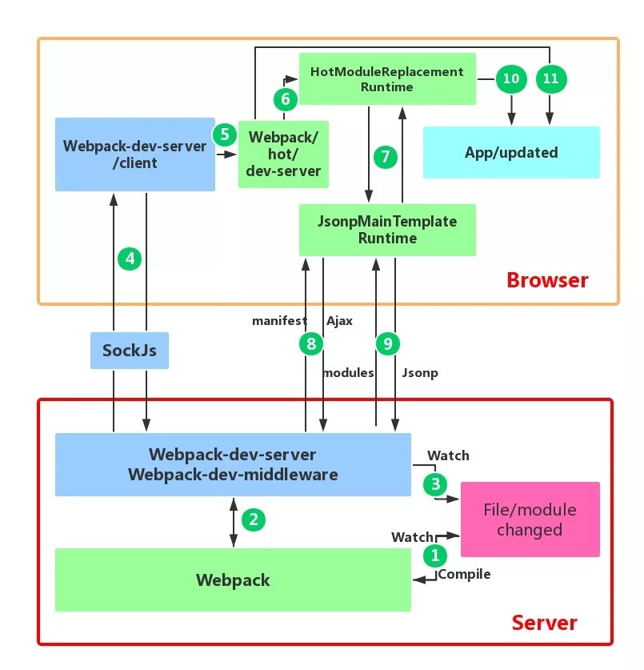
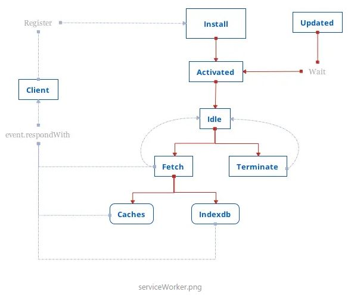

# 前端性能相关问题

- [前端模块化](#前端模块化)
- [gulp 和 webpack](#gulp和webpack)
- [浏览器性能数据](#浏览器性能数据)
- [webWorker 与 serviceWorker](#webWorker与serviceWorker)
- [浏览器进程与线程](#浏览器进程与线程)
- [代码分割提高代码使用率](#代码分割提高代码使用率)
- [2020浏览器内核](#2020浏览器内核)

---

### 前端模块化

1. 参考链接：

   [前端模块化（CommonJS,AMD 和 CMD）](https://www.jianshu.com/p/735781477d28)

   [前端模块化，AMD 与 CMD 的区别](https://www.cnblogs.com/futai/p/5258349.html)

   [前端模块化之 AMD 与 CMD 原理](https://blog.csdn.net/weixin_33947521/article/details/88001955)

   [requireJS 原理解析](https://blog.csdn.net/cde7070/article/details/65935888)

   [CommonJs、AMD、CMD、Webpack](https://blog.csdn.net/weixin_41143293/article/details/79662362)

2. 详解：

   - 模块化为了解决 js 相互引用产生的问题，如：

     - 顺序引入：先引入 jquery，才能引入其它 js
     - 同步加载：1.js 加载并执行完，才加载 2.js
     - window 全局变量污染

   - 模块：

     - 普通函数
     - 对象
     - 立即执行函数

   - 在 webpack 出现前的 2 种前端模块化工具（代码模块化，执行上没有区别）

     - AMD：异步模块定义，使用 require.js，依赖前置

       采用异步方式加载模块，模块的加载不影响它后面语句的运行，所有依赖这个模块的语句，都定义在一个回调函数中，等到加载完成之后，这个回调函数才会运行，避免顺序引入和同步加载的问题。

       - 用法：

       ```js
       // 1.js 中（入口用require，其他用define）
       require(['2.js'], function(A) {
           // A得到的就是2.js模块的返回值
           // 主要的执行代码
           // 2.js 3.js都加载完，才执行1.js的这回调函数
       })

       // 2.js 中
       define(['3.js', 'xxxx.js'], functionA(B, C) {
           // B得到的就是3.js模块的返回值，C是xxxx.js的
           return aaaaa;    // 2.js 模块的返回值
       })

       // 3.js 中
       define([], functionA() {

           retrun {}   // 3.js 模块的返回值
       })
       ```

       - 原理：

         - 块依赖加载之后，如何调用回调函数

           使用 requireJs 时，都是在页面上只引入一个 require.js，把 data-main 指向我们的 main.js

           运行 main.js 时，执行里面的 require 和 define 方法，requireJs 会把这些依赖和回调方法都用一个数据结构存起来

           然后使用 script 来加载这些模块依赖，并且监听 load 函数，且每个 script 元素都会有一个自定义的属性，用来指明模块名

           当模块加载成功之后，可以通过元素属性来获取模块名，接着通过模块名来获取模块的定义，接着对模块进行初始化，再对子模块重复操作

           当子模块没有其他要加载的依赖的时候这个时候表明子模块已经加载完毕，调用回调函数

         - 加载依赖之后，如何将接口暴露给回调函数

           当执行回调函数的时候，会使用 apply 将模块定义中的接口，传递给回调函数

         - 如何解决循环依赖的问题

           将已定义的模块保存在一个对象中，当加载模块依赖的时候，如果在这个对象中存在的话，则直接返回这个模块。否则的话，则再走一遍加载的模块的流程。

       - 代码：

       ```js
       var modules = {},	// 存放所有文件模块的信息，每个js文件模块的信息
       loadings = [];	//	存放所有已经加载了的文件模块的id，一旦该id的所有依赖都加载完后，该id将会在数组中移除

       // 上面说了，每个文件模块都要有个id，这个函数是返回当前运行的js文件的文件名，拿文件名作为文件对象的id
       // 比如，当前加载 3.js 后运行 3.js ，那么该函数返回的就是 '3.js'
       function getCurrentJs() {
           return document.currentScript.src
       }
       // 创建节点
       function createNode() {
           var node = document.createElement('script')
           node.type = 'text/javascript'
           node.async = true;
           return node
       }
       // 开始运行
       function init() {
           // 加载 1.js
           loadJs('1.js')
       }
       // 加载文件(插入dom中)，如果传了回调函数，则在onload后执行回调函数
       function loadJs(url, callback) {
           var node = createNode()
           node.src = url;
           node.setAttribute('data-id', url)
           node.addEventListener('load', function(evt) {
               var e = evt.target
               setTimeout(() => {  // 这里延迟一秒，只是让在浏览器上直观的看到每1秒加载出一个文件
                   callback && callback(e)
               }, 1000)
           }, false)

           document.body.appendChild(node)
       }

       // 此时，loadJs(1.js)后，并没有传回调函数，所以1.js加载成功后只是自动运行1.js代码
       // 而1.js代码中，是require( ['2.js', 'xxx.js'], functionA（B, C）{} )，则执行的是require函数, 在下面是require的定义

       window.require = function(deps, callback) {
           // deps 就是对应的 ['2.js', 'xxx.js']
           // callback 就是对应的 functionA
           // 在这里，是不会运行callback的(即模块的运行！)，得等到所有依赖都加载完的啊
           // 所以得有个地方，把一个文件的所有信息都先存起来啊，尤其是deps和callback
           var id = getCurrentJs();// 当前运行的是1.js，所以id就是'1.js'
           if(!modules.id) {
               modules[id] = { // 该模块对象信息
                   id: id,
                   deps: deps,
                   callback: callback,
                   exports: null,  // 该模块的返回值return ，
                   就是functionA(B, C)运行后的返回值，仔细想想？在后面的getExports中详细讲

                   status: 1,

               }
               loadings.unshift(id); // 加入这个id，之后会循环loadings数组，递归判断id所有依赖
           }

           loadDepsJs(id); // 加载这个文件的所有依赖,即去加载[2.js]
       }

       function loadDepsJs(id) {
           var module = modules[id]; // 获取到这个文件模块对象
           // deps是['2.js']
           module.deps.map(item => {   // item 其实是依赖的Id，即 '2.js'
               if(!modules[i]) {   // 如果这个文件没被加载过（注：加载过的肯定在modules中有）
               （1）    loadJs(item, function() {   // 加载 2.js，并且传了个回调，准备要递归了
                           // 2.js加载完后，执行了这个回调函数
                           loadings.unshift(item); // 此时里面有两个了, 1.js 和 2.js
                           // 递归。。。要去搞3.js了
                           loadDepsJs(item)// item传的2.js，递归再进来时，就去modules中取2.js的deps了
                           // 每次检查一下，是否都加载完了
                           checkDeps(); // 循环loadings，配合递归嵌套和modules信息，判断是否都加载完了
                       })
               }
           })
       }

       // 上面（1）那里，加载了2.js后马上会运行2.js的，而2.js里面是
       define(['js'], fn)
       // 所以相当于执行了 define函数

       window.define = function(deps,callback) {
           var id = getCurrentJs()
           if(!modules.id) {
               modules[id] = {
                   id: id,
                   deps: getDepsIds(deps),
                   callback: callback,
                   exports: null,
                   status: 1,

               }
           }
       }

       // 注意，define运行的结果，只是在modules中添加了该模块的信息
       // 因为其实在上面的loadDepsJs中已经事先做了loadings和递归deps的操作，而且是一直不断的循环往复的进行探查，所以define里面就不需要再像require中写一次loadDeps了

       // 循环loadings，查看loadings里面的id，其所依赖的所有层层嵌套的依赖模块是否都加载完了

       function checkDeps() {
           for(var i = 0, id; i < loadings.length ; i++) {
           id = loadings[i]
           if(!modules[id]) continue

           var obj = modules[id],
           deps = obj.deps

           // 下面那行为什么要执行checkCycle函数呢，checkDeps是循环loadings数组的模块id，而checkCycle是去判断该id模块所依赖的**层级**的模块是否加载完
           // 即checkDeps是**广度**的循环已经加载（但依赖没完全加载完的）的id
           // checkCycle是**深度**的探查所关联的依赖
           // 还是举例吧。。。假如除了1.js, 2.js, 3.js, 还有个4.js，依赖5.js，那么
           // loadings 可能 是 ['1.js', '4.js']
           // 所以checkDeps --> 1.js，  4.js
           // checkCycle深入内部 1.js --> 2.js --> 3.js ;;; 4.js --> 5.js
           // 一旦比如说1.js的所有依赖2.js、3.js都加载完了，那么1.js 就会在loadings中移出

           var flag = checkCycle(deps)

           if(flag) {
                   console.log(i, loadings[i] ,'全部依赖已经loaded');

                   loadings.splice(i,1);
                   // ！！！运行模块，然后同时得到该模块的返回值！！！
                   getExport(obj.id)
                   // 不断的循环探查啊~~~~
                   checkDeps()
           }

           }
       }
       // 深层次的递归的去判断，层级依赖是否都加在完了
       // 进入1.js的依赖2.js，再进入2.js的依赖3.js ......
       function checkCycle(deps) {
           var flag = true

           function cycle(deps) {
               deps.forEach(item => {
                   if(!modules[item] || modules[item].status == 1) {
                       flag = false
                   } else if(modules[item].deps.length) {
       //                         console.log('inner deps', modules[item].deps);

                       cycle(modules[item].deps)
                   }

               })
           }

           cycle(deps)

           return flag
       }

       /*
           运行该id的模块，同时得到模块返回值，modules[id].export
       */
       function getExport(id) {
           /*
               先想一下，例如模块2.js, 这时 id == 2.js
               define(['3.js', 'xxxx.js'], functionA(B, C) {
                   // B得到的就是3.js模块的返回值，C是xxxx.js的
                   return aaaaa    // 2.js 模块的返回值
               })
               所以：
               1. 运行模块，就是运行 functionA （模块的callback）
               2. 得到模块的返回值，就是functionA运行后的返回值 aaaaa
               问题：
               1. 运行functionA(B, C)   B, C是什么？怎么来的？
               2. 有B, C 了，怎么运行functionA ？

           */
           // 解决问题1
           // B, C 就是该模块依赖 deps [3.js, xxxx.js]对应的返回值
           // 那么循环deps 得到 依赖模块Id, 取模块的export
           var params = [];
           var deps = modules[id].deps

           for(var i = 0; i < deps.length; i++) {
               // 取依赖模块的exports即模块返回值，注意不要害怕取不到，因为你这个模块都进来打算运行了，那么你的所有依赖的模块早都进来过运行完了（还记得模块运行顺序不？）
               let depId = deps[i]
               params.push( modules[ depId ].exports )
           }

           // 到这里,params就是依赖模块的返回值的数组，也就是B，C对应的实参
           // 也就是 params == [3.js的返回值，xxxx.js的返回值]

           if(!modules[id].exports) {
               // 解决问题2： callback(functionA)的执行，用.apply，这也是为什么params是个数组了
               // 这一行代码，既运行了该模块，同时也得到了该模块的返回值export
               modules[id].exports = modules[id].callback.apply(global, params)
           }
       }
       ```

       - 模块运行顺序：

         3.js，2.js，1.js，如果模块以及该模块的依赖都加载完，就执行。 如 3.js 加载完后，没有依赖，直接执行 3.js 的回调了，2.js 加载完后探查到依赖的 3.js 也加载完，2.js 执行自己的回调了,主模块一定在最后执行


        * CMD：通用模块定义，使用sea.js，依赖就近
    
            * 用法：
            ```js
            // 只有define，没有require
            // 和AMD那个例子一样，还是1依赖2, 2依赖3
            //1.js中
            define(function() {
    
                var a = require('2.js')
                console.log(33333)
                var b = require('4.js')
            })
    
            //2.js 中
            define(function() {
                var b = require('3.js')
            })
            //3.js 中
            define(function() {
                // xxx
            })
            ```
    
            * 原理同AMD
    
            * 模块运行顺序：
    
                1.js，2.js，3.js，即先执行主模块1.js，碰到require('2.js')就执行2.js，2.js中碰到require('3.js')就执行3.js
    
        * es6模块化与commonjs区别
    
            es6模块化：import-export，编译时加载
            commonjs：require，module.exports=对象/函数，运行时加载
    
    * 服务器端模块化工具
    
        * webpack基于CommonJs
    
            同步加载
    
            一个单独的文件就是一个模块，每一个模块都是一个单独的作用域，在该模块内部定义的变量，无法被其他模块读取，除非定义为global对象的属性。
    
            加载模块使用require方法，该方法读取一个文件并执行，返回文件内部的module.exports对象，用来输出模块。

### gulp 和 webpack

1.  参考链接：

    [gulp 官方文档](https://www.gulpjs.com.cn/docs/getting-started/quick-start/)

    [webpack4.x 配置详解，多页面，拆分代码，多入口，多出口，新特性新坑](https://www.cnblogs.com/pomelott/p/8977092.html)

    [webpack 官网](https://www.webpackjs.com/concepts/)

    [Webpack 之 treeShaking](https://blog.csdn.net/VhWfR2u02Q/article/details/81916786)

    [webpack-js tree shaking](https://segmentfault.com/a/1190000020789501)

    [webpack 如何优雅的使用 tree-shaking](https://blog.csdn.net/Mo_Luffy/article/details/99552314)

    [webpack 的 loader 和 plugin 的区别](https://blog.csdn.net/qq_42375089/article/details/88072681)

    [超详细的 webpack 原理解读](https://segmentfault.com/a/1190000017890529?utm_source=tag-newest)

    [vue 项目中使用 webpack 优化之 HappyPack 实战](https://blog.csdn.net/csl125/article/details/85780354)

    [4-3 使用 HappyPack](http://www.xbhub.com/wiki/webpack/4%E4%BC%98%E5%8C%96/4-3%E4%BD%BF%E7%94%A8HappyPack.html)

    [使用 vue-cli 构建项目中的 Webpack 优化](https://www.jianshu.com/p/299c61f621b3)

    [webpack 中如何编写一个 plugin](https://www.cnblogs.com/wzndkj/p/10921340.html)

    [Webpack 热更新实现原理分析](https://zhuanlan.zhihu.com/p/30623057)

    [彻底搞懂并实现 webpack 热更新原理](https://segmentfault.com/a/1190000020310371?utm_source=tag-newest)

    [Webpack 热更新机制](https://www.jianshu.com/p/2806aa5c0dea)

    [手把手教你撸一个 Webpack Loader](https://www.jianshu.com/p/7fa359ffcf8d)

    [关于 webpack 的面试题](https://www.cnblogs.com/gaoht/p/11310365.html)

    [gulp配置指南](https://www.jianshu.com/p/d48301a5c0c9)

2.  详解：

    - webpack 与 grunt、gulp 的不同

      grunt 和 gulp 是基于任务和流（Task、Stream），整条链式操作构成了一个任务，多个任务形成构建过程

      webpack 是基于入口的。webpack 会自动地递归解析入口所需要加载的所有资源文件，然后用不同的 Loader 来处理不同的文件，用 Plugin 来扩展 webpack 功能

    - 与 webpack 类似的工具还有哪些

      - webpack 适用于大型复杂的前端站点构建
      - rollup 适用于基础库的打包，如 vue、react
      - parcel 适用于简单的实验性项目，他可以满足低门槛的快速看到效果
      - 由于 parcel 在打包过程中给出的调试信息十分有限，所以一旦打包出错难以调试，所以不建议复杂的项目使用 parcel

    - 有哪些常见的 Loader

      - file-loader：把文件输出到一个文件夹中，在代码中通过相对 URL 去引用输出的文件
      - url-loader：和 file-loader 类似，但是能在文件很小的情况下以 base64 的方式把文件内容注入到代码中去
      - source-map-loader：加载额外的 Source Map 文件，以方便断点调试
      - image-loader：加载并且压缩图片文件
      - babel-loader：把 ES6 转换成 ES5
      - css-loader：加载 CSS，支持模块化、压缩、文件导入等特性
      - style-loader：把 CSS 代码注入到 JavaScript 中，通过 DOM 操作去加载 CSS。
      - eslint-loader：通过 ESLint 检查 JavaScript 代码
      - sass-loader：把 sass 转换为 css

    - 有哪些常见的 Plugin

      - define-plugin：定义环境变量
      - commons-chunk-plugin：提取公共代码
      - uglifyjs-webpack-plugin：通过 UglifyES 压缩 ES6 代码
      - HotModuleReplacementPlugin：热更新
      - purifyCssWebpack：消除冗余的 css 代码

    - Loader 和 Plugin 的不同

      - Loader 直译为"加载器"。Webpack 将一切文件视为模块，但是 webpack 原生是只能解析 js 文件，如果想将其他文件也打包的话，就会用到 loader。 所以 Loader 的作用是让 webpack 拥有了加载和解析非 JavaScript 文件的能力。

      - Plugin 直译为"插件"。Plugin 可以扩展 webpack 的功能，让 webpack 具有更多的灵活性。 在 Webpack 运行的生命周期中会广播出许多事件，Plugin 可以监听这些事件，在合适的时机通过 Webpack 提供的 API 改变输出结果。

      - 不同的用法

        - Loader 在 module.rules 中配置，作为模块的解析规则而存在。类型为数组，每一项都是一个 Object，里面描述了对于什么类型的文件（test），使用什么加载(loader)和使用的参数（options）

        - Plugin 在 plugins 中单独配置。类型为数组，每一项是一个 plugin 的实例，参数都通过构造函数传入。

    - webpack 的构建流程是什么?从读取配置到输出文件这个过程尽量说全

      运行前，需要先使用命令 npm init 构建 package.json 配置文件，npm install 相关的 module，scripts 中编写运行命令，最后 npm run \*\*\*运行

      ```json
      {
        "name": "react-family",
        "version": "1.0.0",
        "description": "learn react-family",
        "main": "src/index.js",
        "scripts": {
          "test": "echo \"Error: no test specified\" && exit 1",
          "build": "webpack --config webpack.dev.config.js"
        },
        "author": "...",
        "license": "ISC",
        "devDependencies": {
          "babel-cli": "^6.26.0",
          "babel-core": "^6.26.0",
          "babel-loader": "^7.1.2",
          "babel-preset-env": "^1.6.1",
          "babel-preset-es2015": "^6.24.1",
          "babel-preset-react": "^6.24.1",
          "babel-preset-stage-0": "^6.24.1",
          "webpack": "^3.10.0"
        },
        "dependencies": {}
      }
      ```

      Webpack 的运行流程是一个串行的过程，从启动到结束会依次执行以下流程：

      1. 初始化参数：从配置文件和 Shell 语句中读取与合并参数，得出最终的参数；
      2. 开始编译：用上一步得到的参数初始化 Compiler 对象，加载所有配置的插件，执行对象的 run 方法开始执行编译；
      3. 确定入口：根据配置中的 entry 找出所有的入口文件；
      4. 编译模块：从入口文件出发，调用所有配置的 Loader 对模块进行翻译，再找出该模块依赖的模块，再递归本步骤直到所有入口依赖的文件都经过了本步骤的处理；
      5. 完成模块编译：Loader 翻译完所有模块后，得到了每个模块的最终内容以及它们之间的依赖关系；
      6. 输出资源：根据入口和模块之间的依赖关系，组装成一个个包含多个模块的 Chunk，再把每个 Chunk 转换成一个单独的文件加入到输出列表，这步是可以修改输出内容的最后机会；
      7. 输出完成：在确定好输出内容后，根据配置确定输出的路径和文件名，把文件内容写入到文件系统。

      在以上过程中，Webpack 会在特定的时间点广播出特定的事件(详见下方“插件样例”)，插件在监听到定义的事件后会执行特定的逻辑，并且插件可以调用 Webpack 提供的 API 改变 Webpack 的运行结果。

    - 描述一下编写 loader 或 plugin 的思路

      Loader 像一个"翻译官"把读到的源文件内容转义成新的文件内容，并且每个 Loader 通过链式操作，将源文件一步步翻译成想要的样子。

      编写 Loader 时要遵循单一原则，每个 Loader 只做一种"转义"工作。 每个 Loader 拿到的是源文件内容（source），可以通过返回值的方式将处理后的内容输出，也可以调用 this.callback()方法，将内容返回给 webpack。 还可以通过 this.async()生成一个 callback 函数，再用这个 callback 将处理后的内容输出出去。 此外 webpack 还为开发者准备了开发 loader 的工具函数集——loader-utils。

      相对于 Loader 而言，Plugin 的编写就灵活了许多。 webpack 在运行的生命周期中会广播出许多事件，Plugin 可以监听这些事件，在合适的时机通过 Webpack 提供的 API 改变输出结果。

    - 如何利用 webpack 来优化前端性能

      - 压缩代码。删除多余的代码、注释、简化代码的写法等等方式。可以利用 webpack 的 UglifyJsPlugin 和 ParallelUglifyPlugin 来压缩 JS 文件， 利用 cssnano（css-loader?minimize）来压缩 css

      - 利用 CDN 加速。在构建过程中，将引用的静态资源路径修改为 CDN 上对应的路径。可以利用 webpack 对于 output 参数和各 loader 的 publicPath 参数来修改资源路径

      - 删除死代码（Tree Shaking）。将代码中永远不会走到的片段删除掉。可以通过在启动 webpack 时追加参数--optimize-minimize 来实现

      - 提取公共代码。

    - 如何提高 webpack 的构建速度

      - 多入口情况下，使用 CommonsChunkPlugin 来提取公共代码
      - 通过 externals 配置来提取常用库
      - 利用 DllPlugin 和 DllReferencePlugin 预编译资源模块，通过 DllPlugin 来对那些我们引用但是绝对不会修改的 npm 包来进行预编译，再通过 DllReferencePlugin 将预编译的模块加载进来。
      - 使用 Happypack 实现多线程加速编译(webpack4 弃用见下方)
      - 使用 webpack-uglify-parallel 来提升 uglifyPlugin 的压缩速度。 原理上 webpack-uglify-parallel 采用了多核并行压缩来提升压缩速度
      - 使用 Tree-shaking 和 Scope Hoisting 来剔除多余代码

    - 怎么配置单页应用？怎么配置多页应用？

      单页应用可以理解为 webpack 的标准模式，直接在 entry 中指定单页应用的入口即可

      多页应用可以使用 webpack 的 AutoWebPlugin 来完成简单自动化的构建，但是前提是项目的目录结构必须遵守他预设的规范。 多页应用中要注意的是：

            每个页面都有公共的代码，可以将这些代码抽离出来，避免重复的加载。比如，每个页面都引用了同一套css样式表
    
            随着业务的不断扩展，页面可能会不断的追加，所以一定要让入口的配置足够灵活，避免每次添加新页面还需要修改构建配置

    - npm 打包时需要注意哪些？如何利用 webpack 来更好的构建

      npm 是目前最大的 JavaScript 模块仓库，里面有来自全世界开发者上传的可复用模块。你可能只是 JS 模块的使用者，但是有些情况你也会去选择上传自己开发的模块。 关于 NPM 模块上传的方法可以去官网上进行学习，这里只讲解如何利用 webpack 来构建。

      - NPM 模块需要注意以下问题：

      1. 要支持 CommonJS 模块化规范，所以要求打包后的最后结果也遵守该规则。
      2. Npm 模块使用者的环境是不确定的，很有可能并不支持 ES6，所以打包的最后结果应该是采用 ES5 编写的。并且如果 ES5 是经过转换的，请最好连同 SourceMap 一同上传。
      3. Npm 包大小应该是尽量小（有些仓库会限制包大小）
      4. 发布的模块不能将依赖的模块也一同打包，应该让用户选择性的去自行安装。这样可以避免模块应用者再次打包时出现底层模块被重复打包的情况。
      5. UI 组件类的模块应该将依赖的其它资源文件，例如.css 文件也需要包含在发布的模块里。

      - 基于以上需要注意的问题，我们可以对于 webpack 配置做以下扩展和优化：

      1. CommonJS 模块化规范的解决方案： 设置 output.libraryTarget='commonjs2'使输出的代码符合 CommonJS2 模块化规范，以供给其它模块导入使用
      2. 输出 ES5 代码的解决方案：使用 babel-loader 把 ES6 代码转换成 ES5 的代码。再通过开启 devtool: 'source-map'输出 SourceMap 以发布调试。
      3. npm 包大小尽量小的解决方案：Babel 在把 ES6 代码转换成 ES5 代码时会注入一些辅助函数，最终导致每个输出的文件中都包含这段辅助函数的代码，造成了代码的冗余。解决方法是修改.babelrc 文件，为其加入 transform-runtime 插件
      4. 不能将依赖模块打包到 NPM 模块中的解决方案：使用 externals 配置项来告诉 webpack 哪些模块不需要打包。
      5. 对于依赖的资源文件打包的解决方案：通过 css-loader 和 extract-text-webpack-plugin 来实现，配置如下：

      ```js
      const ExtractTextPlugin = require ('extract-text-webpack-plugin');
      module.exports = {
          module: {
              rules:[
                  {
                      //增加对CSS文件的支持
                      test:/\.css/,
                      // 提取出Chunk中的CSS代码到单独的文件中
                      use: ExtractTextPlugin.extract({
                          use: ['css-loader']
                      }),
                  },
              ]
          },
          plugins:[
              new ExtractTextPlugin({
                  // 输出的CSS文件名称
                  filenames 'index.css'
              })
          ]
      }
      ```

    - 如何在 vue 项目中实现按需加载

      Vue UI 组件库的按需加载为了快速开发前端项目，经常会引入现成的 UI 组件库如 ElementUI、iView 等，但是他们的体积和他们所提供的功能一样，是很庞大的。 而通常情况下，我们仅仅需要少量的几个组件就足够了，但是我们却将庞大的组件库打包到我们的源码中，造成了不必要的开销。

      不过很多组件库已经提供了现成的解决方案，如 Element 出品的 babel-plugin-component 和 AntDesign 出品的 babel-plugin-import 安装以上插件后，在.babelrc 配置中或 babel-loader 的参数中进行设置，即可实现组件按需加载了。

      单页应用的按需加载 现在很多前端项目都是通过单页应用的方式开发的，但是随着业务的不断扩展，会面临一个严峻的问题——首次加载的代码量会越来越多，影响用户的体验。

      详见“vue 简结”-“注意或优化的地方”-“babel”

      通过 import(_)语句来控制加载时机，webpack 内置了对于 import(_)的解析，会将 import(_)中引入的模块作为一个新的入口在生成一个 chunk。 当代码执行到 import(_)语句时，会去加载 Chunk 对应生成的文件。import()会返回一个 Promise 对象，所以为了让浏览器支持，需要事先注入 Promise polyfill

      详见“vue 简结”-“动态组件与异步组件”

    - gulp 配置

    ```txt
    //.babelrc
    {
        "presets": [
            "es2015"
        ]
    }
    ```

    ```js
    //3.9.0
    var gulp = require("gulp"),
      sass = require("gulp-sass"),
      autoprefixer = require("gulp-autoprefixer"),
      minifycss = require("gulp-minify-css"),
      imagemin = require("gulp-imagemin"),
      babel = require("gulp-babel"),
      jshint = require("gulp-jshint"),
      concat = require("gulp-concat"),
      uglify = require("gulp-uglify"),
      livereload = require("gulp-livereload"),
      notify = require("gulp-notify"),
      cache = require("gulp-cache"),
      rename = require("gulp-rename"),
      del = require("del");

    gulp.task('scripts', function() {
        gulp.src('src/js/Home/*.js')
            .pipe(babel())//转译es5，需配置.babelrc
            .pipe(uglify())//压缩
            .pipe(rename({ suffix: '.min' }))//重命名为*.min.js
            .pipe(gulp.dest('Content/themes/base/minjs/Home'))//输出文件到指定位置
            .pipe(notify({
                message: 'Home js task complete'//控制台输出任务完成
            }));
        gulp.src('src/js/Shared/*.js')
            .pipe(babel())
            .pipe(uglify())
            .pipe(rename({ suffix: '.min' }))
            .pipe(gulp.dest('Content/themes/base/minjs/Shared'))
            .pipe(notify({
                message: 'Shared js task complete'
            }));
    });
    
    gulp.task('styles', function() {
        gulp.src('src/scss/Home/*.scss')
            .pipe(sass())//编译sass
            .pipe(autoprefixer('last 2 version', 'safari 8', 'ie 8', 'ie 9', 'opera 12.1', 'ios 6', 'android 4'))//自动添加prefix适配
            .pipe(minifycss())//压缩
            .pipe(rename({ suffix: '.min' }))//重命名为*.min.css
            .pipe(gulp.dest('Content/themes/base/css/Home'))//输出文件到指定位置
            .pipe(notify({
                message: 'Home css task complete'//控制台输出任务完成
            }));
        gulp.src('src/scss/Shared/*.scss')
            .pipe(sass())
            .pipe(autoprefixer('last 2 version', 'safari 5', 'ie 8', 'ie 9', 'opera 12.1', 'ios 6', 'android 4'))
            .pipe(minifycss())
            .pipe(rename({ suffix: '.min' }))
            .pipe(gulp.dest('Content/themes/base/css/Shared'))
            .pipe(notify({
                message: 'Shared css task complete'
            }));
    });
    
    gulp.task('auto', function() {
        gulp.watch(['src/js/*/*.js'], ['scripts']);//监听文件变化
        gulp.watch(['src/scss/*/*.scss'], ['styles']);
    });
    
    gulp.task('default', ['styles', 'scripts', 'auto']);
    ```
    
    - gulp 打包报错不中断

    ```js
    //npm install -D gulp-plumber
    var plumber = require('gulp-plumber');
    gulp.src(src_dir + "/scripts/**/*.js")
            .pipe(plumber())  //优先使用plumber()
            .pipe(jshint())
            .pipe(jshint.reporter('default'));

    gulp.src(dist_dir + "/templates/**/*.html")
            .pipe(plumber())
            .pipe(htmlmin({
                collapseWhitespace: true
            }))
            .pipe(templateCache("tpl.min.js", {
                module: "xt.templates",
                standalone: true
            }))
            .pipe(gulpif(isUglify, uglify()))
            .pipe(gulp.dest(dist_dir + "/scripts/"));
    ```

    * webpack配置
    ```js
    const webpack = require("webpack");
    const path = require('path');
    //返回匹配指定模式的文件名或目录
    const glob = require("glob");
    //消除冗余的css
    const purifyCssWebpack = require("purifycss-webpack");
    // html模板
    const htmlWebpackPlugin = require("html-webpack-plugin");
    // 清除目录等
    const cleanWebpackPlugin = require("clean-webpack-plugin");
    //4.x之前用以压缩
    const uglifyjsWebpackPlugin = require("uglifyjs-webpack-plugin");
    //ES压缩
    const UglifyESPlugin = require('uglify-webpack-plugin');
    // 分离css
    const extractTextPlugin = require("extract-text-webpack-plugin");
    //静态资源输出
    const copyWebpackPlugin = require("copy-webpack-plugin");
    
    module.exports = {
        entry: {
            // 多入口文件
            a: './src/js/index.js',
            b: './src/js/index2.js',
            jquery: 'jquery'
        },
        output: {
            path:path.resolve(__dirname, 'dist'),
            // 打包多出口文件
            // 生成 a.bundle.js  b.bundle.js  jquery.bundle.js
            filename: './js/[name].bundle.js'
        },
        // devtool: "source-map",  // 开启调试模式
        module:{
            rules: [
                {
                    test: /\.css$/,
                    // 不分离的写法
                    // use: ["style-loader", "css-loader"]
                    // 使用postcss不分离的写法
                    // use: ["style-loader", "css-loader", "postcss-loader"]
                    // 此处为分离css的写法
                    /*use: extractTextPlugin.extract({
                        fallback: "style-loader",
                        use: "css-loader",
                        // css中的基础路径
                        publicPath: "../"
    
                    })*/
                    // 此处为使用postcss分离css的写法
                    // use: extractTextPlugin.extract({
                    //     fallback: "style-loader",
                    //     use: ["css-loader", "postcss-loader"],
                    //     // css中的基础路径
                    //     publicPath: "../"
                    // })
                    //此处可配置压缩css
                    use: [
                        {
                            loader: 'style-loader'
                        },
                        {
                            loader: 'css-loader',
                            options: {
                                root: '/', //修改css中url指向的根目录, 默认值为/, 对于绝对路径, css-loader默认是不会对它进行处理的
                                modules: false, //开启css-modules模式, 默认值为flase
                                localIdentName: '[name]-[local]-[hash:base64:5]', //设置css-modules模式下local类名的命名
                                minimize: false, //压缩css代码, 默认false
                                camelCase: false, //导出以驼峰化命名的类名, 默认false
                                import: true, //禁止或启用@import, 默认true
                                url: true, //禁止或启用url, 默认true
                                sourceMap: false, //禁止或启用sourceMap, 默认false
                                importLoaders: 0, //在css-loader前应用的loader的数目, 默认为0
                                alias: {} //起别名, 默认{}
                            }
                        }
                    ]
                },
                {
                    test: /\.js$/,
                    use: ["babel-loader"],
                    // 不检查node_modules下的js文件
                    exclude: "/node_modules/"
                },
                {
                    test: /\.(png|jpg|gif)$/,
                    use: [{
                            // 需要下载file-loader和url-loader
                            loader: "url-loader",
                            options: {
                                limit: 50,
                                // 图片文件输出的文件夹
                                outputPath: "images"
                            }
                        }
                    ]
                },
                {
                    test: /\.(png|jpg|gif|svg)$/,
                    use: [
                    'file-loader',
                    {
                        loader: 'image-webpack-loader',
                        options: {
                            bypassOnDebug: true,
                            mozjpeg: {
                                progressive: true,
                                quality: 65
                            },
                            optipng: {
                                enabled: false,
                            },
                            pngquant: {
                                quality: '65-90',
                                speed: 4
                            },
                            gifsicle: {
                                interlaced: false,
                            },
                            // the webp option will enable WEBP
                            webp: {
                                enabled: false,
                            },
                            limit: 1,
                            name: '[name].[ext]?[hash]'
                        }
                    }]
                },
                {
                    test: /\.html$/,
                    // html中的img标签
                    use: ["html-withimg-loader"]
                },
                {
                    test: /\.less$/,
                    // 三个loader的顺序不能变
                    // 不分离的写法
                    // use: ["style-loader", "css-loader", "less-loader"]
                    // 分离的写法
                    use: extractTextPlugin.extract({
                        fallback:"style-loader",
                        use: ["css-loader", "less-loader"]
                    })
                },
                {
                    test: /\.(scss|sass)$/,
                    // sass不分离的写法，顺序不能变
                    // use: ["style-loader", "css-loader", "sass-loader"]
                    // 分离的写法
                    use: extractTextPlugin.extract({
                        fallback:"style-loader",
                        use: ["css-loader", "sass-loader"]
                    })
                }
            ]
        },
        plugins: [
            new webpack.HotModuleReplacementPlugin(),
            // 调用之前先清除
            new cleanWebpackPlugin(["dist"]),
            // 4.x之前可用uglifyjs-webpack-plugin用以压缩文件，4.x可用--mode更改模式为production来压缩文件
            new UglifyJSPlugin({
                compress: {
                    warnings: false,  //删除无用代码时不输出警告
                    drop_console: true,  //删除所有console语句，可以兼容IE
                    collapse_vars: true,  //内嵌已定义但只使用一次的变量
                    reduce_vars: true,  //提取使用多次但没定义的静态值到变量
                },
                output: {
                    beautify: false, //最紧凑的输出，不保留空格和制表符
                    comments: false, //删除所有注释
                }
            }),
            //ES压缩插件
            new UglifyESPlugin({
                uglifyOptions: {  //比UglifyJS多嵌套一层
                    compress: {
                        warnings: false,
                        drop_console: true,
                        collapse_vars: true,
                        reduce_vars: true
                    },
                    output: {
                        beautify: false,
                        comments: false
                    }
                }
            }),
            new copyWebpackPlugin([{
                from: path.resolve(__dirname,"src/assets"),
                to: './public'
            }]),
            // 分离css插件参数为提取出去的路径
            new extractTextPlugin("css/index.css"),
            // 消除冗余的css代码
            new purifyCssWebpack({
                // glob为扫描模块，使用其同步方法
                paths: glob.sync(path.join(__dirname, "src/*.html"))
            }),
            // 全局暴露统一入口
            new webpack.ProvidePlugin({
                $: "jquery"
            }),
            // 自动生成html模板
            new htmlWebpackPlugin({
                minify:{
                    removeAttributeQuotes:true//去掉双引号
                },
                hash:true,//加入哈希来禁止缓存
                filename: "index.html",// 编译后的文件及路径
                title: "xxxx",
                chunks: ['a',"jquery"],  // 按需引入对应名字的js文件
                template: "./src/index.html"//  源模板
            }),
            new htmlWebpackPlugin({
                chunks: ['b'],
                filename: "index2.html",
                title: "page2",
                template: "./src/index2.html"
            })
        ],
        devServer: {
            contentBase: path.resolve(__dirname, "dist"),
            host: "localhost",
            port: "8090",
            open: true, // 开启浏览器
            hot: true   // 开启热更新
        },
        // 提取js，lib1名字可改
        optimization: {
            splitChunks: {
                cacheGroups: {
                    lib1: {
                        chunks: "initial",
                        name: "jquery",
                        enforce: true
                    }
                }
            }
        }
    
    }
    ```
    
    * treeShaking
    
        * 描述
    
            解析js代码得出语法树，在保持代码运行结果不变的前提下，去除无用的代码(没有执行的代码，如不可能进入的if分支，return后的代码，声明后没用的变量)，使用的是编译原理中提到的DCE(dead code eliminnation)
    
            Tree-shaking是依赖ES6模块静态分析的，因为ES6 module只能作为模块顶层的语句出现，import 的模块名只能是字符串常量，import 绑定是不可改变的，依赖关系确定，与运行时无关
    
        * 使用
    
            使用插件压缩代码即可new webpack.optimize.UglifyJsPlugin()
    
    * HappyPack(webpack4后不再维护，使用thread-loader替代，见“vue简结”-“注意或优化的地方”-“webpack(vue.config.js)”-“parallel”)
    
        由于运行在 Node.js 之上的 Webpack 是单线程模型的，所以Webpack 需要处理的事情需要一件一件的做，不能多件事一起做。我们需要Webpack 能同一时间处理多个任务，发挥多核 CPU 电脑的威力，HappyPack 就能让 Webpack 做到这点，它把任务分解给多个子进程去并发的执行，子进程处理完后再把结果发送给主进程，从而减少了总的构建时间。
    
        * 样例
    
        ```js
        const path = require('path');
        const ExtractTextPlugin = require('extract-text-webpack-plugin');
        const HappyPack = require('happypack');
    
        module.exports = {
            module: {
                rules: [
                    {
                        test: /\.js$/,
                        // 把对 .js 文件的处理转交给 id 为 babel 的 HappyPack 实例
                        use: ['happypack/loader?id=babel'],
                        // 排除 node_modules 目录下的文件，node_modules 目录下的文件都是采用的 ES5 语法，没必要再通过 Babel 去转换
                        exclude: path.resolve(__dirname, 'node_modules'),
                    },
                    {
                        // 把对 .css 文件的处理转交给 id 为 css 的 HappyPack 实例
                        test: /\.css$/,
                        use: ExtractTextPlugin.extract({
                            use: ['happypack/loader?id=css'],
                        }),
                    }
                ]
            },
            plugins: [
                new HappyPack({
                    // 用唯一的标识符 id 来代表当前的 HappyPack 是用来处理一类特定的文件
                    id: 'babel',
                    // 如何处理 .js 文件，用法和 Loader 配置中一样
                    loaders: ['babel-loader?cacheDirectory'],
                    // ... 其它配置项
                }),
                new HappyPack({
                    id: 'css',
                    // 如何处理 .css 文件，用法和 Loader 配置中一样
                    loaders: ['css-loader'],
                }),
                new ExtractTextPlugin({
                    filename: `[name].css`,
                }),
            ],
        };
        ```
    
        * 注意
    
            * 在 Loader 配置中，所有文件的处理都交给了 happypack/loader 去处理，使用紧跟其后的 querystring ?id=babel 去告诉 happypack/loader 去选择哪个 HappyPack 实例去处理文件。
    
            * 在 Plugin 配置中，新增了两个 HappyPack 实例分别用于告诉 happypack/loader 去如何处理 .js 和 .css 文件。选项中的 id 属性的值和上面 querystring 中的 ?id=babel 相对应，选项中的 loaders 属性和 Loader 配置中一样。
    
        * 参数
    
            * id: String 用唯一的标识符 id 来代表当前的 HappyPack 是用来处理一类特定的文件
            * loaders: Array 用法和 webpack Loader 配置中一样
            * threads: Number 代表开启几个子进程去处理这一类型的文件，默认是3个，类型必须是整数
            * verbose: Boolean 是否允许 HappyPack 输出日志，默认是 true
            * threadPool: HappyThreadPool 代表共享进程池，即多个 HappyPack 实例都使用同一个共享进程池中的子进程去处理任务，以防止资源占用过多
            * verboseWhenProfiling: Boolean 开启webpack --profile ,仍然希望HappyPack产生输出
            * debug: Boolean 启用debug 用于故障排查。默认 false
    
    * DllPlugin和DllReferencePlugin
    
        每当修改了业务代码之后，一些第三方的，体积比较大的模块（比如 vue、echarts、axios等）也会被重新打包，极大的浪费了时间。这时我们就可以使用 DLL 预先把一些第三方模块提前打包，以后修改业务代码再构建时就不会构建这些模块了。
    
    * splitChunks
    
        有些库包会比较大，如果一起打包的话会导致文件过大，所以应该利用浏览器的并发数，把大文件拆开来，webpack4主要使用的是splitChunks配置,用来抽取公共代码
    
        vue配置见“vue简结”-“注意或优化的地方”-“webpack(vue.config.js)”-“splitChunks”
    
        默认配置
        ```js
        {
            "chunks": "all",//all, async(相当于import异步拆分打包的内容), initial(entry的配置) 三选一, 插件作用的chunks范围
            "minSize": 0,//最小尺寸
            "misChunks": 1,//最小chunks
            "maxAsyncRequests": 1,//最大异步请求chunks
            "maxInitialRequests": 1,//最大初始化chunks
            "name": undefined,//split 的 chunks name
            "automaticNameDelimiter": "~",//如果不指定name，自动生成name的分隔符（‘runtime~[name]’）
            "filename": undefined,
            "cacheGroups": {}//缓存组
        }
        ```


    * webpack热更新原理
    
        
    
        * 概念
    
            webpack的热更新又称热替换（Hot Module Replacement），缩写为HMR。 这个机制可以做到不用刷新浏览器而将新变更的模块替换掉旧的模块。
    
        * 流程
    
            1. webpack监听文件变化，重新打包
    
                在 webpack 的 watch 模式下，文件系统中某一个文件发生修改，webpack 监听到文件变化，根据配置文件对模块重新编译打包，并将打包后的代码通过简单的 JavaScript 对象保存在内存中。
    
            2. webpack-dev-server中间件调用webpack的api将代码打包到内存
    
                webpack-dev-server 和 webpack 之间的接口交互，而在这一步，主要是 dev-server 的中间件 webpack-dev-middleware 和 webpack 之间的交互，webpack-dev-middleware 调用 webpack 暴露的 API对代码变化进行监控，并且告诉 webpack，将代码打包到内存中。
    
            3. webpack-dev-server监听配置文件夹中静态文件的变化，通知浏览器刷新
    
                webpack-dev-server 对文件变化的一个监控，这一步不是监控代码变化重新打包。当在配置文件中配置了devServer.watchContentBase 为 true 的时候，Server 会监听这些配置文件夹中静态文件的变化，变化后会通知浏览器端对应用进行 live reload。注意，这儿是浏览器刷新，和 HMR 是两个概念。
    
            4. webpack-dev-server建立浏览器端和服务端的websocket，浏览器根据传来的webpack打包信息、文件变化信息、新模块hash值，进行后续操作
    
                也是 webpack-dev-server 代码的工作，该步骤主要是通过 sockjs（webpack-dev-server 的依赖）在浏览器端和服务端之间建立一个 websocket 长连接，将 webpack 编译打包的各个阶段的状态信息告知浏览器端，同时也包括第三步中 Server 监听静态文件变化的信息。浏览器端根据这些 socket 消息进行不同的操作。当然服务端传递的最主要信息还是新模块的 hash 值，后面的步骤根据这一 hash 值来进行模块热替换。
    
            5. webpack根据传来的信息进行模块热更新
    
                webpack-dev-server/client 端并不能够请求更新的代码，也不会执行热更模块操作，而把这些工作又交回给了 webpack，webpack/hot/dev-server 的工作就是根据 webpack-dev-server/client 传给它的信息以及 dev-server 的配置决定是刷新浏览器呢还是进行模块热更新。当然如果仅仅是刷新浏览器，也就没有后面那些步骤了。
    
            6. HMR接收到之前的hash值，通过ajax拿到所有要更新模块的hash值列表，再通过jsonp获取最新代码
    
                HotModuleReplacement.runtime 是客户端 HMR 的中枢，它接收到上一步传递给他的新模块的 hash 值，它通过 JsonpMainTemplate.runtime 向 server 端发送 Ajax 请求，服务端返回一个 json，该 json 包含了所有要更新的模块的 hash 值，获取到更新列表后，该模块再次通过 jsonp 请求，获取到最新的模块代码。这就是上图中 7、8、9 步骤。
    
            7. Plugin进行模块新旧对比，包括更新模块的依赖项，决定更新的模块
    
                决定 HMR 成功与否的关键步骤，在该步骤中，HotModulePlugin 将会对新旧模块进行对比，决定是否更新模块，在决定更新模块后，检查模块之间的依赖关系，更新模块的同时更新模块间的依赖引用。
    
            8. HMR 失败，刷新浏览器
    
                当 HMR 失败后，回退到 live reload 操作，也就是进行浏览器刷新来获取最新打包代码。
    
    * webpack文件的构建
    
        * entry: 入口文件
        * resolve: 文件路径指向(可加快打包过程)
        * output: 输出文件
        * module: 在webpack中一个模块对应一个文件。webpack会从entry开始，递归找出所有依赖的模块
            * rules
                * test: 匹配的文件名正则
                * use
                    * loader: 模块转换器，用于将模块的原内容按照需求转换成新内容
                    * option: 选项
        * plugins: 拓展插件解决loader无法完成的事，如压缩
    
    * webpack执行
    
        1. 初始化参数
    
            1. 从配置文件(默认webpack.config.js)和shell语句中读取与合并参数，得出最终的参数
            2. 实例化Compiler
            3. 依次调用插件的apply方法，让插件可以监听后续的所有事件节点。同时向插件中传入compiler实例的引用，以方便插件通过compiler调用webpack的api
            4. 应用文件系统到compiler对象
            5. 读取配置的Entrys,为每个Entry实例化一个对应的EntryPlugin
            6. 调用完所有内置的和配置的插件的apply方法
            7. 根据配置初始化resolver,resolver负责在文件系统中寻找指定路径的文件
    
        2. 开始编译
    
            用上一步得到的参数初始化Comiler对象，加载所有配置的插件，通过执行对象的run方法开始执行编译
    
        3. 确定入口
    
            根据配置中的entry找出所有的入口文件
    
        4. 编译模块
    
            1. 启动一次编译
            2. 在监听模式下启动编译，文件发生变化会重新编译
            3. 告诉插件一次新的编译将要启动，同时会给插件带上compiler对象
            4. 检测到文件变化，便有一次新的compilation被创建，对象包含了当前的模块资源、编译生成资源、变化的文件等，提供事件回调给插件进行拓展
            5. 新的compilation对象创建完毕后，从entry开始读取文件,根据文件类型和编译的loader对文件进行编译,编译完后再找出该文件依赖的文件,递归地编译和解析
                1. 使用相应的Loader去转换一个模块
                2. 使用acorn解析转换后的内容，输出对应的抽象语法树
                3. 分析其AST,当遇到require等导入其他模块的语句时，便将其加入依赖的模块列表中，同时对于新找出来的模块递归分析，最终弄清楚所有模块的依赖关系
                4. 	所有模块及依赖的模块都通过Loader转换完成，根据依赖关系生成Chunk
            6. 一次compilation执行完成
            7. 当遇到错误会触发改事件,该事件不会导致webpack退出
    
        5. 完成编译模块
    
            经过第四步之后，得到了每个模块被翻译之后的最终内容以及他们之间的依赖关系
    
        6. 输出资源
    
            1. 所有需要输出的文件已经生成,询问插件有哪些文件需要输出,有哪些不需要输出
            2. 确定好要输出哪些文件后,执行文件输出
            3. 文件输出完毕
            4. 成功完成一次完整的编译和输出流程
            5. 如果在编译和输出中出现错误,导致webpack退出,就会直接跳转到本步骤,插件可以在本事件中获取具体的错误原因
    
        7. 输出完成
    
            在确定好输出内容后，根据配置(webpack.config.js && shell)确定输出的路径和文件名，将文件的内容写入文件系统中(fs)
    
        webpack会在特定的时间点广播特定的事件，插件监听事件并执行相应的逻辑，并且插件可以调用webpack提供的api改变webpack的运行结果
    
    * webpack编写plugins
    
        * 新建项目
    
            1. npm init -y
            2. npm install webpack webpack-cli --save-dev
            3. 新建文件夹src，index.js
            4. index.js
            ```js
            console.log('hello world');
            webpack.config.js
            ```
            5. webpack.config.js
            ```js
            const path = require('path');
    
            module.exports = {
            　　mode: 'development',
            　　entry: {
            　　　　main: './src/index.js'
            　　},
            　　output: {
            　　　　path: path.resolve(__dirname, 'dist'),
            　　　　filename: '[name].js'
            　　}
            }
            ```
            6. package.json
            ```json
            "scripts": {
               "debug": "node --inspect --inspect-brk node_modules/webpack/bin/webpack.js",
            　　"build": "webpack"
            }
            ```
    
        * 插件样例(dist下生成版权信息的js)
    
            1. 根目录下新建文件夹plugins
            2. 新建js叫copyright-webpack-plugin.js
                ```js
                //loader是一个函数，插件是一个类
                class CopyrightWebpackPlugin {
                　　constructor(){
                　　　　console.log('插件被使用了')
                　　}
                    //compiler是webpack的一个实例，这个实例存储了webpack各种信息，所有打包信息
                    //https://webpack.js.org/api/compiler-hooks
                    //hooks是钩子，里面定义了时刻值
                　　apply(compiler) {
                    　　//用到了hooks，emit这个时刻，在输出资源之前，是一个异步函数
                    　　//compilation是这一次的打包信息，所以跟compiler是不一样的
                    　　//tapAsync接受两个参数，第一个是名字，
                    　　compiler.hooks.emit.tapAsync('CopyrightWebpackPlugin',(compilation, cb)=>{
                    　　　　debugger;
                    　　　　compilation.assets['copyright.txt'] = {
                    　　　　　　source: function(){
                    　　　　　　　　return 'copyright by q'
                    　　　　　　},
                    　　　　　　size: function() {
                    　　　　　　　　return 15
                    　　　　　　}
                    　　　　};
                    　　　　// 最后一定要调用cb
                    　　　　cb();
                    　　})
                    　　//同步的时刻，后面只要一个参数就可以了
                    　　compiler.hooks.compile.tap('CopyrightWebpackPlugin',(compilation) => {
                    　　　　console.log('compiler');
                    　　})
                　　}
                }
                module.exports = CopyrightWebpackPlugin;
                ```
            3. 在webpack.config.js使用
                ```js
                const CopyRightWebpackPlugin = require('./plugins/copyright-webpack-plugin');
                module.exports = {
                　　plugins: [
                　　　　//插件要new的原因
                　　　　new CopyRightWebpackPlugin()
                　　],
                }
                ```
    
    * webpack编写loader
    
        * 开发前注意
    
            1. 单一职责
    
                一个 loader 只做一件事
    
            2. 链式组合
    
                一次干5件事的loader ，不如5个只能干一件事的loader
    
            3. 模块化
    
                module.export=...
    
            4. 无状态
    
                loader间保持独立
    
            5. 使用 Loader 实用工具
    
                loader-utils、schema-utils
    
            6. loader 的依赖
    
                外部资源必须声明，并引入依赖
                ```js
                import path from 'path';
    
                export default function(source) {
                    var callback = this.async();
                    var headerPath = path.resolve('header.js');
    
                    this.addDependency(headerPath);
    
                    fs.readFile(headerPath, 'utf-8', function(err, header) {
                        if(err) return callback(err);
                        //这里的 callback 相当于异步版的 return
                        callback(null, header + "\n" + source);
                    });
                };
                ```
    
            7. 代码公用
    
                共用代码提取到一个运行时文件里，然后通过 require 把它引进每个 loader
    
            8. 绝对路径
    
                不要在 loader 模块里写绝对路径，当项目根路径变了，会干扰 webpack 计算 hash。loader-utils 里有一个 stringifyRequest 方法，它可以把绝对路径转化为相对路径。
    
            9. 同伴依赖
    
                开发的 loader 只是简单包装另外一个包，应该在 package.json 中将这个包设为同伴依赖peerDependency。这可以让应用开发者知道该指定哪个具体的版本。
                ```json
                "peerDependencies": {
                    "node-sass": "^4.0.0"
                }
                ```
    
        * 实践(html-minify-loader)
    
            1. 创建 loader 的 文件
    
                src/loaders/html-minify-loader.js
    
            2. 配置 webpack.config.js
    
                ```js
                module: {
                    rules: [{
                        test: /\.html$/,
                        use: ['html-loader', 'html-minify-loader'] // 处理顺序 html-minify-loader => html-loader => webpack
                    }]
                },
                resolveLoader: {
                    // 因为 html-loader 是开源 npm 包，所以这里要添加 'node_modules' 目录
                    modules: [path.join(__dirname, './src/loaders'), 'node_modules']
                }
                ```
    
            3. 示例 html 和 js 来测试
    
                src/example.html
                ```html
                <!DOCTYPE html>
                <html lang="en">
                <head>
                    <meta charset="UTF-8">
                    <meta name="viewport" content="width=device-width, initial-scale=1.0">
                    <meta http-equiv="X-UA-Compatible" content="ie=edge">
                    <title>Document</title>
                </head>
                <body>
    
                </body>
                </html>
                ```
                src/app.js
                ```js
                var html = require('./expamle.html');
                console.log(html);
                ```
    
            4. 处理 src/loaders/html-minify-loader.js
    
                loader 是一个 node 模块，它导出一个函数，该函数的参数是 require 的源模块，处理 source 后把返回值交给下一个 loader
                ```js
                module.exports = function (source) {
                    // 处理 source ...
                    return handledSource;
                }
                ```
                或
                ```js
                module.exports = function (source) {
                    // 处理 source ...
                    this.callback(null, handledSource)
                    return handledSource;
                }
                ```
                如果是处理顺序排在最后一个的 loader，那么它的返回值将最终交给 webpack 的 require，它一定是一个 node 模块的可执行的 JS 脚本。
                ```js
                // 处理顺序排在最后的 loader
                module.exports = function (source) {
                    // 这个 loader 的功能是把源模块转化为字符串交给 require 的调用方
                    return 'module.exports = ' + JSON.stringify(source);
                }
                ```
                使用 minimize 这个库来完成核心的压缩功能,loader-utils配置获取参数
                ```js
                var Minimize = require('minimize');
                var loaderUtils = require('loader-utils');
    
                module.exports = function(source) {
                    var callback = this.async();//loader 写成异步的方式，这样不会阻塞其他编译进度
                    if (this.cacheable) {
                        this.cacheable();
                    }
                    var opts = loaderUtils.getOptions(this) || {};//这里拿到 webpack.config.js 的 loader 配置
                    var minimize = new Minimize(opts);
                    minimize.parse(source, callback);
                };
                ```
                webpack.config.js 中设置传入参数
                ```js
                module: {
                    rules: [{
                        test: /\.html$/,
                        use: ['html-loader', {
                            loader: 'html-minify-loader',
                            options: {
                                comments: false
                            }
                        }]
                    }]
                },
                resolveLoader: {
                    modules: [path.join(__dirname, './src/loaders'), 'node_modules']
                }
                ```


### 浏览器性能数据

1. 参考链接：

   [Window](https://developer.mozilla.org/zh-CN/docs/Web/API/Window)

   [如何计算白屏与首屏时间？](如何计算白屏与首屏时间？)

   [前端性能优化之谈谈常见的性能指标及上报策略](https://mp.weixin.qq.com/s/wDKKj5R8SYm-_75Zn1y30A)

   [前端监控 - 首屏统计的前世今生](https://zhuanlan.zhihu.com/p/44933789)

   [requestIdleCallback](https://developer.mozilla.org/zh-CN/docs/Web/API/Window/requestIdleCallback)

   [【前端性能】Web 动画帧率（FPS）计算](https://www.cnblogs.com/coco1s/p/8029582.html)

   [前端性能优化指南 6--Web 性能标准](https://juejin.im/post/5eb745b35188256d7a3cae01#heading-1)

2. 详解：

   - Window.performance

   ```js
   memory: MemoryInfo;
   jsHeapSizeLimit: 2197815296;
   totalJSHeapSize: 15563541;
   usedJSHeapSize: 12592021;
   __proto__: MemoryInfo;
   navigation: PerformanceNavigation; //网页导航的类型
   redirectCount: 0;
   type: 1;
   __proto__: PerformanceNavigation;
   onresourcetimingbufferfull: null;
   timeOrigin: 1571303991051.22;
   timing: PerformanceTiming; //包含延迟相关的性能信息
   connectEnd: 1571303991051;
   connectStart: 1571303991051;
   domComplete: 1571303992579;
   domContentLoadedEventEnd: 1571303992574;
   domContentLoadedEventStart: 1571303992569;
   domInteractive: 1571303992569;
   domLoading: 1571303992522;
   domainLookupEnd: 1571303991051;
   domainLookupStart: 1571303991051;
   fetchStart: 1571303991051;
   loadEventEnd: 1571303992582;
   loadEventStart: 1571303992579;
   navigationStart: 1571303991049;
   redirectEnd: 0;
   redirectStart: 0;
   requestStart: 1571303991068;
   responseEnd: 1571303992519;
   responseStart: 1571303992515;
   secureConnectionStart: 0;
   unloadEventEnd: 1571303992518;
   unloadEventStart: 1571303992518;
   __proto__: PerformanceTiming;
   __proto__: Performance;
   //方法
   performance.mark(time); //某一时刻，单位：ms，最高精确到5us
   performance.now(); //从某一时刻到调用该方法时刻的毫秒数
   //页面加载时间
   var perfData = window.performance.timing;
   var pageLoadTime = perfData.loadEventEnd - perfData.navigationStart;
   //请求响应时间
   var connectTime = perfData.responseEnd - perfData.requestStart;
   //页面渲染时间
   var renderTime = perfData.domComplete - perfData.domLoading;
   ```

   - 指标

     1. FP(First Paint)首次绘制

        是时间线上的第一个时间点，它代表网页的第一个像素渲染到屏幕上所用时间，也就是页面在屏幕上首次发生视觉变化的时间。

        ```js
        //performance.getEntriesByType('paint’)，取第一个时间
        function getFPTime() {
          const timings = performance.getEntriesByType("paint")[0];
          return timings ? Math.round(timings.startTime) : null;
        }
        ```

     2. FCP(First Contentful Paint)首次内容绘制

        只有首次绘制文本、图片（包含背景图）、非白色的 canvas 或 SVG 时才被算作 FCP

        ```js
        //2种方法
        const domEntries = []
        //1. 通过Mutation Observer观察到首次节点变动的时间
        const observer = new MutationObserver((mutationsList)=>{
            for(var mutation of mutationsList) {
                if (mutation.type == 'childList') {
                    console.log('A child node has been added or removed.');
                }
                if (mutation.type == 'addedNodes') {
                    //TODO新增了节点，做处理，计算此时的可见性/位置/出现时间等信息，然后 push 进数组
                    ...
                    domEntries.push(mutation)
                }
            }
        });
        //2. 通过performance.getEntriesByType('paint’)，取第二个时间
        function getFPTime(){
            const timings = performance.getEntriesByType('paint');
            if(timings.length > 1)return timings[1]
            return timings ? Math.round(timings.startTime) : null
            //伪代码,算 DOM 变化时的最小那个时间，即节点首次变动的时间
            return Math.round(domEntries.length ? Math.min(...domEntries.map(entry => entry.time)) : 0);
        }
        ```

        注意：

        - FP 是当浏览器开始绘制内容到屏幕上
        - FCP 是浏览器首次绘制来自 DOM 的内容
        - FP 和 FCP 可能是相同的时间，也可能是先 FP 后 FCP。

     3. FMP(First Meaningful Paint)首次有意义的绘制

        页面主要内容出现在屏幕上的时间, 这是用户感知加载体验的主要指标。

        - 白屏时间

          白屏时间 = 地址栏输入网址后回车 - 浏览器出现第一个元素

          通常认为浏览器开始渲染\<body>或者解析完\<head>的时间是白屏结束的时间点

          从 head 的 title 后打印开始时间，从 head 末尾打印结束时间

        - 首屏时间

          首屏时间 = 地址栏输入网址后回车 - 浏览器第一屏渲染完成

          从 head 的 title 后打印开始时间，从 body 末尾打印结束时间

          w3c 标准(SPA 兴起后失效(peformance 与截屏计时工具不一致)，现坐等 w3c 标准化)

          ```js
          var perfData = window.performance.timing;
          var renderTime = perfData.domComplete - perfData.domLoading;
          ```

          参考：[前端监控 - 首屏统计的前世今生](https://zhuanlan.zhihu.com/p/44933789)

        - 找出加载最慢的图片

          从 head 的 title 后打印开始时间，每个 img 的 onload 方法打印时间

     4. FID(irst Input Delay)首次输入延迟

        测量用户首次与您的站点交互时的时间（即当他们单击链接/点击按钮/使用自定义的 JavaScript 驱动控件时）到浏览器实际能够回应这种互动的时间

        ```js
        // 方式一
        function getFIDTime() {
          const timings = performance.getEntriesByType("first-input")[0];
          return timings ? timings : null;
        }
        // 方式二，以下代码仅代表思路
        ["click", "touch", "keydown"].forEach((eventType) => {
          window.addEventListener(eventType, eventHandle);
        });

        function eventHandle(e) {
          const eventTime = e.timeStamp;
          //window.requestIdleCallback()方法将在浏览器的空闲时段内调用的函数排队。这使开发者能够在主事件循环上执行后台和低优先级工作，而不会影响延迟关键事件，如动画和输入响应。函数一般会按先进先调用的顺序执行，然而，如果回调函数指定了执行超时时间timeout，则有可能为了在超时前执行函数而打乱执行顺序。
          window.requestIdleCallback(onIdleCallback.bind(this, eventTime, e));
        }

        function onIdleCallback(eventTime, e) {
          const now = window.performance.now();
          const duration = now - eventTime;

          return {
            duration: Math.round(duration),
            timestamp: Math.round(eventTime),
          }[("click", "touch", "keydown")].forEach((eventType) => {
            window.removeEventListener(eventType, eventHandle);
          });
        }
        ```

     5. TTI(Time To Interactive)可交互时间

        应用在视觉上都已渲染出了，完全可以响应用户的输入了。是衡量应用加载所需时间并能够快速响应用户交互的指标

        ```js
        //统计方式一：谷歌实验室写的npm包，tti-polyfill
        import ttiPolyfill from "tti-polyfill";
        ttiPolyfill.getFirstConsistentlyInteractive().then((tti) => {
          ga("send", "event", {
            eventCategory: "Performance Metrics",
            eventAction: "TTI",
            eventValue: tti,
            nonInteraction: true,
          });
        });
        //统计方式二：在页面加载的一定时间内(如前50s内)，以(domContentLoadedEventStart-navigationStart)+5为起始点，循环寻找，找到一个5s的窗口，其中网络请求不超过2个且没有长任务（>50ms），再找到该5秒窗口之前的最后一个长任务，该长任务结束的时间点就是可稳定交互时间。其中长任务可自定义时间或通过performance.getEntriesByType('long-task')获取
        // 以下代码仅代表思路
        const basicTime = 5000;

        function getTTITime(
          startTime,
          longTaskEntries,
          resourceEntries,
          domContentLoadedTime
        ) {
          let busyNetworkInWindow = [];
          let tti = startTime;

          while (startTime + basicTime <= 50000) {
            //从前50s 中去找
            tti = startTime;
            longTasksInWindow = longTaskEntries.filter((task) => {
              return (
                task.startTime < startTime + basicTime &&
                task.startTime + task.duration > startTime
              );
            });
            if (longTasksInWindow.length) {
              const lastLongTask =
                longTasksInWindow[longTasksInWindow.length - 1];
              startTime = lastLongTask.startTime + lastLongTask.duration;
              continue;
            }
            busyNetworkInWindow = resourceEntries.filter((request) => {
              return !(
                request.startTime >= startTime + basicTime ||
                request.startTime + request.duration <= startTime
              );
            });
            if (busyNetworkInWindow.length > 2) {
              const firstRequest = busyNetworkInWindow[0];
              startTime = firstRequest.startTime + firstRequest.duration;
              continue;
            }
            return Math.max(tti, domContentLoadedTime);
          }
          return Math.max(tti, domContentLoadedTime);
        }
        ```

     6. FCI(First CPU Idle)首次 CPU 空闲时间

        一个网页已经满足了最小程度的与用户发生交互行为的时刻。当我们打开一个网页，我们并不需要等到一个网页完全加载好了，每一个元素都已经完成了渲染，然后再去与网页进行交互行为。网页满足了我们基本的交互的时间点是衡量网页性能的一个重要指标。

        FCI 为在 FMP 之后，首次在一定窗口时间内没有长任务发生的那一时刻，并且如果这个时间点早于 DOMContentLoaded 时间，那么 FCI 的时间为 DOMContentLoaded 时间，窗口时间的计算函数可以根据 Lighthouse 提供的计算公式 N = f(t) = 4 _ e^(-0.045 _ t) + 1 进行自定义设计

     7. FPS(Frames Per Second)每秒帧率

        每秒钟画面更新次数，当今大多数设备的屏幕刷新率都是 60 次/秒

        - 参考标准：

          - 帧率能够达到 50 ～ 60 FPS 的动画将会相当流畅，让人倍感舒适；
          - 帧率在 30 ～ 50 FPS 之间的动画，因各人敏感程度不同，舒适度因人而异；
          - 帧率在 30 FPS 以下的动画，让人感觉到明显的卡顿和不适感；
          - 帧率波动很大的动画，亦会使人感觉到卡顿

        - 统计逻辑

          利用 requestAnimationFrame,循环调用，当 now 大于 lastTime+1S 时，计算 FPS。若小于某个阀值则可以认为当前帧率较差，若连续小于多个阀值，则停止统计，当前页面处于卡顿状态，进入卡顿处理逻辑

          参考[【前端性能】Web 动画帧率（FPS）计算](https://www.cnblogs.com/coco1s/p/8029582.html)

     8. 设备信息

        - 用户设备:window.navigator.userAgent
        - 设备网络:window.navigator.connection
        - 设备像素比:window.devicePixelRatio

     9. 上报策略

        - pv/uv:监听各种页面切换的情况；SPA 页面，可以监听 hashChange
        - 性能数据/设备信息/网络状况
          - 在页面离开前上报，beforeUnload/visibilitychange/pagehide…+sendBeancon/Ajax
          - img 标签+切片+压缩

   - 获取特定性能数据(getEntriesByType() 和 getEntriesByName())

     ```js
     performance.getEntriesByType("paint");
     performance.getEntriesByName(
       "https://www.google.com/images/nav_logo299.webp"
     );
     //Interface-------------------EntryType---Name-----InitiatorType （发起请求的类型）
     //PerformanceResourceTiming---resource----资源 URL--link、img、script、css、fetch、beacon、iframe、other
     //PerformanceNavigationTiming-navigation--页面 URL--navigation
     //PerformancePaintTiming------paint-------first-paint、first-contentful-paint---/
     //PerformanceEventTiming------first-input-keydown---/
     //PerformanceMark-------------mark--------mark 被创建时给出的 name---/
     //PerformanceMeasure----------measure-----measure 被创建时给出的 name---/
     //PerformanceLongTaskTiming---longtask----/---------/
     ```

   - Resource Hints - 加载性能

   1. 资源提示: dns-prefetch(Resource Hints: dns-prefetch)

      给浏览器提示，在后台执行 DNS 查找以提高性能。

      ```html
      <link rel="dns-prefetch" href="//example.com" />
      ```

   2. 资源提示:预连接(Resource Hints: preconnect)

      给浏览器提示在后台开始连接握手(DNS，TCP，TLS)以提高性能。

      ```html
      <link rel="preconnect" href="//example.com" />
      <link rel="preconnect" href="//cdn.example.com" crossorigin />
      ```

   3. 资源提示:预取(Resource Hints: prefetch)

      告诉浏览器获取下一次导航可能需要的资源。大多数情况下，这意味着将以极低的优先级来获取资源

      ```html
      <link
        rel="prefetch"
        href="//example.com/next-page.html"
        as="document"
        crossorigin="use-credentials"
      />
      <link rel="prefetch" href="/library.js" as="script" />
      ```

      - 用户代理在获取资源后不会做预处理，也不会在当前页面使用这个资源。
      - as 属性是一个可选属性，符合 [PRELOAD] 中的定义。
      - crossorigin CORS 设置属性是一个可选属性，指示指定资源的 CORS 策略。

   4. 资源提示:预渲染(Resource Hints: prerender)

      给浏览器提供提示，以便在后台呈现指定的页面，如果用户导航到页面，则会加快页面加载速度。用于获取下一个可能的 HTML 导航，并通过获取必要的子资源并执行它们来预处理 HTML 响应

      ```html
      <link rel="prerender" href="//example.com/next-page.html" />
      ```

   - Preload - 加载性能

     应用程序可以使用 preload 关键字启动 CSS 资源的早期、高优先级和非呈现阻塞获取，然后应用程序可以在适当的时间应用这些获取

     ```html
     <link rel="preload" href="/styles/other.css" as="style" />
     ```

   - Page Visibility - 节省资源

     ```js
     var videoElement = document.getElementById("videoElement");

     // Autoplay the video if application is visible
     if (document.visibilityState == "visible") {
       videoElement.play();
     }

     // Handle page visibility change events
     function handleVisibilityChange() {
       if (document.visibilityState == "hidden") {
         videoElement.pause();
       } else {
         videoElement.play();
       }
     }

     document.addEventListener(
       "visibilitychange",
       handleVisibilityChange,
       false
     );
     ```

   - requestIdleCallback API - 充分利用资源

     1. 使用 requestIdleCallback() 在浏览器空闲时运行高耗时、低优先级的任务

     2. timeRemaining() 函数，用于获取任务可利用的空闲时间

        ```js
        function refinePi(deadline) {
          while (deadline.timeRemaining() > 0) {
            if (piStep()) pointsInside++;
            pointsTotal++;
          }
          currentEstimate = (4 * pointsInside) / pointsTotal;
          textElement = document.getElementById("piEstimate");
          textElement.innerHTML = "Pi Estimate: " + currentEstimate;
          requestId = window.requestIdleCallback(refinePi);
        }
        function start() {
          requestId = window.requestIdleCallback(refinePi);
        }
        ```

   - Beacon - 数据上报

     1. 同步 xhr

        对于开发者来说保证在文档卸载期间发送数据一直是一个困难，因为用户代理通常会忽略在 unload 事件处理器中产生的异步 XMLHttpRequest

        为了解决这个问题，通常要在 unload 或者 beforeunload 事件处理器中发起一个同步 XMLHttpRequest,迫使用户代理延迟卸载文档，使得下一个导航出现的更晚，而下一个页面对于这种较差的载入表现无能为力

     2. navigator.sendBeacon()

        会使用户代理在有机会时异步地向服务器发送数据，同时不会延迟页面的卸载或影响下一导航的载入性能，如浏览器不兼容，则使用方法 1

        ```js
        window.addEventListener("unload", logData, false);

        function logData() {
          navigator.sendBeacon("/log", analyticsData);
        }
        ```


### webWorker 与 serviceWorker

1. 参考链接：

   - [Web Worker 使用教程](http://www.ruanyifeng.com/blog/2018/07/web-worker.html)
   - [Worker](https://developer.mozilla.org/zh-CN/docs/Web/API/Worker)
   - [serviceWorker 入门](https://www.jianshu.com/p/4f9e3b66bb69)
   - [Service Worker ——这应该是一个挺全面的整理](https://blog.csdn.net/huangpb123/article/details/89498418)

   - [十道大厂面试题(含答案)总结](https://mp.weixin.qq.com/s/o553cr1FHLz40PpxbO8oOw)

2. 详解：

   - web worker

     - js 单线程使多核 CPU 产生性能浪费，主线程(UI)可以创建 Worker 线程，复杂高延时的计算任务让 Worker 在后台负责，互不影响并返回结果。
     - Worker 创建成功后会始终运行，为免耗费资源，应在使用完后关闭。

     - 注意：

       1. Worker 的 js 需与主线程 js 同源
       2. 不能使用 DOM(document,window)，可以使用(navigator,location)
       3. Worker 与主线程需借助“消息”通信
       4. 不能使用 alert 和 console，能使用 xhr
       5. 不能读取 file://开头的本地文件，但能读取网络文件

     - 基本用法：

       index.html

       ```html
       <!DOCTYPE html>
       <html>
         <head>
           <title>Web Workers basic example</title>
         </head>

         <body>
           <h1>Web Workers basic example</h1>

           <div class="controls" tabindex="0">
             <form>
               <div>
                 <label for="number1">Multiply number 1: </label>
                 <input type="text" id="number1" value="0" />
               </div>
               <div>
                 <label for="number2">Multiply number 2: </label>
                 <input type="text" id="number2" value="0" />
               </div>
             </form>

             <p class="result">Result: 0</p>
           </div>
           <script src="main.js"></script>
         </body>
       </html>
       ```

       main.js

       ```js
       const first = document.querySelector("#number1");
       const second = document.querySelector("#number2");

       const result = document.querySelector(".result");

       if (window.Worker) {
         //调用Worker()构造函数，新建一个 Worker 线程,worker.js需位于网络位置，如localhost
         const myWorker = new Worker("worker.js");

         first.onchange = function () {
           //主线程调用worker.postMessage()方法，向 Worker 发消息
           myWorker.postMessage([first.value, second.value]);
           console.log("Message posted to worker");
         };

         second.onchange = function () {
           myWorker.postMessage([first.value, second.value]);
           console.log("Message posted to worker");
         };

         myWorker.onmessage = function (e) {
           //主线程通过worker.onmessage指定监听函数，接收子线程发回来的消息
           result.textContent = e.data;
           console.log("Message received from worker");
         };
         //Worker 完成任务以后，主线程就可以把它关掉。
         //worker.terminate();//由于这里onchange调用，需要一直运行worker
         //监听 Worker 是否发生错误
         worker.onerror(function (event) {
           console.log(
             [
               "ERROR: Line ",
               e.lineno,
               " in ",
               e.filename,
               ": ",
               e.message,
             ].join("")
           );
         });

         // 或者
         worker.addEventListener("error", function (event) {
           // ...
         });
       } else {
         console.log("Your browser doesn't support web workers.");
       }
       ```

       worker.js

       ```js
       //Worker 线程内部需要有一个监听函数，监听message事件。
       //4种等价写法：
       //1. this.addEventListener('message', function (e)...
       //2. self.addEventListener('message', function (e)...
       //3. addEventListener('message', function (e)...
       //4. onmessage = function(e)...
       onmessage = function (e) {
         console.log("Worker: Message received from main script");
         let result = e.data[0] * e.data[1];
         if (isNaN(result)) {
           postMessage("Please write two numbers");
         } else {
           let workerResult = "Result: " + result;
           console.log("Worker: Posting message back to main script");
           postMessage(workerResult);
         }
       };
       //加载其它worker脚本
       //importScripts('script1.js', 'script2.js');
       //关闭 Worker
       //self.close();
       ```

   - service worker

     - Service Worker 可理解为一个介于客户端和服务器之间的一个代理服务器，可以拦截客户端的请求、向客户端发送消息、向服务器发起请求等等，其中最重要的作用之一就是离线资源缓存。
     - 兼容性：chrome，firefox，edge17+，safari11.1+
     - 不能访问 DOM
     - postMessage 传递数据
     - 不阻塞主线程
     - Service Worker 是一个浏览器中的进程而不是浏览器内核下的线程，注册后可在多个页面使用

     - 生命周期
       

       - register:client 端发起 register，注册 serviceWorker。
       - install:注册成功后立即触发 install 事件。
       - activate:安装后要等待激活 activated 事件，install 后不会立即触发 activated 事件。
       - idle:activate 后对 client 的请求进行拦截处理，使用 fetch api。
         - 默认不会带上 cookie，若想带上，需设置{ credential: 'include' }
         - 跨域资源需设置 { mode: 'cors' }
       - terminate:长时间闲置，浏览器会暂停。
       - caches:只能缓存 GET & HEAD 的请求,POST 等类型请求，返回数据可以保存在 indexDB 中

     - 基本用法：
       index.js

       ```js
       if ("serviceWorker" in window.navigator) {
         //register(文件路径(相对于Origin,非当前js文件的目录),scope属性(控制内容子目录))
         navigator.serviceWorker
           .register("/sw1/serviceWorker1.js", { scope: "./sw1" })
           .then(function (reg) {
             console.log("success", reg);
             //发送信息
             navigator.serviceWorker.controller.postMessage(
               "this message is from page"
             ); //如果使用的 scope 不是 Origin,会为null，此时可使用下面的方法
             reg.active.postMessage("this message is from page, to sw"); //reg.active 就是被注册后激活 Serivce Worker 实例,由于 Service Worker 的激活是异步的，因此第一次注册 Service Worker 的时候，Service Worker 不会被立刻激活，reg.active 为 null，需要用到Promise，参考下方sw2

             //MessageChannel指定端口，双向通信
             const messageChannel = new MessageChannel();
             messageChannel.port1.onmessage = (e) => {
               console.log(e.data);
             };
             reg.active.postMessage("this message is from page, to sw", [
               messageChannel.por2,
             ]);
           })
           .catch(function (err) {
             console.log("fail", err);
           });
         //可注册多个serviceWorker，只需scope不同
         navigator.serviceWorker
           .register("/sw2/serviceWorker2.js", { scope: "./sw2" })
           .then(function (reg) {
             //reg.active 为 null的Promise参考此处
             return new Promise((resolve, reject) => {
               const interval = setInterval(function () {
                 if (reg.active) {
                   clearInterval(interval);
                   resolve(reg.active);
                 }
               }, 100);
             });
           })
           .then((sw) => {
             sw.postMessage("this message is from page, to sw2");
           })
           .catch(function (err) {
             console.log("fail", err);
           });

         //接收信息
         navigator.serviceWorker.addEventListener("message", function (e) {
           console.log(e.data);
         });
       }
       ```

       serviceWorker.js(可在 chrome-调试-application 中调试)

       ```js
       //接收信息
       this.addEventListener('message', function (event) {
           console.log(event.data);
           //向消息的来源页面发送信息
           event.source.postMessage('this message is from sw.js, to page');
           //MessageChannel指定端口，双向通信
           event.ports[0].onmessage = e => {
               console.log('sw:', e.data); // sw: this message is from sw2.js
           }
           event.ports[0].postMessage('this message is from sw.js');
       });
       //获取其他的页面，并发送消息
       this.clients.matchAll().then(client => {
           client[0].postMessage('this message is from sw.js, to page');
       })

       //缓存指定静态资源
       this.addEventListener('install', function (event) {
           console.log('Service Worker install');
           //缓存是异步行为event.waitUntil保证资源被缓存完成前 Service Worker 不会被安装完成，避免发生错误
           event.waitUntil(
               //CacheStroage 在浏览器中的接口名是 caches
               //caches.open 方法新建或打开一个已存在的缓存
               caches.open('sw_demo').then(function (cache) {
                   //cache.addAll请求指定链接的资源并把它们存储到之前打开的缓存中
                   return cache.addAll([
                       '/style.css',
                       '/panda.jpg',
                       './main.js'
                   ])
               }
           ));
       });

       //动态缓存静态资源
       //监听 fetch 事件，每当用户向服务器发起请求的时候这个事件就会被触发
       //页面的路径不能大于 Service Worker 的 scope，不然 fetch 事件是无法被触发的
       this.addEventListener('fetch', function (event) {
           console.log(event.request.url);
           //respondWith可以劫持用户发出的 http 请求，并把一个 Promise 作为响应结果返回给用户
           event.respondWith(
               //使用用户的请求对 Cache Stroage 进行匹配
               caches.match(event.request).then(res => {
               return res ||//匹配失败，则向服务器请求资源res返回给用户
                   fetch(event.request)
                   .then(responese => {
                       //匹配成功，则返回存储在缓存中的资源
                       const responeseClone = responese.clone();
                       caches.open('sw_demo').then(cache => {
                           //cache.put 把新的资源存储在缓存中
                           cache.put(event.request, responeseClone);
                       })
                       return responese;
                   })
                   .catch(err => {
                       console.log(err);
                   });
               })
           )
           //注意：
           //1. 第一次访问页面，资源的请求早于 Service Worker 的安装，所以静态资源是无法缓存的；只有当 Service Worker 安装完毕，第二次访问页面的时候，这些资源才会被缓存起来
           //2. Cache Stroage 只能缓存静态资源，所以它只能缓存用户的 GET 请求
           //3. Cache Stroage 中的缓存不会过期，但是浏览器对它的大小是有限制的，所以需要定期进行清理

           //POST请求也可以在拦截后，通过判断请求中携带的 body 的内容来进行有选择的返回
           if(event.request.method === 'POST') {
               event.respondWith(
                   new Promise(resolve => {
                       event.request.json().then(body => {
                           console.log(body); // 用户请求携带的内容
                       })
                       resolve(new Response({ a: 2 })); // 返回的响应
                   })
               )}
           }
           //对于静态资源的缓存，Cache Stroage 是个不错的选择；而对于数据，我们可以使用 IndexedDB 来存储，同样是拦截用户请求后，使用缓存在 IndexDB 中的数据作为响应返回
       });

       //更新 Cache Stroage
       //当有新的 service worker 文件存在的时候，他会被注册和安装，等待使用旧版本的页面全部被关闭后，才会被激活。这时候，我们就需要清理下我们的 Cache Stroage 了，删除旧版本的 Cache Stroage 。
       this.addEventListener('install', function (event) {
           console.log('install');
           event.waitUntil(
               caches.open('sw_demo_v2').then(function (cache) { // 更换 Cache Stroage
                   return cache.addAll([
                       '/style.css',
                       '/panda.jpg',
                       './main.js'
                   ])
               }
           ))
       });
       const cacheNames = ['sw_demo_v2']; // Cahce Stroage 白名单
       this.addEventListener('activate', function (event) {
           event.waitUntil(
               caches.keys().then(keys => {
                   return Promise.all[keys.map(key => {
                       if (!cacheNames.includes(key)) {
                           console.log(key);
                           return caches.delete(key); // 删除不在白名单中的 Cache Stroage
                       }
                   })]
               })
           )
       });
       //首先在安装 Service Worker 的时候，要换一个 Cache Stroage 来存储，然后设置一个白名单，当 Service Worker 被激活的时候，将不在白名单中的 Cache Stroage 删除，释放存储空间。同样使用 event.waitUntil ，在 Service Worker 被激活前执行完删除操作。
       ```

     - 应用场景

       - 可行性

         1. Service Worker 有自己独立的工作线程，与网页区分开，网页崩溃了，Service Worker 一般情况下不会崩溃；
         2. Service Worker 生命周期一般要比网页还要长，可以用来监控网页的状态；
         3. 网页可以通过 navigator.serviceWorker.controller.postMessage API 向掌管自己的 SW 发送消息。

       - 实现

         1. 网页加载后，通过 postMessageAPI 每 5s 给 sw 发送一个心跳，表示自己的在线，sw 将在线的网页登记下来，更新登记时间；
         2. 网页在 beforeunload 时，通过 postMessageAPI 告知自己已经正常关闭，sw 将登记的网页清除；
         3. 如果网页在运行的过程中 crash 了，sw 中的 running 状态将不会被清除，更新时间停留在奔溃前的最后一次心跳；
         4. Service Worker 每 10s 查看一遍登记中的网页，发现登记时间已经超出了一定时间（比如 15s）即可判定该网页 crash 了。


### 浏览器进程与线程

1. 参考链接

   [JS 线程与异步的那些事](https://mp.weixin.qq.com/s/eK845LJPEADuAydM-UHb7w)

2. 详解

   - 浏览器是多进程的

     1. Browser 进程：浏览器的主进程，唯一，负责创建和销毁其它进程、网络资源的下载与管理、浏览器界面的展示、前进后退等。

     2. GPU 进程：用于 3D 绘制等，最多一个。

     3. 第三方插件进程：每种类型的插件对应一个进程，仅当使用该插件时才创建。

     4. 浏览器渲染进程（浏览器内核）：内部是多线程的，每打开一个新网页就会创建一个进程，主要用于页面渲染，脚本执行，事件处理等。

        - GUI 渲染线程：负责渲染浏览器界面，当界面需要重绘（Repaint）或由于某种操作引发回流(Reflow)时，该线程就会执行。

        - JavaScript 引擎线程：也称为 JavaScript 内核，负责处理 Javascript 脚本程序、解析 Javascript 脚本、运行代码等。

          - 注意：GUI 渲染线程与 JavaScript 引擎线程是互斥的，当 JavaScript 引擎执行时 GUI 线程会被挂起，GUI 更新会被保存在一个队列中等到 JavaScript 引擎空闲时立即被执行。所以如果 JavaScript 执行的时间过长，这样就会造成页面的渲染不连贯，导致页面渲染加载阻塞。

        - 事件触发线程：用来控制浏览器事件循环，当事件被触发时，该线程会把事件添加到待处理队列的队尾，等待 JavaScript 引擎的处理。

        - 定时触发器线程：setInterval 与 setTimeout 所在线程，W3C 在 HTML 标准中规定 setTimeout 中低于 4ms 的时间间隔算为 4ms 。

        - 异步 http 请求线程：在 XMLHttpRequest 连接后通过浏览器新开一个线程请求，将检测到状态变更时，如果设置有回调函数，异步线程就产生状态变更事件，将这个回调再放入事件队列中。再由 JavaScript 引擎执行。


### 代码分割提高代码使用率

1. 参考链接：

   [项目不知道如何做性能优化？不妨试一下代码分割](https://mp.weixin.qq.com/s/eTBNiZsh0R_2OG2gIIpUQQ?)

2. 详解

   - 代码利用率

     - 概念

       代码利用率 = 页面中实际被执行的代码 / 页面中引入的代码 \* 100%

     - 查看方式

       chrome F12 - Cmd + Shift + P or Ctrl + Shift + P - "show Coverage" - 面板 reload

   - 代码分割

     - 概念

       将脚本中无需立即调用的代码在代码构建时转变为异步加载的过程。

     - 原理

       使用 webpack 的 import()进行异步加载资源

     - 类型

       - 静态分割

         在代码中明确声明需要异步加载的代码。

         ```js
         const getModal = () => import("./src/modal.js");
         //每当调用一个声明了异步加载代码的变量时，它总是返回一个 Promise 对象。
         getModal().then((module) => {
           //...
         });
         //vue使用import，react使用react-loadable
         ```

         适用场景：

         1. 大的库或框架：页面初始化时不使用则不加载
         2. 临时资源：页面初始化通常不被使用的模态框，对话框等
         3. 路由：用户不会一下子看到所有页面，只把当前页面相关资源给用户

       - “动态”分割

         在代码调用时根据当前的状态，「动态地」异步加载对应的代码块。

         ```js
         const getTheme = (themeName) => import(`./src/themes/${themeName}`);
         // Webpack 会在构建时将声明的目录下的所有可能分离的代码都抽象为一个文件（contextModule 模块），无论最终调用哪个文件，本质上和静态代码分割一样，在请求一个早已准备好的静态文件。
         if (window.feeling.stylish) {
           getTheme("stylish").then((module) => {
             module.applyTheme();
           });
         } else if (window.feeling.trendy) {
           getTheme("trendy").then((module) => {
             module.applyTheme();
           });
         }
         ```

         适用场景：

         1. A/B Test：无需引入无用 UI 代码
         2. 加载主题：根据用户的设置，动态加载主题
         3. 方便：动态分割比静态分割写更少代码

   - webpack 魔术注释

     通过在 import 关键字后的括号中使用指定注释，我们可以对代码分割后的 chunk 有更多的控制权

     ```js
     // index.js
     import (
         /* webpackChunkName: “my-chunk-name” */
         /* webpackMode: lazy */
         /* webpackPrefetch: true */
         './footer'
     )
     // webpack.config.js
     {
         output: {
             filename: “bundle.js”,
             chunkFilename: “[name].lazy-chunk.js”
         }
     }
     ```


### 2020浏览器内核

1. 参考链接：

    [浏览器份额及其历史以及内核变迁总结](https://blog.csdn.net/lengye7/article/details/106181547)

    [总结各大主流浏览器内核](https://blog.csdn.net/shijichang151/article/details/81197174)

    [Can I use](https://caniuse.com/usage-table)

2. 详解

    * IE：Trident内核，又称IE内核
    * Edge：IE内核---->Edge内核----->Blink内核
    * Firefox：Gecko内核
    * Safari：webkit内核
    * Opera：Presto内核---->Webkit内核----->Blink内核
    * Chrome：Webkit内核---->Blink内核
    * Sansung Internet：Webkit内核---->Blink内核 （完全紧跟Chromium）
    * UC浏览器：U3内核（实际基于Webkit）
    * 360浏览器、猎豹浏览器内核：IE+Chrome双内核
    * 搜狗、遨游、QQ浏览器内核：Trident（兼容模式）+Webkit（高速模式）
    * 百度浏览器、世界之窗内核：IE内核
    * 2345浏览器内核：以前是IE内核，现在也是IE+Chrome双内核