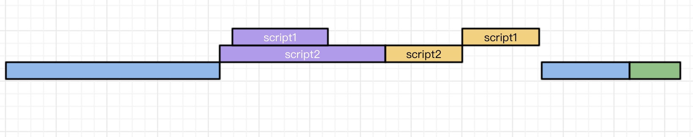
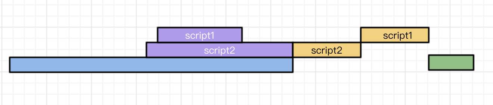
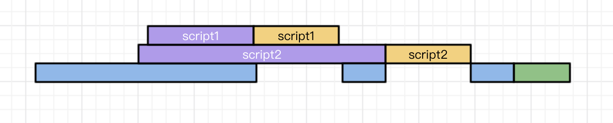

 # js请求相关问题

- [获取图片上传进度](#获取图片上传进度)
- [websocket](#websocket)
- [即时通讯](#即时通讯)
- [js异步加载](js异步加载)
- [url的含义](#url的含义)
- [跨域](#跨域)
- [CORS指定多个域名](#CORS指定多个域名)
- [ajax](#ajax)
- [async 和 await 的继发和并发问题](#async和await的继发和并发问题)
- [fetch](#fetch)
- [get/post请求方式](#get/post请求方式)

---

### 获取图片上传进度

1. 参考链接：

   [XHR 简介](https://www.cnblogs.com/syfwhu/p/6116323.html)

   [深入理解 ajax 系列第一篇——XHR 对象](https://www.cnblogs.com/yibutian/p/9456248.html)

   [XMLHttpRequest](https://developer.mozilla.org/zh-CN/docs/Web/API/XMLHttpRequest)

   [使用原生 JS 或 jquery ajax 获取上传图片实时进度](https://segmentfault.com/a/1190000012871456)

   [JS、JQ 实现图片上传，文件上传、带进度条上传的几种方法](https://blog.csdn.net/qq_38740171/article/details/82999793)

   [前端面试手写题有备无患](https://juejin.im/post/5e9d0913f265da47f85df937#heading-13)

2. 详解：

   - 常用只读属性：

     (1) XMLHttpRequest.readyState 返回 unsigned short，状态码:

     - 0 UNSENT 代理被创建，但尚未调用 open() 方法。
     - 1 OPENED open() 方法已经被调用。
     - 2 HEADERS_RECEIVED send() 方法已经被调用，并且头部和状态已经可获得。
     - 3 LOADING 下载中,responseText 属性已经包含部分数据。
     - 4 DONE 下载操作已完成。

     (2) XMLHttpRequest.response 返回 ArrayBuffer、Blob、Document、DOMString，具体是哪种类型取决于 XMLHttpRequest.responseType 的值。其中包含响应体 body。

     (3)XMLHttpRequest.responseText 返回 string 或 null

     (4)XMLHttpRequest.responseURL 返回响应的序列化 URL

     (5)XMLHttpRequest.responseXML 返回一个 Document，其中包含该请求的响应

     - 如果响应的内容类型是'text/xml'或'application/xml'，这个属性中将保存着响应数据的 XML DOM 文档(document 形式)

     (6)XMLHttpRequest.status 返回 unsigned short，请求响应状态

     - UNSENT（未发送） 0
     - OPENED（已打开） 0
     - LOADING（载入中） 200
     - DONE（完成） 200

     (7)XMLHttpRequest.statusText 返回 string，响应状态文本

     - UNSET
     - OPENED
     - LOADING
     - DONE
     - OK
     - Not Found

   - 常用属性：

     (1) XMLHttpRequest.responseType 响应数据的类型：text、arraybuffer、blob、document、json

   - 常用方法：

     (1)XMLHttpRequest.abort() 中止请求

     (2)XMLHttpRequest.getAllResponseHeaders() 返回所有用 CRLF 分隔的响应头,string 或 null

     ```js
     var request = new XMLHttpRequest();
     request.open("GET", "foo.txt", true);
     request.send();

     request.onreadystatechange = function() {
     if(this.readyState == this.HEADERS_RECEIVED) {

         // Get the raw header string
         var headers = request.getAllResponseHeaders();

         // Convert the header string into an array
         // of individual headers
         var arr = headers.trim().split(/[\r\n]+/);

         // Create a map of header names to values
         var headerMap = {};
         arr.forEach(function (line) {
             var parts = line.split(': ');
             var header = parts.shift();
             var value = parts.join(': ');
             headerMap[header] = value;
         });

         var contentType = headerMap["content-type"];//text/html; charset=utf-8
     }

     /*
     date: Fri, 08 Dec 2017 21:04:30 GMT\r\n
     content-encoding: gzip\r\n
     x-content-type-options: nosniff\r\n
     server: meinheld/0.6.1\r\n
     x-frame-options: DENY\r\n
     content-type: text/html; charset=utf-8\r\n
     connection: keep-alive\r\n
     strict-transport-security: max-age=63072000\r\n
     vary: Cookie, Accept-Encoding\r\n
     content-length: 6502\r\n
     x-xss-protection: 1; mode=block\r\n
     */
     ```

     (3)XMLHttpRequest.getResponseHeader(name) 返回包含指定响应头的字符串,string 或 null，name 如"Content-Type"

     (4)XMLHttpRequest.open(method, url, async, user, password) 初始化一个请求

     - method:get,post,put,delete
     - async:是否异步
     - user 和 password 用于认证

     (5)XMLHttpRequest.overrideMimeType() 重写由服务器返回的 MIME type,默认"text/xml"

     (6)XMLHttpRequest.send() 发送请求

     (7)XMLHttpRequest.setRequestHeader(header, value) 设置 HTTP 请求头的值

   - 事件：

     (1)onloadstart 开始

     (2)onprogress 数据传输进行中

     (3)onabort 终止

     (4)onerror 失败

     (5)onload 成功

     (6)ontimeout 超时

     (7)onloadend 完成（不论成功与否）

     (8)onreadystatechange readyState 属性发生变化

   - 获取上传图片实时进度

   ```js
   $.ajax({
     url: "URL",
     type: "POST",
     data: data,
     processData: false, //用来回避jquery对formdata的默认序列化，XMLHttpRequest会对其进行正确处理
     contentType: false, //设为false才会获得正确的conten-Type
     xhr: function () {
       //用以显示上传进度
       var xhr = $.ajaxSettings.xhr();
       if (xhr.upload) {
         xhr.upload.addEventListener(
           "progress",
           function (event) {
             var percent = Math.floor((event.loaded / event.total) * 100);
             $("#progress .progress-item").css("width", percent + "%");
           },
           false
         );
       }
     },
     success: function (data) {},
   });

   var xhr = new XMLHttpRequest();
   xhr.open("POST", "url");
   // 上传完成后的回调函数
   xhr.onreadystatechange = function () {
     if (xhr.status === 200) {
       console.log(xhr.responseText);
     } else {
       console.log("上传出错");
     }
   };
   // 获取上传进度
   xhr.upload.onprogress = function (event) {
     console.log(event.loaded);
     console.log(event.total);
     if (event.lengthComputable) {
       var percent = Math.floor((event.loaded / event.total) * 100);
       document.querySelector("#progress .progress-item").style.width =
         percent + "%";
       // 设置进度显示
       console.log(percent);
     }
   };
   xhr.send(data);
   ```

   - 实现 ajax

   ```js
   function ajax({ url, methods, body, headers }) {
     return new Promise((resolve, reject) => {
       let request = new XMLHttpRequest();
       request.open(url, methods);
       for (let key in headers) {
         let value = headers[key];
         request.setRequestHeader(key, value);
       }
       request.onreadystatechange = () => {
         if (request.readyState === 4) {
           if (request.status >= "200" && request.status < 300) {
             resolve(request.responeText);
           } else {
             reject(request);
           }
         }
       };
       request.send(body);
     });
   }
   ```

### websocket

1. 参考链接：

  - [WebSocket 教程](http://www.ruanyifeng.com/blog/2017/05/websocket.html)
  - [WebSocket](https://developer.mozilla.org/zh-CN/docs/Web/API/WebSocket)
  - [Node.js 有难度的面试题，你能答对几个？](https://mp.weixin.qq.com/s/MLp1r3pDa91_EG07uZID-Q)
  - [廖雪峰-WebSocket详解](https://blog.csdn.net/weberhuangxingbo/article/details/105115942)
  - [WebSocket心跳及重连机制](https://www.cnblogs.com/kaicy/p/14696330.html)
  - [WebSocket 的鉴权授权方案](https://www.cnblogs.com/taich-flute/p/11971557.html)
  - [Nodejs实现多房间简易聊天室功能](https://www.jb51.net/article/116659.htm)
  - [「2021」高频前端面试题汇总之计算机网络篇](https://juejin.cn/post/6908327746473033741)

2. 详解

  - 概念

    HTTP 协议通信只能由客户端发起，做不到服务器主动向客户端推送信息，而轮询的效率低，浪费资源，因为必须不停连接，或者 HTTP 连接始终打开，所以产生 websocket，使客户端和服务器能平等对话。

    WebSocket并不是全新的协议，而是利用了HTTP协议来建立连接。WebSocket连接必须由浏览器发起，因为请求协议是一个标准的HTTP请求。

    客户端请求
    ```txt
    GET ws://localhost:3000/ws/chat HTTP/1.1
    Host: localhost
    Upgrade: websocket
    Connection: Upgrade
    Origin: http://localhost:3000
    Sec-WebSocket-Key: client-random-string
    Sec-WebSocket-Version: 13
    ```

    服务端响应
    ```txt
    HTTP/1.1 101 Switching Protocols
    Upgrade: websocket
    Connection: Upgrade
    Sec-WebSocket-Accept: server-random-string
    ```

  - 原理

    客户端向 WebSocket 服务器通知（notify）一个带有所有接收者ID（recipients IDs）的事件（event），服务器接收后立即通知所有活跃的（active）客户端，只有ID在接收者ID序列中的客户端才会处理这个事件。​

  - 特点

    1. 支持双向通信，实时性更强
    2. 可以发送文本，也可以发送二进制数据‘’
    3. 建立在TCP协议之上，服务端的实现比较容易
    4. 数据格式比较轻量，性能开销小，通信高效
    5. 没有同源限制，客户端可以与任意服务器通信
    6. 协议标识符是ws（如果加密，则为wss），服务器网址就是 URL
    7. 与 HTTP 协议有着良好的兼容性。默认端口也是80和443，并且握手阶段采用 HTTP 协议，因此握手时不容易屏蔽，能通过各种 HTTP 代理服务器。

  - 与http不同之处

    * GET 请求的地址不是类似/path/，而是以 ws://开头的地址；
    * 请求头 Upgrade: websocket 和 Connection: Upgrade 表示这个连接将要被转换为 WebSocket 连接；
    * Sec-WebSocket-Key 是用于标识这个连接，并非用于加密数据；
    * Sec-WebSocket-Version 指定了 WebSocket 的协议版本。

  - 比http优势

    * 客户端与服务器只需要一个 TCP 连接，比 http 长轮询使用更少的连接
    * webSocket 服务端可以推送数据到客户端
    * 更轻量的协议头，减少数据传输量

  - js 使用方法

    ```js
    var ws = new WebSocket("wss://echo.websocket.org");

    switch (ws.readyState) {
      case WebSocket.CONNECTING:
        // 值为0，表示正在连接
        break;
      case WebSocket.OPEN:
        // 值为1，表示连接成功，可以通信了
        break;
      case WebSocket.CLOSING:
        // 值为2，表示连接正在关闭
        break;
      case WebSocket.CLOSED:
        // 值为3，表示连接已经关闭，或者打开连接失败
        break;
      default:
        // this never happens
        break;
    }

    //连接成功后的回调函数
    ws.onopen = function (event) {
      console.log("Connection open ...");
      ws.send("Hello WebSockets!"); //向服务器发送数据
      //发送blob
      var file = document.querySelector('input[type="file"]').files[0];
      ws.send(file);
      //发送binary
      var img = canvas_context.getImageData(0, 0, 400, 320);
      var binary = new Uint8Array(img.data.length);
      for (var i = 0; i < img.data.length; i++) {
        binary[i] = img.data[i];
      }
      ws.send(binary.buffer);

      //webSocket.bufferedAmount未发送至服务器的字节数
      var data = new ArrayBuffer(10000000);
      socket.send(data);
      if (socket.bufferedAmount === 0) {
        // 发送完毕
      } else {
        // 发送还没结束
      }
    };
    //同上
    ws.addEventListener("open", function (event) {
      ws.send("Hello Server!");
    });

    //从服务器接受到信息时的回调函数
    ws.onmessage = function (event) {
      console.log("Received Message: " + event.data);
      //判断收到的文本类型
      if (typeof event.data === String) {
        console.log("Received data string");
      }
      if (event.data instanceof ArrayBuffer) {
        var buffer = event.data;
        console.log("Received arraybuffer");
      }
      ws.close(); //关闭当前链接
    };

    ws.onerror = function (event) {
      // handle error event
    };

    //连接关闭后的回调函数
    ws.onclose = function (event) {
      console.log("Connection closed.");
      var code = event.code;
      var reason = event.reason;
      var wasClean = event.wasClean;
    };
    ```

  - 鉴权授权

    登录后发放jwt令牌，在连接建立时，检查令牌信息，在每次接收到消息时，检查连接是否已授权过，及授权是否过期，令牌不合法则服务端主动关闭socket连接

    如何防范重放攻击？

    - 可以每次接收信息都更新令牌
    - 可以结合redis，实现 ratelimit，防止高频刷接口，这个可以参考 express-rate-limit
    - 为防止中间人，最好使用wss（TLS）

  - 分配房间

    通过对象保存房间信息，包括房间名、人数等。

    socket.join(room)记录对应房间

    socket.emit广播人员进出情况

  - WebSocket心跳及重连机制

    ```js
    var lockReconnect = false;//避免重复连接
    var wsUrl = "wss://echo.websocket.org";
    var ws;
    var tt;
    //页面初始化，先调用createWebSocket函数
    function createWebSocket() {
      try {
        ws = new WebSocket(wsUrl);
        init();
      } catch(e) {
        console.log('catch');
        reconnect(wsUrl);
      }
    }
    //调用init方法，该方法内把一些监听事件进行封装
    function init() {
      //当网络断开的时候，会先调用onerror，onclose事件可以监听到，会调用reconnect方法进行重连操作。
      ws.onclose = function () {
        console.log('链接关闭');
        reconnect(wsUrl);
      };
      ws.onerror = function() {
        console.log('发生异常了');
        reconnect(wsUrl);
      };
      //正常的情况下，是先调用onopen方法的，当接收到数据时，会被onmessage事件监听到。
      ws.onopen = function () {
        //心跳检测重置
        heartCheck.start();
      };
      ws.onmessage = function (event) {
        //拿到任何消息都说明当前连接是正常的
        console.log('接收到消息');
        heartCheck.start();
      }
    }
    //如果网络断开的话，会执行reconnect方法，使用了一个定时器，4秒后会重新创建一个新的websocket链接，重新调用createWebSocket函数，重新会执行及发送数据给服务器端。
    function reconnect(url) {
      if(lockReconnect) {
        return;
      };
      lockReconnect = true;
      //没连接上会一直重连，设置延迟避免请求过多
      tt && clearTimeout(tt);
      tt = setTimeout(function () {
        createWebSocket(url);
        lockReconnect = false;
      }, 4000);
    }
    //心跳检测
    //每隔一段固定的时间，向服务器端发送一个ping数据，如果在正常的情况下，服务器会返回一个pong给客户端，如果客户端通过onmessage事件能监听到的话，说明请求正常
    var heartCheck = {
      timeout: 3000,
      timeoutObj: null,
      serverTimeoutObj: null,
      start: function(){
        console.log('start');
        var self = this;
        this.timeoutObj && clearTimeout(this.timeoutObj);
        this.serverTimeoutObj && clearTimeout(this.serverTimeoutObj);
        this.timeoutObj = setTimeout(function(){
          //这里发送一个心跳，后端收到后，返回一个心跳消息，
          console.log('55555');
          ws.send("123456789");
          self.serverTimeoutObj = setTimeout(function() {
            console.log(111);
            console.log(ws);
            //我们使用了一个定时器，每隔3秒的情况下，如果是网络断开的情况下，在指定的时间内服务器端并没有返回心跳响应消息，因此服务器端断开了，因此这个时候我们使用ws.close关闭连接，在一段时间后可以通过 onclose事件监听到。因此在onclose事件内，我们可以调用 reconnect事件进行重连操作。
            ws.close();
            // createWebSocket();
          }, self.timeout);

        }, this.timeout)
      }
    }
    createWebSocket(wsUrl);
    ```

  - nodejs 使用方法

    ```js
    var express = require("express");
    var app = express();
    var http = require("http").Server(app);
    var io = require("socket.io")(http);

    io.on("connection", function (socket) {
      socket.on("disconnect", function () {
        //监听用户退出
      });
      socket.on("message", function (clientMessage) {
        //监听用户发布聊天内容
      });
      socket.on("join", function (userName) {
        //用户加入房间
      });
      socket.on("disconnect", function () {
        //用户离开房间
      });
    });
    ```

### 即时通讯

1. 参考链接：

  - [「2021」高频前端面试题汇总之计算机网络篇](https://juejin.cn/post/6908327746473033741)

2. 详解

  1. 短轮询

    浏览器每隔一段时间向浏览器发送 http 请求，服务器端在收到请求后，不论是否有数据更新，都直接进行响应。
    
    这种方式实现的即时通信，本质上还是浏览器发送请求，服务器接受请求的一个过程，通过让客户端不断的进行请求，使得客户端能够模拟实时地收到服务器端的数据的变化。
    
    这种方式的优点是比较简单，易于理解。
    
    缺点是这种方式由于需要不断的建立 http 连接，严重浪费了服务器端和客户端的资源。当用户增加时，服务器端的压力就会变大，这是很不合理的。

  2. 长轮询

    首先由客户端向服务器发起请求，当服务器收到客户端发来的请求后，服务器端不会直接进行响应，而是先将这个请求挂起，然后判断服务器端数据是否有更新。
    
    如果有更新，则进行响应，如果一直没有数据，则到达一定的时间限制才返回。
    
    客户端 JavaScript 响应处理函数会在处理完服务器返回的信息后，再次发出请求，重新建立连接。
    
    长轮询和短轮询比起来，它的优点是明显减少了很多不必要的 http 请求次数，相比之下节约了资源。
    
    长轮询的缺点在于，连接挂起也会导致资源的浪费。

  3. SSE长连接

    服务器使用流信息向服务器推送信息。
    
    严格地说，http 协议无法做到服务器主动推送信息。
    
    但是，有一种变通方法，就是服务器向客户端声明，接下来要发送的是流信息。
    
    也就是说，发送的不是一次性的数据包，而是一个数据流，会连续不断地发送过来。
    
    这时，客户端不会关闭连接，会一直等着服务器发过来的新的数据流，视频播放就是这样的例子。
    
    SSE 就是利用这种机制，使用流信息向浏览器推送信息。
    
    它基于 http 协议，目前除了 IE/Edge，其他浏览器都支持。
    
    它相对于前面两种方式来说，不需要建立过多的 http 请求，相比之下节约了资源。

  4. WebSocket

    该协议允许由服务器主动的向客户端推送信息。
    
    使用 WebSocket 协议的缺点是在服务器端的配置比较复杂。
    
    WebSocket 是一个全双工的协议，也就是通信双方是平等的，可以相互发送消息，而 SSE 的方式是单向通信的，只能由服务器端向客户端推送信息，如果客户端需要发送信息就是属于下一个 http 请求了。

  * 上面的四个通信协议，前三个都是基于HTTP协议的。

  * 性能排序

    WebSocket > 长连接（SEE） > 长轮询 > 短轮询

  * 兼容性

    短轮询 > 长轮询 > 长连接（SEE） > WebSocket

### js异步加载

1. 参考链接：

   - [前端常见 20 道高频面试题深入解析](https://mp.weixin.qq.com/s/jx-4p32EA9cHkDzll3BoYQ)

   - [浅谈script标签中的async和defer](https://www.cnblogs.com/jiasm/p/7683930.html)

2. 详解

   \<script> 标签中增加 async(html5) 或者 defer(html4) 属性,脚本就会异步加载。

   \<script src="../XXX.js"defer></script>

   动态创建 script 标签,并且添加到文档中，JS 文件才会开始下载。

   defer 和 async 的区别在于：

   - defer 要等到整个页面在内存中正常渲染结束（DOM 结构完全生成，以及其他脚本执行完成），在 window.onload 之前执行；

   - async 一旦下载完，渲染引擎就会中断渲染，执行这个脚本以后，再继续渲染。

   - 如果有多个 defer 脚本，会按照它们在页面出现的顺序加载

   - 多个 async 脚本不能保证加载顺序

   普通script/defer/async对比

   * 普通

      

      先渲染页面，遇到js则中断渲染页面，下载js，先遇到则先下载，上个js未下载完，下个js可并发下载，先下载的先执行，所有执行完后继续渲染页面，触发DOMContentLoaded

   * defer

      

      先渲染页面，遇到js则并行下载至所有js下载完，中断渲染页面，按先后执行js，触发DOMContentLoaded

      应用场景：代码依赖DOM或其它js依赖此js，要求DOM解析完毕才执行js，如评论框、代码语法高亮、polyfill

   * async

      

      先渲染页面，遇到js则并行下载至其中一个js下载完成，中断渲染页面至这个js执行完成，执行过程并行下载其它js，页面只在非js执行过程中渲染，继续渲染页面，触发DOMContentLoaded

      应用场景：不关心DOM，不被其它js依赖，如百度统计


### url的含义

1. 参考链接

   百度百科

2. 详解

   http/https 连接协议

   .com/.cn/.net 一级域名

   .com.cn/baidu.com 二级域名

   baike.baidu.com 三级域名

   :8080 端口号

   /a/b/c 路由

   ?key=value&a=b 页面参数

   #tag 标签


### 跨域

1. 参考链接

  [简单的 jsonp 实现 promise](https://blog.csdn.net/weixin_34253126/article/details/92330465)

  [简单透彻理解 JSONP 原理及使用](https://blog.csdn.net/inite/article/details/80333130)

  [同源策略和跨域解决方案](https://www.cnblogs.com/rain-chenwei/p/9520240.html)

  [HTTP访问控制（CORS）](https://developer.mozilla.org/zh-CN/docs/Web/HTTP/Access_control_CORS#Preflighted_requests)

  [localhost:3000 与 localhost:5000 的 cookie 信息是否共享](https://github.com/shfshanyue/Daily-Question/issues/127)

  [「2021」高频前端面试题汇总之浏览器原理篇](https://juejin.cn/post/6916157109906341902/)

2. 详解

  - 同源策略

    同源策略是浏览器的一个安全功能，不同源的客户端脚本在没有明确授权的情况下，不能读写对方资源。跨域请求会被拒绝。同源性的 3 个条件：同协议、同域名、同端口。

    * 主要限制了三个方面：

      * 当前域下的 js 脚本不能够访问其他域下的 cookie、localStorage 和 indexDB。
      * 当前域下的 js 脚本不能够操作访问操作其他域下的 DOM。
      * 当前域下 ajax 无法发送跨域请求。

  - 不受同源策略限制的

    a/script/img/iframe

  - 受到部分限制的

    cookie同ip不同端口，可共享，例如localhost:3000 与 localhost:5000 的 cookie 信息可共享

  - 完全受同源策略限制

    LocalStorage、IndexDB、Ajax

  - 跨域资源共享CORS

    允许浏览器向跨源服务器，发出XMLHttpRequest或Fetch请求,前提是浏览器必须支持这个功能，并且服务器端也必须同意这种"跨域"请求。

    * 服务器配置：
      - Access-Control-Allow-Origin
      - Access-Control-Allow-Methods
      - Access-Control-Allow-Headers
      - Access-Control-Allow-Credentials
      - Access-Control-Max-Age

      发起跨域请求时，如果是简单请求，则不会触发预检，直接发出正常请求。如果是非简单请求，浏览器会帮我们自动触发预检请求，也就是 OPTIONS 请求，用于确认目标资源是否支持跨域，可以避免跨域请求对服务器的用户数据产生未预期的影响。

    * 简单请求(满足以下所有条件)
      - method:get/post/head
      - 除了被用户代理自动设置的首部字段（例如 Connection ，User-Agent）和在 Fetch 规范中定义为 禁用首部名称 的其他首部，允许人为设置的字段为 Fetch 规范定义的 对 CORS 安全的首部字段集合。该集合为：
        - Accept
        - Accept-Language
        - Content-Language
        - Content-Type 值仅限于下列三者之一:
          - text/plain
          - multipart/form-data
          - application/x-www-form-urlencoded
        - DPR
        - Downlink
        - Save-Data
        - Viewport-Width
        - Width
        - Last-Event-ID

      若不满足以上条件，就属于非简单请求了。
      
    * 简单请求过程

      对于简单请求，浏览器会直接发出CORS请求，它会在请求的头信息中增加一个Orign字段，该字段用来说明本次请求来自哪个源（协议+端口+域名），服务器会根据这个值来决定是否同意这次请求。如果Orign指定的域名在许可范围之内，服务器返回的响应就会多出以下信息头：

      ```txt
      Access-Control-Allow-Origin: http://api.bob.com  // 和Orign一直
      Access-Control-Allow-Credentials: true   // 表示是否允许发送Cookie
      Access-Control-Expose-Headers: FooBar   // 指定返回其他字段的值
      Content-Type: text/html; charset=utf-8   // 表示文档类型
      ```

      如果Orign指定的域名不在许可范围之内，服务器会返回一个正常的HTTP回应，浏览器发现没有上面的Access-Control-Allow-Origin头部信息，就知道出错了。这个错误无法通过状态码识别，因为返回的状态码可能是200。

      在简单请求中，在服务器内，至少需要设置字段：Access-Control-Allow-Origin

    * 非简单请求过程

      非简单请求是对服务器有特殊要求的请求，比如请求方法为DELETE或者PUT等。非简单请求的CORS请求会在正式通信之前进行一次HTTP查询请求，称为预检请求。

      浏览器会询问服务器，当前所在的网页是否在服务器允许访问的范围内，以及可以使用哪些HTTP请求方式和头信息字段，只有得到肯定的回复，才会进行正式的HTTP请求，否则就会报错。

      预检请求使用的请求方法是OPTIONS，表示这个请求是来询问的。他的头信息中的关键字段是Orign，表示请求来自哪个源。除此之外，头信息中还包括两个字段：

        (1)Access-Control-Request-Method：该字段是必须的，用来列出浏览器的CORS请求会用到哪些HTTP方法。

        (2)Access-Control-Request-Headers： 该字段是一个逗号分隔的字符串，指定浏览器CORS请求会额外发送的头信息字段。

      服务器在收到浏览器的预检请求之后，会根据头信息的三个字段来进行判断，如果返回的头信息在中有Access-Control-Allow-Origin这个字段就是允许跨域请求，如果没有，就是不同意这个预检请求，就会报错。

      服务器回应的CORS的字段如下：
      ```txt
      Access-Control-Allow-Origin: http://api.bob.com  // 允许跨域的源地址
      Access-Control-Allow-Methods: GET, POST, PUT // 服务器支持的所有跨域请求的方法
      Access-Control-Allow-Headers: X-Custom-Header  // 服务器支持的所有头信息字段
      Access-Control-Allow-Credentials: true   // 表示是否允许发送Cookie
      Access-Control-Max-Age: 1728000  // 用来指定本次预检请求的有效期，单位为秒
      ```

      只要服务器通过了预检请求，在以后每次的CORS请求都会自带一个Origin头信息字段。服务器的回应，也都会有一个Access-Control-Allow-Origin头信息字段。

      在非简单请求中，至少需要设置以下字段：
      ```txt
      'Access-Control-Allow-Origin'
      'Access-Control-Allow-Methods'
      'Access-Control-Allow-Headers'
      ```

    * 减少OPTIONS请求次数

      OPTIONS请求次数过多就会损耗页面加载的性能，降低用户体验度。所以尽量要减少OPTIONS请求次数，可以后端在请求的返回头部添加：Access-Control-Max-Age：number。它表示预检请求的返回结果可以被缓存多久，单位是秒。该字段只对完全一样的URL的缓存设置生效，所以设置了缓存时间，在这个时间范围内，再次发送请求就不需要进行预检请求了。

    * CORS中传递Cookie的3个条件

      * 在请求中设置 withCredentials

        默认情况下在跨域请求，浏览器是不带 cookie 的。但是我们可以通过设置 withCredentials 来进行传递 cookie.
        ```js
        // 原生 xhr 的设置方式
        var xhr = new XMLHttpRequest();
        xhr.withCredentials = true;
        // axios 设置方式
        axios.defaults.withCredentials = true;
        ```

      * Access-Control-Allow-Credentials 设置为 true
      * Access-Control-Allow-Origin 设置为非 *

    * 跨域请求参考

      ```js
      var invocation = new XMLHttpRequest();
      var url = 'http://bar.other/resources/public-data/';
        
      function callOtherDomain() {
        if(invocation) {    
          invocation.open('GET', url, true);
          invocation.onreadystatechange = handler;
          invocation.send(); 
        }
      }
      var invocation = new XMLHttpRequest();
      ```

      如下是一个需要执行预检请求的 HTTP 请求
      ```js
      var url = 'http://bar.other/resources/post-here/';
      var body = '<?xml version="1.0"?><person><name>Arun</name></person>';
          
      function callOtherDomain(){
        if(invocation)
          {
            invocation.open('POST', url, true);
            invocation.setRequestHeader('X-PINGOTHER', 'pingpong');
            invocation.setRequestHeader('Content-Type', 'application/xml');
            invocation.onreadystatechange = handler;
            invocation.send(body); 
          }
      }
      ```

      服务器收到浏览器跨域请求后，根据自身配置返回对应文件头。若未配置过任何允许跨域，则文件头里不包含 Access-Control-Allow-origin 字段，若配置过域名，则返回 Access-Control-Allow-origin + 对应配置规则里的域名的方式。

      浏览器根据接受到的 响应头里的 Access-Control-Allow-origin 字段做匹配：
      - 若无该字段，说明不允许跨域，抛出错误
      - 若有该字段，则对origin和referer域名做比对：
        - 如果同源，则说明可以跨域，浏览器接受该响应
        - 若不同源，则说明该域名不可跨域，浏览器不接受该响应，抛出错误。

      对于附带身份凭证的请求(带cookie：xhr.withCredentials = true)，服务器不得设置 Access-Control-Allow-Origin 的值为“*”，否则请求将会失败。而将 Access-Control-Allow-Origin 的值设置为具体域名(如http://foo.example)，则请求将成功执行。

  - jsonp

    jsonp 是前端跨域手段，利用 script 可跨域性，请求异域 js，带上回调函数名，异域服务器响应为 函数名(数据)，这样只要本地即可收到函数传入的数据。

    - 实现

      - 原生js版

        ```js
        var script = document.createElement('script');
        script.type = 'text/javascript';
        // 传参一个回调函数名给后端，方便后端返回时执行这个在前端定义的回调函数
        script.src = 'http://www.domain2.com:8080/login?user=admin&callback=handleCallback';
        document.head.appendChild(script);
        // 回调执行函数
        function handleCallback(res) {
            alert(JSON.stringify(res));
        }
        ```

        服务端返回
        ```js
        handleCallback({"success": true, "user": "admin"})
        ```

      - ajax 版

        ```js
        $.ajax({
          type: "get",
          async: false,
          url: "...",
          dataType: "jsonp",
          jsonp: "callback",
          jsonpCallback: "jsonhandle", //回调函数(参数值)
          success: function (data) {},
        });
        ```

      - promise 版

        ```js
        function p(url){
            let json;
            let script = '<script id="jsonp" src="'+url+?callback=fn+'"></script>';
            window.fn = function(data){
                json = data;
            }
            //当script被插入文档中时，src中的资源就会开始加载
            $(body).append(script);

            return new Promise((resolve,reject)=>{
                $("#jsonp").on("load",function(e){
                    resolve(json);
                })
                $("#jsonp").on("error",function(e){
                    reject(json);
                })
            });
        }
        p('http://localhost:8082').then(data=>{
            console.log(data);
            throw('err before then');
        }).catch(err => {
            //可以捕捉到then里的err befor then也可以捕捉到new Promise里的err in promise。
            console.log(err)
        });
        ```

      - Vue axios

        ```js
        this.$http = axios;
        this.$http.jsonp('http://www.domain2.com:8080/login', {
            params: {},
            jsonp: 'handleCallback'
        }).then((res) => {
            console.log(res); 
        })
        ```

        后端node.js代码
        ```js
        var querystring = require('querystring');
        var http = require('http');
        var server = http.createServer();
        server.on('request', function(req, res) {
            var params = querystring.parse(req.url.split('?')[1]);
            var fn = params.callback;
            // jsonp返回设置
            res.writeHead(200, { 'Content-Type': 'text/javascript' });
            res.write(fn + '(' + JSON.stringify(params) + ')');
            res.end();
        });
        server.listen('8080');
        console.log('Server is running at port 8080...');
        ```

  - postMessage

    - 详见 [js基础语法问题.md](./js基础语法问题.md) -> iframe

    - 场景

      - 页面和其打开的新窗口的数据传递
      - 多窗口之间消息传递
      - 页面与嵌套的iframe消息传递
      - 上面三个场景的跨域数据传递

    - 用法

      postMessage(data,origin)
      - data： html5规范支持任意基本类型或可复制的对象，但部分浏览器只支持字符串，所以传参时最好用JSON.stringify()序列化。
      - origin： 协议+主机+端口号，也可以设置为"*"，表示可以传递给任意窗口，如果要指定和当前窗口同源的话设置为"/"。

  - nginx代理跨域

    nginx代理跨域，实质和CORS跨域原理一样，通过配置文件设置请求响应头Access-Control-Allow-Origin…等字段。

    1. nginx配置解决iconfont跨域

      浏览器跨域访问js、css、img等常规静态资源被同源策略许可，但iconfont字体文件(eot|otf|ttf|woff|svg)例外，此时可在nginx的静态资源服务器中加入以下配置。
      ```shell
      location / {
        add_header Access-Control-Allow-Origin *;
      }
      ```

    2. nginx反向代理接口跨域

      跨域问题：同源策略仅是针对浏览器的安全策略。

      服务器端调用HTTP接口只是使用HTTP协议，不需要同源策略，也就不存在跨域问题。

      实现思路：通过Nginx配置一个代理服务器域名与domain1相同，端口不同）做跳板机，反向代理访问domain2接口，并且可以顺便修改cookie中domain信息，方便当前域cookie写入，实现跨域访问。

      ```shell
      #proxy服务器
      server {
          listen       81;
          server_name  www.domain1.com;
          location / {
              proxy_pass   http://www.domain2.com:8080;  #反向代理
              proxy_cookie_domain www.domain2.com www.domain1.com; #修改cookie里域名
              index  index.html index.htm;
              # 当用webpack-dev-server等中间件代理接口访问nignx时，此时无浏览器参与，故没有同源限制，下面的跨域配置可不启用
              add_header Access-Control-Allow-Origin http://www.domain1.com;  #当前端只跨域不带cookie时，可为*
              add_header Access-Control-Allow-Credentials true;
          }
      }
      ```

  - nodejs 中间件代理跨域

    node中间件实现跨域代理，原理大致与nginx相同，都是通过启一个代理服务器，实现数据的转发，也可以通过设置cookieDomainRewrite参数修改响应头中cookie中域名，实现当前域的cookie写入，方便接口登录认证。

    * 非vue框架的跨域 使用node + express + http-proxy-middleware搭建一个proxy服务器。

      前端
      ```js
      var xhr = new XMLHttpRequest();
      // 前端开关：浏览器是否读写cookie
      xhr.withCredentials = true;
      // 访问http-proxy-middleware代理服务器
      xhr.open('get', 'http://www.domain1.com:3000/login?user=admin', true);
      xhr.send();
      ```

      中间件服务器
      ```js
      var express = require('express');
      var proxy = require('http-proxy-middleware');
      var app = express();
      app.use('/', proxy({
          // 代理跨域目标接口
          target: 'http://www.domain2.com:8080',
          changeOrigin: true,
          // 修改响应头信息，实现跨域并允许带cookie
          onProxyRes: function(proxyRes, req, res) {
              res.header('Access-Control-Allow-Origin', 'http://www.domain1.com');
              res.header('Access-Control-Allow-Credentials', 'true');
          },
          // 修改响应信息中的cookie域名
          cookieDomainRewrite: 'www.domain1.com'  // 可以为false，表示不修改
      }));
      app.listen(3000);
      console.log('Proxy server is listen at port 3000...');
      ```

  - vue框架的跨域

    node + vue + webpack + webpack-dev-server搭建的项目，跨域请求接口，直接修改webpack.config.js配置。开发环境下，vue渲染服务和接口代理服务都是webpack-dev-server同一个，所以页面与代理接口之间不再跨域。

    webpack.config.js
    ```js
    module.exports = {
        entry: {},
        module: {},
        ...
        devServer: {
            historyApiFallback: true,
            proxy: [{
                context: '/login',
                target: 'http://www.domain2.com:8080',  // 代理跨域目标接口
                changeOrigin: true,
                secure: false,  // 当代理某些https服务报错时用
                cookieDomainRewrite: 'www.domain1.com'  // 可以为false，表示不修改
            }],
            noInfo: true
        }
    }
    ```

  - document.domain + iframe跨域

    此方案仅限主域相同，子域不同的跨域应用场景。实现原理：两个页面都通过js强制设置document.domain为基础主域，就实现了同域。

    父窗口：(domain.com/a.html)
    ```html
    <iframe id="iframe" src="http://child.domain.com/b.html"></iframe>
    <script>
        document.domain = 'domain.com';
        var user = 'admin';
    </script>
    ```

    子窗口：(child.domain.com/a.html)
    ```html
    <script>
        document.domain = 'domain.com';
        // 获取父窗口中变量
        console.log('get js data from parent ---> ' + window.parent.user);
    </script>
    ```

  - location.hash + iframe跨域

    实现原理：a欲与b跨域相互通信，通过中间页c来实现。 三个页面，不同域之间利用iframe的location.hash传值，相同域之间直接js访问来通信。

    具体实现：A域：a.html -> B域：b.html -> A域：c.html，a与b不同域只能通过hash值单向通信，b与c也不同域也只能单向通信，但c与a同域，所以c可通过parent.parent访问a页面所有对象。

    a.html：(domain1.com/a.html)
    ```html
    <iframe id="iframe" src="http://www.domain2.com/b.html" style="display:none;"></iframe>
    <script>
        var iframe = document.getElementById('iframe');
        // 向b.html传hash值
        setTimeout(function() {
            iframe.src = iframe.src + '#user=admin';
        }, 1000);
        
        // 开放给同域c.html的回调方法
        function onCallback(res) {
            alert('data from c.html ---> ' + res);
        }
    </script>
    ```

    b.html：(.domain2.com/b.html)
    ```html
    <iframe id="iframe" src="http://www.domain1.com/c.html" style="display:none;"></iframe>
    <script>
        var iframe = document.getElementById('iframe');
        // 监听a.html传来的hash值，再传给c.html
        window.onhashchange = function () {
            iframe.src = iframe.src + location.hash;
        };
    </script>
    ```

    c.html：(www.domain1.com/c.html)
    ```html
    <script>
        // 监听b.html传来的hash值
        window.onhashchange = function () {
            // 再通过操作同域a.html的js回调，将结果传回
            window.parent.parent.onCallback('hello: ' + location.hash.replace('#user=', ''));
        };
    </script>
    ```

  - window.name + iframe跨域

    window.name属性的独特之处：name值在不同的页面（甚至不同域名）加载后依旧存在，并且可以支持非常长的 name 值（2MB）。

    a.html：(domain1.com/a.html)
    ```js
    var proxy = function(url, callback) {
        var state = 0;
        var iframe = document.createElement('iframe');
        // 加载跨域页面
        iframe.src = url;
        // onload事件会触发2次，第1次加载跨域页，并留存数据于window.name
        iframe.onload = function() {
            if (state === 1) {
                // 第2次onload(同域proxy页)成功后，读取同域window.name中数据
                callback(iframe.contentWindow.name);
                destoryFrame();
            } else if (state === 0) {
                // 第1次onload(跨域页)成功后，切换到同域代理页面
                iframe.contentWindow.location = 'http://www.domain1.com/proxy.html';
                state = 1;
            }
        };
        document.body.appendChild(iframe);
        // 获取数据以后销毁这个iframe，释放内存；这也保证了安全（不被其他域frame js访问）
        function destoryFrame() {
            iframe.contentWindow.document.write('');
            iframe.contentWindow.close();
            document.body.removeChild(iframe);
        }
    };
    // 请求跨域b页面数据
    proxy('http://www.domain2.com/b.html', function(data){
        alert(data);
    });
    ```

    proxy.html：(domain1.com/proxy.html)中间代理页，与a.html同域，内容为空即可。

    b.html：(domain2.com/b.html)
    ```html
    <script>    
        window.name = 'This is domain2 data!';
    </script>
    ```

  - WebSocket协议跨域

    WebSocket protocol是HTML5一种新的协议。它实现了浏览器与服务器全双工通信，同时允许跨域通讯，是server push技术的一种很好的实现。

    原生WebSocket API使用起来不太方便，我们使用Socket.io，它很好地封装了webSocket接口，提供了更简单、灵活的接口，也对不支持webSocket的浏览器提供了向下兼容。

    前端
    ```html
    <div>user input：<input type="text"></div>
    <script src="https://cdn.bootcss.com/socket.io/2.2.0/socket.io.js"></script>
    <script>
    var socket = io('http://www.domain2.com:8080');
    // 连接成功处理
    socket.on('connect', function() {
        // 监听服务端消息
        socket.on('message', function(msg) {
            console.log('data from server: ---> ' + msg); 
        });
        // 监听服务端关闭
        socket.on('disconnect', function() { 
            console.log('Server socket has closed.'); 
        });
    });
    document.getElementsByTagName('input')[0].onblur = function() {
        socket.send(this.value);
    };
    </script>
    ```

    Nodejs socket后台
    ```js
    var http = require('http');
    var socket = require('socket.io');
    // 启动http服务
    var server = http.createServer(function(req, res) {
        res.writeHead(200, {
            'Content-type': 'text/html'
        });
        res.end();
    });
    server.listen('8080');
    console.log('Server is running at port 8080...');
    // 监听socket连接
    socket.listen(server).on('connection', function(client) {
        // 接收信息
        client.on('message', function(msg) {
            client.send('hello：' + msg);
            console.log('data from client: ---> ' + msg);
        });
        // 断开处理
        client.on('disconnect', function() {
            console.log('Client socket has closed.'); 
        });
    });
    ```

### CORS指定多个域名

1. 参考链接

   [几个常见面试题，工作中也经常用到](https://mp.weixin.qq.com/s/IvWGkm5pn3vjbLUB-SvXkQ)

2. 详解

    根据请求头中的 Origin 来设置响应头 Access-Control-Allow-Origin：

    * 总是设置 Vary: Origin，避免 CDN 缓存破坏 CORS 配置

    * 如果请求头不带有 Origin，证明未跨域，则不作任何处理

    * 如果请求头带有 Origin，证明浏览器访问跨域，根据 Origin 设置相应的 Access-Control-Allow-Origin: Origin

    伪代码
    ```js
    // 获取 Origin 请求头
    const requestOrigin = ctx.get('Origin');

    ctx.set('Vary', 'Origin')

    // 如果没有，则跳过
    if (!requestOrigin) {
      return await next();
    }

    // 设置响应头
    ctx.set('Access-Control-Allow-Origin', requestOrigin)
    ```

### ajax

1. 参考链接

   [Ajax 工作原理及实现步骤](https://blog.csdn.net/qq_29055201/article/details/88798055)

   [总结 - Ajax 工作原理和实现步骤](https://blog.csdn.net/weixin_37580235/article/details/81459282)

2. 详解

   - 描述

     ajax 即为异步的 js 和 xml，在用户和服务器之间加了一个中间层，用于组装信息发送 http(s)请求和接收服务器响应

   - 实现

     ```js
     function ajax(url, data, method='POST', async=true) {
         return new Promise((resolve, reject) {
             // 第一步，创建xmlHttpRequest
             let xhr = new XMLHttpRequest()

             // 第二步，设置请求方式
             xhr.open(method, url, async)
             //设置需要返回的数据类型
             xhr.responseType = 'text';//json,blob,arrayBuffer

             // 第三步， 调用回调函数
             xhr.onreadyStateChange = function() {
                 //0初始化
                 //1请求已提出
                 //2请求已发送
                 //3请求处理中
                 //4请求已完成
                 if (xhr.readyState === 4) {
                     if (xhr.status === 200) {//服务器状态码
                         resolve(xhr.responseText)//响应文本
                         //responseXML响应XML/DOM
                         //responseBody响应主题
                         //responseStream响应数据流
                     } else {
                         reject(xhr.statusText)//状态码对应文本
                     }
                 } else {
                     reject(xhr.statusText)
                 }
             }

             // 第四步， 发送请求
             xhr.send(data)
             //abort()停止当前请求
             //getAllResponseHeaders()所有响应请求头以键值形式返回
             //getResponseHeader("header")返回指定头部值
             //setRequestHeader("header","value")设置请求头一起发送
         })
     }
     ```

### async 和 await 的继发和并发问题

1. 参考链接：

   [浅谈 async/await](https://www.jianshu.com/p/1e75bd387aa0)

   [async 函数的含义和用法](http://www.ruanyifeng.com/blog/2015/05/async.html)

   [面试向：Async/Await 代替 Promise.all()](https://juejin.im/post/5d56f89b518825415d0608be)

   [ECMAScript 6 入门](https://es6.ruanyifeng.com/#docs/async)

   [Async/Await 替代 Promise 的 6 个理由](https://www.cnblogs.com/fundebug/p/6667725.html)

   [字节跳动面试官：请用JS实现Ajax并发请求控制](https://juejin.cn/post/6916317088521027598)

2. 详解：

   - async await

     - 改进 generator 语法，比 promise 更节约代码，能通过 try catch 处理 JSON.parse(await getJSON())错误，条件语句可不再嵌套在 then 中，解决继发执行处理回调嵌套问题(根据 promise1 的结果请求 promise2 的结果再请求 promise3 的结果)，解决链式调用 then 无法找出错误地方的问题
     - async function(){} 表示函数内存在异步操作
     - async 自动将常规函数转换成 Promise，返回值也是一个 Promise 对象
     - await 必须在 async 函数内，如果 async 里面还有一层 function 使用 await，也需声明此函数为 async
     - await promise/function/其它，如果等待的不是 Promise 对象，则转 promise 后返回该值本身
     - await 强制下面代码等待，直到 Promise 对象 resolve(即使 await 其它，也需耗时)，得到 resolve 的值作为 await 表达式的运算结果

       ```js
       //继发关系比较耗时
       async function dbFuc(db) {
         let foo = await getFoo();
         let bar = await getBar();
       }
       //应该采用并发
       async function dbFuc(db) {
         // 写法一
         let [foo, bar] = await Promise.all([getFoo(), getBar()]);
         // 写法二
         let fooPromise = getFoo();
         let barPromise = getBar();
         let foo = await fooPromise;
         let bar = await barPromise;
       }
       //完整样例
       let func1 = () => {
         return new Promise((res, rej) => {
           setTimeout(() => {
             res(1);
           }, 3000);
         });
       };
       let func2 = () => {
         return new Promise((res, rej) => {
           setTimeout(() => {
             res(2);
           }, 2000);
         });
       };
       let func3 = () => {
         return new Promise((res, rej) => {
           setTimeout(() => {
             res(3);
           }, 1000);
         });
       };
       let post = async () => {
         let f1Promise = func1();
         let f2Promise = func2();
         let f3Promise = func3();
         let f1 = await f1Promise;
         console.log(f1);
         let f2 = await f2Promise;
         console.log(f2);
         let f3 = await f3Promise;
         console.log(f3);
         return [f1, f2, f3];
       };
       window.onload = () => {
         post().then((data) => {
           console.log(data);
         });
       };
       ```

       带缓冲区的继发请求

       ```js
       let getResult = (time = 1000) => {
         return new Promise((resolve, reject) => {
           setTimeout(() => {
             resolve(time);
           }, time);
         });
       };
       let problem2 = (bufferCount, totalCount) => {
         let myTotalCount = totalCount;
         let myBufferCount = bufferCount;
         let result = [];

         //async await 带缓冲区继发请求，套娃无法错误重发
         let next = async () => {
           myBufferCount--;
           myTotalCount--;
           let response = await getResult(parseInt(Math.random() * 1000));
           result.push(response);
           myBufferCount++;
           console.log("next1", myBufferCount, myTotalCount, result);
           if (myTotalCount > 0) {
             next();
           }
         };
         let perform = async () => {
           myBufferCount--;
           myTotalCount--;
           console.log("perform1", myBufferCount, myTotalCount, result);
           let response = await getResult(parseInt(Math.random() * 1000));
           result.push(response);
           myBufferCount++;
           console.log("perform2", myBufferCount, myTotalCount, result);
           if (myTotalCount > 0) {
             next();
           }
         };
         for (let i = 0; i < bufferCount; i++) {
           perform();
         }

         //promise 带缓冲区继发请求，套娃无法错误重发
         let cb = () => {
           console.log("call cb");
           myBufferCount--;
           myTotalCount--;
           getResult(parseInt(Math.random() * 1000)).then((data) => {
             result.push(data);
             myBufferCount++;
             console.log("cb1", myBufferCount, myTotalCount, result);
             if (myTotalCount > 0) {
               cb();
             }
           });
         };
         let post = () => {
           myBufferCount--;
           myTotalCount--;
           console.log("post1", myBufferCount, myTotalCount, result);
           getResult(parseInt(Math.random() * 1000)).then((data) => {
             result.push(data);
             myBufferCount++;
             console.log("post2", myBufferCount, myTotalCount, result);
             if (myTotalCount > 0) {
               cb();
             }
           });
         };
         for (let i = 0; i < bufferCount; i++) {
           post();
         }

         //setInterval 带缓冲区继发请求，可错误重发，但速度没上面2种快
         let timer = setInterval(() => {
           if (myTotalCount <= 0) {
             clearInterval(timer);
           }
           if (myBufferCount > 0 && myTotalCount > 0) {
             let response = getResult(parseInt(Math.random() * 1000));
             myBufferCount--;
             myTotalCount--;
             response.then((data) => {
               myBufferCount++;
               result.push(data);
               console.log(
                 2,
                 myBufferCount,
                 myTotalCount,
                 result,
                 result.length
               );
             });
           }
           console.log(1, myBufferCount, myTotalCount, result, result.length);
         }, 500);
       };
       problem2(3, 10);
       ```

        ```js
        function multiRequest(urls = [], maxNum) {
          // 请求总数量
          const len = urls.length;
          // 根据请求数量创建一个数组来保存请求的结果
          const result = new Array(len).fill(false);
          // 当前完成的数量
          let count = 0;

          return new Promise((resolve, reject) => {
            // 请求maxNum个
            while (count < maxNum) {
              next();
            }
            function next() {
              let current = count++;
              // 处理边界条件
              if (current >= len) {
                // 请求全部完成就将promise置为成功状态, 然后将result作为promise值返回
                !result.includes(false) && resolve(result);
                return;
              }
              const url = urls[current];
              console.log(`开始 ${current}`, new Date().toLocaleString());
              fetch(url)
                .then((res) => {
                  // 保存请求结果
                  result[current] = res;
                  console.log(`完成 ${current}`, new Date().toLocaleString());
                  // 请求没有全部完成, 就递归
                  if (current < len) {
                    next();
                  }
                })
                .catch((err) => {
                  console.log(`结束 ${current}`, new Date().toLocaleString());
                  result[current] = err;
                  // 请求没有全部完成, 就递归
                  if (current < len) {
                    next();
                  }
                });
            }
          });
        }
        ```

     - 多个异步操作，可 await Promise.all

       ```js
       async function dbFuc(db) {
         let docs = [{}, {}, {}];
         let promises = docs.map((doc) => db.post(doc));

         let results = await Promise.all(promises);
         console.log(results);
       }

       async function dbFuc(db) {
         let docs = [{}, {}, {}];
         let promises = docs.map((doc) => db.post(doc));

         let results = [];
         for (let promise of promises) {
           results.push(await promise);
         }
         console.log(results);
       }
       ```

     - try/catch 可获取 async 函数内，任意 await 的错误，即可满足 其中一个被拒绝，即会暂停，并返回错误信息 的功能
       ```js
       async function asyncAlls(jobs) {
           try {
               // 循环执行
               let results = jobs.map(async job => await job)
               let res = []
               // 组合数组
               for (const result of results) {
                   res.push(await result)
               }
               return res
           } catch (error) {
               //处理error
               return error;//有一个reject,即到这里
           }
       }
       //也可此处处理error
       asyncAlls(jobs).catch((e)=>{...});
       ```

     - 失败重试maxRequest次再reject

        ```js
        function maxRequest(fn, maxNum) {
            return new Promise((resolve, reject) => {
                if (maxNum === 0) {
                    reject('max request number')
                    return
                }
                Promise.resolve(fn()).then(value => {
                    resolve(value)
                }).catch(() => {
                    return maxRequest(fn, maxNum - 1)
                })
            })
        }
        ```

     - async 函数实现

       ```js
       async function fn(args) {
         // ...
       }

       // 等同于
       function fn(args) {
         return spawn(function* () {
           // ...
         });
       }
       function spawn(genF) {
         //genF为*
         return new Promise(function (resolve, reject) {
           const gen = genF();
           function step(nextF) {
             let next;
             try {
               next = nextF();
             } catch (e) {
               return reject(e);
             }
             if (next.done) {
               return resolve(next.value);
             }
             Promise.resolve(next.value).then(
               function (v) {
                 step(function () {
                   return gen.next(v);
                 });
               },
               function (e) {
                 step(function () {
                   return gen.throw(e);
                 });
               }
             );
           }
           step(function () {
             return gen.next(undefined);
           });
         });
       }
       ```

### fetch

1. 参考链接

    [设计模式|开箱即用的项目实战|封装fetch（1）](https://juejin.im/post/5eeec0d8e51d45742b4e44ce#heading-3)

    [fetch-util](https://github.com/Cookieboty/fetch-util)

    [使用 Fetch](https://developer.mozilla.org/zh-CN/docs/Web/API/Fetch_API/Using_Fetch)

    [Fetch](https://www.jianshu.com/p/7762515f8d1a)

    [Fetch API速查表：9个最常见的API请求](https://juejin.cn/post/6900948812396216333)

2. 详解

    * 概念

        fetch是一种HTTP数据请求的方式，是XMLHttpRequest的一种替代方案。
        
        fetch不是ajax的进一步封装，而是原生js，没有使用XMLHttpRequest对象。

    * 用法

        ```js
        fetch(url, {
          body: JSON.stringify(data), // must match 'Content-Type' header
          cache: 'no-cache', // *default, no-cache, reload, force-cache, only-if-cached
          credentials: 'same-origin', // include, same-origin, *omit
          headers: {
            'user-agent': 'Mozilla/4.0 MDN Example',
            'content-type': 'application/json'
          },
          method: 'POST', // *GET, POST, PUT, DELETE, etc.
          mode: 'cors', // no-cors, cors, *same-origin
          redirect: 'follow', // manual, *follow, error
          referrer: 'no-referrer', // *client, no-referrer
        })
        .then(response => response.json()) // parses response to JSON
        .catch(error => console.error('Error:', error))
        .then(response => console.log('Success:', response));
        ```

        ```js
        //使用Fetch API的简单GET请求
        fetch('{url}').then(response => console.log(response));
        //使用Fetch API的简单POST请求
        fetch('{url}', {
          method: 'post'
        }).then(response => console.log(response));
        //在Fetch API中使用授权令牌 (Bearer) 进行GET
        fetch('{url}', {
          headers: {
            'Authorization': 'Basic {token}'
          }
        }).then(response => console.log(response));
        //在Fetch API中使用查询字符串数据进行GET
        fetch('{url}?var1=value1&var2=value2').then(response => console.log(response));
        //在Fetch API中使用CORS进行GET
        fetch('{url}', {
          mode: 'cors'
        }).then(response => console.log(response));
        //在Fetch API中使用授权令牌和查询字符串数据进行POST
        fetch('{url}?var1=value1&var2=value2', {
          method: 'post',
          headers: {
            'Authorization': 'Bearer {token}'
          }
        }).then(response => console.log(response));
        //在Fetch API中使用表单数据进行POST
        let formData = new FormData();
        formData.append('field1', 'value1');
        formData.append('field2', 'value2');
        fetch('{url}', {
          method: 'post',
          body: formData
        }).then(response => console.log(response));
        //在Fetch API中使用JSON数据进行POST
        fetch('{url}', {
          method: 'post',
          headers: {
            'Content-Type': 'application/json'
          },
          body: JSON.stringify({
            'field1': 'value1',
            'field2': 'value2'
          })
        })
        .then(response => console.log(response));
        //在Fetch API中使用JSON数据和CORS进行POST
        fetch('{url}', {
          method: 'post',
          mode: 'cors',
          headers: {
            'Content-Type': 'application/json'
          },
          body: JSON.stringify({
            'field1': 'value1',
            'field2': 'value2'
          })
        })
        .then(response => console.log(response));
        ```

        处理Fetch API请求的结果
        ```js
        fetch(...).then(response => {
          // process the response
        }
        async function getData(){
          let data = await fetch(...);
          // process the response
        }
        //检查Fetch API响应的状态码
        fetch(...).then(response => {
          if (response.status == 200){
            // all OK
          } else {
            console.log(response.statusText);
          }
        });
        //获取Fetch API响应的简单值
        var userId;
        fetch(...)
        .then(response => response.text())
        .then(id => {
            userId = id;
            console.log(userId)
        });
        //转换Fetch API响应的JSON数据
        var dataObj;
        fetch(...)
        .then(response => response.json())
        .then(data => {
            dataObj = data;
            console.log(dataObj)
        });
        //只有在两个Promises都解决后，你才能访问数据
        async function getData(){
            var dataObj;
            const response = await fetch(...);
            const data = await response.json();
            dataObj = data;
            console.log(dataObj);
        }
        ```

    * 封装

        ```js
        import qs from 'qs'//将url的参数转化为object对象

        class Fetch {
            constructor(config = {}) {
                const {
                    cache = 'no-cache', // * default, no-cache, reload, force-cache, only-if-cached
                    credentials = 'same-origin', // include, same-origin, *omit
                    headers = {},
                    mode = 'cors', // no-cors, cors, *same-origin
                    redirect = 'follow', // manual, *follow, error
                    referrer = 'no-referrer', // *client, no-referrer
                    timeOut = 3000, // 超时时间
                    BASE_URL = '',
                    requestType = 'JSON',
                    cacheType = ''
                } = config
                this.FetchConfig = {
                    cache,
                    credentials,
                    headers,
                    mode,
                    redirect,
                    referrer,
                }
                this.config = {
                    timeOut,
                    BASE_URL,
                    requestType,
                }
                this.cacheStorage = cacheType ? new Storage({ type: cacheType }) : ''
                this.dataOperation = {
                    JSON: {
                        headers: {
                            'Content-Type': 'application/json', // 告诉服务器，我们提交的数据类型为 json 格式
                        },
                        formatting(params) {
                            return JSON.stringify(params)
                        }
                    },
                    FormData: {
                        headers: {
                            'Content-Type': 'application/x-www-form-urlencoded' // 告诉服务器，我们提交的数据类型为 FormData 格式
                        },
                        formatting(params) {
                            let _formData = new FormData();
                            Object.keys(params).forEach(key => {
                                _formData.append(key, params[key]);
                            })
                            return _formData
                        }
                    }
                }
            }

            send({ url, params, method = "GET", headers }) {
                // 发送 ajax 请求
                const { BASE_URL } = this.config
                const ajax = new Promise((resolve) => {
                    fetch(BASE_URL ? `${BASE_URL}/${url}` : url, {
                        ...this.config,
                        body: params,
                        headers,
                        method,
                    }).then((response) => {
                        return response.json()
                    }).then((data) => {
                        resolve(data)
                    })
                })
                // 设置超时时间
                const time = new Promise((reject) => {
                    console.log(this.config.timeOut)
                    setTimeout(() => {
                        reject('time out')
                    }, this.config.timeOut);
                })
                return Promise.race([ajax, time])
            }

            preSend({ url, params, headers, method }) {
                const { requestType } = this.config
                const FetchConfig = {
                    ...this.FetchConfig,
                    method,
                    headers: {
                        ...this.dataOperation[requestType].headers,
                        ...headers
                    },
                };
                if (!!params) FetchConfig.body = this.dataOperation[requestType].formatting(params);
                return this.send({
                    url,
                    FetchConfig
                })
            }

            // Get 请求缓存配置
            get({ url, query, headers }) { // 优化 get 请求，添加缓存处理
                const key = query ? `${url}?${qs.stringify(query)}` : url
                if (this.cacheStorage) {
                    if (this.cacheStorage.getItem(key)) {
                        return Promise.resolve(this.cacheStorage.getItem(key))
                    } else {
                        return this.preSend({ url: key, headers, method: 'GET' }).then(data => {
                            this.cacheStorage.setItem(key, data)
                            return data
                        })
                    }
                } else {
                    return this.preSend({ url: key, headers, method: 'GET' })
                }
            }

            post({ url, query, params = {}, headers }) {
                return this.preSend({ url: query ? `${url}?${qs.stringify(query)}` : url, params, headers, method: 'POST' })
            }
        }

        const fetch = new Fetch({ requestType: "JSON", cacheType: 'local' });

        newFetch.get({
            url: 'https://api.github.com/users/octocat',
            params: {
                test: 1
            }
        }).then(data => {
            console.log(data)
        }).catch(err => {
            console.log(err)
        })

        class Storage {
            constructor(props) { // 根据类型跟缓存时间，初始化缓存方法
                const { type, time = 5000 } = props
                this.type = type
                this.time = time
                this.storageType = {
                    local: 'localStorage',
                    session: 'sessionStorage',
                    cookie: 'cookie',
                    indexDb: 'indexDb',
                    nomal: 'nomal'
                }
            }

            setItem(key, value) { // 代理原生缓存方法，添加缓存时间
                window[this.storageType[this.type]].setItem(key, JSON.stringify({
                    value,
                    time: new Date().getTime()
                }));
            }

            getItem(key) { // 代理原生获取缓存方法，根据缓存时间，判断数据是否过期
                try {
                    const { time, value } = JSON.parse(window[this.storageType[this.type]].getItem(key));
                    const now = new Date().getTime()
                    if (now > time + this.time) {
                        window[this.storageType[this.type]].removeItem(key);
                        return null
                    } else {
                        return value
                    }
                } catch (e) {
                    return null
                }
            }
        }
        ```

### get/post请求方式

1. 参考链接

    [postman中 form-data、x-www-form-urlencoded、raw、binary的区别](https://blog.csdn.net/xybelieve1990/article/details/81111786)

    [Postman使用知识整理(一)：get传参，post传参](https://www.cnblogs.com/Runa/p/13522263.html)

    [12 道腾讯前端面试真题及答案整理](https://mp.weixin.qq.com/s/mouL2lrCvttHpMwP4iesKw)

2. 详解

    1. form-data

        multipart/form-data,它会将表单的数据处理为一条消息，以标签为单元，用分隔符分开。既可以上传键值对，也可以上传文件。当上传的字段是文件时，会有Content-Type来说明文件类型；content-disposition，用来说明字段的一些信息。

    2. x-www-form-urlencoded

        application/x-www-from-urlencoded,会将表单内的数据转换为键值对，&分隔。
        
        当form的action为get时，浏览器用x-www-form-urlencoded的编码方式，将表单数据编码为(name1=value1&name2=value2…)，然后把这个字符串append到url后面，用?分隔，跳转到这个新的url。

        当form的action为post时，浏览器将form数据封装到http body中，然后发送到server。这个格式不能提交文件。

    3. raw

        可以上传任意格式的文本，可以上传text、json、xml、html等

    4. binary

        Content-Type:application/octet-stream,只可以上传二进制数据，一次只能上传一个文件

    5. none

        body不设置参数，可在params设置参数

    6. GraphQL

        一种用于API的查询语言。

    7. get/post请求传参长度有什么特点

      * HTTP 协议 未规定 GET 和POST的长度限制
      * GET的最大长度显示是因为 浏览器和 web服务器限制了 URI的长度
      * 不同的浏览器和WEB服务器，限制的最大长度不一样
      * 要支持IE，则最大长度为2083byte，若只支持Chrome，则最大长度 8182byte