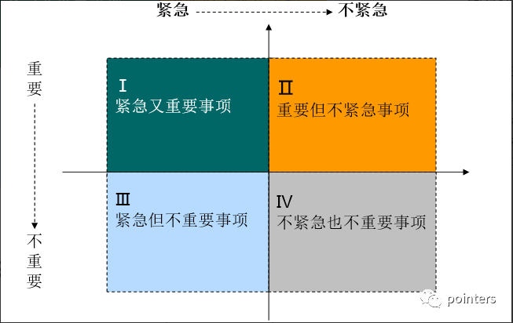

# 职业发展常见问题

- [项目与个人成长](#项目与个人成长)
- [技术业务和产品](#技术业务和产品)
- [技术是业务的工具](#技术是业务的工具)
- [跃升之道](#跃升之道)
- [技术需求文档](#技术需求文档)

---

### 项目与个人成长

1. 参考链接：

   [扪心自问，从菜鸟晋升到专家，是你的结果还是目标](https://juejin.im/post/5e9e3777f265da47c35d9025)

2. 详解：

   - 层级

     1. P4 初级工程师：职场新人不具备独立解决问题的成熟度(做完)
     2. P5 高级工程师：业务执行为主导，在明确的业务、团队目标下，独立的执行完成既定内容的工作(做好)
     3. P6 资深工程师：某块业务的核心接口人、组长，或该业务的职能 PM 角色，技术上有专长(影响业务)
     4. P7 技术专家：一线团队的 TeamLeader，或某方向技术建设的核心中坚、Owner、架构师(成就团队)

   - 瓶颈

     1. 初级到高级（P4 → P5）

        - 1-2 年的瓶颈期

        - 一聊到业务，头脑里最清楚的是需求列表里未来 2、3 周的那些需求；
        - 往往评审时 PRD 也不太认真看，反正做的时候哪里不明白，问问产品或者后端就行了；
        - 自己对接的业务已经挺熟了，该做的功能也基本上都做过一遍，感觉业务做的越发没意思，每天就是各种小修小补，没什么成长的感觉了。

        - 建议：从认知上做转变 —— 做完不等于做到，要对自己有更高的要求，从做完到做好。

          1. 技术上

          - 能考虑并践行代码的语义化、可读性，注释的有效性，合理的利用数据结构、面向对象的设计，而非是面向过程的意识流堆砌代码
          - 考虑函数的单一性、可扩展性
          - 考虑代码的运行时性能
          - 文件之间考虑合理的功能解耦和模块化拆分，核心组件接入单测保证可测试性
          - 引入 \*Lint 优化代码的合规性
          - 考虑代码的可协作性、可维护性
          - 优秀的文档沉淀，不限于业务文档、技术文档、接口文档、流程图

          2. 业务上

          - 角色上有协同执行、核心主程、接口人 PM；
          - 流程上有不同环节的评审、方案、拆解、执行、过程跟进、资源协同、风险控制、复盘总结；
          - 深入度上，业务理解和优先级的判断、业务节奏和技术前置储备、目标对齐和产出 ROI、局部价值和业务大盘；
          - 成本上对人效和质量的认知，具体的应对策略、落地路径；
          - 能力上除了基础的技术能力为代表的专业能力，还有沟通、反馈、协作等为核心的职业能力；

     2. 高级到资深（P5 → P6）

        - 已具备的能力

          1. 优化能力
          2. 各种框架、库熟练运用
          3. 掌握高级 API
          4. 提效、体验或稳定性上能进行技术和工具选型，并指导差异性
          5. 评审时有好的解决方案，能看出产品缺陷

        - 瓶颈

          1. 对自己负责的业务很熟悉也很尽责，但对其他业务了解的并不多，也没有主动去了解的想法；
          2. 比较清楚的知道自己的特长和阶段性能力短板，但对其他同学在做什么、为什么做没有更多的了解；
          3. 知道团队中正在进行的一些建设，但基本是作为旁观者或产出结果的使用者；
          4. 知道自己的绩效目标，但不清楚业务方、协作方的目标；
             比较清晰的知道哪些事是自己的，哪些事不是自己的。

        - 建议：从别人叫你去做什么事，变成你要想去推动什么事。影响他人，并利用自身优势，解决团队问题，并有输出

     3. 资深到专家（P6 → P7）

        - 已具备的能力

          1. 业务角色中，可以影响业务预期，主动推动业务在流程、方案、架构等方面的优化
          2. 技术创新上，能在某个专项主导攻坚并拿到结果
          3. 团队建设上，具备当师兄带新人的能力，也能作为小组组长带动新人的成长
          4. 能够独立的发现问题，且能主动推动着手解决问题。

        - 瓶颈

          1. 具备良好的发现问题、推动和技术攻坚的能力，但往往自己一个人就能搞定了；
          2. 推动和解决的事，往往是针对已有问题的补窟窿、打补丁；
          3. 能很好的解决问题，但没太想过如何能前置性的避免问题。

        - 建议

          1. 空间维度，需要建立一个立体的体系化认知模型，不论是业务支撑策略，还是技术发展策略，都需要建立对应的体系化认知。
          2. 时间维度，需要在深入了解业务、团队的基础上，站在未来看今天，看半年、一年、两年后的业务会是什么阶段，从那时候的业务支撑诉求看今天的体系和团队的能力，谋而后动，前瞻性布局。
          3. 通过 前瞻性 的审视，推动 体系化 的建设和落地，帮助业务和团队持续的带来 改变

     4. 专家到高级专家（P7 → P8）

        - 已具备的能力

          职业相关、团队控盘、维稳劝退、制度流程、培训体系、体力分配、精力分配、梯队搭建、部门外交、技术探索、接班培养、心力强度、职业规划、绩效考核、技术架构、项目管理、业务理解、系统沉淀、能力判定、业务架构、方案能力、向上管理、资源配比、行业影响、价值评判、晋升选拔、基础设施、组织建设、文化氛围、管理工具、人才培育、招聘辨才、团队节奏、团队协同、思维训练、数据能力

          体系化能力

        - 瓶颈

          跨业务、跨部门

        - 建议

          1. 打破职能、业务对自身带来的边界感和惯性。
          2. 不局限于从本职能视角看问题和解决问题。
          3. 不只看到自己部门，局在自己的业务领域跨不出去。
          4. 不局限在通过单一维度的体系能力解决问题，而认知不到其他体系建设的复利价值

   - 业务与技术

     技术的价值在于解决业务问题，“业务支撑” 和 “基础建设” 从来都是同一件事的两个面，这个 “同一件事”，就是帮助业务解决问题。前一个解决业务 “活在当下” 的问题，后一个解决业务 “拥抱未来” 的问题；前一个是对业务诉求的单点式解决，后一个是提供通用方案解决共性普遍问题。都是在用技术的方式解决业务问题，但投入产出比上存在着不同。架构能力和技术创新，从来都是伴随着业务的普遍、共性、高频问题，不会凭空生出。不深入业务，不直面问题，也就谈不上技术成长和创新。

   - 成长

     《庄子·列寇传》有一则寓言，“朱评漫学屠龙于支离益，单千金之家，三年技成而无所用其巧”。 讲的是一个人散尽家资学习屠龙之技，学成却发现世界上本没有龙。对于研发同学，同样会存在从方案出发找场景的问题，如想学习 Node 不知道如何学习，照着书中的例子学，最后发现都忘了效果很不好。没有一个作家是看小说看成的，也没有一个语言学家是看字典看成的，同理技术专家也不会是通过看技术书籍养成的。在实践中学习，从来都是最快的方式。有价值的事从来都是从业务本身的问题出发。问题就是机会，问题就是长萝卜的坑。

     这个市场永远不缺资源型的执行。快速发展的企业，基本的业务建设支撑，可以通过校园招聘应届新人，或者借助劳务外包的方式解决。对于很多企业来说，花大力气去搞定一个资深工程师、专家甚至高级专家的社招坑，要的是这个人能去推动正确的事情发生，让事情朝着更好的方向推进落地，这要求有能力突破个人的范畴、通过影响他人去一起拿结果。

     公司和管理者能做的，是提供发展的业务、多维度的空间、必要的辅导给到员工。但其中的成长，从来都是员工自己的事。

   - 晋升是一个结果，而非目标

     晋升是一个结果而非目标。绩效好不等于一定能晋升，晋升一定是已有明确的落地结果，自己的工作对这个结果是产生直接、具体且显著的贡献。在这个过程中，体现了像下一个层级那样思考问题，在做下一个层级做的事、并拿到结果。

   - 离职应是个匹配行为，而非冲动

     一如招聘入职，离职也应是个匹配性行为。但很多的离职，是因为正处在当前层级的瓶颈而不自知，如同会有同学拿平台光环和其放大器作用，误认为是自身能力，也会有同学拿瓶颈期的不适当成是平台或空间的问题，但当他自己没具备看清当前问题的认知、没具备打破当前局的能力时，离职换一个平台做缓冲，新工作的 "蜜月期" 一过，同样的问题还是会重新出现。

### 技术业务和产品

1. 参考链接：

   [累死累活做业务，绩效还不怎么样，我只能帮你到这了……](https://juejin.im/post/5eb3cab66fb9a043856f3987)

2. 详解：

   - 业务前端的困境

     1. 产品快速上线，导致插队
     2. 只参加视觉评审，然后排期，对业务目标不清晰，不清楚有没更好的实现方法
     3. 每天忙于小修小改
     4. 祖传代码老旧坑多

   - 一系列的改进办法

     1. 技术重构
     2. 联调数据中台
     3. 性能优化

   - 说服 boss 的一系列问题

     1. 为什么要做？（有什么业务价值？有什么技术价值？）
     2. 为什么是现在做？
     3. 为什么是你做？
     4. ROI（投入产出比）怎么样？
     5. 怎么做？（体系化、全链路、单点技术挑战）
     6. 有什么业务和技术结果？能否被复用？
     7. 未来规划（能否跟 BU 或集团的方案联动、共建）

   - 为什么要学习业务?

     1. 搞清楚业务方需求，看需求是否合理，是否有快速解决的方案
     2. 全局规划，了解痛点
     3. 禽兽制作口碑良好的产品，有成就感

   - 你了解业务吗？

     1. 业务做的是什么？产品大图有吗？
     2. 业务的核心指标是什么？KPI 目标是什么，这些数字背后的含义是什么？要达成这些目标，业务策略是什么？
     3. 业务的用户是谁？流量怎么分层？占比多少？分别在业务中是怎样的定位？
     4. 业务的商业模式？靠什么吸引流量，盈利模式是怎样的？
     5. 我们做的页面是什么东西？为业务带来什么价值？要创造更多的价值，我们可以做什么？

   - 如何学习业务?

     1. 业务领域书籍阅读
     2. 与业务、运营、策划、产品、boss、用户多交流，了解业务的过去、现在、未来、愿景、财年规划，以及对技术的期望
     3. 间读合作方（运营、产品、研发）的周报，了解现在在发生什么
     4. 了解业务目标、落地策略、衡量目标的数据口径，关注数据，关注目前做的项目是否为了达成目标而战，如果不是，提出你的想法和建议
     5. 多参会，建立产品 sense。收集信息最好的方式就是参加所处业务老大的 KO 会，各种 KO 会会把战略上的拆解和背后的思考整体梳理之后宣讲传达给 BU(business unit) 或部门
     6. 谨记数字指标，其很大程度已经涵盖了这个业务价值方向，可以作为和业务方以及产品“平等对话”的源头
     7. 总结分析目标、价值、收益，使用最优方案实现业务
     8. 记录项目不足之处，如迭代效率和质量、沟通和联调、方案的合理性等，给出改进方案
     9. 总结业务方的靠谱程度，频繁争取资源上线，但效果不好的的业务方，需要小心留意
     10. 每天记录耗时在哪里、要吐槽的地方、自己和他人遇到什么问题
     11. 技术交流，寻找借力的地方，不要重复造轮子，快速验证方向的正确性，利用好各种工具和框架，站在巨人的肩膀上
     12. 通盘考虑，解决单点问题可能受益不大，例如 SEO 的问题，不仅有前端性能优化这个途径，还可以优化关键词、长尾词等文案的方式，提高爬虫效率

   - 技术深度

     1. 技术分为知识和能力，知识表示知道有这么一回事，能力表示能够熟练使用并提高效率
     2. 培养技术视野，对新技术写个 demo，看看是否有价值，关注各公司的解决方案，无需深入掌握，但能借力实现
     3. 体系化思维，有专精的技术，从此核心发散思维，形成体系，根据体系链路分析问题
     4. 技术跨界，多技能发展
     5. 个人精力不足总会导致技术瓶颈，学会与业务共赢

### 技术是业务的工具

1. 参考链接：

   [一个老程序员的忠告：你这辈子输就输在以为靠技术就能生存下](https://juejin.im/post/6881922448007118856)

2. 详解：

    在中国你千万不要因为学习技术就可以换来稳定的生活和高的薪水待遇，你更不要认为那些从事市场开发，跑腿的人，没有前途。

    在软件上线和开发的关键阶段需要团队的成员没日没夜的加班，如果你不幸加入现场开发的团队你则需要背井离乡告别你的女友，进行封闭开发，你平时除了编码之外就是吃饭和睡觉。

    更可怕的是，会让你接触的人际关系非常单一，也许你拿到了所谓的白领的工资，但你却从此失去享受生活的自由。

    从事售前和市场开发的朋友，有比我们多的多的工作之外的时间，甚至工作时间是和生活的时间兼顾的，可以通过市场开发，认识各个行业的人士，他们更有发财和发展的机会。

    在学习技术的时候千万不要认为如果做到技术最强，就可以成为100%受尊重的人。

    一个人在面试项目经理的时候说了这么一段话：我只用最听话的人，按照我的要求做。只要是听话就要，如果不听话，不管他技术多好也不要。

    等你写过一段时间的代码，你将领略：复制，拷贝，粘贴那样的技术对你来说是何等重要。他们都在把技术人员当作编码的机器来看，你的价值并没有你想象的那么重要。

    技术仅仅是一个工具，善于运用这个工具为别人干活的人，却往往不太擅长用这个工具来为自己创业，因为这是两个概念，训练的技能也是完全不同的。如果创业到了一个快成功的阶段，你会这样告诉自己：我干吗要亲自做技术，聘一个人不就行了。

    千万不要拿科举考试样的心态去学习技术,对技术的学习几近的痴迷，想掌握所有的技术，以让自己成为技术领域的权威和专家，以在必要的时候或是心里不畅快的时候到网上对着菜鸟说自己是前辈。

    技术仅仅是一个工具，是你在人生一个阶段生存的工具，你可以一辈子喜欢它，但最好不要一辈子靠它生存。

    掌握技术的唯一目的就是拿它找工作。所以你在学习的时候千万不要去做那些所谓的技术习题或是研究那些冒泡算法，最大数算法了，什么叫干活?

    多培养些自己务实的态度，比如研究一下当地市场目前有哪些软件公司用人，自己离他们的要求到底有多远，自己具体应该怎么做才可以达到他们的要求。等你分析完这些，你就会发现，找工作成功，技术的贡献率其实并没有你原来想象的那么高。

### 跃升之道

1. 参考链接：

   [技术总监7年总结——程序员进阶高管的三次跃升](https://juejin.cn/post/6899990715783184391)

   [技术总监7年吐血总结，送给程序员的7点建议](https://juejin.cn/post/6900386448206200846)

   [技术人必须掌握素质——深度思考](https://mp.weixin.qq.com/s?__biz=Mzg3NzUxMTgwNQ==&mid=2247483826&idx=1&sn=c82601363825ba261b88c0198ee3a91d&chksm=cf2094a0f8571db6b69603ba66b1ac62ef588fc3668ffdcddd4ca2fa62713eb8c614e279290b&scene=21#wechat_redirect)

   [程序员进阶必备能力——晋升之道](https://mp.weixin.qq.com/s?__biz=Mzg3NzUxMTgwNQ==&mid=2247483891&idx=1&sn=24cd8a6abf3b0681179dc5e5e846e0ba&chksm=cf2094e1f8571df70c1e37be4f3a3a81df0165e5e3359006a16ed64730fe9e5cc7fe97c37289&scene=21#wechat_redirect)

   [聊一聊 软件系统中的“热力学第二定律”](https://mp.weixin.qq.com/s?__biz=Mzg3NzUxMTgwNQ==&mid=2247483946&idx=1&sn=7629654c4acf6bd1c5f53639707a9c61&chksm=cf209738f8571e2e66764576dfa494bec92059058c9f2609391ede8c40bc010c167b2d535820&scene=21#wechat_redirect)

   [程序员你应该勇敢说不](https://mp.weixin.qq.com/s?__biz=Mzg3NzUxMTgwNQ==&mid=2247483954&idx=1&sn=4d122f3d2330254f5a5ecca3876c46a8&chksm=cf209720f8571e368d1123e185b30e930c83463496b0a9d8b76aec9ebcffeeb1c3f5155cb1dc&scene=21#wechat_redirect)

   [程序员如何打造个人品牌？](https://mp.weixin.qq.com/s?__biz=Mzg3NzUxMTgwNQ==&mid=2247483962&idx=1&sn=cc73b3d2124fc23d89ccc4c5c612d18c&chksm=cf209728f8571e3e4345d4737029960d1e5c3f7b005fd4c8545a1ac283c086a73e4ca914ede0&scene=21#wechat_redirect)

2. 详解：

  * 技术跃升

    从个人初做者，到个人贡献者，从寻找帮手到自己解决

    1. 目标升级

      定好阶段目标：1年内要完成什么学习，2年内要熟悉什么系统，3年内要提升什么能力

    2. 学习升级

      从系统学习法，升级为多维学习法，在工作中往往只需要集中全力解决一个具体的问题，但这些问题点背后一定有一个较完整和深入的知识结构。工作做完后，还需要继续学习背后的知识结构。

    3. 思考升级

      从简单的思考模式，升级到深度思考。

      工作中我们会面临着诸多疑难问题，你可以凭借经验，把问题解决，但如果新的问题出现时，你却显得束手无策。

      方法论：

      * 对一个问题点连续以5个“为什么”来自问，以追究其根本原因。

        ```txt
        为什么火箭最大直径为3.35米？
        因为运输火箭的火车，需要穿过涵洞，涵洞的宽度决定了火箭的直径。
        火车涵洞宽度是由什么决定的呢？
        铁轨的宽度。
        铁轨的宽度是有什么决定的呢？
        沿袭了电车轨道的宽度。
        电车轨道的宽度又由什么决定的呢？
        沿袭了马车车轮的宽度。
        马车车轮的宽度就是两匹马屁股的宽度。
        ```

      * 逆向思维，不是按照【原因】->【结果】，而是【结果】->【原因】。

        不是考虑对手正在做什么，而是考虑对手不愿意去做的事情。

        开发针对女性用户的东西，应该从女性非常讨厌和忌讳的角度思考。

      * 刻意联系，学以致用

        去饭店吃饭，看着这家饭店的装修，服务员的素质，菜品的搭配，饭店的地理位置，菜品的口味，人流情况等，用上面的分析法，看能不能分析出这家店的经营状况怎么样？这个店是否可以通过逆向思维的方式，增加营业额。

        同学聚会，通过分析他的穿着、眼神、潜意识动作、手机品牌、服装品牌、口头禅等信息，利用上面的分析法，看看能不能推断出他的职业、他的阶层、是否单身

    4. 毅力升级

      你认准的是目标，通过不断地努力，不要轻易放弃，最后我们就会发现，这个赛道只会剩你一个人。

  * 管理跃升

    从技术到管理，从个人到团队，从“自己动手”到“分析问题、分拆问题、分配任务、跟踪进度”(协调、组织、反馈)

    1. 责任升级

      同样是一样事情，不是由你亲自去干，而是由你分配任务给到下属，教练指导下属去完成这个任务，这个任务的结果好坏都是由你来承担。

      作为基层管理者，你需要想方设法的达成目标。

    2. 行动升级

      可能因为你的技术能力突出，被提拔为组长，经理（基层管理者）。

      作为一个新经理，总是会犯的一个错误，就是“总是觉得别人做的不好，自己亲自来”。

      你需要从用脑和手直接行动，升级为用脑指导行动，千万不要替代他们解决问题。

    3. 协作升级

      在个人贡献者时，你的工作关系，比较简单，组内同事和领导。

      当你成为管理者时，你的工作关系，会变得复杂，领导、下属、兄弟同事、外部客户等。

    4. 成就升级

      从个人成就，升级到团队成就。

      人的马斯洛需求模型中，从生理需求、安全需求、社会需求、尊重需求、自我实现层层递进。

      人的追求也是一样，通过自身的努力实现自我追求，这是最基本的追求。这也是个人成就。

      通过你的管理，你的下属持续成长，团队能力越来越强，这就是团队成就。

      如果你感觉被威胁，你觉得你的位置不保了。那你也只能做基层管理者了。

      你代表的就是你的整个团队。你下属的成功，就是你的成功；你下属受到的认可，就是你的认可。

  * 领导跃升

    从局部把控，变为对全局的掌握，领导团队运筹帷幄，披荆斩棘，以弱胜强，最终走向胜利。

    1. 战略升级

      战略是一种长远的规划，是远大的目标，往往规划战略、制定战略、用于实现战略的目标的时间是比较长的。

      战术只为实现战略的手段之一，基层管理者做的就是战术。

      争一时之长短，用战术就可以达到！如果是“争一世之雌雄”，就需要从全局出发去规划，这就是战略！

      从基层管理的战术层面，把事情做正确，升级为战略层面“做正确的事情”。

      基层管理者最重要的职责，就是带领下属更快、更好地达成公司的战略目标。

      而团队领导者，最重要的职责，是制定公司的战略目标。

      要完成什么目标，怎么和供应商合作？规划未来3到5年做什么。

    2. 影响力升级

      影响力是用一种别人所乐于接受的方式，改变他人的思想和行动的能力。

      影响力来源于很多地方，可能是你在公司等级地位，你的技术能力影响，你的个人魅力影响，你的性格特征影响。

      一旦你有了影响力，无论是观点的陈述，障碍的扫除，还是矛盾的化解，这些事情都会轻松搞定。

      你还可以建立公司内的价值观，愿景，并且以身作则，激励团队，可以产生巨大的凝聚力。

  * 其它

    1. 时间管理

      

    2. 软件开发的破窗理论

      软件开发的“破窗”可能是工程师不经意间留下，可能是考虑不周导致，可能是低劣的设计遗留，也可能是错误的需求导致。

      之前我们团队内部重构过代码架构，很多业务都进行了重新设计，但是随着时间的推移，破窗开始出现，后面就迅速就变得难以维护，臃肿。

      不要留着“破窗户”，见到一个就就修一个。如果没有足够多的时间去修复，最好就加上注释或者是打个bug标记，表示这部分代码需要进行修复，防止窗户破的越来越多。

    3. 温水煮青蛙的舒适区

      对渐变的适应性和习惯性，失去了警惕和反抗力。

      大多数的软件系统都会从微不足道的小bug开始，慢性死亡。

      软件项目被各种各样的小bug折腾，只能一天天的延期。

      软件项目中的每一个需求，就像是衣服上破的洞，被打上一个个的补丁，最后已经无法看清软件架构本身的模样，就像已经无法看清衣服本身的颜色。

    4. 自我中心

      程序员在设计、开发时，如果没有做到完全的按照产品经理的需求进行，难免对代码的设计进行反复修改，导致熵增

      程序员正在开发时，随意变更、打乱架构框架，导致代码耦合增大，难以维护

    5. 个人品牌

      个人品牌是指个人拥有的外在形象和内在涵养所传递的独特、鲜明、确定、易被感知的信息集合体。能够展现足以引起群体消费认知或消费模式改变的力量。具有整体性、长期性、稳定性的特性。

      个人品牌的两极法则，要么做第一，要么你做唯一。

      品牌是自身形象的象征，可以积累无形资产——价值功能。

      个人品牌，不附加任何外在条件，不需要任何平台作为背书，它只属于你一个人。为什么有些程序员离开了公司平台就无法生存？为什么有些程序员离职创业就能一呼百应？

      * 打造个人品牌

        1. 未来的规划、定位

          程序员一般有4个方向：技术、管理、创业、项目&产品。

        2. 专业

          例如选择了技术方向，要成为LInux内核专家，那这幢高楼的基石就需要以下这些材料（技术面）铺垫：Linux CPU调度、内存管理、进程管理、存储管理、文件系统、设备管理和驱动、网络通信、系统调用、系统初始化等。在每个技术面中，同样包含了很多技术点，这些技术都是知识盲区，需要提升技术深度。

          你手中握着你的价值，也握着迈向成功的潜能

        3. 曝光

          这个是整个个人品牌中影响最大一点。

          就算你个人能力再强，但他只见过你一次，这对你来说也没啥用，所以曝光要做到以下三个方面：

          1. 一致性

            如果你今天解决了一个技术难题，得到了大家了认可，然后没过几天摆在你面前的更加的问题，你反而举手无措，这叫打破了你的一致性。

          2. 多元化

            树立起自己的个人品牌需要曝光，而且需要多元化途径。

            可以在每周、月、季度，给领导的总结报告中，建立技术能力强or管理能力全面的个人形象，这其实就是你的个人品牌。

            可以在每一次的邮件中，展示出自己的能力，这也是你的个人品牌。

            可以在技术博客中，输出自己的技术经验、管理经验，赢得更多粉丝的关注，建立自己的个人品牌。

            你还可以通过发表b站视频、抖音小视频的方式，传播你自己的个人品牌。

            另外还是可以通过帮助同事解决重大问题，来达到树立个人品牌的目的。

            你需要竭尽所能传播你的信息，扩大你的知名度。你的品牌传播的频率越高、传播的范围越广，目标人群记住它的概率才会越高，你被人们记住的概率才会越大。

          3. 长期化
          
            认识——认知——认同，这就是人与人熟悉的过程，也是每个人接触并熟悉一个品牌的过程。

    6. 金字塔原则

      可以帮助到汇报困难户。

      结论先行，以上统下，归类分组，逻辑递进。先重要后次要，先总结后具体，先框架后细节，先结论后原因，先结果后过程，先论点后论据。

### 技术需求文档

1. 参考链接：

  [技术需求文档，应当这么写！](https://juejin.cn/post/6930567286495379469)

2. 详解：

  * 模板参考

    * 需求名称
    * 基本信息
      * 重要等级：紧急且重要的设为 A、紧急但不重要的设为 B1、重要但不紧急的设为 B2、不重要也不紧急的设为 C 等
      * 发起日
      * 结束日
      * 关键词
      * 需求编号
      * 业务类型
      * 业务名称
      * 提出人
      * 提出人部门
      * 经办人
      * 经办人部门
      * 关注者
    * 详细描述
      * 需求背景
      * 需求描述
      * 交付时间
      * 交付方式
      * 交付要求
      * 注意事项：告警
      * 附加信息：附件
      * 后续补充信息
    * 调研
      * 调研事项：能否实现、能否获取
      * 调研结果
    * 评审
      * 评审事项：是否需要添加监控？是否对现有业务造成影响？是否如期完成？
      * 评审结果
    * 开发实施过程：开发的各关键步骤
    * 阶段验收
    * 测试/数据验证
    * 预发布：更改域名解析
    * 正式上线：服务、数据等是否正常
